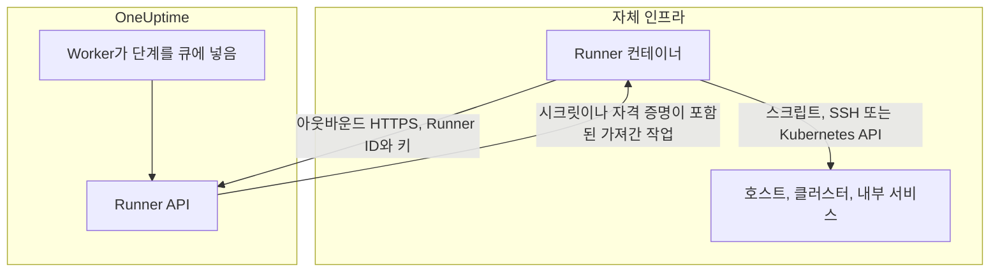
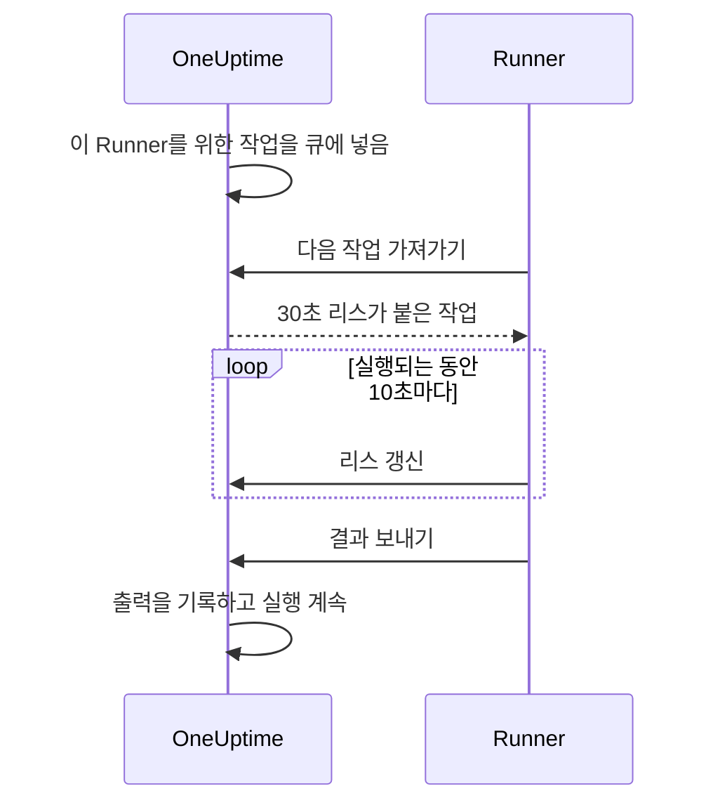

# Runbook 에이전트

대시보드에서 **Runner**라고 부르는 **Runbook 에이전트**는 Runbook의 JavaScript, Bash, SSH, Kubernetes 단계를 **자체 인프라에서** 실행하는 작은 자체 호스팅 프로세스입니다. OneUptime Worker는 스크립트를 실행하지 않습니다. Worker는 스크립트를 큐에 넣고, 단계 작성자가 고른 Runner가 각 작업을 가져가 실행한 뒤 결과를 돌려보냅니다. 이 페이지는 Runner를 설치하고 운영하는 사람을 위한 것입니다.

:::cards
- [Runner 설치](#runner-설치): 대시보드에서 연결된 컨테이너까지 다섯 단계.
- [단계에 Runner 지정](#단계에-runner-지정): 단계를 실행할 Runner에 연결합니다.
- [타임아웃](#타임아웃): claim 타임아웃과 실행 타임아웃, 그리고 둘의 관계.
- [환경 변수](#환경-변수): 컨테이너가 시작할 때 읽는 것.
:::

## 작동 방식



1. OneUptime에서 Runner를 만듭니다. OneUptime이 Runner의 ID와 비밀 키를 생성합니다.
2. 자체 인프라의 호스트에서 그 ID, 키, OneUptime URL로 Runner 컨테이너를 실행합니다.
3. Runner는 5초마다 OneUptime에 작업을 요청하고, 60초마다 살아 있다고 보고합니다.
4. JavaScript, Bash, SSH 또는 Kubernetes 단계를 작성할 때 드롭다운에서 Runner를 고릅니다. 단계는 그 Runner에 연결됩니다.
5. 단계가 실행되면 Worker는 `targetAgentId`를 그 Runner로 설정한 작업을 큐에 넣습니다. 그 Runner만 작업을 가져갈 수 있습니다.
6. Runner는 작업을 로컬에서 실행하고(Bash는 `bash -c <script>`, JavaScript는 `isolated-vm` 샌드박스, SSH와 Kubernetes는 단계의 자격 증명으로 SSH 연결 또는 클러스터 API 서버 호출), 결과를 기록해 돌려보냅니다. Worker는 그 결과로 Runbook을 재개합니다.

Runner에는 OneUptime 인스턴스로 가는 **아웃바운드 HTTPS**만 있으면 됩니다. 인바운드 연결은 받지 않습니다.

Runner가 가진 것은 자신의 ID와 키뿐입니다. 나머지는 모두 가져간 작업과 함께 받습니다. 할당된 [Runbook 시크릿](/docs/runbooks/credentials#스크립트용-시크릿)이 채워진 스크립트, 또는 SSH나 Kubernetes 단계가 지정한 [자격 증명](/docs/runbooks/credentials)입니다. 그래서 Runner의 키를 가진 사람은 누구나 그 Runner로 행동할 수 있습니다. 키는 그 Runner에 할당된 자격 증명과 똑같이 다루세요.

## 스크립트를 Runner에서 실행하는 이유

OneUptime Worker에서 스크립트를 실행하는 데에는 두 가지 문제가 있었습니다.

- **신뢰 경계.** Runbook을 작성할 수 있는 사람이면 누구나 Worker가 접근할 수 있는 모든 것에 접근하면서 Worker에서 코드를 실행할 수 있었습니다.
- **도달 범위.** 쓸모 있는 단계 대부분은 OneUptime이 아니라 _자체_ 인프라에 작용합니다("이 서비스를 다시 시작", "내부 데이터베이스에서 레코드 조회").

Runner를 쓰면 이런 단계가 여러분이 관리하는 호스트에서 실행되고, 그 호스트에 무엇을 허용할지 여러분이 정합니다. HTTP 요청과 AI 단계는 자체 네트워크의 무엇도 필요하지 않으므로 계속 Worker에서 실행됩니다.

## 시작하기 전에

- 자체 인프라에 있는 **Docker가 설치된 호스트**. HTTPS로 OneUptime URL에 접근할 수 있고, 단계가 작업하는 시스템에도 접근할 수 있어야 합니다.
- **Runner를 만들 수 있는 역할.** Project Owner, Project Admin, Project Member, Runbook Admin이 만들 수 있습니다. 설정 명령에 포함된 Runner의 키는 Project Owner, Project Admin, Runbook Admin만 볼 수 있습니다.

## Runner 설치

### 1. 에이전트 레코드 만들기

**런북 → Runbook 에이전트**로 가서 새 에이전트를 만듭니다. **Runner 만들기**를 클릭하고 두 단계를 채웁니다.

| 필드 | 단계 | 참고 |
| --- | --- | --- |
| **이름** | **Runner** | 알아보기 쉬운 이름으로, 보통 실행 위치와 접근 범위를 나타냅니다(예: `prod-eu-west-1`). 단계를 작성할 때 고르는 이름입니다. |
| **설명** | **Runner** | 선택 사항. 이 호스트가 무엇에 접근할 수 있는지 한 문장으로. |
| **레이블** | **Runner**(**추가 필드** 아래) | 선택 사항. |
| **런북 실행** | **기능** | 기본적으로 켜져 있습니다. 이 Runner가 Runbook 단계를 가져갈 수 있게 합니다. |
| **AI 코드 수정 실행** | **기능** | 기본적으로 꺼져 있습니다. AI 코드 수정 풀 리퀘스트를 열 수 있게 합니다. [Fix Tasks](/docs/ai/ai-agent)를 참조하세요. |
| **AI 해결 명령 실행** | **기능** | 기본적으로 꺼져 있습니다. AI 자동 해결이 이 Runner에서 정책 검사를 거친 명령을 실행할 수 있게 합니다. SSH 자격 증명이 있는 Runner에서 이것을 켜려면 Runbook 자격 증명을 읽을 권한이 필요합니다. [OneUptime AI의 명령을 실행하는 Runner](/docs/runbooks/credentials#oneuptime-ai의-명령을-실행하는-runner)를 참조하세요. |

Runner는 기능 변경을 다음 하트비트 때 반영하므로 다시 시작할 필요가 없습니다.

### 2. 설치 명령 복사

Runner 행에서 **설정 지침 표시**를 클릭합니다. **런북 에이전트 설정** 대화 상자에 이 Runner의 ID와 키가 이미 들어 있는 `docker run` 명령이 표시됩니다. 같은 명령이 Runner 자체 페이지의 **설정 지침** 아래에도 있습니다.

키를 읽을 수 있는 사람은 Project Owner, Project Admin, Runbook Admin뿐입니다. 다른 모든 사람에게는 명령 대신 "이 런북 에이전트의 키를 볼 수 있는 권한이 없습니다"가 표시됩니다.

### 3. 자체 인프라의 호스트에서 실행

다음을 할 수 있는 환경의 호스트에서 명령을 실행합니다.

- HTTPS로 OneUptime 인스턴스에 접근할 수 있고,
- 단계에 필요한 일, 예를 들어 SSH로 다른 호스트에 접근하거나, 클러스터의 API 서버를 호출하거나, 데이터베이스와 통신할 수 있습니다.

```bash
docker run --name oneuptime-runner --restart unless-stopped \
  -e ONEUPTIME_RUNNER_ID=<runner-id> \
  -e ONEUPTIME_RUNNER_KEY=<runner-key> \
  -e ONEUPTIME_URL=https://oneuptime.yourdomain.com \
  -d oneuptime/runner:release
```

### 4. 에이전트가 연결되었는지 확인

**런북 → Runbook 에이전트**로 돌아갑니다. 컨테이너가 시작된 뒤 1분 안에 Runner의 **상태**가 **연결됨**으로 바뀌고 **마지막 확인**이 새로 고쳐져야 합니다. Runner 자체 페이지의 **런북 에이전트 상태** 카드에는 **런북 에이전트 버전**과 **호스트**가 표시됩니다. 계속 **연결된 적 없음** 또는 **연결 끊김**이 표시되면 [문제 해결](#문제-해결)을 참조하세요.

### 5. 에이전트 최신 상태 유지

에이전트가 OneUptime보다 오래된 버전으로 실행 중이면, 에이전트 페이지의 **런북 에이전트 버전** 옆에 경고 표시가 나타납니다. 그것을 선택하면 업그레이드 방법이 표시됩니다. 새 이미지를 받고 컨테이너를 제거한 다음 2단계의 설치 명령을 다시 실행합니다. Kubernetes 에이전트 차트가 설치한 에이전트는 차트로 업그레이드합니다.

```bash
docker pull oneuptime/runner:release
docker rm -f oneuptime-runner
```

## 단계에 Runner 지정

:::steps
### Runner에서 실행되는 단계 추가

Runbook의 **단계**에 JavaScript, Bash, SSH 또는 Kubernetes 단계를 추가합니다.

### Runner 선택

단계의 **Runner** 드롭다운에는 프로젝트의 모든 Runner와 각 Runner의 연결 여부가 표시됩니다. 프로젝트에 아직 Runner가 없으면 단계가 그렇게 알려 주고 **Runbooks › Runners**를 안내합니다.

### 단계 저장

**Save Steps**를 클릭합니다. 실행이 그 단계에 도달하면 Worker는 그 Runner의 ID로 작업을 큐에 넣고, 그 Runner만 작업을 가져갈 수 있습니다.
:::

Bash는 `bash -c`로 실행됩니다. JavaScript는 Runner의 `isolated-vm` 샌드박스에서 파일 시스템이나 프로세스에 접근하지 않고 실행됩니다. `axios`로 공개 HTTP API를 호출할 수 있지만 사설 네트워크의 주소는 호출할 수 없습니다. SSH와 Kubernetes 단계는 단계가 지정한 [자격 증명](/docs/runbooks/credentials)을 사용하며, 그 자격 증명은 같은 Runner에 할당되어 있어야 합니다.

Runner가 둘 이상 필요한가요? 각각 만들고 각 단계에 알맞은 Runner를 지정하세요. 이중화를 위해서는 Runner를 하나 더 실행해 단계를 나누거나, 단계가 다른 Runner를 가리키는 예비 Runbook을 마련하세요.

## 운영 참고 사항

### 타임아웃

Runner에서 실행되는 모든 단계에는 두 가지 타임아웃이 적용됩니다.

| 타임아웃 | 기본값 | 제어하는 것 |
| --- | --- | --- |
| **Claim timeout** | 2분 | Worker가 선택한 Runner가 작업을 가져가기를 기다리는 시간입니다. Runner가 제시간에 가져가지 않으면 단계는 시간 초과로 실패하고, Runbook은 계속 진행합니다(**실패 시 계속**에 따라 멈출 수도 있습니다). |
| **Execution timeout** | 30초 | Runner가 단계를 멈추기 전까지 실행하게 두는 시간입니다. Bash에는 `SIGKILL`이 보내지고, JavaScript 샌드박스는 정리됩니다. |

둘 다 단계마다 설정할 수 있습니다. **Runbooks › 해당 Runbook › 단계**를 열고 단계를 펼친 다음, 설정에서 **Execution timeout**과 **Claim timeout**(초 단위)을 지정하세요. 기본값을 쓰려면 비워 둡니다. 각각 1초에서 1시간까지 받으며, 범위를 벗어난 값은 단계가 실행될 때 범위 안으로 조정됩니다.

Worker의 전체 대기 시간은 `claim timeout + execution timeout + a few seconds`입니다. 단계에 맞는 값을 고르세요.

claim timeout을 줄일 때 기억할 두 가지:

- Runner는 폴링 주기(`ONEUPTIME_RUNNER_POLL_INTERVAL_MS`, 기본 5초)마다 작업을 요청합니다. 한 주기보다 짧은 claim timeout은 완전히 정상인 Runner가 작업을 보기도 전에 만료될 수 있으며, 그러면 단계는 오프라인 Runner와 같은 메시지로 실패합니다.
- Runner는 기본적으로 한 번에 작업 하나를 실행합니다(`ONEUPTIME_RUNNER_CONCURRENCY`). 긴 단계가 Runner를 차지하는 동안, 같은 Runner를 가리키는 다른 단계는 각자의 claim timeout이 끝날 때까지 기다립니다. execution timeout을 몇 분으로 늘린다면, 그 Runner를 공유하는 단계의 claim timeout도 그만큼 늘리거나 다른 Runner를 주세요.

### 리스와 하트비트



Runner가 작업을 가져가면 짧은 리스(기본 30초)를 받습니다. 단계가 실행되는 동안 Runner는 10초마다 리스를 갱신합니다. 스크립트 도중 Runner가 죽거나 네트워크가 끊기면 리스가 만료되고, Worker는 영원히 기다리는 대신 작업을 `TimedOut`으로 표시합니다.

리스가 만료되어도 Bash 하위 프로세스는 자동으로 취소되지 **않지만**(JavaScript 샌드박스도 끝난다면 끝까지 실행됩니다), Worker는 더 이상 기다리지 않으며, 다른 쪽이 작업을 넘겨받은 뒤에는 Runner가 결과를 제출할 수 없습니다. 정확히 한 번만 실행되는 것이 중요하다면 다시 실행해도 안전하도록 스크립트를 설계하세요.

### 단계 도중 OneUptime Worker가 다시 시작되면

Runbook 실행은 처음부터 끝까지 하나의 Worker에서 실행되므로, 배포나 충돌이 단계 도중에 실행을 중단시킬 수 있습니다. 그다음 일은 실행을 다시 가져가는지에 따라 달라집니다.

- **재개되는 경우.** 실행을 가져간 Worker는 단계가 이미 만든 작업을 찾아 **그 작업에 다시 연결합니다**. Runner에 스크립트 사본을 하나 더 보내는 대신 그 작업을 기다립니다. Runner가 이미 끝냈다면 기록된 결과를 그대로 씁니다. 단계는 실행 한 번당 Runner에 최대 한 번만 보내집니다.
- **재개되지 않는 경우.** 실행을 다시 가져가지 않으면, 현재 단계의 claim 및 실행 시간 창을 지났을 때 정리 작업이 단계 이름을 담은 메시지와 함께 실행을 `Failed`로 표시합니다. 실행이 `Running`에 멈춰 있는 일은 없습니다.

알 수 없는 것은 Worker가 사라지기 전에 스크립트가 어디까지 진행했는지뿐입니다. 실행 도중이던 단계는 일부만 실행되었을 수 있다는 메모와 함께 실패로 보고됩니다. Runbook을 다시 실행하기 전에 대상 시스템을 확인하세요.

### 온라인 에이전트가 없음

단계가 실행될 때 선택한 Runner가 오프라인이면, 작업은 claim timeout이 지날 때까지 `Pending`으로 기다린 뒤 "No runbook agent picked up this step before the wait window expired."와 함께 단계가 실패합니다. 실제로 Runbook을 실행하기 전에 **Runbook 에이전트** 페이지에서 커버리지를 확인하세요.

### 출력 한도

stdout과 stderr를 합쳐 단계당 **50 KB**로 제한됩니다. 더 긴 출력은 표시와 함께 잘립니다. 전체 로그가 필요하면 스크립트에서 로그 저장소나 객체 저장소에 쓰고 `echo`로 URL을 출력하세요.

### 취소

실행 페이지나 API에서 Runbook 실행을 취소하면 `Pending`, `Claimed`, `Running` 상태의 모든 작업이 즉시 `Cancelled`로 표시됩니다. 이미 스크립트를 실행 중인 Runner는 작업을 끝까지 하지만, 서버는 결과를 받아들이지 않으며 Runbook의 이후 단계는 보내지지 않습니다.

### 동시 실행

각 Runner는 기본적으로 한 번에 작업 하나를 실행합니다. 더 허용하려면 컨테이너에 `ONEUPTIME_RUNNER_CONCURRENCY`를 설정하되, Runner가 그 호스트에서 실행되는 다른 모든 것과 호스트를 공유한다는 점을 기억하세요.

## 환경 변수

Runner는 시작할 때 다음을 읽습니다.

| 변수 | 필수 | 기본값 | 참고 |
| --- | --- | --- | --- |
| `ONEUPTIME_URL` | 예 | — | OneUptime 인스턴스의 기본 URL입니다(예: `https://oneuptime.yourdomain.com`). |
| `ONEUPTIME_RUNNER_ID` | 예 | — | 설정 명령에 들어 있는 Runner의 ID입니다. |
| `ONEUPTIME_RUNNER_KEY` | 예 | — | 설정 명령에 들어 있는 Runner의 비밀 키입니다. |
| `ONEUPTIME_RUNNER_POLL_INTERVAL_MS` | 아니요 | `5000` | Runner가 새 작업을 요청하는 간격입니다. `1000` 미만의 값은 기본값으로 돌아갑니다. |
| `ONEUPTIME_RUNNER_HEARTBEAT_INTERVAL_MS` | 아니요 | `60000` | Runner가 살아 있다고 보고하는 간격입니다. `5000` 미만의 값은 기본값으로 돌아갑니다. |
| `ONEUPTIME_RUNNER_JOB_HEARTBEAT_INTERVAL_MS` | 아니요 | `10000` | Runner가 실행 중인 작업의 리스를 갱신하는 간격입니다. `1000` 미만의 값은 기본값으로 돌아갑니다. |
| `ONEUPTIME_RUNNER_CONCURRENCY` | 아니요 | `1` | 이 Runner에서 동시에 실행할 수 있는 최대 작업 수입니다. |
| `ONEUPTIME_RUNNER_ENABLE_RUNBOOKS` | 아니요 | — | `false`로 설정하면 대시보드 설정과 관계없이 이 Runner가 Runbook 단계를 가져가지 않습니다. 이 변수는 기능을 끄기만 할 수 있습니다. |
| `ONEUPTIME_RUNNER_ENABLE_CODE_FIXES` | 아니요 | — | `false`로 설정하면 대시보드 설정과 관계없이 이 Runner가 AI 코드 수정을 가져가지 않습니다. |
| `ONEUPTIME_RUNNER_ENABLE_AI_COMMANDS` | 아니요 | — | `false`로 설정하면 대시보드 설정과 관계없이 이 Runner가 AI 해결 명령을 실행하지 않습니다. |

## 에이전트 키 교체

키가 유출되면 재설정하세요. 이전 키는 즉시 작동하지 않습니다.

:::steps
### 키 재설정

**런북 → Runbook 에이전트**에서 Runner를 열고 **런북 에이전트 키 재설정**을 클릭한 다음 확인합니다. Runner는 새 키를 받을 때까지 연결하지 못합니다.

### 새 키로 컨테이너 실행

Runner의 **설정 지침**에서 새 명령을 복사하고, 이전 컨테이너를 제거한 다음 같은 호스트에서 새 명령을 실행합니다.

```bash
docker rm -f oneuptime-runner
```

### 다시 연결되는지 확인

**런북 → Runbook 에이전트**에서 Runner의 **상태**가 1분 안에 **연결됨**으로 돌아옵니다.
:::

## 권한

에이전트 관리는 기존 Runbooks 권한 그룹에 있습니다.

- `CreateRunner`, `EditRunner`, `DeleteRunner`, `ReadRunner` — 에이전트 레코드를 관리합니다.
- `RunbookAdmin`, `RunbookMember`, `RunbookViewer`(역할) — `RunbookAdmin`은 Runbook, 그 규칙, 그것이 실행되는 Runner를 구성하고 Runbook을 실행합니다. `RunbookMember`는 Runbook과 그 실행을 열고 Runbook을 실행합니다(실행을 시작하고, 단계를 완료하거나 건너뛰고, 실행을 취소합니다). 하지만 Runbook이나 Runner를 만들거나 바꾸거나 삭제하지는 않습니다. `RunbookViewer`는 Runbook과 그 실행을 읽기만 하고 아무것도 실행하지 않습니다. `RunbookAdmin`은 위의 세분화된 권한을 모두 묶은 것입니다.

Runbook을 트리거하려면(즉 단계를 Runner에 보내려면) Runbook을 실행하는 역할(`ProjectOwner`, `ProjectAdmin`, `ProjectMember`, `RunbookAdmin`, `RunbookMember`)이나 `CreateRunbookExecution`이 필요합니다. 실행을 완료, 건너뛰기, 취소할 때는 `EditRunbookExecution`도 받아들입니다. 역할은 그 범위가 미치는 Runbook만 실행합니다.

Runner의 키는 Project Owner, Project Admin, Runbook Admin만 읽을 수 있습니다.

## 에이전트용 API

참고로, Runner는 `/runner-ingest` 아래에 마운트된 다음 엔드포인트를 사용합니다. 통합 이전 경로인 `/runbook-agent-ingest`도 아직 다시 배포되지 않은 에이전트를 위해 계속 제공되므로, 서버를 업그레이드해도 에이전트가 깨지지 않습니다. 인증은 JSON 본문(`agentId`와 `agentKey`) 또는 헤더 `x-agent-id`와 `x-agent-key`에 담은 Runner의 ID와 키로 합니다.

| 엔드포인트 | 용도 |
| --- | --- |
| `POST /heartbeat` | 생존 신호입니다. Runner의 마지막 확인 시각, 버전, 호스트 정보를 갱신하고 프로젝트가 부여한 기능을 돌려줍니다. |
| `POST /claim-next-job` | 이 Runner의 ID를 대상으로 하는 `Pending` 작업 중 가장 오래된 것을 원자적으로 가져갑니다. 할 일이 없으면 `{ job: null }`을 돌려줍니다. |
| `POST /job/:jobId/heartbeat` | 작업의 리스를 갱신합니다. 리스가 만료되었거나 작업이 끝났으면 404를 돌려줍니다. |
| `POST /job/:jobId/result` | 최종 결과를 제출합니다. 리스가 이미 넘어갔으면 무시됩니다. |
| `POST /disconnect` | 정상 종료 시 연결을 끊습니다. |

직접 호출할 필요는 없습니다. 함께 제공되는 Runner가 호출합니다. 여기에 문서화한 것은, 우리 에이전트가 맞지 않는 제약이 있을 때 직접 에이전트를 만들 수 있도록 하기 위해서입니다.

## 문제 해결

:::details Runner가 계속 연결된 적 없음 또는 연결 끊김으로 표시됨
- `docker logs oneuptime-runner`로 컨테이너 로그에서 인증 또는 네트워크 오류를 확인합니다.
- 예를 들어 `curl`로 호스트가 OneUptime URL에 접근할 수 있는지 확인합니다.
- ID와 키가 공백 없이 복사되었는지, `ONEUPTIME_URL`이 OneUptime을 여는 주소와 같은지 확인합니다.

**연결된 적 없음**은 Runner가 한 번도 보고하지 않았다는 뜻입니다. **연결 끊김**은 보고한 적은 있지만 최근 5분 안에는 보고하지 않았다는 뜻입니다.
:::

:::details 단계가 "No runbook agent picked up this step before the wait window expired."로 실패함
단계의 Runner가 claim timeout 안에 작업을 가져가지 않았습니다. Runner가 **연결됨**인지, 그 Runner에서 **런북 실행**이 켜져 있는지, 긴 단계에 묶여 있지 않은지 확인하세요. `ONEUPTIME_RUNNER_CONCURRENCY`를 늘리지 않는 한 Runner는 한 번에 작업 하나를 실행합니다. 폴링 간격보다 짧은 claim timeout도 같은 방식으로 실패합니다.
:::

:::details 단계가 "The runbook agent stopped responding while this step was running."으로 실패함
Runner가 작업을 가져간 뒤 리스 갱신을 멈췄습니다. 충돌했거나, 다시 시작했거나, 네트워크가 끊겼습니다. Runner가 온라인인지 확인한 다음, Runbook을 다시 실행하기 전에 대상 시스템을 확인하세요.
:::

:::details Runner 로그에 "No capability is enabled"가 나옴
이 Runner의 모든 기능이 꺼져 있습니다. OneUptime의 Runner 페이지에서 **런북 실행**을 켜세요. Runner는 다음 하트비트 때 변경을 반영합니다.
:::

## 다음 단계

:::cards
- [Runbook 작성](/docs/runbooks/authoring): Runner에서 실행되는 단계를 작성합니다.
- [Runbook 자격 증명](/docs/runbooks/credentials): SSH와 Kubernetes 단계에 관리되는 접근 권한을 줍니다.
- [Runbook 설정과 안전성](/docs/runbooks/configuration): 한도, 권한, 보안 강화.
:::
