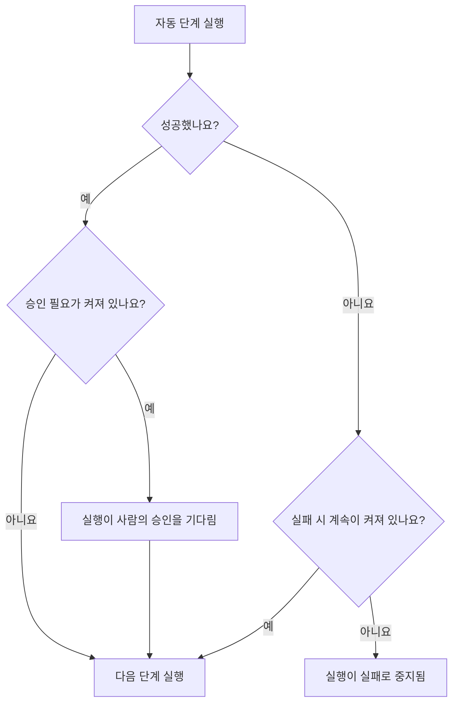

# Runbook 작성

Runbook은 **단계** 페이지에서 순서 있는 단계 목록으로 작성합니다. 이 페이지에서는 Runbook을 만드는 방법, 일곱 가지 단계 유형을 각각 설정하는 방법, 실패와 승인이 실행 흐름을 어떻게 바꾸는지 설명합니다.

:::cards
- [Runbook 만들기](#runbook-만들기): 빈 Runbook부터 저장된 단계까지.
- [단계 유형](#단계-유형): Manual, JavaScript, HTTP request, Bash, SSH, Kubernetes, AI.
- [실패 처리와 승인](#실패-처리와-승인): 단계가 실패하거나 성공하면 어떻게 되는지.
- [따라 해 보는 예](#따라-해-보는-예): 5단계 데이터베이스 페일오버.
:::

## 시작하기 전에

- **Runbook을 작성할 수 있는 역할.** Project Owner, Project Admin, Runbook Admin은 Runbook을 만들고 단계를 저장할 수 있습니다. 세분화된 권한을 쓰는 경우 **Create Runbook**과 **Edit Runbook**이 필요합니다. [권한](/docs/runbooks/configuration#권한)을 참조하세요.
- **JavaScript, Bash, SSH, Kubernetes 단계를 위한 Runner.** 이 단계들은 OneUptime Worker가 아니라 자체 인프라의 [Runner](/docs/runbooks/agents)에서 실행됩니다. 먼저 하나를 설치하세요.
- **SSH와 Kubernetes 단계를 위한 자격 증명과 그것을 읽을 권한.** [Runbook 자격 증명](/docs/runbooks/credentials)을 참조하세요. 단계는 Runbook 자격 증명을 읽을 수 있는 경우에만 자격 증명을 지정할 수 있습니다. Project Owner, Project Admin 또는 **Read Runbook Credential**이 필요하며, Runbook Admin에는 포함되지 않습니다.
- **AI 단계를 위한 LLM 공급자.** [LLM 공급자](/docs/ai/llm-provider)를 참조하세요.

## Runbook 만들기

:::steps
### 런북 열기

**제품 → 런북**을 엽니다. Runbook은 **대시보드 및 자동화** 그룹에 있습니다.

### 새 Runbook 만들기

**런북 만들기**를 클릭하고 **이름**과, 필요하면 Runbook의 용도를 설명하는 **설명**을 입력합니다. **추가 필드** 아래에는 기본적으로 켜져 있는 **활성화됨** 스위치와 **레이블**이 있습니다. 새 Runbook이 목록에 나타나면 엽니다.

### 단계 추가

**단계**로 이동합니다. **Start your runbook** 아래에서 첫 단계의 유형을 고릅니다. 마지막 단계 아래에서는 **Add another step**이 같은 일곱 가지 유형을 보여 줍니다. 각 단계는 **제목**, **설명**(Markdown, 대응자에게 표시됨), 유형별 설정과 함께 열립니다. Runbook에 단계가 하나 있으면 카드 위쪽의 **단계 추가**로 Manual 단계를 추가할 수 있습니다.

### 단계 순서 정하기

단계는 **순서대로** 실행됩니다. 순서를 바꾸려면 단계 머리글 왼쪽의 핸들을 끌어 옮깁니다. 키보드에서는 핸들에 포커스를 두고 Space를 누른 다음, 화살표 키로 단계를 옮기고 Space를 다시 누릅니다.

### 단계 저장

**Save Steps**를 클릭합니다. 저장하기 전까지 편집기에는 **저장되지 않은 변경 사항**이 표시됩니다. 저장하면 **저장됨**이 표시되고 Runbook을 [실행](/docs/runbooks/running)할 준비가 됩니다.
:::

## 단계의 구성

모든 단계에는 다음 필드가 있습니다.

| 필드 | 용도 |
| --- | --- |
| **제목** | 단계 목록과 각 실행에 표시되는 짧은 레이블입니다. |
| **설명** | 대응자를 위한 선택적 맥락이며 Markdown으로 씁니다. Manual 단계에서는 담당자가 읽는 지시 사항입니다. |
| **실패 시 계속** | 자동 단계에만 해당합니다. 켜면 단계가 실패해도 실행이 멈추지 않고 다음 단계가 실행됩니다. |
| **승인 필요** | 자동 단계에만 해당합니다. 켜면 Runbook이 이 단계 다음에 일시 중지하고, 다음 단계를 실행하기 전에 사람이 승인하기를 기다립니다. 스위치 이름은 **다음 단계를 실행하기 전에 승인 필요**입니다. |
| 유형별 설정 | 스크립트, URL, Runner, 자격 증명 또는 프롬프트입니다. [단계 유형](#단계-유형)을 참조하세요. |

## 단계 유형

| 유형 | 실행 위치 | 필요한 것 |
| --- | --- | --- |
| [Manual](#manual) | 사람 | 없음 |
| [JavaScript](#javascript) | Runner | Runner |
| [HTTP request](#http-request) | OneUptime Worker | 없음 |
| [Bash](#bash) | Runner | Runner |
| [SSH](#ssh) | Runner | Runner와 SSH 자격 증명 |
| [Kubernetes](#kubernetes) | Runner | Runner와 Kubernetes 자격 증명 |
| [AI](#ai) | OneUptime Worker | LLM 공급자 |

### Manual

사람을 위한 체크리스트 항목입니다. 실행은 Manual 단계에 도달하면 일시 중지하고, 누군가 **Mark complete** 또는 **건너뛰기**를 클릭할 때까지 `WaitingForManualStep`(**귀하를 기다리는 중**) 상태로 남습니다. 사람을 기다리는 실행은 시간 초과되지 않습니다.

사람만 확인하거나 할 수 있는 일에 사용합니다. "로드 밸런서 대시보드에서 트래픽이 보조 리전으로 전환되었는지 확인하세요."

### JavaScript

OneUptime Worker가 아니라 자체 인프라의 [Runbook 에이전트](/docs/runbooks/agents)에서 `isolated-vm` 샌드박스로 실행되는 JavaScript 코드입니다.

| 필드 | 하는 일 | 기본값 |
| --- | --- | --- |
| **Runner** | 단계를 실행하는 Runner입니다. 이 Runner만 작업을 가져갈 수 있습니다. | — |
| **Script** | 실행할 JavaScript입니다. 값을 기록하려면 `return`으로 반환하세요. `console.log`의 각 줄도 기록됩니다. 오류가 발생하면 단계가 실패합니다. | — |
| **Execution timeout** | Runner가 샌드박스를 정리하기 전까지 코드를 실행하게 두는 시간입니다. | 30초 |
| **Claim timeout** | Worker가 Runner가 작업을 가져가기를 기다리는 시간입니다. | 2분 |

```javascript
const start = Date.now();
// ... your logic ...
console.log("replica lag checked");
return { durationMs: Date.now() - start };
```

샌드박스의 메모리는 128 MB이고 파일 시스템이나 프로세스에 접근할 수 없습니다. `axios`로 HTTP 요청을 보낼 수 있지만 공개 주소로만 보낼 수 있습니다. 사설 네트워크, Runner 자체 호스트, 클라우드 메타데이터 엔드포인트로 가는 요청은 거부됩니다. 자체 네트워크 안의 서비스에 접근하려면 `curl`을 쓰는 [Bash](#bash) 단계를 사용하세요.

### HTTP request

OneUptime Worker가 보내는 아웃바운드 HTTP 호출입니다. Runner가 필요하지 않습니다.

| 필드 | 하는 일 | 기본값 |
| --- | --- | --- |
| **Method** | `GET`, `POST`, `PUT`, `PATCH`, `DELETE` 또는 `HEAD`. | `GET` |
| **URL** | 호출할 엔드포인트입니다. | 비어 있음 |
| **Headers (JSON)** | `{ "Authorization": "Bearer ..." }` 같은 JSON 객체입니다. 유효한 JSON이 아닌 헤더는 단계를 실패시킵니다. | 없음 |
| **Body** | JSON으로 파싱되면 JSON으로, 아니면 텍스트로 보냅니다. | 없음 |
| **Request timeout** | 단계가 실패하기 전까지 엔드포인트의 응답을 기다리는 시간입니다. | 30초 |

단계는 `2xx` 또는 `3xx` 응답이면 성공하고, 그 밖의 응답이면 `HTTP <status>` 오류로 실패합니다. 리디렉션은 따라가지 않습니다. 응답의 상태, 헤더, 본문은 최대 50 KB까지 기록됩니다.

> [!NOTE]
> Worker는 클라우드 메타데이터 엔드포인트 같은 루프백 또는 링크 로컬 주소를 절대 호출하지 않습니다. OneUptime Cloud에서는 공개 주소만 호출합니다. 자체 호스팅 OneUptime은 `DATA_SOURCE_BLOCK_PRIVATE_ADDRESSES`가 `true`가 아닌 한 사설 네트워크에도 접근합니다. OneUptime Cloud에서 자체 네트워크 안의 서비스를 호출하려면 `curl`을 쓰는 [Bash](#bash) 단계를 사용하세요.

용도: PagerDuty 인시던트 열기, Slack 웹훅에 게시, 클라우드 공급자나 자체 공개 API 호출.

### Bash

자체 인프라의 [Runbook 에이전트](/docs/runbooks/agents)에서 `bash -c <script>`로 실행되는 bash 스크립트입니다. Bash는 OneUptime Worker에서 실행되지 않습니다.

| 필드 | 하는 일 | 기본값 |
| --- | --- | --- |
| **Runner** | 단계를 실행하는 Runner입니다. 이 Runner만 작업을 가져갈 수 있습니다. | — |
| **Bash 스크립트** | 스크립트입니다. 출력(stdout과 stderr)은 최대 50 KB까지 기록되며, 0이 아닌 종료 코드는 단계를 실패시킵니다. | — |
| **Execution timeout** | Runner가 `SIGKILL`로 종료하기 전까지 스크립트를 실행하게 두는 시간입니다. 정당한 이유로 몇 분이 걸리는 단계라면 늘리세요. | 30초 |
| **Claim timeout** | Worker가 Runner가 작업을 가져가기를 기다리는 시간입니다. | 2분 |

스크립트는 Runner의 컨테이너에서 이미지에 포함된 도구(`curl`, `wget`, `ssh` 클라이언트 등)와 실행 중인 호스트의 네트워크 접근으로 실행됩니다. 예를 들어 자체 네트워크에서만 접근할 수 있는 서비스를 확인하려면 다음과 같이 합니다.

```bash
set -euo pipefail
HTTP_CODE=$(curl -s -o /tmp/resp.txt -w "%{http_code}" "http://payments.internal:8080/health")
echo "HTTP $HTTP_CODE"
cat /tmp/resp.txt
if [[ "$HTTP_CODE" != "200" ]]; then
  echo "Health check failed"
  exit 1
fi
```

실행이 이 단계에 도달했을 때 선택한 Runner가 오프라인이면, 단계는 **claim timeout**(기본 2분)까지 기다린 뒤 시간 초과로 실패합니다. Bash 단계에 의존하기 전에 **런북 → Runbook 에이전트**에서 에이전트를 추가하세요.

> [!TIP]
> 비밀번호와 토큰을 스크립트에 넣지 마세요. Runbook 시크릿으로 저장하고 Bash나 JavaScript 스크립트에 `{{runbookSecrets.NAME}}`을 쓰면, Runner가 값이 채워진 스크립트를 받습니다. [스크립트용 시크릿](/docs/runbooks/credentials#스크립트용-시크릿)을 참조하세요.

### SSH

Runner가 SSH로 접근할 수 있는 호스트에서 명령 하나를 실행합니다. Bash 단계의 `ssh host cmd`와 달리, 접근 수단은 Runner 디스크의 개인 키가 아니라 관리되는 [자격 증명](/docs/runbooks/credentials)입니다. 자격 증명은 저장 시 암호화되고, 특정 Runner에 할당되며, API로 다시 읽을 수 없습니다.

| 필드 | 하는 일 |
| --- | --- |
| **Runner** | 연결을 여는 Runner입니다. 네트워크를 통해 호스트에 접근할 수 있어야 합니다. |
| **Credential** | 호스트, 포트, 사용자, 키 또는 비밀번호를 가진 SSH 자격 증명입니다. 선택한 Runner에 할당되어 있어야 하며, 그렇지 않으면 잘못된 접근 권한으로 실행되는 대신 단계가 실패합니다. |
| **Command** | 자격 증명의 사용자로 원격 호스트에서 실행됩니다. 출력은 최대 50 KB까지 기록되며, 0이 아닌 종료 코드는 단계를 실패시킵니다. |
| **Execution timeout** | 연결, 인증, 명령 실행을 모두 포함하므로 멈춘 명령이 단계를 계속 붙잡아 둘 수 없습니다. 기본값은 30초입니다. |
| **Claim timeout** | Worker가 Runner가 작업을 가져가기를 기다리는 시간입니다. 기본값은 2분입니다. |

### Kubernetes

클러스터의 워크로드를 다시 시작하거나 확장합니다. 작업은 의도적으로 닫힌 집합입니다. 임의의 객체를 바꿀 수 있는 단계는 클러스터 관리자 셸과 같으며, 이 단계 유형은 흔한 해결 조치를 자동 해결에 쓸 수 있을 만큼 안전하게 만들기 위해 존재합니다.

| 필드 | 하는 일 |
| --- | --- |
| **Runner** | 클러스터의 API 서버를 호출하는 Runner입니다. API 서버에 접근할 수 있어야 합니다. |
| **Credential** | Kubernetes 자격 증명입니다. API 서버의 URL, 서비스 계정 토큰, 클러스터의 CA를 가집니다. 그 서비스 계정은 Runbook에 필요한 것만 허용하는 역할에 바인딩하세요. |
| **작업** | **Restart workload**는 파드 템플릿을 변경해 컨트롤러가 `kubectl rollout restart`처럼 파드를 다시 만들게 합니다. **Scale workload**는 레플리카 수를 설정합니다. |
| **Workload kind** | **Deployment**, **StatefulSet** 또는 **DaemonSet**. |
| **네임스페이스**와 **Workload name** | 작업 대상 워크로드입니다. |
| **레플리카** | 확장할 때만 사용합니다. 0도 허용됩니다. 워크로드를 비우는 것도 정당한 해결 조치입니다. DaemonSet은 노드마다 파드 하나를 실행하므로 확장할 수 없습니다. 대신 다시 시작하세요. |
| **Execution timeout** | Runner가 API 서버가 변경을 받아들이기를 기다리는 시간입니다. 기본값은 30초입니다. |
| **Claim timeout** | Worker가 Runner가 작업을 가져가기를 기다리는 시간입니다. 기본값은 2분입니다. |

API 서버가 변경을 거부하면 서버 자체의 메시지가 단계에 표시되므로, 권한 오류를 보면 어떤 역할 바인딩을 넓혀야 하는지 알 수 있습니다.

### AI

실행 도중 AI에게 분석, 요약 또는 판단을 요청합니다. 응답은 실행에서 단계의 출력이 됩니다. AI 단계는 OneUptime Worker에서 실행되며 Runner가 필요하지 않습니다.

| 필드 | 하는 일 |
| --- | --- |
| **Prompt** | AI가 할 일입니다. 예: "이전 단계의 출력을 검토하고 해결 조치를 계속해도 안전한지 알려 주세요." |
| **LLM provider** | 선택 사항입니다. **Project default**는 프로젝트의 기본 공급자를 사용합니다. 네트워크 밖으로 나가면 안 되는 데이터용 자체 호스팅 모델처럼 특정 모델이 필요한 단계라면 공급자를 고정하세요. [LLM 공급자](/docs/ai/llm-provider)를 참조하세요. |
| **Include previous step context** | 켜면 AI가 이 단계 전에 실행된 단계의 모든 것(제목, 유형, 상태, 출력, 오류 메시지)을 봅니다. 각 단계 출력은 최대 4,000자까지 전달됩니다. |
| **Include trigger context** | 켜면 AI가 실행을 시작한 것을 봅니다. 연결된 인시던트, 알림 또는 예정된 유지 관리 이벤트(설명, 심각도, 현재 상태, 영향받은 모니터, 근본 원인, 상태 타임라인, 공개 메모) 또는 Runbook을 수동으로 실행한 사람입니다. |

AI 단계를 **승인 필요**와 함께 쓰면 사람을 과정에 남겨 둘 수 있습니다. AI가 분석하고, 사람이 응답을 읽고 승인한 뒤에야 다음(해결) 단계가 실행됩니다.

**AI가 절대 보지 않는 것.** AI 단계의 응답은 실행의 단계 출력으로 저장되며, 실행은 Runbook 읽기 권한이 있는 누구나 읽을 수 있어 인시던트보다 독자층이 넓습니다. 그래서 트리거 맥락에서는 **비공개 내부 메모**와 **Slack 및 Microsoft Teams 채널 메시지**를 제외합니다. 이전 단계의 출력은 시크릿(토큰, 키, 자격 증명)이 있는지 검사하고, 모델에 보내기 전에 가립니다. 인시던트 설명에 붙여 넣은 스크린샷 같은 포함된 이미지와 긴 인코딩 데이터도 제외되며, 그 자리에 짧은 메모가 들어갑니다.

AI 단계는 다른 AI 기능과 똑같이 측정되고 청구됩니다. 프롬프트가 없을 때, 프로젝트에서 AI 기능이 꺼져 있을 때, 사용할 수 있는 LLM 공급자가 없을 때, 고정한 공급자를 프로젝트에서 더 이상 쓸 수 없을 때 단계는 이유를 알려 주는 메시지와 함께 실패합니다. 나머지 Runbook을 계속 실행하려면 **실패 시 계속**을 켜세요.

## 실패 처리와 승인



기본적으로 단계가 실패하면 실행이 멈추고, 그 단계의 오류를 이유로 실행이 `Failed`로 표시됩니다. **실패 시 계속**을 켜면 실패가 기록되고 다음 단계가 실행되므로, "이 세 가지를 시도한 뒤 알리기" 같은 Runbook에 잘 맞습니다. **승인 필요**는 단계가 성공한 뒤에 적용됩니다. 누군가 **Approve & continue** 또는 **건너뛰기**를 클릭할 때까지 실행이 그 단계에서 기다립니다.

## 저장과 편집

단계 변경은 **Save Steps**를 클릭할 때 적용됩니다. 각 실행은 시작할 때 찍은 스냅샷으로 동작하므로, 진행 중인 실행은 시작할 때의 단계를 유지하고 편집이 지난 실행의 기록을 바꾸는 일은 없습니다.

## 따라 해 보는 예

"DB primary unreachable"용 Runbook:

| # | 유형 | 하는 일 |
| --- | --- | --- |
| 1 | JavaScript | 구성 서비스에서 현재 프라이머리 호스트를 가져와 기록합니다. |
| 2 | Manual | "보조 서버의 복제 지연이 5초 미만인지 확인하세요." |
| 3 | HTTP request | 페일오버 오케스트레이터 API로 `POST`. |
| 4 | Manual | "쓰기가 이제 새 프라이머리로 가는지 확인하세요." |
| 5 | HTTP request | Slack 웹훅으로 해제 메시지를 `POST`. |

대응자는 1단계가 실행되는 것을 보고, 2단계를 체크하고, 3단계가 실행되는 것을 보고, 4단계를 체크하며, 실행은 5단계로 끝납니다. 각 단계의 출력은 포스트모템용으로 기록됩니다.

## 다음 단계

:::cards
- [Runbook 실행](/docs/runbooks/running): 실행을 시작하고 단계를 완료, 승인 또는 건너뜁니다.
- [Runbook 규칙](/docs/runbooks/rules): 일치하는 인시던트에서 이 Runbook을 자동으로 시작합니다.
- [Runbook 에이전트](/docs/runbooks/agents): 스크립트 단계에 필요한 Runner를 설치합니다.
- [Runbook 자격 증명](/docs/runbooks/credentials): SSH와 Kubernetes 단계에 관리되는 접근 권한을 줍니다.
:::
