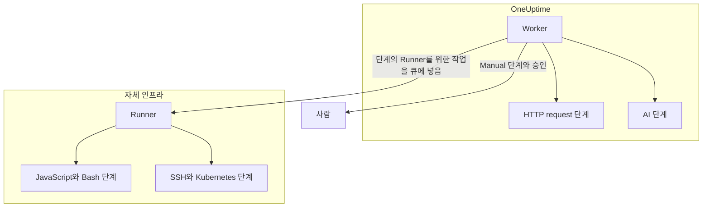

# Runbook 설정과 안전성

운영자와 보안 검토자를 위한 참고 문서입니다. 각 종류의 단계가 어디에서 실행되는지, 단계에 적용되는 한도와 타임아웃, 누가 무엇을 할 수 있는지, Runbook이 어떻게 보안 강화되어 있는지 설명합니다.

:::cards
- [단계 유형별 실행 위치](#단계-유형별-실행-위치): Worker, Runner 또는 사람.
- [출력 한도와 타임아웃](#출력-한도와-타임아웃): 단계에 적용되는 모든 한도.
- [권한](#권한): 세분화된 권한, 세 가지 Runbook 역할, 역할이 닿는 Runbook.
- [보안 강화 참고 사항](#보안-강화-참고-사항): 샌드박스, 네트워크 접근, Runner 인증.
:::

## 단계 유형별 실행 위치

| 단계 유형 | 실행 위치 | 방식 |
| --- | --- | --- |
| Manual | 사람 | 누군가 단계를 완료하거나 건너뛸 때까지 실행이 기다립니다. |
| JavaScript | Runner | `isolated-vm` 샌드박스 안에서. |
| HTTP request | OneUptime Worker | 아웃바운드 HTTP 호출. |
| Bash | Runner | `bash -c <script>`. |
| SSH | Runner | [자격 증명](/docs/runbooks/credentials)을 사용한 SSH 연결. |
| Kubernetes | Runner | 자격 증명을 사용한 클러스터 API 서버 호출. |
| AI | OneUptime Worker | 프로젝트의 LLM 공급자 호출. |

## Runner 단계가 전달되는 방식

JavaScript, Bash, SSH, Kubernetes 단계는 **OneUptime Worker에서 절대 실행되지 않습니다**. 이 단계들은 특정 [Runbook 에이전트](/docs/runbooks/agents)에 작업으로 전달됩니다. Runbook 에이전트는 자체 인프라의 호스트에 설치하는 작은 프로세스입니다.

전달 모델:

1. Runbook 단계 작성자가 단계를 작성할 때 드롭다운에서 Runner를 고릅니다.
2. 단계가 실행되면 Worker는 `targetAgentId`를 그 Runner의 ID로, 상태를 `Pending`으로 설정한 행을 `RunnerJob`에 넣습니다.
3. 바로 그 Runner(그 Runner만)가 작업을 원자적으로 가져가 로컬에서 실행하고(Bash는 `bash -c <script>`, JavaScript는 `isolated-vm` 샌드박스, SSH와 Kubernetes는 단계의 자격 증명 사용) 결과를 돌려보냅니다.
4. Worker는 그 결과로 Runbook을 재개합니다.

`RUNBOOK_BASH_ENABLED` 환경 플래그는 더 이상 없습니다. 이 단계들이 배포에서 작동하는지는 오직 프로젝트에 **런북 실행**이 켜진 연결된 Runner가 있는지에 달려 있습니다.

## 출력 한도와 타임아웃

| 한도 | 값 | 적용 대상 |
| --- | --- | --- |
| 단계당 출력 | **50 KB**. 더 긴 출력은 표시와 함께 잘립니다. | 모든 자동 단계 |
| 실행 타임아웃 | 기본 **30초** | JavaScript, Bash, SSH, Kubernetes 단계 |
| 요청 타임아웃 | 기본 **30초** | HTTP request 단계 |
| Claim 타임아웃 | 기본 **2분**. Worker가 선택한 Runner가 작업을 가져가기를 기다렸다가 실패로 처리하기까지의 시간 | JavaScript, Bash, SSH, Kubernetes 단계 |
| 타임아웃 범위 | **1초에서 1시간** | 모든 타임아웃 |
| 사람을 기다리는 시간 | 제한 없음 | Manual 단계와 승인 |

타임아웃은 Runbook의 **단계** 페이지에서 단계마다 설정합니다. 기본값을 유지하려면 필드를 비워 두세요. 범위를 벗어난 값은 단계가 실행될 때 범위 안으로 조정되므로, 잘못 입력한 설정이 타임아웃을 없애거나 Worker 슬롯을 무기한 붙잡아 둘 수 없습니다.

## 권한

Runbook 권한은 `Runbook` 권한 그룹에 있습니다.

- `CreateRunbook`, `EditRunbook`, `DeleteRunbook`, `ReadRunbook` — Runbook 템플릿을 관리합니다.
- `CreateRunbookExecution`, `EditRunbookExecution`, `DeleteRunbookExecution`, `ReadRunbookExecution` — 실행을 시작하고, 체크하고, 삭제하고, 읽습니다.
- `CreateRunbookRule`, `EditRunbookRule`, `DeleteRunbookRule`, `ReadRunbookRule` — 자동 트리거 규칙을 관리합니다.
- `CreateRunner`, `EditRunner`, `DeleteRunner`, `ReadRunner` — 자체 인프라에서 단계를 실행하는 Runner를 관리합니다. (Runner로 이름이 바뀌기 전에는 `*RunbookAgent`였습니다. 기존 부여는 이전되었으므로 다시 할당할 필요가 없습니다.)
- `RunbookAdmin`, `RunbookMember`, `RunbookViewer`(역할) — `RunbookAdmin`은 Runbook, 그 규칙, 그것이 실행되는 Runner를 구성하고 Runbook을 실행합니다. `RunbookMember`는 Runbook과 그 실행을 열고 Runbook을 실행합니다(실행을 시작하고, 단계를 완료하거나 건너뛰고, 실행을 취소합니다). 하지만 Runbook이나 Runner를 만들거나 바꾸거나 삭제하지는 않습니다. `RunbookViewer`는 Runbook과 그 실행을 읽기만 하고 아무것도 실행하지 않습니다. `RunbookAdmin`은 위의 세분화된 권한을 모두 묶은 것입니다.

역할은 그 범위가 닿는 Runbook을 실행합니다. 일부 레이블로 제한된 `RunbookMember`, `RunbookAdmin` 또는 `ProjectMember` 부여는 그 레이블이 붙은 Runbook의 실행을 시작하고 진행시키며, **Owned**로 제한된 부여는 그 팀이 소유한 Runbook의 실행을 시작하고 진행시킵니다. 팀이 레이블을 차단하면 그 Runbook은 그 팀의 대상에서 빠집니다. `CreateRunbookExecution`과 `EditRunbookExecution`은 레이블이 없는 실행에 관한 권한이므로 프로젝트의 모든 Runbook에 닿습니다. Runbook을 시작하는 해결 제안의 승인도 같은 방식으로 확인합니다.

자격 증명과 시크릿은 `RunbookAdmin` 밖에 있습니다. 이를 관리하려면 `ProjectOwner` 또는 `ProjectAdmin`, 또는 `CreateRunbookCredential`, `EditRunbookCredential`, `DeleteRunbookCredential`, `ReadRunbookCredential`과 `CreateRunbookSecret`, `EditRunbookSecret`, `DeleteRunbookSecret`, `ReadRunbookSecret` 권한이 필요합니다. [Runbook 자격 증명](/docs/runbooks/credentials)을 참조하세요.

**런북 → 설정** 아래의 소유자 규칙과 레이블 규칙도 `RunbookAdmin` 밖에 있습니다. 이를 관리하려면 `ProjectOwner` 또는 `ProjectAdmin`, 또는 `CreateRunbookOwnerRule`과 `CreateRunbookLabelRule` 권한과 각각의 편집, 삭제, 읽기 권한이 필요합니다.

역할과 세분화된 권한이 어떻게 결합되는지는 [사용자, 팀 및 권한](/docs/permissions/index)을 참조하세요.

## 큐와 Worker

Runbook 실행은 `Runbook` BullMQ 큐에서 실행됩니다. 각 Worker 프로세스는 동시에 최대 25개의 실행을 처리합니다. 이 숫자는 코드에 고정되어 있으며 환경 변수로 설정하지 않습니다.

Manual 단계가 API로 체크되면 실행은 다음 단계부터 계속하기 위해 다시 큐에 들어갑니다. Worker가 다시 가져갈 때까지 `Scheduled`로 기다리며, 큐에 있는 실행이 기다린다는 이유로 실패하는 일은 없습니다.

## 보안 강화 참고 사항

- **JavaScript, Bash, SSH, Kubernetes**는 OneUptime Worker가 아니라 여러분이 관리하는 Runner 호스트에서 실행됩니다. JavaScript는 메모리 128 MB의 별도 `isolated-vm` 격리 환경에서 실행되며 Runner의 파일 시스템이나 프로세스에 접근할 수 없습니다. `axios`로 HTTP 요청을 보낼 수 있지만 사설 네트워크, 루프백, 링크 로컬 주소로 가는 요청은 거부됩니다. Bash는 `bash -c`로 실행되며 타임아웃은 Runner에서 적용됩니다.
- **HTTP 단계**는 관대한 상태 검증기를 쓰므로 4xx나 5xx 응답이 예외로 던져지지 않고 실패한 단계로 기록되며, 기록된 출력은 상대편이 실제로 돌려준 내용을 반영합니다. 리디렉션은 따라가지 않습니다. Worker는 클라우드 메타데이터 엔드포인트 같은 루프백 또는 링크 로컬 주소를 절대 호출하지 않습니다. OneUptime Cloud에서는 사설 네트워크 주소도 거부하며, 자체 호스팅 OneUptime은 `DATA_SOURCE_BLOCK_PRIVATE_ADDRESSES=true`일 때 거부합니다.
- **AI 단계**는 인시던트의 비공개 메모나 Slack과 Microsoft Teams 메시지를 절대 보지 않으며, 이전 단계의 출력은 시크릿이 있는지 검사해 모델에 닿기 전에 가립니다. 포함된 이미지와 긴 인코딩 데이터는 프롬프트에서 제외됩니다. [AI](/docs/runbooks/authoring#ai)를 참조하세요.
- **Runner 인증**은 Runner 컨테이너에 환경 변수로 설정한 ID와 비밀 키로 합니다. 서버에서는 제시된 ID와 키에 해당하는 데이터베이스 행에서 Runner의 공식 신원을 가져오므로, 클라이언트는 키가 유출되었더라도 다른 Runner로 가장할 수 없습니다.
- **자격 증명과 시크릿**은 저장 시 암호화되고, API가 반환하지 않으며, 할당된 Runner가 단계를 가져갈 때 그 Runner에만 전달됩니다.

## 데이터베이스 테이블

| 테이블 | 담는 것 |
| --- | --- |
| `Runbook` | 템플릿: 이름, slug, 설명, `isEnabled`, 레이블, JSON 형식의 단계. |
| `RunbookExecution` | 실행마다 한 행. null을 허용하는 외래 키 `incidentId`, `alertId`, `scheduledMaintenanceId`와, 단계와 각 단계의 상태를 스냅샷으로 담은 JSON 배열 `stepExecutions`가 있습니다. |
| `RunbookRule` | 자동 트리거 규칙. 판별자 `triggerEntityType`(Incident, Alert, ScheduledMaintenance), 시작할 Runbook과의 다대다 관계, 그리고 일치 대상(JSON 열 `criteria`(조건)와 모니터, 인시던트 심각도, 알림 심각도, 레이블, 모니터 레이블에 대한 다대다 링크, 제목, 설명, 모니터 이름, 모니터 설명 패턴)이 있습니다. |
| `Runner` | 설치된 Runner마다 한 행: 이름, 비밀 키, `lastAlive`, `connectionStatus`, 호스트 정보, 기능. |
| `RunnerJob` | Runner에 보낸 단계마다 한 행: `targetAgentId`(단계 작성자가 고른 Runner), 단계 유형, 스크립트 또는 페이로드, 상태(`Pending` → `Claimed` → `Running` → `Succeeded`, `Failed`, `TimedOut` 또는 `Cancelled`), claim 기한, 리스, 출력, 종료 코드. |
| `RunbookCredential` | 시크릿 필드가 암호화된 SSH 및 Kubernetes 자격 증명과, 할당된 Runner. |
| `RunbookSecret` | 암호화된 Runbook 시크릿과, 그것을 받을 수 있는 Runner. |

## 운영 팁

- **단계에서 고른 Runner가 정상인지 확인하세요.** 이중화가 필요하면 두 번째 Runner를 실행해 단계를 나누거나, 다른 Runner를 대상으로 하는 예비 Runbook을 마련하세요.
- **큰 데이터 대신 URL을 남기세요.** 단계가 몇 KB를 넘는 출력을 만들면 객체 스토리지나 로깅 스택에 쓰고 URL을 반환하세요.
- **멱등성이 중요합니다.** HTTP request나 AI 단계는 단계 도중 Worker가 다시 시작되어 실행이 재개되면 다시 실행됩니다. Runner의 단계는 실행 한 번당 최대 한 번만 전달되지만, 실패 전에 스크립트가 일부 실행되었을 수 있고 Runbook을 다시 실행할 수도 있습니다. 다시 시도해도 안전하도록 단계를 설계하세요.

## 다음 단계

:::cards
- [Runbook 에이전트](/docs/runbooks/agents): Runner 설치, 운영, 문제 해결.
- [Runbook 자격 증명](/docs/runbooks/credentials): 관리되는 SSH와 Kubernetes 접근 권한과 스크립트용 시크릿.
- [사용자, 팀 및 권한](/docs/permissions/index): 역할, 레이블, 팀이 누가 무엇을 실행할지 정하는 방식.
:::
