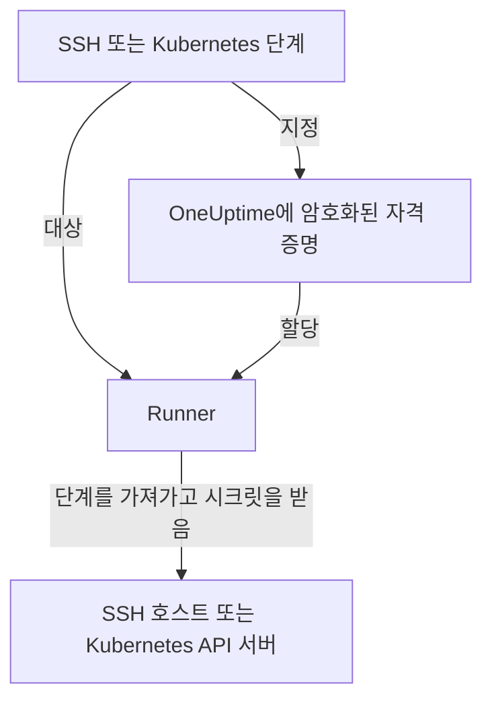

# Runbook 자격 증명

자격 증명은 Runbook이 Runner 자체 호스트가 **아닌** 것, 즉 SSH로 접근하는 서버나 Kubernetes 클러스터에 도달하는 방법입니다. 자격 증명이 없으면 "서비스 다시 시작"은 셸 스크립트를 작성하고 키나 kubeconfig를 Runner 호스트에 직접 두는 일이 되며, 그 파일은 OneUptime의 관리 밖에서 디스크에 남습니다. 자격 증명은 같은 접근 권한을 관리되는 객체로 만든 것입니다. 저장 시 암호화되고, 특정 Runner에 할당되며, 단계에서 이름으로 참조됩니다.

**런북 → Runbook 에이전트 → 자격 증명**에서 관리합니다.

:::cards
- [자격 증명 만들기](#자격-증명-만들기): 접근 권한과 그것을 쓸 수 있는 Runner.
- [상대편의 최소 권한](#상대편의-최소-권한): 키나 토큰으로 할 수 있는 일을 제한합니다.
- [스크립트용 시크릿](#스크립트용-시크릿): Bash 또는 JavaScript 스크립트에 비밀번호나 토큰을 줍니다.
:::

## 자격 증명이 쓰이는 방식



SSH 또는 Kubernetes 단계는 자격 증명과 Runner를 지정합니다. 그 Runner가 단계를 가져가면 OneUptime은 자격 증명이 그 Runner에 할당되어 있는지 확인하고, 시크릿을 복호화해 그 가져가기에 대한 응답에서만 전달합니다. 시크릿은 작업에 저장되지 않으며 API로 읽을 수도 없습니다.

## 시작하기 전에

- **자격 증명을 관리할 수 있는 역할.** Project Owner와 Project Admin, 또는 **Create Runbook Credential** 권한이 있는 사람입니다. Runbook Admin 역할에는 포함되지 않습니다. OneUptime AI의 명령을 실행하는 Runner에 SSH 자격 증명을 할당하려면 **Read Runbook Credential**도 필요합니다. [OneUptime AI의 명령을 실행하는 Runner](#oneuptime-ai의-명령을-실행하는-runner)를 참조하세요.
- **자격 증명이 포함된 요금제.** OneUptime Cloud에서 Runbook 자격 증명에는 **Growth** 이상 요금제가 필요합니다.
- 네트워크를 통해 호스트나 클러스터의 API 서버에 접근할 수 있는 **[Runner](/docs/runbooks/agents)**.

## 자격 증명 만들기

:::steps
### 자격 증명 열기

**런북 → Runbook 에이전트 → 자격 증명**을 열고 **Runbook Credential 만들기**를 클릭합니다.

### 이름을 정하고 유형 고르기

**Credential** 단계에서 **이름**(예: `prod-cluster`), 선택 사항인 **설명**, **유형**(**SSH** 또는 **Kubernetes**)을 입력합니다. 유형은 나중에 바꿀 수 없으니, 바꾸려면 새 자격 증명을 만드세요.

### 접근 정보 입력

:::tabs
@tab SSH
**SSH 호스트** 아래에 **호스트 이름**, **포트**(비워 두면 22), **사용자 이름**을 입력합니다. **SSH 인증** 아래에는 **Private Key (PEM)** 와 패스프레이즈가 있다면 **Private Key Passphrase** 를 붙여 넣거나, 키로 접근할 수 없는 호스트라면 **비밀번호**를 입력합니다. 고를 수 있다면 키가 가장 좋습니다.
@tab Kubernetes
**Kubernetes** 아래에 **API Server URL**(예: `https://10.0.0.1:6443`), **Service Account Token**, **CA Certificate (PEM)** 를 입력해 Runner가 API 서버를 검증할 수 있게 합니다. CA는 API 서버가 Runner가 이미 신뢰하는 인증서를 제시할 때만 비워 두세요.
:::

### Runner에 할당

**Runbook 에이전트** 단계에서 이 자격 증명을 쓸 수 있는 Runner를 고른 다음 **Runbook Credential 만들기**를 클릭합니다. 어떤 Runner에도 할당되지 않은 자격 증명은 어떤 단계도 사용할 수 없습니다.

### 단계에서 사용

[SSH 또는 Kubernetes 단계](/docs/runbooks/authoring#단계-유형)에서 그 Runner 중 하나를 고른 다음 **Credential** 아래에서 자격 증명을 고릅니다. 단계에는 자신과 같은 유형의 자격 증명만 표시되며, 자격 증명을 지정한 단계를 저장하려면 Runbook 자격 증명을 읽을 권한이 필요합니다.
:::

## 저장되는 내용

| 유형 | 필드 |
| --- | --- |
| SSH | 호스트 이름, 포트(기본값 22), 사용자 이름, 그리고 PEM 개인 키(선택적 패스프레이즈 포함) 또는 비밀번호. |
| Kubernetes | API 서버 URL, 서비스 계정 토큰, 클러스터의 CA 인증서. |

## 시크릿 값은 쓰기 전용

개인 키, 패스프레이즈, 비밀번호, 서비스 계정 토큰은 저장 시 암호화되며 API는 이를 **절대 반환하지 않습니다**. 대시보드에도, 워크플로에도, 내보내기에도 반환하지 않습니다. 표는 자격 증명이 *무엇인지*는 보여 주지만 그 안에 무엇이 들어 있는지는 절대 보여 주지 않습니다.

그래서 시크릿 값에는 "보기"가 없고 "바꾸기"만 있습니다. 값을 다시 입력하는 것이 교체하는 방법입니다. 원래 값을 잃어버렸다면 대상 시스템에서 새 키를 발급하고 자격 증명을 업데이트하세요.

## 자격 증명을 Runner에 할당하기

자격 증명은 할당한 Runner만 사용할 수 있으며, 단계는 그중 하나를 가리켜야 합니다. 단계가 자기 Runner에 할당되지 않은 자격 증명을 지정하면 **단계는 실행되지 않고 실패합니다**. 조용히 아무것도 하지 않는 Runner는 성공한 Runner와 똑같아 보이기 때문입니다.

할당이 곧 접근 경계이므로 좁게 유지하세요. 클러스터 하나만 다시 시작하는 Runner에는 데이터베이스 호스트의 SSH 키가 필요 없습니다.

### OneUptime AI의 명령을 실행하는 Runner

**AI 해결 명령 실행**이 켜진 Runner에서는 OneUptime AI가 그 Runner에서 실행하는 명령을 위해 Runner에 할당된 SSH 자격 증명 중에서 고릅니다. 그래서 무엇을 먼저 저장하든, SSH 자격 증명은 Runbook 자격 증명을 읽을 수 있는 사람(**Read Runbook Credential**, 또는 Project Owner나 Project Admin)을 통해서만 그런 Runner에 닿습니다.

- **자격 증명 할당.** 그런 Runner와 함께 SSH 자격 증명을 만들거나, 자격 증명에 그런 Runner를 추가하려면 그 권한이 필요합니다. 권한이 없으면 저장이 거부되고 Runner 이름이 표시됩니다. AI 해결 명령을 실행하지 않는 Runner에 자격 증명을 할당하거나, 권한이 있는 사람에게 할당을 요청하세요.
- **스위치 켜기.** SSH 자격 증명이 있는 Runner에서 **AI 해결 명령 실행**을 켜려면 같은 권한이 필요합니다.

자격 증명에서 Runner를 빼는 것, 자격 증명을 이미 가진 Runner 그대로 저장하는 것, Kubernetes 자격 증명에는 그 이상의 권한이 필요 없습니다. OneUptime AI의 kubectl 명령은 해당 클러스터에 묶인 자격 증명으로 실행되기 때문입니다. 그 권한이 없는 사람의 자격 증명 할당과 스위치 켜기는 프로젝트에서 한 번에 하나씩 저장되므로, 두 저장이 함께 검사를 통과할 수 없습니다. 다른 저장이 진행 중일 때 들어온 저장은 그것을 기다리며, 너무 오래 걸리면 *Try again in a moment*와 함께 거부됩니다. 다시 저장하세요.

워크플로의 단계는 Project Admin으로 동작하지만, Project Admin의 Runbook 자격 증명 읽기 권한을 빌리지는 않습니다. 단계는 워크플로의 단계를 마지막으로 저장한 사람이 그 권한을 가진 경우에만 그 권한을 가집니다. [워크플로 단계가 할 수 있는 일](/docs/workflows/configuration#워크플로-단계가-할-수-있는-일)을 참조하세요.

## 상대편의 최소 권한

OneUptime은 자격 증명이 대상 시스템에서 할 수 있는 일을 제한할 수 없습니다. 그것은 대상 시스템의 몫이며, 할 만한 가치가 있습니다.

- **SSH** — 비밀번호보다 키를 쓰고, 사용자에게 필요한 명령만 주고(실용적이라면 강제 명령이나 제한된 셸), 관리자의 개인 키를 재사용하지 마세요.
- **Kubernetes** — 서비스 계정을, Runbook이 다루는 워크로드에 대해서만, 그것이 실행되는 네임스페이스에서만 `patch`를 허용하는 Role에 바인딩하세요. **Restart workload**는 워크로드 자체를 패치하고 **Scale workload**는 `scale` 하위 리소스를 패치합니다. 그 이상은 필요 없습니다.

예를 들어 Deployment 하나를 다시 시작하고 확장하는 것만 할 수 있는 서비스 계정은 다음과 같습니다.

```yaml title="oneuptime-runbooks-rbac.yaml"
apiVersion: v1
kind: ServiceAccount
metadata:
  name: oneuptime-runbooks
  namespace: checkout
---
apiVersion: rbac.authorization.k8s.io/v1
kind: Role
metadata:
  name: oneuptime-runbooks
  namespace: checkout
rules:
  # Restart workload: patches the Deployment's pod template.
  - apiGroups: ["apps"]
    resources: ["deployments"]
    resourceNames: ["checkout-api"]
    verbs: ["patch"]
  # Scale workload: patches the Deployment's scale subresource.
  - apiGroups: ["apps"]
    resources: ["deployments/scale"]
    resourceNames: ["checkout-api"]
    verbs: ["patch"]
---
apiVersion: rbac.authorization.k8s.io/v1
kind: RoleBinding
metadata:
  name: oneuptime-runbooks
  namespace: checkout
subjects:
  - kind: ServiceAccount
    name: oneuptime-runbooks
    namespace: checkout
roleRef:
  apiGroup: rbac.authorization.k8s.io
  kind: Role
  name: oneuptime-runbooks
```

StatefulSet이나 DaemonSet에는 대신 `statefulsets` 또는 `daemonsets`를 쓰세요. DaemonSet은 확장할 수 없으므로 `scale` 규칙이 필요 없습니다.

## 스크립트용 시크릿

Bash와 JavaScript 단계에는 **Credential** 필드가 없습니다. 비밀번호, 토큰 또는 API 키를 Runbook에 적지 않고 스크립트에 주려면 **Runbook 시크릿**으로 저장하세요. 시크릿은 **런북 → 설정 → 시크릿**에서 Project Owner와 Project Admin, 또는 **Create Runbook Secret** 권한이 있는 사람이 관리합니다.

:::steps
### 시크릿 만들기

**Runbook Secret 만들기**를 클릭합니다. **시크릿** 단계에서 **이름**(영문자, 숫자, 하이픈, 밑줄), 선택 사항인 **설명**, **시크릿 값**을 입력합니다. **접근** 단계에서 **이 시크릿에 액세스할 수 있는 런북 에이전트** 아래의 Runner를 고릅니다.

### 스크립트에서 사용

값이 들어갈 자리에 `{{runbookSecrets.NAME}}`을 씁니다.

```bash
curl -s -X POST \
  -H "Authorization: Bearer {{runbookSecrets.CDN_API_TOKEN}}" \
  "https://api.cdn.example.com/v1/purge"
```

시크릿이 할당된 Runner가 단계를 가져가면 값이 채워진 스크립트를 받습니다.
:::

자격 증명의 시크릿 필드와 마찬가지로 시크릿 값은 저장 시 암호화되며 API가 반환하지 않습니다. **시크릿 값 업데이트**로 바꿉니다. OneUptime Cloud에서는 Runbook 시크릿에도 **Growth** 이상 요금제가 필요합니다.

| | 자격 증명 | Runbook 시크릿 |
| --- | --- | --- |
| 사용하는 곳 | SSH와 Kubernetes 단계 | Bash와 JavaScript 스크립트 |
| 담는 것 | 호스트와 그 키, 또는 클러스터의 URL과 토큰 | 임의의 단일 값 |
| 관리 위치 | **런북 → Runbook 에이전트 → 자격 증명** | **런북 → 설정 → 시크릿** |
| Runner에 닿는 시점 | 그것을 지정한 단계를 가져갈 때의 응답에서 | 가져간 단계의 스크립트에 채워져서 |
| API로 다시 읽을 수 있는 것 | 시크릿이 아닌 필드만 | 값은 절대 읽을 수 없음 |

## 볼 수 있는 사람

자격 증명을 만들고, 편집하고, 삭제하려면 Runbook 자격 증명 권한(또는 Project Owner/Admin)이 필요합니다. 자격 증명을 읽으면 시크릿이 아닌 필드만 보입니다.

Runner의 **에이전트 키**는 그 Runner에 할당된 자격 증명과 같다는 점에 유의하세요. 키를 가진 것은 무엇이든 그 Runner로서 작업을 가져가고 자격 증명을 받을 수 있습니다. 그래서 에이전트 키는 Project Owner, Project Admin, Runbook Admin만 읽을 수 있습니다. 자격 증명 자체처럼 다루세요.

## 다음 단계

:::cards
- [Runbook 작성](/docs/runbooks/authoring): 자격 증명을 쓰는 SSH와 Kubernetes 단계를 작성합니다.
- [Runbook 에이전트](/docs/runbooks/agents): 자격 증명을 할당할 Runner를 설치합니다.
- [Runbook 설정과 안전성](/docs/runbooks/configuration): Runbook 스택 전체의 권한과 보안 강화.
:::
