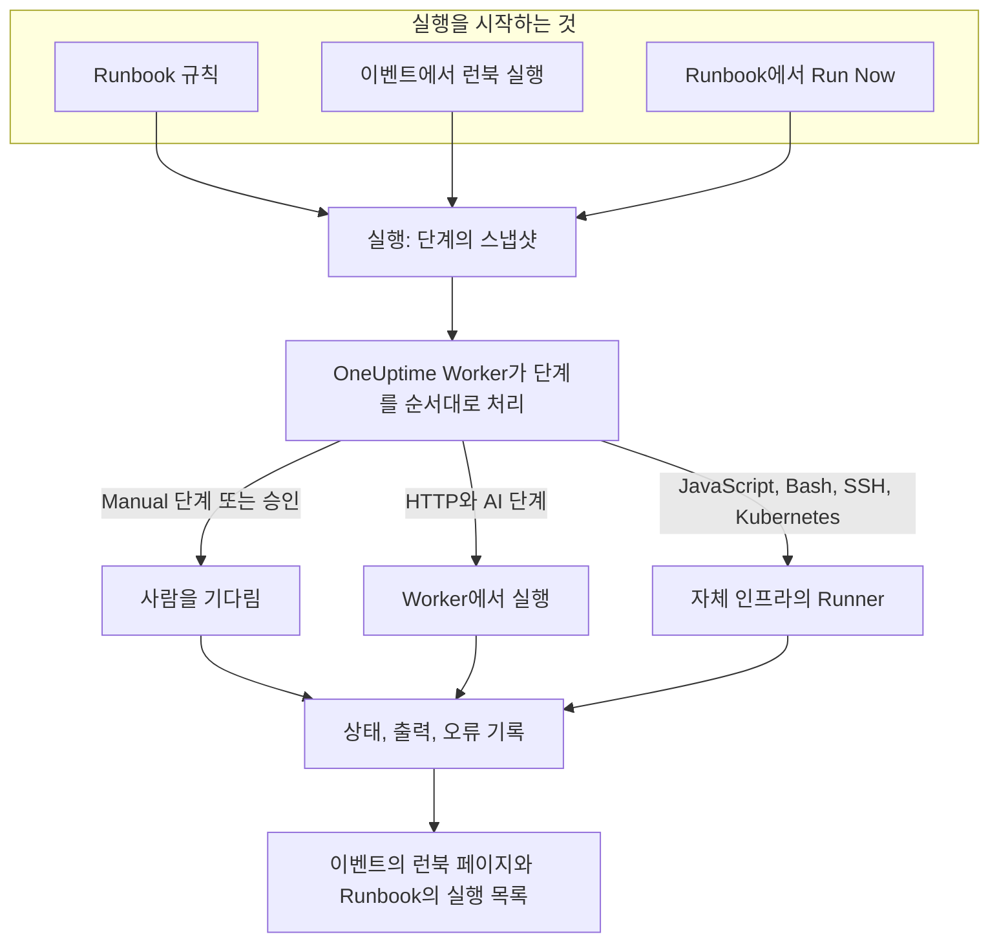

# Runbook 개요

Runbook은 재사용할 수 있는 대응 절차입니다. 인시던트, 알림 또는 예정된 유지 관리 이벤트에서 실행하는 수동 단계와 자동 단계의 순서 있는 목록입니다. "이제 뭘 해야 하지?"라는 대화를 온콜 담당자 누구나 새벽 3시에 따라 할 수 있는 체크리스트로 바꾸며, 스크립트, API 호출, 승인은 이미 작성되어 있습니다. Runbook은 인시던트에 대응하는 온콜 엔지니어와 그 대응을 자동화하는 플랫폼 팀을 위한 기능입니다.

:::cards
- [Runbook 작성](/docs/runbooks/authoring): Runbook을 만들고 단계를 작성합니다.
- [Runbook 규칙](/docs/runbooks/rules): 새 인시던트, 알림, 유지 관리 이벤트에서 Runbook을 시작합니다.
- [Runbook 실행](/docs/runbooks/running): 실행을 시작하고, 단계를 완료하고 승인하고, 실행을 취소합니다.
- [Runbook 에이전트](/docs/runbooks/agents): 자체 인프라에서 스크립트를 실행하는 Runner를 설치합니다.
:::

## Runbook이 실행되는 방식



Runbook을 실행할 때마다 **실행**이 만들어집니다. 실행이 시작되면 Runbook의 단계가 복사되고, OneUptime이 단계를 순서대로 처리합니다. Manual 단계나 승인이 필요한 단계는 누군가 조치할 때까지 실행을 일시 중지합니다.

HTTP와 AI 단계는 OneUptime Worker에서 실행됩니다. JavaScript, Bash, SSH, Kubernetes 단계는 자체 인프라에 설치하는 [Runner](/docs/runbooks/agents)에서 실행되므로, 스크립트가 OneUptime 서버에서 실행되는 일은 없습니다. 각 단계의 상태, 출력, 오류 메시지는 실행에 기록되며, 실행은 대상 인시던트, 알림 또는 이벤트에 남습니다.

## 핵심 개념

| 개념 | 의미 |
| --- | --- |
| **Runbook** | 템플릿입니다. 순서 있는 단계 목록과 **이 런북 실행** 스위치를 가진, 이름이 붙은 재사용 가능한 절차입니다. |
| **단계** | Runbook의 항목 하나입니다. 유형(Manual, JavaScript, HTTP request, Bash, SSH, Kubernetes, AI), 제목, 설명, 유형별 설정을 가집니다. |
| **Runbook 규칙** | 조건(모니터, 심각도, 레이블, 모니터 레이블, 제목, 설명)을 만족하는 인시던트, 알림, 예정된 유지 관리 이벤트에 하나 이상의 Runbook을 자동으로 연결하는 규칙입니다. |
| **실행** | Runbook의 한 번의 실행입니다. 규칙이 발동할 때, 누군가 이벤트에서 **런북 실행**을 클릭할 때, 또는 Runbook 자체에서 **Run Now**를 클릭할 때 만들어집니다. 단계의 스냅샷과 각 단계의 상태 및 출력을 담습니다. |
| **스냅샷** | 각 실행에 저장되는, Runbook 단계의 고정된 사본입니다. 나중에 Runbook을 편집해도 지난 실행의 기록은 바뀌지 않습니다. |
| **Runner** | 자체 인프라의 호스트에서 실행하는 작은 에이전트입니다. 자신을 지정한 JavaScript, Bash, SSH, Kubernetes 단계를 실행합니다. Runbook 에이전트라고도 합니다. |
| **자격 증명** | SSH와 Kubernetes 단계가 사용하는, 관리되는 SSH 또는 Kubernetes 접근 권한입니다. 저장 시 암호화되며, 할당한 Runner에만 전달됩니다. |
| **시크릿** | Bash나 JavaScript 스크립트가 `{{runbookSecrets.NAME}}`로 사용하는 API 토큰 같은 단일 값입니다. 저장 시 암호화되며, 할당한 Runner에만 전달됩니다. |

## 단계 유형

각 단계에 맞는 유형을 고르세요. [Runbook 작성](/docs/runbooks/authoring)에서 유형별 설정을 설명합니다.

| 단계 유형 | 실행 위치 | 사용하는 경우 | 예 |
| --- | --- | --- | --- |
| **Manual** | 사람 | OneUptime이 할 수 없는 확인, 판단, 조치를 사람이 해야 할 때. | "트래픽이 보조 리전으로 전환되었는지 확인하세요." |
| **JavaScript** | Runner | 샌드박스에서 작고 제한된 계산이 필요할 때. | 복제 지연을 계산하고 계속할지 결정합니다. |
| **HTTP request** | OneUptime Worker | 기존 API(클라우드 공급자, PagerDuty, Slack 웹훅, 자체 서비스)를 호출할 때. | 페일오버 오케스트레이터로 `POST`. |
| **Bash** | Runner | 자체 인프라에서 셸 명령이 필요할 때. | `kubectl rollout restart`나 복구 스크립트를 실행합니다. |
| **SSH** | Runner | 관리되는 SSH 자격 증명으로 원격 호스트에서 명령 하나를 실행해야 할 때. | 웹 서버에서 서비스를 다시 시작합니다. |
| **Kubernetes** | Runner | Deployment, StatefulSet 또는 DaemonSet을 다시 시작하거나 확장해야 할 때. | `production`의 `checkout-api`를 다시 시작합니다. |
| **AI** | OneUptime Worker | 실행 도중 프로젝트의 LLM 공급자에게서 분석, 요약 또는 판단을 받고 싶을 때. | "위의 진단을 검토하세요. 페일오버해도 안전한가요?" |

하나의 Runbook에 모든 유형을 섞을 수 있습니다. 사람의 확인을 자동화 및 AI 분석과 엮을 수 있다는 것이 Runbook의 강점입니다.

## 실행을 시작하는 것

| 방법 | 위치 | 실행이 연결되는 대상 |
| --- | --- | --- |
| Runbook 규칙 | **인시던트**, **알림** 또는 **예정된 유지 관리** → **규칙** → **Runbook 규칙** | 새 인시던트, 알림 또는 이벤트 |
| **런북 실행** | 인시던트, 알림 또는 예정된 유지 관리 이벤트의 **런북** 페이지 | 해당 이벤트 |
| **Run Now** | Runbook의 **개요** 페이지 | 없음(일회성 실행) |
| 자동 해결 규칙 | [AI SRE](/docs/ai/ai-sre) 참조 | 인시던트 또는 알림 |

**설정** 페이지에서 **이 런북 실행** 스위치가 꺼진 Runbook은 어떤 방법으로도 시작되지 않습니다. 이미 시작된 실행은 계속됩니다.

## 대시보드에서 Runbook의 위치

Runbook은 **제품**의 **대시보드 및 자동화** 그룹에 있습니다.

| 페이지 | 하는 일 |
| --- | --- |
| **제품 → 런북** | Runbook을 찾아보고, 만들고, 엽니다. |
| Runbook의 **단계** | 단계를 작성하고 순서를 바꾼 다음 **Save Steps**를 선택합니다. |
| Runbook의 **개요** | 최근 실행과 결과를 보고 **Run Now**를 클릭합니다. |
| Runbook의 **실행** | 이 Runbook의 모든 실행을 상태나 시작 날짜로 필터링해 봅니다. |
| Runbook의 **소유자** | 책임지는 사람과 팀을 추가합니다. |
| Runbook의 **설정** | Runbook을 삭제하지 않고 **이 런북 실행**을 끕니다. |
| **런북 → 실행** | 프로젝트에 있는 모든 Runbook의 모든 실행입니다. |
| **런북 → Runbook 에이전트**와 **런북 → Runbook 에이전트 → 자격 증명** | [Runner](/docs/runbooks/agents)를 설치하고 [자격 증명](/docs/runbooks/credentials)을 관리합니다. |
| **런북 → 설정** | 스크립트용 [시크릿](/docs/runbooks/credentials#스크립트용-시크릿)과, 새 Runbook에 소유자와 레이블을 추가하는 **소유자 규칙** 및 **레이블 규칙**을 관리합니다. |
| **인시던트 / 알림 / 예정된 유지 관리 → 규칙 → Runbook 규칙** | Runbook을 자동으로 시작하는 규칙을 만듭니다. |
| 인시던트, 알림 또는 유지 관리 이벤트 → **런북** | 연결된 실행을 보고, **런북 실행**을 클릭해 새로 시작합니다. |

## 따라 해 보는 예

제목에 "db-primary"가 들어간 모든 인시던트에서 5단계 데이터베이스 페일오버 Runbook을 시작하려고 한다고 합시다.

:::steps
### Runbook 만들기

**런북**에서 **런북 만들기**를 클릭하고 이름을 "DB primary failover"로 지정합니다. Runbook을 열고 **단계**로 이동해 다음 단계를 추가한 다음 **Save Steps**를 클릭합니다.

| # | 유형 | 제목 |
| --- | --- | --- |
| 1 | JavaScript | 페일오버 전 복제 지연 기록 |
| 2 | Manual | DBA 대시보드에서 복제본이 정상인지 확인 |
| 3 | HTTP request | 페일오버 오케스트레이터로 `POST` |
| 4 | Manual | 쓰기가 새 프라이머리로 가는지 확인 |
| 5 | HTTP request | Slack의 `#db-incidents`에 해제 알림 보내기 |

### 규칙 추가

**인시던트 → 규칙 → Runbook 규칙**에서 조건 하나와 시작할 Runbook을 지정한 규칙을 만듭니다.

```text
Conditions:  Incident Title starts with db-primary
Runbooks:    [DB primary failover]
```

### 실행되게 두기

모니터가 인시던트 `INC-4821 · db-primary connection timeout`을 엽니다. 규칙이 일치하고 실행이 시작됩니다.

- 1단계(JavaScript)는 그 단계용으로 고른 Runner에서 실행됩니다. `{ lagMs: 412 }` 같은 반환 값이 기록됩니다.
- 2단계(Manual)에서 실행이 일시 중지되고 **귀하를 기다리는 중**이 표시됩니다. 온콜 담당자가 대시보드를 확인하고 **Mark complete**를 클릭합니다.
- 3단계(HTTP request)가 실행되고 `POST`의 응답이 기록됩니다.
- 4단계(Manual)에서 누군가 완료할 때까지 실행이 다시 일시 중지됩니다.
- 5단계(HTTP request)가 실행되고 실행은 **완료됨**이 됩니다.

### 돌아보기

실행은 인시던트의 **런북** 페이지에 남습니다. 포스트모템을 쓸 때 각 단계의 출력, 오류, 소요 시간을 한 번의 클릭으로 볼 수 있습니다.
:::

## 일반적인 사용 사례

- **데이터베이스 페일오버**: JavaScript로 상태를 기록하고, 온콜 DBA에게 복제본 상태 확인을 요청하고(Manual), 오케스트레이터를 호출하고(HTTP request), DNS를 확인하고(Manual), 해제 알림을 보냅니다(HTTP request).
- **캐시 비우기**: HTTP 요청 한 번 뒤에 Manual 단계로 "캐시 적중률이 회복되고 있는지 확인하세요".
- **고객에게 영향을 주는 인시던트**: Manual로 "상태 페이지에 업데이트를 게시하세요", HTTP 요청으로 지원 팀에 알리고, JavaScript로 영향을 받은 계정 목록을 가져옵니다.
- **예정된 유지 관리 전 사전 점검**: 메트릭 스냅샷을 찍고, 이해관계자와 변경 시간대를 확인하고(Manual), 로드 밸런서에서 유지 관리 모드를 켭니다(HTTP request).
- **진단한 다음 수정**: Bash 단계가 진단 정보를 모으고, **승인 필요**가 켜진 AI 단계가 이를 읽고 수정을 제안하며, 사람이 승인한 뒤에야 Kubernetes 단계가 워크로드를 다시 시작합니다.
- **항상 실행되는 위생 점검**: 조건 없는 규칙으로 모든 인시던트에서 포스트모템용 시스템 상태를 기록합니다.

## Runbook과 OneUptime의 나머지 기능

- **모니터**가 인시던트와 알림을 열고, **Runbook 규칙**이 이를 Runbook 실행으로 바꿉니다. 감지, 트리거, 대응, 기록입니다.
- **[온콜 정책](/docs/on-call/schedules)** 은 누구를 호출할지 정합니다. Runbook은 그 사람이 깨어난 뒤 무엇을 할지 정합니다.
- Slack과 Microsoft Teams 같은 **[워크스페이스 연결](/docs/workspace-connections/slack)** 은 업데이트를 게시하는 HTTP 요청 단계의 자연스러운 대상입니다.
- **[상태 페이지](/docs/status-pages/index)** 는 고객 대상 Runbook의 Manual 단계로 업데이트되는 경우가 많습니다.

## 다음 단계

:::cards
- [Runbook 작성](/docs/runbooks/authoring): 첫 Runbook과 그 단계를 만듭니다.
- [Runbook 에이전트](/docs/runbooks/agents): JavaScript, Bash, SSH, Kubernetes 단계를 작성하기 전에 Runner를 설치합니다.
- [Runbook 규칙](/docs/runbooks/rules): 인시던트가 만들어질 때 Runbook을 자동으로 시작합니다.
- [Runbook 설정과 안전성](/docs/runbooks/configuration): 한도, 타임아웃, 권한, 보안 강화.
:::
