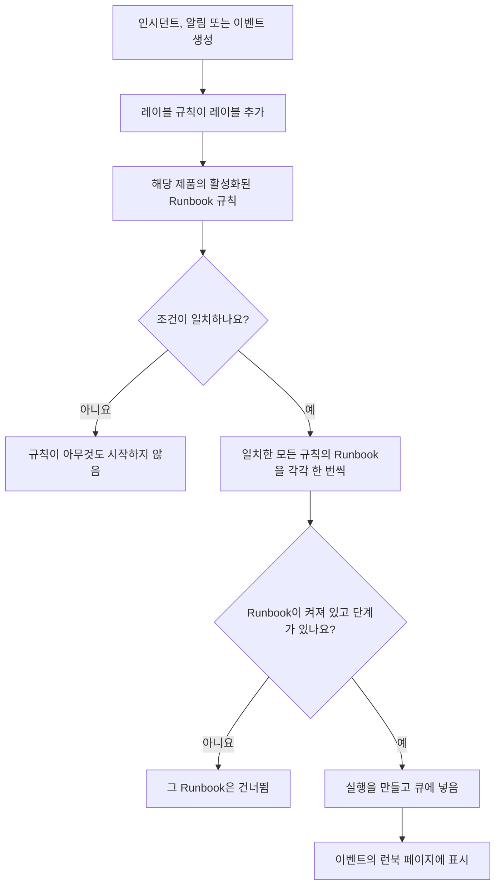

# Runbook 규칙

Runbook 규칙은 **인시던트**, **알림** 또는 **예정된 유지 관리 이벤트**가 만들어질 때 Runbook을 자동으로 시작하므로, 장애 중에 누군가 실행을 기억할 필요가 없습니다. 각 제품의 **규칙** 메뉴에는 자체 규칙 페이지가 있습니다.

- 인시던트 → 규칙 → **Runbook 규칙**
- 알림 → 규칙 → **Runbook 규칙**
- 예정된 유지 관리 → 규칙 → **Runbook 규칙**

세 페이지 모두 같은 종류의 규칙을 편집하며, 각 제품의 규칙만 보여 줍니다.

:::cards
- [Runbook 규칙 만들기](#runbook-규칙-만들기): 이름, 조건, 시작할 Runbook의 네 단계.
- [조건](#조건): 규칙이 쓸 수 있는 모든 기준과 연산자.
- [일치 방식](#일치-방식): 여러 규칙, 모니터 조건, 레이블 규칙.
- [예시](#예시): 복사해서 쓸 수 있는 규칙 세 가지.
:::

## 규칙이 Runbook을 시작하는 방식



규칙이 발동하면, 규칙이 지정한 각 Runbook에 대해 다음이 일어납니다.

1. Runbook을 불러옵니다.
2. 그 단계가 **스냅샷**으로 새 Runbook 실행에 복사됩니다.
3. 실행이 Runbook 워커의 큐에 들어갑니다.
4. 실행이 원본 엔터티에 연결됩니다. 인시던트, 알림 또는 예정된 유지 관리 이벤트의 **런북** 페이지와 Runbook의 **실행** 목록에 표시됩니다.

규칙이 시작했든 아니든 모든 실행은 **런북 → 실행**에서 상태, Runbook, 시작 날짜로 필터링해 볼 수 있습니다.

## 시작하기 전에

- **실행할 수 있는 Runbook.** 단계가 하나 이상 있고 **설정** 페이지에서 **이 런북 실행**이 켜져 있어야 합니다. [Runbook 작성](/docs/runbooks/authoring)을 참조하세요.
- **규칙을 관리할 권한.** Project Owner, Project Admin, Runbook Admin이 Runbook 규칙을 만들 수 있으며, **Create Runbook Rule** 권한이 있는 사람도 만들 수 있습니다.

## Runbook 규칙 만들기

:::steps
### Runbook 규칙 열기

**인시던트**, **알림** 또는 **예정된 유지 관리**에서 **규칙 → Runbook 규칙**을 열고 **Runbook Rule 만들기**를 클릭합니다.

### 규칙 이름 지정

**기본 정보**에서 **이름**(예: "데이터베이스 인시던트에서 DB 페일오버 시작")과, 필요하면 **설명**을 입력합니다.

### 조건 추가

**일치 기준**에서 **조건 추가**를 클릭하고, 기준과 연산자를 고른 다음 값을 입력하거나 선택합니다. 필요하면 조건을 더 추가하고 **모두 일치** 또는 **하나라도 일치**를 고릅니다. 이 종류의 새 이벤트마다 Runbook을 시작하려면 조건을 추가하지 않습니다.

### Runbook 선택

**런북**에서 하나 이상의 **시작할 런북**을 고르고 **Runbook Rule 만들기**를 클릭합니다. 규칙은 만들어지는 즉시 활성화되며, 목록에 **활성화됨** 상태로 표시됩니다.
:::

## 규칙의 구성

| 필드 | 용도 |
| --- | --- |
| **이름** | 규칙을 알아보기 쉬운 짧은 레이블입니다. |
| **설명** | 팀원을 위한 선택적 맥락입니다. |
| **활성화됨** | 새 규칙에서는 켜져 있습니다. 규칙 편집 양식에서 끄면 삭제하지 않고 일시 중지할 수 있습니다. |
| **조건** | **일치 기준** 단계에서 지정하는, 규칙이 일치하는 대상입니다. 비워 두면 해당 유형의 모든 이벤트와 일치합니다. |
| **시작할 런북** | 규칙이 발동할 때 시작하는 하나 이상의 Runbook입니다. |

## 조건

각 조건은 인시던트, 알림 또는 예정된 유지 관리 이벤트의 한 가지 속성을 지정한 값과 비교합니다. Runbook 규칙은 그 제품의 다른 규칙과 같은 기준을 제공합니다. 인시던트 Runbook 규칙은 인시던트 개인정보 규칙이나 온콜 규칙과 같은 것에 일치합니다.

| 기준 | 확인하는 것 |
| --- | --- |
| **모니터** | 인시던트나 예정된 유지 관리 이벤트가 영향을 주는 모니터, 또는 알림을 발생시킨 모니터. |
| **인시던트 심각도** / **경고 심각도** | 인시던트 또는 알림의 심각도. 예정된 유지 관리 이벤트에는 심각도가 없으므로 그 규칙에서는 제공되지 않습니다. |
| **인시던트 레이블** / **경고 레이블** / **이벤트 레이블** | 인시던트, 알림 또는 이벤트 자체의 레이블. 생성 시 레이블 규칙이 추가한 레이블도 포함합니다. |
| **모니터 레이블** | 그 모니터의 레이블. 모니터에 `production` 또는 `staging` 레이블을 붙이면 한 환경에서만 Runbook을 실행할 수 있습니다. |
| **인시던트 제목** / **경고 제목** / **이벤트 제목** | 제목. |
| **인시던트 설명** / **경고 설명** | 설명(이벤트에서는 기준 이름이 **이벤트 설명**입니다). |
| **모니터 이름** / **모니터 설명** | 그 모니터의 이름 또는 설명. |

조건마다 연산자를 고릅니다.

- 목록 기준(**모니터**, 심각도, 레이블)은 선택한 값에 대해 **다음 중 하나 포함**, **모두 포함** 또는 **모두 포함하지 않음**을 사용합니다.
- 텍스트 기준은 **포함**(새 조건의 기본값), **포함하지 않음**, **같음**, **같지 않음**, **다음으로 시작**, **다음으로 끝남**, 또는 대소문자를 구분하지 않는 정규식이나 `*` 와일드카드를 위한 **패턴과 일치** / **패턴과 일치하지 않음**을 사용합니다. 텍스트 비교는 대소문자를 구분하지 않습니다.

조건이 둘 이상이면 **모두 일치**(모든 조건이 참이어야 함) 또는 **하나라도 일치**(적어도 하나가 참이어야 함)를 고릅니다.

## 일치 방식

- 조건이 없는 규칙은 해당 유형의 모든 이벤트에 적용됩니다(전역 "항상 실행" 규칙).
- 여러 규칙이 같은 이벤트와 일치할 수 있습니다. 일치한 규칙은 모두 발동하고 그 Runbook의 합집합이 실행됩니다. 각 Runbook은 자체 실행을 가지며, 일치한 두 규칙이 같은 Runbook을 지정해도 한 번만 실행됩니다.
- 모니터 조건은 한 번에 모니터 하나씩 확인합니다. **모두 일치**에서 "**모니터 이름**이 `api` 포함"과 "**모니터 레이블**이 _Production_ 중 하나 포함"은 두 조건을 모두 만족하는 모니터 하나가 필요하며, 각각을 만족하는 서로 다른 모니터로는 안 됩니다.
- Runbook 규칙은 레이블 규칙 다음에 실행되므로, 레이블 규칙이 새 인시던트, 알림 또는 이벤트에 붙인 레이블로 Runbook을 시작할 수 있습니다.
- 이미 해결된 상태로 만들어진 인시던트나 알림은 Runbook을 시작하지 않습니다. 기록되기 전에 이미 끝났기 때문입니다. [이미 인지되었거나 해결된 상태로 선언된 인시던트](/docs/incidents/declaring-incidents#이미-인지되었거나-해결된-상태로-선언된-인시던트)를 참조하세요.
- 다른 제품의 심각도에 대한 조건(예: 인시던트 규칙의 **경고 심각도**)은 절대 참이 될 수 없으므로 API가 저장을 거부합니다.
- 규칙은 이벤트가 만들어질 때 한 번 평가됩니다. 나중에 인시던트의 제목, 심각도, 레이블을 편집해도 규칙이 다시 발동하지 않습니다.

## 예시

### 데이터베이스 인시던트에서 DB 페일오버

```text
Name:        Start DB failover for DB incidents
Trigger:     Incident
Conditions:  Incident Title matches pattern (?:^|\b)(db|database|postgres|mysql|mongo)
Runbooks:    [DB failover playbook, Notify DBA team]
```

제목에 "db", "database", "postgres" 등이 들어간 인시던트가 만들어질 때마다 Runbook 실행 두 개가 만들어집니다.

### 프로덕션의 심각한 인시던트에만

```text
Name:        Flush the CDN cache for critical production incidents
Trigger:     Incident
Conditions:  Match all
             Monitor Labels has any of Production
             Incident Severities has any of Critical
Runbooks:    [Flush CDN cache]
```

_Production_ 레이블이 붙은 모니터의 심각한 인시던트에서 실행되며, staging에서는 아무것도 실행하지 않습니다.

### 항상 실행되는 위생 규칙

```text
Name:        Always-run pre-flight check
Trigger:     Incident
Conditions:  (none)
Runbooks:    [Capture pre-incident state]
```

모든 인시던트에서 발동합니다. 시스템 상태, 메트릭 등의 스냅샷을 포스트모템용으로 기록하는 데 유용합니다.

## 비활성화된 Runbook

규칙이 꺼진 Runbook(Runbook의 **설정** 페이지에서 **이 런북 실행**이 꺼짐, `isEnabled = false`)을 지정하면, 규칙은 여전히 일치하지만 Runbook 실행은 건너뜁니다. 다시 시작하려면 스위치를 다시 켜세요. 단계가 없는 Runbook도 같은 방식으로 건너뜁니다.

## 규칙 테스트

프로덕션에서 규칙을 신뢰하기 전에, 규칙의 조건을 만족하는 테스트 인시던트(또는 테스트 알림)를 만들고 그 **런북** 페이지에 예상한 Runbook이 나타나는지 확인하세요.

> [!NOTE]
> Runbook 규칙은 새 이벤트에만 작동합니다. 레이블 규칙이나 소유자 규칙과 달리 [기존 레코드에 실행](/docs/configuration/run-rules-now)할 수 없습니다. 이미 끝난 인시던트에 대해 Runbook을 시작하게 되기 때문입니다.

## 문제 해결

:::details 규칙은 일치했지만 Runbook이 실행되지 않음
다음 순서로 확인하세요.

- 규칙이 **활성화됨** 상태입니다.
- 각 Runbook의 **설정** 페이지에서 **이 런북 실행**이 켜져 있고 저장된 단계가 하나 이상 있습니다.
- 인시던트나 알림이 이미 해결된 상태로 만들어지지 않았습니다.
- Runbook의 실행이 그저 기다리고 있는 것이 아닙니다. 이벤트의 **런북** 페이지에서 여세요. Manual 단계나 승인에는 **귀하를 기다리는 중**이 표시됩니다.
:::

:::details 규칙이 절대 일치하지 않음
규칙은 이벤트가 만들어진 시점의 모습과, 그 순간 레이블 규칙이 추가한 레이블을 봅니다. 나중에 바뀐 레이블, 심각도, 제목은 보지 않습니다. 조건이 여러 개라면 **모두 일치**와 **하나라도 일치**를 확인하고, 모니터 조건은 모두 같은 모니터 하나에 해당해야 한다는 점을 기억하세요.
:::

:::details API가 "can only be used by"로 규칙을 거부함
심각도 기준은 한 제품에 속합니다. 인시던트 규칙의 **경고 심각도**나 알림 규칙의 **인시던트 심각도**는 절대 일치할 수 없으므로, 규칙은 "Alert Severities can only be used by alert runbook rules." 같은 메시지와 함께 거부됩니다. 그 조건을 제거하세요. 대시보드는 각 제품 자체의 기준만 제공합니다.
:::

## 다음 단계

:::cards
- [Runbook 실행](/docs/runbooks/running): 규칙이 실행을 시작할 때 대응자가 보는 것.
- [Runbook 작성](/docs/runbooks/authoring): 규칙이 시작하는 Runbook을 작성합니다.
- [인시던트 선언](/docs/incidents/declaring-incidents): 인시던트가 만들어지는 방식과 규칙이 인시던트를 보는 시점.
:::
