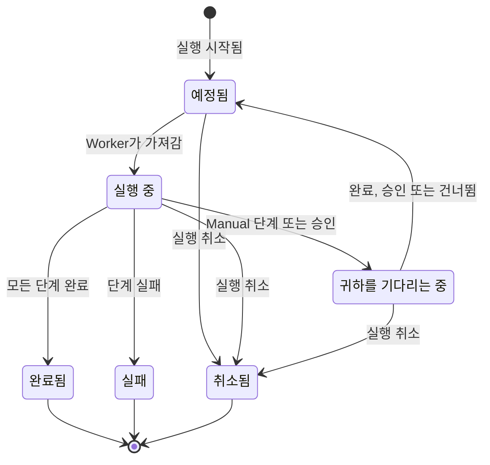

# Runbook 실행

Runbook을 실행할 때마다 **실행**이 만들어집니다. 실행은 Runbook 단계의 스냅샷으로, 순서대로 처리되며 각 단계의 상태와 출력이 기록됩니다. 이 페이지는 인시던트에 대응하고 실행을 시작해 진행시키는 사람을 위한 것입니다. 실행이 시작되는 방법, 실행 페이지에 표시되는 내용, 단계를 완료, 승인, 건너뛰기, 취소하는 방법을 설명합니다.

:::cards
- [실행 시작](#실행-시작): 인시던트, 알림, 이벤트에서 또는 Runbook 자체에서.
- [실행 보기](#실행-보기): 실행이 진행되는 동안 각 단계에 표시되는 내용.
- [단계 완료, 승인, 건너뛰기](#단계-완료-승인-건너뛰기): 어떤 단계가 언제 결정을 받는지.
- [문제 해결](#문제-해결): 시작되지 않거나 끝나지 않는 실행.
:::

## 실행이 진행되는 방식

새 실행은 Worker가 가져가 **실행 중**으로 표시할 때까지 **예정됨** 상태입니다. Manual 단계에서, 또는 승인이 필요한 단계 다음에 **귀하를 기다리는 중**으로 일시 중지하며, 누군가 조치하면 바로 큐로 돌아갑니다. 사람을 기다리는 실행은 시간 초과되지 않습니다. 실행은 **완료됨**, **실패** 또는 **취소됨**으로 끝납니다.

## 실행 시작

Runbook 실행은 세 가지 방법으로 만들어집니다.

1. **규칙에 의한 자동 시작**: 일치하는 인시던트, 알림 또는 예정된 유지 관리 이벤트가 만들어지면 [Runbook 규칙](/docs/runbooks/rules)이 실행을 시작합니다. 자동 해결 규칙도 실행을 시작할 수 있습니다. [AI SRE](/docs/ai/ai-sre)를 참조하세요.
2. **이벤트에서 수동 시작**: 인시던트, 알림 또는 예정된 유지 관리 이벤트에서 **런북 실행**을 클릭합니다. 실행은 그 이벤트에 연결됩니다.
3. **Runbook 페이지에서 수동 시작**: Runbook의 **개요** 페이지에서 **Run Now**를 클릭합니다. 이 실행은 인시던트, 알림, 예정된 유지 관리 이벤트 어디에도 연결되지 않습니다.

수동으로 시작하려면:

:::tabs
@tab 이벤트에서
1. 인시던트, 알림 또는 예정된 유지 관리 이벤트를 열고 **런북** 페이지로 이동합니다.
2. **런북 실행**을 클릭합니다. **런북 실행** 대화 상자에 프로젝트의 활성화된 Runbook이 나열됩니다.
3. Runbook 옆의 **Run**을 클릭합니다. 실행이 이벤트의 목록에 나타나면 **보기**를 클릭해 엽니다.
@tab Runbook에서
1. **런북**에서 Runbook을 엽니다.
2. **개요**에서 **Run Now**를 클릭합니다.
3. 실행 페이지가 열립니다.
:::

실행을 시작하려면 Project Owner, Project Admin, Project Member, Runbook Admin, Runbook Member 중 하나 또는 **Create Runbook Execution** 권한이 필요합니다. Runbook Viewer와 Viewer에게는 **Run Now**가 이유와 함께 잠겨 표시됩니다. [권한](/docs/runbooks/configuration#권한)을 참조하세요.

## 실행 보기

실행을 열면 체크리스트가 보입니다. 페이지 위쪽에 실행의 **상태**, **Progress**(전체 단계 중 끝난 단계), **시작됨**(시작 시각), **트리거한 사용자**(무엇이 시작했는지)가 표시됩니다. 각 단계에는 다음이 표시됩니다.

- **상태 배지** — 대기 중, 실행 중, 귀하를 기다리는 중, 완료, 건너뜀, 실패, 취소됨.
- **제목과 설명** — 실행이 시작될 때 Runbook에서 복사됨.
- **Output**(접을 수 있음) — stdout, 반환 값, HTTP 응답 또는 AI의 응답.
- 단계가 실패한 경우 **오류 메시지**.
- 실행이 기다리는 단계에서는 **Mark complete**(Manual 단계) 또는 **Approve & continue**(**승인 필요**가 켜진 단계)와 **건너뛰기**.
- 실행이 일시 중지된 동안 승인이 필요 없는 이후 자동 단계에서는 **건너뛰기**.

실행이 진행되는 동안 페이지는 30초마다 저절로 새로 고쳐집니다. 최신 상태를 바로 보려면 **새로고침**을 클릭합니다.

## 단계 완료, 승인, 건너뛰기

실행을 진행시키기 위해 완료, 승인 또는 건너뛸 수 있는 단계는 실행이 기다리는 단계뿐입니다. Manual 단계나 **승인 필요**가 켜진 단계는 실행이 거기에 도달하기 전에는 체크하거나 건너뛸 수 없습니다. 이런 단계의 역할은 실행을 멈추는 것이므로, 실행이 그 단계에 있을 때(승인의 경우 단계가 실행되어 출력을 볼 수 있을 때)에만 결정을 받습니다.

실행이 일시 중지된 동안에는 승인이 필요 없는 이후 자동 단계를 건너뛰어, 실행이 다시 진행될 때 그 단계가 실행되지 않게 할 수도 있습니다. 실행은 여러분을 기다리는 단계에서 계속 일시 중지된 상태로 있습니다. 단계가 실행되는 동안에는 건너뛸 수 없습니다. 실행이 일시 중지될 때까지 기다리거나 실행을 취소하세요. 각 단계에는 누가 완료하거나 건너뛰었는지가 기록됩니다.

| 단계 | 완료 또는 승인 | 건너뛰기 |
| --- | --- | --- |
| 실행이 기다리는 단계 | 예 | 예 |
| **승인 필요**가 없는 이후 자동 단계 | 아니요 | 예(실행이 일시 중지된 동안) |
| 이후 Manual 단계 또는 **승인 필요**가 켜진 단계 | 아니요 | 아니요 |
| 단계가 실행되는 동안의 모든 단계 | 아니요 | 아니요 |

완료, 승인, 건너뛰기, 취소에는 실행 시작과 같은 역할 또는 **Edit Runbook Execution** 권한이 필요합니다.

## 수동 단계와 자동 단계 섞기

전형적인 흐름:

| # | 단계 | 일어나는 일 |
| --- | --- | --- |
| 1 | Bash: 시스템 상태 기록 | 실행이 시작되자마자 해당 Runner에서 실행됩니다. |
| 2 | Manual: "상태 페이지 배너로 고객에게 알리세요." | 누군가 **Mark complete**를 클릭할 때까지 실행이 일시 중지됩니다. |
| 3 | HTTP request: PagerDuty로 DBA 호출 | Worker에서 실행됩니다. |
| 4 | Manual: "보조 데이터베이스가 이제 프라이머리인지 확인하세요." | 실행이 다시 일시 중지됩니다. |
| 5 | HTTP request: Slack 웹훅으로 해제 알림 보내기 | 실행되고, 실행은 **완료됨**이 됩니다. |

2단계와 4단계는 누군가 체크할 때까지 실행을 일시 중지합니다. 1, 3, 5단계는 자동으로 실행됩니다. 전체가 하나의 실행, 하나의 타임라인, 하나의 신뢰할 수 있는 기록입니다.

## 실행 취소하기

실행 페이지에서 **실행 취소**를 클릭합니다. 상태가 `Cancelled`가 되고 이후 단계는 시작되지 않습니다. 이미 실행 중인 단계는 중단되지 않지만 그 결과는 기록되지 않으며, 단계는 `Cancelled`로 남습니다. Runner를 기다리는 작업은 취소됩니다. 이미 스크립트를 실행 중인 Runner는 끝까지 실행하지만 결과는 받아들여지지 않습니다.

## 출력 한도

폭주하는 스크립트가 데이터베이스를 부풀리지 않도록 단계별 출력은 **50 KB**로 제한됩니다. 더 긴 출력은 표시와 함께 잘립니다. 더 큰 결과물이 필요하면 스크립트에서 객체 스토리지나 로그 시스템에 쓰고 URL을 출력하세요.

## Runbook 다시 실행

실행은 한 번뿐인, 변경할 수 없는 기록입니다. 다시 실행하려면 끝난 실행에서 **다시 실행**을 클릭하거나 Runbook에서 **Run Now**를 클릭합니다. 둘 다 Runbook의 현재 단계로 새 실행을 만들며, 어떤 이벤트에도 연결하지 않습니다. 인시던트에서 다시 실행하려면 인시던트의 **런북** 페이지에서 **런북 실행**을 사용하세요. 원래 실행은 감사 기록을 위해 그대로 남습니다.

## 지난 실행 찾기

| 위치 | 보여 주는 것 |
| --- | --- |
| Runbook의 **실행** | 그 Runbook의 모든 실행. 상태와 시작 날짜 필터, **트리거한 사용자** 열이 있습니다. |
| **런북 → 실행** | 프로젝트에 있는 모든 Runbook의 모든 실행. |
| 인시던트, 알림 또는 이벤트의 **런북** 페이지 | 그것에 연결된 실행. 실행이 있으면 이벤트의 개요에도 표시됩니다. |

## 문제 해결

:::details Run Now가 잠겨 있음
여러분의 역할은 Runbook을 읽을 수 있지만 실행할 수는 없습니다. 버튼에는 "이 프로젝트에서 런북 실행을 시작할 권한이 없습니다."라고 표시됩니다. Runbook Member 역할이나 **Create Runbook Execution** 권한을 요청하세요.
:::

:::details 실행 시작이 "Runbook is disabled" 또는 "Runbook has no steps to run"으로 실패함
Runbook의 **설정** 페이지에서 **이 런북 실행** 스위치가 꺼져 있거나, 저장된 단계가 없습니다. 스위치를 켜거나 단계를 추가하고 **Save Steps**를 클릭하세요.
:::

:::details Runner나 자격 증명이 없어서 단계가 실패함
메시지는 예를 들어 "Bash step is missing a Runner. Pick one under Runbooks → Runners."입니다. 단계가 **Runner** 없이 저장되었거나, SSH 또는 Kubernetes 단계가 **Credential** 없이 저장되었습니다. Runbook의 **단계**를 열어 빠진 것을 고르고 **Save Steps**를 클릭한 뒤 Runbook을 다시 실행하세요.
:::

:::details 어떤 Runbook 에이전트도 가져가지 않아서 단계가 실패함
메시지는 "No runbook agent picked up this step before the wait window expired."입니다. 단계의 Runner가 claim timeout 안에 작업을 가져가지 않았습니다. **런북 → Runbook 에이전트**에서 Runner가 **연결됨**이고 **런북 실행**이 켜져 있는지 확인하세요. [Runbook 에이전트](/docs/runbooks/agents#문제-해결)를 참조하세요.
:::

:::details 실행이 몇 시간째 기다리고 있음
사람을 기다리는 실행은 시간 초과되지 않습니다. 실행을 열고 **귀하를 기다리는 중**이 표시된 단계에서 조치하거나 **실행 취소**를 클릭하세요.
:::

:::details 단계가 일부만 실행되었을 수 있다고 표시됨
단계를 실행하던 OneUptime Worker가 다시 시작되었거나 응답을 멈췄고, 실행은 멈춘 채로 남는 대신 실패로 표시되었습니다. Runbook을 다시 실행하기 전에 대상 시스템을 확인하세요.
:::

## 다음 단계

:::cards
- [Runbook 작성](/docs/runbooks/authoring): 사람이 결정해야 하는 곳에 Manual 단계와 승인을 추가합니다.
- [Runbook 규칙](/docs/runbooks/rules): 새 인시던트에서 실행을 자동으로 시작합니다.
- [Runbook 에이전트](/docs/runbooks/agents): 단계에 필요한 Runner를 온라인으로 유지합니다.
:::
