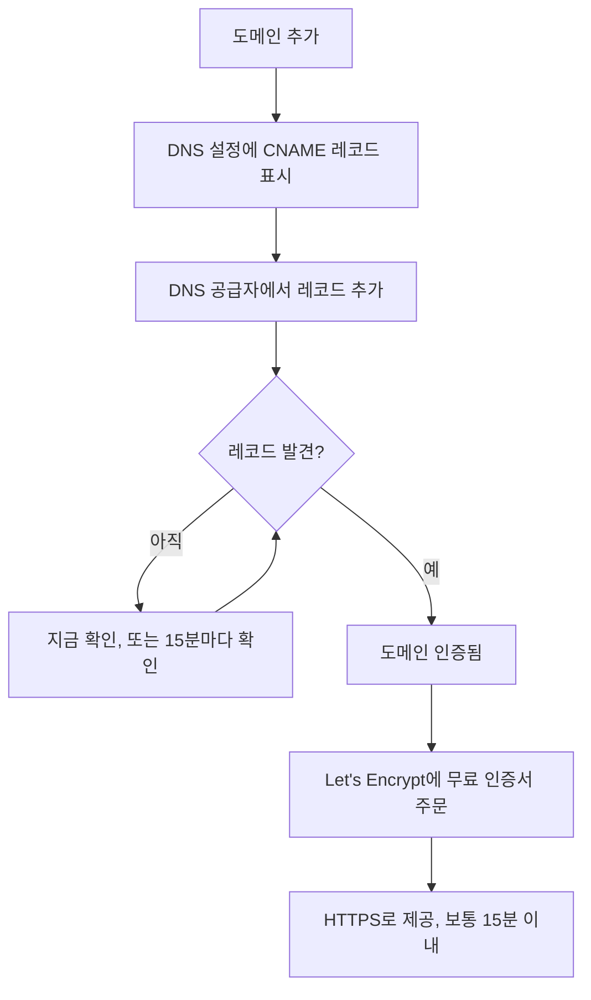

# 상태 페이지 브랜딩 및 도메인

상태 페이지는 고객이 보는 유일한 OneUptime 화면이므로, 자사의 모습을 갖추고 `status.yourcompany.com` 같은 자체 도메인에 있어야 합니다. 이 페이지는 **브랜딩** 페이지를 카드별로 살펴본 뒤 페이지를 자체 도메인에 올립니다. 도메인을 추가하고 DNS 레코드 하나를 추가하면 무료 SSL 인증서가 저절로 따라옵니다.

:::cards
- [브랜딩 페이지](#브랜딩-페이지): 로고, 제목, 파비콘, 링크, 푸터, 색상, 언어.
- [사용자 지정 HTML, CSS, JavaScript](#사용자-지정-html-css-javascript): 기본 제공 설정으로 할 수 없는 모든 것.
- [사용자 정의 도메인](#사용자-정의-도메인): 무료 인증서가 포함된 자체 호스트 이름.
- [상태 열](#도메인-상태-열-읽기): 각 도메인이 HTTPS로 가는 길의 어디쯤에 있는지.
:::

## 각 브랜딩 설정의 위치

상태 페이지를 열면 사이드 메뉴의 **브랜딩** 섹션에 항목이 세 개 있습니다.

| 페이지 | 그곳에서 설정하는 것 |
| ---- | ------------------ |
| **브랜딩** | 로고와 표지 이미지, 페이지 제목과 설명, 파비콘, 헤더 링크, 개요 페이지 설명, 저작권 줄, 푸터 링크. **추가 설정** 아래에 접혀 있는 것: 기록 차트 색상, 언어, 검색 엔진 색인 생성. |
| **사용자 정의 도메인** | 자체 도메인, 그 DNS 레코드, 무료 SSL 인증서. |
| **HTML, CSS 및 JavaScript** | 헤더 HTML, 푸터 HTML, 사용자 지정 CSS, 사용자 지정 JavaScript. |

브랜딩처럼 보이는 세 가지는 페이지의 모양이 아니라 페이지가 무엇을 보여 줄지를 정하기 때문에 대신 **상태 페이지 → 해당 페이지 → 고급 → 고급 설정**(`{id}/settings`)에 있습니다. 전체 가동 시간 비율, 가동 시간에 불리하게 계산되는 모니터 상태, "Powered by OneUptime" 줄입니다. 셋 다 그곳의 **상태 페이지에 표시되는 내용** 카드의 행입니다.

예전에는 브랜딩이 **기본 브랜딩**, **헤더**, **푸터**, **개요 페이지**, **언어**라는 별도 화면으로 나뉘어 있었습니다. 그 옛 주소(`{id}/header-style`, `{id}/footer-style`, `{id}/overview-page-branding`, `{id}/languages`)는 이제 **브랜딩** 페이지를 열므로, 예전 북마크와 링크도 계속 작동합니다.

## 브랜딩 페이지

**상태 페이지 → 해당 페이지 → 브랜딩 → 브랜딩**(`{id}/branding`). 각 카드는 따로 저장됩니다. 로고, 제목, 파비콘 다음에 카드들은 상태 페이지를 위에서 아래로 따라갑니다. 헤더의 링크, 개요 맨 위의 텍스트, 그다음 푸터입니다. 바꾸는 사람이 드문 것은 맨 아래 **추가 설정** 아래에 접혀 있습니다.

### 로고 및 표지 이미지

첫 번째 카드인 **로고 및 표지 이미지**에는 두 단계를 여는 **Edit Images** 버튼이 있습니다.

| 단계 | 필드 |
| ---- | ------ |
| **로고** | 로고 업로드(자리 표시자 `Upload logo`)와 **Logo Alt Text**(자리 표시자 `Logo of My Company`). 대체 텍스트를 비워 두면 대신 상태 페이지 제목이 사용됩니다. |
| **표지 이미지** | 헤더 뒤의 넓은 배너를 위한 업로드인 **표지**(자리 표시자 `Upload cover image`)와 **Cover Image Alt Text**. 표지가 순전히 장식용이라면 대체 텍스트를 비워 두세요. |

로고, 표지 이미지, 파비콘은 상태 페이지 자체의 프로젝트에 업로드된 파일이며, 대시보드, API, Terraform, 워크플로 중 어디서 저장하든 저장할 때마다 이를 확인합니다. 다른 프로젝트에 업로드된 파일은 더 이상 존재하지 않는 파일과 같은 문구로 거부됩니다: "The logo's file could not be found. Upload the logo again.", "The cover image's file could not be found. Upload the cover image again.", 또는 "The favicon's file could not be found. Upload the favicon again." 페이지에서 이미지를 다시 업로드하면 해결됩니다.

상태 페이지는 자체 프로젝트의 이미지만 보여 줍니다. 보여 줄 수 없는 이미지는 처음부터 없었던 것처럼 빠집니다. 대시보드, API, Terraform도 페이지의 이미지를 같은 방식으로 읽으므로, 다른 프로젝트의 이미지는 이미지가 없는 것으로 돌아옵니다. 페이지가 보내는 이메일(구독자에게, 그리고 비공개 사용자에게 로그인과 관련해 보내는 이메일)도 로고를 같은 방식으로 보여 줍니다. 페이지가 보여 줄 수 없는 로고는 깨진 이미지로 표시되는 대신 이메일에서도 빠집니다.

### 제목, 설명, 파비콘

- **제목 및 설명**: 카드에는 이 내용이 SEO에도 쓰인다고 적혀 있습니다. **편집**은 **페이지 제목**(자리 표시자 `Please enter page title here.`)과 **페이지 설명**을 엽니다. 검색 엔진과 링크 미리보기가 이 내용을 보여 주므로, 팀이 아니라 고객을 위해 작성하세요.
- **파비콘**: **Edit Favicon**은 **파비콘** 업로드를 엽니다. 브라우저 탭에 보이는 작은 아이콘입니다.

### 헤더 링크

**헤더 링크** 표에는 웹사이트, 문서, 지원 포털처럼 상태 페이지 헤더에 있는 링크가 들어 있습니다. 각 링크에는 **제목**과 **링크**(URL, 자리 표시자 `https://link.com`)가 있으며, 끌어서 순서를 바꿉니다. 링크가 없으면 표에 **이 상태 페이지에 대한 상태 머리글 링크가 없습니다**가 표시되고 그 아래에 **상태 페이지 헤더 링크 만들기**가 있습니다.

### 개요 페이지 설명

**개요 페이지 설명**은 상태 페이지 개요에서 공지, 전체 상태, 리소스보다 위에 가장 먼저 나오는 내용입니다. **설명 편집**은 markdown 필드를 엽니다. 이 페이지가 무엇을 다루는지, 지원은 어디서 받는지 같은 맥락을 한 문장으로 쓰는 데 사용하세요. 여기에 넣은 이미지는 페이지의 모든 방문자에게 표시됩니다.

### 푸터

- **저작권 정보**: **Edit Copyright**는 자리 표시자가 `Acme, Inc.`인 필드 하나, **저작권 정보**를 엽니다.
- **푸터 링크**: 헤더 링크와 같은 **제목**과 **링크** 쌍이며, 끌어서 순서를 바꿉니다. 링크가 없으면 "이 상태 페이지에 대한 상태 바닥글 링크가 없습니다."라고 표시됩니다.

헤더 링크는 탐색용이고, 푸터 링크는 법적 고지, 개인정보, 약관 같은 세부 사항용입니다.

### 추가 설정

페이지의 마지막 섹션은 그 내용을 바꾸는 사람이 드물기 때문에 **추가 설정** 아래에 접혀 있습니다. 접힌 상태에서는 머리글에 네 섹션(**기본 막대 색상**, **막대 색상 규칙**, **언어**, **검색 엔진 색인 생성**)의 이름이 나오고, 새 상태 페이지의 초기 상태와 다른 섹션이 각각 표시됩니다. 모든 페이지가 처음 쓰는 녹색이 아닌 기본 막대 색상, 막대 색상 규칙, 영어가 아닌 기본 언어, 더 짧은 언어 목록, 꺼진 검색 엔진 색인 생성입니다. 클릭하면 열립니다. 카드 하나에 네 섹션이 위아래로 이어지며, 각 섹션에는 자체 제목과 버튼이 있고 구분선으로 나뉩니다.

**기록 차트 색상.** 상태 페이지에서 기본 제공되는 색상 설정은 이것뿐입니다.

- **기록 차트의 기본 막대 색상**: **Edit Default Bar Color**는 **기본 막대 색상** 선택기를 엽니다. 새 상태 페이지는 모두 녹색으로 시작합니다. 막대 색상 규칙이 있으면 어떤 규칙과도 일치하지 않는 날의 색상이기도 합니다. 페이지에 데이터가 없는 날은 항상 회색으로 그려집니다.
- **Rules for Bar Colors of History Chart**: 끌어서 정렬하는 규칙의 순서 있는 표입니다. 각 규칙에는 **가동 시간 %가 다음 이상일 때**와 **그러면 이 막대 색상을 사용**이 있으며, 표의 열 이름은 `When Uptime Percent >=`와 `Then, Bar Color is`입니다. 새 규칙의 색상은 다른 규칙이 아직 쓰지 않는 색으로 미리 골라져 있으니, 원하는 색으로 바꾸세요. 순서가 중요하므로 평가되길 원하는 순서대로 규칙을 정렬하세요. 규칙이 없으면 각 날의 막대는 그날의 가장 낮은 모니터 상태의 색상을 띱니다.

차트가 며칠을 다루는지는 여기서 정하지 않습니다. 그것은 **고급 → 고급 설정**의 **상태 페이지에 표시되는 내용** 카드에 있는 **가동 시간 기록**이며, 1일부터 90일까지입니다. 어떤 모니터 상태를 다운으로 셀지는 그 카드의 같은 행에 있는 **다운타임으로 계산**입니다.

**언어.** **언어** 섹션은 방문자가 페이지 푸터에서 쓰는 언어 전환기를 설정합니다. **언어 편집**은 필드 두 개를 엽니다.

| 필드 | 역할 |
| ----- | ------------ |
| **기본 언어** | 처음 방문한 사람이 보는 언어로, 각 언어를 그 언어 자체와 영어로 함께 표시하는 목록(`Deutsch (German)`)에서 고릅니다. 기본값은 영어이며, 방문자는 언제든 푸터에서 바꿀 수 있습니다. |
| **활성화된 언어** | 다중 선택이며 자리 표시자는 `All languages`입니다. 비워 두면 지원되는 모든 언어가 제공되고, 몇 개만 고르면 푸터에 그 언어만 나옵니다. |

OneUptime에는 17개 언어가 들어 있습니다: 영어, 독일어, 프랑스어, 스페인어, 이탈리아어, 포르투갈어, 네덜란드어, 덴마크어, 노르웨이어, 스웨덴어, 러시아어, 일본어, 한국어, 중국어(간체), 중국어(번체), 힌디어, 페르시아어.

**검색 엔진 색인 생성.** 스위치 하나인 **검색 엔진이 이 상태 페이지의 색인을 생성하도록 허용**이 Google, Bing 등 검색 엔진이 페이지를 실을 수 있는지를 정합니다. 기본값은 켜짐입니다. **편집** 버튼은 없으며, 스위치는 전환하는 순간 저장됩니다. 끄면 페이지가 `noindex, nofollow`(robots 메타 태그와 `X-Robots-Tag` 헤더)와 함께 제공되며, 링크가 있는 사람은 여전히 열 수 있습니다. 이미 색인된 페이지가 검색 엔진에서 사라지기까지 몇 주가 걸릴 수 있습니다.

> [!TIP]
> 페이지가 내부 전용이거나 아직 준비 중일 때는 **검색 엔진이 이 상태 페이지의 색인을 생성하도록 허용**을 꺼 두세요. 반쯤 만든 페이지가 브랜드 이름 검색 결과에 오르는 것을 막을 수 있습니다.

## 가동 시간 비율과 다운타임 상태

둘 다 **상태 페이지 → 해당 페이지 → 고급 → 고급 설정**(`{id}/settings`)의 **상태 페이지에 표시되는 내용** 카드의 **가동 시간 기록** 행에 있습니다. **편집** 버튼은 없으며, 각각 바꾸는 순간 저장됩니다.

- **전체 가동 시간 비율 표시**: 스위치이며 기본값은 꺼짐입니다. 켜져 있는 동안에는 옆의 **정밀도**에서 비율의 소수점 자릿수를 고릅니다: `99%`, `99.9%`, `99.99%`(기본값), `99.999%`. OneUptime Cloud에서 비율을 켜려면 **Scale** 요금제가 필요하며, 정밀도는 모든 요금제에서 바꿀 수 있습니다.
- **다운타임으로 계산**: 이 페이지에서 그 시간이 가동 시간에 불리하게 계산되는 모니터 상태로, 색이 있는 칩으로 표시됩니다. 예를 들어 저하 상태를 가동 시간에 불리하게 셀지 여기서 정합니다. 적어도 하나의 상태는 항상 선택된 채로 남습니다.

예전에는 이것들이 각각 **편집** 버튼 뒤에 있는 별도 카드 두 개, **전체 가동 시간 비율**과 **다운타임 모니터 상태**였습니다. 카드의 나머지는 [페이지에 무엇을 표시할지 고르기](/docs/status-pages/index#페이지에-무엇을-표시할지-고르기)를 참고하세요.

## 사용자 지정 HTML, CSS, JavaScript

**상태 페이지 → 해당 페이지 → 브랜딩 → HTML, CSS 및 JavaScript**(`{id}/custom-code`)에는 카드가 네 개 있으며, 각각 따로 편집되고 상태 페이지의 열에 저장됩니다.

| 카드 | 열 | 내용 |
| ---- | ------ | ------------- |
| **헤더 HTML** | `headerHTML` | 페이지 헤더에 추가하는 HTML(자리 표시자 `Insert Custom HTML here.`). |
| **푸터 HTML** | `footerHTML` | 페이지 푸터에 추가하는 HTML. |
| **사용자 지정 CSS** | `customCSS` | 페이지 전체의 스타일(자리 표시자 `Insert Custom CSS here.`). |
| **사용자 지정 JavaScript** | `customJavaScript` | 페이지가 실행하는 스크립트(자리 표시자 `Insert Custom JavaScript here.`). |

> [!IMPORTANT]
> 사용자 지정 HTML, CSS, JavaScript는 인증된 사용자 정의 도메인에서만 제공됩니다. 기본 주소 `/status-page/:id`에서는 꺼져 있는데, 그 주소가 OneUptime에 로그인한 출처와 같기 때문입니다.

OneUptime Cloud에서 이 중 무엇이든 추가하거나 바꾸려면 **Growth** 요금제가 필요합니다. 비우는 것은 모든 요금제에서 되므로, 체험 기간에 추가한 사용자 지정 코드는 언제든 지울 수 있습니다.

**테마 선택기는 없습니다.** OneUptime 상태 페이지에는 테마나 브랜드 색상 설정이 없습니다. 기본 제공 색상 설정은 어디에도 없고, **브랜딩** 페이지의 **추가 설정** 아래에 있는 **기본 막대 색상**과 기록 차트 막대 색상 규칙뿐입니다. 글꼴, 배경색, 강조색, 레이아웃 조정은 모두 **사용자 지정 CSS**로 합니다. "브랜드 색상" 필드를 찾고 있었다면 이것이 답입니다. 그런 필드는 없으며, 이 상자가 그 방법입니다.

> [!WARNING]
> 사용자 지정 JavaScript는 방문자의 브라우저에서, 그것도 무언가 고장 났다고 생각할 때 여는 바로 그 페이지에서 실행됩니다. 작게 유지하고, 불러오는 것은 가능하면 직접 호스팅하며, 의지하기 전에 테스트하세요.

## 사용자 정의 도메인

기본적으로 상태 페이지는 **개요** 화면에 있는 미리보기 URL로 접근할 수 있습니다. 자체 호스트 이름에 올리려면 **상태 페이지 → 해당 페이지 → 브랜딩 → 사용자 정의 도메인**(`{id}/domains`)으로 이동하세요.

**사용자 정의 도메인** 카드에 할 일이 적혀 있습니다. 각 도메인의 CNAME 레코드가 설치의 상태 페이지 CNAME 레코드를 가리키게 하면, OneUptime이 도메인의 SSL 인증서를 발급하고 대신 갱신합니다. 아무것도 설정하지 않았다면 표에 **사용자 지정 도메인을 찾을 수 없습니다**가 표시되고 그 아래에 **상태 페이지 도메인 만들기**가 있습니다. 표에는 **도메인**과 **상태** 두 열이 있고, **도메인**, **CNAME 유효**, **SSL 프로비저닝됨** 필터가 있습니다.

페이지를 자체 도메인에 올리는 데는 세 단계가 있으며, 직접 하는 것은 처음 두 단계뿐입니다.

1. **도메인 추가**: 서브도메인과 인증된 도메인 중 하나.
2. **CNAME 레코드 추가**: DNS 공급자에서 추가합니다. 도메인을 추가하면 바로 **DNS 설정** 대화 상자에 레코드가 표시됩니다.
3. **무료 SSL 인증서는 자동으로 발급됩니다**: 레코드가 발견되는 즉시 발급됩니다. 누를 버튼은 없습니다.



### 시작하기 전에

- **상위 도메인이 인증되어 있어야 합니다.** **도메인** 드롭다운에는 **프로젝트 설정 → 도메인**에서 인증한 도메인만 나옵니다. 그곳에서 TXT 레코드로 도메인 소유를 증명합니다. 필드 옆의 **도메인 추가** 링크가 그 페이지를 새 탭에서 엽니다.
- **설치에 상태 페이지 CNAME 레코드가 있어야 합니다.** OneUptime Cloud에는 있습니다. 자체 호스팅 설치에서는 OneUptime 서버를 가리키는 호스트 이름(A 레코드)으로 설정하고, Let's Encrypt가 확인하는 80번 포트에서 서버가 응답하는지 확인하세요. 이것이 없으면 카드와 **DNS 설정** 대화 상자에 레코드 대신 "Custom Domains not enabled for this OneUptime installation"이 표시됩니다.

:::tabs
@tab Docker Compose
```ini title="config.env"
STATUS_PAGE_CNAME_RECORD=oneuptime.yourcompany.com
```
@tab Kubernetes
```yaml title="values.yaml"
statusPage:
  cnameRecord: oneuptime.yourcompany.com
```
:::

### 도메인 추가

:::steps
#### 상태 페이지 도메인 만들기 열기

**사용자 정의 도메인**에서 **상태 페이지 도메인 만들기**를 클릭합니다. 대화 상자는 한 페이지입니다.

#### 서브도메인 입력

**서브도메인**(자리 표시자 `status (leave blank for root)`)에는 호스트 이름 전체가 아니라 `status` 같은 레이블만 입력합니다. 루트(apex) 도메인을 쓰려면 비워 두거나 `@`를 입력하세요.

#### 도메인 선택

**도메인**(자리 표시자 `Select domain`)에서 인증된 도메인 중 하나를 고릅니다. 인증하지 않은 도메인은 거부될 것이므로 목록에 나오지 않습니다.

#### 무료 인증서를 쓰거나 직접 업로드

**추가 필드**는 접혀 있으며, 머리글에 도메인이 쓸 인증서가 표시됩니다: "이 도메인의 무료 SSL 인증서를 발급하고 자동으로 갱신합니다." 자체 인증서를 쓸 때만 여세요. **사용자 지정 인증서 업로드**를 켠 뒤 PEM 형식으로 **인증서**와 **인증서 개인 키**를 붙여 넣습니다. 그러면 둘 다 필수가 됩니다.

#### 도메인 만들기

**상태 페이지 도메인 만들기**를 클릭합니다. 대화 상자가 닫히고, 추가할 레코드가 담긴 새 도메인의 **DNS 설정**이 열립니다.
:::

도메인의 전체 이름은 추가할 때 고정되므로, **편집**으로는 인증서만 바꿀 수 있습니다. 다른 서브도메인을 쓰려면 그 도메인을 추가하고 이전 도메인을 삭제하세요.

### DNS 설정과 인증

**DNS 설정** 대화 상자는 DNS 공급자에서 추가할 레코드를 행마다 필드 하나씩, 각각 복사 버튼과 함께 보여 줍니다.

| 필드 | 입력할 내용 |
| ----- | ------------- |
| **유형** | `CNAME` |
| **이름** | 추가한 전체 도메인. 예: `status.yourcompany.com` |
| **값** | 설치의 상태 페이지 CNAME 레코드 |

> [!NOTE]
> 서브도메인이 없는 루트 도메인이면 대화 상자에 메모가 추가됩니다. 많은 DNS 공급자가 그곳에 CNAME 레코드를 허용하지 않습니다. 대신 공급자의 ALIAS, ANAME 또는 CNAME 평탄화 레코드를 같은 값으로 사용하세요.

OneUptime은 인증되지 않은 모든 도메인을 15분마다 확인하고, 다시 돌아오든 아니든 레코드가 활성화되는 즉시 인증합니다. 바로 확인하려면 **지금 확인**을 클릭하세요.

- **레코드를 아직 찾지 못했습니다.** 대화 상자는 열린 채로 어떤 레코드를 찾았는지 알려 줍니다. 새 DNS 레코드가 보이기까지는 시간이 걸릴 수 있습니다. 나중에 **지금 확인**을 다시 클릭하거나 15분마다의 확인에 맡기세요.
- **레코드를 찾았습니다.** 대화 상자에 "CNAME 레코드가 인증되었습니다."와 함께 인증서에 이어서 일어날 일이 표시됩니다. 무료 인증서는 그 순간 주문됩니다.

도메인이 인증되고 인증서가 준비될 때까지 그 행에는 같은 대화 상자를 여는 **DNS 설정** 동작이 있습니다. 인증서 주문이 계속 실패하거나 인증서가 만료된 인증 도메인에서는 그곳의 **지금 확인**이 다시 주문하고 마지막 주문이 실패한 이유를 보여 줍니다. 주문은 도메인마다 15분에 최대 한 번이며, 그 사이에도 OneUptime이 스스로 계속 재시도합니다.

### SSL 인증서

모든 사용자 정의 도메인은 Let's Encrypt의 무료 인증서를 받으며, 발급과 갱신이 자동으로 이루어집니다. 클릭할 것이 없습니다.

- **지금 확인**은 레코드가 발견되는 순간 인증서를 주문합니다. 그다음 대화 상자에 인증서가 보통 15분 이내에 활성화된다고 표시됩니다.
- 15분마다의 확인이 도메인을 인증하면, 같은 확인 안에서 도메인의 인증서를 주문합니다.
- 갱신은 인증서가 만료되기 훨씬 전에 자동으로 이루어집니다. 인증서를 갱신하는 동안 DNS가 잠시 응답하지 않아도 인증서는 계속 제공되며 이후 시도에서 갱신됩니다. DNS 확인이 실패해도 아직 유효한 인증서가 제거되는 일은 없습니다.

새 인증서는 발급 후 15분 이내에 제공됩니다. 도메인에 응답하는 서버에 인증서를 써 넣는 주기가 그만큼이기 때문입니다. 상태 열이 _보통_ 15분 이내라고 하는 것은, 많은 도메인이 한꺼번에 기다릴 때는 몇 개씩 처리되기 때문입니다.

OneUptime의 모든 인증서는 공유된 Let's Encrypt 계정 하나로 주문되며, Let's Encrypt는 한 계정이 짧은 시간에 낼 수 있는 새 주문 수와, 같은 도메인의 주문이 실패할 수 있는 횟수를 제한합니다. OneUptime은 모든 주문(새 도메인, **지금 확인**, 재발급, 갱신)을 합쳐서 그 한도 안에 두고 갱신을 항상 먼저 처리하므로, 새 도메인이 몰려도 기존 도메인을 온라인으로 유지하는 갱신이 밀리지 않습니다.

주문이 실패하면 도메인의 상태 열에 그렇게 표시되고 그 아래 줄에 이유가 나오며, **DNS 설정**의 **지금 확인**에도 표시됩니다. OneUptime은 스스로 계속 시도하되 연속 실패마다 조금씩 더 기다리므로, 주문이 계속 실패하는 도메인이 다른 모든 도메인에 필요한 주문을 다 써 버리지 않습니다. 흔한 원인은 도메인에 `letsencrypt.org`를 허용하지 않는 CAA 레코드가 있는 경우와, 자체 호스팅 설치에서 Let's Encrypt가 80번 포트로 서버에 닿지 못하는 경우입니다. 자체 호스팅 설치에서는 워커 로그에 자세한 내용이 있습니다. 원인을 고친 뒤 **지금 확인**을 클릭하면 바로 다시 주문합니다. 주문은 도메인마다 15분에 최대 한 번이며, 그 사이에 클릭하면 마지막 주문의 결과를 보여 줍니다.

**추가 필드**에서 자체 인증서를 업로드했다면 OneUptime은 저장 후 15분 이내에 그 인증서를 제공합니다. 만료되기 전에 도메인을 편집해 교체 인증서를 업로드하세요.

### 인증서 재발급

보통은 자동 갱신으로 충분하지만, 지금 당장 완전히 새 인증서가 필요할 때도 있습니다. 더 보관하고 싶지 않은 개인 키, 자체 스캐너가 마음에 들어 하지 않는 인증서, 상위에서 바뀐 도메인 같은 경우입니다. 도메인에 무료 인증서가 주문되면 그 행에 **Reissue SSL** 동작이 나타납니다.

그 대화 상자인 **Reissue SSL Certificate for this Status Page**는 Let's Encrypt에 도메인의 새 인증서를 요청하고, 제공 중인 인증서를 그것으로 바꿉니다. 그동안 상태 페이지는 기존 인증서로 계속 온라인이며, 새 인증서는 15분 이내에 제공됩니다. 주문하려면 **Reissue SSL Certificate**를 클릭하세요.

> [!NOTE]
> 도메인 재발급은 24시간에 한 번만 할 수 있습니다. Let's Encrypt는 같은 도메인을 발급할 수 있는 빈도를 제한하며, OneUptime의 모든 인증서는 다른 모든 사람의 페이지를 온라인으로 유지하는 자동 갱신을 포함해 공유 계정 하나로 주문됩니다. 그 기간 안에는 대화 상자가 주문하는 대신 남은 시간을 알려 줍니다. 그 순간 도메인의 인증서가 주문 중이거나 설치의 Let's Encrypt 주문이 잠시 소진되었다면, 대화 상자가 그렇게 알려 주고 아무것도 주문하지 않으며, 그 클릭은 재발급으로 계산되지 않습니다.

업로드한 인증서를 쓰는 도메인에는 이 동작이 나타나지 않습니다. 재발급할 Let's Encrypt 인증서가 없으므로, 대신 도메인을 편집해 새 인증서를 업로드하세요. 도메인의 첫 인증서가 주문되기 전에도 나타나지 않으며, 첫 주문은 CNAME 레코드가 인증되면 저절로 이루어집니다.

같은 버튼이 같은 24시간 제한과 함께 **대시보드 → 해당 대시보드 → 브랜딩 → 사용자 정의 도메인**의 대시보드 사용자 정의 도메인에도 있으며, 상태 페이지 사용자 정의 도메인과 같은 방식으로 동작합니다. [공유 및 공개 대시보드](/docs/dashboards/sharing#커스텀-도메인)를 참고하세요.

### 도메인 상태 열 읽기

**상태** 열은 각 도메인이 HTTPS로 가는 길의 어디쯤에 있는지 일곱 가지 상태 중 하나로 알려 줍니다. 주문이 실패하면 그 아래 줄에 이유가 있습니다.

| 상태 열의 표시 | 의미 |
| --------------------------- | ------------- |
| DNS 대기 중: CNAME 레코드를 추가하세요. | 아직 CNAME 레코드를 찾지 못했습니다. **DNS 설정**을 열어 레코드를 확인하고 DNS 공급자에서 추가한 뒤, **지금 확인**을 클릭하거나 15분마다의 확인을 기다리세요. |
| 무료 인증서를 발급하는 중입니다. 보통 15분 이내에 완료됩니다. | 레코드가 인증되었고, 인증서를 주문하거나 써 넣는 중입니다. 할 일은 없습니다. |
| 아직 무료 인증서를 발급하지 못했습니다. 계속 시도하고 있습니다. | 레코드는 인증되었지만 인증서 주문이 그 아래 줄의 이유로 실패했습니다. 원인을 고친 뒤 **DNS 설정**을 열고 **지금 확인**을 클릭하면 바로 다시 주문합니다. |
| 인증서가 만료되었습니다. 계속 갱신을 시도하고 있습니다. | 갱신이 실패해 도메인의 인증서가 만료되었습니다. **DNS 설정**을 열고 **지금 확인**을 클릭하면 바로 갱신을 시도하고 이유를 볼 수 있습니다. |
| 인증서가 발급되었으며 자동으로 갱신됩니다. | 완료되었습니다. 도메인이 HTTPS로 인증서를 제공하고, OneUptime이 갱신합니다. |
| 인증서가 발급되었지만 갱신에 실패했습니다. 계속 시도하고 있습니다. | 도메인은 아직 유효한 인증서를 제공하지만, 마지막 갱신이 그 아래 줄의 이유로 실패했습니다. OneUptime은 인증서가 만료되기 훨씬 전에 다시 시도합니다. |
| 업로드한 인증서를 사용 중입니다. | 레코드가 인증되었고, 도메인은 업로드한 인증서로 제공됩니다. |

:::details 레코드를 추가한 지 한참 지나도 "DNS 대기 중"에 머묾
레코드의 이름이 `status.yourcompany.com` 같은 전체 도메인인지, 값이 설치의 CNAME 레코드와 정확히 일치하는지 확인하세요. 루트 도메인에서는 ALIAS, ANAME 또는 평탄화된 CNAME 레코드를 사용하세요. 그다음 **DNS 설정**에서 **지금 확인**을 클릭하세요.
:::

:::details 상태 열에 무료 인증서를 발급하지 못했다고 표시됨
도메인에 `letsencrypt.org`를 빠뜨린 CAA 레코드가 있는지 찾아보고, 자체 호스팅 설치라면 서버가 80번 포트에서 응답하는지 확인하세요. 원인을 고친 뒤 **DNS 설정**에서 **지금 확인**을 클릭해 다시 주문하세요.
:::

### 확인과 재발급을 할 수 있는 사람

**지금 확인**, 도메인 인증서 주문, **Reissue SSL**은 도메인을 바꾸므로 도메인 편집 권한이 필요합니다. **Edit Status Page Domain**이나 그 권한을 포함하는 역할(Project Owner, Project Admin, Project Member, Status Page Admin, Status Page Member)입니다.

Viewer나 Status Page Viewer처럼 도메인을 읽기만 할 수 있는 사람도 **상태** 열과 **DNS 설정**의 추가할 레코드는 볼 수 있습니다. 그런 사람에게는 **지금 확인**과 **Reissue SSL**이 잠겨 있으며, 필요한 권한이 표시됩니다. 어느 경우든 OneUptime은 모든 도메인을 계속 확인하고 인증서를 스스로 주문합니다.

API 키도 마찬가지입니다. 상태 페이지 도메인을 읽기만 할 수 있는 키는 `/status-page-domain`의 `verify-cname`, `order-ssl`, `reissue-ssl`을 호출할 수 없습니다. 필요하다면 **Read Status Page Domain**과 **Edit Status Page Domain**을 부여하세요.

## Powered by OneUptime

"Powered by OneUptime" 줄은 브랜딩 설정이 아닙니다. **상태 페이지 → 해당 페이지 → 고급 → 고급 설정**(`{id}/settings`)의 **상태 페이지에 표시되는 내용** 카드의 마지막 스위치인 **Powered By OneUptime 브랜딩 표시**이며, 기본값은 켜짐입니다. 끄면 줄이 숨겨지고 바로 저장됩니다. OneUptime Cloud에서 숨기려면 **Scale** 요금제가 필요합니다.

## 다음 단계

:::cards
- [상태 페이지 개요](/docs/status-pages/index): 페이지가 보여 주는 것과 볼 수 있는 사람.
- [상태 페이지 리소스 및 그룹](/docs/status-pages/resources-and-groups): 방문자가 페이지에서 실제로 보는 것을 고릅니다.
- [구독자 및 공지](/docs/status-pages/subscribers): 로고를 담고 도메인으로 연결되는 이메일.
- [공용 API](/docs/status-pages/public-api): 자체 도메인에서도 페이지를 JSON으로 읽습니다.
:::
