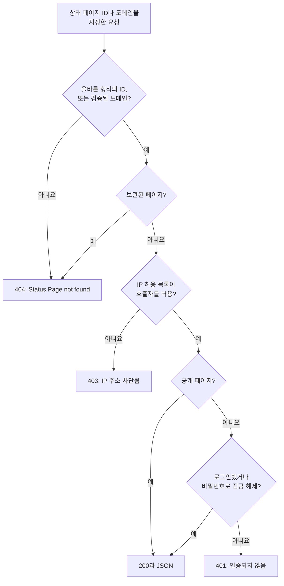

# 공용 API

모든 상태 페이지는 읽기 전용 JSON 엔드포인트 몇 개에 응답합니다. 개요, 가동률, 인시던트, 에피소드, 예정된 유지 보수 이벤트, 공지입니다. 상태 페이지 자체가 불러오는 엔드포인트이므로 방문자가 보는 것과 똑같은 내용을 반환하며, 공개 페이지라면 API 키가 필요 없습니다. 자체 앱, 챗봇, 벽걸이 화면에 상태를 보여 줄 때 쓰세요.

:::cards
- [엔드포인트](#엔드포인트): 페이지가 보여 주는 항목마다 엔드포인트 하나.
- [개요 읽기](#개요-읽기): 요청 한 번으로 페이지 전체를 가져옵니다(curl, Node.js, Python).
- [기간별 가동률](#기간별-가동률): 리소스와 그룹별 가동률(최대 90일).
- [오류](#오류): 각 상태 코드의 의미.
:::

## 요청에 응답하는 방식

각 요청은 상태 페이지를 ID나 사용자 지정 도메인 중 하나로 지정합니다. OneUptime은 페이지를 찾아 방문자에게 적용되는 것과 같은 접근 규칙을 적용하고 JSON으로 응답합니다.



비공개 페이지는 그 페이지에 로그인했거나 비밀번호로 잠금을 해제한 브라우저에만 응답합니다. API는 페이지와 같은 세션을 읽습니다. 스크립트에서는 공개 페이지를 쓰세요. [페이지를 볼 수 있는 사람 제한하기](/docs/status-pages/index#페이지를-볼-수-있는-사람-제한하기)를 참고하세요.

형식은 올바르지만 어떤 상태 페이지에도 해당하지 않는 ID는 비공개 페이지와 같은 경로를 거쳐 `401`을 받습니다. 공개 페이지가 `401`로 응답한다면 ID를 확인하세요.

## 시작하기 전에

- **상태 페이지 ID.** 대시보드에서 페이지를 엽니다(**상태 페이지 → 모든 상태 페이지**에서 해당 페이지). 페이지 **개요**의 **상태 페이지 세부 정보** 카드에 **상태 페이지 ID**가 표시됩니다.
- **기본 URL.** 아래 엔드포인트는 모두 `/status-page-api` 아래에 있습니다.

| 페이지가 실행되는 곳 | 기본 URL |
| ------------------- | -------- |
| OneUptime Cloud | `https://oneuptime.com/status-page-api` |
| 자체 호스팅 OneUptime | `https://<your-oneuptime-host>/status-page-api` |
| 페이지의 사용자 지정 도메인 | `https://status.example.com/status-page-api` |

아래 경로에 `{statusPageIdOrDomain}`이 있는 곳에는 페이지 ID나 검증된 사용자 지정 도메인(예: `status.example.com`) 중 하나를 보낼 수 있습니다. 가동률 엔드포인트는 ID만 받습니다.

## 엔드포인트

| 엔드포인트 | 메서드 | 반환하는 것 |
| -------- | ------- | ------- |
| `/overview/{statusPageIdOrDomain}` | `GET`, `POST` | 개요에 표시되는 모든 것: 전체 상태, 리소스와 그룹, 진행 중인 인시던트와 에피소드, 예정된 유지 보수, 게시 중인 공지, 가동률 막대의 바탕 데이터. |
| `/uptime/{statusPageId}` | `POST` | 기간별, 리소스별, 그룹별 가동률 백분율. |
| `/incidents/{statusPageIdOrDomain}` | `GET`, `POST` | 페이지가 목록에 올리는 인시던트와 그 공개 메모, 상태 변경. |
| `/incidents/{statusPageIdOrDomain}/{incidentId}` | `POST` | 인시던트 하나. |
| `/episodes/{statusPageIdOrDomain}` | `POST` | 페이지가 목록에 올리는 인시던트 에피소드. |
| `/episodes/{statusPageIdOrDomain}/{episodeId}` | `POST` | 에피소드 하나. |
| `/scheduled-maintenance-events/{statusPageIdOrDomain}` | `GET`, `POST` | 페이지가 목록에 올리는 예정된 유지 보수 이벤트와 그 공개 메모, 상태 변경. |
| `/scheduled-maintenance-events/{statusPageIdOrDomain}/{scheduledMaintenanceId}` | `POST` | 예정된 유지 보수 이벤트 하나. |
| `/announcements/{statusPageIdOrDomain}` | `GET`, `POST` | 페이지가 목록에 올리는 공지. |
| `/announcements/{statusPageIdOrDomain}/{announcementId}` | `POST` | 공지 하나. |

엔드포인트는 **상태 페이지에 표시되는 내용** 카드에 있는 페이지 자체의 설정을 따릅니다([페이지에 무엇을 표시할지 고르기](/docs/status-pages/index#페이지에-무엇을-표시할지-고르기) 참고).

- 꺼 둔 목록은 해당 엔드포인트를 거부합니다. 예를 들어 `Incidents are not enabled on this status page.`가 반환됩니다.
- 각 목록은 **최근 …일 표시** 설정(기본값 14)만큼 거슬러 올라갑니다. 인시던트 목록에는 아직 해결되지 않은 모든 인시던트도 포함되고, 예정된 유지 보수 목록에는 앞으로 있을 이벤트와 진행 중인 이벤트가 모두 포함됩니다.
- ID로 요청하면 인시던트, 에피소드, 이벤트, 공지는 오래된 것이라도 반환되므로, 오래된 항목에 대한 링크도 계속 작동합니다. 페이지가 아예 보여 주지 않는 항목(예: 페이지에 없는 모니터의 인시던트)은 빈 목록으로, 에피소드는 `404`로 돌아옵니다.

**페이지가 반환하는 인시던트.** 인시던트 엔드포인트는 페이지 모니터의 인시던트에서 다른 상태 페이지로 한정된 것을 빼고, 페이지가 자신에게 한정된 인시던트만 보여 주도록 설정되어 있다면 이 페이지로 한정되지 않은 인시던트도 모두 뺀 것을 반환합니다([대상별 상태 페이지](/docs/status-pages/one-status-page-per-audience) 참고). 인시던트가 어떤 페이지로 한정되어 있는지는 응답에 절대 포함되지 않습니다.

## 개요 읽기

개요는 페이지 전체를 위한 요청 하나입니다. 상태 페이지가 그리는 것과 같은 데이터이며, 길어야 15초 전 데이터입니다.

:::tabs
@tab curl
```bash
curl https://oneuptime.com/status-page-api/overview/YOUR_STATUS_PAGE_ID
```
@tab Node.js
```javascript title="status.mjs"
// Node.js 18 or later: fetch is built in. Run with `node status.mjs`.
const statusPageId = "YOUR_STATUS_PAGE_ID";

const response = await fetch(
  `https://oneuptime.com/status-page-api/overview/${statusPageId}`,
);
const body = await response.json();

if (!response.ok) {
  throw new Error(`${response.status}: ${body.error}`);
}

console.log(body.overallStatus?.name); // "Operational"
```
@tab Python
```python title="status.py"
# Python 3, standard library only. Run with `python3 status.py`.
import json
import urllib.request

STATUS_PAGE_ID = "YOUR_STATUS_PAGE_ID"
url = f"https://oneuptime.com/status-page-api/overview/{STATUS_PAGE_ID}"

with urllib.request.urlopen(url, timeout=10) as response:
    overview = json.load(response)

print((overview.get("overallStatus") or {}).get("name"))  # Operational
```
:::

전체 상태는 페이지에 있는 모니터와 모니터 그룹의 현재 상태 중 가장 나쁜 것, 즉 우선순위가 가장 높은 것입니다. 모니터 상태는 다음과 같습니다.

```json
{
  "_id": "cc80b385-4190-42a3-ae8b-9b391e90d79f",
  "name": "Operational",
  "color": { "_type": "Color", "value": "#2ab57d" },
  "isOperationalState": true,
  "priority": 1
}
```

### 개요가 반환하는 것

| 키 | 담긴 내용 |
| --- | ------------- |
| `overallStatus` | 페이지의 전체 상태. 위와 같은 모니터 상태이며, 페이지에 아무것도 없으면 `null`. |
| `statusPage` | 페이지의 공개 설정: 제목, 설명, 브랜딩, 표시하는 내용. |
| `statusPageResources` | 각 리소스: 표시 이름, 설명, 그룹, 모니터 또는 모니터 그룹, 표시 옵션. |
| `resourceGroups` | 그룹. 중첩된 그룹에는 `parentStatusPageGroupId`가 있습니다. |
| `monitorStatuses` | 프로젝트의 모든 모니터 상태. 우선순위가 낮은 것부터 높은 것 순. |
| `monitorGroupCurrentStatuses`, `monitorsInGroup` | 페이지에 있는 각 모니터 그룹의 현재 상태와 그 안의 모니터. |
| `monitorStatusTimelines`, `uptimeDailyAggregate`, `monitorGroupMergedDowntime`, `statusPageHistoryChartBarColorRules` | 가동률 막대를 그리는 데이터와 페이지의 막대 색상 규칙. |
| `activeIncidents`, `incidentPublicNotes`, `incidentStateTimelines`, `incidentStates` | 페이지가 보여 주는 해결되지 않은 인시던트, 그 공개 메모와 상태 변경, 프로젝트의 인시던트 상태. |
| `timelineIncidents` | 가동률 막대 기간 안의 인시던트(해결된 것 포함). 막대의 툴팁에 쓰입니다. |
| `activeEpisodes`, `episodePublicNotes`, `episodeStateTimelines` | 인시던트 에피소드에 대한 같은 데이터. |
| `scheduledMaintenanceEvents`, `scheduledMaintenanceEventsPublicNotes`, `scheduledMaintenanceStateTimelines`, `scheduledMaintenanceStates` | 앞으로 있거나 진행 중인 예정된 유지 보수 이벤트와 그 공개 메모, 상태 변경. |
| `activeAnnouncements` | 지금 표시 중인 공지: 시작되었고 아직 끝나지 않은 것. |

## 기간별 가동률

`POST /uptime/{statusPageId}`는 두 날짜 사이의, 페이지에 있는 각 리소스와 그룹의 가동률을 반환합니다. 두 날짜 모두 선택 사항입니다.

| 필드 | 기본값 | 참고 |
| ----- | ------- | ----- |
| `startDate` | 14일 전 | ISO 8601 날짜와 시간. |
| `endDate` | 현재 | `startDate`보다 앞설 수 없습니다. 기간은 최대 90일입니다. |

:::tabs
@tab curl
```bash
curl -X POST https://oneuptime.com/status-page-api/uptime/YOUR_STATUS_PAGE_ID \
  -H "Content-Type: application/json" \
  -d '{"startDate": "2026-09-01T00:00:00Z", "endDate": "2026-09-30T23:59:59Z"}'
```
@tab Node.js
```javascript title="uptime.mjs"
// Node.js 18 or later. Run with `node uptime.mjs`.
const statusPageId = "YOUR_STATUS_PAGE_ID";

const response = await fetch(
  `https://oneuptime.com/status-page-api/uptime/${statusPageId}`,
  {
    method: "POST",
    headers: { "Content-Type": "application/json" },
    body: JSON.stringify({
      startDate: "2026-09-01T00:00:00Z",
      endDate: "2026-09-30T23:59:59Z",
    }),
  },
);
const uptime = await response.json();

for (const group of uptime.groupUptimes) {
  console.log(group.statusPageGroupName, group.uptimePercent);
}
```
@tab Python
```python title="uptime.py"
# Python 3, standard library only. Run with `python3 uptime.py`.
import json
import urllib.request

STATUS_PAGE_ID = "YOUR_STATUS_PAGE_ID"

request = urllib.request.Request(
    f"https://oneuptime.com/status-page-api/uptime/{STATUS_PAGE_ID}",
    data=json.dumps(
        {"startDate": "2026-09-01T00:00:00Z", "endDate": "2026-09-30T23:59:59Z"}
    ).encode(),
    headers={"Content-Type": "application/json"},
    method="POST",
)

with urllib.request.urlopen(request, timeout=10) as response:
    uptime = json.load(response)

for group in uptime["groupUptimes"]:
    print(group["statusPageGroupName"], group["uptimePercent"])
```
:::

응답:

```json
{
  "statusPageResourceUptimes": [
    {
      "statusPageResourceId": {
        "_type": "ObjectID",
        "value": "cfffa3c3-fdf3-4cd7-9585-d6d408a14663"
      },
      "uptimePercent": 99.98,
      "statusPageResourceName": "Checkout API",
      "currentStatus": {
        "_id": "cc80b385-4190-42a3-ae8b-9b391e90d79f",
        "name": "Operational",
        "color": { "_type": "Color", "value": "#2ab57d" },
        "isOperationalState": true,
        "priority": 1
      }
    }
  ],
  "groupUptimes": [
    {
      "statusPageGroupId": {
        "_type": "ObjectID",
        "value": "df7632c4-c5c0-453c-88bf-9ee3d68d45f2"
      },
      "parentStatusPageGroupId": null,
      "uptimePercent": 99.98,
      "statusPageResourceUptimes": [
        {
          "statusPageResourceId": {
            "_type": "ObjectID",
            "value": "8175534f-aa77-456c-ad5b-b8e7b85876aa"
          },
          "uptimePercent": 99.98,
          "statusPageResourceName": "Web app",
          "currentStatus": {
            "_id": "cc80b385-4190-42a3-ae8b-9b391e90d79f",
            "name": "Operational",
            "color": { "_type": "Color", "value": "#2ab57d" },
            "isOperationalState": true,
            "priority": 1
          }
        }
      ],
      "statusPageGroupName": "Web",
      "currentStatus": {
        "_id": "cc80b385-4190-42a3-ae8b-9b391e90d79f",
        "name": "Operational",
        "color": { "_type": "Color", "value": "#2ab57d" },
        "isOperationalState": true,
        "priority": 1
      }
    }
  ],
  "startDate": "2026-09-01T00:00:00.000Z",
  "endDate": "2026-09-30T23:59:59.000Z"
}
```

| 키 | 담긴 내용 |
| --- | ------------- |
| `statusPageResourceUptimes` | 어느 그룹에도 속하지 않은 리소스. 방문자가 페이지 맨 위에서 보는 리소스입니다. |
| `groupUptimes` | 그룹마다 항목 하나. 그룹의 `uptimePercent`와 `currentStatus`는 중첩된 그룹을 포함해 그 아래의 모든 리소스를 대상으로 하며, 그룹의 `statusPageResourceUptimes`는 그룹 바로 아래의 리소스만 나열합니다. 트리는 `parentStatusPageGroupId`로 다시 만듭니다. |
| `uptimePercent` | 리소스나 그룹 자체의 정밀도로 반올림한 값. 리소스나 그룹이 가동률 백분율을 표시하지 않으면 `null`. |
| `currentStatus` | 리소스나 그룹이 현재 상태를 표시하지 않으면 `null`. |

모니터 상태가 페이지의 **다운타임으로 계산** 상태 중 하나인 시간은 다운타임으로 계산됩니다.

## 인시던트, 에피소드, 유지 보수, 공지

목록 엔드포인트는 `POST`뿐 아니라 `GET`에도 응답합니다. 단일 항목 엔드포인트와 에피소드 엔드포인트는 `POST`에 응답합니다.

:::tabs
@tab curl
```bash
# The incidents the page lists
curl https://oneuptime.com/status-page-api/incidents/YOUR_STATUS_PAGE_ID

# One scheduled maintenance event
curl -X POST https://oneuptime.com/status-page-api/scheduled-maintenance-events/YOUR_STATUS_PAGE_ID/EVENT_ID
```
@tab Node.js
```javascript title="incidents.mjs"
// Node.js 18 or later. Run with `node incidents.mjs`.
const statusPageId = "YOUR_STATUS_PAGE_ID";

const response = await fetch(
  `https://oneuptime.com/status-page-api/incidents/${statusPageId}`,
);
const { incidents } = await response.json();

for (const incident of incidents) {
  console.log(incident.title, incident.currentIncidentState?.name);
}
```
@tab Python
```python title="incidents.py"
# Python 3, standard library only. Run with `python3 incidents.py`.
import json
import urllib.request

STATUS_PAGE_ID = "YOUR_STATUS_PAGE_ID"
url = f"https://oneuptime.com/status-page-api/incidents/{STATUS_PAGE_ID}"

with urllib.request.urlopen(url, timeout=10) as response:
    incidents = json.load(response)["incidents"]

for incident in incidents:
    print(incident["title"], (incident.get("currentIncidentState") or {}).get("name"))
```
:::

| 엔드포인트 | 응답의 키 |
| -------- | -------------------- |
| 인시던트 | `incidents`, `incidentPublicNotes`, `incidentStateTimelines`, `incidentStates`, `statusPageResources`, `monitorsInGroup` |
| 에피소드 | `episodes`, `episodePublicNotes`, `episodeStateTimelines`, `incidentStates`, `statusPageResources`, `monitorsInGroup` |
| 예정된 유지 보수 이벤트 | `scheduledMaintenanceEvents`, `scheduledMaintenanceEventsPublicNotes`, `scheduledMaintenanceStateTimelines`, `scheduledMaintenanceStates`, `statusPageResources`, `monitorsInGroup` |
| 공지 | `announcements`, `statusPageResources`, `monitorsInGroup` |

단일 항목 요청은 같은 키로 응답하며, 그 안에 해당 레코드 하나가 들어 있습니다.

## 오류

오류는 상태 코드와 이유를 담은 JSON 본문으로 응답합니다.

```json
{ "error": "You can only get uptime for 90 days. Please select a date range within 90 days." }
```

| 상태 | 발생하는 경우 |
| ------ | ---- |
| `400` | 꺼 둔 목록처럼 페이지가 보여 주지 않는 것을 요청했거나, 가동률 기간이 90일보다 길거나 시작보다 먼저 끝나는 경우. |
| `401` | 페이지가 비공개이고, 요청에 로그인한 세션도 비밀번호도 없는 경우. 형식은 올바르지만 어떤 상태 페이지에도 해당하지 않는 ID도 `401`을 받습니다. |
| `403` | 페이지의 IP 허용 목록에 호출자의 주소가 없는 경우. |
| `404` | ID 형식이 올바르지 않거나, 일치하는 검증된 사용자 지정 도메인이 없거나, 페이지가 보관된 경우. 페이지가 보여 주지 않는 에피소드도 `404`를 받습니다. |

## 상태 페이지를 읽는 다른 방법

- **RSS.** 모든 상태 페이지는 인시던트, 공지, 예정된 유지 보수 이벤트의 피드인 `/rss`를 제공합니다. [임베드 배지와 RSS 피드](/docs/status-pages/index#임베드-배지와-rss-피드)를 참고하세요.
- **llms.txt.** 모든 상태 페이지는 `/rss`와 함께 `/llms.txt`도 제공하며, 이 파일은 AI 에이전트에게 RSS 피드와 개요 JSON의 위치를 알려 줍니다.
- **MCP.** AI 에이전트는 OneUptime의 MCP 서버(`https://oneuptime.com/mcp`)를 통해 API 키 없이 페이지를 읽을 수 있으며, 페이지 ID나 도메인을 `statusPageIdOrDomain`으로 넘깁니다. 기본으로 켜져 있으며, 페이지 사이드 메뉴의 **AI → MCP**에 있는 **MCP 서버 활성화**로 끌 수 있습니다. [MCP 서버](/docs/ai/mcp-server)를 참고하세요.
- **REST API.** 상태 페이지, 리소스, 구독자, 공지를 만들거나 바꾸려면 API 키와 함께 [OneUptime API](/docs/api-reference/api-reference)를 사용하세요.

## 다음 단계

:::cards
- [상태 페이지 개요](/docs/status-pages/index): 상태 페이지가 보여 주는 것과 볼 수 있는 사람.
- [상태 페이지 리소스 및 그룹](/docs/status-pages/resources-and-groups): 이 엔드포인트들이 반환하는 리소스와 그룹.
- [대상별 상태 페이지](/docs/status-pages/one-status-page-per-audience): 어떤 페이지에는 나오는 인시던트가 다른 페이지에는 나오지 않는 이유.
- [상태 페이지 브랜딩 및 도메인](/docs/status-pages/branding-and-domains): 페이지와 이 엔드포인트들을 자체 도메인에서 제공합니다.
:::
