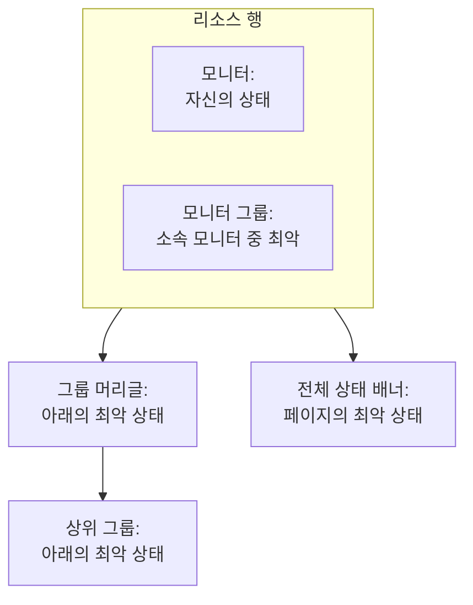

# 상태 페이지 리소스 및 그룹

리소스는 상태 페이지의 한 행입니다. 고객이 이해할 수 있는 이름, 현재 상태, 원하면 가동 시간과 기록까지 갖춘 모니터나 모니터 그룹입니다. 그룹은 리소스를 담는 섹션이므로, 모니터가 40개인 페이지도 끝없는 목록 하나가 아니라 "API", "웹 앱", "데이터 파이프라인"처럼 읽힙니다. 둘 다 한 화면에서 만듭니다. 상태 페이지를 열고 사이드 메뉴에서 **리소스**를 선택하세요.

:::cards
- [모니터 추가](#모니터-추가): 방문자가 읽을 이름으로 모니터를 페이지에 올립니다.
- [그룹](#그룹): 페이지를 섹션으로 나누고 중첩합니다.
- [모니터 규칙](#모니터-규칙으로-모니터-자동-추가): 일치하는 모든 모니터를 규칙이 대신 추가하게 합니다.
- [CSV에서 그룹 가져오기](#csv에서-그룹-가져오기): 깊은 계층 구조를 한 번에 만듭니다.
:::

방문자는 이 행들을 보고 "내 문제인지 저쪽 문제인지"를 판단하므로, 고객이 제품을 부르는 방식대로 이름을 지으세요. `prod-checkout-lb-healthcheck-us-east-1`이 아니라 **Checkout API**입니다.

## 상태가 페이지 위로 올라가는 방식

각 행은 해당 모니터의 현재 상태를 보여 줍니다. 그 위의 각 수준은 아래에 있는 모든 것 중 가장 나쁜 상태를 보여 주며, 가장 나쁜 상태란 프로젝트의 모니터 상태 중 우선순위가 가장 높은 상태입니다.

리소스가 결정하는 것은 행의 색만이 아닙니다.

- **보관된 모니터는 표시되지 않습니다.** 보관된 모니터는 더 이상 확인되지 않으므로 마지막 상태가 그대로 멈춰 있습니다. 페이지는 그 멈춘 상태를 현재 상태처럼 보여 주는 대신 그 행을 빼고(모니터 그룹의 상태에서도 뺍니다) 표시합니다. 행은 남아 있으므로 모니터의 보관을 해제하면 바로 돌아옵니다.
- **페이지에 표시되는 인시던트는 리소스가 결정합니다.** 인시던트의 모니터 중 하나가 직접 또는 모니터 그룹을 통해 페이지의 리소스이면, 인시던트가 여기에 표시되고 페이지의 구독자에게도 알려집니다. 같은 모니터를 여러 페이지에 두면, 인시던트가 일부 페이지로 제한되지 않는 한 그 인시던트는 모든 페이지에 도달합니다. [대상별 상태 페이지](/docs/status-pages/one-status-page-per-audience)를 참고하세요.
- **모니터 그룹 행은 그룹 안의 모든 모니터를 대표하며, 구독자에게도 마찬가지입니다.** 구독자가 리소스를 고를 수 있는 페이지에서 모니터 그룹을 구독한 사람은, 그룹 안의 어떤 모니터에 대한 인시던트, 예정된 유지 관리, 공지든 그 모니터를 고른 것처럼 알림을 받습니다. [구독자 및 공지](/docs/status-pages/subscribers#구독자가-리소스와-이벤트-유형을-고르게-하기)를 참고하세요.

## 리소스 화면

이 항목은 모니터 그룹이 켜진 프로젝트에서는 **리소스**, 그 밖의 프로젝트에서는 **모니터**라는 이름이며, 같은 화면입니다. 예전에는 그룹에 별도 페이지가 있었고, 옛 주소 `/groups`는 이제 이 화면을 엽니다.

화면은 둘로 나뉩니다.

| 부분 | 내용 |
| ---- | ------------- |
| **그룹 탐색기**(왼쪽) | 페이지의 모든 그룹을 트리로 보여 주며, 위에는 **Search groups...** 상자, 아래에는 `3 groups · 12 resources` 같은 개수가 있습니다. 긴 목록의 끝에는 **Show N more of M** 버튼이 있습니다. |
| **Top of page** | 탐색기의 첫 행입니다. 그룹에 속하지 않은 리소스로, 방문자가 모든 그룹보다 위에서 가장 먼저 봅니다. 그룹이 없는 페이지에서는 오른쪽 창의 제목이 대신 **All resources**가 됩니다. |
| **리소스 창**(오른쪽) | 선택한 그룹의 리소스입니다. 머리글에 **Edit Group**, 기본 **모니터 추가** 버튼, **More actions** 메뉴가 있습니다. |
| 카드 머리글 | **New Group**과, **Import groups from CSV** 및 **새로고침**이 있는 점 세 개 메뉴. |

**빈 상태가 할 일을 알려 줍니다.** 빈 그룹에는 **No monitors here yet**과 함께 **모니터 추가**, **Add Multiple**, 그리고 페이지에 그룹이 하나도 없을 때만 **Create a Group**이 표시됩니다. 아무것도 일치하지 않는 검색에는 **No resources match your search**가 표시됩니다.

## 모니터 추가

:::steps
### 행을 둘 위치 선택

그룹 탐색기에서 리소스가 속할 그룹을 선택하거나, 그룹에 속하지 않는 행이라면 **Top of page**를 선택합니다.

### 모니터 추가 클릭

**Add a monitor to {group}** 대화 상자가 열립니다. 한 페이지짜리 대화 상자입니다.

### 모니터 선택

**모니터**(자리 표시자 **모니터 선택**)에서 고릅니다. 방문자가 읽는 텍스트인 **표시 이름**에는 모니터 이름이 채워지며, 직접 이름을 입력하기 전까지는 다른 모니터를 고르면 그에 따라 바뀝니다. 표시 이름은 모니터 자체의 이름과 따로 저장되므로, 여기서 이름을 바꿔도 모니터링에는 아무 영향이 없습니다.

### 원하면 표시 옵션 설정

**추가 필드**는 접혀 있습니다. 그 안에는 **설명**(행 아래에 표시되는 선택적 markdown으로, 서비스가 실제로 하는 일을 한 문장으로 설명하기 좋습니다. 그 안의 이미지는 모든 방문자에게 표시됩니다)과 [표시 옵션](#리소스의-표시-옵션)이 있습니다. 닫아 두면 리소스는 그 기본값을 사용합니다.

### 리소스 저장

**모니터 추가**를 클릭합니다. 행이 그룹과 상태 페이지에 나타납니다.
:::

그리드 그룹에서는 대화 상자가 **추가 필드** 위에서 모니터를 둘 행과 열도 묻습니다. [목록 레이아웃과 그리드 레이아웃](#목록-레이아웃과-그리드-레이아웃)을 참고하세요.

> [!TIP]
> 여러 확인을 한 행으로 보여 주려면 모니터 그룹을 추가하세요. **모니터 그룹** 스위치가 켜져 있으면(**프로젝트 설정** > **고급** > **기능 플래그**, 전환하는 즉시 저장됨) 드롭다운 아래에 **Add a Monitor Group instead.** 링크가 표시됩니다. 클릭하면 **모니터**가 **모니터 그룹**(**모니터 그룹 선택**)으로 바뀌고, **Add a Monitor instead.** 로 되돌아갑니다.

### 여러 개 한 번에 추가

**Add Multiple**(**More actions** 메뉴의 **Add multiple monitors**도 같음)은 **Add Multiple Monitors**를 엽니다. 이것도 한 페이지입니다. **모니터** 다중 선택과, 같은 접힌 **추가 필드**가 있으며, 그 표시 옵션은 선택한 모든 모니터에 적용됩니다. 각 리소스는 표시 이름과 설명을 모니터에서 가져오고, **Add Monitors**가 모두 추가합니다. 새 페이지를 채우는 가장 빠른 방법입니다.

다중 선택에는 **레이블** 탭이 있습니다. 레이블을 클릭하면 그 레이블이 붙은 모든 모니터가 한 번에 선택됩니다.

### 같은 레이블로 두 번 추가해도 안전함

상태 페이지에는 모니터가 한 번만 올라갑니다. 추가는 멱등적이므로, 새 모니터 몇 개에 레이블을 붙인 뒤 같은 레이블을 다시 고르면 새 모니터만 추가됩니다. 이미 페이지에 있는 모니터는 지정해 둔 표시 이름과 옵션 그대로 전혀 바뀌지 않습니다.

여러 개 추가의 마지막 요약에도 그렇게 나옵니다. 추가된 모니터는 **추가됨** 아래에, 이미 있던 모니터는 **Already Added** 아래에 나열됩니다. 실패로 보고되는 것은 없으며, 그 모니터들에 대해서는 아무것도 기록되지 않습니다.

리소스가 만들어지는 다른 모든 곳에도 같은 규칙이 적용됩니다. 단일 추가 양식에서 이미 페이지에 있는 모니터를 추가하거나, 편집 양식에서 기존 리소스가 그 모니터를 가리키게 하면 *"This monitor is already added to this status page"*로 거부됩니다. 기존 리소스가 다른 그룹에 있어도 마찬가지인데, 방문자에게는 여전히 모니터가 두 번 보이기 때문입니다. 모니터를 다른 그룹에 표시하려면 이미 있는 리소스를 삭제하고 원하는 곳에 추가하세요.

## 리소스의 표시 옵션

**추가 필드** 섹션은 단일 추가 양식과 여러 개 추가 대화 상자에서 같습니다. 둘 다 처음에는 접혀 있으며, **리소스 편집**에서도 마찬가지입니다. 그곳에서는 접힌 머리글에 기본값과 달라진 항목이 표시됩니다. 여기의 모든 설정은 리소스별입니다. 같은 그룹의 두 행을 다르게 설정할 수 있습니다.

| 필드 | 기본값 | 역할 |
| ----- | ------- | ------------ |
| **툴팁**(`displayTooltip`) | 비어 있음 | 상태 페이지의 리소스 옆에 툴팁으로 표시됩니다. "미국 및 EU 고객"처럼 범위를 알리는 데 사용하세요. |
| **현재 리소스 상태 표시**(`showCurrentStatus`) | 켜짐 | 정상, 저하, 오프라인 같은 현재 상태를 행 옆에 표시합니다. |
| **가동 시간 % 표시**(`showUptimePercent`) | 꺼짐 | 리소스 옆에 가동 시간 비율을 표시합니다. |
| **가동 시간 정밀도 선택**(`uptimePercentPrecision`) | 소수점 한 자리 | **가동 시간 % 표시**가 켜지면 나타나며, 그때는 필수입니다. |
| **상태 기록 차트 표시**(`showStatusHistoryChart`) | 켜짐 | 리소스의 가동 시간 기록을 일별 막대로 표시합니다. |

**표시 이름**(`displayName`)과 **설명**(`displayDescription`)도 표시 전용입니다. 모니터 자체는 절대 바꾸지 않습니다.

## 가동 시간 비율과 기록 차트

**가동 시간 % 표시**와 **상태 기록 차트 표시**는 둘 다 페이지 전체에 걸친 설정 하나를 읽습니다. 다루는 일수입니다. 그것은 **상태 페이지 → 해당 페이지 → 고급 → 고급 설정**의 **상태 페이지에 표시되는 내용** 카드에 있는 **가동 시간 기록**입니다. 1일부터 90일까지 받으며 기본값은 90일입니다. 즉 스위치는 리소스마다 켜고, 기간은 페이지 전체에 대해 한 번만 정합니다.

**정밀도는 판단의 문제입니다.** **가동 시간 정밀도 선택**에는 `99% (No Decimal)`, `99.9% (One Decimal)`, `99.99% (Two Decimal)`, `99.999% (Three Decimal)`이 있습니다. 자릿수가 많을수록 정확해 보이지만 세 번째 자리를 두고 논쟁을 부릅니다. 쓰리 나인 SLA를 공개한다면 그에 맞추고 그 이상은 하지 마세요.

그룹에도 이 스위치들의 자체 사본이 있으므로(아래 참고), 그룹은 합산된 비율을 보여 주고 그 안의 모니터는 조용히 둘 수 있으며, 그 반대도 가능합니다.

기록 차트 막대의 색은 **브랜딩** 페이지의 **추가 설정**에서, 어떤 모니터 상태를 "다운"으로 셀지는 **고급 설정**의 **상태 페이지에 표시되는 내용** 카드에 있는 **다운타임으로 계산**에서 정합니다. 둘 다 [상태 페이지 브랜딩 및 도메인](/docs/status-pages/branding-and-domains)에서 다룹니다.

## 그룹

대부분의 그룹에는 이름만 있으면 됩니다.

:::steps
### New Group 클릭

**Create New Status Page Group**이 열립니다. 필드 두 개와, 그다음 접힌 섹션 두 개가 있습니다.

### 그룹 이름 지정

**그룹 이름**을 입력합니다. 방문자가 보는 섹션 머리글입니다.

### 다른 그룹에 속한다면 중첩

**Parent Group**을 고르거나 **No parent group (top level)** 그대로 둡니다. 그룹 메뉴의 **Add a sub group**을 쓰면 이 값이 자동으로 채워집니다.

### 그룹 만들기

**Create Status Page Group**을 클릭합니다. 그룹이 탐색기에 나타나며 모니터를 넣을 준비가 됩니다.
:::

두 필드는 **그룹 이름**(`name`)과 **Parent Group**(`parentStatusPageGroupId`)입니다. 접힌 두 섹션에 나머지가 모두 있습니다.

- **레이아웃**: 접힌 머리글에 **List** 또는 **Grid**가 표시됩니다. **보기 모드**와 그리드의 축([목록 레이아웃과 그리드 레이아웃](#목록-레이아웃과-그리드-레이아웃) 참고)이 있으며, 그리드 그룹에서는 저절로 열립니다.
- **추가 필드**: 리소스 옵션의 그룹 수준 사본입니다.
  - **그룹 설명**(`description`): 머리글 아래에 표시되는 선택적 markdown입니다. 그 안의 이미지는 모든 방문자에게 표시됩니다.
  - **기본적으로 상태 페이지에서 펼치기**(`isExpandedByDefault`): 기본값은 켜짐이며, 방문자에게 섹션이 펼쳐진 상태로 시작할지 접힌 상태로 시작할지를 정합니다.
  - **현재 그룹 상태 표시**(`showCurrentStatus`): 기본값은 켜짐입니다. 그룹 머리글 옆에 상태를 표시합니다.
  - **가동 시간 % 표시**(`showUptimePercent`): 기본값은 꺼짐이며, 켜면 **가동 시간 정밀도 선택**이 나타납니다.

그룹을 바꾸려면 창 머리글의 **Edit Group**이나 탐색기 행 메뉴의 **Edit group**을 사용하세요. **Edit Status Page Group**이 열리고 **변경 사항 저장** 버튼이 있습니다. 창 머리글에는 켜져 있는 설정(**Grid**, **Collapsed by default**, **Uptime %** )이 칩으로 표시되므로, 양식을 열지 않고도 그룹 설정을 알 수 있습니다.

### 그룹 관리

| 위치 | 동작 |
| ----- | ------- |
| 탐색기의 행 메뉴 | **Edit group**, **Move up**, **Move down**, **ID 표시**, **Delete group** |
| 창의 **More actions** 메뉴 | **Edit this group**, **Add a sub group**, **Move group up**, **Move group down**, **Show group ID**, **새로고침**, **Delete this group** |

이름 없이 저장한 그룹은 **Untitled group**으로 표시됩니다. 무언가 입력하려 했다는 좋은 신호입니다.

## 그룹 중첩

그룹은 중첩할 수 있습니다. 하위 그룹에서 **Parent Group**을 설정하거나 탐색기에서 **Add a sub group inside this group**을 사용하세요. 양식의 도움말 텍스트는 이 기능이 염두에 둔 구조(사업부 › 지역 › 시장 같은 것)를 설명하며, 각 수준은 아래에 있는 모든 것의 합산 상태와 가동 시간을 보여 줍니다.

그룹에 하위 그룹이 있으면 리소스 창에 각 하위 그룹으로 바로 이동하는 **Sub groups** 칩 행이 표시되므로, 탐색기로 돌아가지 않고 계층을 따라갈 수 있습니다.

중첩은 큰 페이지에서 효과가 있습니다. 제품 안에 지역이 있는 호스팅 업체나, 사업부 안에 시장이 있는 소매업체 같은 경우입니다. 모니터가 12개인 페이지라면 평평한 한 수준이 더 편합니다.

## 목록 레이아웃과 그리드 레이아웃

그룹 양식의 **레이아웃** 섹션은 그룹의 **보기 모드**(`viewMode`)를 정하며, 상태 페이지에서 그룹이 보이는 방식을 바꿉니다.

| 원하는 것 | 선택 |
| --------------- | ---- |
| 서비스를 행마다 하나씩 단순한 세로 목록으로 보여 주기 | **List**(기본값) |
| 같은 서비스를 여러 지역이나 테넌트에 걸쳐 행렬로 보여 주기 | **Grid** |

**Grid**를 고르면 필드 네 개가 더 나타납니다.

| 필드 | 입력할 내용 |
| ----- | ------------- |
| **행 축 레이블** | 행 차원의 이름. 자리 표시자는 `Service`. |
| **행 축 값** | 행. **Add Row**로 하나씩 추가합니다(자리 표시자는 `e.g. Auth`). |
| **열 축 레이블** | 열 차원. 자리 표시자는 `Region`. |
| **열 축 값** | 열. **Add Column**으로 추가합니다(자리 표시자는 `e.g. US-East`). |

그리드 그룹의 각 모니터는 셀 하나를 차지하므로, **모니터 추가**와 여러 개 추가 대화 상자는 직접 정한 축 레이블을 사용해 모니터와 함께 행과 열을 묻습니다.

> [!IMPORTANT]
> 모니터를 추가하기 전에 축을 설정하세요. 행도 열도 없는 그리드 그룹에는 아직 모니터를 둘 곳이 없다는 알림과 함께, 그룹 양식을 **레이아웃** 섹션에서 여는 **Set up the grid** 버튼이 표시되며, 설정할 때까지 그 그룹의 **모니터 추가** 버튼은 사라집니다.

## 방문자에게 보이는 순서

순서는 알파벳이 아니라 직접 정합니다.

| 대상 | 순서를 바꾸는 방법 |
| ---- | ----------------- |
| 그룹 안의 리소스 | 행을 끕니다. 창에도 **Drag a row to change the order visitors see**라고 표시됩니다. |
| 그룹끼리의 순서 | 탐색기 행 메뉴의 **Move up** / **Move down**, 또는 **More actions**의 **Move group up** / **Move group down**. |
| 그룹에 속하지 않은 리소스 | **Top of page**에 있으며 항상 모든 그룹 위에 표시되므로, 모두가 가장 먼저 확인하는 것을 여기에 두세요. |

**끌기가 꺼지는 두 가지 경우.** **Search in {group}...** 상자로 검색하면 순서 변경이 꺼집니다(창에 `N of M shown · drag to reorder is off while filtering`이 표시됨). 먼저 검색을 지우세요. 또한 그리드 그룹은 끌어서 순서를 바꿀 수 없습니다. 모니터의 위치는 행과 열로 정해지기 때문입니다.

가장 많이 문의받는 서비스를 맨 위에 두세요. 장애 중에 페이지를 찾은 방문자는 대개 첫 화면에서 읽기를 멈춥니다.

## 모니터 규칙으로 모니터 자동 추가

모니터 규칙은 페이지에 모니터를 대신 추가합니다. 모니터를 한 번 설명해 두면, 일치하는 모든 모니터가 고른 그룹에 들어갑니다. 규칙은 리소스 화면 옆의 **리소스 → Monitor Rules**에 있습니다.

:::steps
### Monitor Rules 열기

상태 페이지를 열고 사이드 메뉴의 **리소스** 섹션에서 **Monitor Rules**를 선택한 뒤 **Status Page Monitor Rule 만들기**를 클릭합니다.

### 규칙 이름 지정

**기본 정보**에서 **이름**을 입력합니다. **활성화됨**은 기본으로 켜져 있습니다.

### 일치할 모니터 지정

**일치 기준**에서 **모니터 레이블**(그중 하나라도 붙은 모니터가 일치), **모니터 이름**, **모니터 설명** 중 하나 이상을 채웁니다. 모니터는 채운 모든 기준을 통과해야 합니다. 두 패턴은 대소문자를 구분하지 않는 정규식(`^api-.*`)이나 와일드카드 `*`(`*checkout*`)를 받으며, `.*`는 모든 모니터와 일치합니다.

### 그룹 선택

**그룹**에서 **Add Monitors To Group**을 고르거나, 모니터를 그룹 없이 추가하려면 비워 둡니다. 이어서 리소스와 같은 표시 옵션이 나오며, 규칙에서는 **가동 시간 % 표시**가 처음부터 켜져 있습니다.

### 규칙 저장

규칙은 이미 있는 모든 모니터에 대해 즉시 실행되고, 목록의 **Adds Monitors To** 아래에 모니터를 추가할 그룹이 표시됩니다.
:::

그 후에는 모니터가 만들어지거나 레이블, 이름, 설명이 바뀔 때마다 그 모니터에 대해 규칙이 다시 실행됩니다. 규칙은 자신이 추가한 리소스만 제거합니다. 규칙을 끄거나 삭제하면 그 리소스들이 페이지에서 빠지지만, 직접 추가한 모니터는 절대 건드리지 않습니다. 이미 페이지에 있는 모니터가 두 번 추가되는 일은 없습니다.

## CSV에서 그룹 가져오기

깊은 계층 구조를 직접 만드는 일은 번거롭습니다. 카드 머리글의 점 세 개 메뉴에 있는 **Import groups from CSV**가 **Import Groups from CSV** 대화 상자를 엽니다.

:::steps
### 템플릿 다운로드

**Download CSV Template**를 클릭해 `status-page-groups-template.csv`를 받습니다.

### 작성

그룹마다 한 행입니다. 필수는 `name`뿐이며, 열은 아래에 나와 있습니다.

### 업로드하고 미리 보기

**Choose CSV File**을 클릭해 파일을 고른 뒤 **Preview Import**로, 무엇이든 기록되기 전에 만들어질 내용을 확인합니다.

### 가져오기

가져오기를 실행합니다. **Import results** 표에 모든 행이 이유와 함께 **생성됨**, **실패**, **건너뜀**으로 표시되므로, 잘못된 행이 조용히 사라지는 일이 없습니다.
:::

| 열 | 설정하는 내용 |
| ------ | ------------ |
| `name` | 그룹 이름. 필수. |
| `parentName` | 이 그룹이 중첩될 그룹의 이름. |
| `description` | 그룹 설명. |
| `isExpandedByDefault` | 방문자에게 섹션이 펼쳐진 상태로 시작하는지 여부. |
| `showCurrentStatus` | 그룹 머리글 옆에 상태를 표시할지 여부. |
| `showUptimePercent` | 그룹 옆에 가동 시간 비율을 표시할지 여부. |
| `uptimePercentPrecision` | 그 비율에 쓰는 소수점 자릿수. |
| `viewMode` | `List` 또는 `Grid`. |
| `rowAxisLabel` | 그리드 그룹의 행 차원 이름. |
| `rowAxisValues` | 그리드 그룹의 행 값. |
| `columnAxisLabel` | 그리드 그룹의 열 차원 이름. |
| `columnAxisValues` | 그리드 그룹의 열 값. |

가져오기는 리소스가 아니라 그룹을 만듭니다. 그다음 **모니터 추가**, **Add Multiple**, 또는 모니터 규칙으로 모니터를 추가하세요.

## 문제 해결

:::details "This monitor is already added to this status page"
페이지에는 그룹이 달라도 각 모니터가 한 번만 올라갑니다. 그 모니터에는 이미 리소스가 있으며, 다른 그룹에 있거나 모니터 규칙이 추가했을 수 있습니다. 탐색기에서 검색해 그 리소스를 삭제한 뒤 원하는 곳에 모니터를 추가하세요.
:::

:::details 추가한 모니터가 상태 페이지에 보이지 않음
모니터가 보관되었는지 확인하세요. 보관된 모니터의 행은 보관을 해제할 때까지 빠집니다. 그룹도 확인하세요. 접힌 상태로 시작하도록 설정된 그룹(**기본적으로 상태 페이지에서 펼치기** 꺼짐)은 방문자가 열 때까지 행을 숨깁니다.
:::

:::details 그리드 그룹에 모니터 추가 버튼이 없음
그리드에 아직 행이나 열이 없습니다. **Set up the grid**를 클릭하고 **레이아웃** 섹션에서 축 값을 추가하면 **모니터 추가**가 돌아옵니다.
:::

:::details 행을 끌 수 없음
**Search in {group}...** 상자를 비우세요. 창이 필터링된 동안에는 순서 변경이 꺼집니다. 그리드 그룹은 끌어서 순서를 바꿀 수 없습니다.
:::

## 다음 단계

:::cards
- [상태 페이지 브랜딩 및 도메인](/docs/status-pages/branding-and-domains): 로고, 파비콘, 기록 차트 색, 자체 도메인.
- [구독자 및 공지](/docs/status-pages/subscribers): 이 리소스가 바뀔 때 누가 알림을 받는지.
- [대상별 상태 페이지](/docs/status-pages/one-status-page-per-audience): 여러 페이지에 올린 같은 모니터와, 일부 페이지에만 도달하는 인시던트.
- [공용 API](/docs/status-pages/public-api): 리소스, 그룹, 가동 시간을 JSON으로 읽습니다.
:::
