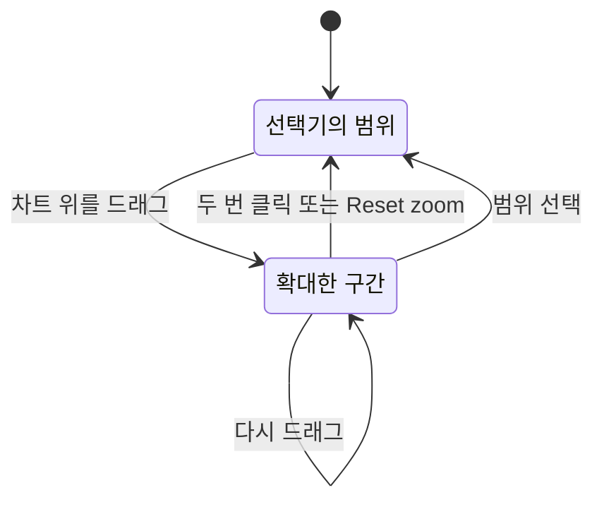

# 시간 범위 확대

차트 위를 드래그하면 페이지가 그 순간으로 확대되고, 두 번 클릭하면 원래대로 돌아갑니다. 이 페이지에서는 제스처, 확대의 동작 방식, 어떤 차트가 무엇을 확대하는지 설명합니다.

:::cards
- [확대하고 되돌리기](#확대하고-되돌리기): 두 가지 제스처와 Reset zoom 버튼.
- [확대의 동작 방식](#확대의-동작-방식): 중첩된 확대, 자동 새로 고침, 클릭과 드래그.
- [사용할 수 있는 곳](#사용할-수-있는-곳): 드래그로 시간 범위가 바뀌는 페이지와 차트.
- [확대되지 않는 차트](#확대되지-않는-차트): 스트립, 게이지, 스파크라인.
:::

## 확대하고 되돌리기

OneUptime의 모든 시계열 차트는 시간 범위 선택기 역할도 합니다. 차트에서 살펴보고 싶은 급증이 보이면, 선택기를 열고 날짜를 입력할 필요가 없습니다.

:::steps
1. 아무 차트에서나 **급증한 부분 위를 드래그하세요**. 페이지의 시간 범위가 드래그한 구간으로 바뀝니다. 시간 범위 선택기에서 고른 것과 똑같습니다. 페이지의 시간 범위로 계산되는 모든 차트, 타일, 표가 그 구간으로 다시 조회하므로, 모든 곳에서 같은 순간을 볼 수 있습니다.
2. 되돌리려면 **아무 차트나 두 번 클릭하세요**. 페이지가 확대를 시작하기 전의 시간 범위로 돌아갑니다.
:::

현재 상태를 보여 주는 패널은 직접 범위를 고를 때와 마찬가지로 현재 시점에 머뭅니다. 인벤토리 개수, 상태, 리소스를 가장 많이 쓰는 항목, 최근 경고, 열린 인시던트와 알림, 대시보드의 실시간 목록이 여기에 해당합니다.

확대 중에는 페이지의 시간 범위 선택기 옆에 **Reset zoom** 버튼이 나타납니다. 두 번 클릭과 같은 동작을 하며, 키보드 사용자와 터치스크린에서 되돌아가는 방법입니다.

## 확대의 동작 방식

- **원하는 만큼 깊이 확대할 수 있고, 한 번의 초기화로 맨 바깥까지 돌아갑니다.** "Past 1 Hour"에서 10분으로, 다시 1분으로 좁힌 뒤에도 한 번의 두 번 클릭 (또는 **Reset zoom**) 으로 한 단계씩이 아니라 1시간 전체로 돌아갑니다.
- **어느 차트에서든 어떤 확대든 초기화할 수 있습니다.** CPU 차트에서 드래그하고 메모리 차트에서 두 번 클릭해도 됩니다. 확대된 것은 차트가 아니라 페이지입니다.
- **직접 범위를 고르면 처음부터 다시 시작합니다.** 선택기에서 사전 설정이나 사용자 지정 범위를 고르면 새로운 출발점이 되어 확대가 끝나고 **Reset zoom** 이 사라집니다.
- **확대한 구간은 고정됩니다.** "Past 30 Minutes"는 시계와 함께 움직이지만, 확대는 고정된 구간이므로 자동 새로 고침이 켜져 있어도 움직이지 않습니다. 다시 움직이게 하려면 확대를 초기화하세요.
- **확대가 현재 시각을 넘지는 않습니다.** 차트의 가장 최근 버킷은 보통 아직 채워지는 중입니다. 그 버킷에서 끝나는 드래그는 현재 시각에서 잘립니다.
- **마우스를 차트 밖에서 놓아도 됩니다**. 드래그는 그대로 인정됩니다.
- **되돌리려고 차트가 로드될 때까지 기다릴 필요는 없습니다.** 확대 직후 차트가 아직 드래그한 구간을 불러오는 중이거나 그 구간이 비어 있어도, 차트를 두 번 클릭하면 바로 확대가 초기화됩니다.
- **확대되지 않은 페이지에서 두 번 클릭하면 아무 일도 일어나지 않습니다.**

### 클릭과 드래그

- **선, 영역, 막대 차트에서 단순한 클릭은 확대가 아닙니다.** 대부분의 차트가 여기에 해당합니다. 메트릭 카드와 메트릭 탐색기, 리소스 개요, SLO, 모니터, 대시보드의 모든 차트입니다. 여러 버킷에 걸친 드래그만 확대하므로, 점, 막대, 범례 항목을 클릭하면 예전과 같은 동작을 합니다. 확대 중에는 차트의 그리기 영역을 클릭해도 잠시 뒤에 반영됩니다. 초기화를 위한 두 번 클릭과 구별하기 위해서입니다. 로그 Insights의 오류 패턴 타임라인과 예외의 Occurrence Trend도 드래그로만 확대됩니다.
- **탐색기의 볼륨 차트에서는 막대 하나를 클릭하면 그 막대로 확대됩니다.** 로그, 트레이스, 예외, 보안 이벤트 탐색기의 볼륨 차트와 로그 및 트레이스 분석 차트는 드래그한 막대들이나 클릭한 막대 하나로 확대됩니다. 이 차트에는 **Click or drag to zoom** 이 표시됩니다.

### 차트의 힌트

확대할 수 있는 차트 대부분은 그리기 영역 위에 제스처를 표시합니다. **Drag to zoom** 또는 **Click or drag to zoom** 이며, 확대 중에는 **double-click to reset** 안내가 더해집니다. 메트릭 카드, 메트릭 탐색기, 탐색기의 볼륨 차트는 항상 힌트를 표시합니다. 리소스 개요와 SLO의 차트 카드, 일부 대시보드 위젯에서는 카드를 가리키거나 Tab 키로 이동했을 때만 나타납니다.

## 사용할 수 있는 곳

확대하면 다음 위치에서 페이지 전체의 시간 범위가 바뀝니다.

- 리소스 개요와 그 Insights 페이지: Kubernetes 클러스터, Docker, Podman, Docker Swarm 호스트, 호스트와 그 프로세스, 서비스와 systemd 유닛, VMware, Proxmox, Ceph, 스토리지 어레이, 데이터베이스, 클라우드 리소스, 서버리스 함수
- 서비스와 RUM 애플리케이션
- 네트워크 장치의 메트릭과 트래픽
- 메트릭 카드 (리소스의 메트릭 탭과 모니터의 메트릭 포함)
- 메트릭 탐색기
- SLO 기록 차트
- 로그 Insights. 오류 패턴의 "발생 시점" 타임라인도 포함하며, 그 패널은 페이지의 선택기를 가리기 때문에 자체 **Reset zoom** 을 가집니다
- 로그, 트레이스, 예외, 보안 이벤트의 볼륨 차트와 로그 및 트레이스 분석 차트. 이 차트들은 속한 탐색기의 시간 범위를 바꿉니다
- [대시보드](/docs/dashboards/authoring). 드래그하면 대시보드 전체의 시간 범위가 바뀝니다

자체 구간을 가진 차트는 그 구간만 확대하므로 페이지의 다른 것은 절대 바꾸지 않습니다. 모니터 양식의 메트릭 미리 보기 (모니터는 자체 롤링 구간으로 계속 평가합니다), 예외의 Occurrence Trend, 팝업이나 조사 패널에서 연 차트, AI 채팅 답변의 차트가 여기에 해당합니다. 이런 차트를 두 번 클릭하거나 그 **Reset zoom** 버튼을 누르면 자체 구간이 원래대로 돌아갑니다.

인시던트, 알림, 에피소드 페이지의 텔레메트리 스냅샷도 자체 구간을 가집니다. 그 차트 (메트릭 차트, 또는 스냅샷이 보여 주는 경우 로그, 트레이스, 예외의 볼륨 차트) 를 드래그하면 스냅샷 전체가 확대되어, 메트릭, 로그, 트레이스, 예외 탭이 모두 드래그한 구간을 보여 줍니다. 스냅샷 배지 옆의 **Reset zoom** 이나 그 차트의 두 번 클릭으로 스냅샷의 구간이 원래대로 돌아갑니다.

## 확대되지 않는 차트

몇몇 시각화는 드래그할 시간 축이 없거나, 드래그하기에 너무 작거나, 항상 자체 고정 구간을 보여 주기 때문에 확대되지 않습니다.

- 가동 기록 스트립 (하루에 막대 하나). 하루보다 세밀한 단위는 보여 줄 수 없습니다
- 비율과 비중 막대, 게이지, 진행률 표시줄
- 플레임 그래프, 서비스 맵, 흐름도
- 메트릭 목록의 작은 추세 스파크라인. 클릭하면 메트릭이 열리므로, 열어서 확대할 수 있는 차트를 보세요
- 자체 고정 구간을 가진 작은 스파크라인. 예를 들어 네트워크 장치의 지난 1시간 왕복 시간입니다. 그 **Open metrics** 링크로 확대할 수 있는 차트에 갈 수 있습니다

## 다음 단계

:::cards
- [대시보드 작성](/docs/dashboards/authoring): 확대는 대시보드의 모든 차트에서 동작합니다.
- [검색 구문](/docs/telemetry/search-syntax): 순간을 찾았으면 탐색기를 필터링합니다.
- [메트릭 모니터](/docs/monitor/metrics-monitor): 보고 있던 메트릭으로 알림을 보냅니다.
:::
