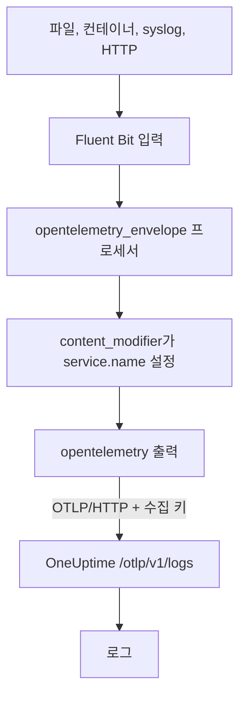

# Fluent Bit

[Fluent Bit](https://docs.fluentbit.io/manual)는 파일, systemd, 컨테이너, syslog, HTTP 등 많은 소스에서 로그를 모으는 가벼운 에이전트입니다. [OpenTelemetry 출력](https://docs.fluentbit.io/manual/pipeline/outputs/opentelemetry)이 모은 데이터를 OneUptime의 OpenTelemetry(OTLP) 엔드포인트로 보내면, 로그를 **제품 → 로그**에서 검색할 수 있습니다.

:::cards
- [Fluent Bit 구성](#fluent-bit-구성): OpenTelemetry 출력을 추가하고 서비스 이름을 정합니다.
- [전체 예시](#전체-예시): 바로 시작할 수 있는 구성 파일 전체.
- [자체 호스팅 OneUptime](#자체-호스팅-oneuptime): Fluent Bit가 직접 운영하는 인스턴스로 보내게 합니다.
:::

## 작동 방식



Fluent Bit는 각 레코드를 OpenTelemetry 봉투로 감싸 `service.name` 같은 리소스 속성을 담을 수 있게 합니다. 그런 다음 OpenTelemetry 출력이 `x-oneuptime-token` 헤더에 수집 키를 넣어 레코드를 OneUptime으로 보냅니다. OneUptime은 `service.name`이 가리키는 서비스 아래에 레코드를 저장하고, 처음 보낼 때 그 서비스를 만듭니다.

## 시작하기 전에

- **Fluent Bit 설치**: [설치 가이드](https://docs.fluentbit.io/manual/installation/getting-started-with-fluent-bit)를 참고하세요. 이 페이지의 구성은 Fluent Bit의 YAML 형식과 `opentelemetry_envelope` 프로세서를 사용하므로 최신 릴리스를 쓰세요.
- **OneUptime 프로젝트.** OneUptime Cloud에서 텔레메트리는 수집된 GB당 과금되며([요금](https://oneuptime.com/pricing) 참고), Free 플랜의 프로젝트는 텔레메트리를 보내기 전에 결제 수단이 있어야 합니다.
- **텔레메트리 수집 키.** 아직 없다면 다음과 같이 만듭니다.

:::steps
### 수집 키 열기

**제품 → 프로젝트 설정**으로 이동해 사이드 메뉴에서 **텔레메트리 및 APM**을 열고 **수집 키**를 선택합니다.


### 키 만들기

**수집 키 생성**을 클릭합니다. 대화 상자에는 키 이름이 이미 채워져 있고 **서버**(애플리케이션이나 Collector가 데이터를 보낼 때 쓰는 키 유형)가 선택되어 있으므로, **수집 키 생성**을 클릭해 만들거나 먼저 이름을 바꿉니다.

### 시크릿 복사

새 키는 자체 페이지에서 열립니다. 키의 **시크릿 키**를 복사하세요. 이것이 아래 구성의 `YOUR_TELEMETRY_INGESTION_TOKEN`입니다.


:::

## Fluent Bit 구성

Fluent Bit는 `/etc/fluent-bit/fluent-bit.yaml` 같은 파일에서 YAML 구성을 읽습니다.

:::steps
### OpenTelemetry 출력 추가

OneUptime으로 보내는 `opentelemetry` 출력을 추가합니다. 레코드를 로컬에서 보고 싶다면 테스트하는 동안 `stdout` 출력을 남겨 두세요.

```yaml title="fluent-bit.yaml"
pipeline:
  outputs:
    - name: stdout
      match: "*"
    - name: opentelemetry
      match: "*"
      host: "oneuptime.com"
      port: 443
      metrics_uri: "/otlp/v1/metrics"
      logs_uri: "/otlp/v1/logs"
      traces_uri: "/otlp/v1/traces"
      tls: On
      header:
        - x-oneuptime-token YOUR_TELEMETRY_INGESTION_TOKEN
```

### 로그를 OpenTelemetry 봉투로 감싸고 서비스 이름 정하기

각 입력에 `opentelemetry_envelope` 프로세서를 추가하고, 그 뒤에 `service.name`을 설정하는 `content_modifier`를 둡니다. `YOUR_SERVICE_NAME`은 OneUptime에서 로그가 표시될 이름으로 바꿉니다.

```yaml title="fluent-bit.yaml"
pipeline:
  inputs:
    - name: tail # or any other input
      path: /var/log/my-app/*.log

      processors:
        logs:
          - name: opentelemetry_envelope

          - name: content_modifier
            context: otel_resource_attributes
            action: upsert
            key: service.name
            value: YOUR_SERVICE_NAME
```

### Fluent Bit 다시 시작

Fluent Bit 서비스를 다시 시작하거나 `fluent-bit -c /etc/fluent-bit/fluent-bit.yaml`로 실행합니다. 몇 초 안에 로그가 **제품 → 로그**에 나타나고, 서비스가 **제품 → 서비스**에 표시됩니다.
:::

## 전체 예시

이 구성은 포트 `8888`에서 HTTP로 로그를 받아 OneUptime으로 전달합니다.

```yaml title="fluent-bit.yaml"
service:
  flush: 1
  log_level: info

pipeline:
  inputs:
    - name: http
      listen: 0.0.0.0
      port: 8888

      processors:
        logs:
          - name: opentelemetry_envelope

          - name: content_modifier
            context: otel_resource_attributes
            action: upsert
            key: service.name
            value: YOUR_SERVICE_NAME

  outputs:
    - name: stdout
      match: "*"
    - name: opentelemetry
      match: "*"
      host: "oneuptime.com"
      port: 443
      metrics_uri: "/otlp/v1/metrics"
      logs_uri: "/otlp/v1/logs"
      traces_uri: "/otlp/v1/traces"
      tls: On
      header:
        - x-oneuptime-token YOUR_TELEMETRY_INGESTION_TOKEN
```

`http` 입력은 필요한 입력으로 바꾸세요(예: 로그 파일은 `tail`, 저널은 `systemd`). 각 입력에는 두 프로세서를 그대로 둡니다.

## 자체 호스팅 OneUptime

`host`를 OneUptime 인스턴스의 호스트로 설정합니다. HTTPS가 아니라 일반 HTTP로 제공한다면 `port`도 수신 포트(보통 `80`)로 설정하고 `tls`를 제거합니다.

```yaml title="fluent-bit.yaml"
pipeline:
  outputs:
    - name: stdout
      match: "*"
    - name: opentelemetry
      match: "*"
      host: "your-oneuptime-instance.com"
      port: 80
      metrics_uri: "/otlp/v1/metrics"
      logs_uri: "/otlp/v1/logs"
      traces_uri: "/otlp/v1/traces"
      header:
        - x-oneuptime-token YOUR_TELEMETRY_INGESTION_TOKEN
```

## 문제 해결

:::details Fluent Bit가 OpenTelemetry 출력에서 `401`을 기록함
수집 키가 없거나, 알 수 없거나, 만료되었습니다. `header` 줄을 확인하세요. `x-oneuptime-token`, 공백 하나, 그리고 키의 **시크릿 키** 순서입니다.
:::

:::details Fluent Bit가 `402` 또는 `422`를 기록함
`402`: OneUptime Cloud에서 프로젝트가 Free 플랜이고 결제 수단이 없습니다. **프로젝트 설정 → 결제 및 청구서 → 결제**에서 추가하세요. `422`: 키가 비활성화되었거나 브라우저 키입니다. 키 설정에서 **활성화됨**을 다시 켜거나 **서버** 키를 만드세요.
:::

:::details 로그가 예상하지 못한 서비스로 들어옴
서비스는 `service.name`에서 정해집니다. 모든 입력에 `opentelemetry_envelope` 프로세서가 있고, 그 뒤에 서비스 이름을 설정하는 `content_modifier`가 있는지 확인하세요.
:::

:::details 아무것도 들어오지 않고 Fluent Bit가 연결 오류를 기록함
HTTPS 엔드포인트에 `tls: On`과 `port: 443`이 설정되어 있는지, 그리고 Fluent Bit를 실행하는 호스트가 그 포트로 OneUptime 호스트에 닿을 수 있는지 확인하세요.
:::

구성에 대해 질문이 있거나 도움이 필요하면 support@oneuptime.com으로 문의하세요.

## 다음 단계

:::cards
- [로그 파이프라인](/docs/telemetry/log-pipelines): Fluent Bit가 보내는 로그를 파싱하고 보강합니다.
- [검색 구문](/docs/telemetry/search-syntax): 로그 탐색기에서 로그를 찾습니다.
- [OpenTelemetry](/docs/telemetry/open-telemetry): 모든 텔레메트리의 엔드포인트, 키, 한도.
- [Fluentd](/docs/telemetry/fluentd): 대신 Fluentd를 사용합니다.
:::
