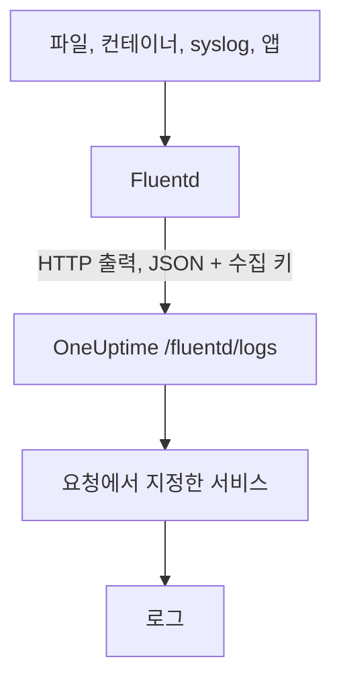

# Fluentd

[Fluentd](https://www.fluentd.org/)는 파일, 컨테이너, syslog, 애플리케이션 등 [많은 소스](https://www.fluentd.org/datasources)에서 로그를 모읍니다. 기본 제공 [HTTP 출력](https://docs.fluentd.org/output/http)이 로그를 OneUptime의 Fluentd 엔드포인트로 보내면, **제품 → 로그**에서 검색할 수 있습니다.

:::cards
- [Fluentd 구성](#fluentd-구성): OneUptime을 가리키는 HTTP 출력을 추가합니다.
- [레코드를 읽는 방식](#레코드를-읽는-방식): 어떤 필드가 메시지, 심각도, 속성이 되는지.
- [자체 호스팅 OneUptime](#자체-호스팅-oneuptime): Fluentd가 직접 운영하는 인스턴스로 보내게 합니다.
:::

## 작동 방식



Fluentd는 레코드를 JSON으로 묶어 보내며, 수집 키는 `x-oneuptime-token` 헤더에, 서비스 이름은 `x-oneuptime-service-name`에 넣습니다. OneUptime은 각 레코드를 그 서비스의 로그로 만들고, 처음 보낼 때 서비스를 만듭니다.

## 시작하기 전에

- **Fluentd 설치**: [설치 가이드](https://docs.fluentd.org/installation)를 참고하세요.
- **OneUptime 프로젝트.** OneUptime Cloud에서 텔레메트리는 수집된 GB당 과금되며([요금](https://oneuptime.com/pricing) 참고), Free 플랜의 프로젝트는 텔레메트리를 보내기 전에 결제 수단이 있어야 합니다.
- **텔레메트리 수집 키.** 아직 없다면 다음과 같이 만듭니다.

:::steps
### 수집 키 열기

**제품 → 프로젝트 설정**으로 이동해 사이드 메뉴에서 **텔레메트리 및 APM**을 열고 **수집 키**를 선택합니다.


### 키 만들기

**수집 키 생성**을 클릭합니다. 대화 상자에는 키 이름이 이미 채워져 있고 **서버**(애플리케이션이나 Collector가 데이터를 보낼 때 쓰는 키 유형)가 선택되어 있으므로, **수집 키 생성**을 클릭해 만들거나 먼저 이름을 바꿉니다.

### 시크릿 복사

새 키는 자체 페이지에서 열립니다. 키의 **시크릿 키**를 복사하세요. 이것이 아래 구성의 `YOUR_SERVICE_TOKEN`입니다.


:::

## Fluentd 구성

Fluentd의 구성 파일은 보통 `/etc/fluent/fluentd.conf`이고, 예전 td-agent 패키지라면 `/etc/td-agent/td-agent.conf`입니다.

:::steps
### HTTP 출력 추가

레코드를 OneUptime으로 보내는 `<match>` 섹션을 추가합니다. `YOUR_SERVICE_TOKEN`은 수집 키로, `YOUR_SERVICE_NAME`은 로그가 표시될 이름(원하는 아무 이름)으로 바꿉니다.

```text title="fluentd.conf"
# Match all patterns
<match **>
  @type http

  endpoint https://oneuptime.com/fluentd/logs
  open_timeout 2

  headers {"x-oneuptime-token":"YOUR_SERVICE_TOKEN", "x-oneuptime-service-name":"YOUR_SERVICE_NAME"}

  content_type application/json
  json_array true

  <format>
    @type json
  </format>
  <buffer>
    flush_interval 10s
    chunk_limit_size 900k
  </buffer>
</match>
```

`json_array true`는 버퍼의 청크마다 하나의 JSON 배열로 보내고, `flush_interval 10s`는 10초마다 버퍼를 보냅니다. `chunk_limit_size 900k`는 각 요청을 이 엔드포인트에서 OneUptime이 받는 최대 크기인 1MB 미만으로 유지합니다.

### Fluentd 다시 시작

새 출력을 불러오도록 Fluentd 서비스를 다시 시작합니다.

### 로그가 들어오는지 확인

다음 플러시 후 몇 초 안에 로그가 **제품 → 로그**에 나타납니다. 서비스는 **제품 → 서비스**에 표시되며, 아직 없었다면 OneUptime이 만듭니다.
:::

## 전체 예시

이 구성은 포트 `24224`에서 Fluentd의 forward 프로토콜로 레코드를 받아 모두 OneUptime으로 보냅니다.

```text title="fluentd.conf"
####
## Source descriptions:
##

## built-in TCP input
## @see https://docs.fluentd.org/input/forward
<source>
  @type forward
  port 24224
  bind 0.0.0.0
</source>

<match **>
  @type http

  endpoint https://oneuptime.com/fluentd/logs
  open_timeout 2

  headers {"x-oneuptime-token":"YOUR_SERVICE_TOKEN", "x-oneuptime-service-name":"YOUR_SERVICE_NAME"}

  content_type application/json
  json_array true

  <format>
    @type json
  </format>
  <buffer>
    flush_interval 10s
    chunk_limit_size 900k
  </buffer>
</match>
```

서로 다른 소스를 서로 다른 서비스로 보내려면 태그마다 `<match>` 섹션을 하나씩 두고, 각각에 자체 `x-oneuptime-service-name`을 지정하세요.

## 레코드를 읽는 방식

OneUptime은 각 레코드에서 다음 필드를 읽습니다.

| 로그 필드 | 레코드에서 처음 나오는 다음 필드에서 읽음 | 참고 |
| --- | --- | --- |
| 본문 | `message`, `log`, `msg`, `body`, `text` | 로그 줄. 이 중 아무것도 없는 레코드는 전체가 JSON으로 저장됩니다. |
| 심각도 | `level`, `severity`, `loglevel`, `log_level`, `priority`, `severityText`, `severity_text` | `trace`, `debug`, `info`, `notice`, `warn`, `error`, `critical`, `fatal` 같은 이름(대소문자 무관). 그 밖의 값은 `Unspecified`로 저장됩니다. |
| 트레이스 ID | `trace_id`, `traceId`, `traceid` | 로그를 해당 트레이스에 연결합니다. |
| 스팬 ID | `span_id`, `spanId`, `spanid` | 로그를 해당 스팬에 연결합니다. |
| 서비스 | `x-oneuptime-service-name` 헤더 | 헤더가 없으면 `Fluentd`. |
| 시간 | — | OneUptime이 레코드를 받은 시간. |

그 밖의 필드는 모두 `fluentd.` 뒤에 필드 이름을 붙인 속성이 되어 검색하고 필터링할 수 있습니다. 예를 들어 `container_name` 필드는 로그 탐색기에서 `@fluentd.container_name`입니다. 중첩된 객체는 `fluentd.kubernetes.pod_name`처럼 점으로 펼쳐지고, 목록은 JSON으로 저장됩니다.

Fluentd 로그도 다른 로그처럼 [로그 파이프라인](/docs/telemetry/log-pipelines), 드롭 필터, 스크럽 규칙을 거칩니다.

## 자체 호스팅 OneUptime

`endpoint`의 `https://oneuptime.com`을 OneUptime 인스턴스의 URL로 바꿉니다: `http(s)://YOUR_ONEUPTIME_HOST/fluentd/logs`.

## 문제 해결

:::details Fluentd가 HTTP 출력에서 `401`을 기록함
수집 키가 없거나, 알 수 없거나, 만료되었습니다. `headers`에 있는 `x-oneuptime-token` 값을 확인하세요.
:::

:::details Fluentd가 `402` 또는 `422`를 기록함
`402`: OneUptime Cloud에서 프로젝트가 Free 플랜이고 결제 수단이 없습니다. **프로젝트 설정 → 결제 및 청구서 → 결제**에서 추가하세요. `422`: 키가 비활성화되었거나 브라우저 키입니다. 키 설정에서 **활성화됨**을 다시 켜거나 **서버** 키를 만드세요.
:::

:::details Fluentd가 `413`을 기록함
요청이 이 엔드포인트에서 OneUptime이 받는 최대 크기인 1MB를 넘습니다. 위 구성처럼 `<buffer>` 섹션에 `chunk_limit_size 900k`를 설정하세요.
:::

:::details 로그가 `Fluentd` 서비스로 들어옴
`x-oneuptime-service-name` 헤더가 없습니다. 각 `<match>` 섹션의 `headers`에 추가하세요.
:::

:::details 로그 본문에 레코드 전체가 JSON으로 표시됨
OneUptime은 레코드에 처음 나오는 `message`, `log`, `msg`, `body`, `text` 필드에서 본문을 가져오고, 이 중 아무것도 없으면 레코드 전체를 저장합니다. 로그 줄이 담긴 필드의 이름을 이 중 하나로 바꾸세요. 예를 들어 Fluentd의 `record_transformer` 필터를 쓸 수 있습니다.
:::

구성에 대해 질문이 있거나 도움이 필요하면 support@oneuptime.com으로 문의하세요.

## 다음 단계

:::cards
- [로그 파이프라인](/docs/telemetry/log-pipelines): Fluentd가 보내는 로그를 파싱하고 보강합니다.
- [검색 구문](/docs/telemetry/search-syntax): 로그 탐색기에서 로그를 찾습니다.
- [Fluent Bit](/docs/telemetry/fluentbit): OpenTelemetry로 보내는 더 가벼운 에이전트.
- [로그 모니터](/docs/monitor/logs-monitor): 일치하는 로그가 나타나면 알립니다.
:::
