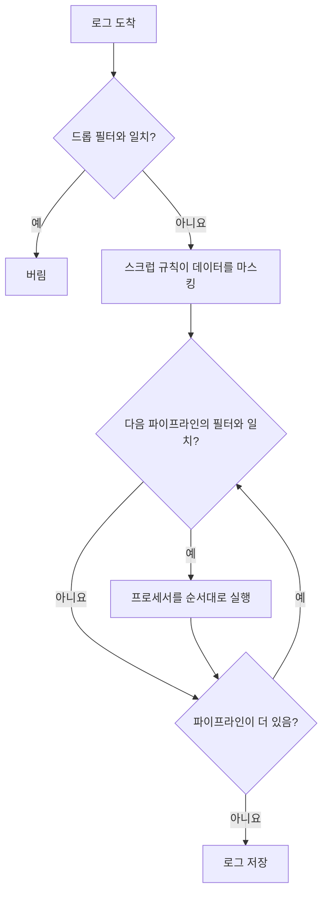

# 로그 파이프라인

로그 파이프라인은 OneUptime이 로그를 수집할 때, 저장하기 전에 로그를 변환합니다. 파이프라인에는 어떤 로그에 적용할지 정하는 **필터** 와 그 로그를 하나씩 바꾸는 순서가 정해진 **프로세서** 목록이 있습니다. 메시지에서 필드를 꺼내고, 심각도를 바로잡고, 속성 이름을 바꾸거나, 로그에 카테고리를 붙이는 식입니다.

파이프라인은 **로그 → 설정 → 파이프라인** 에 있습니다.

:::cards
- [파이프라인 실행 방식](#파이프라인-실행-방식): 수집 과정에서 파이프라인이 놓이는 위치와 실행 순서.
- [파이프라인 만들기](#파이프라인-만들기): 대상 로그를 고르고 프로세서를 추가합니다.
- [Key=Value Parser](#keyvalue-parser): 방화벽과 logfmt 줄을 속성으로 바꿉니다.
- [예: Sophos XGS 방화벽](#예-sophos-xgs-방화벽): 방화벽 syslog를 처음부터 끝까지 파싱합니다.
:::

## 파이프라인 실행 방식

파이프라인은 OneUptime이 수집하는 모든 로그 (OpenTelemetry 로그, syslog, Fluentd 모두) 에 대해 드롭 필터와 스크럽 규칙 다음, 로그가 저장되기 전에 실행됩니다.



- **파이프라인은 순서대로 실행됩니다**. 순서는 목록의 순서이며, 행을 드래그해 바꿉니다. 파이프라인은 필터와 일치하는 로그만 처리하며, 필터가 일치하는 파이프라인은 첫 번째만이 아니라 모두 실행됩니다.
- **프로세서도 순서대로 실행되며**, 각 프로세서는 앞 프로세서의 결과를 받습니다. 따라서 파서는 그 파서가 꺼낸 필드를 읽는 프로세서보다 앞에 있어야 합니다. 뒤쪽 파이프라인의 필터도 앞 파이프라인이 바꾼 내용을 봅니다.
- **처리는 수집 시점에 이루어집니다.** 파이프라인을 바꾸면 그 뒤에 들어오는 로그에 약 1분 안에 반영됩니다. 이미 저장된 로그는 다시 처리되지 않습니다.
- **프로세서는 로그를 버리거나 비우지 않습니다.** 파서가 읽지 못하는 줄은 그대로 통과합니다. 로그를 버리려면 **로그 → 설정 → 드롭 필터** 를 사용하세요.
- **활성화된 파이프라인과 프로세서만 실행됩니다.** 각 페이지에서 끄면 설정을 잃지 않고 일시 중지할 수 있습니다.

## 프로세서 종류

| 프로세서 | 하는 일 |
| --- | --- |
| Grok Parser | 이름 있는 패턴으로, 형태가 정해진 줄 (nginx 접근 로그 줄 등) 에서 필드를 꺼냅니다. |
| Key=Value Parser | `key=value` 쌍으로 이루어진 줄 (Sophos XGS, Fortinet, logfmt) 을 순서와 관계없이 속성으로 나눕니다. |
| 심각도 리매퍼 | 속성에 있는 `warn` 같은 원시 수준을 로그의 표준 심각도에 대응시킵니다. |
| 속성 리매퍼 | 속성 이름을 바꾸거나 복사합니다. 예: `src_ip` 를 `source_ip` 로. |
| 카테고리 프로세서 | 필터와 일치하는 로그에 카테고리 이름을 붙입니다. 예: "Payment Error". |

## 시작하기 전에

- OneUptime에 들어오는 로그. [OpenTelemetry](/docs/telemetry/open-telemetry), [syslog](/docs/telemetry/syslog), [Fluentd](/docs/telemetry/fluentd) 또는 프로브를 통해 들어옵니다.
- 파이프라인을 변경할 권한. 프로젝트 소유자와 관리자에게는 있으며, 그 밖의 사용자에게는 **Create Log Pipeline** 및 **Create Log Pipeline Processor** 권한이 필요합니다.

## 파이프라인 만들기

:::steps
### 새 파이프라인 만들기

**로그 → 설정 → 파이프라인** 으로 이동해 **로그 파이프라인 만들기** 를 클릭하세요. *방화벽 로그 파싱* 같은 **이름** 을 지정하고 만들면 파이프라인 페이지가 열립니다.

### 적용할 로그 고르기

**필터 조건** 에서 **편집** 을 클릭하고 **심각도**, **로그 본문**, **서비스 ID** 또는 사용자 지정 속성에 조건을 추가하세요. 조건을 **모든 조건** 또는 **하나 이상의 조건** 으로 묶은 다음 **변경 사항 저장** 을 클릭합니다. 조건이 없는 파이프라인은 모든 로그에 적용됩니다.

### 프로세서 추가하기

**프로세서** 에서 **프로세서 추가** 를 클릭하고, **프로세서 이름** 을 입력한 뒤 **프로세서 유형** 을 골라 설정을 채우세요. Grok 파서와 Key=Value 파서에는 테스터가 있어, 샘플 줄을 붙여 넣으면 무엇이 추출될지 확인할 수 있습니다. **프로세서 만들기** 를 클릭합니다.

### 순서 정하기

프로세서를 드래그해 실행 순서를 바꾸고, **파이프라인** 목록에서도 같은 방법으로 파이프라인을 드래그하세요. 새 로그는 약 1분 안에 처리됩니다.
:::

### 필터 조건

각 조건은 필드를 값과 비교합니다. 빌더 뒤에서 필터는 `severityText = 'Error' AND body LIKE 'timeout'` 같은 쿼리이며, **Preview query** 로 확인할 수 있습니다.

| 연산자 | 쿼리에서 | 참고 |
| --- | --- | --- |
| 같음 | `=` | 정확히 일치하며 대소문자를 구분합니다. |
| 같지 않음 | `!=` | 정확히 일치하며 대소문자를 구분합니다. |
| 포함 | `LIKE` | 대소문자를 구분하지 않습니다. 값 안의 `%` 는 와일드카드입니다. |
| 다음 중 하나 | `IN` | 쉼표로 구분한 정확한 값의 목록입니다. |

심각도 값은 `Fatal`, `Error`, `Warning`, `Information`, `Debug`, `Trace`, `Unspecified` 입니다. 따라서 `severityText = 'Error'` 는 일치하지만 `'ERROR'` 는 절대 일치하지 않습니다. 사용자 지정 속성은 `attributes.<key>` 로 씁니다. 예: `attributes.networkDevice.name = 'hq-firewall'`.

## Key=Value Parser

방화벽과 다른 네트워크 장비는 각 이벤트를 `key=value` 쌍으로 이루어진 한 줄로 기록합니다. 줄에 어떤 필드가 어떤 순서로 들어 있는지는 이벤트마다 다르므로, 하나의 grok 패턴으로는 설명할 수 없습니다. Key=Value Parser에는 패턴이 필요 없습니다. 줄을 따라가며 찾은 쌍을 순서와 관계없이 모두 로그 속성으로 바꿉니다. 속성이 되면 검색하고 필터링할 수 있고, [로그 모니터](/docs/monitor/logs-monitor) 에서 쓸 수 있으며, [그룹화 기준](/docs/monitor/logs-monitor#그룹별-알림group-by) 으로 터널, 인터페이스, 사용자마다 한 번씩 알림을 보낼 수 있습니다.

### 구성

| 설정 | 기본값 | 설명 |
| --- | --- | --- |
| Source Field | `body` | 파싱할 필드. 로그 메시지는 `body`, 속성은 `attributes.raw_line` 같은 형태입니다. |
| Target Prefix | 없음 | 추출한 키의 네임스페이스입니다. `sophos` 를 지정하면 `con_name` 이 `sophos.con_name` 으로 저장됩니다. 접두사가 이미 `.`, `_`, `-`, `:` 로 끝나지 않으면 구분자가 추가됩니다. |
| Pair Delimiter | 모든 공백 문자 | 쌍과 쌍을 구분하는 문자입니다. Sophos, Fortinet, logfmt에서는 비워 두고, 다른 형식에는 `,`, `;`, `\|` 를 지정합니다. |
| Key-Value Delimiter | `=` | 키와 값을 구분하는 문자입니다. 예: `status:up` 에는 `:`. |
| 충돌 시 재정의 | 꺼짐 | 로그에 이미 있는 속성을 키가 대체해도 되는지 여부입니다. 기본값은 꺼짐입니다. 키는 줄 자체에서 오므로, 켜면 줄이 장치 정보처럼 수집 시 설정된 속성을 덮어쓸 수 있습니다. |

두 구분자는 서로 달라야 하고, 서로를 포함해서는 안 되며, 따옴표나 백슬래시를 포함할 수 없습니다. 각각 최대 8자입니다. 프로세서 양식은 저장하기 전에 이를 확인하며, 테스터인 **Test With a Sample Line** 은 샘플 줄이 만들어 낼 속성을 정확히 보여 줍니다.

### 파싱 규칙

- **따옴표로 감싼 값** 은 공백과 구분자를 유지합니다. `message="IPSec Connection HQ-Branch1 terminated"` 는 하나의 값입니다. 큰따옴표와 작은따옴표 모두 쓸 수 있고, 값 안의 `\"` 는 문자 그대로의 따옴표입니다. 닫히지 않은 따옴표 (syslog 크기 제한으로 잘린 줄) 는 줄 끝까지 이어집니다.
- **따옴표 없는 값** 은 다음 쌍 구분자까지이므로 `url=https://example.com/?a=b` 는 `=` 를 유지합니다.
- **빈 값** (`key=` 와 `key=""`) 은 빈 문자열로 저장됩니다.
- **값은 항상 텍스트입니다.** `latency=11` 은 유형을 지정하지 않은 grok 캡처와 마찬가지로 `"11"` 로 저장됩니다.
- **키** 는 영문자나 밑줄로 시작하고 영문자, 숫자, `. _ - @` 를 포함합니다. 첫 번째 쌍 앞의 텍스트 (RFC 3164 syslog 헤더 등) 와 구분자 없는 낱말은 건너뜁니다. 첫 번째 키에 붙은 syslog 우선순위 (`<30>device_name="SFW"`) 는 제거되고 키는 유지됩니다.
- **반복된 키는 첫 번째 값을 유지합니다**. 이후 값은 무시됩니다.
- **한도:** 32 KiB보다 긴 줄은 파싱하지 않고, 한 줄에서 최대 100개 쌍을 가져오며, 256자보다 긴 키는 건너뛰고, 4,096자보다 긴 값은 잘립니다.

### 예: Sophos XGS 방화벽

Sophos XGS 방화벽이 [프로브](/docs/monitor/network-device-monitor) 로 syslog를 보내면, 각 메시지는 네트워크 장치의 로그로 저장되고 syslog 메시지가 본문이 됩니다. 이를 파싱하려면 다음과 같이 합니다.

:::steps
#### 방화벽용 파이프라인 만들기

**로그 → 설정 → 파이프라인** 으로 이동해 파이프라인을 만드세요. 방화벽 로그와 일치하는 필터를 지정합니다. 예를 들어 사용자 지정 속성 `networkDevice.name` 이 `hq-firewall` 과 같음 (`attributes.networkDevice.name = 'hq-firewall'`), 또는 모든 Sophos 줄과 일치시키려면 **로그 본문** 이 `log_component=` 를 포함입니다.

#### 파서 추가하기

파이프라인을 열고 **프로세서 추가** 를 클릭하세요. **Key=Value Parser** 를 고르고, **Source Field** 는 `body` 로 두고, **Target Prefix** 를 `sophos` 로 설정합니다 (선택 사항이지만 방화벽의 필드를 한데 모아 줍니다).

#### 테스트하고 저장하기

방화벽의 줄을 **Test With a Sample Line** 에 붙여 넣어 결과를 확인한 다음 **프로세서 만들기** 를 클릭하세요.
:::

Sophos IPsec 이벤트는 다음과 같습니다.

```text
device_name="SFW" timestamp="2024-05-02T11:03:12+0200" device_model="XGS2100" device_serial_id="X1234" log_id="010101600001" log_type="Event" log_component="IPSec" log_subtype="System" severity="Information" con_name="HQ-Branch1" src_ip="10.171.4.117" dst_ip="10.171.4.118" status="Terminated" message="IPSec Connection HQ-Branch1 between 10.171.4.117 and 10.171.4.118 for Child HQ-Branch1 terminated."
```

이 이벤트는 다른 속성과 함께 다음 속성이 됩니다.

| 속성 | 값 |
| --- | --- |
| `sophos.log_component` | `IPSec` |
| `sophos.con_name` | `HQ-Branch1` |
| `sophos.status` | `Terminated` |
| `sophos.src_ip` | `10.171.4.117` |
| `sophos.message` | `IPSec Connection HQ-Branch1 between 10.171.4.117 and 10.171.4.118 for Child HQ-Branch1 terminated.` |

SD-WAN SLA 줄은 다른 필드를 다른 순서로 담고 있지만, 같은 프로세서가 처리합니다.

```text
log_id=158825619025 log_type="SD-WAN" log_component="SLA" profile_name="Branch-Internet" gw_name="WAN2" latency=11 jitter=2 packet_loss=0 gw_status="up" sla_status="SLA met"
```

그 결과 `sophos.gw_name = WAN2`, `sophos.latency = 11`, `sophos.packet_loss = 0`, `sophos.gw_status = up`, `sophos.sla_status = SLA met` 을 얻습니다. 오래된 SFOS 릴리스는 이전 형식 (`device="SFW" date=2017-01-31 time=18:02:03 timezone="IST" ... connectionname="Tunnel A"`) 으로 기록하지만, 같은 방식으로 파싱되며 터널 이름이 `con_name` 대신 `connectionname` 에 들어갑니다.

이 SLA 줄을 게이트웨이별 지연 시간, 지터, 패킷 손실 메트릭으로 바꾸는 방법은 [로그 기록 규칙](/docs/telemetry/log-recording-rules) 의 예를 참고하세요.

### 예: Fortinet FortiGate

FortiGate 로그도 같은 형식입니다.

```text
date=2024-01-01 time=10:00:00 devname="FG100" logid="0100032001" type="event" subtype="vpn" level="notice" action="tunnel-down" vpntunnel="HQ-to-Branch2" msg="IPsec tunnel down"
```

기본 설정과 `fortigate` 접두사를 쓰면 `fortigate.devname = FG100`, `fortigate.subtype = vpn`, `fortigate.action = tunnel-down`, `fortigate.vpntunnel = HQ-to-Branch2`, `fortigate.time = 10:00:00` 을 얻습니다. 시간 값의 콜론은 값의 일부이며 구분자가 아닙니다.

### 터널마다 한 번씩 알림 보내기

필드를 파싱하면 [로그 모니터](/docs/monitor/logs-monitor) 가 장애 횟수를 세고 터널마다 별도의 알림을 보낼 수 있습니다. `sophos.log_component` = `IPSec` 이고 본문에 `terminated` 가 들어 있는 로그로 필터링하고, `sophos.con_name` 으로 그룹화하세요. [그룹별 알림](/docs/monitor/logs-monitor#그룹별-알림group-by) 을 참고하세요.

## Grok Parser

형태가 정해진 줄에서 구조화된 필드를 꺼냅니다. grok 패턴은 이름 있는 참조를 가진 정규식입니다. `%{IPV4:client_ip}` 는 "IPv4 주소와 일치시켜 `client_ip` 로 저장"한다는 뜻입니다. 패턴이 줄 전체와 일치할 필요는 없으며, 일치하지 않는 줄은 그대로 남습니다.

| 설정 | 기본값 | 설명 |
| --- | --- | --- |
| **Source Field** | `body` | 파싱할 필드. Key=Value Parser와 같습니다. |
| **Target Prefix** | 없음 | 추출한 필드의 네임스페이스. 같은 방식으로 붙습니다. |
| **Grok Pattern** | — | 패턴입니다. 양식에 사용할 수 있는 이름 있는 패턴이 나열됩니다. |

캡처는 유형을 지정하지 않으면 텍스트로 저장됩니다. `%{NUMBER:status:int}` 는 숫자로 저장합니다. 유형은 `int`, `long`, `float`, `double`, `boolean`, `string` 입니다. 저장하기 전에 **Test Your Pattern** 에서 샘플 줄로 패턴을 확인하세요.

| 로그 본문 | 패턴 | 추가되는 속성 |
| --- | --- | --- |
| `10.0.1.5 - GET /health 200` | `%{IPV4:client_ip} - %{WORD:method} %{NOTSPACE:path} %{NUMBER:status:int}` | client_ip, method, path, status |

순서가 바뀌는 `key=value` 쌍으로 줄이 이루어져 있다면 대신 Key=Value Parser를 사용하세요.

## 심각도 리매퍼

속성에서 원시 값을 읽어 표준 심각도에 대응시킵니다. **소스 속성** 을 수준이 들어 있는 속성 (기본값 `level`) 으로 설정한 다음 **매핑** 을 추가하세요. 각 매핑은 `warn` 처럼 애플리케이션이 내보내는 값과 Warning 같은 심각도를 짝지읍니다. 비교할 때 대소문자를 구분하지 않습니다. 매핑이 없는 값은 로그의 심각도를 그대로 둡니다.

## 속성 리매퍼

한 속성 (**소스 키**) 의 값을 다른 속성 (**대상 키**) 으로 옮깁니다. 예: `src_ip` 를 `source_ip` 로.

| 설정 | 기본값 | 효과 |
| --- | --- | --- |
| **소스 보존** | 꺼짐 | 꺼져 있으면 속성 이름을 바꾸며 소스 키가 제거됩니다. 켜져 있으면 복사하고 소스 키를 유지합니다. |
| **충돌 시 재정의** | 켜짐 | 켜져 있으면 대상이 이미 있을 때 대체합니다. 꺼져 있으면 대상을 그대로 두고 리매핑을 건너뜁니다. |

## 카테고리 프로세서

규칙 목록을 순서대로 평가해, 필터가 처음 일치한 규칙의 이름을 대상 속성에 저장합니다. 그러면 "Payment Error" 로그를 한 번에 검색할 수 있습니다. **대상 속성** (기본값 `category`) 을 설정한 다음 **카테고리 규칙** 을 추가하세요. 각 규칙은 **Category name** 과 **When logs match** 의 조건으로 이루어집니다. 처음 일치한 규칙이 적용되며, 어느 규칙과도 일치하지 않는 로그는 그대로 남습니다.

## 다음 단계

:::cards
- [로그 모니터](/docs/monitor/logs-monitor): 파이프라인이 추출한 속성으로 알림을 보냅니다.
- [로그 기록 규칙](/docs/telemetry/log-recording-rules): 파싱한 로그 필드를 메트릭으로 바꿉니다.
- [Syslog](/docs/telemetry/syslog): 방화벽과 서버의 syslog를 OneUptime으로 보냅니다.
- [검색 구문](/docs/telemetry/search-syntax): 로그 탐색기에서 새 속성으로 검색합니다.
:::
