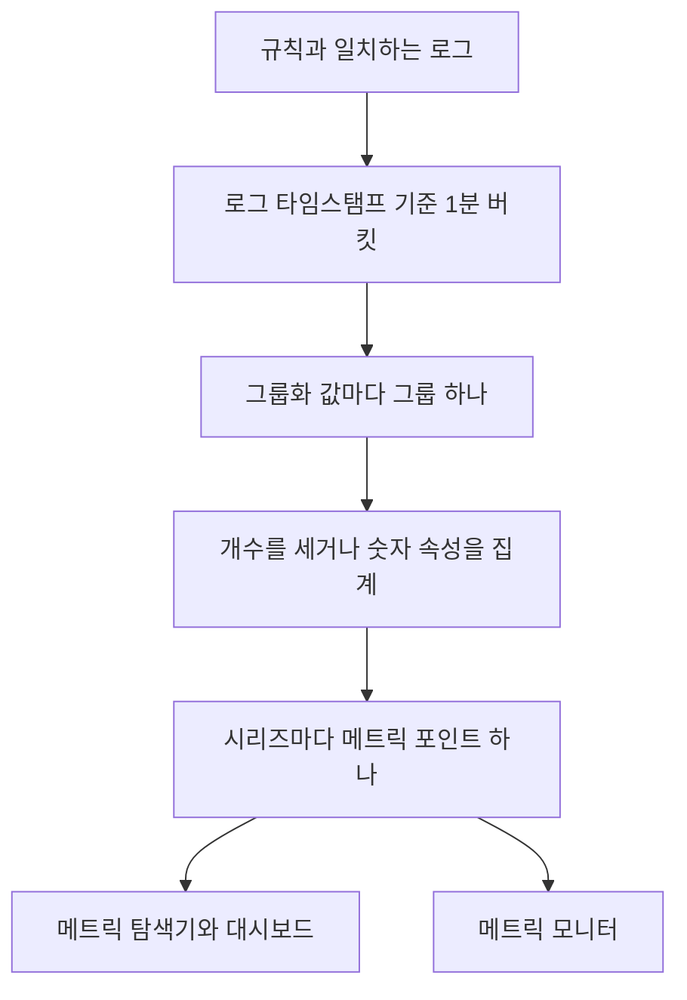
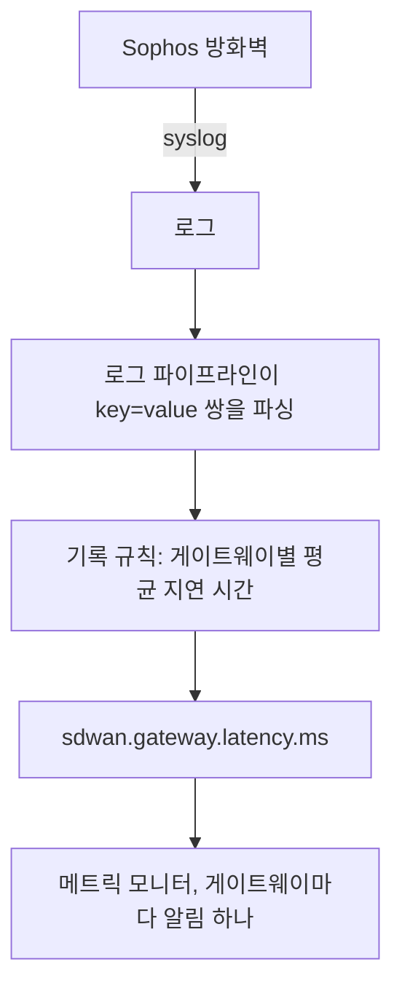

# 로그 기록 규칙

**Log Recording Rule** 은 로그를 메트릭으로 바꿉니다. 매분 필터와 일치하는 로그를 가져와 분마다 숫자 하나를 메트릭 저장소에 씁니다. 일치한 로그의 개수, 또는 그 로그가 가진 숫자 속성의 합계, 평균, 최솟값, 최댓값, 백분위수입니다. 결과를 최대 다섯 개의 로그 속성으로 나누면 값마다 시리즈 하나를 얻습니다. 게이트웨이마다, 호스트마다, 고객마다 하나씩입니다.

:::cards
- [규칙의 작동 방식](#규칙의-작동-방식): 버킷, 타이밍, 따라잡기, 공백.
- [규칙 만들기](#규칙-만들기): 규칙 편집기의 필드.
- [예: SD-WAN 게이트웨이 지연 시간](#예-sophos-방화벽의-sd-wan-게이트웨이-지연-시간): 방화벽 syslog에서 게이트웨이별 알림까지.
- [권한](#권한): 규칙을 만들고, 바꾸고, 읽을 수 있는 사람.
:::

## 개요

출력은 일반 메트릭입니다. **메트릭 탐색기** 와 대시보드에서 차트로 그리고, **메트릭** 모니터로 알림을 보낼 수 있습니다. **그룹화 기준** 을 사용한 시리즈별 알림도 가능합니다.

관심 있는 숫자가 로그에만 있을 때 로그 기록 규칙을 사용하세요. 방화벽의 SLA 요약, 걸린 시간을 기록하는 배치 작업, 접근 로그의 응답 크기, 또는 단순히 서비스가 매분 쓰는 오류 로그의 개수 같은 것입니다.

로그 기록 규칙은 **로그 → 설정 → 기록 규칙** 에 있습니다. 메트릭과 스팬을 위한 같은 종류의 규칙은 **메트릭 → 설정 → 기록 규칙** 과 **트레이스 → 설정 → 기록 규칙** 에 있습니다.

## 규칙의 작동 방식



- **시리즈마다 분당 포인트 하나.** 로그는 타임스탬프에 따라 1분 버킷으로 묶입니다. 각 버킷은 그룹화 속성 값의 서로 다른 조합마다 포인트 하나를 만듭니다.
- **분이 끝나고 30초 뒤에 계산됩니다.** 이 짧은 대기 덕분에 조금 늦게 도착한 로그도 제 분에 들어갑니다. 그보다 늦게 도착한 로그는 세지 않습니다.
- **공백도 이중 계산도 없습니다.** 각 규칙은 마지막으로 쓴 분을 기억합니다 (규칙 목록에 **Computed Until** 로 표시됩니다). 워커 재시작이나 다른 중단 뒤에는 놓친 분을 최대 60분 전까지 따라잡으며, 같은 분을 두 번 쓰지 않습니다.
- **그룹화 없는 개수 규칙에는 공백이 없습니다.** 일치하는 로그가 없는 분은 `0` 으로 기록됩니다. 다른 모든 규칙은 집계할 것이 없는 분에 아무것도 쓰지 않으므로, 차트와 모니터에는 지어낸 0 대신 데이터 없음이 보입니다.
- **다른 파생 메트릭과 같은 방식으로 기록됩니다.** 포인트는 규칙의 **출력 메트릭 이름** 을 이름으로 하는 Gauge 데이터 포인트이며, 그룹화 속성과 `oneuptime.derived.log_rule_id` (규칙의 ID) 를 가집니다. 보존 기간은 메트릭 및 트레이스 기록 규칙의 포인트와 같은 15일입니다.

규칙의 정의를 바꾸면 다음에 쓰는 분부터 적용되며, 이미 쓴 포인트는 다시 쓰지 않습니다. 규칙을 끄면 멈추고, 다시 켜면 꺼져 있던 동안 놓친 분을 같은 60분 한도까지 따라잡습니다.

## 규칙 만들기

:::steps
### 기록 규칙 열기

**로그 → 설정 → 기록 규칙** 으로 이동해 **Log Recording Rule 만들기** 를 선택하세요.

### 규칙 이름 짓기

**이름** 을 입력하세요. 그 아래의 **출력 메트릭 이름** 은 입력하는 대로 이름에서 만들어집니다. 직접 입력하려면 옆의 **편집** 을 선택하세요.

### 로그와 계산할 내용 고르기

**Which Logs** 에서 텔레메트리 서비스, 심각도, 본문 텍스트, 속성 필터로 규칙의 범위를 좁히세요. **집계** 를 고르고, 개수가 아니라면 집계할 **Numeric Attribute** 를 고르세요.

### 결과를 나누고 저장하기

필요하면 **그룹화 기준** 속성과 **Unit** 을 추가하세요. 편집기 아래쪽의 줄을 확인한 다음 저장합니다. 몇 분 안에 규칙 목록에 **Computed Until** 시각이 표시됩니다.
:::

| 필드 | 하는 일 |
| --- | --- |
| 이름 | 규칙이 계산하는 내용. 예: *SD-WAN gateway latency*. |
| 출력 메트릭 이름 | 규칙이 쓰는 메트릭. 이름에서 만들어지며 (*SD-WAN gateway latency* 는 `sd_wan_gateway_latency` 를 씁니다), **편집** 을 선택하면 직접 입력할 수 있습니다. 프로젝트의 기록 규칙 사이에서 고유해야 합니다. |
| Which Logs | 선택 사항인 필터로, 모두 AND로 결합됩니다. 텔레메트리 서비스, 심각도, 본문에 포함된 텍스트, 속성 필터 (속성이 값과 같음). |
| 집계 | `Count of logs`, 또는 숫자 속성의 집계 (아래 참고). |
| Numeric Attribute | Count를 제외한 모든 집계에서, 값을 집계할 속성. 예: `latency`. |
| 그룹화 기준 | 선택 사항: 최대 5개의 속성 키. 그 값의 서로 다른 조합마다 시리즈 하나. |
| Unit | 선택 사항: 출력 메트릭의 단위. 예: `ms`. 메트릭을 차트로 그리는 모든 곳에 표시됩니다. |
| 설명 | **추가 필드** 아래: 규칙의 용도. |
| 활성화됨 | **추가 필드** 아래: 기본적으로 켜짐. 활성화된 규칙만 계산됩니다. |

편집기 아래쪽의 줄은 규칙이 무엇을 쓸지 알려 줍니다. 예: `avg(latency) by gw_name, profile_name`.

규칙 하나는 최대 10개의 속성과 100개의 텔레메트리 서비스로 필터링할 수 있습니다.

### 집계 유형

| 집계 | 각 분의 포인트 |
| --- | --- |
| Count of logs | 필터와 일치한 로그 수. |
| 평균 | 숫자 속성 값의 평균. |
| 합계 | 속성 값을 모두 더한 값. |
| 최소 | 가장 작은 값. |
| 최대 | 가장 큰 값. |
| p50 (median) | 중앙값. |
| p75 | 75번째 백분위수. |
| p90 | 90번째 백분위수. |
| p95 | 95번째 백분위수. |
| p99 | 99번째 백분위수. |

### 숫자 속성

숫자 속성의 값은 단순한 숫자여야 합니다. 숫자 (숫자로 파싱된 `latency=11`) 로 도착할 수도 있고 텍스트 (`"11"`, `"11.5"`, `"1e3"`) 로 도착할 수도 있습니다. 값이 없거나 숫자가 아닌 로그 (`"11ms"`, `"n/a"`, 빈 문자열) 는 **건너뜁니다**. `0` 으로 세지 않으므로, 형식이 잘못된 로그가 평균을 끌어내릴 수 없습니다.

### 속성 키

속성 필터의 키는 로그 탐색기의 필터처럼 대소문자와 관계없이 일치합니다. 숫자 속성과 그룹화 키는 로그 파이프라인이 붙이는 접두사까지 포함해 로그에 있는 그대로 정확히 써야 합니다. 키 필드는 프로젝트의 로그에 있는 키를 제안하므로, 직접 입력하기보다 목록에서 고르세요.

키에는 영문자, 숫자, `. _ : / -` 를 쓸 수 있습니다.

### 그룹화와 시리즈 상한

그룹화 키가 하나 늘 때마다 규칙이 쓰는 시리즈 수가 곱절로 늘어납니다. 따라서 게이트웨이, 호스트, 고객처럼 따로 보거나 따로 알림을 받고 싶은 대상을 식별하는 속성으로 그룹화하고, 요청 ID나 클라이언트 IP 주소처럼 로그마다 다른 속성으로는 그룹화하지 마세요.

규칙 하나는 분당 최대 1,000개의 시리즈를 씁니다. 이를 넘으면 일치하는 로그가 가장 많은 시리즈가 남고 그 분의 나머지는 버려집니다. 그룹화 속성 중 하나가 없는 로그도 세며, 그 시리즈는 해당 속성 없이 기록됩니다.

## 예: Sophos 방화벽의 SD-WAN 게이트웨이 지연 시간

SD-WAN 로깅이 켜진 Sophos XGS 방화벽은 몇 분마다 SD-WAN 프로필과 게이트웨이별 SLA 요약을 보냅니다.

```text
log_type="SD-WAN" log_component="SLA" profile_name="Branch-Internet" gw_name="WAN2" latency=11 jitter=2 packet_loss=0 gw_status="up" sla_status="SLA met"
```

이 예에서는 이 요약을 게이트웨이별 지연 시간 메트릭으로 바꾸고, 한 게이트웨이의 지연 시간이 높은 상태로 유지되면 알림을 보냅니다.



:::steps
### 필드를 속성으로 담아 로그 가져오기

1. 방화벽의 syslog를 OneUptime으로 보내세요. [Syslog](/docs/telemetry/syslog) 를 참고하세요.
2. **로그 → 설정 → 파이프라인** 에서 본문의 `key=value` 쌍을 로그 속성으로 파싱하는 프로세서가 있는 파이프라인을 추가해, 각 요약이 `log_type`, `log_component`, `profile_name`, `gw_name`, `latency`, `jitter`, `packet_loss` 를 속성으로 갖게 하세요. [Key=Value Parser](/docs/telemetry/log-pipelines#keyvalue-parser) 가 이 일을 합니다.
3. **로그** 탐색기를 열고 SLA 로그에서 속성 이름을 확인하세요. 파이프라인이 접두사를 붙인다면 아래에서 접두사가 붙은 이름을 사용하세요.

### 기록 규칙 만들기

**로그 → 설정 → 기록 규칙** 에서 다음 규칙을 만드세요.

- **이름:** SD-WAN gateway latency
- **출력 메트릭 이름:** **편집** 을 선택하고 `sdwan.gateway.latency.ms` 입력
- **Which Logs:** 속성 필터 `log_type` = `SD-WAN` 및 `log_component` = `SLA`
- **집계:** 평균, **Numeric Attribute:** `latency`
- **그룹화 기준:** `gw_name` 및 `profile_name`
- **Unit:** `ms`

API, MCP 또는 Terraform에서는 같은 규칙의 **정의** 가 다음과 같습니다.

```json
{
  "filter": {
    "attributeFilters": [
      { "key": "log_type", "value": "SD-WAN" },
      { "key": "log_component", "value": "SLA" }
    ]
  },
  "aggregationType": "Avg",
  "valueAttribute": "latency",
  "groupByAttributes": ["gw_name", "profile_name"],
  "unit": "ms"
}
```

나머지 두 SLA 측정값에 대해서는 `jitter` (`sdwan.gateway.jitter.ms`, 단위 `ms`) 와 `packet_loss` (`sdwan.gateway.packet_loss.percent`, 단위 `%`) 로 같은 과정을 반복하세요. `gw_status` = `down` 으로 필터링하고 `gw_name` 으로 그룹화한 **Count of logs** 규칙은 게이트웨이별 다운 보고 수를 셉니다.

몇 분 안에 규칙 목록에 **Computed Until** 시각이 표시되고, `sdwan.gateway.latency.ms` 가 메트릭 탐색기에 나타납니다. 이를 고르고 `gw_name` 으로 그룹화하면 게이트웨이마다 지연 시간 선이 하나씩 그려집니다.

### 한 게이트웨이의 지연 시간이 계속 높으면 알림 보내기

**메트릭** 모니터를 만드세요 ([메트릭 모니터](/docs/monitor/metrics-monitor) 참고).

1. **메트릭 쿼리:** `sdwan.gateway.latency.ms`, 집계는 **평균**, **그룹화 기준** 은 `gw_name` 및 `profile_name`.
2. **롤링 시간 범위:** Past 15 Minutes. 방화벽은 몇 분마다 보고하므로 범위 안에 게이트웨이마다 여러 포인트가 들어갑니다.
3. **집계 전략:** **All Values**. 범위 안의 모든 포인트가 임계값을 넘어야 하므로, 느린 요약 하나로는 아무도 호출되지 않습니다. 높은 평균으로 알림을 보내려면 대신 **평균** 을 사용하세요.
4. **기준:** Metric value **Greater Than** `150` 이면 알림이 열립니다.
5. 필요하면 알림 제목에 그룹화 값을 사용하세요. 예: `SD-WAN latency high on {{gw_name}} ({{profile_name}})`.

그룹화 기준을 설정하면 게이트웨이마다 별도의 시리즈가 됩니다. WAN2가 느려지면 WAN2만의 알림이 열리고, WAN2가 회복되면 저절로 해결됩니다. [시리즈별 알림](/docs/monitor/metrics-monitor#시리즈별-알림group-by) 을 참고하세요.
:::

## 알아 두면 좋은 점

- **타임스탬프는 로그에서 가져옵니다.** 로그는 자체 타임스탬프의 분에 들어갑니다. 시계가 조금 넘게 어긋난 장치의 로그는 잘못된 분에 들어가거나, 범위를 완전히 벗어납니다.
- **백필은 없습니다.** 새 규칙은 처음 실행되기 직전의 분부터 시작하며, 그보다 오래된 로그는 계산되지 않습니다.
- **규칙을 삭제하면** 멈춥니다. 이미 쓴 포인트는 만료될 때까지 남습니다.
- **기록 규칙은 프로젝트의 모든 로그를 대상으로 실행됩니다.** 출력 메트릭을 읽을 수 있는 사람은 규칙의 필터와 일치하는 모든 로그에서 계산된 숫자를 보게 되므로, 로그 기록 규칙을 만들고 편집하는 일은 프로젝트 소유자, 관리자, 그리고 **Create / Edit Log Recording Rule** 권한을 가진 사용자로 제한됩니다.

## 권한

| 권한 | 허용하는 일 |
| --- | --- |
| Create Log Recording Rule | 규칙 만들기. |
| Edit Log Recording Rule | 규칙 변경 및 끄기. |
| Delete Log Recording Rule | 규칙 삭제. |
| Read Log Recording Rule | 규칙과 그 계산 내용 보기. |

프로젝트 소유자와 관리자는 이 모든 일을 할 수 있습니다. 프로젝트 구성원, 뷰어, 텔레메트리 역할은 규칙을 읽을 수 있습니다.

## 다음 단계

:::cards
- [메트릭 모니터](/docs/monitor/metrics-monitor): 규칙이 쓰는 메트릭으로 알림을 보냅니다.
- [로그 파이프라인](/docs/telemetry/log-pipelines): 규칙이 집계하는 속성을 추출합니다.
- [Syslog](/docs/telemetry/syslog): 방화벽과 서버의 로그를 OneUptime으로 보냅니다.
:::
