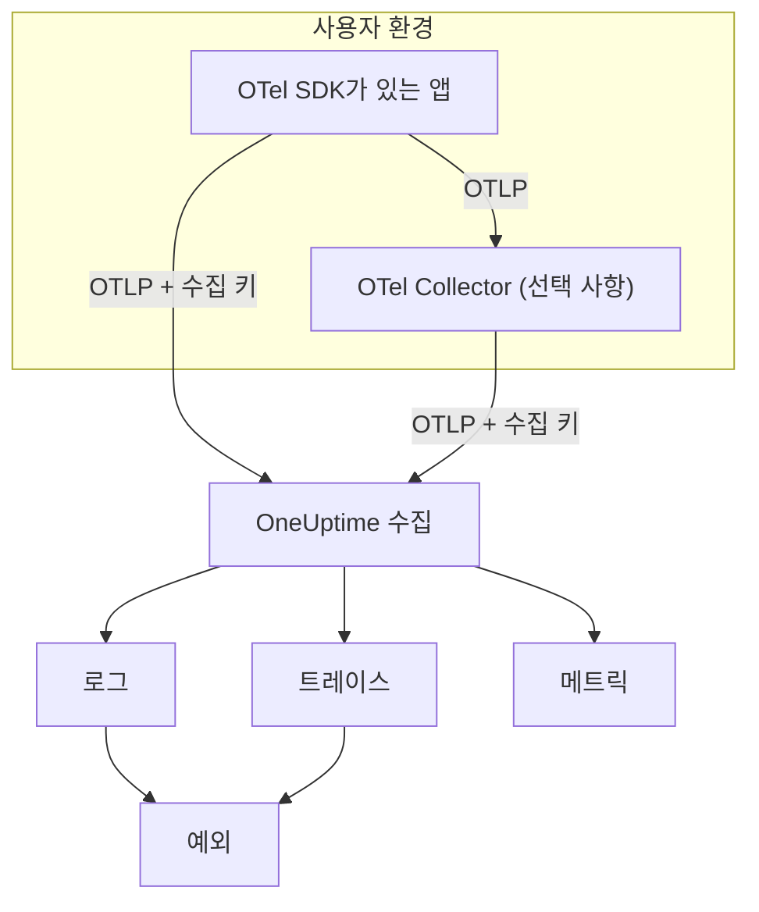

# OpenTelemetry

OneUptime은 OpenTelemetry Protocol(OTLP)로 로그, 메트릭, 트레이스를 수집합니다. 어떤 OpenTelemetry SDK든, 또는 OpenTelemetry Collector를 수집 키와 함께 OneUptime으로 향하게 하면 데이터가 **로그**, **트레이스**, **메트릭**, **예외**에 나타납니다. 이 페이지는 몇 분 안에 서비스가 데이터를 보내게 한 다음, 운영 환경에서 필요한 엔드포인트, 한도, 오류를 설명합니다.

:::cards
- [빠른 시작](#빠른-시작): 키를 만들고, 환경 변수 네 개를 설정하고, SDK를 추가합니다.
- [Collector 사용](#opentelemetry-collector를-통해-보내기): 이미 운영 중인 Collector에 OneUptime을 익스포터로 추가합니다.
- [엔드포인트와 한도](#엔드포인트와-한도): URL, 포트, 인코딩, 크기 한도, 상태 코드.
- [문제 해결](#문제-해결): 데이터가 도착하지 않을 때 확인할 사항.
:::

## 작동 방식

애플리케이션은 OTLP를 OneUptime으로 직접 내보내거나, 이를 전달하는 OpenTelemetry Collector로 내보냅니다. 모든 요청은 `x-oneuptime-token` 헤더에 수집 키를 담고 있으며, OneUptime은 이 키로 프로젝트를 찾습니다.



- **서비스는 자동으로 만들어집니다.** 리소스 속성 `service.name`(`OTEL_SERVICE_NAME`으로 설정)이 데이터가 속한 서비스의 이름이 됩니다. OneUptime은 처음 데이터를 보낼 때 서비스를 만들고 **제품 → 서비스**에 표시합니다.
- **오류는 예외가 됩니다.** 스팬의 예외 이벤트와 로그에 기록된 예외는 **예외**에서 이슈로 묶입니다. [로그에서 찾은 예외](#로그에서-찾은-예외)를 참고하세요.

## 시작하기 전에

- 수집 키를 만들 수 있는 OneUptime 프로젝트. 프로젝트 소유자와 관리자, 그리고 **Create Telemetry Ingestion Key** 권한이 있는 사람은 누구나 만들 수 있습니다.
- OpenTelemetry SDK를 추가할 수 있는 애플리케이션 또는 OpenTelemetry Collector.
- 애플리케이션이나 Collector에서 `oneuptime.com` 또는 자체 OneUptime 호스트로 나가는 HTTPS(포트 443).

> [!NOTE]
> OneUptime Cloud에서 텔레메트리는 수집된 GB당 과금됩니다. Free 플랜의 프로젝트는 텔레메트리를 보내기 전에 결제 수단이 있어야 하며, 키를 만드는 대화 상자에 요금이 표시됩니다.

## 빠른 시작

:::steps
### 수집 키 만들기

1. **제품 → 프로젝트 설정**으로 이동합니다.
2. 사이드 메뉴에서 **텔레메트리 및 APM**을 열고 **수집 키**를 선택합니다.
3. **수집 키 생성**을 클릭합니다. 대화 상자가 이름을 채우고, 애플리케이션이나 Collector가 데이터를 보낼 때 쓰는 키 유형인 **서버**를 선택합니다. 원하면 이름을 바꾼 다음 **수집 키 생성**을 클릭합니다.


새 키는 자체 페이지에서 열립니다. 키의 **시크릿 키**를 복사하세요. 이것이 `x-oneuptime-token`으로 보내는 토큰입니다.


### OpenTelemetry 환경 변수 설정하기

모든 OpenTelemetry SDK는 같은 표준 환경 변수를 읽으므로, 이 단계는 어떤 언어에서든 같습니다.

| 환경 변수 | 값 | 역할 |
| --- | --- | --- |
| `OTEL_EXPORTER_OTLP_ENDPOINT` | `https://oneuptime.com/otlp` | 보낼 곳입니다. `/v1/traces`, `/v1/metrics`, `/v1/logs`는 SDK가 직접 붙입니다. |
| `OTEL_EXPORTER_OTLP_HEADERS` | `x-oneuptime-token=YOUR_ONEUPTIME_INGESTION_KEY` | 모든 요청에 수집 키를 함께 보냅니다. |
| `OTEL_EXPORTER_OTLP_PROTOCOL` | `http/protobuf` | HTTP를 통한 OTLP입니다. 일부 SDK는 기본으로 gRPC를 사용하며, gRPC는 다른 엔드포인트를 씁니다. |
| `OTEL_SERVICE_NAME` | `my-service` | OneUptime에서 데이터가 표시될 서비스입니다. |

```bash
export OTEL_EXPORTER_OTLP_ENDPOINT="https://oneuptime.com/otlp"
export OTEL_EXPORTER_OTLP_HEADERS="x-oneuptime-token=YOUR_ONEUPTIME_INGESTION_KEY"
export OTEL_EXPORTER_OTLP_PROTOCOL="http/protobuf"
export OTEL_SERVICE_NAME="my-service"
```

자체 호스팅하나요? `https://oneuptime.com`을 OneUptime 인스턴스의 URL(예: `https://oneuptime.example.com/otlp`)로 바꾸세요. 예외에 환경 태그를 붙이려면 `OTEL_RESOURCE_ATTRIBUTES`도 `deployment.environment=production`으로 설정합니다.

### 앱에 OpenTelemetry 추가하기

언어를 선택하세요. 모든 설정이 위의 환경 변수를 읽으므로, 코드에는 엔드포인트나 키가 들어가지 않습니다.

:::tabs
@tab Node.js
SDK, 자동 계측, OTLP/HTTP 익스포터를 설치합니다.

```bash
npm install @opentelemetry/sdk-node @opentelemetry/auto-instrumentations-node \
  @opentelemetry/exporter-trace-otlp-proto @opentelemetry/exporter-metrics-otlp-proto \
  @opentelemetry/exporter-logs-otlp-proto @opentelemetry/sdk-metrics @opentelemetry/sdk-logs
```

SDK를 별도 파일에서 만듭니다.

```javascript title="instrumentation.js"
const { NodeSDK } = require("@opentelemetry/sdk-node");
const { getNodeAutoInstrumentations } = require("@opentelemetry/auto-instrumentations-node");
const { OTLPTraceExporter } = require("@opentelemetry/exporter-trace-otlp-proto");
const { OTLPMetricExporter } = require("@opentelemetry/exporter-metrics-otlp-proto");
const { OTLPLogExporter } = require("@opentelemetry/exporter-logs-otlp-proto");
const { PeriodicExportingMetricReader } = require("@opentelemetry/sdk-metrics");
const { BatchLogRecordProcessor } = require("@opentelemetry/sdk-logs");

// The exporters read OTEL_EXPORTER_OTLP_ENDPOINT and OTEL_EXPORTER_OTLP_HEADERS.
const sdk = new NodeSDK({
  traceExporter: new OTLPTraceExporter(),
  metricReader: new PeriodicExportingMetricReader({
    exporter: new OTLPMetricExporter(),
  }),
  logRecordProcessors: [new BatchLogRecordProcessor(new OTLPLogExporter())],
  instrumentations: [getNodeAutoInstrumentations()],
});

sdk.start();
```

애플리케이션 코드보다 먼저 불러옵니다.

```bash
node --require ./instrumentation.js app.js
```
@tab Python
OpenTelemetry 배포판과 익스포터를 설치한 다음, 앱이 사용하는 라이브러리의 계측을 설치합니다.

```bash
pip install opentelemetry-distro opentelemetry-exporter-otlp
opentelemetry-bootstrap -a install
```

`opentelemetry-instrument`를 통해 앱을 시작합니다. 트레이스, 메트릭, 로그를 내보내며, 로깅 변수는 Python의 `logging` 모듈로 작성한 레코드도 보냅니다.

```bash
OTEL_PYTHON_LOGGING_AUTO_INSTRUMENTATION_ENABLED=true opentelemetry-instrument python app.py
```
@tab Go
SDK와 OTLP/HTTP 익스포터를 추가합니다.

```bash
go get go.opentelemetry.io/otel go.opentelemetry.io/otel/sdk go.opentelemetry.io/otel/sdk/metric \
  go.opentelemetry.io/otel/exporters/otlp/otlptrace/otlptracehttp \
  go.opentelemetry.io/otel/exporters/otlp/otlpmetric/otlpmetrichttp
```

프로그램이 시작될 때 tracer와 meter 프로바이더를 만듭니다.

```go title="main.go"
package main

import (
	"context"
	"log"

	"go.opentelemetry.io/otel"
	"go.opentelemetry.io/otel/exporters/otlp/otlpmetric/otlpmetrichttp"
	"go.opentelemetry.io/otel/exporters/otlp/otlptrace/otlptracehttp"
	sdkmetric "go.opentelemetry.io/otel/sdk/metric"
	sdktrace "go.opentelemetry.io/otel/sdk/trace"
)

func main() {
	ctx := context.Background()

	// Both exporters read OTEL_EXPORTER_OTLP_ENDPOINT and OTEL_EXPORTER_OTLP_HEADERS.
	traceExporter, err := otlptracehttp.New(ctx)
	if err != nil {
		log.Fatal(err)
	}
	tracerProvider := sdktrace.NewTracerProvider(sdktrace.WithBatcher(traceExporter))
	defer tracerProvider.Shutdown(ctx)
	otel.SetTracerProvider(tracerProvider)

	metricExporter, err := otlpmetrichttp.New(ctx)
	if err != nil {
		log.Fatal(err)
	}
	meterProvider := sdkmetric.NewMeterProvider(
		sdkmetric.WithReader(sdkmetric.NewPeriodicReader(metricExporter)),
	)
	defer meterProvider.Shutdown(ctx)
	otel.SetMeterProvider(meterProvider)

	// Your application code.
}
```

프로바이더는 환경에서 `OTEL_SERVICE_NAME`을 가져옵니다. 로그에는 `otelslog` 같은 로그 브리지와 함께 `otlploghttp`를 추가하세요. 같은 변수를 읽습니다.
@tab Java
OpenTelemetry Java 에이전트를 내려받아 애플리케이션에 연결합니다. 코드를 바꿀 필요는 없습니다.

```bash
curl -L -O https://github.com/open-telemetry/opentelemetry-java-instrumentation/releases/latest/download/opentelemetry-javaagent.jar
java -javaagent:opentelemetry-javaagent.jar -jar my-app.jar
```

에이전트는 널리 쓰이는 프레임워크와 라이브러리를 계측하고, 트레이스, 메트릭, 그리고 Logback이나 Log4j로 작성한 로그를 내보냅니다.
@tab .NET
ASP.NET Core용 OpenTelemetry 패키지를 추가합니다.

```bash
dotnet add package OpenTelemetry.Extensions.Hosting
dotnet add package OpenTelemetry.Exporter.OpenTelemetryProtocol
dotnet add package OpenTelemetry.Instrumentation.AspNetCore
dotnet add package OpenTelemetry.Instrumentation.Http
```

시작 시 OpenTelemetry를 등록합니다. `UseOtlpExporter()`는 트레이스, 메트릭, 로그를 보내고 `OTEL_EXPORTER_OTLP_*` 변수를 읽습니다.

```csharp title="Program.cs"
using OpenTelemetry;
using OpenTelemetry.Metrics;
using OpenTelemetry.Trace;

var builder = WebApplication.CreateBuilder(args);

builder.Services.AddOpenTelemetry()
    .WithTracing(tracing => tracing
        .AddAspNetCoreInstrumentation()
        .AddHttpClientInstrumentation())
    .WithMetrics(metrics => metrics
        .AddAspNetCoreInstrumentation()
        .AddHttpClientInstrumentation())
    .WithLogging()
    .UseOtlpExporter();

var app = builder.Build();
app.Run();
```

Serilog를 쓰나요? Serilog의 로그를 OneUptime으로 보내는 방법은 [Serilog](/docs/telemetry/serilog)를 참고하세요.
:::

### 데이터가 도착하는지 확인하기

OneUptime이 키를 받아들이는지 물어봅니다.

```bash
curl -i -H "x-oneuptime-token: YOUR_ONEUPTIME_INGESTION_KEY" \
  https://oneuptime.com/otlp/v1/validate
```

정상적인 키는 `"valid": true`와 함께 `200`을 반환합니다. 그 밖의 경우에는 무엇이 잘못되었는지(알 수 없음, 비활성화됨, 만료됨)를 알려 주는 메시지와 함께 `401`을 반환합니다.

그런 다음 앱을 실행하고 1분 정도 사용해 보세요. **제품 → 서비스**를 열면 `OTEL_SERVICE_NAME`에 설정한 이름으로 서비스가 표시되고, 그 로그, 트레이스, 메트릭, 예외를 볼 수 있습니다. **제품 → 로그**, **제품 → 트레이스**, **제품 → 메트릭**은 모든 서비스의 같은 데이터를 보여 줍니다.
:::

:::details SDK 없이 테스트 로그 보내기
OTLP/HTTP는 JSON도 받으므로 `curl`로 로그를 보낼 수 있습니다. `severityNumber`가 `9`이면 정보 수준 로그가 됩니다.

```bash
curl -i https://oneuptime.com/otlp/v1/logs \
  -H "Content-Type: application/json" \
  -H "x-oneuptime-token: YOUR_ONEUPTIME_INGESTION_KEY" \
  -d '{
    "resourceLogs": [{
      "resource": {
        "attributes": [
          { "key": "service.name", "value": { "stringValue": "my-service" } }
        ]
      },
      "scopeLogs": [{
        "logRecords": [{
          "severityNumber": 9,
          "body": { "stringValue": "Hello from curl" }
        }]
      }]
    }]
  }'
```

`200`은 로그가 받아들여졌다는 뜻입니다. 몇 초 안에 **제품 → 로그**의 `my-service` 서비스에 나타납니다.
:::

## OpenTelemetry Collector를 통해 보내기

이미 Collector가 있거나, 한 곳에서 데이터를 묶고 거르고 보강하고 싶거나, 수집 키를 애플리케이션 밖에 두고 싶다면 Collector를 사용하세요. 앱은 Collector로 내보내고, OneUptime과 통신하는 것은 Collector뿐입니다.

:::steps
### OneUptime을 익스포터로 추가하기

OneUptime을 가리키는 `otlphttp` 익스포터를 추가하고 모든 파이프라인이 이를 거치게 합니다.

```yaml title="otel-collector-config.yaml"
receivers:
  otlp:
    protocols:
      grpc:
        endpoint: 0.0.0.0:4317
      http:
        endpoint: 0.0.0.0:4318

processors:
  batch: {}

exporters:
  otlphttp:
    endpoint: https://oneuptime.com/otlp
    headers:
      x-oneuptime-token: YOUR_ONEUPTIME_INGESTION_KEY

service:
  pipelines:
    traces:
      receivers: [otlp]
      processors: [batch]
      exporters: [otlphttp]
    metrics:
      receivers: [otlp]
      processors: [batch]
      exporters: [otlphttp]
    logs:
      receivers: [otlp]
      processors: [batch]
      exporters: [otlphttp]
```

익스포터의 기본값을 그대로 두세요. gzip으로 압축한 protobuf를 보내며, OneUptime은 둘 다 받습니다. 익스포터에 `Content-Type` 헤더를 설정하지 마세요. OneUptime은 이 헤더로 디코더를 고르므로, protobuf 바이트 앞에 JSON 콘텐츠 유형을 붙이면 수집이 깨집니다.

### Collector 실행하기

:::tabs
@tab Docker
```bash
docker run -d --name otel-collector \
  -p 4317:4317 -p 4318:4318 \
  -v "$(pwd)/otel-collector-config.yaml:/etc/otelcol-contrib/config.yaml" \
  otel/opentelemetry-collector-contrib:latest
```
@tab Linux
```bash
otelcol-contrib --config otel-collector-config.yaml
```
:::

Collector는 포트 `4317`(gRPC)과 `4318`(HTTP)에서 OTLP를 받습니다. SDK가 기본으로 보내는 포트입니다.

### 앱이 Collector를 향하게 하기

애플리케이션에서 `OTEL_EXPORTER_OTLP_ENDPOINT`를 Collector(예: `http://localhost:4318`)로 설정하고 `OTEL_EXPORTER_OTLP_HEADERS`를 제거하세요. 키는 Collector가 붙입니다. `OTEL_SERVICE_NAME`은 각 애플리케이션에 그대로 둡니다.

데이터는 빠른 시작과 똑같이 OneUptime에 도착합니다. 도착하지 않으면 Collector 자체 로그에 이유가 나옵니다. [문제 해결](#문제-해결)을 참고하세요.
:::

이미 다른 공급업체로 내보내고 있나요? 기존 익스포터 옆에 `otlphttp` 익스포터를 추가하고 각 파이프라인의 `exporters`에 둘 다 나열하면, 비교하는 동안 양쪽으로 보낼 수 있습니다. 호스트 메트릭과 로그 파일도 수집하려면 [Host OpenTelemetry Collector](/docs/telemetry/host-otel-collector) 가이드를 참고하세요.

## 엔드포인트와 한도

| 설정 | OTLP/HTTP(권장) | OTLP/gRPC |
| --- | --- | --- |
| 엔드포인트 | `https://oneuptime.com/otlp` | `https://oneuptime.com:443` |
| 인증 | `x-oneuptime-token` 헤더 | `x-oneuptime-token` 메타데이터 |
| 인코딩 | Protobuf(`application/x-protobuf`) 또는 JSON(`application/json`) | Protobuf |
| 압축 | 없음, `gzip`, `deflate` 또는 `zstd` | 없음 또는 `gzip` |
| 요청 크기 | `/otlp`에서 요청당 최대 4MB | 메시지당 최대 4MB |

HTTP에서는 신호마다 엔드포인트 아래에 자체 경로가 있습니다. SDK와 Collector가 자동으로 붙이므로, 도구가 전체 URL을 요구할 때만 직접 설정하세요.

| 신호 | OTLP/HTTP URL |
| --- | --- |
| 트레이스 | `https://oneuptime.com/otlp/v1/traces` |
| 메트릭 | `https://oneuptime.com/otlp/v1/metrics` |
| 로그 | `https://oneuptime.com/otlp/v1/logs` |
| 프로파일 | `https://oneuptime.com/otlp/v1/profiles` |

지속적 프로파일링에서는 대부분의 프로파일러가 대신 Pyroscope 호환 엔드포인트로 보냅니다. [지속적 프로파일링](/docs/telemetry/profiles)을 참고하세요. OTLP 프로파일을 내보내는 Collector는 익스포터의 `profiles_endpoint`를 `https://oneuptime.com/otlp/v1/profiles`로 설정해야 합니다. 기본적으로는 OneUptime이 제공하지 않는 개발용 경로로 프로파일을 보내기 때문입니다.

### gRPC를 통한 OTLP

OneUptime은 웹 앱과 같은 호스트의 포트 443에서 TLS로 OTLP/gRPC를 제공합니다. `OTEL_EXPORTER_OTLP_PROTOCOL`을 `grpc`로, `OTEL_EXPORTER_OTLP_ENDPOINT`를 `https://oneuptime.com:443`으로 설정하고 같은 `x-oneuptime-token` 헤더를 보내세요. Collector에서는 `endpoint: oneuptime.com:443`과 같은 `headers`를 지정한 `otlp` 익스포터를 사용합니다.

자체 호스팅 환경에서는 gRPC가 HTTPS로만 OneUptime에 도달합니다. 암호화되지 않은 HTTP(h2c) 연결은 거부됩니다. 인스턴스를 일반 HTTP로 제공한다면 OTLP/HTTP를 사용하세요.

키 설정 중 두 가지는 OTLP/HTTP에만 적용됩니다. **Requests Per Minute Limit**와 **Pinned Service Name**입니다. gRPC로 보낸 데이터는 보낼 때의 `service.name`을 그대로 유지하며, 한도에도 집계되지 않습니다.

### 응답

OneUptime은 데이터가 대기열에 들어가는 즉시 내보내기에 응답하며, 데이터는 몇 초 뒤에 나타납니다.

| 응답 | gRPC 상태 | 의미 | 해야 할 일 |
| --- | --- | --- | --- |
| `200` | `OK` | 받아들였습니다. | 없음. |
| `401` | `UNAUTHENTICATED` | 키가 없거나, 알 수 없거나, 만료되었습니다. | `x-oneuptime-token` 값을 키의 **시크릿 키**와 비교하세요. |
| `402` | `PERMISSION_DENIED` | OneUptime Cloud만 해당: 프로젝트가 Free 플랜이고 결제 수단이 없습니다. | **프로젝트 설정 → 결제 및 청구서 → 결제**에서 추가하세요. |
| `413` | — | 요청이 크기 한도를 넘었습니다. | 더 작은 배치로 보내세요. |
| `415` | — | 지원하지 않는 `Content-Encoding`입니다. | `gzip`, `deflate`, `zstd` 중 하나를 쓰거나 압축하지 마세요. |
| `422` | `PERMISSION_DENIED` | 키가 비활성화되었거나, 허용된 출처 밖에서 사용된 브라우저 키입니다. | 키를 다시 활성화하거나 서버 키로 보내세요. |
| `429` | — | 키의 **Requests Per Minute Limit**에 도달했습니다. | 처음에는 아무것도 하지 않아도 됩니다. 익스포터가 `Retry-After` 시간 뒤에 다시 시도합니다. 계속 발생하면 한도를 높이세요. |
| `503` | `UNAVAILABLE` | OneUptime이 시작 중이거나 수집 대기열을 사용할 수 없습니다. | 없음. OTLP 익스포터가 `503`을 스스로 다시 시도합니다. |

`401`, `402`, `413`, `415`, `422`는 OTLP 익스포터에게 영구적인 오류입니다. 익스포터는 다시 시도하지 않고 배치를 버린 뒤 오류를 로그에 남깁니다.

### 재시작과 업그레이드

OneUptime이 재시작하거나 업그레이드되는 동안에는 준비될 때까지 내보내기에 `503`과 `Retry-After: 5`로 응답하며, 익스포터는 이를 다시 보냅니다. Collector의 익스포터는 기본적으로 5분 동안 계속 다시 시도하고(`retry_on_failure`), 보내지 못한 것은 `sending_queue`에 보관하므로 둘 다 켜 두세요. OneUptime이 데이터를 받지 못한 시간은 서버, 호스트, 기타 리소스의 다운타임으로 계산되지 않습니다. [OneUptime이 데이터를 받지 못할 때](/docs/monitor/when-oneuptime-is-not-receiving#시작하는-동안)를 참고하세요.

### 수집 키

**프로젝트 설정 → 텔레메트리 및 APM → 수집 키**에 있는 각 키 페이지에는 다음 설정이 있습니다.

| 설정 | 역할 |
| --- | --- |
| **키 유형** | 애플리케이션, Collector, 에이전트에는 **서버**(기본값). 웹 페이지에 포함되는 키에는 **Browser**. 쓰기 전용이며 **Allowed Origins**에서 온 요청만 받아들입니다. 키를 만든 뒤에는 바꿀 수 없습니다. |
| **Allowed Origins** | 브라우저 키가 동작하는 웹 출처입니다(예: `https://app.example.com`). 서버 키에서는 무시됩니다. |
| **Pinned Service Name** | 설정하면, 이 키로 OTLP/HTTP를 통해 보낸 모든 데이터의 `service.name`을 대체합니다. |
| **활성화됨** | 끄면 키를 삭제하지 않고도 그 키로 보낸 데이터를 즉시 받지 않습니다. |
| **만료 시각** | 이 날짜 이후에는 키가 거부됩니다. 비워 두면 만료되지 않습니다. |
| **Requests Per Minute Limit** | 이 키를 쓰는 모든 클라이언트를 합쳐 분당 받아들이는 OTLP/HTTP 요청의 최대 수입니다. 비워 두면 서버 키는 제한이 없고, 브라우저 키는 6,000입니다. |
| **Last Used At** | 이 키로 마지막으로 데이터를 받아들인 시각입니다. 안전하게 교체하거나 삭제할 수 있는 키를 찾을 때 사용합니다. |

키 페이지의 **비밀 키 재설정**은 시크릿을 교체합니다. 이전 시크릿으로 보내는 모든 애플리케이션과 Collector는 업데이트할 때까지 거부됩니다.

## 자체 호스팅 OneUptime

이 페이지의 모든 내용은 자체 설치 환경에서도 똑같이 동작합니다. 이 페이지에 `https://oneuptime.com`이라고 쓰인 곳에는 OneUptime URL을 사용하세요.

- `OTEL_EXPORTER_OTLP_ENDPOINT`는 `https://YOUR-ONEUPTIME-HOST/otlp`입니다. OneUptime을 일반 HTTP로 제공한다면 `http://YOUR-ONEUPTIME-HOST/otlp`입니다.
- 함께 제공되는 인그레스는 `/otlp`에서 최대 4MB의 요청을 받습니다. OneUptime 앞에 두는 프록시는 한도가 더 낮을 수 있으므로(ingress-nginx의 `proxy-body-size` 기본값은 1MB) `/otlp`에 대해서도 한도를 높이세요. 그렇지 않으면 익스포터가 `413`을 받습니다.
- `DISABLE_TELEMETRY_INGESTION=true`가 설정되어 있으면 OneUptime은 모든 내보내기를 받아들이지만 아무것도 저장하지 않습니다. 자체 호스팅 인스턴스에 데이터가 전혀 보이지 않으면 이것부터 확인하세요.

## 로그에서 찾은 예외

OneUptime은 **logs** 안에서 예외를 찾아, 트레이스 오류가 들어가는 것과 같은 **예외** 보기에 모읍니다. 각 로그는 이미 서비스나 호스트에 속해 있으므로 예외도 그쪽에 연결됩니다. 로그와 트레이스의 예외는 같은 지문 기반 그룹화를 공유하므로, 트레이스와 로그 양쪽에서 보고된 오류는 하나의 이슈로 합쳐집니다.

로그가 예외가 되는 방법은 두 가지입니다.

| 감지 방식 | 적용되는 로그 | 작동 방식 |
| --- | --- | --- |
| **예외 속성**(권장) | 모든 로그 | OpenTelemetry의 `exception.type`, `exception.message`, `exception.stacktrace` 속성이 있는 로그 레코드는 바로 예외가 됩니다. 대부분의 로깅 연동은 예외를 로그로 남길 때 이 속성을 설정합니다(Logback 및 Log4j 어펜더, Serilog, Python 로깅 계측). 정확하고 모든 언어에서 동작합니다. |
| **본문 속 스택 트레이스** | 트레이스 ID와 스팬 ID가 없는 오류 및 치명적 로그 | OneUptime은 본문의 처음 16KB에서 JavaScript, Python, Java, Go, Ruby, C#/.NET, PHP 스택 트레이스를 찾아 유형, 메시지, 프레임을 가져옵니다. 스팬 안에서 기록된 로그는 스팬이 직접 예외를 보고하므로 건너뜁니다. |

본문 검사는 Collector가 읽는 원시 stdout, journald, syslog 같은 일반 텍스트 로그에 적합합니다. 여러 줄의 스택 트레이스는 하나의 로그 레코드로 도착해야 하므로 Collector에서 여러 줄 결합을 켜세요. [Host OpenTelemetry Collector](/docs/telemetry/host-otel-collector) 가이드를 참고하세요.

감지는 기본으로 켜져 있습니다. 자체 호스팅 환경에서는 `app` 서비스에 `TELEMETRY_LOG_EXCEPTION_EXTRACTION_ENABLED=false`를 설정하면 꺼지며, Helm 차트의 전용 워커를 실행한다면 `worker`에도 설정하세요.

## 문제 해결

:::details 데이터가 나타나지 않고 익스포터가 `401`을 기록합니다
키가 없거나, 알 수 없거나, 만료되었습니다. `OTEL_EXPORTER_OTLP_HEADERS`가 `x-oneuptime-token=` 뒤에 키의 **시크릿 키**가 붙은 값이고 값 안에 따옴표나 공백이 없는지, 그리고 키가 보고 있는 프로젝트의 것인지 확인하세요. [데이터가 도착하는지 확인하기](#데이터가-도착하는지-확인하기)의 검증 요청이 어느 경우인지 알려 줍니다.
:::

:::details 익스포터가 `422`를 기록합니다
키가 비활성화되었거나 브라우저 키입니다. 키 설정에서 **활성화됨**을 다시 켜거나 **서버** 키를 만드세요. 브라우저 키는 허용된 출처 중 하나에 있는 웹 페이지에서만 받아들여집니다.
:::

:::details 익스포터가 `402`를 기록합니다
프로젝트가 OneUptime Cloud의 Free 플랜이고 결제 수단이 없으며, 텔레메트리는 사용한 만큼 과금됩니다. **프로젝트 설정 → 결제 및 청구서 → 결제**에서 결제 수단을 추가하면 내보내기가 다시 받아들여집니다.
:::

:::details 익스포터가 `404`를 기록합니다
SDK가 잘못된 경로로 보내고 있습니다. `OTEL_EXPORTER_OTLP_ENDPOINT`는 `/otlp`로 끝나야 하며, 끝에 슬래시나 `/v1/...`을 붙이지 않습니다. 그것은 SDK가 붙입니다. `OTEL_EXPORTER_OTLP_TRACES_ENDPOINT`처럼 신호별 변수를 설정한다면 전체 URL(예: `https://oneuptime.com/otlp/v1/traces`)이 필요합니다.
:::

:::details 아무 일도 일어나지 않고 SDK가 연결 오류를 기록합니다
SDK가 HTTP 엔드포인트나 `localhost`로 gRPC 내보내기를 하고 있을 가능성이 큽니다. `OTEL_EXPORTER_OTLP_PROTOCOL=http/protobuf`를 설정하거나, [gRPC를 통한 OTLP](#grpc를-통한-otlp)에서 설명한 gRPC 엔드포인트를 사용하세요. 또한 프로세스가 실제로 환경 변수를 보는지 확인하세요. 컨테이너에서는 셸이 아니라 컨테이너에 설정해야 합니다.
:::

:::details Collector가 `413`과 함께 `Exporting failed`를 기록합니다
배치가 크기 한도를 넘었습니다. `batch` 프로세서에 `send_batch_max_size: 1000`을 설정하는 등으로 배치 크기를 줄이세요. 자체 프록시 뒤에서 자체 호스팅한다면 그 프록시의 본문 크기 한도도 확인하세요.
:::

:::details 데이터가 엉뚱한 서비스나 Unknown Service에 들어갑니다
서비스는 리소스 속성 `service.name`에서 정해집니다. 각 애플리케이션에서 `OTEL_SERVICE_NAME`을 설정하세요. 키에 **Pinned Service Name**이 있으면 그 키로 보낸 모든 OTLP/HTTP 내보내기가 대신 그 이름으로 분류됩니다.
:::

## 다음 단계

:::cards
- [검색 구문](/docs/telemetry/search-syntax): 탐색기에서 로그, 트레이스, 메트릭, 예외를 필터링합니다.
- [로그 파이프라인](/docs/telemetry/log-pipelines): 로그가 들어올 때 파싱하고 보강합니다.
- [로그 모니터](/docs/monitor/logs-monitor): 일치하는 로그가 나타나면 알림을 보냅니다.
- [Host OpenTelemetry Collector](/docs/telemetry/host-otel-collector): Collector로 호스트 메트릭과 로그 파일을 수집합니다.
:::
