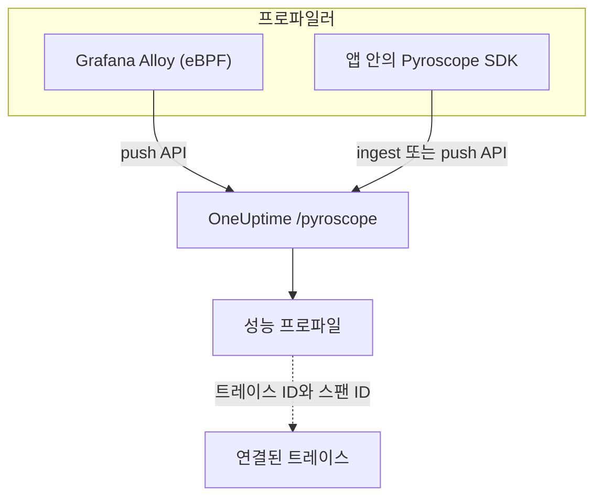

# 연속 프로파일링

연속 프로파일링은 애플리케이션이 CPU 시간과 메모리를 어디에 쓰는지 함수 단위로 보여 줍니다. OneUptime은 **Pyroscope 호환 수집 API** 를 제공하므로, Pyroscope 서버로 보낼 수 있는 것이라면 (Grafana Alloy eBPF 프로파일러나 각 언어의 Pyroscope SDK) OneUptime으로도 보낼 수 있고, 그 결과를 로그, 메트릭, 트레이스 옆에서 플레임 그래프로 볼 수 있습니다.

:::cards
- [프로파일 보내기](#프로파일-보내기): eBPF를 쓰는 Grafana Alloy, 또는 앱 안의 Pyroscope SDK.
- [수집 엔드포인트](#수집-엔드포인트): 기본 URL과 키를 전달하는 세 가지 방법.
- [작동 확인](#작동-확인): 키, 페이지, 업로드 상태를 확인합니다.
- [프로파일 살펴보기](#oneuptime에서-프로파일-살펴보기): 플레임 그래프, 상위 함수, 비교, 트레이스 링크.
:::

## 작동 방식

프로파일러는 프로세스를 샘플링하고, 몇 초마다 수집 키와 함께 OneUptime의 `/pyroscope` 엔드포인트로 프로파일을 업로드합니다. OneUptime은 각 프로파일을 그 프로파일이 지정한 서비스 아래에 저장하고 **성능 프로파일** 에서 플레임 그래프로 그립니다.



## 시작하기 전에

**서버** 텔레메트리 수집 키가 필요합니다. 아직 없다면 다음과 같이 만드세요.

:::steps
### 수집 키 열기

**제품 → 프로젝트 설정** 으로 이동해 사이드 메뉴에서 **텔레메트리 및 APM** 을 열고 **수집 키** 를 선택하세요.


### 키 만들기

**수집 키 생성** 을 클릭하세요. 대화 상자에는 키 이름이 채워져 있고 **서버** 가 선택되어 있습니다 (애플리케이션이나 수집기가 데이터를 보낼 때 쓰는 종류의 키입니다). 그대로 **수집 키 생성** 을 클릭해 만들거나, 먼저 이름을 바꾸세요.

### 시크릿 복사하기

새 키는 자체 페이지에서 열립니다. **시크릿 키** 를 복사하세요. 아래 예에서 `YOUR_ONEUPTIME_INGESTION_TOKEN` 이라고 부르는 수집 토큰이 이것입니다.


:::

## 수집 엔드포인트

| 설정 | 값 |
| --- | --- |
| 기본 URL (Pyroscope 서버 주소) | `https://oneuptime.com/pyroscope` |
| 인증 헤더 | `x-oneuptime-token: YOUR_ONEUPTIME_INGESTION_TOKEN` |

클라이언트는 기본 URL 뒤에 자체 경로를 붙입니다 (대부분의 Pyroscope SDK는 `/ingest`, Grafana Alloy와 v0.14 이상의 .NET SDK는 `/push.v1.PusherService/Push`). 따라서 항상 기본 URL만, 끝에 슬래시 없이 설정합니다.

OneUptime은 다음 중 어느 방법으로든 수집 토큰을 읽으므로, 클라이언트가 지원하는 방법을 사용하세요.

| 방법 | 사용하는 경우 |
| --- | --- |
| `x-oneuptime-token` 헤더 | 사용자 지정 헤더를 추가할 수 있는 클라이언트. |
| `Authorization: Bearer <token>` | `authToken` / `auth_token` 옵션이 있는 SDK. 이 옵션이 보내는 형식입니다. |
| HTTP 기본 인증. 토큰을 **비밀번호** 로 지정 (사용자 이름은 아무것이나) | 기본 인증의 사용자와 비밀번호만 제공하는 클라이언트. |

> [!NOTE]
> OneUptime을 자체 호스팅하나요? `https://oneuptime.com` 을 자체 호스트로 바꾸세요. 예: `https://YOUR-ONEUPTIME-HOST/pyroscope`.

## 지원되는 프로파일 형식

| 형식 | 보내는 쪽 | 지원 |
| --- | --- | --- |
| pprof (바이너리 protobuf, gzip 압축 가능) | Go, Node.js, .NET Pyroscope SDK, Grafana Alloy | 예 |
| Folded / collapsed 텍스트 | Python, Ruby, Rust Pyroscope SDK (기본 업로드 형식) | 예 |
| JFR (Java Flight Recorder) | Pyroscope Java 에이전트 | 아직 아님. Java 서비스에는 Grafana Alloy를 사용하세요 |

## 프로파일 보내기

Grafana Alloy는 코드 변경 없이 호스트의 모든 프로세스를 프로파일링하며, 처음 시작할 때 권장하는 방법입니다. Pyroscope SDK는 대신 애플리케이션 안에서 실행됩니다.

:::tabs
@tab Grafana Alloy
[Grafana Alloy](https://grafana.com/docs/alloy/latest/) 는 eBPF를 사용해 Linux 호스트의 모든 프로세스에서 CPU 프로파일을 수집합니다. 애플리케이션 안의 에이전트도, 코드 변경도 필요 없습니다. Go, Rust, C/C++, Java, Python, Ruby, PHP, Node.js, .NET에서 동작합니다.

Alloy 구성을 만드세요.

```hcl title="alloy-config.alloy"
discovery.process "all" {
  refresh_interval = "60s"
}

discovery.relabel "alloy_profiles" {
  targets = discovery.process.all.targets

  rule {
    action       = "replace"
    source_labels = ["__meta_process_exe"]
    target_label  = "service_name"
  }
}

pyroscope.ebpf "default" {
  targets    = discovery.relabel.alloy_profiles.output
  forward_to = [pyroscope.write.oneuptime.receiver]

  collect_interval = "15s"
  sample_rate      = 97
}

pyroscope.write "oneuptime" {
  endpoint {
    url = "https://oneuptime.com/pyroscope"
    headers = {
      "x-oneuptime-token" = "YOUR_ONEUPTIME_INGESTION_TOKEN",
    }
  }
}
```

Docker로 실행하세요. eBPF에는 호스트 PID 네임스페이스를 쓰는 특권 컨테이너가 필요합니다.

```yaml title="docker-compose.yml"
services:
  alloy:
    image: grafana/alloy:latest
    privileged: true
    pid: host
    volumes:
      - ./alloy-config.alloy:/etc/alloy/config.alloy
      - /proc:/proc:ro
      - /sys:/sys:ro
    command:
      - run
      - /etc/alloy/config.alloy
```

또는 호스트에서 직접 실행하세요.

```bash
alloy run alloy-config.alloy
```

relabel 규칙은 각 프로파일의 서비스 이름을 프로세스 실행 파일 이름으로 정합니다.
@tab Go
Go SDK는 pprof를 업로드합니다. 서버 주소를 OneUptime 기본 URL로 지정하고 수집 토큰을 인증 토큰으로 전달하세요.

```go
import "github.com/grafana/pyroscope-go"

pyroscope.Start(pyroscope.Config{
    ApplicationName: "my-service",
    ServerAddress:   "https://oneuptime.com/pyroscope",
    AuthToken:       "YOUR_ONEUPTIME_INGESTION_TOKEN",
    ProfileTypes: []pyroscope.ProfileType{
        pyroscope.ProfileCPU,
        pyroscope.ProfileAllocObjects,
        pyroscope.ProfileAllocSpace,
        pyroscope.ProfileInuseObjects,
        pyroscope.ProfileInuseSpace,
        pyroscope.ProfileGoroutines,
    },
})
```
@tab Node.js
Node.js SDK는 pprof를 업로드합니다.

```javascript
const Pyroscope = require("@pyroscope/nodejs");

Pyroscope.init({
  serverAddress: "https://oneuptime.com/pyroscope",
  appName: "my-service",
  authToken: "YOUR_ONEUPTIME_INGESTION_TOKEN",
});

Pyroscope.start();
```
@tab Python
Python SDK는 folded 텍스트를 업로드합니다.

```python
import pyroscope

pyroscope.configure(
    application_name="my-service",
    server_address="https://oneuptime.com/pyroscope",
    auth_token="YOUR_ONEUPTIME_INGESTION_TOKEN",
)
```
@tab .NET
Pyroscope .NET 프로파일러는 네이티브 CLR 프로파일러로, 코드 변경이 필요 없고 환경 변수만으로 켭니다. [pyroscope-dotnet releases](https://github.com/grafana/pyroscope-dotnet/releases) 에서 이미지에 맞는 릴리스 (`glibc` 또는 Alpine용 `musl`, `x86_64` 또는 `aarch64`) 를 내려받아 런타임에 로드하세요.

```dockerfile title="Dockerfile"
FROM alpine:3.20 AS pyroscope-profiler
ARG PYROSCOPE_DOTNET_VERSION=1.5.1
ADD https://github.com/grafana/pyroscope-dotnet/releases/download/pyroscope-${PYROSCOPE_DOTNET_VERSION}/pyroscope.${PYROSCOPE_DOTNET_VERSION}-glibc-x86_64.tar.gz /tmp/pyroscope.tar.gz
RUN mkdir -p /pyroscope && tar -xzf /tmp/pyroscope.tar.gz -C /pyroscope

FROM mcr.microsoft.com/dotnet/aspnet:10.0
# ... your application ...
COPY --from=pyroscope-profiler /pyroscope /pyroscope
ENV CORECLR_ENABLE_PROFILING=1
ENV CORECLR_PROFILER={BD1A650D-AC5D-4896-B64F-D6FA25D6B26A}
ENV CORECLR_PROFILER_PATH=/pyroscope/Pyroscope.Profiler.Native.so
ENV LD_PRELOAD=/pyroscope/Pyroscope.Linux.ApiWrapper.x64.so
ENV LD_LIBRARY_PATH=/pyroscope
```

그런 다음 OneUptime을 가리키도록 설정하세요. 예를 들어 Kubernetes / Helm 환경에서는 다음과 같습니다.

```bash
PYROSCOPE_APPLICATION_NAME=my-service
PYROSCOPE_PROFILING_ENABLED=1
PYROSCOPE_SERVER_ADDRESS=https://oneuptime.com/pyroscope
PYROSCOPE_BASIC_AUTH_USER=oneuptime
PYROSCOPE_BASIC_AUTH_PASSWORD=YOUR_ONEUPTIME_INGESTION_TOKEN
```

수집 토큰은 기본 인증 비밀번호에 넣습니다. 사용자 이름은 비어 있지 않은 어떤 값이든 되지만, 둘 다 설정하지 않으면 프로파일러는 자격 증명을 전혀 보내지 않습니다. 대신 토큰을 헤더로 보내려면 `PYROSCOPE_HTTP_HEADERS={"x-oneuptime-token":"YOUR_ONEUPTIME_INGESTION_TOKEN"}` 를 설정하세요.

토큰을 전달하는 방법은 프로파일러 릴리스에 따라 다릅니다. 1.5 이상은 `PYROSCOPE_AUTH_TOKEN` 을 무시하므로, 이전 릴리스에서 업그레이드하면서 이 설정을 그대로 두면 모든 업로드가 `401` 로 거부됩니다.

| pyroscope-dotnet 릴리스 | 업로드 대상 | 토큰 설정 |
| --- | --- | --- |
| v0.13 이하 | `/pyroscope/ingest` | `PYROSCOPE_AUTH_TOKEN` |
| v0.14부터 1.4까지 | `/pyroscope/push.v1.PusherService/Push` | `PYROSCOPE_AUTH_TOKEN` |
| 1.5 이상 | `/pyroscope/push.v1.PusherService/Push` | `PYROSCOPE_BASIC_AUTH_USER=oneuptime` 및 `PYROSCOPE_BASIC_AUTH_PASSWORD=<token>` (둘 다 설정해야 함), 또는 `PYROSCOPE_HTTP_HEADERS={"x-oneuptime-token":"<token>"}` |

1.0 이전 릴리스에는 `pyroscope-<version>` 대신 `v<version>-pyroscope` 태그가 붙습니다 (예: `https://github.com/grafana/pyroscope-dotnet/releases/download/v0.13.0-pyroscope/pyroscope.0.13.0-glibc-x86_64.tar.gz`). 프로파일러 GUID와 파일 이름은 모든 릴리스에서 같습니다.

CPU 프로파일링은 기본으로 켜져 있습니다. 실제 경과 시간, 할당, 예외, 잠금 경합 프로파일링은 옵트인이며, `PYROSCOPE_PROFILING_WALLTIME_ENABLED`, `PYROSCOPE_PROFILING_ALLOCATION_ENABLED`, `PYROSCOPE_PROFILING_EXCEPTION_ENABLED`, `PYROSCOPE_PROFILING_LOCK_ENABLED` 를 `true` 로 설정해 켭니다. 정적 레이블은 `PYROSCOPE_LABELS` (`key:value,key:value`) 에 넣습니다.

프로파일러는 15초마다 업로드하고 업로드를 압축하지 **않으므로**, 바쁜 서비스는 업로드 한 번에 몇 MB를 보낼 수 있습니다. OneUptime 자체의 인그레스는 `/pyroscope` 에서 최대 16 MB를 받습니다. OneUptime 앞에 다른 프록시가 있다면 (예를 들어 기본 `proxy-body-size` 가 1 MB인 ingress-nginx) 그 프록시에서도 `/pyroscope` 의 본문 크기 제한을 올리세요. 그렇지 않으면 큰 업로드는 OneUptime에 도달하기 전에 `413` 으로 거부됩니다.
@tab Java
Pyroscope Java 에이전트는 JFR 형식으로 프로파일을 업로드하는데, OneUptime은 아직 이 형식을 수집하지 않습니다. 대신 Grafana Alloy (**Grafana Alloy** 탭) 로 Java 서비스를 프로파일링하세요. 에이전트나 코드 변경 없이 JVM CPU 프로파일을 수집합니다.
:::

**Ruby** 와 **Rust** 는 Go, Node.js, Python과 같은 방식으로 동작합니다. [사용하는 언어의 Pyroscope SDK](https://grafana.com/docs/pyroscope/latest/configure-client/) 를 설치하고, 서버 주소를 `https://oneuptime.com/pyroscope` 로 설정한 뒤 수집 토큰을 인증 토큰으로 전달하세요 (SDK 버전이 기본 인증만 제공한다면 기본 인증 비밀번호로 전달합니다).

## 지원되는 프로파일 유형

pprof는 여러 샘플 유형을 선언할 수 있으며, 업로드된 각 프로파일은 그중 하나로 저장됩니다. CPU 시간 (나노초 단위의 `cpu`) 이 있으면 그것을, 없으면 실제 경과 시간을, 그다음은 사용 중인 바이트와 할당된 바이트 순으로, 그것도 없으면 처음 선언된 유형을 씁니다. 어떤 유형이든 저장되고 볼 수 있지만, 아래 유형은 OneUptime UI에서 전용 그룹화, 단위, 레이블을 갖습니다.

| 프로파일 유형 | 표시 이름 | 단위 |
| --- | --- | --- |
| `cpu`, `samples` | CPU 시간 | 나노초 |
| `wall` | 실제 경과 시간 | 나노초 |
| `inuse_space`, `alloc_space`, `heap` | 메모리 (바이트) | 바이트 |
| `inuse_objects`, `alloc_objects` | 메모리 (객체 수) | 개수 |
| `mutex`, `contention`, `block` | 잠금 경합 | 나노초 |
| `goroutine` | Goroutines (Go) | 개수 |

그 밖의 유형 (예: 사용자 지정 샘플 유형) 은 원래 이름 그대로 "기타" 아래에 표시됩니다.

## 작동 확인

:::steps
### 토큰 확인하기

수집 엔드포인트는 토큰이 없거나 유효하지 않으면 `401` 로 응답하지만, 대부분의 프로파일러는 이를 눈에 띄는 곳에 보여 주지 않습니다 (예를 들어 .NET 프로파일러는 HTTP 응답을 debug 수준에서만 기록합니다). 검증 엔드포인트에 직접 물어보세요.

```bash
curl -i -H "x-oneuptime-token: YOUR_ONEUPTIME_INGESTION_TOKEN" \
  https://oneuptime.com/otlp/v1/validate
```

유효한 토큰은 `200` 과 `{"valid": true, ...}` 를 반환하며, 그 `keyType` 은 `Server` 여야 합니다. 브라우저 키도 유효하지만 프로파일을 보낼 수는 없습니다. 알 수 없거나, 취소되었거나, 비활성화되었거나, 만료된 토큰은 `401` 을 반환합니다.

### 프로파일 페이지 열기

OneUptime 대시보드에서 **제품 → 성능 프로필** 로 이동하세요. Alloy의 15초 수집 간격 (또는 SDK의 10초에서 15초 사이 업로드 간격) 이라면, 에이전트가 시작되고 1, 2분 안에 첫 프로파일과 플레임 그래프가 나타납니다.

### 서비스 확인하기

프로파일은 SDK의 `application_name` / `appName` / `PYROSCOPE_APPLICATION_NAME` 이 지정하는 텔레메트리 서비스에 연결됩니다 (위의 Alloy relabel 규칙에서는 프로세스 실행 파일 이름입니다).

### 그래도 보이지 않나요? 업로드 상태 확인하기

.NET 프로파일러라면 애플리케이션에 `DD_TRACE_DEBUG=1` 을 1분 동안 설정하세요. 그러면 업로드마다 `PyroscopePprofSink <status>` 줄을 기록합니다. `200` 은 OneUptime이 받았다는 뜻이고, `401` 은 토큰 문제이며, `404` 는 대개 `PYROSCOPE_SERVER_ADDRESS` 에 `/pyroscope` 접미사가 빠졌다는 뜻이고, `413` 은 OneUptime 앞의 프록시가 업로드 크기 때문에 거부했다는 뜻입니다 ([프로파일 보내기](#프로파일-보내기) 의 **.NET** 탭 참고). OneUptime을 직접 운영한다면 인그레스 (nginx) 접근 로그에도 모든 `/pyroscope` 요청에 대해 같은 상태가 기록됩니다.
:::

## OneUptime에서 프로파일 살펴보기

**제품 → 성능 프로필** 은 서비스 전반에서 시간이 어디에 쓰이는지 보여 주는 개요를 열고, **모든 프로필** 에는 모든 업로드가 나열됩니다. 분석할 대상을 고르세요. **전체**, **CPU 시간**, **메모리**, **잠금**, 또는 **실제 경과 시간** 이나 **Goroutines** 같은 특정 유형입니다.

프로파일 페이지에는 세 가지 보기가 있습니다.

| 보기 | 보여 주는 내용 |
| --- | --- |
| **플레임 그래프** | 각 막대는 호출 스택의 함수이며, 너비는 소비한 시간이나 리소스에 비례합니다. 함수를 클릭하면 확대되어 호출자와 피호출자를 볼 수 있습니다. |
| **Top functions** | 프로파일의 함수를 자체 시간 또는 총 시간 순으로 나열합니다. **Only my code** 는 라이브러리 프레임을 숨깁니다. |
| **Diff vs. baseline** | 프로파일을 이전 기간 (**1시간 전 대비**, **어제 대비**, **지난주 대비**) 과 비교하고, **Most regressed** 함수와 **Most improved** 함수를 보여 줍니다. |

**Download pprof** 는 `go tool pprof` 같은 로컬 도구에서 쓸 수 있도록 프로파일을 저장합니다.

### 트레이스 연결

프로파일에 트레이스 ID와 스팬 ID가 있으면 (예: 샘플 레이블 `trace_id` / `span_id`), 느린 트레이스 스팬에서 해당 CPU 또는 메모리 프로파일로 바로 이동해 그때 어떤 코드가 실행되고 있었는지 정확히 파악할 수 있으며, **Open linked trace** 는 반대 방향으로 이동합니다.

스팬의 **프로필** 탭에는 그 아래에 중첩된 스팬에 연결된 샘플도 포함됩니다. 프로파일러는 요청의 CPU 시간을 요청 스팬 자체가 아니라 하위 스팬에 붙이는 경우가 많기 때문입니다.

## 데이터 보존

프로파일은 프로젝트의 텔레메트리 보존 기간 동안 보관됩니다. **프로젝트 설정 → 텔레메트리 및 APM → 데이터 보존** 에서 **기본 보존(일)** 을 설정하며, 바꾸지 않으면 15일입니다. 보존 기간이 끝나면 데이터는 자동으로 삭제됩니다. 보존 재정의가 포함된 요금제에서는 프로파일을 다른 텔레메트리보다 길게 또는 짧게 보관하거나, 서비스의 **설정** 페이지에서 서비스별로 보존 기간을 정할 수도 있습니다.

## 다음 단계

:::cards
- [프로필 모니터](/docs/monitor/profiles-monitor): 서비스가 보내는 프로파일의 개수와 유형으로 알림을 보냅니다.
- [OpenTelemetry](/docs/telemetry/open-telemetry): 프로파일이 연결되는 트레이스를 보냅니다.
- [Kubernetes 에이전트](/docs/telemetry/kubernetes-agent): 에이전트의 eBPF 프로파일러로 클러스터 전체를 프로파일링합니다.
:::
