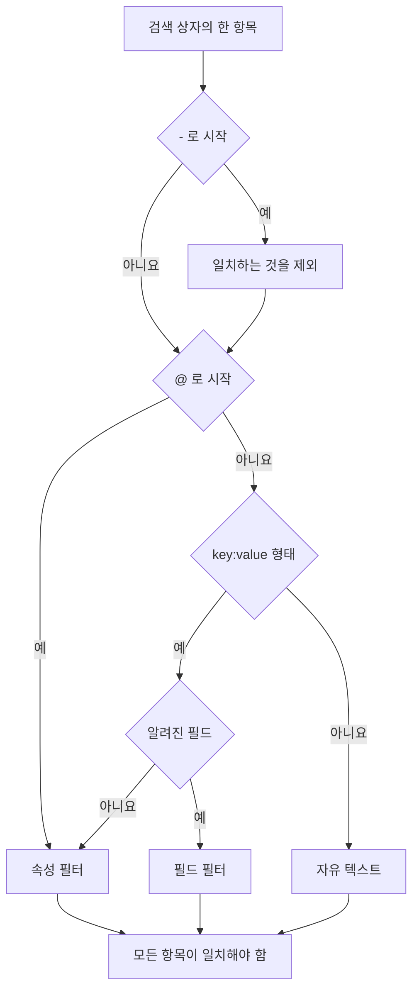

# 검색 구문

로그, 트레이스, 메트릭, 예외 탐색기 위의 검색 상자는 하나의 쿼리 언어를 사용합니다. 쿼리는 공백으로 구분한 필터의 목록이며, **모든 필터가 일치해야 합니다**. 필터 사이에 암묵적인 OR는 없습니다. 검색할 때 이 페이지를 참조 자료로 활용하세요.

:::cards
- [두 종류의 필터](#두-종류의-필터): 기본 제공 필드, 속성, 자유 텍스트.
- [값 일치](#값-일치): 와일드카드, "포함", 비교, 목록.
- [제외](#제외): 앞에 `-` 를 붙이면 어떤 필터든 반대로 바꿀 수 있습니다.
- [신호별 필드](#신호별-필드): 탐색기마다 필터링할 수 있는 항목.
:::

## 쿼리를 읽는 방법

```text
severity:error @platform.team:a* -@http.method:GET timeout
```

이 쿼리는 "error 수준의 로그 중 `platform.team` 속성이 `a` 로 시작하고, `http.method` 속성이 `GET` 이 아니며, 메시지에 `timeout` 이 들어 있는 로그"로 읽힙니다.

| 항목 | 종류 | 일치 조건 |
| --- | --- | --- |
| `severity:error` | 필드 | 로그의 심각도가 Error입니다. |
| `@platform.team:a*` | 속성 | `platform.team` 속성이 `a` 로 시작합니다. |
| `-@http.method:GET` | 제외된 속성 | `http.method` 속성이 `GET` 이 아닌 모든 값입니다. |
| `timeout` | 자유 텍스트 | 메시지에 `timeout` 이 들어 있습니다. |

공백으로 구분된 각 항목은 따로 읽힌 다음, 모두 AND로 결합됩니다.



## 두 종류의 필터

| 형식 | 필터 대상 | 예 |
| --- | --- | --- |
| `field:value` | 신호의 기본 제공 필드 | `severity:error` |
| `@attribute:value` | 행의 OpenTelemetry 속성 | `@http.status_code:500` |
| 단어만 입력 | 메시지 (로그), 스팬 이름 (트레이스), 메트릭 이름 (메트릭), 예외 메시지 (예외) | `connection refused` |

키가 알려진 필드가 아닌 `key:value` 는 속성으로 취급되므로, `k8s.pod:api-0` 과 `@k8s.pod:api-0` 은 같은 뜻입니다. 앞에 `@` 를 붙이면 항상 "속성에서 찾기"라는 뜻이지만, 예외가 하나 있습니다. 예외 탐색기에서는 `@type:`, `@service:`, `@env:`, `@class:` 가 여전히 해당 필드를 필터링합니다.

우연히 콜론이 들어 있을 뿐인 텍스트는 텍스트로 남습니다. `https://example.com` 과 `12:30` 은 필터로 읽히지 않고 단어로 검색됩니다.

## 값 일치

이 표의 모든 형식은 모든 속성과 대부분의 기본 제공 필드에서 동작합니다. 값을 더 단순하게 읽는 필드는 [신호별 필드](#신호별-필드)에 표시되어 있습니다.

| 입력 | 일치하는 값 |
| --- | --- |
| `@k:abc` | 정확히 `abc` |
| `@k:a*` | `a` 로 시작하는 모든 값: `abc`, `alpha` |
| `@k:*c` | `c` 로 끝나는 모든 값 |
| `@k:a*c` | `a` 로 시작하고 `c` 로 끝나는 값 |
| `@k:a?c` | `?` 는 정확히 한 글자: `abc`, `axc` 는 일치하지만 `ac` 는 일치하지 않음 |
| `@k:*` | 속성이 있고 비어 있지 않음 |
| `@k:~abc` | 어디에든 `abc` 가 들어 있음 |
| `@k:!abc` | `abc` 를 제외한 모든 값 |
| `@k:>100` | 100보다 큼. `>=`, `<`, `<=` 도 사용 가능 |
| `@k:(a OR b)` | 두 값 중 하나. `@k:[a, b]` 와 같음 |
| `@k:(a* OR b*)` | 두 패턴 중 하나 |

와일드카드와 "포함" 일치는 대소문자를 구분하지 않습니다. 정확한 일치는 저장된 그대로의 값과 비교하므로 대소문자를 구분합니다.

### 공백이 있는 값

값을 큰따옴표로 감쌉니다.

```text
name:"SELECT wp_options"
@k8s.container.name:"my container"
```

따옴표가 보호하는 것은 **공백** 이며 와일드카드가 아닙니다. `@k:"a b*"` 는 여전히 `a b` 로 시작하는 모든 값과 일치합니다.

### `*`, `?` 와 다른 기호를 문자 그대로 쓰기

백슬래시를 붙이면 다음 한 글자가 문자 그대로 해석됩니다.

| 입력 | 일치하는 값 |
| --- | --- |
| `@k:a\*b` | 정확히 `a*b` |
| `@k:\~abc` | 정확히 `~abc` |
| `@k:\>5` | 정확히 `>5` |

`%` 나 `_` 가 들어 있는 값은 이스케이프할 필요가 없습니다. 이 문자들은 항상 문자 그대로입니다.

## 제외

앞에 붙인 `-` 는 위의 형식을 포함해 어떤 필터든 반대로 바꿉니다.

| 입력 | 일치하는 값 |
| --- | --- |
| `-severity:debug` | debug를 제외한 모든 값 |
| `-@platform.team:a*` | `platform.team` 이 `a` 로 시작하지 **않는** 모든 행. `platform.team` 이 아예 없는 행도 포함 |
| `-@k:*` | 속성이 없거나 비어 있음 |
| `-@k:(a OR b)` | 두 값 모두 아님 |
| `-@k:>100` | 100 이하 |
| `-@k:~abc` | `abc` 가 들어 있지 않음 |

트레이스 탐색기에서 `-` 는 속성만 제외합니다. `-status:error` 는 스팬 이름에서 찾을 텍스트로 읽혀 아무것도 찾지 못합니다. 대신 원하는 값을 `status:(ok OR unset)` 처럼 지정하세요.

## 신호별 필드

필드 이름은 대소문자를 구분하지 않습니다. `statusMessage:` 와 `statusmessage:` 는 같은 필드입니다.

### 로그

| 필드 | 별칭 | 참고 |
| --- | --- | --- |
| `severity` | `level` | `fatal`, `error`, `warning` (또는 `warn`), `info` (또는 `information`), `debug`, `trace`, `unspecified`. 대소문자 무관 |
| `service` | | 서비스 이름. 줄이지 않고 전체를 쓰며 대소문자 무관 |
| `trace` | | 트레이스 ID |
| `span` | | 스팬 ID |
| `message` | `msg`, `log`, `body` | 로그 줄. 단어만 입력한 항목도 여기를 검색 |

### 트레이스

트레이스 필드에는 단순한 값이나 `status:(ok OR unset)` 같은 목록을 지정할 수 있고, `duration` 에는 `>` 와 `<` 도 쓸 수 있습니다. 와일드카드, `~`, `!`, 앞에 붙인 `-` 는 여기서는 속성에만 동작합니다.

| 필드 | 참고 |
| --- | --- |
| `service` | 서비스 이름 |
| `name` | 스팬 이름. 값이 하나면 이름의 어느 부분과도 일치. 단어만 입력한 항목도 여기를 검색 |
| `status` | `ok`, `error`, `unset` (unset = 오류 상태가 설정되지 않음, OpenTelemetry 기본값) |
| `kind` | `server`, `client`, `producer`, `consumer`, `internal` |
| `duration` | 밀리초: `duration:>500`, `duration:<200` 또는 정확한 값 |
| `statusMessage` | 상태 메시지 텍스트. 값이 하나면 어느 부분과도 일치 |
| `hasException` | `true` 또는 `false` |
| `trace`, `span` | ID |

### 메트릭

| 필드 | 참고 |
| --- | --- |
| `name` | 메트릭 이름. 단순한 값은 이름의 어느 부분과도 일치하므로 `name:http.server` 로 `http.server.request.duration` 을 찾을 수 있음. 단어만 입력한 항목도 여기를 검색 |
| `service` | 서비스 이름. 단순한 값은 이름의 어느 부분과도 일치 |

### 예외

| 필드 | 별칭 | 참고 |
| --- | --- | --- |
| `type` | `exceptionType` | 예외 유형. 예: `type:TypeError` |
| `env` | `environment` | 환경. 리소스 속성 `deployment.environment` 에서 가져옴 |
| `service` | | 서비스 이름. 단순한 값은 이름의 어느 부분과도 일치 |
| `class` | `errorClass` | 누구의 잘못인 오류인지: `code-fault`, `user-error`, `expected-denial`, `infrastructure`, `unknown` |

단어만 입력한 항목은 예외 메시지를 검색합니다.

**Security Events** 탐색기도 같은 언어를 사용하며 `severity`, `tactic`, `user` 같은 자체 필드를 가집니다. [Security Events](/docs/telemetry/security-events)를 참고하세요.

## 필터 결합

필터는 AND로 결합됩니다. 사이에 `AND` 를 써도 되며 아무것도 바뀌지 않습니다.

```text
severity:error service:api          # both must hold
severity:error AND service:api      # identical
```

필터 **사이** 에는 OR도 NOT도 없습니다. 그곳에 쓴 `OR` 와 `NOT` 은 건너뛰므로 `NOT severity:debug` 는 `severity:debug` 와 같은 뜻입니다. 제외하려면 앞에 `-` 를 붙이고 (`-severity:debug`), 같은 키의 두 값 중 하나와 일치시키려면 목록 형식을 사용하세요.

```text
@http.method:(GET OR POST)
```

같은 키에 대한 두 필터는 AND로 결합됩니다. 범위나 양쪽 끝이 있는 패턴은 이렇게 씁니다.

```text
@http.status_code:>=500 @http.status_code:<=599
@k:a* @k:*z
```

## 칩과 검색 상자

`key:value` 항목에서 Enter를 누르면 그 항목이 적용되며, 보통 결과 위에 칩으로 표시됩니다. 칩은 입력한 그대로의 값을 담으므로 와일드카드는 와일드카드로 남습니다. 제외된 `-key:value` 처럼 칩이 담을 수 없는 항목은 검색 상자에 남아 그곳에서 필터링합니다. 패싯 사이드바에서 값을 클릭하면 같은 종류의 칩이 값이 이스케이프된 상태로 추가됩니다. 우연히 `*` 가 들어 있는 저장된 값은 패턴이 아니라 그 값 그대로 필터링합니다.

칩은 저장된 보기와 페이지 URL에 포함되므로, 필터는 새로 고침, 북마크, 공유한 링크에서도 유지됩니다.

## 알아 두면 좋은 점

- 속성 **키** 는 와일드카드, "포함", 접두사, 접미사 필터에서 대소문자를 구분하지 않고 비교되므로, `requestId` 로 수집되었는지 `requestid` 로 수집되었는지 기억할 필요가 없습니다.
- `-@k:...` 필터는 그 속성을 가진 적이 없는 행과도 일치합니다. `platform.team` 이 아예 없는 행은 당연히 `a` 로 시작하지 않습니다.
- 숫자 비교는 텍스트로 저장된 속성 값에도 동작합니다. 숫자가 아닌 값은 비교를 만족하지 않습니다.

## 다음 단계

:::cards
- [시간 범위 확대](/docs/telemetry/charts-and-time-ranges): 탐색기를 중요한 순간으로 좁힙니다.
- [로그 파이프라인](/docs/telemetry/log-pipelines): 로그 줄의 일부를 검색 가능한 속성으로 바꿉니다.
- [로그 모니터](/docs/monitor/logs-monitor): 찾는 로그가 나타나면 알림을 보냅니다.
- [OpenTelemetry](/docs/telemetry/open-telemetry): 검색할 로그, 메트릭, 트레이스를 보냅니다.
:::
