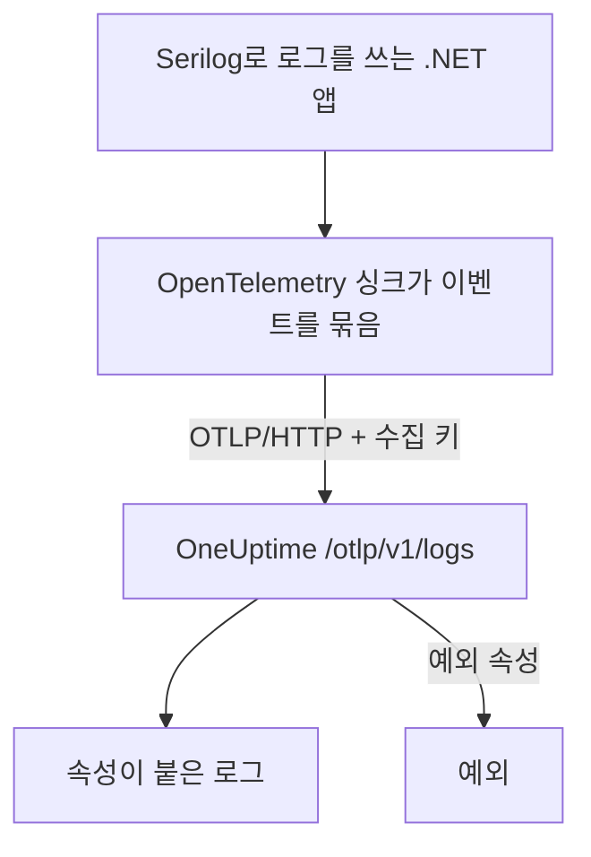

# Serilog (.NET)

[Serilog](https://serilog.net)는 .NET에서 가장 널리 쓰이는 구조화 로깅 라이브러리입니다. 공식 [`Serilog.Sinks.OpenTelemetry`](https://github.com/serilog/serilog-sinks-opentelemetry) 싱크를 쓰면 애플리케이션이 Serilog로 기록하는 모든 이벤트가 OpenTelemetry Protocol(OTLP)로 OneUptime에 전송되고, 구조화된 속성, 심각도, 트레이스 연결과 함께 **제품 → 로그**에서 검색할 수 있게 됩니다.

OneUptime 전용 패키지는 설치할 필요가 없습니다. 싱크는 OneUptime이 모든 OpenTelemetry 데이터용으로 제공하는 것과 같은 OTLP 엔드포인트와 통신합니다. 콘솔 앱, 워커 서비스, ASP.NET Core 앱 등 .NET에서 실행되는 모든 것에 사용할 수 있습니다.

:::cards
- [싱크 설정](#싱크-설정): 두 패키지를 설치하고 코드나 `appsettings.json`에서 구성합니다.
- [예외](#예외): 기록된 예외는 예외의 이슈가 됩니다.
- [문제 해결](#문제-해결): 로그가 들어오지 않을 때 확인할 사항.
:::

## 작동 방식



싱크는 로그 이벤트를 묶어서 백그라운드로 보냅니다. 이름이 있는 각 속성은 로그 속성이 되고, Serilog로 기록한 예외는 OneUptime이 이슈로 만드는 속성과 함께 도착합니다.

## 시작하기 전에

- OneUptime 프로젝트. OneUptime Cloud에서 텔레메트리는 수집된 GB당 과금되며([요금](https://oneuptime.com/pricing) 참고), Free 플랜의 프로젝트는 텔레메트리를 보내기 전에 결제 수단이 있어야 합니다.
- Serilog를 사용하거나 사용할 수 있는 .NET 애플리케이션.
- 로그를 인증하는 텔레메트리 수집 키. 아직 없다면 다음과 같이 만듭니다.

:::steps
### 수집 키 열기

**제품 → 프로젝트 설정**으로 이동해 사이드 메뉴에서 **텔레메트리 및 APM**을 열고 **수집 키**를 선택합니다.


### 키 만들기

**수집 키 생성**을 클릭합니다. 대화 상자에는 키 이름이 이미 채워져 있고 **서버**(애플리케이션이나 Collector가 데이터를 보낼 때 쓰는 키 유형)가 선택되어 있으므로, **수집 키 생성**을 클릭해 만들거나 먼저 이름을 바꿉니다.

### 시크릿 복사

새 키는 자체 페이지에서 열립니다. 키의 **시크릿 키**를 복사하세요. 이것이 아래 예시의 `YOUR_TELEMETRY_INGESTION_TOKEN`입니다.


:::

## OneUptime에서 필요한 것

| 설정 | 값 |
| ------------- | ------------------------------------------------------------ |
| OTLP 엔드포인트 | `https://oneuptime.com/otlp` |
| 인증 헤더 | `x-oneuptime-token: YOUR_TELEMETRY_INGESTION_TOKEN` |
| 서비스 이름 | 서비스가 표시될 이름(예: `my-service`) |

> [!NOTE]
> OneUptime을 자체 호스팅하나요? `https://oneuptime.com/otlp`를 `https://YOUR-ONEUPTIME-HOST/otlp`로 바꾸세요(TLS를 종료하지 않는다면 `http://...`). 나머지는 모두 같습니다.

프로토콜을 `HttpProtobuf`로 설정하면 싱크가 엔드포인트에 `/v1/logs` 경로를 붙이므로, 실제로 보내는 URL은 `https://oneuptime.com/otlp/v1/logs`입니다. 기본 `/otlp` 엔드포인트만 지정하면 됩니다.

## 싱크 설정

:::steps
### NuGet 패키지 설치

프로젝트에 Serilog와 OpenTelemetry 싱크를 추가합니다.

```bash
dotnet add package Serilog
dotnet add package Serilog.Sinks.OpenTelemetry
```

`appsettings.json`에서 싱크를 구성한다면 `Serilog.Settings.Configuration`도 추가합니다. ASP.NET Core 앱에는 Serilog를 호스트와 요청 파이프라인에 연결하는 `Serilog.AspNetCore`를 추가합니다.

```bash
dotnet add package Serilog.Settings.Configuration
dotnet add package Serilog.AspNetCore
```

### 싱크 구성

싱크가 OneUptime OTLP 엔드포인트로 보내도록 하고, 프로토콜을 `HttpProtobuf`로 설정하고, 수집 토큰을 헤더로 전달하고, 로그에 `service.name`을 붙입니다. 코드, `appsettings.json`, 또는 ASP.NET Core 호스트에서 구성할 수 있습니다.

:::tabs
@tab 코드에서
```csharp title="Program.cs"
using Serilog;
using Serilog.Sinks.OpenTelemetry;

Log.Logger = new LoggerConfiguration()
    .MinimumLevel.Information()
    .Enrich.FromLogContext()
    .WriteTo.Console() // optional: keep local logs too
    .WriteTo.OpenTelemetry(options =>
    {
        // Base OTLP endpoint. The sink appends /v1/logs automatically.
        options.Endpoint = "https://oneuptime.com/otlp";
        options.Protocol = OtlpProtocol.HttpProtobuf;

        // Authenticate with your OneUptime telemetry ingestion token.
        options.Headers = new Dictionary<string, string>
        {
            ["x-oneuptime-token"] = "YOUR_TELEMETRY_INGESTION_TOKEN"
        };

        // Identify your service in OneUptime.
        options.ResourceAttributes = new Dictionary<string, object>
        {
            ["service.name"] = "my-service",
            ["deployment.environment"] = "production"
        };
    })
    .CreateLogger();

try
{
    Log.Information("Application starting up");
    // ... your application code ...
}
finally
{
    // Flush any buffered logs before the process exits.
    Log.CloseAndFlush();
}
```
@tab appsettings.json
싱크 설정을 `appsettings.json`에 넣습니다.

```json title="appsettings.json"
{
  "Serilog": {
    "Using": ["Serilog.Sinks.OpenTelemetry"],
    "MinimumLevel": "Information",
    "WriteTo": [
      {
        "Name": "OpenTelemetry",
        "Args": {
          "endpoint": "https://oneuptime.com/otlp",
          "protocol": "HttpProtobuf",
          "headers": {
            "x-oneuptime-token": "YOUR_TELEMETRY_INGESTION_TOKEN"
          },
          "resourceAttributes": {
            "service.name": "my-service",
            "deployment.environment": "production"
          }
        }
      }
    ]
  }
}
```

그런 다음 구성에서 로거를 만듭니다.

```csharp title="Program.cs"
using Serilog;
using Microsoft.Extensions.Configuration;

IConfiguration configuration = new ConfigurationBuilder()
    .AddJsonFile("appsettings.json")
    .Build();

Log.Logger = new LoggerConfiguration()
    .ReadFrom.Configuration(configuration)
    .CreateLogger();
```
@tab ASP.NET Core
ASP.NET Core(.NET 6 이상의 최소 호스팅)에서는 `Serilog.AspNetCore`를 사용해 Serilog가 기본 로거를 대신하고 프레임워크와 요청 로그도 기록하게 합니다.

```csharp title="Program.cs"
using Serilog;
using Serilog.Sinks.OpenTelemetry;

var builder = WebApplication.CreateBuilder(args);

builder.Host.UseSerilog((context, services, configuration) =>
{
    configuration
        .ReadFrom.Configuration(context.Configuration)
        .Enrich.FromLogContext()
        .WriteTo.OpenTelemetry(options =>
        {
            options.Endpoint = "https://oneuptime.com/otlp";
            options.Protocol = OtlpProtocol.HttpProtobuf;
            options.Headers = new Dictionary<string, string>
            {
                ["x-oneuptime-token"] = "YOUR_TELEMETRY_INGESTION_TOKEN"
            };
            options.ResourceAttributes = new Dictionary<string, object>
            {
                ["service.name"] = "my-service"
            };
        });
});

var app = builder.Build();

// Logs one summary event per HTTP request.
app.UseSerilogRequestLogging();

app.MapGet("/", () => "Hello World");
app.Run();
```
:::

> [!IMPORTANT]
> 싱크는 로그 이벤트를 묶어서 비동기로 보냅니다. 애플리케이션이 종료되기 전에 항상 `Log.CloseAndFlush()`를 호출하세요(또는 로거를 해제하세요). 그러지 않으면 마지막 로그 묶음이 사라질 수 있습니다. ASP.NET Core에서는 정상 종료 시 `Serilog.AspNetCore`가 이를 대신 처리합니다.

> [!TIP]
> 토큰은 소스 관리에 넣지 마세요. 환경 변수나 시크릿 저장소에서 읽어 시작할 때 구성에 넣고, `appsettings.json`에 커밋하지 마세요.

### 로그 쓰기

Serilog를 평소처럼 사용합니다. 구조화된 속성은 그대로 유지되어 OneUptime에서 검색할 수 있는 속성이 됩니다.

```csharp
Log.Information("Order {OrderId} placed by {CustomerId} for {Amount:C}",
    orderId, customerId, amount);

Log.Warning("Payment gateway slow: {LatencyMs}ms", latencyMs);
```

이름이 있는 각 속성(`OrderId`, `CustomerId`, `Amount`, `LatencyMs`)은 로그 속성으로 전송되므로, **제품 → 로그** 탐색기에서 필터링하고 검색할 수 있습니다.

### 로그가 들어오는지 확인

애플리케이션을 실행하고 로그 이벤트를 몇 개 씁니다. 몇 초 안에 **제품 → 로그**와, **제품 → 서비스**에 있는 서비스 페이지에 나타납니다. 서비스 이름은 설정한 `service.name`(`my-service`)입니다. 구조화된 속성은 필터로 쓸 수 있습니다.
:::

## 예외

Serilog로 예외를 기록하면 싱크가 로그 레코드에 OpenTelemetry `exception.type`, `exception.message`, `exception.stacktrace` 속성을 붙입니다.

```csharp
try
{
    ProcessPayment();
}
catch (Exception ex)
{
    Log.Error(ex, "Failed to process payment for order {OrderId}", orderId);
}
```

OneUptime은 이 속성을 감지해 오류를 지문별로 **예외**의 이슈로 묶고, 올바른 서비스에 연결합니다. 트레이스와 로그가 모두 보고한 오류는 하나의 이슈로 합쳐집니다. 감지 방식은 [로그에서 찾은 예외](/docs/telemetry/open-telemetry#로그에서-찾은-예외)를 참고하세요.

## 트레이스 연결

애플리케이션이 트레이스용 OpenTelemetry .NET SDK로도 계측되어 있다면, 활성 스팬 안에서 생긴 Serilog 이벤트에는 현재 `TraceId`와 `SpanId`가 자동으로 붙습니다(싱크의 기본 `IncludedData`에 포함). 덕분에 OneUptime은 로그 줄을 그 로그가 생긴 트레이스에 바로 연결하고, 로그에서 주변 요청으로, 다시 로그로 오갈 수 있습니다.

트레이스와 메트릭도 보내려면 [OpenTelemetry 빠른 시작](/docs/telemetry/open-telemetry#빠른-시작)의 .NET 설정을 참고하세요.

## 문제 해결

:::details 로그가 나타나지 않음
`x-oneuptime-token` 값을 다시 확인하고, 보고 있는 프로젝트의 키인지 확인하세요. 엔드포인트가 `https://oneuptime.com/otlp`인지 확인합니다(기본 경로만 쓰고 `/v1/logs`는 직접 붙이지 마세요). 싱크가 실패하는 이유를 보려면 시작할 때 `Serilog.Debugging.SelfLog.Enable(Console.Error)`로 Serilog 자체 오류 출력을 켜세요. OneUptime이 응답한 상태 코드가 출력됩니다.
:::

:::details 앱이 종료될 때만 로그가 나타나거나 마지막 로그가 빠짐
종료 시 `Log.CloseAndFlush()`가 실행되도록 하세요. 싱크는 이벤트를 묶어서 보내므로, 플러시하지 않고 프로세스가 강제로 종료되면 버퍼에 있던 로그가 사라집니다.
:::

:::details 401 Unauthorized가 나고 아무것도 수집되지 않음
키가 없거나, 알 수 없거나, 만료되었습니다. 헤더 이름이 정확히 `x-oneuptime-token`이고 값이 키의 **시크릿 키**인지 확인하세요.
:::

:::details 402 또는 422가 나고 아무것도 수집되지 않음
`402`: OneUptime Cloud에서 프로젝트가 Free 플랜이고 결제 수단이 없습니다. **프로젝트 설정 → 결제 및 청구서 → 결제**에서 추가하세요. `422`: 키가 비활성화되었거나 브라우저 키입니다. 키 설정에서 **활성화됨**을 다시 켜거나 **서버** 키를 만드세요.
:::

:::details 로그가 잘못된 서비스 이름으로 들어옴
`ResourceAttributes`(코드) 또는 `resourceAttributes`(appsettings.json)에 `service.name`을 설정하세요. 설정하지 않으면 로그가 서비스 이름이 아니라 싱크가 대신 보내는 임시 이름으로 저장됩니다.
:::

:::details 자체 호스팅 인스턴스로 연결 오류가 남
프로토콜이 엔드포인트의 스킴(`https://` 또는 `http://`)과 맞는지, 그리고 애플리케이션에서 OneUptime 호스트에 닿을 수 있는지 확인하세요.
:::

질문이 있거나 도움이 필요하면 support@oneuptime.com으로 문의하세요.

## 다음 단계

:::cards
- [OpenTelemetry](/docs/telemetry/open-telemetry): .NET에서 트레이스와 메트릭도 보냅니다.
- [로그 파이프라인](/docs/telemetry/log-pipelines): 들어오는 로그를 파싱하고 보강합니다.
- [로그 모니터](/docs/monitor/logs-monitor): 일치하는 로그가 나타나면 알립니다.
- [검색 구문](/docs/telemetry/search-syntax): Serilog 속성으로 필터링합니다.
:::
