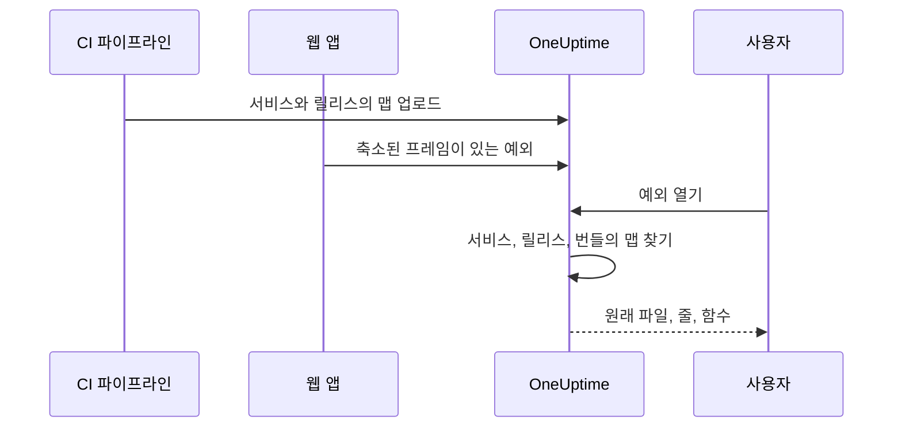

# 소스 맵

프런트엔드 빌드의 소스 맵을 OneUptime에 업로드하면, **예외** 에 표시되는 브라우저 예외가 축소된 이름 대신 원래 파일 이름, 줄, 함수로 표시됩니다. 이 페이지는 이미 브라우저 텔레메트리를 OneUptime으로 보내고 있는 프런트엔드 개발자를 위한 것입니다.

:::cards
- [매칭 방식](#매칭-방식): 서비스 이름, 릴리스, 번들 파일.
- [소스 맵 업로드하기](#소스-맵-업로드하기): CI에서 `curl` 요청 한 번.
- [한도](#한도): 크기, 개수, 자체 호스팅 설정.
- [해석된 스택 트레이스 보기](#해석된-스택-트레이스-보기): 해석된 프레임의 모습.
:::

## 개요

프로덕션 프런트엔드 번들은 축소 (minify) 되어 있으므로, OpenTelemetry 웹 SDK로 캡처한 브라우저 예외는 다음과 같은 스택 프레임으로 도착합니다.

```text
TypeError: Cannot read properties of undefined (reading 'id')
    at e.onSelect (https://app.example.com/assets/main.a8f1b2.js:1:48291)
```

빌드의 소스 맵을 OneUptime에 업로드하면 예외 대시보드가 그 프레임을 원래 파일, 줄, 함수 이름으로 되돌려 해석합니다. 맵이 `sourcesContent` 와 함께 빌드되었다면 원래 소스의 주변 줄도 보여 줍니다.

맵은 인증된 API를 통해 OneUptime에 업로드되며 **사이트에서 가져오는 일은 없습니다**. 따라서 계속 `hidden-source-map` (webpack) 이나 `sourcemap: 'hidden'` (Vite / Rollup) 으로 빌드하고 `.map` 파일을 번들 옆에 공개하지 않을 수 있으며, 그렇게 해야 합니다.



## 매칭 방식

소스 맵은 세 가지 키로 저장됩니다.

| 키 | 일치해야 하는 대상 |
|---|---|
| 서비스 이름 | 웹 앱이 텔레메트리를 보낼 때 쓰는 OpenTelemetry 리소스 속성 `service.name` |
| 서비스 버전 | 리소스 속성 `service.version` (릴리스 식별자) |
| 번들 경로 | 맵이 생성된 축소 파일. 예: `main.a8f1b2.js` |

예외를 열면 OneUptime은 그 예외의 서비스와 릴리스에 업로드된 맵을 찾고, 각 스택 프레임을 파일 이름으로 번들에 매칭한 다음 (경로의 끝부분만 같아도 됩니다. `main.a8f1b2.js` 는 `https://app.example.com/assets/main.a8f1b2.js` 와 일치합니다), 축소된 줄과 열을 맵으로 해석합니다. 해석은 예외를 볼 때 지연 방식으로 이루어지며 수집 경로에서는 절대 일어나지 않습니다. 따라서 새 릴리스의 첫 오류가 나고 몇 분 *뒤에* 업로드한 맵도 소급해서 적용됩니다.

## 시작하기 전에

- **서버** 텔레메트리 수집 키. **프로젝트 설정 → 텔레메트리 및 APM → 수집 키** 에서 만듭니다. [수집 키 만들기](/docs/telemetry/open-telemetry#수집-키-만들기) 를 참고하세요.
- OpenTelemetry 웹 SDK로 이미 OneUptime에 예외를 보내고 있는 웹 앱. [브라우저 설정](/docs/rum/browser-setup) 을 참고하세요.
- 소스 맵을 출력하는 빌드. 각 프레임 주변의 소스 코드 조각을 보고 싶다면 `sourcesContent` 를 포함하세요 (대부분의 번들러의 기본값입니다).

## 소스 맵 업로드하기

:::steps
### 텔레메트리와 함께 `service.version` 보내기

웹 앱은 `service.version` 을 보내야 하며, 그 값은 맵을 업로드할 때 쓰는 문자열과 같아야 합니다.

```javascript
import { resourceFromAttributes } from "@opentelemetry/resources";

const resource = resourceFromAttributes({
  "service.name": "my-web-app",
  "service.version": "1.4.2", // same value you upload maps with
});
```

업로드하는 `serviceVersion` 과 리소스 속성 `service.version` 이 같은 문자열이기만 하면, 안정적인 릴리스 식별자라면 무엇이든 됩니다 (시맨틱 버전, git 커밋 SHA, 빌드 번호 등).

### 프로덕션 빌드마다 맵 업로드하기

CI에서 수집 키를 `x-oneuptime-token` 헤더에 넣어 업로드하세요.

```bash
curl --fail -X POST "https://oneuptime.com/source-maps/v1/upload" \
  -H "x-oneuptime-token: YOUR_TELEMETRY_INGESTION_KEY" \
  -F "serviceName=my-web-app" \
  -F "serviceVersion=1.4.2" \
  -F "sourcemap=@dist/assets/main.a8f1b2.js.map" \
  -F "sourcemap=@dist/assets/vendor.9c3d4e.js.map"
```

자체 호스팅 설치라면 `oneuptime.com` 을 자체 OneUptime 호스트로 바꾸세요. `x-oneuptime-token` 헤더 대신 `Authorization: Bearer YOUR_KEY` 도 받습니다.

### 업로드 확인하기

업로드에 성공하면 저장된 맵 목록이 담긴 JSON 본문이 반환되므로, CI에서 이를 검증할 수 있습니다. 맵은 OneUptime에서 서비스의 **Source Maps** 페이지에도 나열됩니다.
:::

일반적인 CI 단계는 빌드가 출력한 모든 맵을 업로드합니다.

```bash
VERSION="$(git rev-parse --short HEAD)"

find dist -name "*.js.map" -print0 | while IFS= read -r -d '' map; do
  curl --fail -X POST "https://oneuptime.com/source-maps/v1/upload" \
    -H "x-oneuptime-token: $ONEUPTIME_INGESTION_KEY" \
    -F "serviceName=my-web-app" \
    -F "serviceVersion=$VERSION" \
    -F "sourcemap=@$map"
done
```

### 업로드 규칙

- 업로드한 각 파일의 번들 경로는 파일 이름에서 끝의 `.map` 을 뗀 것입니다. `main.a8f1b2.js.map` 은 `main.a8f1b2.js` 가 됩니다. 맵 파일 이름이 이 규칙을 따르지 않는다면 요청마다 파일 하나씩 업로드하고 `bundlePath` 필드를 명시적으로 전달하세요.
- 같은 서비스와 버전으로 같은 번들을 다시 업로드하면 이전 맵을 대체하므로, CI 재시도는 안전합니다.
- 파일은 [source map v3](https://tc39.es/ecma426/) JSON이어야 합니다 (모든 최신 번들러가 출력하는 형식이며, `sections` 가 있는 인덱스 맵도 지원합니다).
- 자체 호스팅 운영자가 텔레메트리 수집을 비활성화했다면 (`DISABLE_TELEMETRY_INGESTION`), 업로드는 빈 성공 응답을 반환하고 아무것도 저장하지 않습니다. 이 모드에서는 모든 텔레메트리 수집 엔드포인트가 이렇게 동작합니다. 실제 업로드는 항상 저장된 맵 목록이 담긴 JSON 본문을 반환하므로, CI에서 둘을 구별할 수 있습니다.

## 한도

`.map` 파일 하나는 최대 50 MB까지 가능하지만, 인그레스는 **요청 본문 전체** 도 50 MB로 제한합니다. 따라서 큰 맵은 요청마다 하나씩 업로드하세요. 요청 하나에 최대 50개 파일을 받으며, 릴리스 하나 (서비스 + 버전) 에는 모두 합쳐 최대 1,000개의 맵을 저장할 수 있습니다. 이를 넘는 업로드는 한도를 알려 주는 메시지와 함께 거부됩니다. 요청 하나가 받는 것보다 많은 맵을 출력하는 빌드는 그냥 요청을 여러 번 보내면 됩니다. 같은 릴리스에 대한 업로드는 누적됩니다.

자체 호스팅 설치에서는 이 값을 바꿀 수 있습니다. 다섯 가지 모두 일반 환경 변수이며, Helm 차트는 `values.yaml` 의 `sourceMaps` 아래에서 설정할 수 있습니다.

| `values.yaml` | 환경 변수 | 기본값 |
| --- | --- | --- |
| `sourceMaps.maxMapsPerRelease` | `SOURCE_MAP_MAX_MAPS_PER_RELEASE` | `1000` |
| `sourceMaps.maxFilesPerRequest` | `SOURCE_MAP_MAX_FILES_PER_REQUEST` | `50` |
| `sourceMaps.maxFileSizeBytes` | `SOURCE_MAP_MAX_FILE_SIZE_BYTES` | `52428800` |
| `sourceMaps.maxBytesPerResolve` | `SOURCE_MAP_MAX_BYTES_PER_RESOLVE` | `536870912` |
| `sourceMaps.retentionDays` | `SOURCE_MAP_RETENTION_DAYS` | `90` |

빌드가 기본값을 넘어서면 올릴 값은 `maxMapsPerRelease` 입니다. 이 값은 저장 형태에 대한 한도일 뿐입니다. 해석의 부담을 제한하는 것은 릴리스에 맵이 몇 개 있는지가 아니라 `maxBytesPerResolve` 이기 때문입니다. `maxFilesPerRequest` 와 `maxFileSizeBytes` 는 **낮추는** 것만 가능합니다. multipart 본문은 요청이 인증되기 전에 파싱되므로, 인증되지 않은 호출자에게는 그 위의 공통 상한이 적용되며, 더 큰 값은 적용되지 않고 상한으로 좁혀집니다.

## 해석된 스택 트레이스 보기

대시보드의 **예외** 에서 아무 예외나 여세요. 소스 맵으로 해석된 프레임에는 **Source mapped** 배지가 붙고 원래 함수 이름과 파일 위치가 표시됩니다. 프레임을 펼치면 축소된 위치와 함께 원래 소스 코드 조각 (맵에 `sourcesContent` 가 있을 때) 이 표시됩니다.

서비스에 업로드된 맵은 **제품 → 서비스 → 해당 서비스 → Source Maps** 에서 확인하고 삭제할 수 있으며, 이 페이지에는 각 맵의 릴리스, 번들, 크기, 업로드 시각이 나열됩니다.

## 보존

소스 맵은 업로드 후 90일 동안 보관된 뒤 자동으로 삭제됩니다. 맵은 그 릴리스의 예외가 텔레메트리 보존 기간 안에 있는 동안에만 쓸모가 있으므로, 이 기간은 맵이 읽기 쉽게 만드는 예외보다 충분히 깁니다. 다시 필요하면 해당 릴리스의 맵을 다시 업로드하세요.

## 보안

- 맵은 인증된 엔드포인트를 통해 업로드되어 OneUptime 프로젝트에 저장됩니다. 웹사이트에서 가져오는 일이 없으므로 숨긴 소스 맵은 계속 숨겨진 상태로 남습니다.
- 맵의 원본 내용 (`sourcesContent` 와 함께 빌드했다면 원래 소스 코드를 포함합니다) 은 프로젝트 소유자와 관리자, 그리고 **Read Telemetry Source Map** 권한을 받은 사용자만 읽을 수 있습니다. 다른 팀 구성원에게는 이미 접근할 수 있는 예외에 대해 해석된 프레임과 각 충돌 위치 주변의 몇 줄만 표시됩니다.
- 서비스를 삭제하면 그 소스 맵도 삭제됩니다.

## 문제 해결

:::details 프레임이 여전히 축소되어 있음
예외의 릴리스에 일치하는 맵이 없습니다. 앱이 보내는 `service.version` 이 업로드할 때 쓴 `serviceVersion` 과 정확히 같은지, `serviceName` 이 `service.name` 과 일치하는지, 그 번들 파일의 맵이 업로드되었는지 확인하세요. 서비스의 **Source Maps** 페이지에 모든 맵의 릴리스와 번들이 나열됩니다.
:::

:::details 맵이 너무 커서 업로드가 거부됨
맵 하나는 최대 50 MB이며, 요청 전체도 마찬가지입니다. 위의 CI 반복문처럼 큰 맵은 요청마다 하나씩 업로드하세요.
:::

## 다음 단계

:::cards
- [브라우저 설정](/docs/rum/browser-setup): OpenTelemetry 웹 SDK로 브라우저 트레이스와 예외를 보냅니다.
- [예외 모니터](/docs/monitor/exceptions-monitor): 새 예외가 나타나면 알림을 보냅니다.
- [OpenTelemetry](/docs/telemetry/open-telemetry): 모든 텔레메트리의 엔드포인트, 키, 한도.
:::
