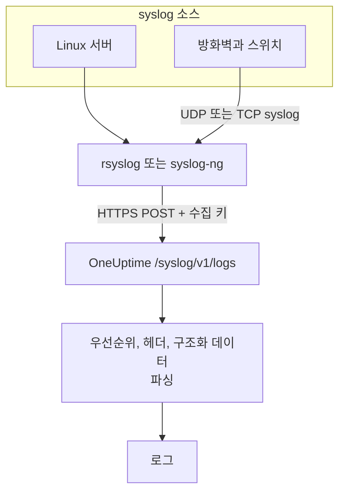

# Syslog

OneUptime은 HTTPS로 syslog를 받습니다. RFC 5424 또는 RFC 3164 메시지를 수집 키와 함께 `/syslog/v1/logs`로 보내면, 각 메시지가 검색 가능한 로그가 되고 우선순위, facility, 심각도, 호스트, 애플리케이션, 구조화 데이터가 속성이 됩니다. rsyslog, syslog-ng, 또는 HTTP 요청을 보낼 수 있는 모든 릴레이에서 전달할 때 쓰세요.

:::cards
- [테스트 메시지 보내기](#테스트-메시지-보내기): `curl` 요청 하나면 됩니다.
- [rsyslog에서 전달하기](#rsyslog에서-전달하기): 서버나 릴레이가 받는 모든 것을 보냅니다.
- [파싱된 속성](#파싱된-속성): OneUptime이 각 메시지에서 추출하는 것.
- [문제 해결](#문제-해결): 거부된 요청과 예상하지 못한 서비스.
:::

## 작동 방식



OneUptime은 요청에서 메시지를 읽자마자 응답하고, 잠시 뒤에 파싱해 저장합니다. 메시지 텍스트는 로그 본문에 남고, 나머지는 모두 속성이 됩니다.

> [!TIP]
> OneUptime 프로브로 모니터링하는 네트워크 장비는 릴레이 없이 UDP로 syslog를 프로브에 바로 보낼 수 있습니다. 그러면 로그가 OneUptime의 해당 장비에 나타납니다. [네트워크 공급업체별 가이드(Sophos, Extreme, Cambium)](/docs/monitor/network-vendor-guides)를 참고하세요.

## 시작하기 전에

- **OneUptime 프로젝트**: OneUptime Cloud에서 텔레메트리는 수집된 GB당 과금되며, Free 플랜의 프로젝트는 텔레메트리를 보내기 전에 결제 수단이 있어야 합니다.
- **텔레메트리 수집 키**: **제품 → 프로젝트 설정 → 텔레메트리 및 APM → 수집 키**에서 **서버** 키를 만들고 키의 **시크릿 키**를 복사합니다. 이 키를 `x-oneuptime-token` 헤더로 보냅니다.
- **syslog 전달 도구**: HTTP POST 요청을 보낼 수 있는 도구라면 무엇이든 됩니다(예: `curl`, `omhttp`를 쓰는 `rsyslog`, HTTP 대상을 쓰는 `syslog-ng`).
- **서비스 이름(선택)**: `x-oneuptime-service-name` 헤더를 설정하면 들어오는 로그를 특정 텔레메트리 서비스로 묶을 수 있습니다. 생략하면 OneUptime은 syslog `APP-NAME`, 호스트 이름, `Syslog` 순으로 사용합니다.

## 엔드포인트

```http
POST https://oneuptime.com/syslog/v1/logs
```

| 헤더 | 필수 | 값 |
| --- | --- | --- |
| `x-oneuptime-token` | 예 | 수집 키. |
| `Content-Type` | JSON 본문이면 예 | `application/json` |
| `x-oneuptime-service-name` | 아니요 | 로그가 속한 서비스. |
| `Content-Encoding` | 아니요 | 압축한 본문이면 `gzip`. |

OneUptime을 자체 호스팅한다면 `oneuptime.com`을 자신의 호스트로 바꾸세요.

## 요청 본문

`messages` 배열이 있는 JSON 페이로드를 보냅니다. RFC 5424와 RFC 3164(BSD) 형식을 모두 지원하며, 한 요청에 섞어 보낼 수 있습니다.

```json
{
  "messages": [
    "<34>1 2025-03-02T14:48:05.003Z web-01 nginx 7421 ID47 [env@32473 host=\"web-01\"] 502 on /api/login",
    "<13>Feb  5 17:32:18 db-01 postgres[2419]: connection received from 10.0.0.12"
  ]
}
```

### 지원하는 본문 형식

| 본문 | 보내는 방법 |
| --- | --- |
| `messages` 배열이 있는 JSON 객체 | `Content-Type: application/json`, 권장. |
| 메시지의 JSON 배열 | `Content-Type: application/json`. |
| `message` 하나가 있는 JSON 객체 | `Content-Type: application/json`. 여러 줄인 값은 여러 메시지로 읽습니다. |
| 줄바꿈으로 구분한 메시지 | gzip으로 압축하고 `Content-Encoding: gzip`과 함께 보냅니다. |

gzip으로 압축하지 않은 일반 텍스트 본문은 읽지 않으며, 요청은 `400`으로 거부됩니다. gzip으로 압축한 본문은 항상 줄바꿈으로 구분한 메시지로 읽으므로 JSON 본문은 압축하지 마세요. 각 요청은 1MB 미만으로 유지하세요. OneUptime의 인그레스는 이 엔드포인트에 대해 nginx의 기본 요청 본문 한도를 높이지 않습니다.

## 테스트 메시지 보내기

```bash
curl \
  -X POST https://oneuptime.com/syslog/v1/logs \
  -H "Content-Type: application/json" \
  -H "x-oneuptime-token: YOUR_TELEMETRY_KEY" \
  -H "x-oneuptime-service-name: production-web" \
  -d '{
    "messages": [
      "<34>1 2025-03-02T14:48:05.003Z web-01 nginx 7421 ID47 [env@32473 host=\"web-01\"] 502 on /api/login"
    ]
  }'
```

`200`이 오면 메시지가 받아들여진 것입니다. **제품 → 로그**를 열면 로그가 `production-web` 서비스에 본문 `502 on /api/login`, 심각도 `Error`, 그리고 [파싱된 속성](#파싱된-속성)의 속성과 함께 나타납니다.

## rsyslog에서 전달하기

rsyslog는 HTTP 출력 모듈인 `omhttp`로 OneUptime에 보냅니다.

:::steps
### `omhttp`를 쓸 수 있는지 확인

아래 구성은 `module(load="omhttp")`로 이 모듈을 불러옵니다. rsyslog가 모듈을 불러올 수 없다고 하면, 사용하는 배포판에서 `omhttp`를 제공하는 패키지를 설치하세요.

### OneUptime 대상 추가

`/etc/rsyslog.d/oneuptime.conf`를 만듭니다. 템플릿은 각 메시지를 RFC 5424 줄로 다시 만들어 OneUptime이 기대하는 JSON 본문으로 감쌉니다.

```text title="/etc/rsyslog.d/oneuptime.conf"
module(load="omhttp")

template(name="OneUptimeJson" type="string"
         string="{\"messages\":[\"<%PRI%>1 %TIMESTAMP:::date-rfc3339% %HOSTNAME% %APP-NAME% %PROCID% %MSGID% - %msg:::json%\"]}")

action(
  type="omhttp"
  server="oneuptime.com"
  serverport="443"
  usehttps="on"
  restpath="syslog/v1/logs"
  httpheaders=[
    "x-oneuptime-token: YOUR_TELEMETRY_KEY",
    "x-oneuptime-service-name: rsyslog-demo"
  ]
  template="OneUptimeJson"
)
```

`restpath`에는 앞의 슬래시 없이 경로를 적습니다. `omhttp`는 기본으로 JSON `Content-Type`을 보내며, 이 템플릿이 만드는 것도 바로 그 형식입니다.

### 구성을 확인하고 rsyslog 다시 시작

```bash
sudo rsyslogd -N1
sudo systemctl restart rsyslog
```

`rsyslogd -N1`은 rsyslog를 시작하지 않고 구성을 검증합니다. 다시 시작하면 새 메시지가 **제품 → 로그**의 `rsyslog-demo` 서비스에 나타납니다.
:::

이 액션은 rsyslog가 처리하는 모든 메시지를 전달합니다. 로컬 프로그램, rsyslog가 읽는 경우의 systemd 저널, 그리고 네트워크에서 받는 모든 것입니다.

### 네트워크 장비의 syslog 중계

방화벽, 스위치 같은 장비는 syslog를 UDP나 TCP로만 보내는 경우가 많습니다. 이런 장비가 rsyslog 릴레이로 보내게 하고, 릴레이가 HTTPS로 전달하게 하세요. 릴레이 구성에서 `action` 앞에 리스너를 추가합니다.

```text title="/etc/rsyslog.d/oneuptime.conf"
module(load="imudp")
input(type="imudp" port="514")
```

`x-oneuptime-service-name`을 `perimeter-firewall` 같은 이름으로 설정하거나, 헤더를 빼서 장비별 로그가 호스트 이름으로 묶이게 하세요. 많은 장비가 메시지를 `key=value` 쌍으로 씁니다. [Key=Value Parser](/docs/telemetry/log-pipelines#keyvalue-parser)를 쓰면 이를 속성으로 바꿀 수 있습니다.

:::details 메시지마다 요청하지 않고 묶어서 보내기
rsyslog는 메시지를 묶어 gzip으로 압축할 수 있고, OneUptime은 이를 줄바꿈으로 구분한 메시지로 읽습니다. 템플릿과 액션을 다음으로 바꿉니다.

```text title="/etc/rsyslog.d/oneuptime.conf"
template(name="OneUptimeLine" type="string"
         string="<%PRI%>1 %TIMESTAMP:::date-rfc3339% %HOSTNAME% %APP-NAME% %PROCID% %MSGID% - %msg%")

action(
  type="omhttp"
  server="oneuptime.com"
  serverport="443"
  usehttps="on"
  restpath="syslog/v1/logs"
  httpheaders=["x-oneuptime-token: YOUR_TELEMETRY_KEY"]
  template="OneUptimeLine"
  batch="on"
  batch.format="newline"
  compress="on"
)
```

`compress="on"`은 그대로 두세요. OneUptime은 gzip으로 압축한 본문에서만 줄바꿈으로 구분한 메시지를 읽습니다.
:::

### 다른 전달 도구

- **syslog-ng**: 같은 URL, 같은 헤더, 같은 JSON 본문으로 HTTP 대상을 사용합니다.
- **Fluent Bit**: Fluent Bit의 `syslog` 입력으로 syslog를 받아 다른 로그처럼 전달합니다. [Fluent Bit](/docs/telemetry/fluentbit)를 참고하세요.

## 파싱된 속성

OneUptime은 각 로그 항목에 다음 속성을 자동으로 추가합니다.

| 속성 | 값 | 테스트 메시지의 경우 |
| --- | --- | --- |
| `syslog.priority` | 우선순위, `<PRI>` | `34` |
| `syslog.facility.code`, `syslog.facility.name` | 우선순위에서 구한 facility | `4`, `security` |
| `syslog.severity.code`, `syslog.severity.name` | 우선순위에서 구한 심각도 | `2`, `critical` |
| `syslog.version` | RFC 5424 버전 | `1` |
| `syslog.hostname` | `HOSTNAME` | `web-01` |
| `syslog.appName` | `APP-NAME` 또는 RFC 3164 태그 | `nginx` |
| `syslog.processId` | `PROCID` | `7421` |
| `syslog.messageId` | `MSGID` | `ID47` |
| `syslog.structured.raw` | 보낸 그대로의 RFC 5424 구조화 데이터 | `[env@32473 host="web-01"]` |
| `syslog.structured.*` | 구조화 데이터의 각 매개변수를 펼친 것 | `syslog.structured.env_32473.host` = `web-01` |
| `syslog.raw` | 추적을 위한 원래 메시지 | 줄 전체 |

이 속성들은 **제품 → 로그** 탐색기에서 검색할 수 있습니다. 예를 들어 `@syslog.severity.name:error`나 `@syslog.hostname:web-01`입니다. [검색 구문](/docs/telemetry/search-syntax)을 참고하세요.

메시지 자체는 로그 본문에 남습니다. Sophos XGS나 Fortinet FortiGate 같은 방화벽은 메시지를 `key=value` 쌍(`log_component="IPSec" con_name="HQ-Branch1" status="Terminated"`)으로 씁니다. [로그 파이프라인](/docs/telemetry/log-pipelines#keyvalue-parser)에 **Key=Value Parser** 프로세서를 추가하면 이 쌍도 속성으로 바뀝니다.

### 심각도

| syslog 심각도 | 코드 | OneUptime 심각도 |
| --- | --- | --- |
| Emergency, Alert | `0`, `1` | `Fatal` |
| Critical, Error | `2`, `3` | `Error` |
| Warning | `4` | `Warning` |
| Notice, Informational | `5`, `6` | `Information` |
| Debug | `7` | `Debug` |
| 메시지에 우선순위가 없음 | — | `Unspecified` |

타임스탬프가 없는 메시지는 OneUptime이 받은 시간으로 저장됩니다.

### 서비스

각 로그는 텔레메트리 서비스 아래에 저장되며, 그 서비스는 처음 보낼 때 OneUptime이 만듭니다. 서비스는 다음 중 처음 있는 것입니다.

1. `x-oneuptime-service-name` 헤더
2. 메시지의 `APP-NAME`(또는 태그)
3. 메시지의 호스트 이름
4. `Syslog`

## 문제 해결

:::details HTTP 401
키가 없거나, 알 수 없거나, 만료되었습니다. `x-oneuptime-token` 헤더에 로그를 받을 프로젝트의 수집 키 **시크릿 키**가 들어 있는지 확인하세요.
:::

:::details HTTP 402 또는 422
`402`: OneUptime Cloud에서 프로젝트가 Free 플랜이고 결제 수단이 없습니다. **프로젝트 설정 → 결제 및 청구서 → 결제**에서 추가하세요. `422`: 키가 비활성화되었거나 브라우저 키입니다. 키 설정에서 **활성화됨**을 다시 켜거나 **서버** 키를 만드세요.
:::

:::details HTTP 400이 나거나 로그가 나타나지 않음
요청 본문에 실제로 syslog 줄이 `Content-Type: application/json`의 JSON으로 들어 있는지 확인하세요. 빈 본문과, gzip으로 압축하지 않은 일반 텍스트 본문은 HTTP 400으로 거부됩니다.
:::

:::details HTTP 413
요청이 인그레스가 받는 크기보다 큽니다. 요청 하나에 넣는 메시지 수를 줄이세요.
:::

:::details 로그가 예상하지 못한 서비스 이름으로 들어옴
`x-oneuptime-service-name`을 설정해 `APP-NAME`, 그다음 호스트 이름을 쓰는 기본 판별을 덮어쓰세요.
:::

## 다음 단계

:::cards
- [로그 파이프라인](/docs/telemetry/log-pipelines): `key=value` 메시지를 속성으로 파싱합니다.
- [로그 기록 규칙](/docs/telemetry/log-recording-rules): syslog의 숫자를 메트릭으로 바꿉니다.
- [로그 모니터](/docs/monitor/logs-monitor): 일치하는 syslog 메시지가 들어오면 알립니다.
:::
