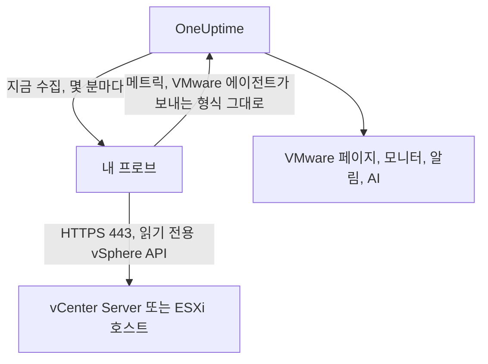

# 에이전트 없는 VMware

아무것도 설치하지 않고 vCenter Server 또는 독립 실행형 ESXi 호스트를 모니터링하세요. OneUptime에 vCenter의 주소와 읽기 전용 계정을 입력하고 vCenter에 접근할 수 있는 프로브를 선택하면, 그 프로브가 [VMware 에이전트](/docs/telemetry/vmware)와 동일한 데이터를 수집합니다. 설치하거나 업그레이드하거나 계속 실행해 둘 에이전트도, 따로 준비할 머신도 없습니다.

:::cards
- [시작하기 전에](#시작하기-전에): vCenter에 접근할 수 있는 프로브와 읽기 전용 계정.
- [vCenter 연결하기](#vcenter-연결하기): 필드 네 개, 테스트 한 번, 이름.
- [문제 해결](#문제-해결): 각 메시지의 의미와 해결 방법.
:::

## 작동 방식

프로브는 몇 분마다 저장된 계정으로 vCenter에 로그인하여 인벤토리, 성능 카운터, vSAN 통계를 읽고 OneUptime으로 보냅니다. 데이터는 VMware 에이전트가 보내는 것과 똑같이 도착하므로, 모든 VMware 페이지, [VMware 모니터](/docs/monitor/vmware-monitor), 알림 템플릿, OneUptime AI가 같은 방식으로 읽습니다. 프로브는 수집 사이에도 vCenter 세션을 유지하므로 vCenter의 이벤트 로그가 로그인 기록으로 가득 차지 않습니다.

## 프로브와 에이전트 비교

| | 프로브(이 페이지) | VMware 에이전트 |
|---|---|---|
| 실행하는 것 | 이미 실행 중인 프로브 또는 새 프로브 | 전용 머신에서 실행하는 에이전트 |
| 계정 보관 위치 | OneUptime에 암호화되어 저장, 프로브에만 전송 | 에이전트의 `.env` 파일 |
| 접근해야 하는 대상 | 프로브에서 TCP 443으로 vCenter | 에이전트에서 TCP 443으로 vCenter |
| 가장 큰 vCenter | 수집 한 번에 약 48 MiB의 메트릭 | 제한 없음 |
| ESXi syslog와 AI 에이전트 | 포함되지 않음 | 포함됨 |

둘 다 같은 데이터를 보냅니다. vCenter의 **설정** 페이지에서 언제든지 한쪽에서 다른 쪽으로 전환할 수 있습니다.

## 시작하기 전에

- **TCP 443으로 vCenter에 접근할 수 있는 프로브.** 보통 vCenter 네트워크에 있는 [사용자 지정 프로브](/docs/probe/custom-probe)입니다. OneUptime Cloud에서는 공유 프로브가 vCenter 비밀번호를 받지 않으므로 자체 프로브를 추가하세요. 자체 호스팅 인스턴스에서는 인스턴스 자체의 프로브도 수집할 수 있습니다.
- **Read-Only 역할이 있는 vSphere 사용자.** 최상위 vCenter 개체에서 역할을 부여하고 **Propagate to children**을 선택합니다. [읽기 전용 vSphere 사용자 만들기](/docs/telemetry/vmware#create-the-read-only-vsphere-user)를 따르세요. 에이전트가 사용하는 것과 같은 계정입니다.

> [!IMPORTANT]
> **Propagate to children**이 없으면 사용자는 로그인은 되지만 아무것도 볼 수 없고, 프로브는 계정이 vCenter의 인벤토리를 읽을 수 없다고 보고합니다.

## vCenter 연결하기

:::steps
### vCenter 목록 열기
OneUptime에서 **VMware → 모든 vCenter**를 열고 **vCenter 연결**을 클릭합니다.

### 주소와 계정 입력하기
vSphere Client를 여는 주소(예: `https://vcsa.example.com`), 도메인을 포함한 사용자 이름(예: `oneuptime@vsphere.local`), 비밀번호를 입력합니다. vCenter에 접근할 수 있는 프로브를 선택합니다.

### 연결 테스트하기
다음 단계에서 **연결 테스트**를 클릭합니다. 프로브가 로그인하여 계정이 볼 수 있는 항목을 읽고 로그아웃하며, 결과에는 찾은 데이터센터, 클러스터, 호스트, 가상 머신, 데이터스토어의 수가 표시됩니다.

### vCenter의 인증서 신뢰하기
vCenter는 기본적으로 자체 기관의 인증서를 사용하며, 프로브는 이를 신뢰하지 않습니다. 그러면 테스트 결과에 인증서가 표시됩니다. 지문을 vCenter 자체의 지문과 비교한 다음 **이 인증서 신뢰**를 클릭합니다.

### 이름을 정하고 연결하기
이름의 기본값은 vCenter의 호스트 이름입니다. **vCenter 연결**을 클릭하여 저장합니다.
:::

vCenter의 **개요**에 **데이터 수집** 카드가 표시됩니다. 1분 안에 시작되는 첫 수집 전까지는 **확인 중**, 그다음에는 **수집 중**으로 표시되고 인벤토리가 채워집니다.

## 인증서

프로브는 인증서 검증을 절대 건너뛰지 않습니다. 모든 연결은 완전한 TLS 핸드셰이크를 거친 다음 다음과 같이 처리됩니다.

- 신뢰할 인증서가 지정되지 않은 경우, vCenter의 인증서는 프로브 머신이 신뢰하는 기관이 입력한 주소에 대해 발급한 것이어야 합니다.
- 신뢰할 인증서가 지정된 경우, vCenter는 SHA-256 지문으로 식별되는 바로 그 인증서를 제시해야 합니다. 공개적으로 신뢰되는 인증서라도 그 밖의 인증서는 받아들이지 않습니다.

지문을 확인하려면 vSphere Client에서 **Administration → Certificates → Certificate Management**를 열거나, 프로브 머신에서 `openssl s_client -connect vcsa.example.com:443 </dev/null | openssl x509 -noout -fingerprint -sha256`을 실행하세요.

vCenter의 인증서가 갱신되면 수집이 **vCenter의 인증서가 변경되었습니다**와 함께 중지되고 새 인증서가 표시됩니다. vCenter의 **개요** 또는 **설정** 페이지에서 새 인증서를 신뢰하기 전까지는 vCenter로 아무것도 전송되지 않습니다.

## 저장된 비밀번호

비밀번호는 암호화되며 쓰기 전용입니다. 누구도 다시 읽을 수 없고 API도 반환하지 않습니다. 비밀번호는 vCenter를 수집하는 프로브에만 전송되며, 프로브는 이를 메모리에 보관합니다.

저장된 비밀번호는 입력할 때의 주소로, 그때의 프로브를 거쳐, 그때의 인증서에 대해서만 전송됩니다. 주소, 프로브 또는 신뢰할 인증서를 변경하면 비밀번호를 다시 입력해야 하므로, vCenter를 편집할 수 있는 사람이라도 비밀번호를 다른 곳으로 보낼 수 없습니다. 저장된 주소에서 프로브가 찾은 인증서를 신뢰하는 경우에는 비밀번호가 유지됩니다.

## 에이전트와 프로브 간 전환

vCenter의 **설정** 페이지를 엽니다. **데이터 수집** 카드에서 에이전트가 보내는 vCenter에는 **프로브로 수집**을, 프로브가 수집하는 vCenter에는 **VMware 에이전트 사용**을 제공합니다. 에이전트로 전환하면 저장된 비밀번호가 삭제됩니다.

> [!WARNING]
> 프로브의 첫 수집이 성공하면 VMware 에이전트를 중지하세요. 둘 다 실행되는 동안에는 모든 메트릭이 두 번 수신됩니다.

## 참조

| 설정 | 기본값 | 참고 |
|---|---|---|
| 수집 간격 | 2분 | 1~60분. 큰 vCenter는 부담을 줄이도록 덜 자주 수집하세요. |
| 동시 수집 | 프로브당 4개 | 간격보다 오래 걸리는 수집은 건너뛰며, 쌓이지 않습니다. |
| 최대 수집 크기 | 약 48 MiB | 이보다 큰 vCenter에는 VMware 에이전트가 필요합니다. |
| 연결 테스트 | 시작까지 90초 | 제시간에 어떤 프로브도 가져가지 않거나 2분 넘게 실행된 테스트는 실패로 응답됩니다. |

## 문제 해결

:::details vCenter의 인증서를 신뢰할 수 없습니다
vCenter가 자체 기관의 인증서를 제시합니다. 표시된 지문을 vCenter의 인증서와 비교한 다음 **이 인증서 신뢰**를 클릭하세요.
:::

:::details vCenter가 로그인을 거부했습니다
`oneuptime@vsphere.local`처럼 도메인을 포함한 전체 사용자 이름을 사용하고, 비밀번호와 계정이 잠기지 않았는지 확인하세요. vCenter의 **설정** 페이지에서 **연결 편집**으로 변경할 수 있습니다.
:::

:::details 사용자가 vCenter의 인벤토리를 읽을 수 없습니다
최상위 vCenter 개체에서 사용자에게 Read-Only 역할을 부여하고 **Propagate to children**을 선택하세요.
:::

:::details 프로브가 vCenter로부터 응답을 받지 못합니다
프로브의 네트워크가 TCP 443으로 vCenter에 접근할 수 없습니다. 방화벽에서 트래픽을 허용하거나, vCenter 네트워크에 있는 프로브를 선택하세요.
:::

:::details 프로브가 이 작업을 가져가지 않았습니다
프로브가 오프라인이거나 VMware 수집 기능보다 오래된 OneUptime 버전을 실행하고 있습니다. **사용자 지정 프로브** 표에서 프로브가 연결되어 있는지 확인하고 업데이트하세요.
:::

:::details 이 vCenter는 프로브로 수집하기에 너무 큽니다
메트릭이 프로브 한 번의 업로드 한도보다 큽니다. 이 vCenter에는 [VMware 에이전트](/docs/telemetry/vmware)를 사용하세요.
:::

## 다음 단계

:::cards
- [VMware 모니터](/docs/monitor/vmware-monitor): 호스트, 가상 머신, 데이터스토어, 클러스터에 대한 알림.
- [사용자 지정 프로브](/docs/probe/custom-probe): vCenter 네트워크에서 프로브를 실행하세요.
- [VMware 에이전트](/docs/telemetry/vmware): 대신 에이전트로 vCenter를 수집하세요.
:::
