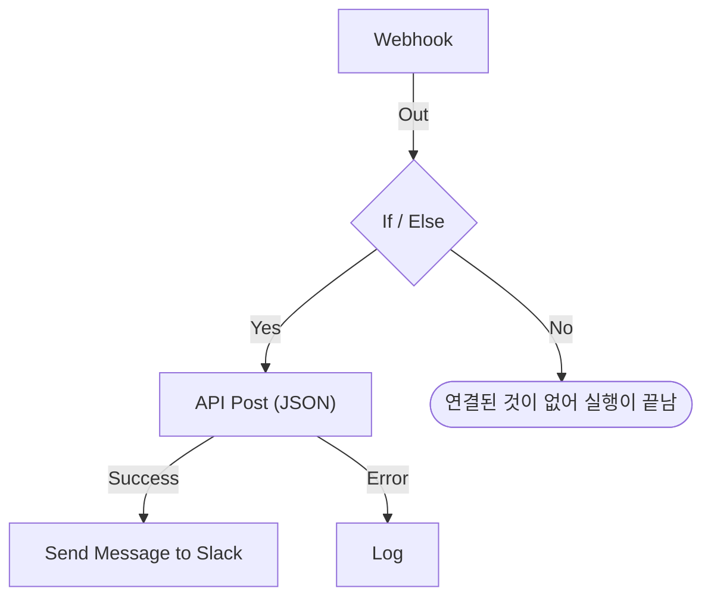

# 워크플로우 작성

워크플로는 그 워크플로의 **빌더**에서 만듭니다. 빌더는 블록을 추가하고, 연결하고, 설정을 채우는 캔버스입니다. 이 페이지에서는 워크플로를 만드는 방법, [블록 추가](#블록-추가), [연결](#블록-연결), [설정](#블록-설정), [블록 사이의 값 전달](#앞선-블록의-값-사용하기), [워크플로 켜기](#켜기)를 설명합니다.

워크플로를 만들려면 **워크플로**를 열고 **워크플로 생성**을 클릭합니다. **워크플로 만들기** 대화 상자는 먼저 어떻게 시작할지 묻고, 그다음 이름을 묻습니다. Slack 웹훅 URL처럼 자체 설정이 필요한 템플릿은 추가 단계에서 그것을 묻고 워크플로 변수로 저장하므로, 나중에 워크플로를 편집하지 않고도 바꿀 수 있습니다.

시작 방법을 고릅니다.

- 대화 상자 맨 위의 **처음부터 시작**은 빈 캔버스를 줍니다. 대부분의 워크플로는 여기서 시작합니다.
- **또는 템플릿에서 시작**에는 **추천** 템플릿 몇 개가 표시됩니다. 나머지는 검색 상자 옆에서 **인시던트**, **모니터**, **Jira** 같은 카테고리나 **모든 템플릿**을 고르거나, **템플릿 검색…** 에 입력합니다. 입력한 모든 단어가 일치해야 합니다.

템플릿을 클릭하면 그것이 하는 일을 볼 수 있습니다. 트리거, 구성하는 블록, 물어볼 설정입니다. 그런 다음 **이 템플릿 사용**을 클릭하거나 템플릿을 두 번 클릭합니다. 검색 상자에서는 화살표 키로 템플릿을 고르고 **Enter**로 사용합니다. `/` 를 누르면 검색 상자로 돌아갑니다.

워크플로는 꺼진 상태로 만들어지므로, 켜기 전까지는 아무것도 실행되지 않습니다. 새 워크플로는 설계용 캔버스인 **빌더**에서 열립니다.

## 캔버스

처음부터 만든 워크플로는 **Choose what starts this workflow**라고 적힌 점선 블록 하나만 있는 상태로 열립니다. 이 블록이 시작점입니다. 클릭해서 트리거를 고르세요. 템플릿으로 만든 워크플로는 블록이 이미 배치된 상태로 열립니다.

모든 워크플로에는 맨 위에 정확히 하나의 **트리거**가 있습니다. 나머지는 모두 무언가를 하는 **구성 요소**입니다. 트리거를 바꾸려면 트리거를 삭제하세요. 그 자리에 점선 자리 표시자가 돌아오고, 클릭하면 다른 트리거를 고를 수 있습니다. 블록을 삭제하면 그 선도 삭제되므로, 새 트리거를 첫 번째 블록에 다시 연결하세요.

변경 사항은 자동으로 저장됩니다. 도구 모음의 배지가 그 상태를 보여 줍니다. 변경 사항이 전송되는 동안에는 **저장 중…** , 그다음에는 **저장됨**, 실패하면 **저장할 수 없습니다**가 표시됩니다. 캔버스에는 저장 버튼도, 별도의 게시 단계도 없습니다.

## 블록 추가

| 추가할 것              | 클릭할 것                                                      | 열리는 패널                   |
| ---------------------- | -------------------------------------------------------------- | ----------------------------- |
| 트리거                 | 점선 자리 표시자 블록                                          | **Add Trigger**               |
| 그 밖의 블록           | 캔버스 위 도구 모음의 **구성 요소 추가**                       | **구성 요소 추가**            |

두 패널 모두 대부분의 워크플로가 쓰는 블록을 **Popular** 아래에 먼저 보여 주고, 그 뒤에 나머지 기본 제공 블록이 이어집니다. **OneUptime resources** 아래에서 **인시던트** 같은 리소스를 클릭하면 그것으로 무엇을 할 수 있는지 볼 수 있고, **Browse all resources**에는 모든 리소스가 표시됩니다. 또는 검색하세요. `create incident` 처럼 몇 단어를 입력하면 가장 잘 맞는 결과가 맨 위에 옵니다. `/` 를 눌러 검색 상자로 이동하고, 화살표 키로 결과를 이동하고, **Enter**로 강조된 블록을 추가합니다. 블록을 클릭해도 추가됩니다.

새 블록은 캔버스의 가장 아래 블록 밑에 놓이고, 새 트리거는 맨 위 점선 블록의 자리를 차지합니다. 새 블록은 선택된 상태가 되며, 보이는 영역 밖에 놓이면 캔버스가 그 블록이 보일 만큼만 스크롤됩니다. 설정은 저절로 열리지 않습니다. 설정할 준비가 되면 블록을 클릭하세요. 필수 설정을 채우기 전까지 블록에는 **Click to set up**이 표시됩니다.

블록은 원하는 곳으로 드래그하세요. 드래그하는 동안 캔버스가 블록을 격자에 맞춥니다. 블록 위치가 저장되므로, 다음 사람도 여러분이 남긴 그대로의 배치를 보게 됩니다.

## 블록의 구성

| 필드                                  | 하는 일                                                                                                                                                                                                                                                                                                       |
| ------------------------------------- | ------------------------------------------------------------------------------------------------------------------------------------------------------------------------------------------------------------------------------------------------------------------------------------------------------------- |
| **Identifier** (**ID** 아래)          | 블록에 표시되는 짧은 ID로, `log-1` 같은 것입니다. 다른 블록은 이것으로 이 블록을 참조하므로, 이름을 바꾸면 이 블록을 가리키는 모든 `{{local.components.…}}` 참조가 깨집니다. 블록의 제목은 구성 요소 자체의 이름이며 바꿀 수 없습니다.                                                                   |
| **설정**                              | 블록이 일을 하는 데 필요한 것 — URL, Slack 채널, 메시지 텍스트 등. 선택 필드는 **(선택 사항)** 으로 표시되고, 나머지는 모두 필수입니다. 켜기/끄기 스위치는 항상 값이 있으므로 어느 표시도 없습니다. 덜 쓰는 설정은 **추가 필드** 아래에 접혀 있으며, 그 제목에 항목 이름과 채워진 항목이 표시됩니다. |
| **Input**                             | 위쪽 가장자리의 점으로, 앞선 블록에서 온 선이 여기로 들어옵니다. 트리거에는 없습니다. 트리거보다 먼저 실행되는 것이 없기 때문입니다.                                                                                                                                                                         |
| **Outputs**                           | 아래쪽 가장자리를 따라 있는 점들로, 바로 위에 레이블이 있고 여기서 다음 블록으로 선이 나갑니다. 많은 블록에는 **Success**와 **Error** 출력이 따로 있어 두 경우를 모두 처리할 수 있습니다.                                                                                                                    |

## 블록 연결

한 블록 아래쪽의 점에서 다음 블록 위쪽의 점까지 드래그합니다. 그린 선이 다음에 무엇이 실행될지 결정합니다.

- **Success**에서 연결하면, 다음 블록은 앞 블록이 성공했을 때만 실행됩니다.
- **Error**에서 연결하면, 다음 블록은 앞 블록이 실패했을 때만 실행됩니다.
- 출력을 연결하지 않으면 그 경로는 그냥 끝납니다.

하나의 출력을 여러 블록에 연결할 수 있습니다. 모두 실행되지만, 병렬이 아니라 하나의 대기열에서 차례로 실행됩니다. 분기 사이의 순서에 의존하지 말고, 시간상 겹칠 것이라고 가정하지도 마세요.

각 블록은 한 번의 실행에서 최대 한 번만 실행됩니다. 이미 실행된 블록으로 향하는 선 — 캔버스 위쪽으로 되돌아가는 선이나, 첫 번째 분기가 그 블록에 도달한 뒤 다른 분기에서 오는 선 — 은 실행을 오류로 멈추므로, 워크플로가 루프를 돌 수 없습니다.

## 블록 설정

블록을 클릭하면 대화 상자에서 설정이 열립니다. 또는 **Tab**으로 블록으로 이동해 **Enter**를 누릅니다. 설정을 채우고 **저장**을 클릭합니다.

각 설정에는 그 값에 맞는 입력란이 있습니다.

| 설정에 담기는 것                                 | 표시되는 것                                                                    |
| ------------------------------------------------ | ------------------------------------------------------------------------------ |
| 글: 메시지, 프롬프트, 로그에 남길 값             | 입력할수록 늘어나는 입력란. **Enter**는 새 줄을 시작합니다.                    |
| 짧은 값: URL, ID, 제목 줄                        | 한 줄 입력란.                                                                  |
| 코드 또는 HTML                                   | 코드 편집기.                                                                   |
| JSON                                             | JSON 편집기.                                                                   |
| 켜기 또는 끄기                                   | 옆에 이름이 있는 스위치. 스위치나 이름을 클릭해 전환합니다.                    |

대화 상자는 여러분이 아마 찾으러 왔을 내용에서 열립니다. **웹훅** 트리거라면 그 URL과 **URL 복사** 버튼, 받는 메서드, 예시 요청입니다. **Manual** 트리거라면 워크플로를 시작하는 방법입니다. 그 밖의 블록은 설정에서 열립니다. 설정이 없는 블록에는 **설정** 섹션 자체가 없습니다.

그 아래에는 위에서부터 다음이 있습니다.

- **ID**, **Inputs**, **Outputs**가 나란히 — 블록의 식별자, 어디서 이 블록에 도달하는지, 그 뒤에 무엇이 실행되는지.
- **Returns** — 이 블록이 이후 단계에 넘기는 데이터. 각 값에는 그 값을 읽는 정확한 참조와 복사 버튼이 표시됩니다.
- **How to use** — 블록이 하는 일을 한 문장으로, 설정 단계, 복사할 예시, 흔히 하는 실수. 예시는 여러분의 워크플로를 바탕으로 만들어지며, 메시지에 데이터를 넣는 부분에서 이 블록의 ID와 트리거의 값을 사용합니다. **Learn more**는 더 긴 설명을 열고, 링크는 전체 가이드로 이어집니다. 모든 블록에 이 섹션이 있으며, 대화 상자 맨 위의 **How to use** 버튼으로 바로 이동합니다.

맨 아래에는 다음이 있습니다.

- **삭제** — 이 블록을 제거합니다. 먼저 확인을 요청하며 **Send Email (send-email-2)** 처럼 블록을 종류와 식별자로 알려 주므로, 똑같은 블록이 여러 개 있어도 어느 것이 사라지는지 알 수 있습니다.
- **Run just this step** — 워크플로의 나머지 없이 이 블록 하나만 실행합니다. 다른 단계에서 읽었을 값은 비어 있는 상태로 도착하고, 보내거나 쓰거나 삭제하는 것은 모두 실제로 일어납니다. 블록 앞의 모든 조건을 건너뛰므로, 워크플로를 편집할 수 있는 사람만 사용할 수 있습니다.

### 앞선 블록의 값 사용하기

대부분의 설정은 앞선 블록의 값이나 변수를 사용할 수 있습니다. 이렇게 데이터가 블록에서 블록으로 흐릅니다. 그런 설정에는 끝에 **{ }** 버튼이 있습니다. 이 버튼은 사용할 수 있는 값의 목록을 엽니다. 앞선 각 블록이 이름별로, 그 블록이 반환하는 각 값(이름, 내용, 타입)과 함께 표시되고, 그 뒤에 워크플로의 변수와 전역 변수가 나옵니다. 목록을 검색하고, 마우스나 화살표 키와 **Enter**로 고르면 커서 위치에 값이 삽입됩니다.

설정 안에서 값은 **Webhook › Request Body** 같은 칩으로 표시됩니다. 포인터를 올리면 그 칩이 나타내는 참조 `{{local.components.webhook-1.returnValues.request-body}}` 가 보이며, 저장되는 것은 이 참조입니다. 커서는 칩을 한 번에 건너뛰고, **Backspace**는 칩 전체를 지우며, 칩을 복사하면 참조가 복사됩니다. 구문을 안다면 대신 `{{` 를 입력하세요. 같은 목록이 설정 아래에 열리고 입력할수록 좁혀집니다.

- **존재하게 될 값만 제안됩니다.** 트리거와 이 블록보다 먼저 실행되는 블록입니다. 나중에 실행되는 블록에는 아직 출력이 없습니다. 블록이 연결되기 전에는 트리거의 값만 표시되며, 목록에도 그렇게 나옵니다.
- **레코드는 필드 목록으로 열립니다.** Find One이나 On Create 블록은 레코드 전체를 반환합니다. 그것을 고르면 필드가 표시되며, 블록의 **Select Fields**가 읽는 필드가 먼저 나옵니다. JSON 값이나 헤더 묶음은 `title` 이나 `alerts[0].status` 같은 경로를 입력하는 필드로 열립니다.
- **블록이 한 번 실행되면, 목록은 그 값에 무엇이 들어 있는지 압니다.** 각 값에는 최근 실행에서 무엇이 들어 있었는지(`"production"` 이나 `3 fields`)가 표시되고, JSON 값이나 헤더 묶음은 실제로 있던 필드가 각자의 내용과 함께 열립니다. 그래서 웹훅의 **Request Body**에서는 경로를 입력하는 대신 **incident.title**을 고릅니다. 검색으로도 이 필드를 찾을 수 있습니다. `title`, 또는 `{{` 와 경로의 시작 부분을 입력하세요. 레코드의 필드도 무엇이 들어 있었는지 보여 줍니다. 필드는 최근 실행에서 가져오므로, 나중 요청에서 빠진 필드는 그 실행에서 비어 있습니다. `Authorization` 헤더, 토큰, 비밀번호처럼 시크릿으로 보이는 값은 내용 없이 표시됩니다.
- **아직 요청을 받지 않은 웹훅은 그렇다고 알려 줍니다.** 값 목록 맨 위에 **Copy test request**가 있는데, 이것은 워크플로의 웹훅 URL로 `{"message": "Hello"}` 를 보내는 `curl` 명령입니다. 목록을 연 채로 터미널에서 실행하면, 그것이 시작한 실행이 끝나는 대로(보통 몇 초 안에) 요청의 필드가 목록에 나타납니다. 워크플로가 활성화되어 있어야 하며, 그렇지 않으면 요청이 거부됩니다. 이 버튼은 웹훅 URL을 볼 수 있는 사람에게만 표시됩니다. 아직 이메일을 받지 않은 Incoming Email 트리거도 같은 자리에서 그렇게 알려 줍니다. 그 주소로 이메일을 보내면 헤더와 첨부 파일이 같은 방식으로 나타납니다.
- **코드 편집기의 도구 모음에는 Insert value가 있습니다.** JSON에서는 문서 안의 값에 필요한 따옴표를 붙여 줍니다. **Run Custom JavaScript**는 **Arguments**를 통해 값을 읽으므로, 코드에는 선택기가 없습니다.
- **숫자, 비밀번호, 스위치, 날짜는 고유한 컨트롤을 유지하며,** 옆에 **{ }** 가 있습니다. 고른 값이 컨트롤을 대체하고, **abc**로 다시 입력으로 돌아갑니다.

칩이 읽는 대상이 없으면 칩이 주황색이 됩니다. 이름이 바뀌었거나 삭제된 블록, 블록이 반환하지 않는 값, 나중에 실행되는 블록, 존재하지 않는 변수 등입니다. 도구 설명에 어느 것인지 표시됩니다. 참조 구문은 [변수](/docs/workflows/variables)를 참조하세요.

## 만드는 동안의 검사

빌더는 변경할 때마다 그래프 전체를 검사하고, 발견한 내용을 도구 모음의 배지로 알려 줍니다. 배지를 클릭하면 **Problems with this workflow**가 열려 각 문제가 나열되고, 해당 블록으로 이동할 수 있습니다. 캔버스에서는 필수 설정이 아직 비어 있는 블록에 **Click to set up**이 표시되고, 다른 문제가 있는 블록에는 모서리에 배지가 붙습니다. 빨간색은 오류, 주황색은 경고입니다. 배지에 포인터를 올리면 무엇이 문제인지 읽을 수 있습니다.

실행이 잘못되기 전까지는 보이지 않는 실수를 잡아냅니다.

- 트리거가 없는 워크플로
- ID가 같은 두 블록, 또는 점이 들어간 ID
- 아무것도 연결되지 않은 블록
- 비워 둔 필수 설정
- 잘못된 JSON
- `{{ }}` 안의 공백
- 존재하지 않는 단계나 반환 값에 대한 참조

한 가지는 검사할 수 없습니다. 변수 이름이 존재하는지입니다. 블록의 설정은 검사할 수 있습니다. 존재하지 않는 변수에 대한 참조는 거기서 주황색 칩으로 표시됩니다. 그 밖의 곳에서는 이름이 바뀐 변수가 실행의 로그에서야 드러납니다.

## 첫 워크플로

캔버스를 익히는 가장 빠른 방법은 수동으로 시작하는 블록 두 개짜리 워크플로입니다.

:::steps
1. 점선 자리 표시자 블록을 클릭한 다음 **Add Trigger** 패널에서 **Manual**을 클릭합니다.
2. **구성 요소 추가**를 클릭한 다음 **Popular** 아래의 **로그**를 클릭합니다. 새 블록이 트리거 아래에 놓입니다. 트리거의 **Execute** 점을 Log 블록의 입력 점까지 연결합니다.
3. **Click to set up**이라고 표시된 Log 블록을 클릭하고 **Value**에 `Hello from ` 을 입력합니다. **{ }** 를 클릭한 다음 **Manual** 아래의 **JSON**을 클릭합니다. 설정에 **Manual › JSON**이 표시되고 `{{local.components.manual-1.returnValues.value}}` 가 저장됩니다. `manual-1` 은 트리거 블록에 표시되는 트리거의 **Identifier**입니다. **저장**을 클릭합니다.
4. 빌더 맨 위에서 **활성화됨**을 켭니다. 비활성화된 워크플로는 수동으로도 전혀 실행할 수 없습니다. 이 단계를 건너뛰면 **워크플로 실행**이 먼저 켜라고 요청합니다.
5. **빌더**로 돌아와 **워크플로 실행**을 클릭하고, **JSON** 필드에 `{ "name": "Ada" }` 를 입력한 뒤 **Run Workflow Manually**를 클릭하고 **Run**으로 확인합니다.
6. **워크플로 실행** 패널이 저절로 열려 실행을 따라갑니다. 로그에 `Value:` 와 그 뒤에 `Hello from { "name": "Ada" }` 가 표시됩니다.
:::

추가하고, 연결하고, 설정하고, 실행하고, 로그를 읽는 이 순환이 모든 워크플로를 만드는 방법입니다.

> [!TIP]
> **워크플로 실행**에 입력한 JSON은 입력한 그대로의 텍스트로 Manual 트리거에 도착합니다. 그 안의 `name` 같은 필드를 읽으려면 **Text to JSON** 블록을 추가하고, 그 **Text**에 트리거의 **JSON**을 넣은 뒤, 그 블록의 **JSON**에서 필드를 읽습니다: `{{local.components.text-to-json-1.returnValues.json.name}}`.

## 켜기

새 워크플로는 비활성화된 상태로 시작하며, 복제하거나 가져온 워크플로도 마찬가지입니다. 워크플로가 꺼져 있는 동안 빌더는 캔버스 위에 그 사실을 표시하고 **워크플로 켜기** 버튼을 보여 줍니다.

**활성화됨** 스위치는 **빌더** 맨 위, **구성 요소 추가**와 **워크플로 실행** 옆에 있습니다. 워크플로의 **개요** 페이지에도 있으며, 그 페이지의 **워크플로 세부 정보** 카드가 현재 상태를 초록색 **활성화됨** 배지나 빨간색 **비활성화** 배지로 보여 줍니다. 바꾸려면 **워크플로 편집**을 클릭하고 **추가 필드**를 엽니다. 워크플로를 편집할 수 있는 사람만 켜고 끌 수 있으며, 다른 사람에게는 스위치가 흐리게 표시됩니다.

비활성화된 워크플로는 어떻게 시작하든 전혀 실행되지 않습니다.

| 시작하는 방법                                              | 워크플로가 꺼져 있을 때                                                                                                                                                                   |
| ---------------------------------------------------------- | ----------------------------------------------------------------------------------------------------------------------------------------------------------------------------------------- |
| 트리거: 일정, OneUptime 이벤트, 이메일                     | 무시됩니다.                                                                                                                                                                               |
| **워크플로 실행** 또는 **Run just this step**              | 대신 빌더가 **이 워크플로를 켜시겠습니까?** 라고 묻습니다. **켜고 실행**(또는 **켜고 단계 실행**)은 워크플로를 켠 다음, 요청한 작업을 입력한 값으로 실행합니다.                         |
| 웹훅 URL 호출                                              | HTTP 400과 "This workflow is turned off, so it can't run. Turn it on with the Enabled switch at the top of its Builder, then try again." 으로 거부됩니다.                                   |
| 다른 워크플로의 **Execute Workflow** 블록                  | 그 블록은 자신의 **Error** 경로를 따르고, 오류에는 호출한 워크플로가 표시됩니다.                                                                                                          |

그러니 순서는 이렇습니다. 만들고, **워크플로 실행**으로 테스트하고, 실행의 로그를 읽고, 트리거가 발생해도 될 준비가 안 됐다면 **활성화됨**을 다시 끕니다. 전체를 실행하지 않고 블록 하나만 테스트하려면 그 블록의 설정에서 **Run just this step**을 사용하세요.

워크플로를 삭제하지 않고 일시 중지하려면 **활성화됨**을 끕니다. 새 실행은 시작되지 않습니다. 진행 중인 실행은 끝까지 진행되지만, **Sleep** 블록에서 대기 중인 실행은 깨어날 때 취소되고 오류로 기록됩니다.

## 정리하기

- 블록을 드래그해 옮깁니다. 배치는 저장됩니다.
- 선을 삭제하려면 선의 한쪽 끝을 점에서 떼어 캔버스의 빈 곳에 놓습니다.
- 블록을 삭제하려면 블록을 클릭하고 설정 대화 상자 맨 아래의 **삭제**를 사용합니다. 블록이나 선을 선택하고 Backspace를 눌러도 삭제됩니다.
- 블록 하나만 복제하는 방법은 없습니다. 워크플로의 **설정** 페이지에 있는 **워크플로 복제**가 전체를 복사합니다. 복사본의 이름은 프로젝트 워크플로의 다음 번호로 채워지며("Nightly Sync"는 "Nightly Sync 2"로 복사됩니다), 복사본은 비활성화된 상태로 열립니다.
- 실행되는 방향으로 읽히도록 블록을 위에서 아래로 배치하세요. 입력은 위쪽 가장자리, 출력은 아래쪽 가장자리에 있으므로 흐름이 자연스럽게 아래로 향합니다.

## 다음 단계

:::cards
- [트리거](/docs/workflows/triggers): 워크플로를 시작하는 다섯 가지 방법.
- [구성 요소](/docs/workflows/components): 추가할 수 있는 모든 블록과 그 설정 및 출력.
- [변수](/docs/workflows/variables): 블록 사이에 데이터를 옮기고 시크릿을 블록 밖에 둡니다.
- [실행 기록](/docs/workflows/runs-and-logs): 각 실행이 무엇을 했는지 단계별로 확인합니다.
:::
