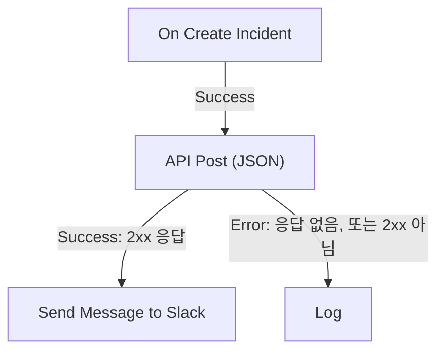

# 워크플로우 구성 요소

구성 요소는 트리거 다음에 추가하는 블록입니다. 각각 한 가지 일 — 메시지 보내기, API 호출, 조건 확인, OneUptime 레코드 변경 — 을 하고, 그다음 출력 중 하나를 선택해 거기에 연결된 블록으로 넘어갑니다. 이 페이지는 그 목록입니다. 각 블록에 무엇이 필요한지, 무엇을 반환하는지, 언제 어떤 출력을 선택하는지 설명합니다.

만드는 동안 이 페이지를 열어 둘 일은 드뭅니다. 각 블록의 설정 끝에는 **How to use**가 있어, 블록이 하는 일, 설정 단계, 여러분의 워크플로를 바탕으로 만든 예시, 흔히 하는 실수를 보여 줍니다. 블록을 추가하고 연결하는 방법은 [워크플로 작성](/docs/workflows/authoring)을 참조하세요.

:::cards
- [메시지 보내기](#slack): Slack, Microsoft Teams, Discord, Telegram, IRC, 이메일.
- [API 호출](#api): 어떤 HTTP API로든 요청을 보내고 응답을 읽습니다.
- [로직 추가](#conditions): 값에 따라 분기하고, 데이터를 바꾸고, 기다리거나 로그를 남깁니다.
- [OneUptime 레코드 다루기](#oneuptime-데이터-구성-요소): 모니터, 인시던트 등을 찾고, 만들고, 업데이트하고, 삭제합니다.
:::

## 어떤 구성 요소를 써야 하나요?

| 하려는 일                                                     | 사용할 것                                                         |
| ------------------------------------------------------------- | ----------------------------------------------------------------- |
| 채팅 도구에 게시하기                                          | [Slack](#slack), [Microsoft Teams](#microsoft-teams), [Discord](#discord), [Telegram](#telegram), [IRC](#irc) |
| 자체 메일 서버로 이메일 보내기                                | [Email](#email)                                                   |
| 다른 API나 자체 서비스 호출하기                               | [API](#api)                                                       |
| 텍스트 요약, 분류, 초안 작성하기                              | [Generate Text with AI](#generate-text-with-ai)                   |
| 값에 따라 다른 경로로 가기                                    | [Conditions](#conditions)                                         |
| 두 블록 사이에서 데이터 모양 바꾸기                           | [JSON](#json) 또는 [Custom Code](#custom-code)                    |
| 다음 블록 전에 기다리기                                       | [Sleep](#sleep)                                                   |
| 다른 워크플로 시작하기                                        | [Execute Workflow](#execute-workflow)                             |
| 인시던트, 모니터 등 레코드를 읽거나 바꾸기                    | [OneUptime 데이터 구성 요소](#oneuptime-데이터-구성-요소)          |

전용 블록이 범용 블록보다 낫습니다. Slack 블록은 Slack의 한도를 알고, 레코드 블록은 레코드의 필드를 알기 때문에, 같은 일을 하는 **API** 블록보다 오류와 로그가 더 명확합니다.

## 각 블록의 작동 방식

블록은 앞 블록이 이 블록에 연결된 출력을 선택하면 실행됩니다. 설정을 읽고, 일을 하고, 출력 중 하나를 선택합니다. 그 출력에 연결된 블록만 다음에 실행됩니다.



- **설정**은 여러분이 채우는 것입니다. **(선택 사항)** 으로 표시된 설정은 비워 둘 수 있습니다. 덜 쓰는 설정은 **추가 필드** 아래에 접혀 있습니다.
- **Outputs**는 아래쪽 가장자리의 점입니다. 대부분의 블록에는 **Success**와 **Error**가 있고, [Conditions](#conditions)에는 **Yes**와 **No**가 있습니다.
- **Returns**는 API의 **Response Body**처럼 블록이 이후 블록에 넘기는 값입니다. 이후 블록은 `{{local.components.<block ID>.returnValues.<value ID>}}` 로 읽으며, 설정의 **{ }** 버튼으로 삽입할 수 있습니다. [변수](/docs/workflows/variables#구성-요소-출력앞선-블록에서-온-데이터)를 참조하세요.

**Error**를 선택한 블록은 실행을 실패시키지 않습니다. 실행은 **Error** 경로를 따르거나, 연결된 것이 없으면 거기서 끝납니다. 반면 비워 둔 필수 설정이나 절대 작동할 수 없는 설정은 실행을 오류로 멈춥니다.

## API

어떤 URL로든 HTTP 요청을 보냅니다. 메서드마다 블록이 하나씩 있습니다: **API Get (JSON)**, **API Post (JSON)**, **API Put (JSON)**, **API Patch (JSON)**, **API Delete (JSON)**.

| 설정                | 하는 일                                                                                                                              |
| ------------------- | ------------------------------------------------------------------------------------------------------------------------------------ |
| **URL**             | 호출할 주소. `http` 또는 `https`.                                                                                                    |
| **Request Body**    | 보낼 JSON. 보통 `POST`, `PUT`, `PATCH` 요청에만 필요합니다.                                                                          |
| **Request Headers** | API 키처럼 함께 보낼 헤더. **추가 필드** 아래에 있습니다. 값은 실행의 로그에서 가려집니다.                                           |

| 출력        | 시점                                                                                           |
| ----------- | ---------------------------------------------------------------------------------------------- |
| **Success** | 서버가 2xx 상태로 응답했습니다.                                                                |
| **Error**   | 요청이 실패했습니다. 서버에 연결할 수 없었거나 다른 상태로 응답했습니다.                       |

어느 쪽이든 블록은 **Response Status**, **Response Headers**, **Response Body**를 반환하며, 실패했을 때는 이유가 담긴 **Error**도 반환합니다. JSON 응답의 필드를 읽으려면 `{{local.components.api-get-1.returnValues.response-body.id}}` 처럼 참조에 그 이름을 덧붙입니다.

리디렉션은 따라가지 않으므로, 실제로 응답하는 주소를 블록에 지정하세요. 요청은 OneUptime에서 나갑니다. 사설 네트워크 주소로 확인되는 URL은 셀프 호스팅 관리자가 허용하지 않는 한 거부되며, 실행은 이유와 함께 멈춥니다. [아웃바운드 네트워크 접근](/docs/workflows/configuration#아웃바운드-네트워크-접근)을 참조하세요.

## AI

### Generate Text with AI

프롬프트와 선택적 JSON 컨텍스트로 텍스트 응답 하나를 생성합니다. 블록은 프로젝트의 기본 LLM 공급자를 사용하며, 프로젝트에 없으면 설치의 전역 공급자를 사용합니다. 공급자는 **프로젝트 설정 → AI → LLM 공급자**에서 중앙에서 구성하며, 그 키와 엔드포인트가 블록의 설정이 되는 일은 없습니다.

| 설정                      | 하는 일                                                                                                                                                           |
| ------------------------- | ----------------------------------------------------------------------------------------------------------------------------------------------------------------- |
| **System Instructions**   | 모델의 역할, 어조, 제약에 대한 선택적 지침.                                                                                                                      |
| **Prompt**                | 작업. 쓴 그대로 보내지므로 Markdown도 괜찮고, 변수와 앞선 블록의 값을 담을 수 있습니다.                                                                           |
| **Context**               | 의도적으로 함께 보내는 선택적 JSON. 메시지 끝을 나타내는 명시적 표시 뒤에 붙으며, 신뢰할 수 없는 데이터로 취급됩니다.                                              |
| **Temperature**           | **추가 필드** 아래에 있습니다. `0`에서 `1`까지의 변동 정도이며, 기본값은 예측 가능한 자동화를 위한 `0.2`입니다. 현재 Claude 모델(Opus 4.7 이상과 모든 Claude 5 모델)은 샘플링을 스스로 정합니다. OneUptime은 이 모델들에 대한 요청에서 **Temperature**를 빼므로, 이 모델들에는 효과가 없습니다. |
| **Maximum Output Tokens** | **추가 필드** 아래에 있습니다. `1`에서 `4096`까지이며, 기본값은 `1024`입니다.                                                                                   |

System Instructions, Prompt, 직렬화된 Context는 합쳐서 50,000자로 제한됩니다. 그 안에 base64로 포함된 이미지(인시던트 설명에 있는 합성 모니터의 스크린숏 등)는 측정 전에 `[image omitted: PNG, 340 KB]` 같은 짧은 메모로 바뀝니다. 모델은 이미지가 아니라 텍스트를 읽기 때문입니다. 무엇이 빠졌는지는 실행의 로그에 남습니다. 공급자 요청은 최대 60초이며 한 번만 시도합니다. 프로젝트당 워크플로 AI 요청은 동시에 최대 세 개까지 실행할 수 있습니다.

반환하는 값은 **Response**(생성된 텍스트), **Provider**와 **Model**(응답한 것), **Total Tokens**와 **Completion Tokens**(공급자가 보고한 사용량), **LLM Log ID**(AI 로그에서 이 호출의 항목), **Error**입니다.

**Success**는 응답을 사용하는 블록에, **Error**는 대체 처리에 연결하세요. 검증, 접근, 공급자, 예산, 청구, 시간 초과 실패는 모두 그 경로를 따릅니다. 블록은 도구를 보내지 않으므로, 모델이 스스로 OneUptime을 조회하거나, API를 호출하거나, 데이터를 바꿀 수 없습니다.

> [!WARNING]
> 모델의 출력은 신뢰할 수 없는 텍스트입니다. 고객에게 닿기 전에 검토하고, 자유 형식의 AI 텍스트만으로 파괴적인 작업을 결정하게 하지 마세요. 공급자에게 보내는 것, 로그에 남는 것, 비용은 [AI 구성 요소](/docs/workflows/configuration#ai-구성-요소)를 참조하세요.

## Slack

수신 웹훅을 통해 Slack 채널에 메시지를 게시합니다.

| 설정                           | 하는 일                                                                                                                                                                                                      |
| ------------------------------ | ------------------------------------------------------------------------------------------------------------------------------------------------------------------------------------------------------------ |
| **Slack Incoming Webhook URL** | 게시할 채널의 웹훅. `https://hooks.slack.com/services/` 로 시작해야 합니다. Slack의 [만들기 가이드](https://api.slack.com/messaging/webhooks)는 몇 분이면 끝납니다.                                         |
| **Message Text**               | 보낼 텍스트. 쓴 그대로 보내지므로 Slack 자체 서식을 쓰세요: `*bold*`, `_italic_`, `~strikethrough~`, `<https://example.com|a link>`. Slack 섹션 하나(3,000자)보다 긴 텍스트는 여러 개로 나뉘어 보내지며, 열 개 섹션을 넘으면 잘리고 "… (truncated — see OneUptime for the full text)"로 끝납니다. |

**Success**는 Slack이 메시지를 받아들였을 때, **Error**는 Slack이 거부했을 때 발생하며, Slack의 이유가 **Error**에 담깁니다. 이 블록들은 프로젝트의 Slack 연결이 아니라 설정에 있는 웹훅을 통해 게시합니다.

## Microsoft Teams

Microsoft Teams 채널에 메시지를 게시합니다. 블록 이름은 **Send Message to Teams**입니다.

| 설정                           | 하는 일                                                                                                                                                                                                                                       |
| ------------------------------ | --------------------------------------------------------------------------------------------------------------------------------------------------------------------------------------------------------------------------------------------- |
| **Teams Incoming Webhook URL** | 게시할 채널의 웹훅으로, `office.com`, `office365.com`, `logic.azure.com`, `environment.api.powerplatform.com` 의 `https` URL입니다. Microsoft 가이드에서 [Teams Workflows로 만드는 방법](https://support.microsoft.com/en-us/teams/apps-service/create-incoming-webhooks-with-workflows-for-microsoft-teams)을 볼 수 있습니다. |
| **Message Text**               | 보낼 텍스트. 수신 웹훅이 받는 크기(보내는 형태로 약 12,000자)보다 큰 메시지는 잘리고 "… (truncated — see OneUptime for the full text)"로 끝납니다.                                                                                             |

## Discord

수신 웹훅을 통해 Discord 채널에 메시지를 게시합니다.

| 설정                             | 하는 일                                                                                                                                            |
| -------------------------------- | -------------------------------------------------------------------------------------------------------------------------------------------------- |
| **Discord Incoming Webhook URL** | 채널의 웹훅으로, `discord.com` 또는 `discordapp.com` 의 `https` URL입니다.                                                                         |
| **Message Text**                 | 보낼 텍스트. Discord의 한도인 2,000자를 넘는 메시지는 잘리고 "… (truncated — see OneUptime for the full text)"로 끝납니다.                          |

## Telegram

봇으로 Telegram 채팅에 메시지를 보냅니다.

| 설정                   | 하는 일                                                                                                                                            |
| ---------------------- | -------------------------------------------------------------------------------------------------------------------------------------------------- |
| **Telegram Bot Token** | BotFather가 봇에 준 토큰으로, `123456789:ABCdef…` 같은 형태입니다. 다른 형태의 토큰은 실행을 멈추며, 토큰이 로그에 기록되지는 않습니다.            |
| **Chat ID**            | 게시할 채팅. 그 ID나 채널의 `@username` 입니다. 먼저 봇을 그룹이나 채널에 추가하세요. 개인에게 쓰려면 그 사람이 먼저 봇과 채팅을 시작해야 합니다. |
| **Message Text**       | 보낼 텍스트. Telegram의 한도인 4,096자를 넘는 메시지는 잘리고 "… (truncated — see OneUptime for the full text)"로 끝납니다.                         |

Telegram이 메시지를 거부하면 Telegram의 이유와 함께 **Error**가 발생합니다.

## IRC

Libera.Chat, OFTC 또는 자체 서버 등 어떤 IRC 네트워크든 IRC 채널에 메시지를 게시합니다. IRC에는 웹훅이 없으므로, 블록이 직접 서버에 연결해 채널에 들어가 메시지를 보내고 다시 나옵니다.

| 설정             | 하는 일                                                                                                                                                                                                                                            |
| ---------------- | -------------------------------------------------------------------------------------------------------------------------------------------------------------------------------------------------------------------------------------------------- |
| **IRC Server**   | 서버의 호스트 이름으로, `irc.libera.chat` 같은 것입니다. 이름만 쓰고 `ircs://` 나 포트는 붙이지 않습니다.                                                                                                                                          |
| **Channel**      | 게시할 채널로, `#ops` 같은 것입니다. 채널이어야 합니다. 여기에 입력한 닉네임은 개인 메시지를 받는 대신 거부됩니다.                                                                                                                                 |
| **Message Text** | 보낼 텍스트. 각 줄은 별도의 IRC 메시지로 보내지고, 긴 줄은 맞게 나뉩니다. 메시지는 최대 15개의 IRC 줄로 보내지며, 그보다 길면 잘리고 마지막 줄에 그렇게 표시됩니다. IRC에는 Markdown이 없으므로 텍스트는 쓴 그대로 보내지며, 굵게나 색상 같은 IRC 자체 서식 코드는 작동합니다. |

**추가 필드** 아래:

| 설정                                     | 하는 일                                                                                                                                                                                                            |
| ---------------------------------------- | ------------------------------------------------------------------------------------------------------------------------------------------------------------------------------------------------------------------ |
| **Nickname**                             | 메시지를 보내는 이름. 기본값은 `OneUptime` 입니다. 닉네임이 사용 중이면 블록은 밑줄이나 숫자를 덧붙여 시도하고, 더 긴 닉네임을 받지 않는 서버에는 마지막 글자들을 그 문자로 바꿔 시도합니다.                    |
| **Port**                                 | 서버의 포트. 기본값은 `6697` 이며, **Disable TLS**를 켜면 `6667` 입니다.                                                                                                                                          |
| **Disable TLS**                          | 블록은 TLS로 연결하고 서버의 인증서를 확인합니다. TLS를 제공하지 않는 서버에서만 켜세요. 그러면 비밀번호가 있을 경우 암호화되지 않고 전송됩니다. 자체 인증 기관의 인증서를 신뢰하게 하려면, 셀프 호스팅 설치에서 대신 `NODE_EXTRA_CA_CERTS` 를 설정합니다. |
| **Channel Key**                          | 키가 있는 채널의 키(모드 `+k`).                                                                                                                                                                                    |
| **Send Without Joining**                 | 채널에 들어가지 않고 게시하므로, 채널에서 블록이 들어오고 나가는 것이 보이지 않습니다. 외부 메시지를 받는 채널(모드 `+n` 없음)에서만 작동합니다.                                                                 |
| **Server Password**                      | 연결할 때 서버나 바운서가 요구하는 비밀번호.                                                                                                                                                                      |
| **SASL Username** 및 **SASL Password**   | SASL을 사용하는 네트워크에서 자신의 계정으로 로그인합니다. Libera.Chat은 일부 클라우드와 VPN 주소에서 오는 연결에 이를 요구합니다. 둘 다 채우거나 둘 다 비워 두세요.                                               |

**Success**는 서버가 모든 줄을 받아들였을 때 발생합니다. 블록은 마지막 줄 다음에 서버에 ping 응답을 요청해 이를 확인합니다. 서버는 순서대로 응답하므로, 메시지 거부가 있다면 그것이 먼저 옵니다. ZNC 같은 바운서는 ping에 직접 응답하므로, 블록은 그 뒤의 네트워크에서 오는 응답을 1초 더 기다립니다.

**Error**는 서버에 연결할 수 없거나, 서버가 연결, 닉네임, 비밀번호, 채널 또는 메시지를 거부할 때 발생합니다. 이유는 서버가 준 경우 서버 자신의 말로 전달됩니다. 반면 **IRC Server**, **Channel**, **Message Text**가 없거나 절대 작동할 수 없는 설정은 실행을 멈춥니다.

블록의 각 실행은 별도의 연결이며, IRC 네트워크는 한 주소가 연결할 수 있는 빈도를 제한합니다. 메시지가 몰리면 "Reconnecting too fast" 같은 이유로 거부될 수 있으며, 다른 거부와 마찬가지로 **Error**를 따릅니다. 1분에 여러 번 발생할 수 있는 워크플로라면 할 말을 하나의 메시지로 모으거나, 자체 서버를 통해 보내세요.

비밀번호는 [비밀 전역 변수](/docs/workflows/variables#전역-변수)에 보관하고 설정에서는 그 변수를 사용하세요. 어느 쪽이든 실행의 로그에서는 가려집니다. 루프백(`localhost`, `127.0.0.1`), 링크 로컬, 클라우드 메타데이터 주소로의 연결은 거부됩니다. OneUptime Cloud에서는 사설 네트워크 주소의 서버나 그런 주소로 확인되는 이름도 거부됩니다. 셀프 호스팅 설치는 `DATA_SOURCE_BLOCK_PRIVATE_ADDRESSES` 가 `true` 로 설정되지 않은 한 자체 네트워크의 IRC 서버에 연결할 수 있습니다.

## Email

블록에 지정한 SMTP 서버를 통해 이메일을 보냅니다. 블록 이름은 **Send Email**입니다.

| 설정                                    | 하는 일                                                                                               |
| --------------------------------------- | ----------------------------------------------------------------------------------------------------- |
| **From Email**                          | 보내는 사람. 예: `Alerts <alerts@company.com>`.                                                       |
| **To Email**                            | 받는 사람 주소. 여러 주소는 쉼표나 세미콜론으로 구분합니다.                                           |
| **Subject**                             | 제목 줄.                                                                                              |
| **Email Body**                          | HTML로 보내는 메시지.                                                                                 |
| **SMTP HOST** 및 **SMTP Port**          | 연결할 메일 서버.                                                                                     |
| **SMTP Username** 및 **SMTP Password**  | 선택 사항. 둘 다 채우거나 둘 다 비워 두세요.                                                          |
| **Use Implicit TLS**                    | 암시적 TLS(보통 포트 465)에는 켭니다. STARTTLS(보통 포트 587)에는 꺼 둡니다.                           |

**Success**는 SMTP 서버가 메시지를 받아들였을 때 발생합니다. **Error**는 SMTP 호스트가 거부되거나, 서버에 연결할 수 없거나, 서버가 메시지를 거부할 때 발생하며 오류 메시지를 넘깁니다. 반면 **To Email**, **From Email**, **SMTP HOST**, **SMTP Port**가 없으면 실행이 멈춥니다.

블록은 설정에 있는 서버에 직접 연결합니다. 프로젝트의 [SMTP](/docs/emails/smtp) 설정이나 OneUptime 자체 메일 서버를 사용하지 않으며, 보낸 이메일은 알림 로그에 나타나지 않습니다. 무엇을 했는지 확인하려면 워크플로의 [실행 기록](/docs/workflows/runs-and-logs)을 보세요.

루프백(`localhost`, `127.0.0.1`), 링크 로컬, 클라우드 메타데이터 주소로의 연결은 거부됩니다. OneUptime Cloud에서는 사설 네트워크 주소의 SMTP 호스트나 그런 주소로 확인되는 이름도 거부됩니다. 셀프 호스팅 설치는 `DATA_SOURCE_BLOCK_PRIVATE_ADDRESSES` 가 `true` 로 설정되지 않은 한 자체 네트워크의 메일 서버에 연결할 수 있습니다. 거부된 호스트는 **Error** 출력을 따르며, 아무것도 보내지지 않습니다.

## Custom Code

다른 블록으로 필요한 일을 할 수 없을 때 몇 줄의 JavaScript를 실행합니다. 블록 이름은 **Run Custom JavaScript**입니다.

| 설정                | 하는 일                                                                                                                              |
| ------------------- | ------------------------------------------------------------------------------------------------------------------------------------ |
| **JavaScript Code** | 여러분의 코드. `return` 으로 반환한 것이 블록의 **Value**가 됩니다. `await` 를 쓸 수 있습니다.                                      |
| **Arguments**       | 코드에 넘기는 값의 JSON 객체로, 코드는 이를 `args` 로 읽습니다. 변수와 앞선 블록의 값은 여기에 넣으세요. 코드 자체는 그것들을 읽을 수 없습니다. |

```json title="Arguments"
{ "title": "{{local.components.incident-on-create-1.returnValues.model.title}}" }
```

```javascript title="JavaScript Code"
const words = args.title.split(" ");

return {
  shortTitle: words.slice(0, 5).join(" "),
  wordCount: words.length,
};
```

이후 블록은 짧은 제목을 `{{local.components.javascript-1.returnValues.returnValue.shortTitle}}` 로 읽습니다.

코드는 `args`, `console.log`(실행의 로그에 기록됨), HTTP 요청용 `axios`, `crypto`, `sleep` 이 있는 샌드박스에서 실행됩니다. 파일 시스템도 프로세스도 없으며, 요청에는 API 블록과 같은 주소 규칙이 적용됩니다. 기본적으로 5초가 주어지며, 셀프 호스팅 설치에서는 `WORKFLOW_SCRIPT_TIMEOUT_IN_MS` 로 바꿉니다.

**Success**는 반환된 **Value**와 함께 발생하고, **Error**는 코드가 예외를 던지거나 시간이 다 되었을 때 메시지를 **Error**에 담아 발생합니다. 더 무거운 스크립트에는 대신 [Runbook](/docs/runbooks/index)을 사용하세요.

## JSON

텍스트와 JSON을 서로 변환하거나, JSON 객체 두 개를 합칩니다.

| 블록             | 받는 것                                  | 반환하는 것                                                                                                |
| ---------------- | ---------------------------------------- | ---------------------------------------------------------------------------------------------------------- |
| **JSON to Text** | **JSON**, 객체                           | **Text**: 문자열로 바꾼 객체. 다음 블록이 텍스트를 기대할 때 유용합니다.                                   |
| **Text to JSON** | **Text**, 여러 줄일 수 있음              | **JSON**: 파싱한 객체로, 필드를 읽을 수 있게 됩니다. 텍스트로 도착한 JSON에 사용하세요.                    |
| **Merge JSON**   | **JSON 1** 및 **JSON 2**                 | **JSON**: 두 객체의 키를 모두 가진 객체 하나. 둘 다 가진 키는 **JSON 2**가 우선합니다.                      |

**Text to JSON**은 텍스트가 JSON이 아니면 **Error**를 따릅니다. 입력이 없거나, **Merge JSON**의 입력이 객체가 아니면 실행이 멈춥니다.

## Conditions

비교에 따라 분기합니다. **구성 요소 추가** 패널에서 이 블록은 **Popular** 아래의 **If / Else**라는 이름입니다.

설정은 문장처럼 읽힙니다: **조건** *확인할 값* *비교* *비교할 값* 이면 **Yes**로, 아니면 **No**로 계속합니다. 설정 아래에서 조건을 말로 다시 읽어 주므로, 의도한 대로인지 확인할 수 있습니다. 캔버스에서도 블록이 조건을 보여 줍니다. 예: *조건 environment is equal to “production”*.

| 설정               | 하는 일                                                                                                                                  |
| ------------------ | ---------------------------------------------------------------------------------------------------------------------------------------- |
| **Value to check** | 보통 앞선 블록의 값입니다. 입력란의 **{ }** 를 눌러 고르거나 `{{` 를 입력하세요.                                                          |
| **Comparison**     | 비교하는 방법을 말로. 비교 목록은 아래에 있습니다.                                                                                       |
| **Compare with**   | 비교할 대상으로, 같은 방식으로 입력하거나 고릅니다. **비어 있음**, **비어 있지 않음**, **is true**, **is false**는 이것을 쓰지 않습니다.   |
| **Compare as**     | 비교 아래에 접혀 있습니다: **텍스트**, **숫자**, **True / False**. `2026-10-01` 로 쓴 날짜를 순서대로 비교하려면 **텍스트**를, `200` 과 `200.0` 을 같게 만들려면 **숫자**를 고르세요. |

비교:

- **is equal to** 및 **is not equal to**
- 텍스트용: **포함**, **포함하지 않음**, **시작하는 값**, **끝나는 값**
- 숫자용: **초과**, **is greater than or equal to**, **미만**, **is less than or equal to**
- **비어 있음** 및 **비어 있지 않음** — 값이 아예 있는지 확인합니다
- **is true** 및 **is false**

숫자 비교는 숫자를, 텍스트 비교는 텍스트를 비교하므로 **Compare as**가 필요한 경우는 드뭅니다. 값은 다음과 같이 비교됩니다.

- 텍스트로는 대소문자를 구분합니다: `Error`는 `error`가 아닙니다.
- 숫자로는 숫자가 아닌 텍스트를 `0`으로 칩니다. 그런 값이 입력되어 있으면 설정이 알려 줍니다.
- 참 또는 거짓으로는 `true`만 참으로 칩니다.
- **비어 있음**은 값이 아예 없을 때, 공백 텍스트, 빈 목록이나 빈 객체, 또는 웹훅이 보내지 않은 필드처럼 앞선 블록에 없던 값일 때 충족됩니다. `0`과 `false`는 값이므로 비어 있지 않습니다.

**Yes**는 조건이 충족될 때, **No**는 충족되지 않을 때 실행됩니다. 설정이 이 이름을 갖기 전에 구성된 블록은 이전과 똑같이 실행됩니다. 오래된 선택지 하나는 더 이상 제공되지 않습니다. 값을 **Null**이나 **Undefined**로 비교하는 것으로, 값에 무엇이 들어 있는지를 무시했습니다. 아직 그것을 쓰는 블록은 열 때 그렇게 알려 줍니다. 값이 없는지 확인하려면 **비어 있음**을 고르세요.

## Sleep

다음 블록 전에 실행을 일시 중지합니다. 다른 시스템이 따라잡을 시간을 주거나 나중에 후속 조치를 할 때 씁니다.

**Days**, **Hours**, **Minutes**, **Seconds**는 합산됩니다. 가장 긴 대기는 30일이며, 그보다 길면 30일로 줄어들고 실행의 로그에 그렇게 남습니다.

기다리는 동안 실행은 **대기 중** 상태로 옆에 놓였다가 시간이 되면 다시 이어지므로, 긴 대기가 아무것도 붙잡아 두지 않습니다. 그 사이에 워크플로가 꺼지거나 보관된 실행은 깨어날 때 취소됩니다.

## Log

실행의 로그에 값을 씁니다. 다른 것은 아무것도 바꾸지 않으므로, 값에 무엇이 들어 있었는지 보는 가장 쉬운 방법입니다.

**Value**가 쓸 내용입니다. 여러 줄일 수 있고 `{{local.components.webhook-1.returnValues.request-body}}` 처럼 앞선 블록의 값을 담을 수 있습니다. 블록은 끝나면 **Out**을 따릅니다.

## Execute Workflow

같은 프로젝트의 다른 워크플로를 시작합니다. 여러분의 워크플로는 다른 워크플로가 끝나기를 기다리지 않고 계속합니다.

| 설정          | 하는 일                                                                                                                                   |
| ------------- | ----------------------------------------------------------------------------------------------------------------------------------------- |
| **Workflow**  | 시작할 워크플로. 활성화되어 있어야 하며, 인수를 받으려면 **Manual** 트리거가 있어야 합니다.                                                |
| **Arguments** | 함께 보낼 JSON. 다른 워크플로의 Manual 트리거는 각 키를 별도의 값으로 넘깁니다: `{"customerId": "42"}` 라면 `{{local.components.manual-1.returnValues.customerId}}` 를 읽습니다. |

**Out**은 다른 워크플로가 대기열에 들어가는 즉시 발생합니다. **Error**는 그럴 수 없을 때 발생합니다. 존재하지 않거나, 꺼져 있거나 보관되었거나, 시작하면 루프가 생기는 경우입니다.

공통 로직을 공유하는 데 사용하세요. "인시던트 채널에 게시하기" 워크플로를 한 번 만들고, 그것이 필요한 모든 워크플로에서 시작합니다. 서로를 시작하는 워크플로의 사슬은 자기 자신으로 되돌아올 수 없으며, 최대 10단계까지만 깊어질 수 있습니다. [설정 및 보안](/docs/workflows/configuration#다른-워크플로-호출-제한)을 참조하세요.

## OneUptime 데이터 구성 요소

OneUptime의 레코드 종류마다(모니터, 인시던트, 경고, 상태 페이지, 온콜 정책 등 다수) **구성 요소 추가** 패널에 이 구성 요소들이 있습니다. **OneUptime resources** 아래에서 레코드 종류를 클릭하거나(표시되지 않은 것은 **Browse all resources**에 있습니다), 종류의 이름으로 검색하세요. 각 제목은 레코드 종류에서 만들어지므로, Monitor의 세트는 다음과 같습니다.

| 구성 요소                | 하는 일                                                                        |
| ------------------------ | ------------------------------------------------------------------------------ |
| **Find One Monitor**     | 쿼리와 일치하는 레코드 하나를 읽습니다.                                        |
| **Find Many Monitors**   | 쿼리와 일치하는 레코드 목록을 읽습니다.                                        |
| **Create One Monitor**   | JSON 객체로 레코드 하나를 추가합니다.                                          |
| **Create Many Monitors** | JSON 배열로 여러 레코드를 추가합니다.                                          |
| **Update One Monitor**   | 쓸 데이터를 일치하는 레코드 하나에 적용합니다.                                 |
| **Update Many Monitors** | 쓸 데이터를 일치하는 레코드에 **Limit**까지 적용합니다.                        |
| **Delete One Monitor**   | 일치하는 레코드 하나를 삭제합니다.                                             |
| **Delete Many Monitors** | 일치하는 레코드를 **Limit**까지 삭제합니다.                                    |

같은 세트로 트리거 세 가지 — **On Create Monitor**, **On Update Monitor**, **On Delete Monitor** — 도 얻습니다. [트리거](/docs/workflows/triggers#oneuptime-이벤트-트리거)를 참조하세요.

종류는 그 모델이 허용하는 구성 요소만 제공합니다. 읽기 전용 종류에는 Find 구성 요소 두 개만 있으므로, 패널에서 **Delete One Monitor**를 찾을 수 없다면 그 종류는 그것을 허용하지 않는 것입니다.

이것이 워크플로가 OneUptime 데이터를 읽고 바꾸는 방법입니다. 예를 들어 CI 도구에서 온 웹훅이 **Create One Incident**를 사용해 실패 세부 정보가 담긴 인시던트를 열 수 있습니다.

이 구성 요소들은 워크플로 프로젝트의 Project Admin으로 동작합니다. Project Admin에게 허용되지 않거나 플랜에 포함되지 않은 것은 거부되며, 실행의 로그에 그 이유가 남습니다. [워크플로 단계가 할 수 있는 일](/docs/workflows/configuration#워크플로-단계가-할-수-있는-일)을 참조하세요.

### 템플릿으로 인시던트 선언하기

**Create One Incident**는 [인시던트 템플릿](/docs/incidents/settings#인시던트-템플릿) 중 하나로 인시던트를 선언할 수 있습니다. 단계의 첫 번째 설정인 **Incident Template**에서 고르세요. 템플릿은 **JSON Object**가 빠뜨린 모든 필드 — 제목, 설명, 심각도, 초기 상태, 모니터와 기타 리소스, 온콜 정책, 레이블, 상태 페이지, 사용자 지정 필드 — 를 채우고, 템플릿의 소유자가 인시던트의 소유자가 됩니다. **JSON Object**에 설정한 것은 상태를 포함해 템플릿보다 우선하므로, 템플릿을 고른 경우 **JSON Object**에는 달라야 할 것만 넣으면 되고 비워 둘 수도 있습니다.

인시던트는 선언에 쓰인 템플릿을 `createdIncidentTemplateId` 에 기록합니다. 이 열은 OneUptime이 직접 설정합니다. **JSON Object**에 이것을 보내는 단계는 거부되며, 그 실행 로그가 **Incident Template**을 안내합니다. 다른 프로젝트의 템플릿이나 삭제된 템플릿이면 단계가 **Error** 출력을 따르고, 인시던트 템플릿이 포함되지 않은 플랜에서는 필요한 플랜과 함께 단계가 거부됩니다. [템플릿이 적용되는 방식](/docs/incidents/settings#템플릿이-적용되는-방식)을 참조하세요.

## 레코드 다루기

데이터 구성 요소의 모든 필드는 레코드 자체의 **열** 이름을 씁니다. 대시보드 양식의 레이블이 아니라 API와 같은 이름입니다. ID 열은 `_id` 입니다. 열 이름을 입력할 수 있는 곳이라면 어디서든 `id` 라는 철자도 별칭으로 받지만, 레코드가 반환하는 것은 `_id` 이므로 꺼낼 때는 그것을 읽으세요.

```json
{ "_id": "00000000-0000-0000-0000-000000000000" }
```

**Query**는 구성 요소가 어떤 레코드를 다룰지 결정합니다. 키는 열이고, 값은 일치시킬 내용입니다.

```json
{ "monitorType": "Website", "isEnabled": true }
```

쿼리는 항상 워크플로가 실행되는 프로젝트로 제한됩니다. 다른 프로젝트의 레코드에는 닿을 수 없으며, 쿼리에 프로젝트를 직접 넣을 필요도 없습니다.

Create One의 **JSON Object**, Create Many의 **JSON Array**, Update 구성 요소의 **Data (JSON Object)** 는 같은 키로 쓸 필드를 담습니다.

```json
{ "name": "Checkout API", "monitorType": "Website" }
```

열이 아닌 키는 거부되지 않고 무시됩니다. 실행의 로그에 버려진 키가 나오므로, 필드가 반영되지 않으면 거기를 확인하세요. Find 구성 요소와 트리거의 **Select Fields**는 같은 열 키에 값 `true` 를 붙여 씁니다: `{"_id": true, "name": true}`.

**사용자 지정 필드**는 하나의 열 `customFields` 로, 각 사용자 지정 필드의 값을 그 필드 이름 아래에 담습니다. Update 구성 요소는 지정한 사용자 지정 필드만 바꾸고, 나머지는 값을 유지합니다.

```json
{ "customFields": { "Notification Count": 1 } }
```

이것은 **Notification Count**를 설정하고 레코드의 다른 사용자 지정 필드는 그대로 둡니다. 사용자 지정 필드를 지우려면 `null` 로 설정하고, 모두 지우려면 `customFields` 자체를 `null` 로 설정하세요. 같은 레코드의 서로 다른 사용자 지정 필드를 같은 순간에 업데이트하는 두 워크플로는 둘 다 반영됩니다. 이는 Update 구성 요소에만 해당합니다. OneUptime API는 `customFields` 를 통째로 쓰므로, API로 보내는 요청에는 유지하려는 모든 사용자 지정 필드가 들어 있어야 합니다.

이 키들을 직접 입력할 일은 거의 없습니다. 구성 요소의 설정에서 **Add a field**(쿼리에서는 **Add a condition**)가 모델의 열을 이름으로, 각각 받는 값의 종류와 함께 보여 줍니다. 이름, 열 키, 또는 필드가 하는 일로 검색하고, **Enter**를 눌러 가장 잘 맞는 것을 추가하세요. 만들 때는 레코드를 만드는 데 꼭 필요한 필드가 먼저 나오고, 그다음 모델의 주요 필드(빠뜨리면 모델이 스스로 채우는 것), 그다음 나머지가 나옵니다.

OneUptime이 스스로 채우는 필드는 레코드를 쓸 때 제공되지 않습니다: 레코드의 `_id`, **생성일**, **수정일**, **Created by User**, 슬러그, 레코드 번호, 알림 상태. 누가 언제 레코드를 생성, 보관, 해결했는지는 워크플로가 설정하는 것이 아닙니다. 워크플로가 만든 레코드는 누구도 만들지 않은 것으로 기록되고, 워크플로가 다른 필드와 함께 그 필드의 값을 보내면 무시되며, 그 밖에 아무것도 보내지 않는 Update는 그 필드들을 언급하는 메시지와 함께 실패합니다. 업데이트에서는 레코드가 생긴 뒤에도 바꿀 수 있는 필드만 제공됩니다. 쿼리에서는 필터링에 유용하므로 ID, 타임스탬프, **Created by User**가 계속 제공됩니다. **Deleted At**은 어디에서도 제공되지 않습니다. 레코드는 완전히 삭제되므로 항상 비어 있기 때문입니다.

**Skip**과 **Limit**은 Find Many, Update Many, Delete Many에 있는 숫자 필드 두 개로, **추가 필드** 아래에 있습니다. `Skip: 0` 과 `Limit: 100` 은 처음 100개의 일치 항목을 가져옵니다. **Limit**의 기본값은 `10` 이며, Update Many와 Delete Many에서는 돌아오는 개수뿐 아니라 실제로 쓰는 레코드 수를 제한합니다. 그래서 `Items Deleted: 10` 은 10개가 일치했다는 뜻이 아니라 10개가 삭제되었다는 뜻입니다. 10개보다 많이 바꾸려면 **Limit**을 올리세요.

**Success**와 **Error**는 쿼리가 실행되었는지를 말할 뿐, 무엇을 찾았는지는 말하지 않습니다. 아무것도 일치하지 않는 쿼리는 `0` 을 반환하고 그래도 **Success**로 나갑니다. 이는 오류가 아닙니다. 무언가 일치했는지에 따라 분기하려면, 반환된 개수를 **If / Else** 블록에서 읽으세요.

## 다음 단계

:::cards
- [변수](/docs/workflows/variables): 블록 사이에 값을 전달하고 시크릿을 블록 밖에 둡니다.
- [실행 기록](/docs/workflows/runs-and-logs): 실행에서 각 블록이 무엇을 받고 반환했는지 봅니다.
- [설정 및 보안](/docs/workflows/configuration): 한도, 권한, 단계가 할 수 있는 일.
:::
