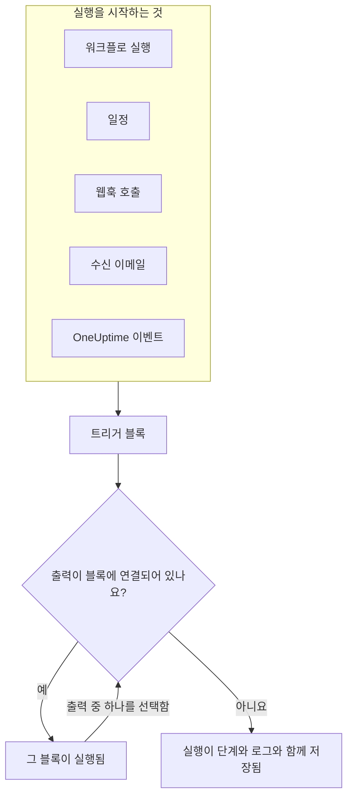
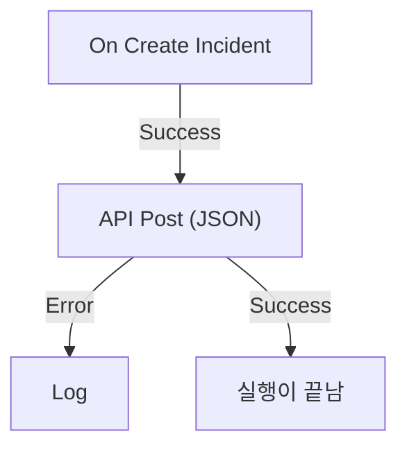

# 워크플로우 개요

워크플로를 사용하면 코드 없이 OneUptime에서 작업을 자동화할 수 있습니다. 캔버스에 블록을 놓고 연결하면, 트리거가 발생할 때마다 워크플로가 스스로 실행됩니다. 인시던트가 생성되거나, 일정 시간이 되거나, 다른 도구가 URL을 호출하거나, 이메일이 도착할 때입니다. OneUptime을 스택의 나머지 부분과 연결하고, 여러분이 문제 자체에 집중하는 동안 반복적인 후속 작업을 맡기는 데 사용하세요.

:::cards
- [워크플로 작성](/docs/workflows/authoring): 워크플로를 만든 다음 캔버스에서 블록을 추가하고, 연결하고, 설정합니다.
- [트리거](/docs/workflows/triggers): 워크플로를 수동으로, 일정에 따라, 웹훅, 이메일 또는 OneUptime 이벤트로 시작합니다.
- [구성 요소](/docs/workflows/components): API 호출부터 OneUptime 레코드까지, 추가할 수 있는 모든 블록.
- [실행 기록](/docs/workflows/runs-and-logs): 각 실행이 무엇을 했는지 단계별로 확인합니다.
:::

## 워크플로의 작동 방식

모든 워크플로는 세 부분으로 이루어집니다.

1. **트리거** — 워크플로를 시작하는 것입니다. 수동 실행, 일정, 웹훅 호출, 수신 이메일, 또는 새 인시던트 같은 OneUptime 안의 이벤트입니다. 모든 워크플로에는 정확히 하나가 있습니다.
2. **구성 요소** — 워크플로가 하는 일입니다. 메시지 보내기, API 호출, 조건 확인, OneUptime 레코드 생성 또는 업데이트 등입니다.
3. **연결** — 한 블록에서 다음 블록으로 그리는 선입니다. 무엇 다음에 무엇이 실행될지 결정합니다.

트리거가 발생하면 OneUptime은 **실행**을 시작합니다. 각 블록은 **Success**나 **Error**, **Yes**나 **No** 같은 출력 중 하나를 선택하며 끝나고, 그 출력에 연결된 블록만 다음에 실행됩니다. 블록이 선택한 출력에 연결된 블록이 없으면 그 경로는 거기서 끝납니다. 실행은 상태, 거쳐 간 경로, 각 블록이 받고 반환한 내용과 함께 저장됩니다.



이 모든 것을 캔버스에서 시각적으로 만듭니다. 대부분의 워크플로에는 코드가 전혀 필요 없으며, 필요한 경우 **Run Custom JavaScript** 블록이 몇 줄의 JavaScript를 실행합니다.

## 워크플로로 할 수 있는 일

- **OneUptime을 다른 도구와 연결** — Slack, Microsoft Teams, Discord, Telegram, IRC에 게시하고, Jira 티켓을 만들고, 스택의 어떤 API로든 요청을 보냅니다.
- **OneUptime에서 일어나는 일에 반응** — 인시던트가 생성되면 적절한 채널에 알리고 티켓을 자동으로 엽니다.
- **일정에 따라 작업 실행** — 5분마다, 매일 밤, 매주 월요일 아침.
- **외부에서 데이터 받기** — 다른 시스템이 워크플로의 URL을 호출하거나 주소로 이메일을 보내 워크플로를 시작하게 합니다.
- **공통 자동화 재사용** — 한 번 만들어 두고 다른 어떤 워크플로에서든 **Execute Workflow** 블록으로 시작합니다.

## 핵심 용어

| 용어              | 의미                                                                                                   |
| ----------------- | ------------------------------------------------------------------------------------------------------ |
| **워크플로**      | 자동화 전체입니다. 이름, 블록이 놓인 캔버스, 켜고 끄는 스위치로 구성됩니다.                            |
| **트리거**        | 첫 번째 블록입니다. 워크플로가 언제 실행될지 결정합니다. 모든 워크플로에는 정확히 하나가 있습니다.     |
| **구성 요소**     | 그 밖의 모든 블록입니다. 메시지를 보내거나, 요청을 하거나, 조건을 확인하거나, 레코드를 변경합니다.     |
| **출력**          | 블록 아래쪽의 점으로, **Success**나 **Error** 같은 것입니다. 거기서 나가는 선이 다음 블록으로 이어집니다. |
| **실행**          | 워크플로의 한 번의 실행으로, 상태, 타임스탬프, 각 블록이 한 일과 함께 저장됩니다.                       |
| **전역 변수**     | API 키처럼 한 번 저장하고 프로젝트의 모든 워크플로에서 사용하는 값입니다.                              |

## 시작하기 전에

- **워크플로가 포함된 플랜.** OneUptime Cloud에서 워크플로를 사용하려면 **Growth** 플랜 이상이 필요하며, 각 플랜은 30일마다 실행할 수 있는 횟수를 허용합니다. [플랜 한도](/docs/workflows/configuration#플랜-한도)를 참조하세요. 청구가 없는 셀프 호스팅 설치에는 두 한도 모두 없습니다.
- **만들 수 있는 권한.** 워크플로를 만들고 변경하려면 **Workflow Admin**, **Project Admin** 또는 **Project Owner**, 아니면 그에 맞는 권한을 가진 사용자 지정 역할이 필요합니다. **Workflow Member**는 워크플로를 열고 수동으로 실행할 수 있지만 변경할 수는 없습니다. [권한](/docs/workflows/configuration#권한)을 참조하세요.

## OneUptime에서 워크플로를 찾는 곳

상단 바에서 **제품**을 열고 **대시보드 및 자동화** 아래의 **워크플로**를 선택합니다. 그 메뉴에는 다음이 있습니다.

- **워크플로** — 워크플로 목록입니다. 새로 만들거나 기존 워크플로를 엽니다.
- **전역 변수** — 모든 워크플로가 공유하는 값입니다.
- **로그 → 실행 기록** — 프로젝트의 모든 워크플로에 걸친 실행 기록입니다.
- **설정 → 레이블 규칙**과 **소유자 규칙** — 새 워크플로에 레이블을 붙이고 소유자를 자동으로 지정합니다.
- **고급 → 보관됨** — 보관한 워크플로입니다. 절대 실행되지 않고 목록에서 빠지며, 여기서 보관을 취소할 수 있습니다. [워크플로 보관](/docs/workflows/configuration#워크플로-보관하기)을 참조하세요.
- **개발자** — Terraform, API 또는 AI 어시스턴트로 워크플로를 관리하는 방법입니다.

개별 워크플로를 열면, 그 워크플로 자체의 메뉴에는 다음이 있습니다.

- **개요** — 이름, 설명, 레이블, **활성화됨** 스위치.
- **빌더** — 워크플로를 설계하는 캔버스로, 맨 위에 **활성화됨** 스위치가 있습니다.
- **워크플로 변수** — 이 워크플로에만 해당하는 값입니다.
- **로그 → 실행 기록** — 이 워크플로의 모든 실행과 세부 정보입니다.
- **소유자** — 워크플로를 책임지는 사람과 팀입니다.
- **개발자** — Terraform, API 또는 AI 어시스턴트로 이 워크플로를 관리하는 방법입니다.
- **설정** — 복제, 내보내기, 보관.

**설정**은 메뉴의 **고급** 섹션에 **감사 로그**, **워크플로 삭제**와 함께 있습니다. **고급**과 **개발자**는 이 메뉴와 다른 모든 메뉴에서 처음에 접혀 있어서, 매일 쓰는 페이지가 먼저 나옵니다. 섹션 이름을 클릭하면 그 페이지들이 표시됩니다. 그중 한 페이지에 있을 때는 저절로 펼쳐집니다.

## 첫 워크플로 만들기

모든 워크플로는 같은 방식으로 만들어집니다.

:::steps
1. **만들기** — 시작점을 고른 다음 워크플로에 이름을 붙입니다. [워크플로 작성](/docs/workflows/authoring)을 참조하세요.
2. **트리거 선택** — 수동, 일정, 웹훅, 수신 이메일 또는 OneUptime의 이벤트. [트리거](/docs/workflows/triggers)를 참조하세요.
3. **구성 요소 추가** — 캔버스에 동작을 추가하고 연결합니다. [구성 요소](/docs/workflows/components)를 참조하세요.
4. **켜기** — **빌더** 맨 위에서 **활성화됨**을 켭니다. 비활성화된 워크플로는 수동으로도 전혀 실행할 수 없습니다.
5. **테스트** — **빌더**에서 **워크플로 실행**을 클릭하고 실행이 진행되는 모습을 지켜봅니다.
:::

아래 예제는 실제 워크플로로 이 단계를 따라갑니다.

## 예제: 새 인시던트를 웹훅으로 보내기

이 워크플로는 새 인시던트마다 JSON 요약을 여러분이 정한 URL — 티켓 시스템, 데이터 웨어하우스 등 웹훅을 받는 무엇이든 — 로 보내고, 요청이 실패하면 그 이유를 실행의 로그에 기록합니다.



> [!TIP]
> **Forward new incidents to another system** 템플릿이 같은 워크플로를 대신 만들어 줍니다. 워크플로를 만들 때 **인시던트** 아래에서 찾을 수 있습니다.

:::steps
### 워크플로 만들기

**워크플로**를 열고 **워크플로 생성**을 클릭합니다. **처음부터 시작**을 클릭하고, 워크플로 이름을 `Send new incidents to a webhook` 으로 정한 뒤 **워크플로 생성**을 클릭합니다.

새 워크플로가 꺼진 상태로 **빌더**에서 열립니다.

### 트리거 추가

점선으로 된 **Choose what starts this workflow** 블록을 클릭한 다음, **Add Trigger** 패널의 **Popular** 아래에 있는 **On Create Incident**를 클릭합니다.

트리거가 점선 블록의 자리를 차지합니다. 그 위에 표시된 ID인 `incident-on-create-1` 이 이후 블록들이 이 트리거를 참조할 때 쓰는 이름입니다.

### 인시던트 필드 선택

트리거를 클릭합니다. **Select Fields**에서 요청에 담을 필드(제목과 설명 등)를 체크하고 **저장**을 클릭합니다.

트리거는 새 인시던트를 이 필드들과 함께 넘깁니다. 선택하지 않은 필드는 비어 있는 상태로 도착합니다.

### API 블록 추가

**구성 요소 추가**를 클릭한 다음 **Popular** 아래의 **API Post (JSON)** 을 클릭합니다. 트리거의 **Success** 점에서 새 블록의 위쪽 점까지 드래그합니다.

### 요청 채우기

**Click to set up**이라고 표시된 API 블록을 클릭합니다. **URL**에 엔드포인트를 넣습니다. **Request Body**에 보낼 JSON을 쓰고, 필요한 곳에 **{ }** 로 인시던트의 필드를 삽입한 뒤 **저장**을 클릭합니다.

```json title="Request Body"
{
  "id": "{{local.components.incident-on-create-1.returnValues.model._id}}",
  "title": "{{local.components.incident-on-create-1.returnValues.model.title}}",
  "description": "{{local.components.incident-on-create-1.returnValues.model.description}}"
}
```

워크플로가 실행될 때 각 `{{…}}` 참조는 인시던트의 값으로 바뀝니다. 구문은 [변수](/docs/workflows/variables)를 참조하세요.

### 실패 잡아내기

**구성 요소 추가**를 클릭한 다음 **로그**를 클릭합니다. API 블록의 **Error** 점을 거기에 연결한 다음, Log 블록의 **Value**를 `Could not send the incident: {{local.components.api-post-1.returnValues.error}}` 로 설정합니다.

실패한 요청 — 연결할 수 없는 URL이나 2xx가 아닌 응답 — 은 이제 이 경로를 따르고, 실행의 로그에 그 이유가 남습니다.

### 켜기

**빌더** 맨 위에서 **활성화됨**을 켭니다.

### 테스트하기

**워크플로 실행**을 클릭하고, 이 프로젝트에 있는 인시던트의 **인시던트 ID**를 입력한 뒤 **Run Workflow Manually**를 클릭하고 **Run**으로 확인합니다.

**워크플로 실행** 패널이 열려 실행을 따라갑니다. **API Post (JSON)** 단계를 열면 보낸 본문과 받은 응답을 볼 수 있습니다.
:::

이제부터 프로젝트에 새 인시던트가 생길 때마다 실행이 시작됩니다. 모두 워크플로의 [실행 기록](/docs/workflows/runs-and-logs)에서 찾을 수 있습니다.

> [!NOTE]
> 요청은 OneUptime에서 나갑니다. OneUptime Cloud에서는 URL이 인터넷에서 접근 가능해야 합니다. 셀프 호스팅 설치는 관리자가 허용하지 않는 한 사설 네트워크 주소를 거부합니다. [아웃바운드 네트워크 접근](/docs/workflows/configuration#아웃바운드-네트워크-접근)을 참조하세요.

## 워크플로와 OneUptime의 나머지 기능

- **모니터**가 문제를 발견합니다. **인시던트**와 **경고**가 그것을 기록합니다. **워크플로**가 그것에 반응합니다.
- **Runbook**은 인시던트, 경고, 유지보수 때 팀이 진행하는 대응 절차로, 수동 단계, 승인, 스크립트가 있고 사람이 참여합니다. 워크플로는 사람의 개입 없이 실행됩니다. 진행 중에 사람이 결정해야 할 때는 [Runbook](/docs/runbooks/index)을, 모든 단계가 자동일 때는 워크플로를 사용하세요.
- **워크스페이스 연결**은 인시던트 채널과 알림을 위해 프로젝트를 Slack 및 Microsoft Teams와 연결합니다. 워크플로의 Slack 및 Microsoft Teams 블록은 이를 사용하지 않으며, 각 블록은 자체 수신 웹훅 URL을 통해 게시합니다.

## 다음 단계

:::cards
- [워크플로 작성](/docs/workflows/authoring): 캔버스, 블록, 그 설정을 다루는 방법.
- [변수](/docs/workflows/variables): 블록 사이에 데이터를 전달하고 시크릿을 워크플로 밖에 둡니다.
- [설정 및 보안](/docs/workflows/configuration): 운영에 들어가기 전에 권한, 한도, 보안을 확인합니다.
:::
