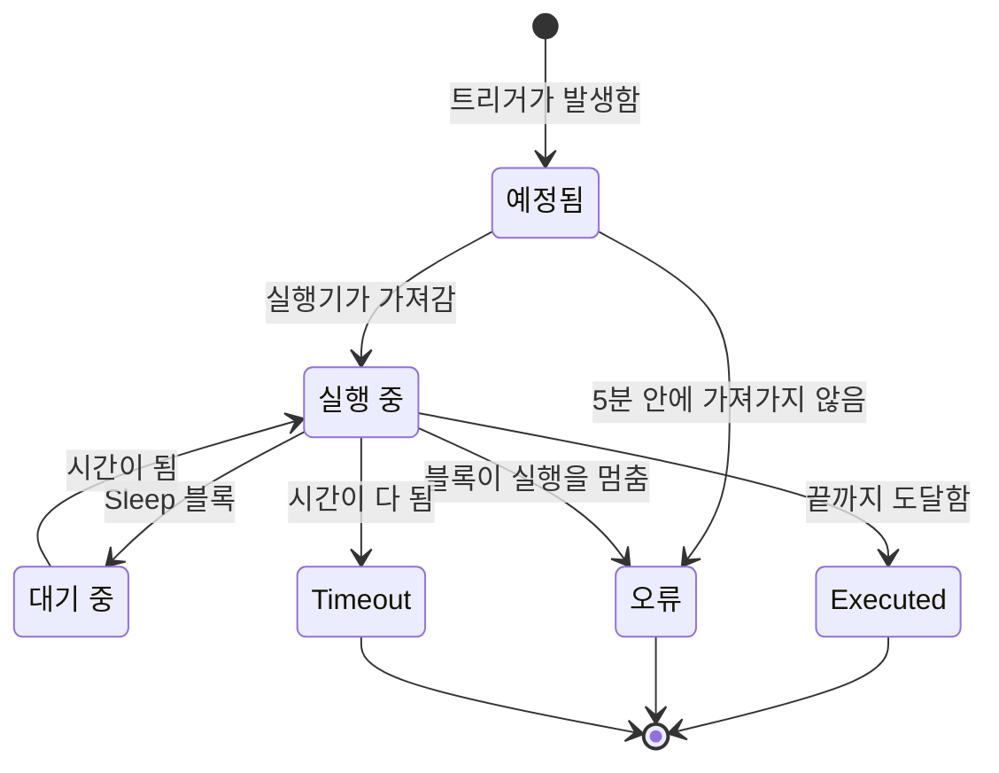

# 워크플로우 실행 기록

워크플로가 실행될 때마다 OneUptime은 무슨 일이 있었는지 기록을 저장합니다. 언제 실행되었는지, 성공했는지, 각 블록이 무엇을 받고 반환했는지입니다. 이 기록을 **실행**이라고 합니다. 실행을 보면 워크플로가 작동했는지 확인하고, 작동하지 않은 워크플로를 디버깅하고, 지난 활동을 되돌아볼 수 있습니다.

:::cards
- [실행 상태](#실행-상태): 예정됨, 대기 중, Executed 등 각 상태의 의미.
- [실행 읽기](#실행-읽기): 실행이 거쳐 간 경로를 블록별로 따라갑니다.
- [문제 해결](#문제-해결): 실행되지 않은 워크플로, 끝내 실행되지 않은 블록, 비어서 도착한 값.
:::

## 찾는 곳

| 페이지                                               | 보이는 것                                                                                          |
| ---------------------------------------------------- | -------------------------------------------------------------------------------------------------- |
| **워크플로 → 로그 → 실행 기록**(워크플로 메뉴)       | 프로젝트에 있는 모든 워크플로의 모든 실행. 워크플로 이름, 상태, 시간으로 필터링합니다.             |
| **워크플로 → 로그 → 실행 기록**(개별 워크플로의 메뉴) | 이 워크플로의 실행만. 여기에는 워크플로 필터 대신 **실행 ID** 필터가 있습니다.                    |
| **개별 실행**                                        | 실행 행의 **로그 보기** 버튼으로 엽니다. 행 자체는 클릭할 수 없습니다.                             |

**빌더**에서 실행을 시작하면 같은 **워크플로 실행** 보기가 이미 그 실행을 따라가는 상태로 열리므로, 나중에 찾으러 가는 대신 실행되는 모습을 지켜볼 수 있습니다.

## 실행 상태

| 상태                                | 의미                                                                                                                                                                                                                                                                  |
| ----------------------------------- | --------------------------------------------------------------------------------------------------------------------------------------------------------------------------------------------------------------------------------------------------------------------- |
| **예정됨**                          | 트리거가 발생했고, 실행이 실행기를 기다리는 대기열에 있습니다. 보통 1초도 걸리지 않습니다. 5분이 지나도 예정됨인 실행은 실패합니다. 아무도 가져가지 않은 것입니다.                                                                                                  |
| **실행 중**                         | 워크플로가 진행 중입니다.                                                                                                                                                                                                                                             |
| **대기 중**                         | 실행이 **Sleep** 블록에 멈춰 있으며 스스로 다시 시작합니다. 기다리는 동안 작업자를 차지하지 않습니다.                                                                                                                                                                |
| **Executed**                        | 실행이 실패 없이 끝까지 도달했습니다. 이것이 성공 상태입니다. 배지에는 "성공"이 아니라 **Executed**라고 표시됩니다.                                                                                                                                                 |
| **오류**                            | 블록이 실행을 멈췄습니다. 대기열의 실행을 아무도 가져가지 않았을 때, 잠든 실행의 재개가 사라졌을 때, 일정 식을 확인할 수 없을 때, 그리고 실행이 **Sleep** 블록에서 기다리는 동안 워크플로가 꺼지거나 보관되었을 때도 쓰입니다.                                    |
| **Timeout**                         | 실행이 허용된 시간보다 오래 걸렸습니다. 기본값은 2분입니다. [실행이 걸릴 수 있는 최대 시간](/docs/workflows/configuration#실행이-걸릴-수-있는-최대-시간)을 참조하세요.                                                                                                   |
| **Execution Exceeded Current Plan** | 프로젝트가 지난 30일 동안의 워크플로 실행 횟수를 모두 썼거나, 구독 요금이 미납되었습니다. 실행은 기록되지만 수행되지 않습니다. OneUptime Cloud 전용입니다.                                                                                                         |

**Error** 출력을 선택한 블록 — 예를 들어 4xx 응답을 받은 API 블록 — 은 실행을 실패시키지 않습니다. **Error**에 연결된 블록이 실행되고, 실행은 그래도 **Executed**로 끝납니다. 그 단계 자체는 빨간색으로 표시되어 찾을 수 있습니다.

## 실행 읽기

실행에서 **로그 보기**를 클릭해 엽니다. **워크플로 실행** 보기에는 **단계**와 **Full Log** 두 탭이 있습니다.

### 단계 탭

실행이 거쳐 간 경로로, 블록마다 번호가 매겨진 카드가 실행 순서대로 나옵니다. 아무것도 열지 않아도 각 카드에는 다음이 표시됩니다.

- 블록의 제목과 ID, **성공함**인지 **실패**인지, 걸린 시간.
- 어떤 출력을 선택했는지(캔버스에서 부르는 이름으로)와 그 출력이 이어진 곳. 다음 단계의 번호와 이름이거나, 연결된 것이 없어서 실행이나 그 분기가 거기서 끝났다는 메모입니다. 이어졌지만 실행되지 않은 단계에는 **(did not run)** 이라고 표시됩니다. Error 출력은 빨간색으로 표시되고, Yes와 No는 실행이 간 방향일 뿐입니다. 출력 이름에 포인터를 올리면 그 의미가 나옵니다.
- 실패했다면 단계의 오류, 그리고 그 단계에 대한 경고. 예를 들어 아무것으로도 확인되지 않은 `{{…}}` 참조입니다.

카드를 열면 두 블록의 세부 정보가 나옵니다.

| 블록         | 보여 주는 것                                                                                                                                                                                                    |
| ------------ | --------------------------------------------------------------------------------------------------------------------------------------------------------------------------------------------------------------- |
| **Received** | 모든 변수가 채워진 뒤 블록이 받은 설정. 이름별로, 설정 목록의 순서대로 표시됩니다. 다른 단계나 변수를 참조하는 설정은 참조와 그것이 된 값을 나란히 보여 주며, 아무것도 되지 않았으면 **Did not resolve**를 보여 줍니다. |
| **Returned** | 만들어 낸 것. 각 값의 ID(`returnValues` 참조의 마지막 부분)와 함께 표시됩니다. 목록과 객체는 들여쓰기해서 보여 줍니다.                                                                                          |

실패한 단계, 경고가 있는 단계, 실행의 유일한 단계는 펼쳐진 채로 시작합니다. **단계** 탭의 개수는 무언가 실패하면 빨간색, 단계에 경고가 있으면 주황색이 됩니다.

다르게 읽히는 실행도 있습니다.

- **단계 하나의 테스트.** **Run just this step**으로 시작한 실행은 맨 위에 **Only this step ran**이라고 표시됩니다. 그 앞의 단계는 실행되지 않았으므로 거기서 읽는 값이 없으며(그 값들에는 **Did not resolve** 경고가 나옵니다), 그 뒤의 단계에는 **(not run in this test)** 라고 표시됩니다. 경로 전체를 시험하려면 **워크플로 실행**을 쓰세요.
- **단계 사이에서 멈춘 실행.** 어떤 단계도 설명하지 못하는 이유로 실행이 멈췄다면 — 단계 사이에서 시간이 다 되었거나, 첫 단계 전에 실패했다면 — 경로는 **The run stopped here**와 그 이유로 끝납니다.
- **잠든 실행.** **Sleep** 블록에서 기다리는 실행은 **Sleeping**과 스스로 다시 시작할 시각으로 끝나며, Sleep 다음 단계에는 **(not run yet)** 이라고 표시됩니다.

각 단계 제목 아래의 ID는 `{{local.components.<id>.returnValues.…}}` 참조에 넣을 바로 그 값이므로, 참조를 정확히 쓰는 가장 빠른 방법입니다.

표시되는 값은 변수가 채워진 뒤, 블록이 그것으로 무언가를 하기 전에 받은 것입니다. 예외는 두 가지입니다. 시크릿과 블록이 민감하다고 표시한 필드는 가려지고, 4,000자보다 긴 값은 "… (truncated)"로 잘립니다. 실행은 마지막 100개 단계를 보관합니다. 길거나 자주 재개된 실행에는 앞선 단계가 버려진 자리에 주황색 메모가 표시됩니다. 출력 이름이 저장되기 전에 기록된 실행은 출력을 ID로 보여 주며, 이어진 곳은 표시하지 않습니다.

### Full Log 탭

실행기가 쓴 원본 로그를 한 줄씩 보여 줍니다. **Log** 블록의 값이나 스크립트의 `console.log` 처럼 블록이 직접 기록한 것도 포함됩니다. 단계 탭으로 실패가 설명되지 않을 때 쓰세요.

## 실행 복사 및 다운로드

**워크플로 실행** 보기 맨 위, 닫기 버튼 옆의 **로그 복사**는 **Full Log** 전체를 클립보드에 넣어, 채팅이나 티켓에 바로 붙여 넣을 수 있게 합니다. **다운로드**는 실행을 파일로 저장합니다.

| 다운로드                                | 받는 것                                                                                                                                                                                                                                |
| --------------------------------------- | -------------------------------------------------------------------------------------------------------------------------------------------------------------------------------------------------------------------------------------- |
| **로그 다운로드**                       | 실행기가 출력한 그대로의 전체 로그를 길이에 상관없이 담은 `.txt` 파일. 짧은 머리글로 워크플로의 이름과 ID, 실행 ID, 상태, 예정·시작·완료 시각이 붙습니다.                                                                             |
| **실행을 JSON으로 다운로드**            | 같은 정보를 데이터로, **단계** 탭에 표시되는 단계(각 단계가 받고 반환한 것과 선택한 출력)와, 줄 목록으로 된 로그를 담은 `.json` 파일. 단계는 API가 실행의 `stepTrace` 를 반환하는 것과 같은 형태이며, **단계** 탭처럼 실행의 마지막 100개입니다. 로그는 항상 전체입니다. |

같은 두 다운로드가 두 실행 목록 모두에서 각 실행의 **⋯** 메뉴에 있으므로, 실행을 열지 않고도 저장할 수 있습니다. **빌더**에서 시작한 실행은 아직 진행 중일 때도 복사하거나 다운로드할 수 있으며, 그때까지 기록된 내용을 받습니다.

파일 이름은 워크플로, 실행, 시작 시각(UTC)을 따르므로, 파일이 모인 폴더는 워크플로별, 그다음 시간순으로 정렬됩니다: `nightly-sync-run-<run id>-2026-09-30T10-00-01.txt`.

다운로드에는 실행에서 이미 읽을 수 없던 것은 아무것도 들어 있지 않습니다. 시크릿과 블록이 민감하다고 표시한 필드는 실행이 기록될 때 가려지므로 파일에서도 가려져 있으며, 실행을 열 수 있는 사람은 누구나 다운로드할 수 있습니다.

## 문제 해결

:::details 워크플로가 실행되지 않았습니다
1. 워크플로가 **활성화됨** 상태인지 확인하세요. 스위치는 **빌더** 맨 위에 있으며, 워크플로가 꺼져 있으면 캔버스 위에 그렇게 표시됩니다. 새 워크플로는 비활성화된 상태로 시작하며, 비활성화된 워크플로는 수동 실행을 포함한 모든 실행을 거부합니다. 웹훅 호출에는 켜는 방법을 알려 주는 메시지와 함께 HTTP 400이 돌아갑니다.
2. OneUptime 이벤트 트리거라면 이벤트가 실제로 일어났는지 확인하세요. 레코드를 열고 기록을 확인합니다. **Listen on**이 설정된 **On Update** 트리거는 그 필드 중 하나가 바뀔 때만 발생합니다.
3. 웹훅 트리거라면 다른 시스템이 올바른 URL로 보내는지 확인하세요. 대부분의 도구는 웹훅을 보낼 때 로그를 남기므로 거기를 확인합니다.
4. 일정 트리거라면 cron 식이 기대하는 시각과 맞는지 확인하세요. 일정은 UTC로 실행됩니다.

실행이 **Execution Exceeded Current Plan** 상태로 나타난다면, 프로젝트가 지난 30일 동안의 워크플로 실행 횟수를 모두 썼거나 구독 요금이 미납된 것입니다. 실행의 로그에 횟수와 플랜 한도가 나옵니다. 이는 OneUptime Cloud에만 해당합니다.
:::

:::details 이후 블록이 끝내 실행되지 않았습니다
실행되지 않는 블록은 대개 연결 문제입니다. **빌더**를 열고 확인하세요.

- 앞 블록의 출력이 이 블록의 입력에 연결되어 있나요?
- 앞 블록이 예상과 다른 출력을 선택했나요? **Success** 대신 **Error**, **Yes** 대신 **No** 같은 경우입니다. **단계** 탭에 어떤 출력을 선택했고 어디로 이어졌는지, 또는 연결된 것이 없는지가 나옵니다.
:::

:::details 값이 비어서, 또는 {{…}} 텍스트로 도착했습니다
실행을 열고 단계를 보세요. 확인되지 않은 참조는 단계 자체에 경고로 표시되고, **Received** 블록의 해당 설정에는 **Did not resolve**라고 표시됩니다.

- `{{local.components.…}}` 텍스트가 그대로 보인다면 참조가 확인되지 않은 것입니다. 대개 구성 요소 ID나 반환 값 ID의 오타입니다. 블록에 표시된 이름이 아니라 블록의 **Identifier**라는 점을 기억하세요. `local.components` 자체의 철자도 확인하세요. `{{local.componets.api-get-1.returnValues.response-body}}` 는 문자 그대로의 텍스트로 보내지고, 실행은 그래도 **Executed**로 보고합니다. 실행이 **Run just this step** 테스트였다면 앞 블록은 아예 실행되지 않았습니다. 워크플로 전체를 실행하세요.
- **Empty text**가 보인다면 앞 블록은 실행되었지만 그 필드를 만들지 않았습니다.

같은 경고가 **Full Log** 탭에도 `Warning:` 으로 시작하는 줄로 있습니다.
:::

:::details 수동으로 실행하면 되는데 트리거로는 안 됩니다
**빌더**를 열고 **워크플로 실행**을 클릭한 뒤, 실제 트리거가 보내는 것과 비슷한 값으로 트리거의 필드를 채우세요. 그런 다음 그 실행의 **Received** 값과 실제 실행의 값을 나란히 비교하세요. 차이는 보통 필드 하나의 이름이나 타입입니다.
:::

## 워크플로 다시 실행하기

"이 실행 다시 시도" 버튼은 없습니다. 오래된 실행은 절대 자동으로 다시 실행되지 않습니다. 그 부수 효과 — Slack 메시지, API 호출, 티켓 — 를 반복하는 것이 안전하지 않을 수 있기 때문입니다. 작업을 다시 하려면 워크플로를 고친 다음 다음 실제 트리거가 시작하게 하거나, **빌더**를 열고 같은 값으로 **워크플로 실행**을 클릭하세요.

## 실행은 얼마나 보관되나요?

OneUptime Cloud에서는 실행이 **30일** 동안 보관된 뒤 삭제됩니다. 두 실행 목록 모두 지난 30일을 다룬다고 설명하는 이유입니다. 셀프 호스팅 설치는 삭제할 때까지 실행을 보관합니다. 워크플로가 매우 자주 실행되어 기록을 어지럽힌다면 끄거나 삭제하세요.

단계 추적이 추가되기 전에 기록된 실행에는 **단계** 내용이 없으며, **Full Log**만 표시됩니다.

## 다음 단계

:::cards
- [설정 및 보안](/docs/workflows/configuration): 시간 한도, 플랜 한도, 기록에서 가려지는 것.
- [변수](/docs/workflows/variables): 블록이 쓰는 참조 구문.
- [구성 요소](/docs/workflows/components): 각 블록이 반환하는 것과 각 출력을 선택하는 시점.
:::
