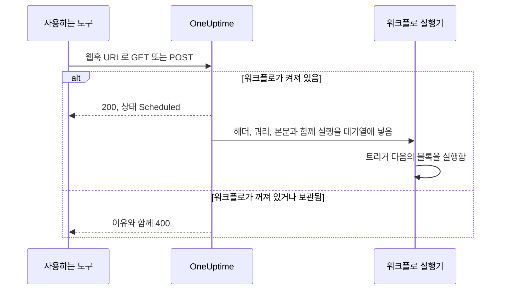
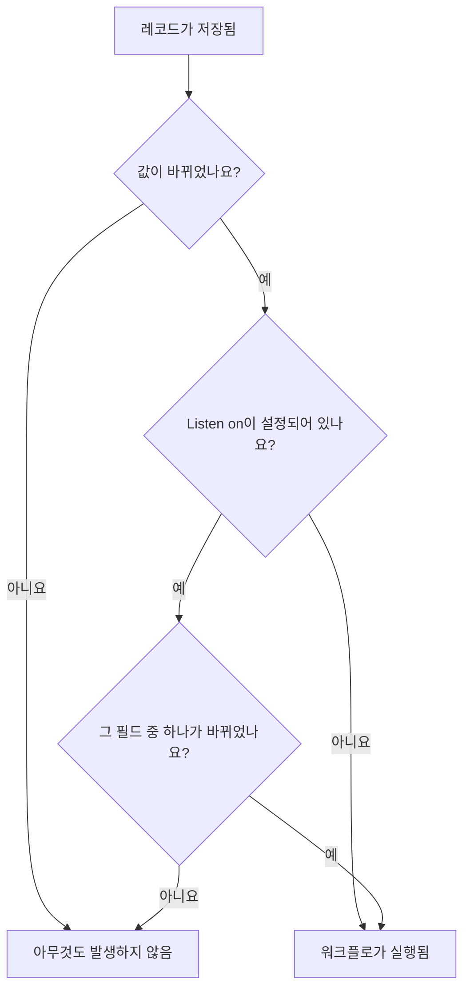

# 워크플로우 트리거

트리거는 워크플로의 첫 번째 블록으로, 워크플로가 언제 실행될지 결정합니다. 모든 워크플로에는 정확히 하나의 트리거가 있습니다. 다섯 가지 유형 중에서 고릅니다.

:::cards
- [수동](#manual): 빌더나 다른 워크플로에서 워크플로를 시작합니다.
- [일정](#schedule): cron 식으로 쓴 반복 일정에 따라 실행합니다.
- [웹훅](#webhook): 다른 시스템이 URL을 호출해 시작하게 합니다.
- [수신 이메일](#incoming-email): 워크플로 전용 주소로 보낸 이메일마다 시작합니다.
- [OneUptime 이벤트 트리거](#oneuptime-이벤트-트리거): 레코드가 생성, 업데이트, 삭제될 때 반응합니다.
:::

트리거를 추가하려면 새 워크플로의 캔버스에 있는 점선 **Choose what starts this workflow** 블록을 클릭합니다. 바꾸려면 트리거 블록을 삭제하면 점선 블록이 돌아옵니다. [워크플로 작성](/docs/workflows/authoring#블록-추가)을 참조하세요.

## 어떤 트리거를 써야 하나요?

| 하고 싶은 일                                   | 고를 것                     |
| ---------------------------------------------- | --------------------------- |
| 버튼을 클릭해 워크플로를 실행하기              | **Manual**                  |
| 반복 일정에 따라 실행하기                      | **일정**                    |
| 다른 시스템이 데이터를 보내게 하기             | **웹훅**                    |
| 이메일로 시작하기                              | **Incoming Email**          |
| OneUptime 안의 일에 반응하기                   | **OneUptime 이벤트**        |

워크플로에는 트리거를 하나만 둘 수 있습니다. 같은 자동화를 두 가지 방법으로 시작해야 한다면, 공통 로직을 **Manual** 트리거가 있는 워크플로에 만들고, 얇은 "래퍼" 워크플로 두 개에서 **Execute Workflow** 블록으로 그것을 시작하세요.

## Manual

원할 때 워크플로를 실행합니다. **빌더** 페이지에서 **워크플로 실행**을 클릭하고, 트리거의 **JSON**을 채운 뒤 **Run Workflow Manually**를 클릭하고 **Run**으로 확인합니다. 다른 워크플로가 **Execute Workflow** 블록으로 시작할 수도 있습니다.

적합한 용도: "이 키 교체하기"나 "테스트 경고 보내기"처럼 버튼으로 두고 싶은 원클릭 자동화, 그리고 워크플로 사이에서 공유하는 로직.

**Returns**: **JSON** — 실행을 시작할 때 전달된 것.

- **워크플로 실행**에서는 입력한 JSON이 텍스트로 옵니다. 그 안의 필드를 읽으려면 먼저 **Text to JSON** 블록을 거치게 하세요.
- **Execute Workflow** 블록에서는 블록의 **Arguments**에 있는 각 키가 별도의 값이 됩니다. `{"customerId": "42"}` 라면 이후 블록은 `{{local.components.manual-1.returnValues.customerId}}` 를 읽으며, 여기서 `manual-1` 은 Manual 트리거의 ID입니다.

## Schedule

반복 일정에 따라 워크플로를 실행합니다. 빈도는 **Schedule at**에서 정합니다. **Common schedules** 중 하나를 고르거나, **Custom cron** 식을 입력하거나, 식이 들어 있는 **변수**를 고릅니다. 입력란 아래에 일정이 말로 설명되고, **Next runs**가 함께 표시됩니다.

적합한 용도: 야간 정리, 매시간 동기화, 주간 보고서.

시간은 UTC이므로 시각을 고를 때 자신의 시간대에서 환산하세요. cron 식의 다섯 부분은 분, 시, 일, 월, 요일입니다.

| 식            | 실행 시점                              |
| ------------- | -------------------------------------- |
| `*/5 * * * *` | 5분마다.                               |
| `0 * * * *`   | 매시 정각.                             |
| `0 0 * * *`   | 매일 UTC 자정.                         |
| `0 9 * * 1-5` | 평일마다 UTC 9:00.                     |
| `0 9 * * 1`   | 매주 월요일 UTC 9:00.                  |

워크플로가 꺼져 있는 동안에는 아무것도 예약되지 않습니다. **변수**를 쓰는 일정은 `{{local.variables.schedule}}` 같은 워크플로 변수나 전역 변수를 읽습니다. 그것이 유효한 cron 식이 되지 않으면 워크플로가 예약되지 않고, 실행 목록의 실패한 실행에 그 이유가 나옵니다.

일정을 기다리지 않고 워크플로를 테스트하려면 **빌더**에서 **워크플로 실행**을 클릭하세요. 실행이 바로 시작됩니다.

## Webhook

OneUptime이 워크플로에 전용 URL을 줍니다. 그 URL을 호출하는 것은 무엇이든 워크플로를 시작하고, 요청의 헤더, 쿼리 매개변수, 본문을 함께 넘깁니다.

적합한 용도: 다른 도구의 데이터를 OneUptime으로 받아들이기 — CI/CD 콜백, 다른 모니터링 도구의 경고, CRM의 가입 등.

URL을 얻으려면 캔버스에서 웹훅 트리거를 클릭합니다. 설정 맨 위에 URL이 있고, **URL 복사** 버튼, 받는 메서드, 터미널에 붙여 넣어 시험해 볼 수 있는 `curl` 명령이 함께 표시됩니다.

```bash
curl -X POST "https://oneuptime.example.com/workflow/trigger/<secret key>" \
  -H "Content-Type: application/json" \
  -d '{"message": "Hello"}'
```

URL은 `GET` 과 `POST` 를 모두 받습니다. 호출한 쪽은 빠른 확인 응답 `{"status": "Scheduled"}` 를 받습니다. 워크플로 자체는 백그라운드에서 실행되므로, 호출한 쪽은 워크플로가 무엇을 하는지 보지 못합니다. 꺼져 있거나 보관된 워크플로를 호출하면 HTTP 400과 이유와 함께 거부됩니다.



**Returns**:

| 값                       | 담긴 내용                                                                                                              |
| ------------------------ | ---------------------------------------------------------------------------------------------------------------------- |
| **Request Headers**      | 요청의 모든 헤더. `content-type` 처럼 소문자 이름으로 표시됩니다.                                                      |
| **Request Query Params** | URL의 쿼리 매개변수. 이름으로 표시됩니다.                                                                              |
| **Request Body**         | 호출한 쪽이 보낸 본문. `Content-Type: application/json` 으로 보낸 JSON 본문은 필드별로 읽을 수 있습니다.               |

필드 하나를 읽으려면 `{{local.components.webhook-1.returnValues.request-body.message}}` 처럼 참조에 그 이름을 덧붙입니다.

요청이 도착하면, 트리거 다음 블록마다 있는 값 선택기가 그 안에 무엇이 있었는지 압니다. 본문의 필드, 헤더, 쿼리 매개변수가 각자의 내용과 함께 표시되므로, 경로를 입력하는 대신 `incident.title` 을 고를 수 있습니다. 그 전에는 아직 요청이 도착하지 않았다고 표시하고, URL로 보내는 `curl` 명령인 **Copy test request**를 제공합니다. 필드는 요청이 시작한 실행이 끝나는 대로 나타납니다. [앞선 블록의 값 사용하기](/docs/workflows/authoring#앞선-블록의-값-사용하기)를 참조하세요.

다른 도구 없이 워크플로를 테스트하려면 **빌더**에서 **워크플로 실행**을 클릭하고 헤더, 쿼리 매개변수, 본문을 입력하세요.

### URL을 비공개로 유지하기

URL의 마지막 부분은 워크플로의 비밀 키이며, URL을 가진 사람은 누구나 워크플로를 시작할 수 있습니다. 그래서 **표시**를 클릭하기 전까지 키가 가려지고, **URL 복사**는 URL을 보여 주지 않고 전체를 복사합니다.

URL이 유출되면 같은 곳에서 **URL 재설정**을 클릭하세요. 워크플로에 새 URL이 생기고 이전 URL은 즉시 작동을 멈추므로, 그것을 호출하는 모든 것을 업데이트하세요. URL을 보거나 재설정할 수 있는 사람은 워크플로를 편집할 수 있는 사람뿐입니다. [웹훅 보안](/docs/workflows/configuration#웹훅-보안)을 참조하세요.

> [!WARNING]
> URL을 비밀번호처럼 다루세요. URL을 가진 사람은 누구나 로그인하지 않고 워크플로를 시작할 수 있습니다.

## Incoming Email

OneUptime이 워크플로에 전용 이메일 주소를 줍니다. 그 주소로 보낸 이메일은 각각 워크플로를 시작하고, 이메일 내용 — 보낸 사람, 받는 사람, 제목, 텍스트와 HTML, 헤더, 첨부 파일이 있다면 그 이름 — 을 함께 넘깁니다.

적합한 용도: 웹훅을 호출할 수 없는 시스템의 이메일에 대응하기 — 오래된 모니터링 도구의 경고, 공급업체의 상태 알림, 야간 작업이 메일로 보내는 보고서 등.

주소를 얻으려면 캔버스에서 Incoming Email 트리거를 클릭합니다. 설정 맨 위에 주소가 있고 **주소 복사** 버튼이 함께 있습니다. 이 주소를 워크플로를 시작해야 하는 것에 알려 주세요. 이메일만 보낼 수 있는 도구, 공급업체의 알림 설정, 자신의 메일함 전달 규칙 등입니다.

이메일마다 별도의 실행이 시작됩니다. 주소가 받는 사람이나 참조에 있든, 숨은 참조든, 전달 규칙을 거쳤든 이메일은 워크플로에 도착합니다. 주소를 두 번 언급한 이메일도 실행은 하나만 시작합니다.

**Returns**:

| 값              | 담긴 내용                                                                                                |
| --------------- | -------------------------------------------------------------------------------------------------------- |
| **From**        | 보낸 사람의 주소.                                                                                        |
| **To**          | 이메일의 모든 수신자를 한 줄로. 예: `ops@example.com, oncall@example.com`.                               |
| **CC**          | 이메일의 모든 참조 수신자를 한 줄로.                                                                     |
| **Subject**     | 제목 줄.                                                                                                 |
| **Body**        | 이메일의 일반 텍스트.                                                                                    |
| **HTML Body**   | 이메일의 HTML(있는 경우). Body와 HTML Body는 각각 1MB에서 잘립니다.                                      |
| **Headers**     | 이메일의 모든 헤더. `message-id` 처럼 소문자 이름으로 표시됩니다.                                        |
| **Attachments** | 각 첨부 파일의 이름, 유형, 크기. 파일 자체는 저장되지 않습니다.                                          |
| **Received At** | OneUptime이 이메일을 받은 시각.                                                                          |

이메일이 도착하면, 트리거 다음 블록마다 있는 값 선택기가 그 안에 무엇이 있었는지 압니다. 이메일에 있던 각 헤더와 각 첨부 파일이 내용과 함께 표시되므로, 경로를 입력하는 대신 `headers.message-id` 를 고를 수 있습니다. 그 전에는 아직 주소에 도착한 이메일이 없다고 표시합니다. [앞선 블록의 값 사용하기](/docs/workflows/authoring#앞선-블록의-값-사용하기)를 참조하세요.

이메일을 보내지 않고 워크플로를 시험하려면 **빌더** 페이지에서 **워크플로 실행**을 클릭하고 보낸 사람, 제목, 본문을 입력하세요. 입력하지 않은 값은 비어 있는 상태로 도착합니다.

이메일은 워크플로가 켜져 있는 동안에만 워크플로를 시작합니다. 꺼진 워크플로로 보낸 이메일은 무시되며, 트리거가 더 이상 Incoming Email이 아닌 워크플로로 보낸 이메일도 무시됩니다.

### 주소를 비공개로 유지하기

주소의 `@` 앞부분에는 워크플로의 비밀 키가 들어 있으며, 주소를 가진 사람은 누구나 워크플로를 시작할 수 있습니다. 그래서 **표시**를 클릭하기 전까지 키가 가려지고, **주소 복사**는 주소를 보여 주지 않고 전체를 복사합니다.

주소가 유출되면 같은 곳에서 **주소 재설정**을 클릭하세요. 워크플로에 새 주소가 생기고 이후로 이전 주소로 온 이메일은 무시되므로, 워크플로에 메일을 보내는 모든 것에 새 주소를 알려 주세요. 주소를 보거나 재설정할 수 있는 사람은 워크플로를 편집할 수 있는 사람뿐입니다. [수신 이메일 보안](/docs/workflows/configuration#수신-이메일-보안)을 참조하세요.

> [!WARNING]
> 누구나 이메일에 아무 보낸 사람이나 넣을 수 있으므로, **From**은 누가 보냈는지에 대한 증거가 아닙니다. 단계가 중요한 일을 하기 전에, 진짜 보낸 사람만 아는 것을 확인하세요.

> [!NOTE]
> 셀프 호스팅 설치에서는 관리자가 구성한 수신 이메일 공급자를 통해 OneUptime이 이메일을 받습니다. [SendGrid Inbound Email](/docs/self-hosted/sendgrid-inbound-email)을 참조하세요. 그 전까지는 트리거에 주소가 없으며, 설정에 그렇게 표시됩니다.

## OneUptime 이벤트 트리거

OneUptime의 거의 모든 것 — 모니터, 인시던트, 경고, 예정된 유지보수, 상태 페이지, 온콜 정책, 팀 — 이 워크플로를 시작할 수 있습니다. 각각 최대 세 가지 이벤트를 제공합니다.

- **On Create** — 새로 추가될 때 발생합니다.
- **On Update** — 변경될 때 발생합니다. 이미 가진 값 그대로 레코드를 저장하는 것(변경 없이 저장한 양식이나 이미 그 상태인 스위치를 보낸 것 등)은 변경이 아니므로 발생하지 않습니다.
- **On Delete** — 삭제될 때 발생합니다.

이렇게 하면 루프로 무언가를 계속 확인하지 않고도 "OneUptime에서 X가 일어나면 Y를 한다"를 만들 수 있습니다.

**On Update**는 **Listen on**으로 일부 필드에만 반응하도록 좁힐 수 있습니다. 그러면 업데이트가 그중 하나를 어떤 값으로든 바꿀 때만 발생합니다. 스위치를 끄거나 필드를 비우는 것도 포함됩니다.



**On Create**와 **On Update**는 트리거의 **Select Fields**에서 고른 필드와 함께 레코드를 다음 블록으로 넘깁니다. 예를 들어 **Incident → On Create** 트리거는 새 인시던트를 넘기므로, 다음 블록은 `{{local.components.incident-on-create-1.returnValues.model.title}}` 처럼 그 제목, 설명, 심각도 또는 선택한 다른 어떤 필드든 읽을 수 있습니다. 선택하지 않은 필드는 비어 있는 상태로 도착합니다.

**On Delete**는 삭제된 레코드의 ID만 넘깁니다. 워크플로가 실행될 때는 레코드가 이미 없으므로 다른 필드는 읽을 수 없습니다.

이벤트를 기다리지 않고 이벤트 트리거를 테스트하려면 **빌더**에서 **워크플로 실행**을 클릭하고 **인시던트 ID** 같은 기존 레코드의 ID를 입력하세요. 실행은 선택한 필드와 함께 그 레코드를 읽어 옵니다.

### 팀이 가장 많이 쓰는 이벤트

| 리소스                                    | 팀이 쓰는 용도                                                                            |
| ----------------------------------------- | ----------------------------------------------------------------------------------------- |
| **인시던트**                              | 인시던트가 선언, 업데이트(확인됨, 해결됨), 삭제될 때 반응하기.                            |
| **경고**                                  | 경고에 대한 같은 세 가지 이벤트.                                                          |
| **모니터**                                | 모니터가 추가, 편집, 제거될 때 반응하기.                                                  |
| **예정된 유지보수 이벤트**                | 유지보수 기간이 예약되면 자동으로 공지하기.                                               |
| **상태 페이지 구독자**                    | 상태 페이지를 구독한 사람을 환영하기.                                                     |
| **온콜 정책**                             | 정책 변경을 다른 온콜 시스템과 동기화하기.                                                |

**Add Trigger** 패널에서는 **OneUptime resources** 아래에 있습니다. 리소스를 클릭한 다음 트리거를 클릭하세요. **Browse all resources**에는 모두 있고, 검색 상자는 `incident created` 처럼 몇 단어로 트리거를 찾아 줍니다.

## 다음 단계

:::cards
- [구성 요소](/docs/workflows/components): 트리거 다음에 추가하는 동작.
- [변수](/docs/workflows/variables): 트리거가 넘긴 것을 이후 블록에서 읽습니다.
- [실행 기록](/docs/workflows/runs-and-logs): 트리거가 발생했는지 확인하고 무엇을 가져왔는지 봅니다.
:::
