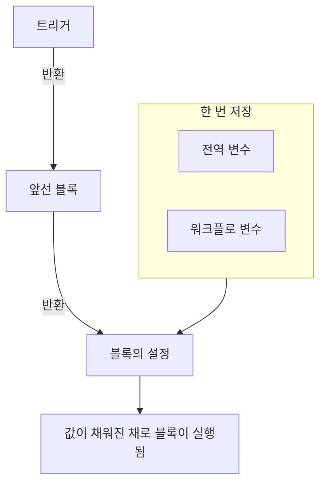
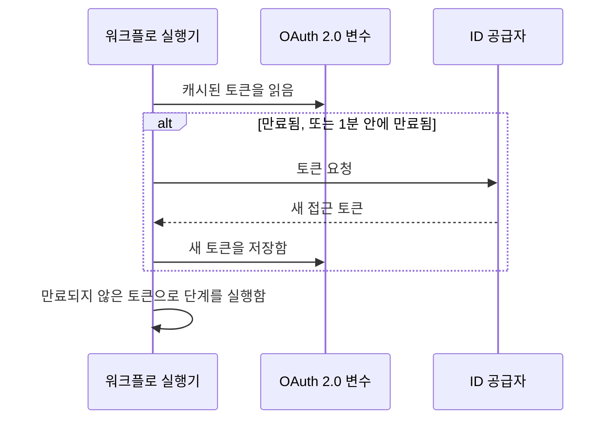

# 워크플로우 변수

변수는 데이터가 워크플로 안에서 움직이는 방식입니다. 트리거에서 첫 번째 블록으로, 한 블록에서 다음 블록으로, 그리고 한 번 저장한 값에서 그 값이 필요한 모든 블록으로 흐릅니다. 블록의 설정은 이중 중괄호로 감싼 참조로 값을 읽고, 실행기는 블록이 실행되기 직전에 그 값을 채웁니다.

| 값                             | 출처                                                                 | 블록이 읽는 방법                                      |
| ------------------------------ | -------------------------------------------------------------------- | ----------------------------------------------------- |
| **전역 변수**                  | **워크플로 → 전역 변수**에 저장                                      | `{{global.variables.NAME}}`                          |
| **워크플로 변수**              | 한 워크플로의 **워크플로 변수** 페이지에 저장                        | `{{local.variables.NAME}}`                           |
| **앞선 블록의 값**             | 이번 실행에서 트리거나 앞선 블록이 반환한 것                         | `{{local.components.BLOCK_ID.returnValues.VALUE_ID}}` |



참조를 직접 입력할 일은 드뭅니다. 설정 끝의 **{ }** 를 클릭하거나 설정에 `{{` 를 입력하고 목록에서 값을 고르세요. [앞선 블록의 값 사용하기](/docs/workflows/authoring#앞선-블록의-값-사용하기)를 참조하세요.

## 전역 변수

한 번 저장하고 모든 워크플로에서 다시 쓰는 프로젝트 전체의 값입니다. API 키, URL, 채널 이름 등 열 개의 워크플로에 따로 복사하고 싶지 않은 모든 것입니다.

:::steps
### 전역 변수 열기

**워크플로 → 전역 변수**로 가서 **워크플로 변수 만들기**를 클릭합니다.

### 변수 이름 정하기

**변수** 단계에서 다음을 채웁니다.

- **이름** — 변수를 참조할 때 쓰는 이름입니다. 두 글자 이상이어야 하고, 공백 없이 문자, 숫자, 하이픈, 밑줄만 쓸 수 있습니다. `UPPER_SNAKE_CASE` 는 블록 안에서 눈에 잘 띄므로 좋은 습관입니다.
- **설명** — 무엇에 쓰는 변수인지 떠올리게 해 주는 선택적 자유 텍스트입니다.

**다음**을 클릭합니다.

### 값 정하기

**값** 단계에서 다음을 채웁니다.

- **콘텐츠** — 값 자체입니다. 긴 텍스트용 입력란이라 여러 줄 값도 됩니다.
- **시크릿** — 켜면 값이 실행 로그와 단계 추적에서 제거됩니다.

**워크플로 변수 만들기**를 클릭합니다. 그 전에 이름이나 설명을 바꾸려면 양식 옆의 단계 목록(넓은 화면에서 표시)에서 **변수**를 클릭하세요. 두 단계에서 입력한 내용은 유지됩니다.
:::

전역 변수는 어떤 워크플로에서든 이렇게 씁니다.

```text
{{global.variables.NAME}}
```

예를 들어 PagerDuty 키를 `PAGERDUTY_KEY` 로 저장했다면, 어떤 블록이든 `{{global.variables.PAGERDUTY_KEY}}` 로 쓸 수 있습니다. 편집기는 참조를 저장하고, 워크플로 로그 기록은 확인된 비밀 값을 제거합니다.

목록에는 각 변수의 이름과 설명이 표시됩니다. 행에서 **보기**를 클릭하면 변수 페이지가 열립니다. 그 페이지는 변수가 정적인지 OAuth 2.0인지 보여 주며, 나머지 작업은 모두 거기서 합니다.

| 버튼                                       | 하는 일                                                                                                                                          |
| ------------------------------------------ | ------------------------------------------------------------------------------------------------------------------------------------------------ |
| **변수 편집**                              | 이름, 설명, 그리고 아직 시크릿이 아닌 정적 변수라면 시크릿 표시를 바꿉니다. 한 번 시크릿이 된 변수는 계속 시크릿으로 남습니다.                    |
| **Update Content**                         | 정적 값을 바꿉니다. 저장된 내용은 다시 읽을 수 없으므로, 새 값을 통째로 입력합니다.                                                              |
| **Use in Workflows**                       | 블록에 붙여 넣을 정확한 참조를 복사 버튼과 함께 보여 줍니다.                                                                                     |
| **워크플로 변수 삭제**                     | 확인을 요청한 뒤 삭제합니다. 확인 메시지에 변수 이름이 나오므로 맞는 변수인지 확인할 수 있습니다.                                                |

대신 **OAuth 2.0 접근 토큰**용 변수를 만들려면 **워크플로 변수 만들기** 옆의 **더보기** 메뉴(**⋯**)를 열고 **Create OAuth 2.0 Variable**을 고르세요. OAuth 2.0 변수는 아래 [별도 섹션](#oauth-20-변수스스로-갱신되는-토큰)에서 다룹니다. 변수의 유형은 저장한 뒤에는 바꿀 수 없습니다.

API로도 변수를 업데이트할 수 있으며, 방법은 [이 페이지 끝](#워크플로에서-변수-갱신하기)에 있습니다. 전역 변수와 워크플로 변수는 Growth 플랜의 기능입니다.

## 워크플로 로컬 변수

한 워크플로에 속한 변수로, 그 워크플로 메뉴의 **워크플로 변수**에서 관리합니다. 전역 변수와 똑같이 작동합니다. **워크플로 변수 만들기**는 정적 변수를, **더보기** 메뉴(**⋯**)는 OAuth 2.0 변수를 만들고, **보기**는 변수 페이지를 엽니다. 다음과 같이 참조합니다.

```text
{{local.variables.NAME}}
```

템플릿의 Slack 웹훅 URL처럼 그 워크플로에만 필요한 값에 쓰세요. 설정을 묻는 템플릿은 그 설정을 워크플로 변수로 저장하므로, 나중에 블록을 편집하지 않고도 바꿀 수 있습니다.

## OAuth 2.0 변수(스스로 갱신되는 토큰)

정적 변수에 붙여 넣은 bearer 토큰은 만료될 때까지만 작동하며, 보통 한 시간 안에 만료됩니다. 그 뒤로는 누군가 새 토큰을 붙여 넣을 때까지 그 토큰을 쓰는 모든 실행이 `401 Unauthorized` 로 실패합니다. **OAuth 2.0 접근 토큰**용 변수는 토큰 자체가 아니라 OAuth 토큰 교환에 필요한 것을 저장하고, OneUptime이 토큰을 최신 상태로 유지합니다.

다른 변수와 똑같이 사용합니다.

```http
Authorization: Bearer {{global.variables.CRM_API_TOKEN}}
```

### 토큰이 유효하게 유지되는 방식



- 워크플로가 변수를 처음 쓸 때, OneUptime은 ID 공급자의 토큰 엔드포인트에 접근 토큰을 요청하고 저장합니다.
- 변수를 참조하는 각 단계 전에 실행기가 토큰을 확인합니다. 만료되었거나 다음 1분 안에 만료되면, 단계가 실행되기 전에 새 토큰을 가져옵니다. 변수가 얼마나 오래 쓰이지 않았든, 실행이 얼마나 오래 걸렸든 구성 요소는 항상 만료되지 않은 토큰을 받습니다.
- 변수를 실제로 참조하는 단계만 갱신을 일으킵니다. 변수를 한 번도 쓰지 않는 실행은 그 토큰을 가져오지 않으며, 그 공급자가 중단되었다고 실패하지도 않습니다.
- 많은 실행이 동시에 새 토큰이 필요하면, 그중 하나가 가져오고 나머지는 그것을 씁니다.
- 공급자가 토큰의 만료 시점을 알려 주지 않으면(`expires_in` 이 없고, 토큰이 `exp` 클레임이 있는 JWT도 아니면), OneUptime은 실행마다 한 번 새 토큰을 가져와 그 실행의 단계들이 함께 씁니다.

### 권한 부여 유형

| 권한 부여 유형                 | 용도                                                                                                                                                                                                                                                |
| ------------------------------ | --------------------------------------------------------------------------------------------------------------------------------------------------------------------------------------------------------------------------------------------------- |
| **Client Credentials**         | OneUptime이 여러분의 애플리케이션으로 로그인합니다. Microsoft Graph, Auth0나 Okta API, Keycloak 뒤의 내부 서비스 같은 서버 간 API에 흔히 쓰는 선택입니다.                                                                                          |
| **새로 고침 토큰**             | 사용자를 대신하는 위임 접근입니다. 애플리케이션을 한 번 승인하고(예: 공급자의 OAuth playground나 Postman에서), 받은 refresh token을 붙여 넣으세요. OneUptime이 그것을 접근 토큰으로 교환하며, 공급자가 refresh token을 교체하면 새 것을 매번 저장합니다. 클라이언트 시크릿이 없는 공개 클라이언트도 됩니다. |

### 만들기

**Create OAuth 2.0 Variable**은 단계마다 한 가지씩 묻습니다.

1. **변수**: 워크플로가 참조할 이름과 설명.
2. **공급자**: **ID 공급자**를 고르면 OneUptime이 그 **토큰 URL**을 채웁니다.

   | ID 공급자 | 채워지는 토큰 URL |
   |---|---|
   | Microsoft Entra ID | `https://login.microsoftonline.com/{tenant-id}/oauth2/v2.0/token` |
   | Google | `https://oauth2.googleapis.com/token` |
   | Okta | `https://{your-domain}/oauth2/default/v1/token` |
   | Auth0 | `https://{your-domain}/oauth/token` |

   중괄호 부분은 디렉터리(테넌트) ID나 Okta 도메인 같은 자신의 값으로 바꾸세요. URL에 그 부분이 남아 있는 동안 양식은 진행되지 않습니다. 다른 공급자라면 **기타 공급자**를 고르고 토큰 엔드포인트를 직접 입력합니다. 그다음 **권한 부여 유형**을 고릅니다. Google을 고르면 **새로 고침 토큰**이 선택됩니다. Google의 OAuth 클라이언트는 Client Credentials를 쓸 수 없기 때문입니다. 공급자는 양식만 채우며, 변수와 함께 저장되지 않습니다.
3. **자격 증명**: 공급자에 등록한 애플리케이션의 **클라이언트 ID**와 **클라이언트 시크릿**, 그리고 Refresh Token 권한 부여 유형이라면 **새로 고침 토큰**. Refresh Token 권한 부여 유형의 공개 클라이언트는 클라이언트 시크릿을 비워 둘 수 있습니다.
4. **고급**, 모두 선택 사항:
   - **범위**: 공백으로 구분합니다. 비워 두면 공급자의 기본 범위를 받습니다. Client Credentials에서 Microsoft Entra ID는 `/.default` 로 끝나는 범위(`https://graph.microsoft.com/.default` 등)가 필요하고, Okta는 사용자 지정 범위가 필요합니다.
   - **추가 매개변수**: 토큰 요청에 넣을 추가 양식 필드입니다. Auth0의 `audience`(Client Credentials에 필수)나 Azure AD v1의 `resource` 같은 것입니다. 변수를 읽을 수 있는 사람이면 누구나 읽을 수 있으므로, 여기에 시크릿을 넣지 마세요.
   - **클라이언트 인증**: 클라이언트 ID와 시크릿을 HTTP Basic 헤더(기본값)로 보낼지 요청 본문으로 보낼지입니다. 공급자가 `invalid_client` 로 응답하면 다른 쪽을 시도하세요.

일부 필드 아래에는 선택한 공급자에 대한 도움말이 붙습니다. 예를 들어 Microsoft Entra ID가 테넌트 ID를 어디에 보여 주는지, 그리고 클라이언트 시크릿은 시크릿의 **Secret ID**가 아니라 **Value**라는 점입니다.

새 OAuth 2.0 변수를 저장하면 OneUptime이 첫 토큰을 바로 가져오고 공급자가 무엇이라고 답했는지 알려 줍니다. 시크릿이나 URL의 오타는 몇 시간 뒤 실패한 실행이 아니라 그 자리에서 드러납니다. 토큰을 가져오는 일은 변수에 쓰는 일이므로 워크플로 변수를 편집할 권한이 필요합니다. 변수를 만들 수는 있지만 편집할 수는 없다면, 그 변수를 쓰는 첫 워크플로 실행이 토큰을 가져옵니다.

변수 페이지(행에서 **보기** 클릭)에는 **OAuth 2.0 Settings** 카드가 있습니다. **설정 편집**은 같은 **공급자**(토큰 URL), **자격 증명**(클라이언트 ID), **고급**(범위, 추가 매개변수, 클라이언트 인증) 단계를 거칩니다. **다음**으로 넘어가며, **변경 사항 저장**은 마지막 단계에 있습니다. 모든 단계가 이미 채워져 있으므로, 양식 옆의 단계 목록에서 어느 단계든 열 수 있습니다. 설정 하나를 그 단계에서 바꾸고 마지막 단계를 열어 저장하세요. 권한 부여 유형은 저장한 뒤에는 고정됩니다.

### 접근 토큰 카드

OAuth 2.0 변수 페이지의 **접근 토큰** 카드에는 다음 상태 중 하나가 표시됩니다.

| 상태                       | 의미                                                                                                                                 |
| -------------------------- | ------------------------------------------------------------------------------------------------------------------------------------ |
| **Valid**                  | 캐시된 토큰이 아직 만료되지 않았습니다.                                                                                              |
| **만료됨**                 | 최근에 어떤 워크플로도 쓰지 않은 변수라면 정상입니다. 그 변수를 쓰는 다음 실행이 새 토큰을 가져옵니다.                              |
| **아직 가져오지 않음**     | 변수를 만든 뒤 또는 설정을 바꾼 뒤로 토큰을 가져온 적이 없습니다.                                                                    |
| **No expiry reported**     | 공급자가 토큰의 만료 시점을 알려 주지 않아, 실행마다 새 토큰을 가져옵니다.                                                           |
| **Refresh failed**         | 마지막 토큰 가져오기가 실패했습니다. 공급자의 이유가 발생 시각과 함께 전부 표시됩니다. 다음 갱신이 성공하면 사라집니다.              |

상태 아래의 **지금 새로고침**은 새 토큰을 바로 가져옵니다. 워크플로를 실행하지 않고 새 설정을 확인할 때 쓰세요. **OAuth 2.0 Settings** 카드의 **Update Credentials**는 클라이언트 시크릿이나 refresh token을 바꾸고, 그것으로 토큰을 가져옵니다. 설정(토큰 URL, 클라이언트 ID, 범위 등)을 바꾸면 캐시된 토큰이 버려져, 다음 실행이 새 설정으로 토큰을 가져옵니다.

### 공급자가 거부할 때

토큰이 필요했던 단계는 실행되기 전에 실패하고, 실행의 로그에는 변수 이름과 공급자의 응답이 인용됩니다. 예: `Could not get an OAuth 2.0 access token for {{global.variables.CRM_API_TOKEN}}: The token endpoint refused the request (HTTP 400): invalid_grant - Token has been expired or revoked.` 같은 이유가 변수의 **접근 토큰** 카드에도 표시됩니다. Refresh Token 변수에서 `invalid_grant` 는 거의 항상 refresh token 자체가 만료되었거나 취소되었다는 뜻이며, 해결책은 **Update Credentials**입니다.

캐시된 토큰이 실제로는 아직 만료되지 않았는데(1분의 여유 범위 안에 있었을 뿐인데) 갱신이 실패하면, 단계는 캐시된 토큰으로 계속하고 로그에 그렇게 남습니다.

### 보안

- OAuth 2.0 변수는 항상 시크릿입니다. 접근 토큰은 실행 로그와 단계 추적에서 `[REDACTED]` 로 바뀌며, 실행 도중에 교체된 토큰도 마찬가지입니다.
- 클라이언트 시크릿, refresh token, 접근 토큰은 데이터베이스에 암호화되어 저장되고, API나 대시보드로 다시 읽을 수 없습니다. **지금 새로고침**은 새 토큰이 언제 만료되는지 알려 줄 뿐, 토큰 자체는 알려 주지 않습니다.
- 토큰 URL은 `http` 또는 `https` 여야 합니다. 루프백, 링크 로컬, 클라우드 메타데이터 주소로의 요청은 거부됩니다. OneUptime Cloud에서는 사설 네트워크 주소도 거부됩니다. 셀프 호스팅 설치는 자체 네트워크의 ID 공급자에 연결할 수 있습니다. OneUptime은 토큰 요청에서 리디렉션을 따르지 않으므로, 토큰 URL에는 엔드포인트가 실제로 응답하는 주소를 지정하세요. 토큰 요청은 20초 후에 포기합니다.

### 기존 정적 토큰을 OAuth 2.0으로 바꾸기

변수의 유형은 저장한 뒤에는 고정됩니다. 정적 변수를 삭제하고 **같은 이름**으로 OAuth 2.0 변수를 만드세요. 워크플로는 변수를 이름으로 참조하므로, 아무것도 바꾸지 않아도 새 변수를 씁니다.

## 구성 요소 출력(앞선 블록에서 온 데이터)

모든 트리거와 구성 요소는 실행 중에 출력을 만들 수 있습니다. 참조는 직접 쓰지 말고 설정의 **{ }** 버튼이나 설정에 `{{` 를 입력해 삽입하세요. 실행기가 기대하는 정확한 ID가 삽입되고, 값은 블록과 값의 이름이 적힌 칩으로 표시됩니다.

값을 만드는 블록에서 시작할 수도 있습니다. 그 블록의 설정은 **Returns** 아래에 각 출력을 정확한 참조와 복사 버튼과 함께 보여 줍니다.

앞선 블록의 출력은 이렇게 참조합니다.

```text
{{local.components.COMPONENT_ID.returnValues.FIELD_ID}}
```

`COMPONENT_ID` 는 블록의 **Identifier**입니다. 블록에 적힌 이름이 아니라 블록에 표시되는 짧은 ID입니다. 새 블록에는 `api-get-1` 같은 ID가 붙으며, 블록의 **ID** 섹션에서 이름을 바꿀 수 있습니다. 이름을 바꾸면, 변수 이름을 바꿀 때와 마찬가지로 이미 그것을 가리키는 모든 참조가 깨집니다. `FIELD_ID` 는 값의 ID이며, 그 뒤의 경로로 JSON 값 안의 필드를 읽습니다.

| 이런 블록 다음이라면…                                     | 읽을 것                                                                                |
| --------------------------------------------------------- | -------------------------------------------------------------------------------------- |
| ID가 `lookup-user` 인 **API** 블록                        | 상태 코드: `{{local.components.lookup-user.returnValues.response-status}}`. 본문: `{{local.components.lookup-user.returnValues.response-body}}`. |
| ID가 `transform` 인 **Run Custom JavaScript** 블록        | 반환한 것: `{{local.components.transform.returnValues.returnValue}}`.                  |
| ID가 `incident-on-create-1` 인 **On Create Incident** 트리거 | 인시던트 제목: `{{local.components.incident-on-create-1.returnValues.model.title}}`. 레코드 트리거는 값 하나 `model` 을 반환하며, 그 안으로 들어가 읽습니다. |

블록 값은 현재 실행 중에만 존재합니다. 새 실행은 매번 처음부터 시작합니다.

## 변수를 쓸 수 있는 곳

거의 모든 텍스트 입력란이 변수를 받습니다.

- API 블록의 URL.
- Slack, Teams, Discord, Telegram, IRC, Email의 메시지 텍스트.
- 이메일의 제목과 본문.
- 헤더와 본문 필드(문자열 값 안).
- **If / Else** 블록의 양쪽.

JSON 입력란 — 레코드 구성 요소의 **Data (JSON Object)**, **Query**, **Select Fields**, API 블록의 **Request Body**, **Run Custom JavaScript**의 **Arguments** — 에서는 참조가 놓인 위치에 따라 채워집니다.

- **따옴표 안에서는 텍스트입니다.** `{"title": "Down: {{local.components.ci-webhook.returnValues.request-body.service}}"}` 는 값을 문자열 안에 넣습니다. 값에 있는 따옴표, 백슬래시, 줄 바꿈은 이스케이프되므로 JSON은 유효하게 유지되고 값은 하나의 문자열로 남습니다.
- **혼자 있으면 값 그 자체입니다.** `{"customFields": {{local.components.transform.returnValues.returnValue}}}` 는 객체 전체를 넣고, 목록은 목록으로, 숫자는 숫자로 남습니다. 그 자체가 JSON인 텍스트 — `5`, `true`, 또는 블록이 JSON 텍스트로 반환한 객체 — 는 그 값으로 들어갑니다. 그 밖의 텍스트는 문자열로 들어갑니다.

키의 따옴표 안에 있는 참조도 텍스트입니다. 구조를 동적으로 만들어야 한다면 **Run Custom JavaScript** 블록으로 만들고 그 출력을 다음 블록에 넘기세요.

**Run Custom JavaScript** 블록은 변수를 자동으로 받지 않습니다. 샌드박스에는 아무것도 주입되지 않습니다. 블록의 JSON 입력란 **Arguments**에 `{{global.variables.NAME}}` (또는 아무 구성 요소 참조)를 넣으세요. 그 값은 스크립트가 실행되기 전에 채워지고 `args` 로 도착합니다.

## 배열 순회하기

텍스트 입력란에서는 `{{#each path}}…{{/each}}` 로 목록의 각 항목마다 텍스트 일부를 반복할 수 있습니다. 블록 안에서 `{{property}}` 는 현재 항목에서 읽고, `{{@index}}` 는 0부터 시작하는 그 위치이며, `{{this}}` 는 단순한 값의 목록에서 항목 자체입니다. `{{#each}}` 블록 안의 이름은 앞뒤 공백이 제거되므로, 거기서는 여분의 공백이 문제가 되지 않습니다. 다른 모든 곳과는 다릅니다.

예를 들어 이 **Message Text**는 웹훅이 보낸 각 경고를 나열합니다.

```text title="Message Text"
{{#each local.components.ci-webhook.returnValues.request-body.alerts}}
- {{@index}}: {{name}} is {{status}}
{{/each}}
```

## 예제

### 웹훅으로 페이로드 만들기

웹훅이 `{ "service": "checkout", "status": "failed" }` 같은 본문과 함께 도착합니다. 이것을 OneUptime 인시던트로 만들려면:

1. ID가 `ci-webhook` 인 **웹훅** 트리거.
2. **If / Else** 블록: **Value to check**는 웹훅 Request Body의 `status` 필드(`{{local.components.ci-webhook.returnValues.request-body.status}}`), **Comparison**은 **is equal to**, **Compare with**는 `failed`.
3. **Yes** 분기에서 다음 내용의 **Create One Incident** 블록:
   - 제목: `CI build failed: {{local.components.ci-webhook.returnValues.request-body.service}}`
   - 설명: `See {{local.components.ci-webhook.returnValues.request-body.url}} for the logs.`

### API 호출에서 시크릿 사용하기

PagerDuty를 호출하는 워크플로:

1. `PAGERDUTY_KEY` 를 비밀 전역 변수로 저장합니다.
2. **API** 블록에서 `Authorization` 헤더를 `Token token={{global.variables.PAGERDUTY_KEY}}` 로 설정합니다.

키는 워크플로와 로그에 드러나지 않습니다.

### API 호출 두 개 잇기

첫 번째 호출이 두 번째 호출에 필요한 ID를 줍니다.

1. **API** 구성 요소 `lookup-order`: **URL**의 `/orders?email=` 뒤에서 **{ }** 를 사용해 수동 트리거의 JSON을 경로 `email` 로 삽입합니다.
2. **API** 구성 요소 `cancel-order`: `POST /orders/{{local.components.lookup-order.returnValues.response-body.id}}/cancel`.

`lookup-order` 가 실패하면 **Success** 대신 **Error** 출력이 발생합니다. 실패가 눈에 띄지 않고 지나가지 않도록 그것을 Email이나 Slack 블록에 연결하세요.

## 워크플로에서 변수 갱신하기

흔한 패턴은 일정에 따라 자격 증명을 교체하는 것입니다. 제3자에게서 새 토큰을 가져와 변수에 다시 저장하면 다음 실행이 그것을 씁니다. 이는 OneUptime API를 호출하는 **API** 블록으로 합니다.

자격 증명이 OAuth 2.0 접근 토큰이라면 이것을 직접 만들 필요가 없습니다. [OAuth 2.0 변수](#oauth-20-변수스스로-갱신되는-토큰)가 스스로 토큰을 가져오고 갱신합니다.

`ApiKey` 헤더와 함께 `PUT /api/workflow-variable/<variable-id>` 를 보내되, 바꾸려는 필드를 — 많은 사람이 여기서 실수합니다 — **`data` 객체로 감싸서** 보내세요.

```json title="Request Body"
{
  "data": {
    "content": "{{local.components.get-token.returnValues.response-body.access_token}}"
  }
}
```

`data` 로 감싸지 않은 평평한 본문은 400으로 거부됩니다. 실제로 바꾸려는 필드만 보내세요. `name` 과 `description` 은 페이로드에서 빼도 됩니다.

API 키에는 **Edit Workflow Variables**가 있어야 합니다. 읽기 권한은 필요 없습니다. 업데이트가 행을 다시 읽지 않기 때문입니다.

주의할 점 두 가지:

- **참조하고 있는 변수의 이름을 바꾸지 마세요.** `name` 은 `{{local.variables.NAME}}` 의 일부입니다. 바꾸면 기존 참조가 모두 확인되지 않은 채로 남고, 확인되지 않은 참조는 문자 그대로의 텍스트로 넘어갑니다. [주의 사항](#주의-사항)을 참조하세요.
- **변수는 이렇게 쓸 수는 있지만 다시 읽을 수는 없습니다.** API에서 `content` 는 시크릿이든 아니든 모든 변수에 대해 쓰기 전용입니다. 그래서 변수는 교체되는 토큰을 두기에 안전한 곳입니다. 시크릿으로 표시하면 값이 실행 로그와 단계 추적에도 남지 않습니다.

## 주의 사항

- **{ } 를 쓰세요(또는 `{{` 를 입력하세요).** 실행기가 기대하는 정확한 구성 요소, 반환 값, 변수 ID가 삽입되고, 블록이 실행될 때 존재할 값만 제안됩니다.
- **변수 이름은 대소문자를 구분합니다.** `{{global.variables.MyKey}}` 와 `{{global.variables.mykey}}` 는 다릅니다.
- **확인할 수 없는 참조는 그대로 남으며, 비지 않습니다.** 존재하지 않는 것을 참조해도 오류가 아니고, 빈 문자열이 되지도 않습니다. 중괄호가 그대로 넘어가므로, 단계 ID의 철자가 틀린 `{{local.components.api-get-1.returnValues.body}}` 는 Slack 메시지, URL, 요청 본문에 글자 그대로 들어가고, 실행은 그래도 **Executed**로 보고합니다. 실행의 **단계** 탭은 빠져나간 참조를 모두 언급하는 경고를 그 단계에 표시하고, 그 참조가 있던 설정에 **Did not resolve**라고 표시합니다. 실행의 로그에도 같은 경고 줄이 있습니다.
- **문제 패널은 변수 이름을 확인할 수 없습니다.** 맞출 수 없는 구성 요소 참조 — 알 수 없는 단계 ID, 알 수 없는 반환 값, 잘못된 루트 — 는 저장하기 전에 표시하지만, 변수가 존재하는지는 볼 수 없습니다. 블록의 설정은 볼 수 있습니다. 없는 변수에 대한 참조는 거기서 주황색 칩으로 표시됩니다. 그 밖에는 이름이 바뀐 변수를 실행의 로그만 잡아냅니다.
- **중괄호 안의 공백은 제거되지 않습니다.** `{{ local.variables.NAME }}` 은 `{{local.variables.NAME}}` 과 다른 조회이며 절대 확인되지 않습니다. 유일한 예외는 `{{#each}}` 블록 안으로, 거기서는 이름의 공백이 제거됩니다.

## 다음 단계

:::cards
- [구성 요소](/docs/workflows/components): 각 블록에 필요한 것과 반환하는 것.
- [실행 기록](/docs/workflows/runs-and-logs): 실행에서 각 참조가 어떤 값이 되었는지 봅니다.
- [설정 및 보안](/docs/workflows/configuration#시크릿): 시크릿을 블록, 내보내기, 로그 밖에 둡니다.
:::
