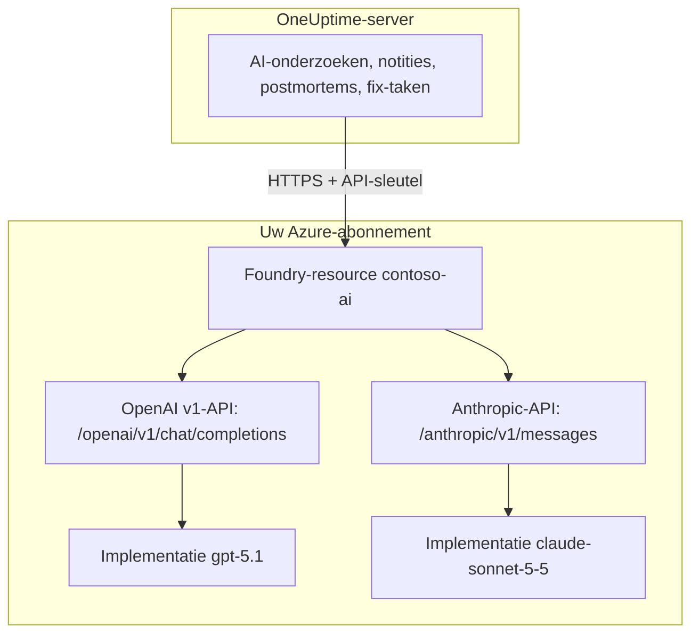

# Microsoft Foundry en Azure OpenAI

Laat de AI-functies van OneUptime draaien op modellen die u implementeert in Microsoft Foundry (voorheen Azure AI Foundry) of Azure OpenAI. OneUptime stuurt elk verzoek rechtstreeks naar uw resource in uw Azure-abonnement, zodat prompts en antwoorden worden verwerkt door de implementatie die u koos, waar u die koos. Deze pagina brengt u van een leeg abonnement naar een werkende provider: de Azure-resource, de modelimplementatie, het eindpunt en de sleutel, de instellingen in OneUptime, het netwerk en wat u doet als een verzoek mislukt.

:::cards
- [Azure instellen](#microsoft-foundry-instellen): Een resource maken, een model implementeren, het eindpunt en de sleutel kopiëren.
- [OneUptime koppelen](#oneuptime-koppelen): Vier velden in de projectinstellingen, daarna de knop Testen.
- [Zelf gehost](#een-zelf-gehoste-instantie-configureren-met-omgevingsvariabelen): Eén provider voor alle projecten, uit omgevingsvariabelen.
- [Probleemoplossing](#probleemoplossing): 401, 403, een ontbrekende implementatie, een api-version.
:::

## Hoe het werkt

OneUptime roept uw Foundry-resource via HTTPS aan vanaf de OneUptime-server, nooit vanuit de browser van gebruikers. Elk verzoek bevat een van de API-sleutels van de resource en noemt de implementatie die het moet beantwoorden.



Eén providertype, **Azure OpenAI / Microsoft Foundry**, dekt elke implementatie op de resource. De basis-URL vertelt OneUptime welke API het moet aanroepen:

| Model dat u implementeert | API die OneUptime aanroept | Basis-URL |
| --- | --- | --- |
| OpenAI-modellen, zoals GPT-5.1 en GPT-4.1 | OpenAI v1 chat completions | `https://contoso-ai.openai.azure.com/openai/v1` |
| Foundry Models met chat completions, zoals DeepSeek en Grok | OpenAI v1 chat completions | `https://contoso-ai.services.ai.azure.com/openai/v1` |
| Claude | Anthropic Messages | `https://contoso-ai.services.ai.azure.com/anthropic` |

> [!IMPORTANT]
> De AI-functies van OneUptime roepen tools aan: terwijl ze werken, bevragen ze uw monitors, incidenten en telemetrie. Implementeer een model dat tool calling (function calling) ondersteunt. De knop **Testen** van de provider controleert dat voor u.

## Voordat u begint

U hebt een Azure-abonnement nodig, een rol waarmee u de resource kunt maken en lezen, en een OneUptime-rol die LLM-providers mag toevoegen.

| Om | Wat u nodig hebt in Azure |
| --- | --- |
| De resource te maken | **Owner** of **Contributor** op de resourcegroep, of **Foundry Account Owner** |
| Een model te implementeren | **Owner** of **Contributor** op de resourcegroep, of **Foundry Owner** of **Foundry Account Owner** op de resource. Claude vraagt daarnaast toestemming om u te abonneren op aanbiedingen in Azure Marketplace |
| De sleutels van de resource te lezen | Een rol met `Microsoft.CognitiveServices/accounts/listKeys/action`, zoals **Owner**, **Contributor** of **Cognitive Services Contributor** |

OneUptime zelf heeft geen Azure-rol nodig. Een sleutel geeft op zichzelf toegang tot elke implementatie op de resource, zonder rolcontrole; behandel hem dus als een wachtwoord.

In OneUptime vraagt het toevoegen van een provider aan een project **Project Owner**, **Project Admin**, **Project Member**, **Settings Admin**, **Settings Member** of **Create LLM**. Een zelf gehoste instantie kan in plaats daarvan uit omgevingsvariabelen één provider voor alle projecten registreren; daarvoor is toegang tot de server nodig.

## Microsoft Foundry instellen

:::steps
### Een resource maken

Maak in de [Foundry-portal](https://ai.azure.com) een Foundry-resource, of kies een bestaande. Een Azure OpenAI-resource werkt op dezelfde manier. Noteer de naam van de resource: het is het eerste deel van het eindpunt, zoals `contoso-ai` in `https://contoso-ai.openai.azure.com`.

Kies een regio die het gewenste model aanbiedt. Laat de netwerktoegang van de resource voorlopig open voor alle netwerken; [Netwerkvereisten](#netwerkvereisten) legt uit wanneer en hoe u die sluit.

### Een model implementeren

Selecteer in de Foundry-portal **Discover**, dan **Models**, en kies een model, bijvoorbeeld `gpt-5.1` of `claude-sonnet-5-5`. Selecteer **Deploy** en dan **Custom settings**:

- **Deployment name**: Foundry vult de naam van het model in. OneUptime vraagt de implementatie op onder deze naam, dus noteer hem precies.
- **Deployment type**: bepaalt waar prompts worden verwerkt. Zie [Waar uw gegevens worden verwerkt](#waar-uw-gegevens-worden-verwerkt).

Selecteer **Deploy** en wacht tot de status van de implementatie **Succeeded** is.

### Het eindpunt en een sleutel kopiëren

Open in de [Azure-portal](https://portal.azure.com) de resource en dan **Resource Management** > **Keys and Endpoint**. Kopieer het **Endpoint** en **KEY 1**. Houd **KEY 2** achter de hand voor rotatie: zet OneUptime erop over en genereer daarna **KEY 1** opnieuw.

In de Foundry-portal staat dezelfde sleutel op het tabblad **Details** van de implementatie, naast de **Target URI**.
:::

:::details Liever de opdrachtregel?
Dezelfde stappen met de Azure CLI. `--model-version` verwacht een versie die de modelcatalogus voor het model vermeldt.

```bash
az cognitiveservices account create \
  --name contoso-ai --resource-group oneuptime-ai \
  --kind AIServices --sku S0 --location eastus2 \
  --custom-domain contoso-ai

az cognitiveservices account deployment create \
  --name contoso-ai --resource-group oneuptime-ai \
  --deployment-name gpt-5.1 \
  --model-name gpt-5.1 --model-version <version> --model-format OpenAI \
  --sku-name GlobalStandard --sku-capacity 50

# KEY 1
az cognitiveservices account keys list \
  --name contoso-ai --resource-group oneuptime-ai \
  --query key1 --output tsv
```

Met `--custom-domain contoso-ai` is het eindpunt van de resource `https://contoso-ai.openai.azure.com`.
:::

## OneUptime koppelen

:::steps
### LLM-providers openen

Ga naar **Projectinstellingen** > **AI** > **LLM-providers** en klik op **LLM-provider aanmaken**.

### De provider een naam geven

Voer onder **Basisinformatie** een **Naam** in, zoals `Azure gpt-5.1`, en eventueel een **Beschrijving**. Klik op **Volgende**.

### Providerinstellingen invullen

| Veld | Wat u invult |
| --- | --- |
| **LLM-provider** | **Azure OpenAI / Microsoft Foundry** |
| **API-sleutel** | **KEY 1** of **KEY 2** van de resource |
| **Modelnaam** | De naam van de implementatie, precies zoals Foundry hem toont, zoals `gpt-5.1` |
| **Basis-URL** | Het eindpunt van de resource met `/openai/v1`, zoals `https://contoso-ai.openai.azure.com/openai/v1`. Voor Claude: `https://contoso-ai.services.ai.azure.com/anthropic` |

**Instellen als standaard**, onder **Meer velden**, staat aan: AI-functies gebruiken de standaardprovider van het project. Klik op **LLM-provider aanmaken**.

### De verbinding testen

Klik in de rij van de provider op **Testen**. Een werkende provider antwoordt "Connection successful. The LLM provider responded to a test prompt and used tool calling." Mislukt de test, dan zegt het bericht wat Azure antwoordde en wat u moet wijzigen; zie [Probleemoplossing](#probleemoplossing).
:::

De voltooide provider, als voorbeeld:

```text
Naam: Azure gpt-5.1
LLM-provider: Azure OpenAI / Microsoft Foundry
API-sleutel: <KEY 1 van contoso-ai>
Modelnaam: gpt-5.1
Basis-URL: https://contoso-ai.openai.azure.com/openai/v1
```

Vanaf nu gebruiken de AI-functies van het project deze implementatie. In OneUptime Cloud worden hun verzoeken niet betaald uit de AI-tegoeden van het project: Azure rekent ze af via uw abonnement.

## Formaten van de basis-URL

OneUptime accepteert het eindpunt in de vormen waarin de Azure- en Foundry-portal het tonen, en stuurt elk verzoek naar het adres ernaast. Kies bij voorkeur de korte: de basis-URL bevat maximaal 100 tekens.

| Basis-URL | Verzoeken gaan naar |
| --- | --- |
| `https://contoso-ai.openai.azure.com` | `https://contoso-ai.openai.azure.com/openai/v1/chat/completions` |
| `https://contoso-ai.openai.azure.com/openai/v1` | `https://contoso-ai.openai.azure.com/openai/v1/chat/completions` |
| `https://contoso-ai.services.ai.azure.com/openai/v1` | `https://contoso-ai.services.ai.azure.com/openai/v1/chat/completions` |
| `https://contoso-ai.openai.azure.com/openai/deployments/gpt-4o` | `https://contoso-ai.openai.azure.com/openai/deployments/gpt-4o/chat/completions?api-version=2024-10-21` |
| `https://contoso-ai.services.ai.azure.com/anthropic` | `https://contoso-ai.services.ai.azure.com/anthropic/v1/messages` |

- **De v1-API** (`/openai/v1`) is de huidige API van Microsoft. Hij heeft geen `api-version` nodig, neemt de naam van de implementatie als model en bedient OpenAI-modellen en andere Foundry Models op dezelfde manier. Gebruik hem voor nieuwe providers.
- **Een implementatie-URL** (`/openai/deployments/<name>`) noemt zelf de implementatie, en Azure volgt die naam in plaats van de **Modelnaam**. OneUptime voegt `api-version=2024-10-21` toe, tenzij de basis-URL een eigen `api-version` heeft. Providers die zo zijn opgeslagen, blijven werken zoals voorheen.
- **De Target URI van een implementatie**, in zijn geheel geplakt vanuit de Foundry-portal, werkt ook, zolang hij in 100 tekens past.
- **Claude**: Foundry levert Claude alleen via de Anthropic Messages API, op het pad `/anthropic` van de resource. OneUptime roept die aan met dezelfde sleutel. Het providertype **Anthropic** bereikt hem ook, met dezelfde basis-URL.

## Een zelf gehoste instantie configureren met omgevingsvariabelen

Op een zelf gehoste instantie registreren de variabelen `GLOBAL_LLM_PROVIDER_*` bij het opstarten één globale LLM-provider, die elk project zonder eigen provider gebruikt, AI-fixtaken inbegrepen. De eigen provider van een project gaat altijd voor.

```bash
GLOBAL_LLM_PROVIDER_TYPE=AzureOpenAI
GLOBAL_LLM_PROVIDER_NAME=Azure gpt-5.1
GLOBAL_LLM_PROVIDER_BASE_URL=https://contoso-ai.openai.azure.com/openai/v1
GLOBAL_LLM_PROVIDER_MODEL_NAME=gpt-5.1
GLOBAL_LLM_PROVIDER_API_KEY=<KEY 1 of contoso-ai>
```

:::tabs
@tab Docker Compose
Voeg de variabelen toe aan `config.env` en start OneUptime opnieuw op zoals u het hebt gestart:

```bash
(export $(grep -v '^#' config.env | xargs) && docker compose up --remove-orphans -d)
```
@tab Kubernetes
Bewaar de sleutel in een Secret en geef de variabelen door met de chartbrede `extraEnv`:

```bash
kubectl create secret generic azure-foundry \
  --namespace oneuptime --from-literal=api-key='<KEY 1 of contoso-ai>'
```

```yaml title="values.yaml"
extraEnv:
  - name: GLOBAL_LLM_PROVIDER_TYPE
    value: AzureOpenAI
  - name: GLOBAL_LLM_PROVIDER_NAME
    value: Azure gpt-5.1
  - name: GLOBAL_LLM_PROVIDER_BASE_URL
    value: https://contoso-ai.openai.azure.com/openai/v1
  - name: GLOBAL_LLM_PROVIDER_MODEL_NAME
    value: gpt-5.1
  - name: GLOBAL_LLM_PROVIDER_API_KEY
    valueFrom:
      secretKeyRef:
        name: azure-foundry
        key: api-key
```

Voer daarna `helm upgrade` uit met deze waarden.
:::

De provider volgt de variabelen: als u ze wijzigt, wordt hij bij de volgende start bijgewerkt, en als u `GLOBAL_LLM_PROVIDER_TYPE` verwijdert, wordt hij verwijderd. Ontbreken voor dit type een sleutel of een basis-URL, dan meldt het opstartlogboek dat. Zie [LLM-providers](/docs/ai/llm-provider) voor elke variabele en elk providertype.

## Netwerkvereisten

De OneUptime-server opent HTTPS-verbindingen, op poort 443, naar de hostnaam van de resource, zoals `contoso-ai.openai.azure.com` of `contoso-ai.services.ai.azure.com`. Sta dit uitgaande verkeer toe in uw firewall of proxy.

- **OneUptime Cloud** bereikt de resource via internet, dus de resource moet openbaar verkeer accepteren. Om de resource van internet af te houden, host u OneUptime zelf.
- **Zelf gehost, privé-eindpunt**: plaats de resource achter een privé-eindpunt in een virtueel netwerk dat de OneUptime-server bereikt, en koppel de privé-DNS-zones `privatelink.openai.azure.com`, `privatelink.services.ai.azure.com` en `privatelink.cognitiveservices.azure.com` eraan, zodat de gewone hostnaam van de resource naar het privé-adres wordt omgezet. De basis-URL blijft hetzelfde.
- **Privé-adressen**: een zelf gehoste instantie maakt verbinding met privé-adressen, tenzij `DATA_SOURCE_BLOCK_PRIVATE_ADDRESSES=true` is ingesteld. Een globale LLM-provider maakt er in beide gevallen verbinding mee.
- **Netwerkregels op de resource**: onder **Networking** van de resource houdt **Selected networks and private endpoints** al het andere buiten. Een verzoek dat een regel weigert, mislukt met een 403.

## Waar uw gegevens worden verwerkt

Het implementatietype dat u kiest wanneer u het model implementeert, bepaalt waar Azure de prompts van OneUptime en de antwoorden van het model verwerkt. Opgeslagen gegevens blijven in de Azure-geografie van de resource.

| Implementatietype | Prompts en antwoorden worden verwerkt |
| --- | --- |
| Global Standard, Global Provisioned | In elke Azure-regio |
| Data Zone Standard, Data Zone Provisioned | Alleen binnen de gegevenszone: de Verenigde Staten, de Europese Unie of Azië-Pacific |
| Standard, Regional Provisioned | Binnen de Azure-geografie van de resource |

Claude-implementaties zijn **Hosted on Azure** of **Hosted on Anthropic**. Kies **Hosted on Azure** om prompts en antwoorden binnen Azure te houden. Zie de [implementatietypen](https://learn.microsoft.com/en-us/azure/foundry/foundry-models/concepts/deployment-types) van Microsoft voor de details.

## Voorbeeld van verzoek en antwoord

Om een implementatie buiten OneUptime te controleren, stuurt u haar met `curl` het verzoek dat OneUptime stuurt:

:::tabs
@tab OpenAI v1 API
```bash
curl https://contoso-ai.openai.azure.com/openai/v1/chat/completions \
  -H "Content-Type: application/json" \
  -H "api-key: $AZURE_API_KEY" \
  -d '{
    "model": "gpt-5.1",
    "messages": [
      { "role": "user", "content": "Reply with the word: OK" }
    ]
  }'
```

Het antwoord, ingekort:

```json
{
  "id": "chatcmpl-7R1nGnsXO8n4oi9UPz2f3UHdgAYMn",
  "object": "chat.completion",
  "model": "gpt-5.1",
  "choices": [
    {
      "index": 0,
      "finish_reason": "stop",
      "message": { "role": "assistant", "content": "OK" }
    }
  ],
  "usage": { "prompt_tokens": 12, "completion_tokens": 2, "total_tokens": 14 }
}
```
@tab Anthropic API
```bash
curl https://contoso-ai.services.ai.azure.com/anthropic/v1/messages \
  -H "Content-Type: application/json" \
  -H "x-api-key: $AZURE_API_KEY" \
  -H "anthropic-version: 2023-06-01" \
  -d '{
    "model": "claude-sonnet-5-5",
    "max_tokens": 1024,
    "messages": [
      { "role": "user", "content": "Reply with the word: OK" }
    ]
  }'
```

Het antwoord, ingekort:

```json
{
  "id": "msg_01XFDUDYJgAACzvnptvVoYEL",
  "type": "message",
  "role": "assistant",
  "model": "claude-sonnet-5-5",
  "content": [{ "type": "text", "text": "OK" }],
  "stop_reason": "end_turn",
  "usage": { "input_tokens": 14, "output_tokens": 4 }
}
```
:::

De verzoeken van OneUptime zelf bevatten meer: de eigen instructies, het gesprek, de tools die het model mag aanroepen en een tokenlimiet. Uit het antwoord leest OneUptime de tekst, de toolaanroepen, waarom het model stopte en het tokengebruik, dat **Projectinstellingen** > **AI** > **AI-logboeken** voor elk verzoek toont. De **Extra parameters** van de provider worden aan elk verzoek toegevoegd.

## Microsoft Entra ID en resources zonder sleutel

OneUptime meldt zich bij de resource aan met een van de API-sleutels. Aanmelden met Microsoft Entra ID, als service-principal of beheerde identiteit, wordt nog niet ondersteund.

Als uw organisatie sleuteltoegang voor AI-resources uitschakelt (`disableLocalAuth`), mislukken verzoeken met `AuthenticationTypeDisabled`. Sta sleuteltoegang toe op de resource die OneUptime gebruikt, of zet Azure API Management ervoor:

1. Importeer de implementatie van de resource in API Management als Azure OpenAI-API. API Management meldt zich dan met zijn eigen beheerde identiteit aan bij de resource.
2. Stel `api-key` in als headernaam van de abonnementssleutel van de API.
3. Stel in OneUptime de **Basis-URL** in op het adres van de API in API Management voor de implementatie, zoals `https://contoso-apim.azure-api.net/aoai/openai/deployments/gpt-5.1`, met de `api-version` die de implementatie nodig heeft, zoals bij elke implementatie-URL. Stel de **API-sleutel** in op een abonnementssleutel van API Management.

Claude-modellen die alleen Microsoft Entra ID accepteren, zoals Claude Mythos, kunnen nog niet worden gebruikt.

## Probleemoplossing

OneUptime zet vooraan in de fout wat u moet wijzigen, daarna het antwoord van Azure zelf. De knop **Testen** toont de fout volledig; de **AI-logboeken** bewaren de eerste 490 tekens.

:::details "Azure did not accept the API key" (401)
De sleutel is onjuist, opnieuw gegenereerd of hoort bij een andere resource. Kopieer **KEY 1** opnieuw uit **Keys and Endpoint** van de resource die de basis-URL noemt, en plak hem in **API-sleutel**.
:::

:::details "Key-based authentication is turned off for this resource" (403)
Azure antwoordde `AuthenticationTypeDisabled`: de resource accepteert alleen Microsoft Entra ID. Zie [Microsoft Entra ID en resources zonder sleutel](#microsoft-entra-id-en-resources-zonder-sleutel).
:::

:::details "Azure refused the request" (403)
Een netwerkregel op de resource hield het verzoek tegen. Vergelijk de instellingen onder **Networking** van de resource met de [netwerkvereisten](#netwerkvereisten).
:::

:::details "This resource has no deployment named ..." (404)
Azure antwoordde `DeploymentNotFound`. Stel de **Modelnaam** in op de naam van de implementatie, precies zoals de Foundry-portal hem vermeldt. Een implementatie die de laatste minuten is gemaakt, is mogelijk nog niet klaar. Is de basis-URL een implementatie-URL, controleer dan de naam na `/openai/deployments/`.
:::

:::details "Azure found nothing at this address" (404)
De basis-URL leidt niet naar een Azure OpenAI-API. Gebruik het eindpunt van de resource met `/openai/v1`, zoals `https://contoso-ai.openai.azure.com/openai/v1`. Het modelinferentie-eindpunt van de stopgezette Azure AI Inference SDK (`/models`) is er geen: gebruik `/openai/v1` op dezelfde resource.
:::

:::details "This model needs api-version ... or later" (400)
Een implementatie-URL vraagt om `api-version=2024-10-21`, tenzij hij een andere noemt, en nieuwere modellen, zoals de o-serie en GPT-5, weigeren zulke oude versies. Zet de basis-URL over op de v1-API, `https://contoso-ai.openai.azure.com/openai/v1`, met de naam van de implementatie als **Modelnaam**. Of voeg de versie die Azure noemt, zoals `?api-version=2024-12-01-preview`, toe aan de basis-URL.
:::

:::details "Azure's v1 API takes no dated api-version" (400)
De basis-URL eindigt op `/openai/v1` en heeft daarnaast een gedateerde `api-version`. Verwijder de `api-version` uit de basis-URL.
:::

:::details "Basis-URL mag niet langer zijn dan 100 tekens."
Een Target URI met zijn `api-version` is vaak langer. Gebruik het eindpunt van de resource met `/openai/v1` en zet de naam van de implementatie in **Modelnaam**.
:::

:::details "...could not be reached" of "...host name could not be resolved"
De OneUptime-server kon geen verbinding maken met de resource. In OneUptime Cloud moet de resource vanaf internet bereikbaar zijn. Controleer op een zelf gehoste instantie dat de server de hostnaam van de resource omzet, via de privé-DNS-zone bij een privé-eindpunt, en dat uitgaand HTTPS is toegestaan.
:::

:::details Te veel verzoeken (429)
Het quotum aan tokens per minuut van de implementatie is op. AI-functies wachten en proberen het opnieuw, tot tien pogingen binnen ongeveer vijf minuten, voordat ze de fout melden; de knop **Testen** geeft eerder op. Verhoog het quotum van de implementatie in de Foundry-portal, of zet haar over op een ander implementatietype.
:::

## Volgende stappen

:::cards
- [LLM-providers](/docs/ai/llm-provider): Alle providertypen en hoe een project er een kiest.
- [AI SRE](/docs/ai/ai-sre): Onderzoeken die op deze provider draaien.
- [Ask AI](/docs/ai/ask-ai): Vragen over uw systeem, beantwoord in het dashboard.
:::
