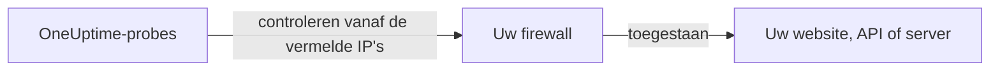

# IP-adressen

De probes van OneUptime Cloud controleren uw websites, API's en servers vanaf een vaste set IP-adressen. Staat er een firewall of een allowlist voor wat u bewaakt, sta deze adressen dan toe zodat de controles erdoor komen.



## Toe te staan IP-adressen

Sta in uw firewall verkeer van deze adressen toe:

{{IP_WHITELIST}}

> [!NOTE]
> Deze adressen kunnen veranderen. OneUptime laat het u van tevoren weten als dat gebeurt. Om bij te blijven zonder op aankondigingen te letten, [haalt u de lijst op](#de-lijst-programmatisch-ophalen) wanneer u uw firewall bijwerkt.

## De lijst programmatisch ophalen

Dezelfde lijst wordt als JSON aangeboden, zonder API-sleutel, zodat een script uw firewallregels bij kan houden:

```bash
curl -s https://oneuptime.com/ip-whitelist
```

```json
{
  "ipWhitelist": ["<list of IPs>"]
}
```

`ipWhitelist` is een array met één adres per item. Zo drukt u één adres per regel af, bijvoorbeeld voor een firewallscript:

```bash
curl -s https://oneuptime.com/ip-whitelist | jq -r '.ipWhitelist[]'
```

## Zelf gehoste OneUptime

Op uw eigen instantie tonen deze pagina en het eindpunt `/ip-whitelist` de adressen uit de instelling `IP_WHITELIST` van de instantie, een door komma's gescheiden lijst. Vul de adressen in waarvandaan uw eigen probes hun controles versturen.

:::tabs
@tab Kubernetes
Stel de waarde `ipWhitelist` van de Helm-chart in:

```yaml title="values.yaml"
ipWhitelist: "203.0.113.1,203.0.113.2"
```
@tab Docker Compose
`config.env` geeft de instelling niet door aan de app. Voeg haar toe aan de omgeving van de service `app` in een `docker-compose.override.yml` naast `docker-compose.yml` en start OneUptime daarna opnieuw:

```yaml title="docker-compose.override.yml"
services:
  app:
    environment:
      IP_WHITELIST: "203.0.113.1,203.0.113.2"
```
:::

Is er niets ingesteld, dan toont deze pagina **No IP addresses configured.** en geeft het eindpunt een lege array `ipWhitelist` terug.

## Volgende stappen

:::cards
- [Aangepaste probes](/docs/probe/custom-probe): Een probe in uw eigen netwerk draaien in plaats van de firewall te openen.
- [Een monitor maken](/docs/monitor/create-monitor): Beginnen met het controleren van een website, API of server.
:::
