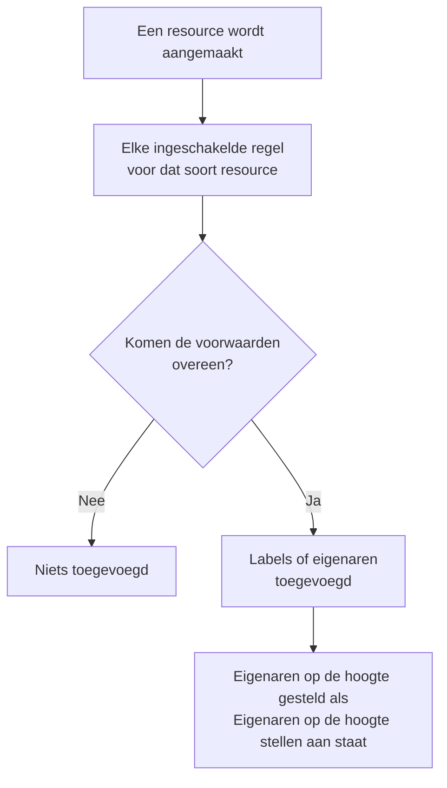

# Label- en eigenaarsregels

Labelregels en eigenaarsregels ordenen uw resources voor u. Een **labelregel** voegt labels toe aan elke nieuwe resource waarop hij van toepassing is, en een **eigenaarsregel** voegt gebruikers en teams als eigenaar toe: zo krijgt een nieuw database-incident het label _Database_ en is het van het databaseteam, zonder dat iemand eraan hoeft te denken.

:::cards
- [Een regel maken](#een-regel-maken): Twee stappen: waarop de regel van toepassing is, en daarna wat hij toevoegt.
- [Labels en eigenaren overnemen](#labels-en-eigenaren-overnemen): Doorgeven wat de monitoren, hosts en services van een gebeurtenis dragen.
- [Wanneer regels worden uitgevoerd](#wanneer-regels-worden-uitgevoerd): Nieuwe resources, en **Run Now** voor de resources die u al hebt.
:::

## Zo werkt het

Regels worden uitgevoerd wanneer een resource wordt aangemaakt. Elke ingeschakelde regel controleert zijn voorwaarden op de nieuwe resource, en elke regel die van toepassing is, voegt toe wat hij toevoegt.

Met labels en eigenaren filtert en groepeert u resources, ze bepalen wie OneUptime over die resources informeert en wat [machtigingen die tot labels of eigen resources zijn beperkt](/docs/permissions/index) bereiken. Regels houden ze consistent zonder dat iemand eraan hoeft te denken.

## Waar u de regels vindt

Elk product met labels en eigenaren heeft beide regels onder zijn **Instellingen** (bij incidenten, waarschuwingen en gepland onderhoud onder **Regels**): monitoren, incidenten en incidentepisodes, waarschuwingen en waarschuwingsepisodes, geplande onderhoudsgebeurtenissen, statuspagina's, services, hosts, Kubernetes-clusters, Docker-hosts, Docker Swarm-clusters, Podman-hosts, Proxmox-clusters, VMware vCenters, Ceph-clusters, storage-arrays, databases, wachtrijen, IoT-vloten, serverless functies, cloudresources, RUM-applicaties, dashboards, dienstbeleid, dienstroosters, beleid voor inkomende oproepen, workflows, runbooks, netwerkapparaten en SLO's.

Labelregels voor monitoren staan bijvoorbeeld onder **Monitoren → Instellingen → Labelregels**, die voor incidenten onder **Incidenten → Regels → Labelregels**. **Instellingen** en **Regels** zijn in het zijmenu eerst ingeklapt: klik op de titel van de sectie om die te openen. De pagina's voor incidenten en waarschuwingen hebben een tabblad **Incident Rules** (of **Alert Rules**) en een tabblad **Episode Rules**.

## Een regel maken

Elke label- en eigenaarsregel wordt op dezelfde manier gemaakt, in twee stappen.

:::steps
### De lijst met regels openen

Open de pagina **Labelregels** of **Eigenaarsregels** van het product en klik op de knop om een regel te maken, die naar de regel is genoemd, bijvoorbeeld **Monitor Label Rule aanmaken**.

### Kiezen waarop de regel van toepassing is

Klik in de stap **Overeenkomst** op **Voorwaarde toevoegen** voor elke voorwaarde waaraan de resource moet voldoen. Kies bij twee of meer voorwaarden **Voldoet aan alle** of **Voldoet aan één**. Een regel zonder voorwaarden is van toepassing op elke nieuwe resource.

### Kiezen wat de regel toevoegt

Kies in de stap **Labels** de **Toe te voegen labels**. Bij een eigenaarsregel heet de stap **Eigenaren**: **Eigenaar toevoegen** opent één lijst met personen en teams.

De **Naam** wordt ingevuld op basis van uw keuze (_Production toevoegen_, _Platform als eigenaren toevoegen_) en volgt uw keuze tot u zelf een naam typt. Een regel die alleen overneemt, wordt in plaats daarvan genoemd naar waarvan hij overneemt (zie hieronder).

### De ingeklapte velden controleren

**Meer velden** bevat de optionele **Beschrijving** en, bij een eigenaarsregel, **Eigenaren op de hoogte stellen**, dat standaard aan staat: de eigenaren die een regel toevoegt, krijgen dezelfde melding "u bent als eigenaar toegevoegd" als een eigenaar die met de hand is toegevoegd. Zet het uit om eigenaren zonder melding toe te voegen.

### De regel opslaan

Klik in de laatste stap opnieuw op de knop die naar de regel is genoemd, bijvoorbeeld **Monitor Label Rule aanmaken**. De regel begint ingeschakeld, en de lijst toont hem met een groen label **Ingeschakeld**.
:::

Een nieuwe regel moet iets toevoegen: minstens één label (of eigenaar) of, bij een regel voor incidenten, waarschuwingen of gepland onderhoud, iets wat hij overneemt (zie hieronder). Om een regel te pauzeren zonder hem te verwijderen, zet u **Ingeschakeld** uit in het bewerkingsformulier; de lijst toont dan een rood label **Uitgeschakeld**.

### Hoe de regel ook wordt gemaakt

Hetzelfde geldt voor een regel die via de API, Terraform, een workflow of een [import van labelregels](/docs/configuration/label-rule-import-export) wordt gemaakt: OneUptime weigert een nieuwe regel die niets toevoegt, met een melding die de in te vullen velden noemt. Deze meldingen zijn in elke taal Engels.

| Regel | Melding |
| --- | --- |
| Labelregel | This label rule adds nothing. Choose at least one label in Labels to Add. |
| Labelregel voor incidenten, waarschuwingen of gepland onderhoud | This label rule adds nothing. Choose at least one label in Labels to Add, or turn on an Inherit Labels switch. |
| Eigenaarsregel | This owner rule adds nothing. Choose at least one user or team in Owner Users or Owner Teams. |
| Eigenaarsregel voor incidenten, waarschuwingen of gepland onderhoud | This owner rule adds nothing. Choose at least one user or team in Owner Users or Owner Teams, or turn on an Inherit Owners switch. |

- **API**: stel `labelsToAdd` (of `ownerUsers` / `ownerTeams`) in op minstens één record van het project, of een van de schakelaars `inheritLabelsFrom…` (`inheritOwnersFrom…`) van de regel op `true`, een JSON-boolean.
- **Terraform**: een resource voor een label- of eigenaarsregel die niets toevoegt, mislukt bij `terraform apply` met de melding hierboven. Geef hem `labels_to_add` (of `owner_users` / `owner_teams`) of zet een van zijn overname-schakelaars aan.

Regels die u al hebt, blijven ongemoeid: zie [Een regel bewerken](#een-regel-bewerken).

## Labels en eigenaren overnemen

Regels voor incidenten, waarschuwingen en gepland onderhoud kunnen ook doorgeven wat de resources dragen die een gebeurtenis raakt. Onder **Toe te voegen labels** (of **Eigenaren**) bevat de ingeklapte sectie **Labels overnemen** (of **Eigenaren overnemen**) zes schakelaars:

- **Labels overnemen van monitoren**: elk label van de monitoren van het incident wordt ook aan het incident toegevoegd. Een waarschuwing heeft één monitor, dus bij een waarschuwingsregel heet de schakelaar **Labels overnemen van monitor** (en bij een eigenaarsregel voor waarschuwingen **Eigenaren overnemen van monitor**).
- **Labels overnemen van hosts**, **Labels overnemen van Kubernetes-clusters**, **Labels overnemen van Docker-hosts**, **Inherit Labels From Podman Hosts** en **Labels overnemen van services** doen hetzelfde voor die resources.

Eigenaarsregels hebben dezelfde zes schakelaars voor eigenaren (**Eigenaren overnemen van monitoren** enzovoort). Zolang er geen schakelaar aan staat, zegt de ingeklapte sectie waarvoor ze dient; bij een regel die overneemt, gaat ze vanzelf open. Episoderegels hebben geen overname-schakelaars.

Een regel die overneemt, kan **Toe te voegen labels** (of **Eigenaren**) leeg laten: hij voegt toe wat hij overneemt. Zo'n regel wordt genoemd naar waarvan hij overneemt:

| Ingeschakelde schakelaars | Naam |
| --- | --- |
| **Labels overnemen van monitoren** | _Labels overnemen van: monitoren_ |
| **Labels overnemen van monitoren** en **Labels overnemen van hosts** | _Labels overnemen van: monitoren, hosts_ |
| **Labels overnemen van monitor**, bij een waarschuwingsregel | _Labels overnemen van: monitor_ |

De naam volgt de schakelaars tot u een label kiest (de regel wordt dan naar zijn labels genoemd) of zelf een naam typt.

## Een regel bewerken

Het bewerkingsformulier van een regel heeft dezelfde twee stappen en voegt de schakelaar **Ingeschakeld** toe. Het eist niet wat de regel toevoegt: een regel die werd opgeslagen voordat OneUptime ernaar vroeg (via de API, Terraform, een import of het oude formulier), voegt misschien helemaal niets toe, en een bewerking kan alles weghalen wat een regel toevoegt.

Zo'n regel kunt u nog steeds hernoemen, uitschakelen of verwijderen, ook via de API en Terraform. De lijst markeert een regel die niets toevoegt naast zijn status met **Voegt niets toe**, en de eigen pagina van de regel doet hetzelfde. Bewerk hem om te kiezen wat hij toevoegt, of verwijder hem.

## Wanneer regels worden uitgevoerd

Elke ingeschakelde regel wordt uitgevoerd wanneer een resource wordt aangemaakt, vanuit het dashboard of via de API, en elke regel die van toepassing is, voegt toe wat hij toevoegt:

- Zijn meerdere regels van toepassing, dan voegen ze allemaal hun labels en eigenaren toe.
- Een regel verwijdert nooit iets: geen labels of eigenaren die iemand met de hand heeft toegevoegd, en ook niet de labels en eigenaren die hij zelf heeft toegevoegd.
- Een uitgeschakelde regel doet niets.

Een regel die u vandaag schrijft, geldt voor de resources die daarna worden aangemaakt. Om hem toe te passen op de resources die u al hebt, gebruikt u **Run Now**: zie [Regels uitvoeren op bestaande resources](/docs/configuration/run-rules-now). Labelregels kunnen ook tussen projecten worden gekopieerd: zie [Labelregels importeren en exporteren](/docs/configuration/label-rule-import-export).

## Volgende stappen

:::cards
- [Regels uitvoeren op bestaande resources](/docs/configuration/run-rules-now): Een regel toepassen op de resources die u al hebt.
- [Labelregels importeren en exporteren](/docs/configuration/label-rule-import-export): Labelregels als JSON tussen projecten kopiëren.
- [Incidentinstellingen en automatisering](/docs/incidents/settings): De andere regels die een incident kan uitvoeren.
- [Label- en eigenaarsregels voor SLO's](/docs/slo/label-and-owner-rules): Waarop SLO-regels van toepassing zijn.
:::
