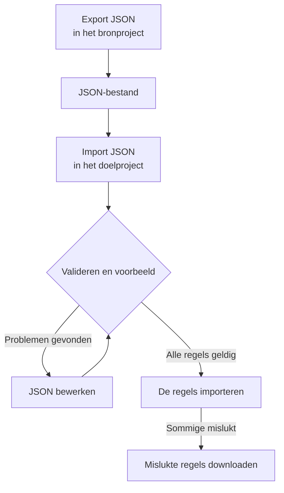

# Labelregels importeren en exporteren

Kopieer labelregels tussen projecten, of maak er veel tegelijk aan, als JSON-bestand. Elke pagina **Labelregels** heeft de acties **Export JSON** en **Import JSON** in het menu **Meer opties** (**⋯**), ook bij incidenten, waarschuwingen, monitoren en netwerkapparaten. De enige uitzondering is VMware: de labelregels voor vCenters hebben geen van beide.



## Regels exporteren

Open **Meer opties** en kies **Export JSON** om alle regels van dat type in het huidige project te downloaden. De export bevat ook regels op andere pagina's van de tabel en negeert tabelfilters.

Het bestand bewaart per regel de status (ingeschakeld of niet), de voorwaarden, de toe te voegen labels en de opties voor het overnemen van labels. Project-ID's, regel-ID's en auditvelden worden weggelaten.

Gekoppelde labels, monitoren en ernstniveaus worden met hun exacte naam geschreven. Een import maakt ze niet aan: ze moeten al in het doelproject bestaan.

## Regels importeren

:::steps
### Import JSON openen

Open de pagina **Labelregels** van het doelproject en kies **Meer opties → Import JSON**.

### Het bestand toevoegen

Upload een JSON-exportbestand of plak de inhoud ervan.

### Valideren en het voorbeeld tonen

Kies **Validate and preview**. Elke regel wordt gecontroleerd voordat er ook maar één wordt aangemaakt, en resources waarnaar wordt verwezen, moeten in het doelproject bestaan met unieke, overeenkomende namen.

### Het voorbeeld nakijken

Controleer de namen van de regels, hun status, labels en voorwaarden. Een grote batch wordt per pagina getoond. Kies **Edit JSON** om iets te corrigeren en valideer opnieuw.

### Importeren

Kies de importknop, die de regels telt (bijvoorbeeld **Import 2 rules**), en laat het venster open tot de resultaten verschijnen.
:::

Een import voegt nieuwe regels toe en behoudt de bestaande, dus hetzelfde bestand opnieuw importeren maakt nog een kopie. Voor elke regel gelden de normale machtigingen om aan te maken en de validatie op de server.

Als sommige regels mislukken, kies dan **Download failed rules** om alleen die rijen op te slaan, corrigeer ze en importeer dat bestand opnieuw. Als een aanvraag een time-out krijgt, controleer dan de lijst met regels voordat u het opnieuw probeert: de server heeft de regel misschien opgeslagen voordat het antwoord verloren ging.

## Een batch in JSON maken

Exporteer een bestaande regel om een voorbeeld voor uw resourcetype te krijgen en bewerk of voeg daarna items toe in de array `items`. Dit voorbeeld maakt twee labelregels voor monitoren aan. De labels `Production` en `Infrastructure` moeten al in het doelproject bestaan.

```json title="monitor-label-rules.json"
{
  "fileType": "oneuptime-label-rules",
  "schemaVersion": 1,
  "resourceType": "MonitorLabelRule",
  "items": [
    {
      "name": "Production API monitors",
      "description": "Label production API monitors automatically",
      "isEnabled": true,
      "monitorNamePattern": "^api-prod-",
      "monitorLabels": [],
      "labelsToAdd": ["Production"]
    },
    {
      "name": "Database monitors",
      "isEnabled": false,
      "monitorNamePattern": "^database-",
      "labelsToAdd": ["Infrastructure"]
    }
  ]
}
```

| Veld | Wat het bevat |
| --- | --- |
| `fileType` | Altijd `oneuptime-label-rules`. |
| `schemaVersion` | Altijd `1`. |
| `resourceType` | Het soort regel in het bestand, zoals `MonitorLabelRule`. |
| `items` | De regels, één object per regel. Een bestand heeft er minstens één nodig. |

Gebruik JSON-booleans voor `isEnabled`, tekst voor patronen en arrays met namen voor gekoppelde resources.

Dit stopt de hele batch vóór de importstap: ongeldige patronen, onbekende velden, ontbrekende namen en dubbelzinnige verwijzingen. Hetzelfde geldt voor een regel die niets toevoegt (een lege `labelsToAdd` en, bij een regel voor incidenten, waarschuwingen of gepland onderhoud, geen schakelaar `inheritLabelsFrom…` op `true`), omdat OneUptime weigert zo'n regel aan te maken (zie [Label- en eigenaarsregels](/docs/configuration/label-and-owner-rules#hoe-de-regel-ook-wordt-gemaakt)). Een export kan zo'n regel bevatten als die vóór deze controle is opgeslagen; geef hem een label of haal hem uit het bestand voordat u importeert.

> [!NOTE]
> Bestanden en geplakte JSON zijn beperkt tot 10 MB.

## Kopiëren tussen resourcetypen

Laat het oorspronkelijke `resourceType` in het bestand staan en open **Import JSON** op de doelpagina. Compatibele patronen voor de primaire naam of titel, beschrijvingspatronen en vereiste labels worden aan de velden van het doel gekoppeld, en het voorbeeld toont die koppelingen zodat u ze kunt nakijken. Verwijzingen naar ernstniveaus van incidenten en waarschuwingen worden vergeleken met de namen van de ernstniveaus in het doel.

Voorwaarden of acties die het doel niet ondersteunt, blokkeren de import. Een incidentregel die tot bepaalde monitoren is beperkt, kan bijvoorbeeld niet naar regels voor netwerkapparaten worden gekopieerd zonder die voorwaarden te bewerken.

> [!WARNING]
> Labelregels voor netwerkapparaten en SLO's ondersteunen naast reguliere expressies ook jokertekens. Een overdracht tussen die regels en andere regeltypen weigert patronen met `*` of met spaties aan het begin of eind, omdat die daar anders overeenkomen. Bewerk die patronen voor het doel, of houd de regel binnen hetzelfde resourcetype. Labelregels voor netwerkapparaten en SLO's kunnen elk patroon onderling uitwisselen, omdat ze op dezelfde manier overeenkomen.

## Volgende stappen

:::cards
- [Label- en eigenaarsregels](/docs/configuration/label-and-owner-rules): Waarop een labelregel van toepassing is en wat hij toevoegt.
- [Regels uitvoeren op bestaande resources](/docs/configuration/run-rules-now): Geïmporteerde regels toepassen op de resources die u al hebt.
:::
