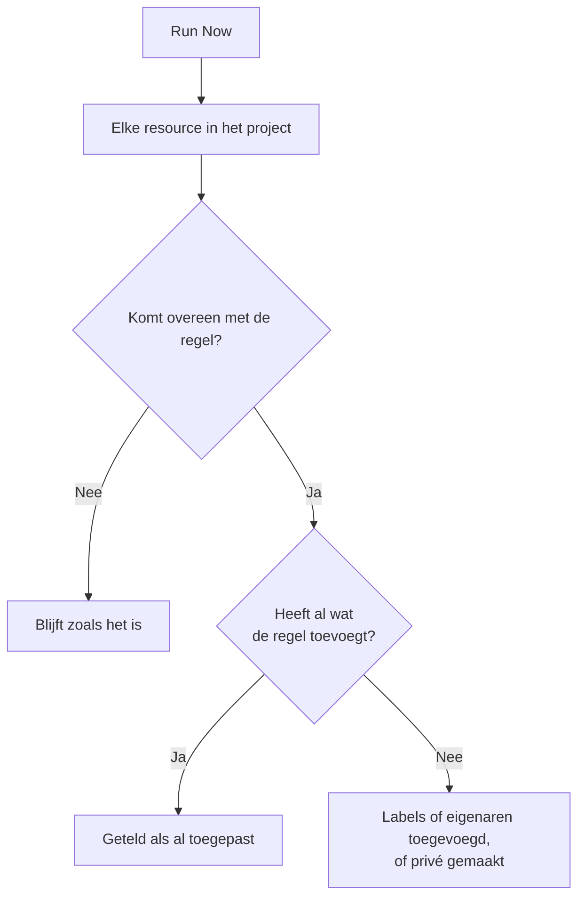

# Regels uitvoeren op bestaande resources

Labelregels, eigenaarsregels en privacyregels worden automatisch uitgevoerd wanneer een resource wordt **aangemaakt**. Een regel die u vandaag schrijft, verandert dus niets aan de monitoren, incidenten of hosts die u al hebt. **Run Now** dicht dat gat: het past één regel toe op elke resource die al in het project bestaat.

## Welke regels u kunt uitvoeren

- **Labelregels** en **Eigenaarsregels**, voor elke resource die ze heeft: monitoren, incidenten, incidentepisodes, waarschuwingen, waarschuwingsepisodes, geplande onderhoudsgebeurtenissen, statuspagina's, services, hosts, Kubernetes-clusters, Docker-hosts, Docker Swarm-clusters, Podman-hosts, Proxmox-clusters, VMware vCenters, Ceph-clusters, storage-arrays, databases, wachtrijen, IoT-vloten, serverless functies, cloudresources, RUM-applicaties, dashboards, dienstbeleid, dienstroosters, beleid voor inkomende oproepen, workflows, runbooks, netwerkapparaten en SLO's.
- **Privacyregels**, voor incidenten, waarschuwingen, incidentepisodes en waarschuwingsepisodes.
- **Monitor Rules** op een statuspagina. Die synchroniseren de pagina al opnieuw telkens wanneer een regel wordt opgeslagen; er een uitvoeren synchroniseert haar meteen.
- **Monitor Rules** op een SLO. Die synchroniseren de SLO al opnieuw telkens wanneer een regel wordt opgeslagen; er een uitvoeren synchroniseert de monitoren van de SLO meteen. Zie [Monitoren en monitorregels](/docs/slo/monitor-rules).

Regels die een actie uitvoeren in plaats van een resource te beschrijven (**Bereikbaarheidsregels**, **Runbook-regels**, **Regels voor automatisch herstel** en **Groeperingsregels**) kunnen niet op bestaande records worden uitgevoerd. Ze uitvoeren zou mensen oproepen, runbooks starten, herstelacties starten of episodes herschikken voor incidenten die al voorbij zijn.

## Voordat u begint

Om een regel uit te voeren hebt u de machtiging nodig om de regel te bewerken **en** om de resources te bewerken die hij wijzigt: een labelregel voor monitoren vereist bijvoorbeeld zowel de bewerkingsmachtiging voor labelregels van monitoren als die voor monitoren. Eigenaarsregels vereisen ook de machtiging om eigenaren toe te voegen. Monitorregels op een statuspagina of een SLO vereisen alleen de machtiging om de regel te bewerken.

> [!IMPORTANT]
> Een machtiging die beperkt is tot bepaalde labels, of tot resources waarvan u eigenaar bent, is niet genoeg: een uitvoering kan elke resource in het project wijzigen. Blokkeerlijsten van teams gelden zoals overal, en een blokkering die tot enkele labels is beperkt, telt ook mee: een uitvoering zou de resources met die labels wijzigen, dus een blokkering met labels op het bewerken van de resources die een regel wijzigt, weigert de uitvoering.

De regels van een netwerk vragen hetzelfde wanneer u ze uitvoert op de apparaten die u al hebt. **Run Now** van een regel voor sitetoewijzing of apparaatlabels vereist de machtiging om de regel te bewerken en **Edit Network Device**. **Dry Run** en **Run Rule** van een regel voor automatisch importeren vereisen de machtiging om de regel te bewerken, **Create Network Device** en, als de regel een monitorsjabloon heeft, **Create Monitor**. Elke machtiging moet het hele project bereiken. Zie [Automatisch importeren met regels voor automatisch importeren](/docs/monitor/network-device-monitor#importing-automatically-with-auto-import-rules).

## Eén regel uitvoeren

:::steps
### De lijst met regels openen

Open de pagina met regels, bijvoorbeeld **Monitoren → Instellingen → Labelregels**.

### Run Now kiezen

Open het menu **⋯** aan het eind van de rij van de regel en kies **Run Now**, of kies **Bekijken** en daarna **Run Now** op de eigen pagina van de regel. Een dialoogvenster zegt wat de uitvoering gaat doen.

### Kiezen of nieuwe eigenaren een melding krijgen

Kies bij een eigenaarsregel of u **Notify the owners this run adds** wilt. Dit staat standaard uit en werkt alleen als bij de regel zelf **Eigenaren op de hoogte stellen** aan staat. Een eigenaar krijgt één melding voor elke resource waaraan hij wordt toegevoegd.

### De regel starten

Kies **Run Rule** en laat het dialoogvenster open. Bij een groot project toont het dialoogvenster hoe ver de uitvoering is.

### Het rapport lezen

Als de uitvoering klaar is, meldt het dialoogvenster op hoeveel resources de regel van toepassing was, hoeveel hij heeft gewijzigd en hoeveel al hadden wat de regel toevoegt.
:::

## Meerdere regels uitvoeren

Selecteer regels in de tabel, open het menu met bulkacties en kies **Run Now**. De geselecteerde regels worden na elkaar uitgevoerd.

- Eigenaren die door een bulkuitvoering worden toegevoegd, krijgen nooit een melding. Voer in plaats daarvan één regel uit om ze een melding te sturen.
- Een regel die niet kan worden uitgevoerd (bijvoorbeeld omdat hij is uitgeschakeld), wordt met de reden vermeld, en de andere regels worden toch uitgevoerd.

## Wat een uitvoering doet

- **Ze voegt alleen toe.** Labels worden toegevoegd, eigenaren worden toegevoegd, resources worden privé gemaakt. Er wordt niets verwijderd en niets openbaar gemaakt, dus een regel opnieuw uitvoeren is veilig: de tweede uitvoering meldt dat alles al was toegepast.
- **Elke resource in het project wordt beoordeeld**, ook opgeloste incidenten en waarschuwingen.
- **Bestaande eigenaren worden overgeslagen**, nooit twee keer toegevoegd.
- **Alleen de eigen labels van uw project worden toegevoegd.** Een label dat de regel noemt en dat niet meer bij de labels van uw project hoort, wordt overgeslagen, en de andere labels van de regel worden toch toegevoegd. Hetzelfde geldt wanneer een regel op een nieuwe resource wordt uitgevoerd.
- **De regel wordt op dezelfde manier toegepast als bij het aanmaken**, inclusief labels en eigenaren die worden overgenomen van de monitoren, hosts en services van een incident. Als de resource een activiteitenfeed heeft, legt de feed vast welke regel hem heeft gewijzigd.
- **Uitgeschakelde regels worden niet uitgevoerd.** Schakel de regel eerst in.
- **Monitorregels van statuspagina's** voegen de monitoren toe waarop ze van toepassing zijn en verwijderen de monitoren die ze eerder hebben toegevoegd en waarop ze niet meer van toepassing zijn. Monitoren die met de hand aan de pagina zijn toegevoegd, worden nooit aangeraakt.
- **Eén uitvoering bestrijkt maximaal 100.000 resources.** Bij een groter project stopt de uitvoering en meldt ze dat; voer de regel opnieuw uit om door te gaan.

## Volgende stappen

:::cards
- [Label- en eigenaarsregels](/docs/configuration/label-and-owner-rules): De regels schrijven die een uitvoering toepast.
- [Labelregels importeren en exporteren](/docs/configuration/label-rule-import-export): Eerst labelregels uit een ander project binnenhalen.
- [Incidentinstellingen en automatisering](/docs/incidents/settings): Regels voor incidenten, inclusief privacyregels.
:::
