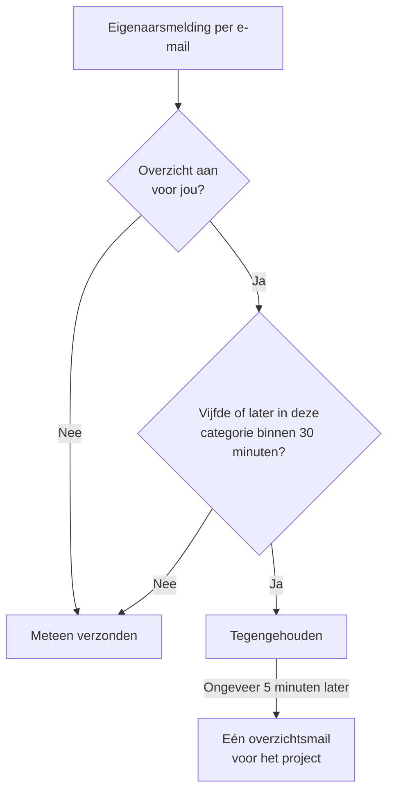

# Meldingsoverzicht

Als er echt iets misgaat, gaat het zelden maar één keer mis. Een haperende upstream-verbinding haalt veertig monitors onderuit, er worden veertig incidenten gemeld, bevestigd en opgelost, en elke eigenaar krijgt bij elke stap een e-mail: tweehonderd berichten in één inbox, en niemand leest ze nog.

OneUptime bundelt zulke golven automatisch in één e-mail. Het staat voor iedereen aan en er valt niets in te stellen — maar wil je liever elke melding als eigen e-mail, dan kun je [het overzicht voor jezelf uitzetten](#het-overzicht-voor-jezelf-uitzetten), per project.

:::cards
- [Hoe het werkt](#hoe-het-werkt): Vier e-mails gaan meteen de deur uit, de rest komt samen.
- [Wat nooit wordt gebundeld](#wat-nooit-wordt-gebundeld): Oproepen, beveiligings-, facturatie- en abonnee-e-mail.
- [Overzicht uitzetten](#het-overzicht-voor-jezelf-uitzetten): Weer elke melding als eigen e-mail ontvangen.
- [Minder routine-e-mails](#nog-minder-e-mail): De informatieve e-mails in één keer uitzetten.
:::

## Hoe het werkt

Elke eigenaarsmelding per e-mail die je ontvangt, telt mee voor een klein budget, bijgehouden per project, per ontvanger, per e-mailadres en per **categorie** van resource — incidenten, waarschuwingen, monitors, gepland onderhoud, statuspagina's, probes, SLO's, enzovoort.



- De **eerste vier** e-mails in een categorie binnen een willekeurig venster van dertig minuten worden meteen verzonden, precies zoals altijd. Zelfde onderwerp, zelfde sjabloon, zelfde links.
- De **vijfde en elke volgende** e-mail in dat venster wordt tegengehouden.
- Ongeveer vijf minuten later komt alles wat in dat project voor je is tegengehouden — over alle categorieën heen — binnen als **één** e-mail met een lijst van wat er gebeurde en een link naar elke resource.

Het overzicht bevat de meldingen waarop je bij het verzenden nog geabonneerd bent. Zet je de e-mail van een gebeurtenis uit terwijl de meldingen ervan in de wachtrij staan, dan vallen die meldingen uit het overzicht. Zet je de e-mail later weer aan, dan worden die overgeslagen updates niet alsnog verzonden.

Onder de drempel doet de functie helemaal niets. Een project dat drie eigenaarsmails per dag maakt, verstuurt die drie e-mails nog steeds afzonderlijk.

## Zo ziet de overzichtsmail eruit

De onderwerpregel vertelt je de omvang _en het soort_ storm al voordat je de e-mail opent:

```text
[Acme Production] 112 notifications: 63 Monitors, 41 Incidents, 6 Alerts +2 more
```

Daarin geeft een overzichtskaart het totaal, de periode die het overzicht beslaat en de verdeling per categorie. Daaronder zijn de meldingen gegroepeerd in één sectie per categorie, de dringendste eerst — incidenten, dan waarschuwingen, dan de monitors en probes die ze opmerkten — zodat het eerste onder het overzicht ook het eerste is dat een klik waard is.

Elke sectie bevat één rij per resource in plaats van één rij per gebeurtenis:

- **Rijen tonen hoe een resource is geëindigd.** Werd een incident aangemaakt, daarna bevestigd en daarna opgelost, dan is dat één rij in de nieuwste staat — daardoor is het overzicht _actueler_ dan drie losse e-mails zouden zijn geweest.
- **De aantallen kloppen.** Elke rij vermeldt het tijdstip van de laatste update, en een rij die er meerdere heeft opgenomen zegt hoeveel, zodat de secties en de overzichtskaart altijd op hetzelfde totaal uitkomen.
- **Ernst en status staan erbij.** Kaarten van waarschuwingen en incidenten tonen de ernst en status uit de laatste melding, inclusief eigen namen. Oudere meldingen in de wachtrij zonder deze gegevens verschijnen nog steeds, zonder de ontbrekende labels.

Tijden worden in UTC getoond, met daarbij de datum zodra een overzicht meer dan één dag beslaat.


## Wat nooit wordt gebundeld

Het overzicht raakt alleen meldingen voor eigenaren en leden — de familie "er is iets veranderd waarvoor jij verantwoordelijk bent". Iets anders kan het niet bereiken, omdat het in het enige codepad zit dat die meldingen nemen, en geen ander.

Nooit vertraagd en nooit meegeteld:

| Categorie | Voorbeelden |
| ----------------------------------------- | ---------------------------------------------------------------------------------------------------- |
| Oproepen tijdens dienst | Elke oproep van een escalatiebeleid en elk verzoek om bevestiging |
| Diensttijden | "Je hebt nu dienst", "je hebt hierna dienst", "je dienst begint zo", "je dienst is opnieuw toegewezen" |
| Accountbeveiliging | Wachtwoord opnieuw instellen, e-mailverificatie, wachtwoord gewijzigd, back-upcode voor tweestapsverificatie gebruikt of opnieuw gemaakt |
| Beheermeldingen over je account | Een beheerder heeft je meldingsmethoden of je dienstregels gewijzigd |
| Facturatie en saldo | Facturen, verlopen abonnement, "we konden niemand oproepen omdat de kaart werd geweigerd" |
| Gezondheid van de instantie | Waarschuwingen over Postgres, Valkey en ClickHouse aan beheerders van de instantie |
| Abonnees van statuspagina's | Elke e-mail die je statuspagina naar je eigen abonnees stuurt |
| SLA-schendingen | Worden meteen verzonden, ook al hergebruiken ze het meldingstype voor aangemaakte incidenten |

Alleen e-mail is betrokken. Sms, telefoongesprekken, pushmeldingen, WhatsApp, Telegram, Slack, Microsoft Teams en webhooks worden meteen bezorgd, precies zoals voorheen — ook voor de meldingen waarvan de e-mail werd tegengehouden.

## Limieten

| Limiet | Waarde |
| --- | --- |
| Meldingen in één overzichtsmail | Hooguit **500**. Wat daarboven komt, blijft in de wachtrij en gaat mee met het volgende overzicht, hooguit vijf minuten later. |
| Getoonde rijen in één overzichtsmail | Hooguit **100**. Rijen worden per resource samengevoegd, dat zijn dus 100 verschillende resources; daarboven meldt de e-mail de volledige totalen en linkt naar het project. |
| Overzichtsmails aan één ontvanger uit één project | Hooguit **12** per uur. |
| Extra vertraging voor een tegengehouden melding | In het slechtste geval ongeveer zes minuten. |

Het plafond per uur wordt door de database afgedwongen, niet door een timer, dus het houdt stand, ook tijdens een storm die uren duurt.

## Het overzicht voor jezelf uitzetten

Sommige mensen willen de bundeling. Anderen archiveren elke melding zodra die binnenkomt, of laten hun mailbox verwerken door iets dat dat doet, en een overzichtsmail verstoort dat. Daarom kun je het overzicht uitzetten, per persoon en per project.

:::steps
### E-mailvoorkeuren openen

Ga in het project naar **Gebruikersinstellingen → E-mailvoorkeuren** — dezelfde pagina waarnaar onderaan elke overzichtsmail wordt gelinkt.

### Email Rollup uitzetten

Zet in de kaart **Email Rollup** de schakelaar uit. Dit wordt vanzelf opgeslagen, en de kaart toont dan "Off: every notification arrives as its own email, immediately."
:::

Staat het uit, dan krijg je elke eigenaars- en ledenmelding per e-mail in dat project weer afzonderlijk en meteen: zelfde onderwerp, zelfde sjabloon, zelfde links, geen drempel en geen vijf minuten wachten. Wat bij het uitzetten al voor je in de wachtrij stond, komt nog als één laatste overzicht een paar minuten later; alles daarna komt één voor één.

De schakelaar is **alleen van jou en geldt voor één project**. Uitzetten verandert niets aan wat je collega's ontvangen en geldt niet voor andere projecten — zo kan het drukke productieproject blijven bundelen terwijl het rustige interne project alles los doorstuurt, of andersom. Hij staat voor iedereen aan totdat iemand hem uitzet.

Wat hij **niet** verandert:

- **Welke meldingen je krijgt.** Dat is de instelling per gebeurtenistype en per kanaal onder **Gebruikersinstellingen → Meldingsinstellingen**, één pagina verder. Het overzicht en deze schakelaar veranderen alleen in hoeveel e-mails die meldingen worden verpakt.
- **Oproepen tijdens dienst en dienst-e-mails**, **e-mail over accountbeveiliging**, **facturatie-e-mail**, waarschuwingen over de gezondheid van de instantie en e-mail aan abonnees van statuspagina's. Daarvan wordt nooit iets gebundeld, dus het overzicht uitzetten verandert er niets aan — zie [Wat nooit wordt gebundeld](#wat-nooit-wordt-gebundeld).
- **Alle andere kanalen.** Sms, telefoongesprekken, push, WhatsApp, Telegram, Slack, Microsoft Teams en webhooks zijn al direct.

## Nog minder e-mail

Het overzicht bundelt routine-updates; je kunt de meeste ervan ook helemaal niet meer ontvangen.

:::steps
### De voorkeuren openen vanuit een overzichtsmail

Open de link naar de voorkeuren onderaan een overzichtsmail, of ga naar **Gebruikersinstellingen → E-mailvoorkeuren**.

### Reduce routine emails kiezen

Kies in de kaart **Fewer routine emails** de knop **Reduce routine emails**. Zodra de wijziging is opgeslagen, meldt de kaart **Routine-e-mails uitgeschakeld.**
:::

Dit zet voor jou in het huidige project deze informatieve e-mails uit:

- Notities bij incidenten, waarschuwingen, episodes en gepland onderhoud.
- Berichten dat je als eigenaar van een resource bent toegevoegd.
- Nieuwe monitors en statuspagina's.
- Incidenten of waarschuwingen die aan bestaande episodes zijn toegevoegd.
- Toegevoegd worden aan of verwijderd worden uit een dienstbeleid.

Je huidige keuzes voor het aanmaken van incidenten en waarschuwingen, statuswijzigingen, herinneringen, incidenttoewijzingen, monitorgezondheid en diensten blijven behouden, en geen e-mail die je had uitgezet, wordt aangezet. Oproepen, andere bezorgkanalen, account-e-mail, facturatie-e-mail en e-mail aan abonnees van statuspagina's blijven ongemoeid.

De wijzigingen worden samen opgeslagen. Bekijk de schakelaars per gebeurtenis onder **Gebruikersinstellingen → Meldingsinstellingen** om een afzonderlijke e-mail weer aan te zetten. Deze voorkeuren gelden ook voor meldingen die op een overzicht wachten; een al verzonden e-mail kan niet worden teruggehaald. Het e-mailoverzicht blijft een aparte instelling die de bundeling regelt van de gebeurtenissen die je houdt.

## Problemen oplossen

:::details Een meldingsmail kwam een paar minuten te laat
Het was de vijfde of een latere e-mail in zijn categorie binnen dertig minuten, dus werd hij tegengehouden en ongeveer vijf minuten later in een overzicht verzonden. Zoek een overzichtsmail uit hetzelfde project: de melding staat daarin als een rij. Oproepen en de andere kanalen werden niet vertraagd.
:::

:::details Ik heb het overzicht uitgezet en toch een overzichtsmail gekregen
Meldingen die bij het uitzetten al voor je in de wachtrij stonden, komen als één laatste overzicht een paar minuten later. Alles daarna komt als losse e-mail.
:::

:::details Een verwachte update ontbreekt in een overzichtsmail
Elke rij toont een resource in de nieuwste staat, dus een incident dat werd aangemaakt, bevestigd en opgelost, is één rij met het aantal updates dat die rij heeft opgenomen. Een melding valt ook weg als je de e-mail van die gebeurtenis onder **Gebruikersinstellingen → Meldingsinstellingen** hebt uitgezet terwijl de melding in de wachtrij stond.
:::

## Volgende stappen

:::cards
- [SMTP-configuratie](/docs/emails/smtp): De e-mail van OneUptime via je eigen mailserver versturen.
- [Escalatieregels](/docs/on-call/escalation-rules): Hoe oproepen tijdens dienst mensen bereiken, nooit gebundeld.
:::
