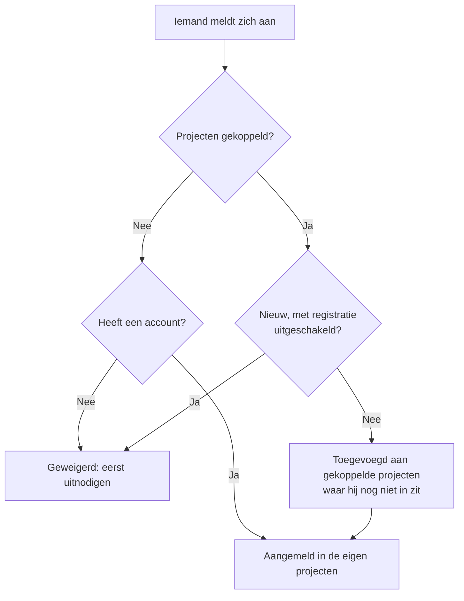

# Globale SSO

Met globale SSO stelt een **instantiebeheerder** van OneUptime (master-admin) **één keer**, op instantieniveau, een SAML 2.0- of OpenID Connect-identiteitsprovider (OIDC) in en koppelt die aan elk project op de server. In plaats van dat elke projecteigenaar een eigen identiteitsprovider instelt, stelt een master-admin er één in die de hele instantie bedient.

> [!NOTE]
> Globale SSO, inclusief de instantiebrede schakelaar "Require SSO for Login", maakt deel uit van elke editie van OneUptime: elke zelf gehoste instantie heeft het, de Community Edition inbegrepen, en er is geen licentie voor nodig. Het hoort bij het instantiebeheer en geldt dus niet voor OneUptime Cloud. Zie [Enterprise Edition](/docs/self-hosted/enterprise) voor wat elke editie bevat.

:::cards
- [Een provider instellen](#globale-sso-instellen): Maak hem aan, geef uw identiteitsprovider de URL's van OneUptime en test hem.
- [Zo melden gebruikers zich aan](#zo-melden-gebruikers-zich-aan): Alleen bestaande leden, of nieuwkomers die worden toegevoegd aan de projecten die u koppelt.
- [SSO afdwingen](#sso-afdwingen): SSO verplichten voor één project of voor de hele instantie.
- [Een provider uitzetten](#een-provider-uitzetten-of-verwijderen): Wat er eindigt en welke wijzigingen OneUptime weigert.
:::

## Globale SSO en project-SSO vergeleken

|                       | Project-SSO                                         | Globale SSO                                          |
| --------------------- | --------------------------------------------------- | ---------------------------------------------------- |
| Ingesteld door        | Projecteigenaar/-beheerder (Projectinstellingen)    | Master-admin van de instantie (Admin Dashboard)      |
| Bereik                | Eén project                                         | De hele instantie, aan elk project te koppelen       |
| Resultaat van aanmelden | Toegang tot dat ene project                       | Toegang tot elk project dat de gebruiker kan bereiken |

Voor de eigen provider van één project, zie [SSO](/docs/identity/sso).

## Globale SSO instellen

:::steps
### De lijst met providers openen

:::tabs
@tab SAML
Meld u aan als master-admin en open het Admin Dashboard met **Beheerdersinstellingen** in uw gebruikersmenu. Ga daarna naar **Instellingen** > **Authenticatie** > **Global SSO**.
@tab OpenID Connect
Meld u aan als master-admin en open het Admin Dashboard met **Beheerdersinstellingen** in uw gebruikersmenu. Ga daarna naar **Instellingen** > **Authenticatie** > **Global OIDC**.
:::

### De provider aanmaken

:::tabs
@tab SAML
- Klik op **Create Global SSO**.
- Voer een **Naam**, de **Sign On URL** en de **Issuer** van uw identiteitsprovider in en plak het **Public Certificate**. De rest staat al ingevuld onder **Meer velden**: de **Signature Method** (`RSA-SHA256`), de **Digest Method** (`SHA256`) en een beschrijving (`Sign in with` en de naam). Wijzig ze alleen als uw IdP dat vraagt. Bij het opslaan opent de pagina van de provider.
@tab OpenID Connect
- Klik op **Create Global OIDC**.
- Voer een **Naam**, de **Issuer URL** en de **Client ID** en het **Client Secret** van de app in die u in uw IdP hebt geregistreerd. De discovery-URL van de IdP in **Issuer URL** plakken werkt ook. De rest staat al ingevuld onder **Meer velden**: de **Discovery URL** (de issuer gevolgd door `/.well-known/openid-configuration`), de **Scopes** (`openid email profile`), de claimnamen `email` en `name`, en een beschrijving (`Sign in with` en de naam). Wijzig ze alleen als uw IdP dat vraagt. Bij het opslaan opent de pagina van de provider.
:::

### De URL's van OneUptime in uw identiteitsprovider zetten

:::tabs
@tab SAML
Op de pagina van de provider toont de kaart **Identity Provider URLs** de **ACS URL (Assertion Consumer Service / Reply URL)** en de **Issuer (Entity ID)**. Plak beide in uw identiteitsprovider (Okta, Microsoft Entra ID, OneLogin, JumpCloud en andere).
@tab OpenID Connect
Op de pagina van de provider toont de kaart **Identity Provider URL** de **Redirect URI (Callback URL)**. Voeg die toe aan de toegestane redirect-URI's van uw identiteitsprovider.
:::

### De provider inschakelen

Een nieuwe provider staat eerst uit. Klik op de pagina van de provider op **Edit Configuration** en zet **Ingeschakeld** aan.

Een globale provider inschakelen voegt alleen een optie "Sign in with SSO" toe aan de aanmeldpagina — het dwingt nooit SSO af en sluit niemand buiten, dus u kunt hem veilig inschakelen, testen en zo nodig weer uitschakelen.

### De provider testen

Gebruik de link in de kaart **Test this SSO provider** (**Test this OIDC provider** voor OpenID Connect) om een volledige aanmelding via uw identiteitsprovider te doen. U hoeft eerst geen projecten te koppelen: de test meldt u aan in de projecten waar u al lid van bent. De provider moet ingeschakeld zijn om de link te laten werken.
:::

## Zo melden gebruikers zich aan

Hoe een globale provider zich gedraagt, hangt ervan af of u er projecten aan koppelt:

- **Geen projecten gekoppeld (alle projecten / eerst uitnodigen):** gebruikers kunnen zich met de provider aanmelden en **elk project waar ze al lid van zijn** bereiken. Nieuwe gebruikers worden **niet** automatisch aangemaakt — een gebruiker moet eerst voor een project worden uitgenodigd. Gebruik dit voor bedrijfsbrede SSO als lidmaatschappen elders worden beheerd.

- **Projecten gekoppeld (auto-provisioning):** Open de provider en gebruik de tabel **Attached Projects** om een of meer projecten te koppelen, elk met een set standaardteams. Gebruikers die inloggen worden **automatisch geprovisioneerd** in die projecten en bij de eerste aanmelding toegevoegd aan de standaardteams. Een gekoppeld project begint met zijn ledenteam; kies andere teams als nieuwkomers met andere toegang moeten beginnen. Voeg één project + teams tegelijk toe om de lijst op te bouwen; om een koppeling te wijzigen, verwijdert u deze en voegt u haar opnieuw toe.

Wie al lid is van een gekoppeld project, houdt daar zijn teams.

Twee schakelaars op de provider veranderen dit. Beide staan eerst uit, ingeklapt onder **Meer velden**:

| Schakelaar | Wat hij doet als hij aanstaat |
| --- | --- |
| **Disable Sign Up with SSO** | Mensen moeten voor een project zijn uitgenodigd voordat ze zich met deze provider kunnen aanmelden, ook als er projecten zijn gekoppeld. Bij de eerste aanmelding wordt niemand nieuw aangemaakt. |
| **Restrict to Attached Projects** | Aanmelden met deze provider voldoet alleen in de eraan gekoppelde projecten aan de SSO-plicht, dus mensen die al zijn aangemeld kunnen de toegang tot andere projecten verliezen. Staat hij uit, dan voldoet het in elk project waar de persoon bij hoort, en bepalen gekoppelde projecten alleen waar nieuwkomers worden toegevoegd. |

## SSO afdwingen

Een globale provider instellen dwingt niemand om hem te gebruiken; aanmelden met een wachtwoord blijft werken. Om SSO te verplichten, zet u de verplichting aan voor een project of voor de hele instantie:

- **Per project:** een project kan SSO verplichten, en optioneel een *specifieke* provider (van het project of globaal). Zie [SSO verplichten voor uw project](/docs/identity/sso#sso-verplichten-voor-uw-project).
- **Instantiebreed:** **Admin** > **Instellingen** > **Authenticatie** heeft een schakelaar **SSO vereisen voor inloggen** die SSO afdwingt voor elke gebruiker op de instantie. Hij vraagt om bevestiging voordat hij aangaat en slaat op zodra u bevestigt. Master-admins blijven uitgezonderd, zodat ze niet buitengesloten kunnen worden.

Om **SSO vereisen voor inloggen** aan te zetten, is een SSO-provider nodig die mensen aanmeldt, zodat niemand erdoor wordt buitengesloten:

- Voor de hele instantie heeft elk project dat zelf geen SSO verplicht er een nodig: een eigen SAML- of OIDC-provider die aanstaat, of een globale provider die aanstaat en mensen in het project aanmeldt. Zolang een project er geen heeft, wordt het aanzetten van de schakelaar geweigerd en noemt de melding de projecten (of, als het er veel zijn, de eerste en hoeveel het er zijn). Zet eerst een globale provider aan, of een provider in die projecten. Een project dat een specifieke provider verplicht, heeft precies die nodig: zolang hij uitstaat, is verwijderd of geen mensen in het project aanmeldt, noemt de melding dat project apart — zet eerst die provider aan of verplicht daar een andere.
- Voor een project wordt hetzelfde gevraagd van dat project, en van de provider die het verplicht als het er een verplicht.
- Een opslag die **SSO vereisen voor inloggen** als ingeschakeld verstuurt terwijl het al aanstaat — met andere instellingen of via de API — wordt op dezelfde manier gecontroleerd, voor de instantie of voor een project, net als een opslag die de provider noemt die een project al verplicht.
- Voor een nieuw project, dat nog geen eigen provider heeft: zolang de instantie SSO verplicht, vereist het aanmaken van een project een globale provider die aanstaat en mensen in elk project aanmeldt, anders zou niemand, ook niet degene die het aanmaakt, het kunnen openen. Zonder zo'n provider wordt het aanmaken van een project geweigerd, en vraagt de melding een serverbeheerder er een aan te zetten. Master-admins kunnen nog steeds projecten aanmaken. Een project dat wordt aangemaakt met **SSO vereisen voor inloggen** al aan, heeft hetzelfde nodig, wie het ook aanmaakt.

Uitzetten wordt nooit geweigerd.

## Een provider uitzetten of verwijderen

Een globale provider uitzetten, verwijderen of beperken tot zijn gekoppelde projecten beëindigt de aanmeldingen die hij heeft gegeven waar hij geen mensen meer aanmeldt. Waar SSO verplicht is, moeten mensen die zich ermee hebben aangemeld zich bij hun volgende verzoek opnieuw met SSO aanmelden, krijgen hun geopende pagina's meteen geen live-updates meer, en werkt een MCP-client die iemand na het aanmelden ermee heeft gekoppeld niet meer in het project.

De provider weer aanzetten brengt die aanmeldingen niet terug: mensen melden zich er opnieuw mee aan. Een provider die al uitstond toen u upgradede, geldt als uitgezet bij de upgrade.

Een nieuw certificaat of client-secret, andere URL's of een nieuwe naam laten iedereen aangemeld.

### Elk project dat SSO verplicht, houdt een weg naar binnen

Een project dat SSO verplicht, zelf of omdat de hele instantie dat doet, houdt altijd een provider waarmee mensen zich erin kunnen aanmelden. Daarom worden deze wijzigingen geweigerd zolang ze zo'n project helemaal zonder provider zouden laten, of het de verplichte provider zouden afnemen:

- een globale provider uitzetten, verwijderen of beperken tot zijn gekoppelde projecten;
- bij een provider die tot zijn gekoppelde projecten is beperkt: zijn eerste project koppelen (tot dan meldt hij mensen in elk project aan), een koppeling uitzetten, haar naar een ander project of een andere provider verplaatsen, of haar verwijderen.

De melding noemt de projecten, of de eerste en hoeveel het er zijn. Zet eerst een andere provider voor ze aan, een eigen of een globale, of zet daar **SSO vereisen voor inloggen** uit. Een project dat juist deze provider verplicht, wordt apart genoemd: verplicht daar eerst een andere provider of zet **SSO vereisen voor inloggen** uit.

Wijzigingen waarmee een provider meer mensen aanmeldt — hem of een koppeling aanzetten, de beperking opheffen — worden nooit geweigerd. Ze bereiken alle appservers meteen, net als het uitzetten van **SSO vereisen voor inloggen**: mensen kunnen zich direct met de provider aanmelden. Alleen als er op precies dat moment een andere wijziging aan dezelfde provider wordt opgeslagen, kan een appserver tot een minuut nodig hebben om bij te werken.

Twee wijzigingen in wie zich kan aanmelden, worden na elkaar gecontroleerd. Wordt er op hetzelfde moment een andere opgeslagen die langer duurt dan normaal — het aanzetten van **SSO vereisen voor inloggen** voor de hele instantie leest elk project —, dan wordt een wijziging geweigerd met "Another change to who can sign in with SSO is being saved. Try again in a moment.": sla haar opnieuw op. Een project dat op dat moment wordt aangemaakt, wacht ook op de wijziging, en als het te lang wacht, wordt het geweigerd met "The server's SSO settings are being changed. Create the project again in a moment."

## Problemen oplossen

:::details "You must be invited to a project on this OneUptime instance before you can sign in with SSO"
De persoon heeft nog geen OneUptime-account en de provider maakt er geen aan: er zijn geen projecten aan gekoppeld, of **Disable Sign Up with SSO** staat aan. Nodig de persoon uit voor een project of koppel een project aan de provider.
:::

:::details "This SSO provider does not grant access to any project you are a member of"
**Restrict to Attached Projects** staat aan en de persoon is geen lid van een project dat aan de provider is gekoppeld. Koppel een van de projecten van de persoon, of voeg de persoon toe aan een gekoppeld project.
:::

:::details "You are not a member of any project on this OneUptime instance"
De persoon heeft een account, maar hoort bij geen enkel project, en de provider heeft niets om de persoon aan toe te voegen. Nodig de persoon uit voor een project of koppel een project met standaardteams aan de provider.
:::

:::details "Issuer URL does not match"
Bij een SAML-provider is de issuer in het antwoord van uw identiteitsprovider niet de **Issuer** die op de provider is opgeslagen. Kopieer hem opnieuw uit uw identiteitsprovider; beide moeten exact overeenkomen.
:::

## Volgende stappen

:::cards
- [SSO](/docs/identity/sso): De eigen SAML- of OIDC-provider van een project instellen.
- [SCIM](/docs/identity/scim): Laat uw identiteitsprovider automatisch mensen toevoegen en verwijderen.
- [Gebruikers, teams en machtigingen](/docs/permissions/index): Wat de teams waarin nieuwkomers komen hun toestaan.
:::
