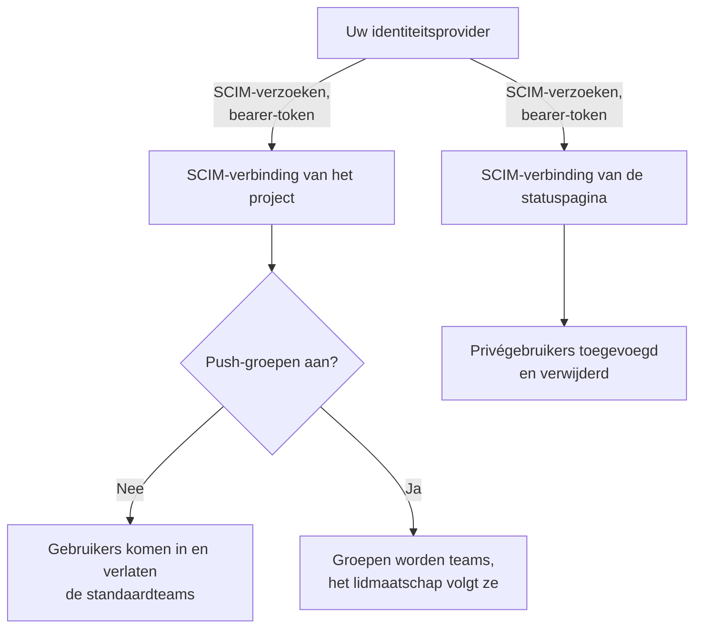
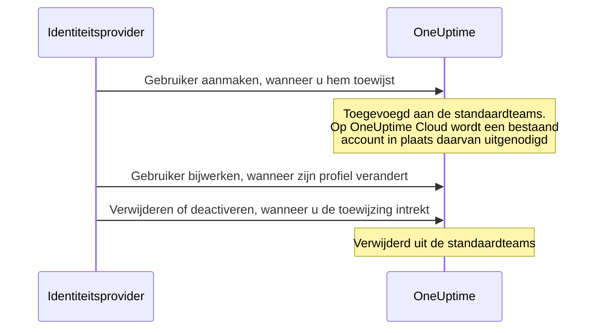

# SCIM

SCIM (System for Cross-domain Identity Management) richt mensen automatisch in en trekt hun toegang automatisch weer in. Uw identiteitsprovider (IdP) — Microsoft Entra ID, Okta of elk ander SCIM 2.0-systeem — voegt mensen toe aan uw OneUptime-projecten en privéstatuspagina's wanneer u ze toewijst, en verwijdert ze wanneer u de toewijzing intrekt.

> [!NOTE]
> **Editie:** SCIM maakt deel uit van de Enterprise Edition van OneUptime. Op OneUptime Cloud is het beschikbaar vanaf het **Scale**-abonnement. Zelf gehoste installaties hebben de image van de Enterprise Edition en een licentie nodig. Zie [Enterprise Edition](/docs/self-hosted/enterprise). Zonder geldige licentie (na de proefperiode van 14 dagen, of 30 dagen nadat een licentie is verlopen) worden SCIM-verzoeken geweigerd tot er een licentie is geactiveerd.

:::cards
- [Project-SCIM instellen](#project-scim-instellen): Maak een verbinding aan en geef uw IdP de URL en het token.
- [SCIM voor statuspagina's instellen](#scim-voor-statuspaginas-instellen): De privégebruikers van een statuspagina inrichten.
- [Uw identiteitsprovider koppelen](#uw-identiteitsprovider-instellen): Stap voor stap voor Microsoft Entra ID en Okta.
- [Veelgestelde vragen](#veelgestelde-vragen): Bestaande gebruikers, intrekken, gewijzigde e-mailadressen.
:::

## Hoe het werkt

Uw identiteitsprovider roept het SCIM-eindpunt van OneUptime aan, geverifieerd met een bearer-token, telkens als u iemand toewijst, wijzigt of de toewijzing intrekt. Wat het verzoek verandert, hangt af van waar de verbinding staat:



De SCIM-integratie biedt deze voordelen:

- **Automatische inrichting van gebruikers**: gebruikers worden in OneUptime aangemaakt wanneer ze in uw IdP worden toegewezen.
- **Automatische intrekking van gebruikers**: gebruikers worden uit OneUptime verwijderd wanneer hun toewijzing in uw IdP wordt ingetrokken.
- **Synchronisatie van gebruikerskenmerken**: gebruikersgegevens blijven gelijk tussen uw IdP en OneUptime.
- **Centraal toegangsbeheer**: de toegang tot OneUptime wordt beheerd vanuit uw bestaande systeem voor identiteitsbeheer.

SCIM en [SSO](/docs/identity/sso) staan los van elkaar: SCIM bepaalt wie in een project zit, SSO hoe mensen zich aanmelden. De meeste organisaties gebruiken beide.

## SCIM voor projecten

Met project-SCIM beheren identiteitsproviders de teamleden in OneUptime-projecten.

### Project-SCIM instellen

Alleen een projecteigenaar kan de SCIM-verbinding van een project toevoegen of wijzigen, of het bearer-token ervan zien of opnieuw instellen: via SCIM kan uw identiteitsprovider mensen aan elk team in het project toevoegen.
:::steps
1. **Naar de projectinstellingen gaan**

   - Open uw OneUptime-project
   - Ga naar **Projectinstellingen** > **Beveiliging** > **SCIM**

2. **De SCIM-instellingen configureren**

   - Voer een **Naam** in. **Standaardteams** begint met het ledenteam van uw project: nieuwe gebruikers worden aan deze teams toegevoegd
   - Onder **Meer velden** staan **Gebruikers automatisch provisioneren** (gebruikers toevoegen wanneer ze in uw IdP worden toegewezen) en **Gebruikers automatisch deprovisioneren** (gebruikers verwijderen wanneer hun toewijzing in uw IdP wordt ingetrokken) aan, en staat **Push-groepen inschakelen** uit. Wijzig ze daar als dat nodig is
   - Sla op. Het dialoogvenster met de **SCIM Base URL** en het **Bearer Token** voor de configuratie van uw IdP opent meteen

3. **Uw identiteitsprovider configureren**

   - Gebruik de **SCIM Base URL** uit het dialoogvenster. Op OneUptime Cloud is dat `https://oneuptime.com/identity/scim/v2/<scim-id>`; een zelf gehoste installatie toont haar eigen host
   - Stel verificatie met een bearer-token in met het **Bearer Token** uit het dialoogvenster
   - Wijs de gebruikerskenmerken toe (het e-mailadres is verplicht). [Uw identiteitsprovider instellen](#uw-identiteitsprovider-instellen) beschrijft de details voor Microsoft Entra ID en Okta
:::

Om de URL's opnieuw te zien, kiest u **SCIM-URL's bekijken** in de rij van de verbinding. **Bearer-token opnieuw instellen** vervangt het token; werk uw identiteitsprovider bij met het nieuwe.

### Zo wordt een projectgebruiker ingericht



Wie al een OneUptime-account had, wordt op OneUptime Cloud lid zodra hij de uitnodiging accepteert (zie de [veelgestelde vragen](#veelgestelde-vragen)). Toegang via andere teams dan de standaardteams van de verbinding blijft ongemoeid.

## SCIM voor statuspagina's

Met SCIM voor statuspagina's richten identiteitsproviders de privégebruikers van statuspagina's in en trekken ze die weer in; deze gebruikers hebben toegang tot privéstatuspagina's.

### SCIM voor statuspagina's instellen

:::steps
1. **Naar de instellingen van de statuspagina gaan**

   - Open **Statuspagina's** en selecteer uw statuspagina
   - Ga naar **Beveiliging** > **SCIM**

2. **De SCIM-instellingen configureren**

   - Voer een **Naam** in. Onder **Meer velden** staan **Gebruikers automatisch provisioneren** (privégebruikers toevoegen wanneer ze in uw IdP worden toegewezen) en **Gebruikers automatisch deprovisioneren** (privégebruikers verwijderen wanneer hun toewijzing in uw IdP wordt ingetrokken) aan. Wijzig ze daar als dat nodig is
   - Sla op. Het dialoogvenster met de **SCIM Base URL** en het **Bearer Token** voor de configuratie van uw IdP opent meteen

3. **Uw identiteitsprovider configureren**

   - Gebruik de **SCIM Base URL** uit het dialoogvenster. Op OneUptime Cloud is dat `https://oneuptime.com/identity/status-page-scim/v2/<scim-id>`
   - Stel verificatie met een bearer-token in met het getoonde token
   - Wijs de gebruikerskenmerken toe (het e-mailadres is verplicht)
:::

Om de URL's opnieuw te zien, kiest u **SCIM-eindpunt-URL's weergeven** in de rij van de verbinding.

SCIM voor statuspagina's ondersteunt alleen gebruikers. Groepen en het inrichten van groepen worden niet ondersteund.

### Zo wordt een privégebruiker ingericht

```mermaid title="Het leven van een privégebruiker met SCIM voor statuspagina's"
sequenceDiagram
    participant IdP as Identiteitsprovider
    participant O as OneUptime
    IdP->>O: Gebruiker aanmaken, wanneer u hem toewijst
    Note over O: De privégebruiker heeft toegang<br/>tot de privéstatuspagina
    IdP->>O: Verwijderen, of active op false zetten
    Note over O: Privégebruiker en zijn<br/>sessies verwijderd
```

> [!WARNING]
> Intrekken verwijdert de privégebruiker van de statuspagina en al zijn sessies voor die statuspagina definitief. Wordt de gebruiker later opnieuw toegewezen, dan wordt hij als nieuwe privégebruiker ingericht. Staat **Gebruikers automatisch deprovisioneren** uit, dan worden updates die `active` op `false` zetten genegeerd en DELETE-verzoeken geweigerd.

## Uw identiteitsprovider instellen

Elke provider hieronder begint met het aanmaken van een SCIM-verbinding voor het project in OneUptime en koppelt uw identiteitsprovider daar vervolgens aan.

### Microsoft Entra ID (voorheen Azure AD)

Microsoft Entra ID biedt identiteitsbeheer op bedrijfsniveau met SCIM-inrichting. U hebt nodig:

- Een Microsoft Entra ID-tenant met een Premium P1- of P2-licentie (vereist voor automatische inrichting).
- Een OneUptime-project met het **Scale**-abonnement of hoger op OneUptime Cloud.
- Beheerderstoegang tot zowel Microsoft Entra ID als OneUptime.

:::steps
#### De SCIM-verbinding voor Entra ID aanmaken

1. Meld u aan bij uw OneUptime-dashboard
2. Ga naar **Projectinstellingen** > **Beveiliging** > **SCIM**
3. Klik op **SCIM aanmaken**
4. Voer een herkenbare naam in (bijvoorbeeld "Microsoft Entra ID Provisioning")
5. Controleer de opties:
   - **Standaardteams**: begint met het ledenteam van uw project; nieuwe gebruikers worden aan deze teams toegevoegd
   - **Gebruikers automatisch provisioneren** en **Gebruikers automatisch deprovisioneren**: aan, onder **Meer velden**
   - **Push-groepen inschakelen**: onder **Meer velden**; zet het aan als u het teamlidmaatschap via groepen in Entra ID wilt beheren
6. Sla de configuratie op
7. Kopieer de **SCIM Base URL** en het **Bearer Token** uit het dialoogvenster dat opent — u hebt ze nodig voor Entra ID

#### Een bedrijfsapplicatie aanmaken in Entra ID

1. Meld u aan bij het [Microsoft Entra admin center](https://entra.microsoft.com)
2. Ga naar **Identity** > **Applications** > **Enterprise applications**
3. Klik op **+ New application** en daarna op **+ Create your own application**
4. Voer een naam in (bijvoorbeeld "OneUptime")
5. Selecteer **Integrate any other application you don't find in the gallery (Non-gallery)** en klik op **Create**

#### Entra ID aan OneUptime koppelen

1. Ga in uw OneUptime-bedrijfsapplicatie naar **Provisioning** en klik op **Get started**
2. Zet **Provisioning Mode** op **Automatic**
3. Zet onder **Admin Credentials** de **Tenant URL** op de **SCIM Base URL** uit OneUptime (bijvoorbeeld `https://oneuptime.com/identity/scim/v2/<scim-id>`) en het **Secret Token** op het **Bearer Token**
4. Klik op **Test Connection** om de configuratie te controleren en daarna op **Save**

#### Gebruikerskenmerken toewijzen in Entra ID

1. Klik in de sectie Provisioning op **Mappings** en daarna op **Provision Azure Active Directory Users**
2. Stel de volgende kenmerktoewijzingen in, verwijder wat u niet nodig hebt en klik op **Save**:

| Azure AD-kenmerk                                              | SCIM-kenmerk van OneUptime     | Verplicht   |
| ------------------------------------------------------------- | ------------------------------ | ----------- |
| `userPrincipalName`                                           | `userName`                     | Ja          |
| `mail`                                                        | `emails[type eq "work"].value` | Aanbevolen  |
| `displayName`                                                 | `displayName`                  | Aanbevolen  |
| `givenName`                                                   | `name.givenName`               | Optioneel   |
| `surname`                                                     | `name.familyName`              | Optioneel   |
| `Switch([IsSoftDeleted], , "False", "True", "True", "False")` | `active`                       | Aanbevolen  |

#### Groepen toewijzen in Entra ID (optioneel)

Als u **Push-groepen inschakelen** in OneUptime hebt aangezet:

1. Ga terug naar **Mappings** en klik op **Provision Azure Active Directory Groups**
2. Zet **Enabled** op **Yes**
3. Stel de volgende kenmerktoewijzingen in en klik op **Save**:

| Azure AD-kenmerk | SCIM-kenmerk van OneUptime |
| ---------------- | -------------------------- |
| `displayName`    | `displayName`              |
| `members`        | `members`                  |

#### Gebruikers en groepen toewijzen in Entra ID

1. Ga in uw OneUptime-bedrijfsapplicatie naar **Users and groups**
2. Klik op **+ Add user/group**, selecteer de gebruikers en groepen die in OneUptime moeten worden ingericht en klik op **Assign**

#### De inrichting starten in Entra ID

1. Ga naar **Provisioning** > **Overview** en klik op **Start provisioning**
2. De eerste inrichtingscyclus begint; de eerste synchronisatie kan tot 40 minuten duren
3. Let in de **Provisioning logs** op fouten. De mensen die u hebt toegewezen, verschijnen in OneUptime in de teams van het project
:::

### Okta

Okta biedt flexibel identiteitsbeheer met ondersteuning voor SCIM. U hebt nodig:

- Een Okta-tenant met inrichting (de functie Lifecycle Management).
- Een OneUptime-project met het **Scale**-abonnement of hoger op OneUptime Cloud.
- Beheerderstoegang tot zowel Okta als OneUptime.

:::steps
#### De SCIM-verbinding voor Okta aanmaken

1. Meld u aan bij uw OneUptime-dashboard
2. Ga naar **Projectinstellingen** > **Beveiliging** > **SCIM**
3. Klik op **SCIM aanmaken**
4. Voer een herkenbare naam in (bijvoorbeeld "Okta Provisioning")
5. Controleer de opties:
   - **Standaardteams**: begint met het ledenteam van uw project; nieuwe gebruikers worden aan deze teams toegevoegd
   - **Gebruikers automatisch provisioneren** en **Gebruikers automatisch deprovisioneren**: aan, onder **Meer velden**
   - **Push-groepen inschakelen**: onder **Meer velden**; zet het aan als u het teamlidmaatschap via groepen in Okta wilt beheren
6. Sla de configuratie op
7. Kopieer de **SCIM Base URL** en het **Bearer Token** uit het dialoogvenster dat opent — u hebt ze nodig voor Okta

#### De Okta-applicatie aanmaken of openen

Ga in de Okta Admin Console naar **Applications** > **Applications**:

- Gebruikt u Okta al voor de SSO van OneUptime, open dan die applicatie.
- Klik anders op **Create App Integration**, selecteer **SAML 2.0**, noem de applicatie "OneUptime" en rond de SAML-configuratie af (zie [SSO](/docs/identity/sso)).

#### SCIM-inrichting inschakelen in Okta

1. Ga in uw OneUptime-applicatie naar het tabblad **General**
2. Klik in de sectie **App Settings** op **Edit**, selecteer **SCIM** onder **Provisioning** en klik op **Save**
3. Er verschijnt een nieuw tabblad **Provisioning**

#### Okta aan OneUptime koppelen

1. Klik op het tabblad **Provisioning** op **Integration**, daarna op **Configure API Integration**, en vink **Enable API integration** aan
2. Stel het volgende in:
   - **SCIM connector base URL**: de **SCIM Base URL** uit OneUptime (bijvoorbeeld `https://oneuptime.com/identity/scim/v2/<scim-id>`)
   - **Unique identifier field for users**: `userName`
   - **Supported provisioning actions**: Import New Users and Profile Updates, Push New Users, Push Profile Updates en, als u groepsgebaseerde inrichting gebruikt, Push Groups
   - **Authentication Mode**: **HTTP Header**
   - **Authorization**: het **Bearer Token** uit OneUptime. OneUptime verwacht de header `Authorization: Bearer <token>`; toont Okta het woord Bearer al vóór het veld, voer dan alleen het token in
3. Klik op **Test API Credentials** om de verbinding te controleren en daarna op **Save**

#### Kiezen wat Okta inricht

1. Klik op het tabblad **Provisioning** op **To App** en daarna op **Edit**
2. Schakel **Create Users**, **Update User Attributes** en **Deactivate Users** in en klik op **Save**

#### Gebruikerskenmerken toewijzen in Okta

Scrol naar **Attribute Mappings** en controleer deze toewijzingen. Verwijder wat u niet nodig hebt:

| Okta-kenmerk       | SCIM-kenmerk van OneUptime      | Richting       |
| ------------------ | ------------------------------- | -------------- |
| `userName`         | `userName`                      | Okta naar app  |
| `user.email`       | `emails[primary eq true].value` | Okta naar app  |
| `user.firstName`   | `name.givenName`                | Okta naar app  |
| `user.lastName`    | `name.familyName`               | Okta naar app  |
| `user.displayName` | `displayName`                   | Okta naar app  |

#### Groepen pushen vanuit Okta (optioneel)

Als u **Push-groepen inschakelen** in OneUptime hebt aangezet:

1. Ga naar het tabblad **Push Groups** en klik op **+ Push Groups**
2. Selecteer **Find groups by name** of **Find groups by rule**
3. Zoek en selecteer de groepen die u wilt pushen en klik op **Save**

#### Mensen toewijzen in Okta

1. Ga naar het tabblad **Assignments**
2. Klik op **Assign** > **Assign to People** of **Assign to Groups**, selecteer wie moet worden ingericht, klik bij elk op **Assign** en daarna op **Done**

#### De inrichting controleren in Okta

1. Ga in de Okta Admin Console naar **Reports** > **System Log** en filter op uw OneUptime-applicatie
2. Controleer of de inrichtingsgebeurtenissen zijn geslaagd en of de mensen in OneUptime in de teams van het project verschijnen
:::

### Andere identiteitsproviders

De SCIM-implementatie van OneUptime volgt de SCIM v2.0-specificatie en werkt met elke conforme identiteitsprovider:

| Instelling | Waarde |
| --- | --- |
| SCIM Base URL | De **SCIM Base URL** uit OneUptime: `https://oneuptime.com/identity/scim/v2/<scim-id>` voor een project, of `https://oneuptime.com/identity/status-page-scim/v2/<scim-id>` voor een statuspagina |
| Verificatie | HTTP-bearer-token |
| Unieke gebruikersidentificatie | `userName`, dat een geldig e-mailadres moet zijn |
| Bewerkingen | GET, POST, PUT, PATCH en DELETE voor Users, in project-SCIM en SCIM voor statuspagina's. Groups worden alleen in project-SCIM ondersteund. |

## SCIM-API-referentie

Paden zijn relatief ten opzichte van de **SCIM Base URL** van de verbinding.

| Eindpunt                 | Methoden                | Beschrijving                                              |
| ------------------------ | ----------------------- | --------------------------------------------------------- |
| `/ServiceProviderConfig` | GET                     | Mogelijkheden van de SCIM-server                          |
| `/Schemas`               | GET                     | Beschikbare resourceschema's                              |
| `/ResourceTypes`         | GET                     | Beschikbare resourcetypen                                 |
| `/Users`                 | GET, POST               | Gebruikers opvragen en aanmaken                           |
| `/Users/{id}`            | GET, PUT, PATCH, DELETE | Afzonderlijke gebruikers beheren                          |
| `/Groups`                | GET, POST               | Groepen/teams opvragen en aanmaken (alleen project-SCIM)  |
| `/Groups/{id}`           | GET, PUT, PATCH, DELETE | Afzonderlijke groepen beheren (alleen project-SCIM)       |
| `/Bulk`                  | POST                    | Meerdere bewerkingen in één verzoek                       |

Wat `/ServiceProviderConfig` meldt:

| Mogelijkheid | Ondersteund |
| --- | --- |
| PATCH | Ja |
| Bulk | Ja, tot 1.000 bewerkingen en 1 MB per verzoek |
| Filter | Ja, tot 200 resultaten |
| Sorteren | Ja |
| Wachtwoord wijzigen | Nee |
| ETag | Nee |
| Verificatie | HTTP-bearer-token |

Een groep die uw identiteitsprovider aanmaakt, wordt in het project een team met dezelfde naam; een team dat die naam al heeft, wordt gebruikt in plaats van een nieuw team.

:::details SCIM-gebruikersschema
```json
{
  "schemas": ["urn:ietf:params:scim:schemas:core:2.0:User"],
  "userName": "user@example.com",
  "name": {
    "givenName": "John",
    "familyName": "Doe",
    "formatted": "John Doe"
  },
  "displayName": "John Doe",
  "emails": [
    {
      "value": "user@example.com",
      "type": "work",
      "primary": true
    }
  ],
  "active": true
}
```
:::

:::details SCIM-groepsschema
```json
{
  "schemas": ["urn:ietf:params:scim:schemas:core:2.0:Group"],
  "displayName": "Engineering Team",
  "members": [
    {
      "value": "user-id-here",
      "display": "user@example.com"
    }
  ]
}
```
:::

## Abonnementen en licenties

Op OneUptime Cloud heeft SCIM het **Scale**-abonnement nodig. Een zelf gehoste installatie heeft de Enterprise Edition en een licentie nodig, zoals de opmerking bovenaan deze pagina zegt.

### Onder het Scale-abonnement

Op OneUptime Cloud werkt SCIM-inrichting alleen volledig zolang het project op **Scale** of hoger zit. Daaronder — nadat een Scale-proefperiode afloopt of het abonnement omlaag gaat — verwijderen de SCIM-verbindingen van het project, en die van zijn statuspagina's, alleen nog mensen, zodat iedereen die vertrekt zijn toegang toch verliest:

- **Werkt nog:** een gebruiker deactiveren (`active` op `false`, bij een verbinding die de mensen die ze deactiveert verwijdert), een gebruiker verwijderen, leden uit een groep verwijderen (de `Remove` van Entra ID op `members` met de leden als waarde, de `remove` van Okta op `members[value eq "..."]`, of de leden vervangen door een deel van de leden die de groep al heeft), een groep verwijderen, en een `Bulk`-verzoek dat alleen uit `DELETE`s bestaat. Ook opvragingen worden beantwoord — gebruikers en groepen opvragen en filteren, wat identiteitsproviders doen voordat ze iemand verwijderen —, maar onder het abonnement maakt een opvraging nooit iemand aan.
- **Geweigerd:** een gebruiker of groep aanmaken, een gebruiker heractiveren (`active` op `true` voor iemand die de verbinding weer aan een van haar teams zou toevoegen), iemand toevoegen aan een groep waarin hij niet zit, en alleen het e-mailadres of de naam van een gebruiker of de naam van een groep wijzigen. Een verzoek dat iemand toevoegt, wordt in zijn geheel geweigerd, ook als het tegelijk mensen verwijdert, want een SCIM-`PATCH` is alles of niets. De weigering is een `402` met een fout in SCIM-formaat, die uw identiteitsprovider toont: `SCIM provisioning needs the Scale plan. This project's plan does not include it, so its SCIM connections can only remove people: requests that add or change people or groups are refused. The connections are kept: upgrade the project to Scale in Project Settings > Billing and they work fully again.` Elke weigering staat ook in de SCIM-logboeken van de verbinding.
- **Een verwijdering die ook een profiel wijzigt** — een deactivering die een nieuw e-mailadres of een nieuwe naam stuurt, of een groepsupdate die leden verwijdert en de groep hernoemt — gaat door, en laat het e-mailadres, de naam of de groepsnaam zoals ze waren. Identiteitsproviders sturen opnieuw wat volgens hen verschilt, dus een eenmaal geweigerde wijziging komt terug met hun latere verzoeken, en een verwijdering wacht nooit op het abonnement. Een deactivering bij een verbinding die de mensen die ze deactiveert niet verwijdert (automatische intrekking uit, of in plaats daarvan gepushte groepen), verwijdert niemand, dus een nieuw e-mailadres of een nieuwe naam die ermee wordt meegestuurd, wordt als losse wijziging geweigerd.
- **Een verzoek dat niets verandert, wordt gewoon beantwoord** — de `PUT` van Okta van een gebruiker zoals hij is, met `active` op `true`, voor iemand die al in elk team van de verbinding zit; iemand toevoegen aan een groep waarin hij al zit; een e-mailadres dat opnieuw wordt gestuurd met andere hoofdletters; kenmerken die OneUptime niet bewaart, zoals een functietitel of een afdeling. De privégebruiker van een statuspagina staat op de pagina of helemaal niet, dus `active` op `true` verandert er nooit iets aan.

Er wordt niets verwijderd. Stap over op **Scale** en de verbindingen werken weer volledig zoals ze zijn, met hetzelfde bearer-token en zonder iets opnieuw in te stellen in uw identiteitsprovider; een abonnementswijziging werkt binnen een minuut. Identiteitsproviders blijven volgens hun eigen schema aanroepen: Okta toont de weigeringen tussen zijn inrichtingsfouten, en Entra ID toont ze in zijn inrichtingslogboeken en kan een taak die steeds mislukt in quarantaine plaatsen, wat zijn synchronisaties — ook verwijderingen — vertraagt tot ongeveer één per dag. Start de inrichting daar na de upgrade opnieuw, zodat de mensen die intussen zijn toegevoegd worden ingericht.

Onder **Scale** tonen **Projectinstellingen** > **Beveiliging** > **SCIM** en de pagina **SCIM** van een statuspagina de verbindingen onder het upgrade-aanbod van het abonnement (**Nog ingestelde SCIM-verbindingen**) en melden ze dat die alleen mensen verwijderen. Verwijder een verbinding om haar weg te halen. Een verbinding toevoegen, wijzigen of haar bearer-token vervangen vereist **Scale**. De lijst toont geen bearer-tokens, en alleen projecteigenaren kunnen een token lezen, op elk abonnement.

## Problemen oplossen

Begin met het tabblad **Logboeken** van **Projectinstellingen** > **Beveiliging** > **SCIM** (of van de pagina **SCIM** van de statuspagina). Het toont de SCIM-verzoeken die uw identiteitsprovider heeft gestuurd, met hun status, en **Details bekijken** toont het verzoek en wat OneUptime antwoordde.

:::details Entra ID: Test Connection mislukt
Controleer of de **Tenant URL** exact de **SCIM Base URL** is zoals OneUptime die toont, en of het **Secret Token** het huidige **Bearer Token** is. Na **Bearer-token opnieuw instellen** werkt het oude token niet meer.
:::

:::details Okta: de test van de API-gegevens mislukt, of verzoeken krijgen 401 Unauthorized
Controleer de **SCIM connector base URL** en het token. OneUptime leest de header `Authorization: Bearer <token>`, dus zorg dat het woord Bearer precies één keer wordt meegestuurd. Is het token kwijt of uitgelekt, kies dan **Bearer-token opnieuw instellen** in OneUptime en werk Okta bij.
:::

:::details Gebruikers worden niet ingericht
Controleer of de gebruikers in uw identiteitsprovider aan de applicatie zijn toegewezen, of de inrichting daar aanstaat en of de kenmerktoewijzingen kloppen. In Entra ID tonen de **Provisioning logs** elke fout; in Okta doet het **System Log** dat.
:::

:::details Dubbele gebruikers in Okta
Zorg dat `userName` uniek is en overeenkomt met het e-mailadres van de gebruiker.
:::

:::details Fouten bij het pushen van groepen
Controleer of de groepen in uw identiteitsprovider bestaan en de juiste leden hebben, en of **Push-groepen inschakelen** in OneUptime aanstaat.
:::

:::details Wijzigingen uit Entra ID komen traag binnen
Entra ID richt in volgens zijn eigen schema: de eerste synchronisatie kan tot 40 minuten duren en latere synchronisaties lopen ongeveer elke 40 minuten. Een taak die Entra ID in quarantaine heeft geplaatst, synchroniseert minder vaak; los de fouten in de **Provisioning logs** op en start de taak opnieuw.
:::

## Veelgestelde vragen

:::details Wat gebeurt er als de toegang van een gebruiker wordt ingetrokken?
Intrekken kan worden aangevraagd met een DELETE-verzoek of door `active` op `false` te zetten in een PUT/PATCH-update:

- **Project-SCIM**: met **Gebruikers automatisch deprovisioneren** aan wordt de gebruiker verwijderd uit de standaardteams die in de SCIM-instellingen zijn ingesteld, terwijl zijn OneUptime-account blijft bestaan. Toegang via andere teams blijft ongemoeid. Als push-groepen aanstaan, wordt het teamlidmaatschap via de groepsinrichting beheerd.
- **SCIM voor statuspagina's**: met **Gebruikers automatisch deprovisioneren** aan worden de privégebruiker van de statuspagina en al zijn sessies voor die statuspagina definitief verwijderd. Een afzonderlijk OneUptime-gebruikersaccount van een project wordt daarmee niet verwijderd.
:::

:::details Kan ik SCIM gebruiken zonder SSO?
Ja, SCIM en SSO zijn onafhankelijke functies. U kunt SCIM gebruiken om gebruikers in te richten en ze zich laten aanmelden met hun OneUptime-wachtwoord of een andere verificatiemethode.
:::

:::details Hoe ga ik om met gebruikers die al bestaan in OneUptime?
Wanneer SCIM probeert een gebruiker aan te maken die al bestaat (overeenkomend op e-mail), maakt OneUptime geen dubbele gebruiker aan. Wat er daarna gebeurt, hangt af van waar OneUptime draait:

- **Zelf gehost**: de bestaande gebruiker wordt direct toegevoegd aan de ingestelde standaardteams (of, met push-groepen, aan het team van de groep).
- **OneUptime Cloud**: Een OneUptime-account hoort bij de persoon, niet bij één project, dus SCIM kan iemand niet op eigen gezag lid van uw project maken. De bestaande gebruiker wordt in plaats daarvan voor de teams **uitgenodigd** en ontvangt de gebruikelijke uitnodigingsmail. De gebruiker wordt lid zodra de uitnodigingen zijn geaccepteerd via **Projectuitnodigingen** in OneUptime, of zodra de single sign-on (SSO) van uw project is bevestigd via de e-mail die OneUptime bij de eerste SSO-aanmelding stuurt. Tot die tijd staat de gebruiker als openstaand vermeld. Hetzelfde geldt wanneer een groep een bestaande gebruiker toevoegt die nog geen lid van uw project is.

Gebruikers die SCIM zelf aanmaakt en gebruikers die lid zijn van uw project worden in beide gevallen direct toegevoegd. Wie de SSO van uw project bevestigt, wordt daarmee lid en dus ook direct toegevoegd; wie uw project sindsdien heeft verlaten, wordt opnieuw uitgenodigd.
:::

:::details Kan SCIM het e-mailadres of de naam van een gebruiker wijzigen?
Met het e-mailadres van een OneUptime-account meldt die persoon zich aan bij elk project waartoe deze behoort, en op dat adres komen de links voor het opnieuw instellen van het wachtwoord binnen. Daarom:

- **OneUptime Cloud**: SCIM wijzigt nooit een e-mailadres. Een verzoek dat er een zou wijzigen, wordt geweigerd met een SCIM-fout `400` van het type `mutability`, en niets uit dat verzoek wordt toegepast; uw identiteitsprovider toont de reden. Vraag de gebruiker het adres zelf te wijzigen via het eigen OneUptime-profiel. Een verzoek dat het adres herhaalt dat het account al heeft, is geen wijziging en slaagt.
- **Zelf gehost**: SCIM wijzigt het e-mailadres alleen van een gebruiker die lid is geworden van dit project, bij geen ander project hoort en geen OneUptime-beheerder is. Elke andere wijziging wordt op dezelfde manier geweigerd.

Voor namen geldt overal dezelfde regel: SCIM werkt de naam alleen bij van een gebruiker die lid is geworden van dit project, bij geen ander project hoort en geen OneUptime-beheerder is. Voor alle anderen blijft de naam zoals hij is, en de rest van het verzoek slaagt gewoon.
:::

:::details Wat is het verschil tussen standaardteams en push-groepen?
- **Standaardteams**: alle via SCIM ingerichte gebruikers worden aan dezelfde vooraf ingestelde teams toegevoegd
- **Push-groepen**: het teamlidmaatschap wordt beheerd door uw identiteitsprovider, zodat verschillende gebruikers in verschillende teams kunnen zitten op basis van hun groepen in de IdP
:::

:::details Hoe vaak wordt er gesynchroniseerd?
Dat hangt af van uw identiteitsprovider:

- **Microsoft Entra ID**: de eerste synchronisatie kan tot 40 minuten duren; latere synchronisaties elke 40 minuten
- **Okta**: bijna realtime voor de meeste bewerkingen, met periodieke volledige synchronisaties
:::

## Volgende stappen

:::cards
- [SSO](/docs/identity/sso): Laat de mensen die SCIM inricht zich aanmelden met uw identiteitsprovider.
- [Gebruikers, teams en machtigingen](/docs/permissions/index): Wat de standaardteams nieuwe gebruikers toestaan.
- [Globale SSO](/docs/identity/global-sso): Eén identiteitsprovider voor elk project op een zelf gehoste instantie.
:::
