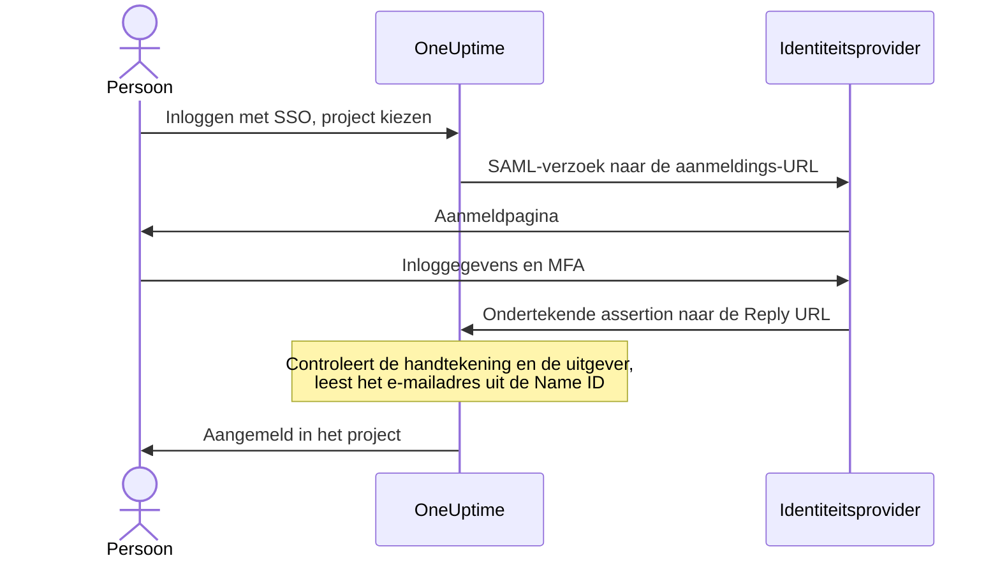

# SSO

Met single sign-on (SSO) melden de mensen in uw project zich bij OneUptime aan via de identiteitsprovider (IdP) van uw organisatie, met SAML 2.0 of OpenID Connect. U beheert toegang, wachtwoorden en meervoudige verificatie op één plek, en u kunt SSO voor iedereen in het project verplichten.

> [!NOTE]
> **Editie:** SSO, inclusief "Require SSO for login", maakt deel uit van elke editie van OneUptime: zelf gehoste installaties krijgen het in de Community Edition, zonder licentie. Op OneUptime Cloud is het beschikbaar vanaf het **Scale**-abonnement. Zie [Enterprise Edition](/docs/self-hosted/enterprise) voor wat elke editie bevat.

:::cards
- [Een SAML-provider instellen](#sso-instellen): Maak hem aan in OneUptime en geef uw IdP twee URL's.
- [Handleidingen per identiteitsprovider](#handleidingen-per-identiteitsprovider): Keycloak, Microsoft Entra ID en Okta, stap voor stap.
- [OpenID Connect](#openid-connect-oidc): Aanmelden via een OIDC-app.
- [SSO verplichten](#sso-verplichten-voor-uw-project): Maak SSO de enige weg het project in.
:::

## Zo werkt aanmelden met SAML

Een SAML-provider koppelt één project aan één applicatie in uw identiteitsprovider. Wie zich aanmeldt, kiest het project op de pagina **Inloggen met SSO** van OneUptime, meldt zich aan bij uw IdP en komt aangemeld terug.



OneUptime leest maar een paar dingen uit de assertion die uw IdP stuurt:

| Uit de assertion | Wat OneUptime ermee doet |
| --- | --- |
| Handtekening | Controleert die met het **Openbaar certificaat** van de provider. Het antwoord moet ondertekend zijn en mag niet versleuteld zijn. |
| Issuer | Moet exact overeenkomen met de **Uitgever** van de provider. |
| Name ID | Het e-mailadres van de persoon. Het moet een geldig e-mailadres zijn. |
| `http://schemas.microsoft.com/identity/claims/displayname` | De naam van de persoon, gebruikt wanneer OneUptime het account aanmaakt. Optioneel. |

Wie zich voor het eerst aanmeldt, komt in de **Teams** van de provider, en die bepalen wat de persoon mag: zie [Rollen en teams voor SSO-gebruikers](#rollen-en-teams-voor-sso-gebruikers).

> [!NOTE]
> Op OneUptime Cloud meldt OneUptime iemand die zich voor het eerst met een SAML- of OIDC-provider van het project aanmeldt niet meteen aan, maar stuurt het een link per e-mail. De persoon opent die, bevestigt dat de single sign-on van het project hem mag aanmelden en gaat verder met aanmelden. De link is 24 uur geldig. Dit gebeurt één keer per project, en opnieuw als iemand het project verlaat en terugkomt. Zelf gehoste installaties melden mensen direct aan.

## SSO instellen

U hebt toestemming nodig om SSO-providers toe te voegen — **Project Owner**, **Project Admin** of **Create Project SSO** — en op OneUptime Cloud het **Scale**-abonnement. Voor de kant van uw identiteitsprovider, zie de [handleidingen per identiteitsprovider](#handleidingen-per-identiteitsprovider).

:::steps
1. **Naar de projectinstellingen gaan**

   - Open uw OneUptime-project
   - Ga naar **Projectinstellingen** > **Beveiliging** > **SSO**

2. **De SSO-configuratie aanmaken**

   - Klik op **SSO aanmaken**
   - Voer een **Naam** in voor de SSO-configuratie (bijvoorbeeld "Keycloak SAML" of "Okta SAML")
   - Voer de **Aanmeldings-URL** van uw identiteitsprovider in
   - Voer de **Uitgever** (Entity ID) van uw identiteitsprovider in
   - Plak het **Openbaar certificaat** van uw identiteitsprovider
   - In de stap **Aanmelden** begint **Teams** met het ledenteam van uw project: wie zich voor het eerst aanmeldt, komt in deze teams. Alleen teams waarvoor u zelf iemand zou kunnen uitnodigen worden geaccepteerd: een team dat meer toegang geeft dan u hebt, wordt onder **Teams** genoemd
   - De rest staat al ingevuld onder **Meer velden**: de **Handtekeningmethode** (`RSA-SHA256`), de **Digest-methode** (`SHA256`) en een beschrijving ("Sign in with" en de naam). Wijzig ze alleen als uw identiteitsprovider dat vraagt

3. **De SSO-metadata van OneUptime ophalen**
   - Bij het opslaan opent het dialoogvenster **SSO Configuration**. U opent het opnieuw met de knop **SSO-configuratie bekijken**
   - Kopieer de **Identifier (Entity ID)**, zoals `https://oneuptime.com/<project-id>/<provider-id>` — die is nodig in de configuratie van uw IdP
   - Kopieer de **Reply URL (Assertion Consumer Service URL)**, zoals `https://oneuptime.com/identity/idp-login/<project-id>/<provider-id>` — die is nodig in de configuratie van uw IdP
   - Een nieuwe provider staat eerst uit. Zodra uw IdP deze twee waarden heeft, bewerkt u de provider en zet u **Ingeschakeld** aan

4. **De provider testen**
   - Open de link in de kaart **Test Single Sign On (SSO)** en kies de provider op de pagina die opent. U gaat naar de aanmeldpagina van uw identiteitsprovider en komt aangemeld terug in OneUptime
   - Zodra het werkt, kunt u voor het project [SSO verplichten](#sso-verplichten-voor-uw-project)
:::

## Handleidingen per identiteitsprovider

Kies uw identiteitsprovider. Elke handleiding haalt de waarden van de IdP op, maakt de provider aan in OneUptime en geeft de IdP vervolgens de **Identifier (Entity ID)** en de **Reply URL** van OneUptime.

:::tabs
@tab Keycloak
Keycloak is een veelgebruikte opensourceoplossing voor identiteits- en toegangsbeheer. U hebt een draaiende Keycloak-instantie met een realm nodig, en beheerderstoegang tot zowel Keycloak als OneUptime.

:::steps
1. **De waarden van uw realm verzamelen**

   - **Aanmeldings-URL**: `https://<your-keycloak-domain>/auth/realms/<your-realm>/protocol/saml`
   - **Uitgever**: `https://<your-keycloak-domain>/auth/realms/<your-realm>`
   - **Certificaat**: het ondertekeningscertificaat van de realm. Open `https://<your-keycloak-domain>/auth/realms/<your-realm>/protocol/saml/descriptor` en kopieer de waarde `X509Certificate`, of open **Realm settings** > **Keys** en klik bij de RS256-sleutel op **Certificate**

   Keycloak 17 en nieuwer serveren deze URL's zonder het voorvoegsel `/auth`. Zet het certificaat tussen zijn eigen regels, zo:

   ```text
   -----BEGIN CERTIFICATE-----
   MIICnzCCAYcCBgFyPZ8QFzANBgkqhkiG.......
   -----END CERTIFICATE-----
   ```

2. **De provider aanmaken in OneUptime**

   Ga naar **Projectinstellingen** > **Beveiliging** > **SSO**, klik op **SSO aanmaken** en vul in:
   - **Naam**: een beschrijvende naam (bijvoorbeeld `my-project-oneuptime`)
   - **Aanmeldings-URL** en **Uitgever**: de waarden hierboven
   - **Openbaar certificaat**: het certificaat, tussen zijn eigen regels `BEGIN CERTIFICATE` en `END CERTIFICATE`
   - **Handtekeningmethode** en **Digest-methode**: al ingesteld onder **Meer velden** (`RSA-SHA256` en `SHA256`)

   Sla op en kopieer de **Identifier (Entity ID)** en de **Reply URL (Assertion Consumer Service URL)** uit het dialoogvenster dat opent.

3. **De Keycloak-client aanmaken**

   Open in Keycloak **Clients** in uw realm en maak een client aan, of bewerk een bestaande:
   - **Client Protocol** (clienttype): `saml`
   - **Client ID**: de **Identifier (Entity ID)** uit OneUptime
   - **Root URL** en **Valid Redirect URIs**: uw OneUptime-URL
   - **Assertion Consumer Service POST Binding URL**: de **Reply URL (Assertion Consumer Service URL)** uit OneUptime

4. **De clientinstellingen aanpassen**

   - Zet **Name ID Format** op `email` en schakel **Force Name ID Format** in, zodat Keycloak het e-mailadres altijd als Name ID stuurt
   - Zet op het tabblad **Keys** van de client **Client signature required** (onder **Signing keys config**) uit: OneUptime ondertekent zijn verzoeken niet

5. **De provider inschakelen en testen**

   Bewerk in OneUptime de provider en zet **Ingeschakeld** aan, open daarna de link in de kaart **Test Single Sign On (SSO)** en kies de provider. U zou naar de aanmeldpagina van Keycloak moeten gaan en terug naar OneUptime.
:::
@tab Microsoft Entra ID
Microsoft Entra ID (voorheen Azure AD / Active Directory) is de cloudidentiteitsdienst van Microsoft. U hebt een tenant nodig die bedrijfsapplicaties met SAML-SSO ondersteunt, en beheerderstoegang tot zowel Entra ID als OneUptime.

:::steps
1. **Een bedrijfsapplicatie aanmaken in Entra ID**

   - Meld u aan bij het [Microsoft Entra admin center](https://entra.microsoft.com)
   - Ga naar **Identity** > **Applications** > **Enterprise applications**, klik op **+ New application** en daarna op **+ Create your own application**
   - Voer een naam in (bijvoorbeeld "OneUptime"), selecteer **Integrate any other application you don't find in the gallery (Non-gallery)** en klik op **Create**

2. **De SAML-waarden van Entra ID kopiëren**

   - Ga in de applicatie naar **Single sign-on** en selecteer **SAML**
   - Download onder **SAML Certificates** het **Certificate (Base64)**, open het bestand in een teksteditor en kopieer de inhoud
   - Kopieer onder **Set up OneUptime** de **Login URL** en de **Microsoft Entra Identifier** (**Azure AD Identifier** in oudere tenants)

3. **De provider aanmaken in OneUptime**

   Ga naar **Projectinstellingen** > **Beveiliging** > **SSO**, klik op **SSO aanmaken** en vul in:
   - **Naam**: een beschrijvende naam (bijvoorbeeld `Azure AD SAML`)
   - **Aanmeldings-URL**: de **Login URL**
   - **Uitgever**: de **Microsoft Entra Identifier**
   - **Openbaar certificaat**: het Base64-certificaat, inclusief de regels `BEGIN CERTIFICATE` en `END CERTIFICATE`
   - **Handtekeningmethode** en **Digest-methode**: al ingesteld onder **Meer velden** (`RSA-SHA256` en `SHA256`)

   Sla op en kopieer de **Identifier (Entity ID)** en de **Reply URL (Assertion Consumer Service URL)** uit het dialoogvenster dat opent.

4. **Entra ID de URL's van OneUptime geven**

   Klik onder **Basic SAML Configuration** op **Edit** en stel in:
   - **Identifier (Entity ID)**: de **Identifier (Entity ID)** uit OneUptime
   - **Reply URL (Assertion Consumer Service URL)**: de **Reply URL** uit OneUptime

   Klik op **Save**.

5. **Het e-mailadres als Name ID versturen**

   Klik onder **Attributes & Claims** op **Edit**:
   - Zet **Unique User Identifier (Name ID)** op het e-mailadres van de gebruiker: `user.mail`, of `user.userprincipalname` waar dat het e-mailadres is
   - Zet het **Name identifier format** op `Email address`
   - Voeg eventueel een claim toe met de naam `http://schemas.microsoft.com/identity/claims/displayname` en het bronattribuut `user.displayname`, zodat nieuwe accounts de naam van de persoon krijgen. OneUptime negeert de andere claims

6. **Gebruikers en groepen toewijzen**

   Klik onder **Users and groups** van de applicatie op **+ Add user/group**, selecteer de gebruikers en groepen die SSO-toegang krijgen en klik op **Assign**.

7. **De provider inschakelen en testen**

   Bewerk in OneUptime de provider en zet **Ingeschakeld** aan, open daarna de link in de kaart **Test Single Sign On (SSO)** en kies de provider. U zou naar de aanmeldpagina van Microsoft moeten gaan en terug naar OneUptime.
:::
@tab Okta
Okta is een veelgebruikt identiteitsplatform met SAML-SSO. U hebt een Okta-organisatie met beheerderstoegang nodig, en beheerderstoegang tot OneUptime.

:::steps
1. **Een SAML-applicatie aanmaken in Okta**

   - Ga in de Okta Admin Console naar **Applications** > **Applications** en klik op **Create App Integration**
   - Selecteer **SAML 2.0** en klik op **Next**, voer "OneUptime" in als **App name** en klik op **Next**
   - Okta vraagt om de URL's van OneUptime voordat het zijn eigen URL's toont. Voer voorlopig uw OneUptime-adres (bijvoorbeeld `https://oneuptime.com`) in als **Single sign-on URL** en als **Audience URI (SP Entity ID)**: beide vervangt u in stap 4
   - Zet **Name ID format** op `EmailAddress` en **Application username** op `Email`
   - Klik op **Next**, selecteer **I'm an Okta customer adding an internal app** en klik op **Finish**

2. **De SAML-waarden van Okta kopiëren**

   Zoek op het tabblad **Sign On** van de applicatie, onder **SAML Signing Certificates**, het actieve certificaat:
   - Klik op **Actions** > **View IdP metadata** en kopieer de **Aanmeldings-URL** (Identity Provider Single Sign-On URL) en de **Uitgever** (Identity Provider Issuer)
   - Klik op **Actions** > **Download certificate**, open het bestand `.cert` in een teksteditor en kopieer de inhoud

3. **De provider aanmaken in OneUptime**

   Ga naar **Projectinstellingen** > **Beveiliging** > **SSO**, klik op **SSO aanmaken** en vul in:
   - **Naam**: een beschrijvende naam (bijvoorbeeld `Okta SAML`)
   - **Aanmeldings-URL** en **Uitgever**: de waarden van Okta
   - **Openbaar certificaat**: het certificaat, inclusief de regels `BEGIN CERTIFICATE` en `END CERTIFICATE`
   - **Handtekeningmethode** en **Digest-methode**: al ingesteld onder **Meer velden** (`RSA-SHA256` en `SHA256`)

   Sla op en kopieer de **Identifier (Entity ID)** en de **Reply URL (Assertion Consumer Service URL)** uit het dialoogvenster dat opent.

4. **Okta de URL's van OneUptime geven**

   Klik op het tabblad **General** van de applicatie bij **SAML Settings** op **Edit** en daarna op **Next**, en stel in:
   - **Single sign-on URL**: de **Reply URL (Assertion Consumer Service URL)** uit OneUptime
   - **Audience URI (SP Entity ID)**: de **Identifier (Entity ID)** uit OneUptime

   Voeg eventueel een attribute statement toe met de naam `http://schemas.microsoft.com/identity/claims/displayname` en de waarde `user.firstName + " " + user.lastName`, zodat nieuwe accounts de naam van de persoon krijgen. Klik op **Next** en daarna op **Finish**.

5. **Mensen toewijzen**

   Klik op het tabblad **Assignments** op **Assign** > **Assign to People** of **Assign to Groups**, selecteer wie SSO-toegang krijgt, klik bij elk op **Assign** en daarna op **Done**.

6. **De provider inschakelen en testen**

   Bewerk in OneUptime de provider en zet **Ingeschakeld** aan, open daarna de link in de kaart **Test Single Sign On (SSO)** en kies de provider. U zou naar de aanmeldpagina van Okta moeten gaan en terug naar OneUptime.
:::
@tab Andere
De SSO van OneUptime gebruikt SAML 2.0 en werkt met elke conforme identiteitsprovider:

:::steps
1. Haal de **Aanmeldings-URL** (het SSO-eindpunt), de **Uitgever** (de Entity ID) en het **Openbaar certificaat** (het X.509-ondertekeningscertificaat) van uw identiteitsprovider op. Toont uw IdP ze pas als er een applicatie bestaat, maak de applicatie dan aan met uw OneUptime-adres als tijdelijke URL's.
2. Maak in OneUptime de provider aan met die waarden en kopieer de **Identifier (Entity ID)** en de **Reply URL (Assertion Consumer Service URL)** uit het dialoogvenster **SSO Configuration** (of via **SSO-configuratie bekijken**).
3. Stel in de SAML-applicatie van uw identiteitsprovider de **Assertion Consumer Service URL / Reply URL** en de **Entity ID / Audience URI** in op de waarden van OneUptime, en het **Name ID Format** op e-mailadres.
4. De **Handtekeningmethode** (`RSA-SHA256`) en de **Digest-methode** (`SHA256`) staan al ingesteld onder **Meer velden**; wijzig ze alleen als uw identiteitsprovider anders ondertekent
5. Zet **Ingeschakeld** aan voor de provider en test hem met de link in de kaart **Test Single Sign On (SSO)**.
:::
:::

## OpenID Connect (OIDC)

Een project kan zich ook aanmelden via een OpenID Connect-provider, zoals Google Workspace, Okta, Microsoft Entra ID, Auth0 of Keycloak. U hebt toestemming nodig om OIDC-providers toe te voegen (**Project Owner**, **Project Admin** of **Create Project OIDC**) en op OneUptime Cloud het **Scale**-abonnement.

:::steps
1. Registreer bij uw identiteitsprovider een app (een OIDC-client) die de authorization code flow met PKCE mag gebruiken, en kopieer de **Uitgever-URL**, de **Client-ID** en het **Client-secret**.
2. Ga in OneUptime naar **Projectinstellingen** > **Beveiliging** > **OIDC** en klik op **OIDC aanmaken**.
3. Voer een **Naam** in (wat mensen op de aanmeldpagina zien), de **Uitgever-URL**, de **Client-ID** en het **Client-secret**. U kunt ook de discovery-URL van de provider in **Uitgever-URL** plakken.
4. In de stap **Aanmelden** begint **Teams** met het ledenteam van uw project: wie zich voor het eerst aanmeldt, komt in deze teams. De rest staat al ingevuld onder **Meer velden**: de **Discovery-URL** (de uitgever gevolgd door `/.well-known/openid-configuration`), de **Bereiken** (`openid email profile`), de claimnamen `email` en `name`, en een beschrijving ("Sign in with" en de naam). Wijzig ze alleen als uw provider dat vraagt. Alleen teams waarvoor u zelf iemand zou kunnen uitnodigen worden geaccepteerd: een team dat meer toegang geeft dan u hebt, wordt onder **Teams** genoemd.
5. Sla op. Het dialoogvenster **OIDC Configuration** opent met de **Redirect URI**: voeg die toe aan de toegestane redirect-URI's van uw app. Een nieuwe provider staat eerst uit, dus bewerk hem daarna en zet **Ingeschakeld** aan.
6. Meld u met de link in de kaart **Test OpenID Connect (OIDC)** via de provider aan voordat u voor het project SSO verplicht.
:::

## Rollen en teams voor SSO-gebruikers

OneUptime neemt geen rollen of groepen over van uw identiteitsprovider. Wat iemand mag, volgt uit de teams waarin de persoon zit: een provider voegt nieuwkomers toe aan zijn **Teams**, en u beheert teams en hun machtigingen in OneUptime, zoals [Gebruikers, teams en machtigingen](/docs/permissions/index) beschrijft. Gebruik [SCIM](/docs/identity/scim) om het teamlidmaatschap gelijk te houden met uw identiteitsprovider.

De teams van een provider bepalen wat mensen die zich ermee aanmelden mogen, daarom wordt een provider alleen opgeslagen met teams waarvoor degene die hem opslaat iemand zou kunnen uitnodigen. Elke keer opslaan controleert ze opnieuw: een provider waarvan de teams meer toegang geven dan u hebt, kan alleen worden gewijzigd door iemand wiens toegang ze dekt, zoals een projecteigenaar. Providers die vóór deze controle zijn opgeslagen, blijven mensen in hun teams aanmelden. Wie een provider mag bewerken, kan hem altijd uitzetten, zodat hij meteen kan worden gestopt.

## SSO verplichten voor uw project

Een ingestelde provider houdt niemand tegen om zich met een wachtwoord aan te melden. Om SSO de enige weg het project in te maken, gebruikt u de schakelaar **SSO vereisen voor inloggen** onder **Projectinstellingen** > **Beveiliging** > **SSO**, onder uw providers:

:::steps
1. Test eerst uw provider met de link in de kaart **Test Single Sign On (SSO)**.
2. Zet **SSO vereisen voor inloggen** aan. OneUptime vraagt eerst om bevestiging: vanaf dan moet iedereen in het project, uzelf inbegrepen, zich met SSO aanmelden om het te openen, en wie met een wachtwoord is aangemeld, is buitengesloten van het project tot hij zich met SSO aanmeldt.
3. Klik op **SSO vereisen** om te bevestigen. De schakelaar slaat direct op; er is geen aparte knop om op te slaan.
:::

Om **SSO vereisen voor inloggen** aan te zetten, is een provider nodig die mensen in het project aanmeldt: een eigen SAML- of OIDC-provider die aanstaat, of een globale provider die aanstaat en mensen in het project aanmeldt. Zonder zo'n provider weigert OneUptime en vraagt het u eerst een provider voor het project in te schakelen en te testen. Kiest u een provider die het project verplicht, dan moet het een van die zijn, en hetzelfde wordt gevraagd als u later een andere provider verplicht.

Een opslag die **SSO vereisen voor inloggen** als ingeschakeld verstuurt terwijl het al aanstaat, of de provider noemt die het project al verplicht, wordt op dezelfde manier gecontroleerd — de API, Terraform en andere tools sturen vaak bij elke opslag alle instellingen mee. Zolang het project dus geen provider heeft die mensen aanmeldt, of de verplichte provider sindsdien is uitgezet, wordt zo'n opslag met dezelfde woorden geweigerd, wat er verder ook verandert: zet eerst een provider aan, verplicht een andere of zet **SSO vereisen voor inloggen** uit.

Voor een nieuw project geldt dezelfde regel. Het heeft nog geen eigen provider, dus het aanmaken met **SSO vereisen voor inloggen** al aan — dat kan alleen een master-admin — vereist een globale provider die aanstaat en mensen in elk project aanmeldt, en zonder zo'n provider wordt het met dezelfde woorden geweigerd. Maak het project aan, stel de provider in en test hem, en zet daarna de schakelaar aan.

Zolang de hele server SSO verplicht (**Admin** > **Instellingen** > **Authenticatie** > **SSO vereisen voor inloggen**), vereist het aanmaken van elk project ook zo'n globale provider, anders zou niemand, ook niet degene die het aanmaakt, het project kunnen openen. Zonder zo'n provider wordt het aanmaken van een project geweigerd, en vraagt de melding een serverbeheerder er een aan te zetten. Master-admins kunnen nog steeds projecten aanmaken.

Het uitzetten van **SSO vereisen voor inloggen** slaat op zodra u de schakelaar omzet en laat leden direct weer met hun wachtwoord binnen — tenzij iemand hem op precies dat moment weer aanzet; dan kan een appserver tot een minuut nodig hebben om bij te werken. Projecteigenaren, projectbeheerders en leden met de machtiging **Edit Project** kunnen hem wijzigen; anderen zien de schakelaar vergrendeld, met de machtiging die ze nodig zouden hebben.

> [!NOTE]
> Op OneUptime Cloud vereist het verplichten van SSO het **Scale**-abonnement, en uitzetten werkt op elk abonnement. Onder Scale toont **Projectinstellingen** > **Beveiliging** > **SSO** het upgrade-aanbod van het abonnement; een project dat na een Scale-proefperiode nog SSO verplicht, vindt daar onder het aanbod ook **SSO vereisen voor inloggen**, zodat het kan worden uitgezet. Opnieuw aanzetten vereist **Scale**.

## Een provider uitzetten of verwijderen

| Wat u wijzigt | Mensen die zich met de provider hebben aangemeld |
| --- | --- |
| Uitzetten of verwijderen | Melden zich bij hun volgende verzoek opnieuw met SSO aan, waar SSO verplicht is |
| Een nieuw certificaat of client-secret, andere URL's, een nieuwe naam of andere teams | Blijven aangemeld |
| Aanzetten | Kunnen zich er direct mee aanmelden |

Een SAML- of OIDC-provider uitzetten of verwijderen beëindigt de aanmeldingen die hij heeft gegeven. In een project dat SSO verplicht, zelf of omdat de hele server dat doet:

- Wie zich ermee heeft aangemeld, moet zich bij het volgende verzoek opnieuw met SSO aanmelden, en de geopende pagina's krijgen meteen geen live-updates meer.
- Een MCP-client die iemand na het aanmelden ermee heeft gekoppeld, werkt niet meer in het project. Koppel hem opnieuw na het aanmelden met SSO.
- De provider weer aanzetten brengt die aanmeldingen niet terug: mensen melden zich er opnieuw mee aan.

Al het andere aan een provider wijzigen laat iedereen aangemeld: een nieuw certificaat of client-secret, andere URL's, een nieuwe naam of andere teams. Hun aanmeldingen zijn gecontroleerd toen ze plaatsvonden, en de volgende aanmelding gebruikt de nieuwe instellingen.

Zolang het project SSO verplicht, houdt OneUptime een weg naar binnen open: u kunt de laatste provider waarmee mensen zich in het project kunnen aanmelden — globale providers die mensen in het project aanmelden meegeteld — of de provider die het project verplicht, niet uitzetten of verwijderen. Zet eerst **SSO vereisen voor inloggen** uit.

Een provider aanzetten laat mensen zich er direct mee aanmelden.

Als de hele server SSO verplicht (**Admin** > **Instellingen** > **Authenticatie** > **SSO vereisen voor inloggen**), houdt elk project op dezelfde manier een weg naar binnen, ook een project dat zelf geen SSO verplicht: zet er eerst een andere provider voor aan.

Voor globale providers geldt dezelfde regel: een wijziging aan een globale provider of aan zijn gekoppelde projecten die een project dat SSO verplicht zonder provider zou laten, wordt geweigerd en noemt het project. Zie [Globale SSO](/docs/identity/global-sso#een-provider-uitzetten-of-verwijderen).

Waar noch het project noch de server SSO verplicht, stopt het uitzetten van een provider nieuwe aanmeldingen ermee. Wie al is aangemeld, blijft aangemeld, net als mensen die zich met een wachtwoord hebben aangemeld.

## Providers onder het Scale-abonnement

Een SAML- of OIDC-provider die een project nog heeft, blijft mensen aanmelden nadat een Scale-proefperiode afloopt of het abonnement omlaag gaat. Daarom tonen de pagina's **SSO** en **OIDC** onder Scale de providers van het project onder het upgrade-aanbod (**Nog ingestelde SAML-providers**, **Nog ingestelde OIDC-providers**):

- **Uitzetten** stopt een provider meteen. OneUptime vraagt eerst om bevestiging.
- **Verwijderen** haalt hem weg.

Een provider toevoegen, wijzigen of weer aanzetten vereist **Scale**. Wie wat mag, is hetzelfde als met Scale: een provider uitzetten vereist toestemming om hem te bewerken, verwijderen toestemming om hem te verwijderen.

Zolang het project nog SSO verplicht, tonen de pagina's **SSO** en **OIDC** ook **SSO vereisen voor inloggen**: zet het uit voordat u de laatste provider uitzet. Tot dan kan de laatste provider waarmee mensen zich kunnen aanmelden niet worden uitgezet of verwijderd, zodat niemand uit het project wordt buitengesloten.

De pagina's **SSO** en **OIDC** van een statuspagina tonen de eigen providers op dezelfde manier. Zolang de statuspagina nog SSO verplicht, tonen beide pagina's ook **SSO vereisen voor inloggen**: zet het uit voordat u de providers uitzet, anders kunnen de privégebruikers zich helemaal niet meer aanmelden.

## Problemen oplossen

:::details "SSO Config not found"
De provider staat uit, of de link hoort bij een provider die niet meer bestaat. Een nieuwe provider staat eerst uit: bewerk hem en zet **Ingeschakeld** aan.
:::

:::details "No teams added."
De persoon zit nog niet in het project en de provider heeft geen **Teams** om hem aan toe te voegen. Bewerk de provider en kies minstens één team, zoals het ledenteam van uw project.
:::

:::details "Issuer URL does not match"
De issuer in de assertion van uw IdP is niet de **Uitgever** van de provider. Kopieer hem opnieuw uit uw IdP — de realm-URL van Keycloak, de **Microsoft Entra Identifier** of de Identity Provider Issuer van Okta — zodat beide exact overeenkomen.
:::

:::details Aanmelden mislukt met een handtekening- of certificaatfout
Plak het huidige ondertekeningscertificaat van de IdP in **Openbaar certificaat**, inclusief de regels `BEGIN CERTIFICATE` en `END CERTIFICATE`. Download voor Entra ID het **Base64**-certificaat, niet het ruwe; voor Okta het actieve ondertekeningscertificaat; voor Keycloak het certificaat van de juiste realm.
:::

:::details "Encrypted SAML Responses are not supported"
OneUptime ontsleutelt geen assertions. Zet de versleuteling van assertions voor de applicatie in uw IdP uit, zodat die een onversleutelde, ondertekende assertion stuurt.
:::

:::details "SAML response did not include a valid email address"
OneUptime leest het e-mailadres uit de Name ID. Zet de Name ID op het e-mailadres van de gebruiker: **Name ID Format** `email` met **Force Name ID Format** in Keycloak, de **Unique User Identifier (Name ID)** in Entra ID, of **Name ID format** `EmailAddress` en **Application username** `Email` in Okta. Het adres moet overeenkomen met het OneUptime-account van de persoon.
:::

:::details Entra ID: AADSTS700016
De **Identifier (Entity ID)** in Entra ID komt niet overeen met die van OneUptime. Kopieer hem opnieuw via **SSO-configuratie bekijken**; beide waarden moeten identiek zijn.
:::

:::details Okta: 404, of een audience die niet overeenkomt
De **Single sign-on URL** in Okta moet exact de **Reply URL** van OneUptime zijn, en de **Audience URI** exact de **Identifier (Entity ID)** van OneUptime. Controleer of beide de tijdelijke waarden hebben vervangen.
:::

:::details De gebruiker is niet aan de applicatie toegewezen
Entra ID en Okta melden alleen mensen aan die aan de applicatie zijn toegewezen. Wijs de gebruiker toe, of een groep waarin hij zit.
:::

:::details Keycloak: omleidingslus
Controleer of **Valid Redirect URIs** en **Assertion Consumer Service POST Binding URL** zijn ingesteld zoals hierboven, op de client in de juiste realm.
:::

## Volgende stappen

:::cards
- [Globale SSO](/docs/identity/global-sso): Eén identiteitsprovider voor elk project op een zelf gehoste instantie.
- [SCIM](/docs/identity/scim): Laat uw identiteitsprovider automatisch mensen toevoegen en verwijderen.
- [Gebruikers, teams en machtigingen](/docs/permissions/index): Wat de teams waarin nieuwkomers komen hun toestaan.
:::
