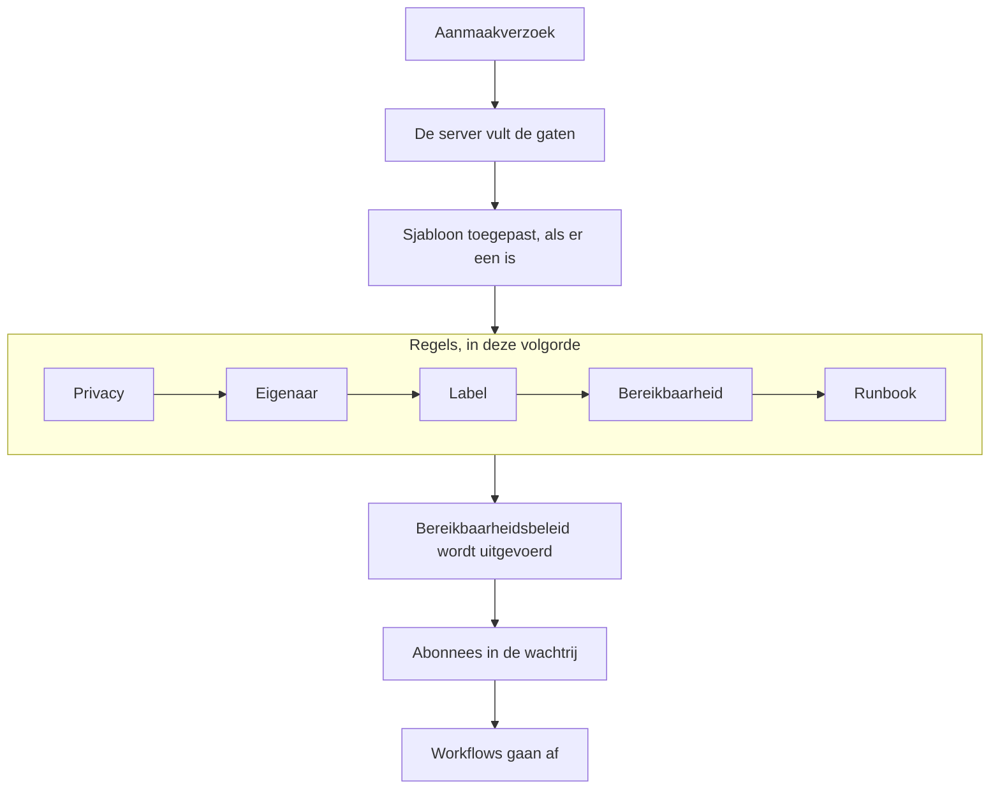

# Een incident melden

Een incident melden maakt het dossier aan van waaruit je team werkt: het krijgt een nummer, een ernst en een beginstatus, het bereikbaarheidsbeleid roept mensen op, en — tenzij je anders aangeeft — de abonnees van de statuspagina horen ervan. Deze pagina loopt de vijf manieren om er een te melden veld voor veld door, en laat zien wat er gebeurt op het moment dat het bestaat.

:::cards
- [Met de hand melden](#met-de-hand-melden): Het formulier in drie stappen, veld voor veld.
- [Melden vanuit een sjabloon](#melden-vanuit-een-sjabloon): Hetzelfde soort incident, elke keer vooraf ingevuld.
- [Melden vanuit monitorcriteria](#automatisch-melden-vanuit-monitorcriteria): Laat een mislukte controle het voor je openen.
- [Melden via de API](#melden-via-de-api): Vanuit je eigen code, een script of een andere tool.
:::

## Vijf manieren waarop een incident wordt gemeld

Er zijn vijf manieren waarop een incident in OneUptime terechtkomt, en ze komen allemaal op dezelfde plek uit: een rij in de tabel `Incident` met een ernst, een huidige status en een lijst getroffen middelen. Het enige verschil is wie de velden invult — jij om drie uur 's nachts, een opgeslagen sjabloon, de criteria van een monitor, je eigen code die de API aanroept, of iemand buiten je team die een formulier invult.

| Als je wilt…                                                 | Kies                                                                         |
| ------------------------------------------------------------ | ---------------------------------------------------------------------------- |
| Een incident met de hand openen en alles zelf invullen       | De wizard **Incident melden**                                                |
| Een terugkerend soort incident openen met vooraf ingevulde velden | **Maken op basis van sjabloon**                                         |
| Er automatisch een openen als de controles van een monitor mislukken | Een criteriafilter van een monitor met **Wanneer filters overeenkomen, verklaar een incident.** |
| Er een openen vanuit je eigen code, een script of een andere tool | `POST /api/incident`                                                    |
| Mensen buiten je team via een link een probleem laten melden | Een [formulier](/docs/forms/index)                                           |

Alle vijf schrijven hetzelfde model, dus een incident dat een probe opende, ziet er precies zo uit als een incident dat een responder met de hand opende — op een paar administratieve kolommen na die de server bij automatische incidenten invult. Integraties schrijven het ook: [Huntress](/docs/integrations/huntress) opent één incident voor elk incidentrapport dat zijn SOC stuurt.

> [!TIP]
> Je kunt een incident ook vanuit waarschuwingen melden: **Incident melden** in een lijst met waarschuwingen, in de kop van een waarschuwing of op de pagina **Gekoppelde incidenten** van een waarschuwing opent dezelfde wizard, vooraf ingevuld vanuit de waarschuwingen, en koppelt ze aan het nieuwe incident. Een vakje op het formulier, standaard aangevinkt, bevestigt de waarschuwingen ook, zodat ze niet verder escaleren. Zie [Gekoppelde waarschuwingen](/docs/incidents/linked-alerts).

## Met de hand melden

Het formulier **Nieuw incident melden** vraagt in drie stappen om een incident — **Incidentdetails**, **Getroffen middelen** en **Bereikbaarheid en rollen** — en toont daarna een samenvatting om na te lopen. Vraagt je project bij het aanmaken om een deel van zijn aangepaste incidentvelden, dan volgt direct na **Getroffen middelen** een vierde stap, **Details**.

:::steps
1. Open **Incidenten → Alle incidenten** en klik rechtsboven in de lijst **Incidenten** op **Incident melden**. Het formulier opent op **Incidentdetails**.
2. Voer een **Titel** in en kies een **Ernst van incident**. De rest van het formulier is optioneel.
3. Klik via **Volgende** door de overige stappen en vul in wat je nu weet: monitoren en andere middelen, bereikbaarheidsbeleid, rollen.
4. Lees de samenvatting en klik op **Incident melden**. Je komt op het nieuwe incident terecht, en de **Incidentfeed** begint met vastleggen.
:::

Alleen de eerste stap heeft verplichte velden, plus elk aangepast veld dat je beheerders als **Verplicht bij aanmaken** hebben gemarkeerd, waar de stap **Details** om vraagt. Elke stap vóór de samenvatting heeft een gewone knop **Volgende**, en **Incident melden** staat op de samenvatting, de laatste stap. Heb je haast, vul dan **Incidentdetails** in en druk door de andere stappen op **Volgende** zonder ze in te vullen: middelen toevoegen, bereikbaarheidsbeleid toevoegen en rollen toewijzen kan ook wachten tot de eigen pagina's van het incident. Op **Enter** drukken in een veld gaat ook verder; het meldt nooit vóór de samenvatting.

> [!TIP]
> De opties die de meeste incidenten nooit nodig hebben, wachten ingeklapt onder een kop **Meer velden** aan het eind van hun stap; klik erop om ze te openen. Zolang die ingeklapt is, noemt de kop wat erin zit en toont hij elke ingestelde optie met haar waarde — ingesteld door een sjabloon bijvoorbeeld, of door een privéwaarschuwing waarvandaan je meldt — en hij gaat vanzelf open als er iets in moet worden verbeterd. De samenvatting noemt zo'n optie alleen als ze is ingesteld — behalve **Statuspagina-abonnees op de hoogte stellen**, die ze altijd noemt, met wie er een melding krijgt.

**Vanaf de eigen pagina van een middel.** **Incident melden** op het tabblad **Incidenten** van een monitor, een host, een service, een cluster of de meeste andere middelen opent hetzelfde formulier met dat middel al gekozen op **Getroffen middelen**, zodat een titel en een ernst volstaan, en het incident verschijnt op het tabblad waar je begon.

:::details Welke pagina's van middelen het aanbieden, en wat ze kiezen
**Incident melden** op het tabblad **Incidenten** van een monitor, een host, een Kubernetes-, Proxmox-, Ceph- of Docker Swarm-cluster, een Docker- of Podman-host, een vCenter, een opslagarray, een IoT-vloot, een database of een service opent dezelfde wizard met dat middel al gekozen op **Getroffen middelen** (een monitor onder **Monitoren**, al het andere onder **Andere getroffen resources**), vóór alles wat een sjabloon toevoegt. **Maken op basis van sjabloon** op dat tabblad houdt het middel ook vast. Het kruimelpad leidt terug via het tabblad van het middel, en na het melden kom je op het nieuwe incident terecht, net als vanuit de incidentenlijst.

Het tabblad **Incidenten** van een inventarisitem kiest de host, de service of het Kubernetes-cluster waarnaar het item verwijst, en het kruimelpad leidt terug via het tabblad van dat middel. **Waarschuwing maken** op het tabblad **Waarschuwingen** van een middel werkt net zo: vanuit een monitor vult het de **Monitor** van de waarschuwing in, vanuit al het andere **Andere getroffen resources**.

Het middel wordt opgezocht met je eigen machtigingen: kun je het niet lezen, of is het verwijderd, dan opent het formulier gewoon zonder dat er iets is gekozen.
:::

### Stap 1 — Incidentdetails

- **Titel** — verplicht. De samenvatting van één regel die iedereen ziet in de lijst, in Slack en (als het incident zichtbaar is) op je statuspagina. Voorbeeldtekst: `Incident Title`.
- **Ernst van incident** — verplicht. Een van de ernstniveaus die voor je project zijn ingesteld; nieuwe projecten krijgen vooraf **Critical Incident**, **Major Incident** en **Minor Incident**.
- **Beschrijving** — optioneel, geschreven in Markdown. Dit is het veld dat op de statuspagina wordt weergegeven, dus schrijf het voor klanten en niet voor je team. Een afbeelding die je erin zet, is voor iedereen te zien zolang het incident zichtbaar is op statuspagina's, en alleen voor de leden van je project zolang het verborgen is. Je kunt het later bewerken via **Beschrijving** in het zijmenu van het incident.

Onder **Meer velden**:

- **Verklaard op** — begint op het moment dat je de pagina opende. Dit is het tijdstip waarvandaan elke duur van het incident wordt gemeten, dus zet het terug als je iets vastlegt dat eerder begon.
- **Initiële status** — optioneel, en in het begin leeg. Laat je het leeg, dan begint het incident in de status met de vlag `isCreatedState`, die nieuwe projecten vooraf als **Identified** aanmaken — of in de beginstatus van het sjabloon, als je vanuit een sjabloon meldt. Kies alleen een latere status als je een incident vastlegt dat al voorbij dat punt was, bevestigd of opgelost. Zo'n incident roept niemand op — zie [Al bevestigd of opgelost gemeld](#al-bevestigd-of-opgelost-gemeld).
- **Labels** — optioneel. Labels groeperen verwante incidenten zodat je erop kunt filteren, en een team waarvan de machtigingen tot labels beperkt zijn, ziet alleen de incidenten die een van zijn labels dragen.
- **Privé-incident** — selectievakje, standaard uit (`isPrivate`). Een privé-incident is alleen zichtbaar voor de gebruikers die eigenaar zijn, de leden van de teams die eigenaar zijn, projectbeheerders en projecteigenaren — en het is verborgen voor elke statuspagina, ongeacht elke andere instelling, ook voor de statuspagina's waartoe het is beperkt. De incidentenlijst markeert deze incidenten met een rood label **Private**.

> [!NOTE]
> **Waarschuwingen en episodes beginnen ook in de status die je kiest.** **Waarschuwing maken**, en **Episode aanmaken** in de lijsten met incident- en waarschuwingsepisodes, hebben dezelfde **Initiële status** onder **Meer velden**. Laat je die leeg, dan begint de waarschuwing of episode in de aanmaakstatus van het project. Kies een latere status om er een vast te leggen die al bevestigd of opgelost was: ze begint in die status, haar statustijdlijn begint ermee, en een episode die als opgelost is vastgelegd, telt meteen als opgelost. Haar eigenaren krijgen over die eerste status niet apart bericht, en de abonnees van de statuspagina van een incidentepisode horen er één keer van, wanneer de episode wordt aangemaakt. Een waarschuwing of episode die zo wordt vastgelegd, roept niemand op, net als een incident: zie [Al bevestigd of opgelost gemeld](#al-bevestigd-of-opgelost-gemeld). Via de API is dezelfde keuze `currentAlertStateId` of `currentIncidentStateId` — zie [OneUptime API-referentie](/docs/api-reference/api-reference).

:::details Schrijven in de Markdown-editor
De beschrijving — net als notities, de hoofdoorzaak, het herstel en aangepaste velden met opgemaakte tekst — schrijf je in de Markdown-editor. Die opent in de visuele modus, die de tekst opgemaakt toont; **Markdown** in de werkbalk schakelt naar de Markdown-modus, die de Markdown-bron toont, en **Visual** schakelt terug. In een lijst laten **Inspringing vergroten** en **Inspringing verkleinen** in de werkbalk, of Tab en Shift+Tab, een item onder het item erboven inspringen en weer terugspringen; waar er niets is om onder in te springen, en buiten een lijst, gaat Tab zoals gewoonlijk naar het volgende veld. In de visuele modus splitsen **Codeblok**, **Tabel** en **Takenlijst** midden in of aan het eind van een regel de regel bij de cursor en zetten ze het nieuwe blok op eigen regels — ook aan de rand van een vetgedrukt woord, een link of inline code, zonder lege opmaak achter te laten — en **Takenlijst** in een lijstitem voegt de taak toe aan de lijst van dat item in plaats van als subtaak. In de Markdown-modus komen **Codeblok** en **Tabel** bij de cursor terecht, dus begin daar eerst een nieuwe regel voor, maakt **Takenlijst** van de regel van de cursor een taak, en nummert **Genummerde lijst** elk niveau van een geneste lijst vanaf 1. De werkbalk blijft op één regel: formulieren met de editor openen in een breed dialoogvenster, zodat op de meeste schermen elke knop past, en waar dat niet zo is — op een telefoon, of in een smal venster — staan de knoppen die niet passen onder **Meer opmaak** (**⋯**) aan het eind van de werkbalk, in dezelfde volgorde, en elke knop die je daar kiest, wordt ingevoegd waar de cursor stond. Op de smalste schermen verhuist ook de schakelaar **Markdown** daarheen.

**Ongedaan maken.** In de visuele modus maakt Ctrl+Z (Cmd+Z op een Mac) je wijzigingen een voor een ongedaan, de nieuwste eerst — wat je typte en de eigen bewerkingen van de editor: een inspringing vergroten of verkleinen, een blok dat hij in een regel zette, een opgemaakte of blokvormige plakbewerking — en Ctrl+Shift+Z (Cmd+Shift+Z) of Ctrl+Y zet ze in dezelfde volgorde terug. In de Markdown-modus maakt Ctrl+Z een inspringing, de wijziging van een lijstknop en een opgemaakte plakbewerking ongedaan, maar niet wat de knoppen **Codeblok**, **Tabel** en **Horizontale lijn** invoegen.

**Erin plakken.** Plakken vanuit Word, Google Docs of een OneUptime-pagina — de beschrijving van een ander incident bijvoorbeeld — behoudt de lijsten en hun nesting, de links en de opmaak, en geplakte `•`-opsommingstekens worden een echte lijst. Links die alleen een pictogram zijn, zoals het anker naast een kop op GitHub, worden weggelaten. In de visuele modus wordt code of een citaat dat in een regel wordt geplakt een eigen blok dat de regel splitst, en een lijst die in een lijstitem wordt geplakt, voegt zich bij de lijst van dat item in plaats van erin te nesten — geplakt in het lege item dat Enter achterlaat, neemt ze de plaats van dat item in — terwijl een codeblok, een citaat of een tabel die in een item wordt geplakt, erin blijft. In de Markdown-modus komt wat het plakken in blokken omzet — code, een citaat, een lijst, een kop, meerdere alinea's — op eigen regels, met aan weerszijden een lege regel, als het midden in een regel terechtkomt, en een lijst die aan het eind van de regel van een lijstitem wordt geplakt, of na een kale `- `, voegt zich bij die lijst op de inspringing van het item; Markdown die je als platte tekst kopieerde, komt precies zo bij de cursor terecht. Wat je in een codeblok plakt, blijft precies zoals je het kopieerde. Plakken over een selectie die meerdere items, alinea's of tabelcellen beslaat, vervangt die, zoals typen zou doen. In de visuele modus houdt een plakbewerking of de knop **Code** over tabelcellen elke cel en kolom intact, laat een plakbewerking niets achter als leeg opsommingsteken, citaat of codeblok, en als de selectie in een codeblok eindigt, sluit alleen de rest van die coderegel aan bij de tekst.

**Kopiëren uit een notitie.** Een codeblok dat je uit een notitie of een beschrijving kopieert, wordt weer geplakt als codeblok in zijn taal, en dat geldt ook voor een regel ervan die met zijn regeleinde is gekopieerd, zoals een driedubbele klik die in Chrome, Edge en Safari kopieert. Een woord of een deel van een regel dat je uit een codeblok kopieert, wordt geplakt als inline code. In Chrome, Edge en Safari worden regels die je kopieert uit een codeweergave die als tabel is getekend — het YAML-tabblad van een Kubernetes-resource, de frames van de stacktrace van een uitzondering — geplakt als hun platte tekst, met behoud van inspringing.
:::

### Stap 2 — Getroffen middelen

De monitoren komen eerst, apart, omdat statuspagina's een incident via zijn monitoren zien, en de status waarin de monitoren veranderen staat er direct onder.

- **Monitoren** — een zoekvak dat de monitoren toevoegt die het incident treft; het tabblad **Labels** voegt in één keer elke monitor met een label toe. Een statuspagina toont een incident, en laat haar abonnees ervan weten, als ze een van de monitoren van het incident toont, dus deze bepalen welke statuspagina's ervan horen (`monitors` op het incident).
- **Monitorstatus wijzigen naar** — optioneel, en alleen getoond zodra er minstens één monitor is gekozen. Kiest een monitorstatus die wordt toegepast op elke monitor die aan dit incident hangt, zodat het incident melden en de monitoren als verminderd markeren één handeling is in plaats van twee. Meld je vanuit een sjabloon dat er een instelt, dan begint het veld met de status van het sjabloon, getoond zodra je een monitor kiest. Zonder gekozen monitor wordt er geen status opgeslagen, ook die van het sjabloon niet; haal je de laatste monitor weg, dan verdwijnt het veld tot je een andere kiest, wat je keuze terugbrengt. De status van een monitor wordt gedeeld door elke statuspagina die hem toont, dus als er statuspagina's zijn gekozen onder **Meer velden**, herinnert het formulier je eraan dat de wijziging ook verschijnt op de pagina's die je niet koos.
- **Andere getroffen resources** — een tweede zoekvak voor al het andere dat het incident treft: hosts, Kubernetes-clusters, Docker- en Podman-hosts, Proxmox-, Ceph- en Docker Swarm-clusters, vCenters, opslagarrays, IoT-vloten, databases en services — alles naast monitoren wat de kaart **Getroffen resources** van het incident zelf aanbiedt. Onder de motorkap zijn dit aparte relaties op het incident (`hosts`, `kubernetesClusters`, `dockerHosts`, `podmanHosts`, `services` en meer), maar het formulier vat ze samen in één kiezer.

Een monitor kan zeggen wat hij bewaakt — **Monitor → Overzicht → Gekoppelde resources**, dezelfde soorten middelen als **Andere getroffen resources**. Kies zo'n monitor en waaraan hij gekoppeld is, wordt meteen toegevoegd aan **Andere getroffen resources**, en een regel onder het veld noemt wat er is toegevoegd. Haal weg wat je niet wilt voordat je meldt: zolang je op het formulier blijft, wordt er voor die monitor niets opnieuw toegevoegd, en de monitor weghalen laat staan wat hij toevoegde. Hetzelfde gebeurt als een monitor uit een sjabloon komt of van de pagina waarop je meldde, en bij **Waarschuwing maken** en **Schedule Maintenance**.

De kaart **Getroffen resources** van het incident vraagt op dezelfde manier als je haar later bewerkt: **Monitoren**, **Monitorstatus wijzigen naar** zodra er een monitor is, en dan **Andere getroffen resources**. Een incident opslaan zonder monitor houdt de status die het had.

Onder **Meer velden**:

- **Beperken tot deze statuspagina's** — optioneel. Laat je het leeg, dan verschijnt het incident op, en laat het de abonnees weten van, elke statuspagina die zijn monitoren toont. Kies hier pagina's en alleen de gekozen pagina's daaronder worden gebruikt; het tabblad **Labels** voegt in één keer elke pagina met een label toe. Het formulier waarschuwt je als een gekozen pagina geen van de monitoren van het incident toont, en als het incident privé is, wat het voor elke statuspagina verbergt. Zie [Eén statuspagina per doelgroep](/docs/status-pages/one-status-page-per-audience).
- **Statuspagina-abonnees op de hoogte stellen** — selectievakje, standaard aan. Bepaalt of abonnees een melding krijgen over het aanmaken van het incident (`shouldStatusPageSubscribersBeNotifiedOnIncidentCreated`). Het onder **Meer velden** inklappen verandert niets aan wat het doet: het begint nog steeds aangevinkt, en de samenvatting noemt het altijd. Eronder, en nog eens op de samenvatting voordat je verstuurt, noemt **Will notify** de statuspagina's die bericht krijgen, met per kanaal een aantal abonnees "tot", en de pagina's die geen bericht krijgen en waarom. Krijgt niemand bericht (er hangt geen monitor aan, geen statuspagina toont de monitoren, of de pagina's hebben nog geen abonnees), dan toont het niets, en het waarschuwt alleen als het bereik van statuspagina's van het incident de reden is. Op de samenvatting toont **Voorbeeld**, naast **Ja**, de e-mail die de abonnees van elk van die statuspagina's krijgen, en **Test naar mij sturen** stuurt hem naar het e-mailadres van je eigen account; zie [Abonnees en aankondigingen](/docs/status-pages/subscribers#incidenten). Zet het uit voor interne ruis die je toch wilt vastleggen. Het incident blijft dan standaard stil: nieuwe openbare notities erop, en het dialoogvenster voor statuswijzigingen op de overzichtspagina (**Bevestigen**, **Oplossen**, of een andere status kiezen), beginnen met hun eigen selectievakje **Statuspagina-abonnees op de hoogte stellen** uit. Het handmatige formulier op de pagina **Statustijdlijn** en de bulkactie **Status wijzigen** in de incidentenlijst beginnen nog steeds met het vakje aan.

> [!IMPORTANT]
> **Voeg monitoren toe, ook als het overbodig voelt.** De koppeling tussen een incident en een statuspagina loopt via de monitoren van het incident: een statuspagina toont een incident, en laat haar abonnees ervan weten, als een van haar middelen een van de monitoren van het incident is. **Beperken tot deze statuspagina's** kan die lijst alleen inkorten, nooit uitbreiden, en een statuspagina met **Alleen incidenten tonen die tot deze pagina zijn beperkt** aan toont alleen de incidenten die tot haar beperkt zijn. Een incident zonder monitoren laat geen enkele abonnee van een statuspagina iets weten. Zie [Statuspagina – bronnen en groepen](/docs/status-pages/resources-and-groups).

De vlag **Should be visible on status page?** (`isVisibleOnStatusPage`) staat niet in de wizard; ze is standaard waar. Wijzig haar achteraf via **Instellingen** in het zijmenu van het incident, waar ze **Zichtbaar op statuspagina** heet.

**Verborgen melden en later publiceren.** Een incident dat bij het aanmaken verborgen is voor statuspagina's, laat geen enkele abonnee iets weten, en zijn meldingsstatus luidt **Overgeslagen: verborgen op statuspagina's**. Zet je later **Zichtbaar op statuspagina** aan, dan biedt het bewerkingsformulier **Abonnees laten weten dat dit incident is aangemaakt** aan, zodat de routine van verborgen melden, uitzoeken wie er getroffen is en dan publiceren, hen toch op de hoogte brengt. Het begint aangevinkt zolang het incident niet is opgelost en uitgevinkt zodra het is opgelost, zodat een oud incident publiceren voor de volledigheid het niet als nieuw aankondigt. Het wordt alleen aangeboden als het incident werd gemeld met **Statuspagina-abonnees op de hoogte stellen** aan en niet privé is — dus niet voor een incident dat via een [formulier](/docs/forms/on-submit) is gemeld, dat verborgen en met dit vakje uit wordt gemeld. Stuur via de API `"miscDataProps": {"notifySubscribersOfIncidentCreatedOnPublish": true}` mee met de update die `isVisibleOnStatusPage` op `true` zet, of zet `subscriberNotificationStatusOnIncidentCreated` zelf terug op `Pending`. Een postmortem dat werd gepubliceerd terwijl het incident verborgen was, heeft geen vakje nodig: **Zichtbaar op statuspagina** aanzetten verstuurt het één keer, zoals beschreven in [Abonnees en aankondigingen](/docs/status-pages/subscribers#incidenten).

### Details — je aangepaste incidentvelden

Deze stap verschijnt alleen als minstens één aangepast incidentveld **Tonen bij aanmaken** aan heeft staan onder **Incidenten → Instellingen → Aangepaste velden** — of, als je vanuit een sjabloon meldt, als de **Aangepaste velden bij aanmaken** van het sjabloon om een veld vragen. Hij vraagt om die velden, in hun **Volgorde** — de volgorde waarin ze op die instellingenpagina zijn gesleept — met de invoer die hun type vraagt: een vervolgkeuzelijst, een getal, een datum, een ja/nee-schakelaar, lange tekst, of opgemaakte tekst in de Markdown-editor. Hij wordt ook weggelaten voor iemand die de aangepaste incidentvelden van het project niet kan lezen: in OneUptime Cloud is daarvoor het abonnement **Growth** of hoger nodig, en een rol die aangepaste incidentvelden kan bekijken.

- Een veld dat als **Verplicht bij aanmaken** is gemarkeerd, moet zijn ingevuld voordat je kunt melden. Een verplichte ja/nee-schakelaar — een bevestiging bijvoorbeeld — moet aanstaan.
- Een 0 of een schakelaar die uit blijft, is een antwoord, en wordt als zodanig opgeslagen.
- Naar een veld waarvan de waarde uit een aangepast monitorveld wordt gekopieerd, wordt niet gevraagd zodra het incident een monitor heeft, omdat de waarde bij het aanmaken van het incident uit de monitor wordt gekopieerd.
- Melden vanuit een sjabloon begint de stap met de waarden van het sjabloon, en de waarden van het sjabloon voor velden waar de stap niet naar vraagt, blijven zoals ze zijn. Een waarde die je in de stap wist, blijft gewist. Een sjabloonwaarde die niet meer bij haar veld past — een optie van een vervolgkeuzelijst die sindsdien is verwijderd — wordt weggelaten in plaats van het incident te weigeren.
- Melden vanuit een sjabloon volgt ook de **Aangepaste velden bij aanmaken** van het sjabloon. Naar een veld dat het als **Verplicht** of **Optioneel** markeert, wordt gevraagd, ook als het project het niet toont bij aanmaken; naar een veld dat het als **Verborgen** markeert, wordt niet gevraagd — de waarde van het sjabloon ervoor geldt nog wel — en een veld dat op **Standaard** blijft, volgt zijn eigen **Tonen bij aanmaken** en **Verplicht bij aanmaken**. Zie [Aangepaste velden bij aanmaken](/docs/incidents/settings#aangepaste-velden-bij-aanmaken).

**Verplicht bij aanmaken** wordt alleen door het dashboard gecontroleerd, en dat geldt ook voor de **Aangepaste velden bij aanmaken** van een sjabloon. Incidenten die worden aangemaakt door monitoren, de API, Slack, Microsoft Teams of AI kunnen een veld leeg laten, en elk veld blijft daarna optioneel op de pagina **Aangepaste velden** van het incident, zodat één waarde verbeteren midden in een storing nooit om alle andere vraagt. Zie [Aangepaste velden](/docs/incidents/settings#aangepaste-velden) voor de veldtypen en instellingen.

### Stap 3 — Bereikbaarheid en rollen

- **Bereikbaarheidsbeleid** — een meervoudige keuze uit het bereikbaarheidsbeleid dat moet worden uitgevoerd wanneer dit incident wordt aangemaakt. Dit komt overeen met `onCallDutyPolicies` op het incident.
- **Incidentrollen toewijzen** — wie elke rol neemt die je project definieert, één kaart per rol. Een rol met het label **Primair** die je leeg laat, is voor jou: je neemt hem op je wanneer het incident wordt gemeld, en de samenvatting zegt dat. Een rol voor één persoon zegt dat zodra hij er een heeft; een rol voor meerdere personen houdt zijn kiezer.

Dit is de enige plek waar bereikbaarheidsbeleid rechtstreeks aan een incident wordt gehangen. Ernstniveaus dragen geen bereikbaarheidsbeleid — ernst is een label, en beïnvloedt het oproepen alleen als *criterium* binnen een bereikbaarheidsregel. Regels die zijn ingesteld onder **Incidenten → Regels → Bereikbaarheidsregels** voegen hun beleid toe aan wat je hier kiest; wat uiteindelijk wordt uitgevoerd, is de vereniging van beide, zonder dubbelingen. Een incident dat in een latere status wordt gemeld, voert er geen van uit — zie [Al bevestigd of opgelost gemeld](#al-bevestigd-of-opgelost-gemeld).

De rollen zelf stel je in onder **Incidenten → Instellingen → Incidentrollen**. Een nieuw project heeft er één, Incident Commander; voeg daar Responder, Communications Lead of wat je proces verder nodig heeft toe. Kies je niemand als Incident Commander, dan word jij dat wanneer het incident wordt gemeld.

## Melden vanuit een sjabloon

Meld je steeds hetzelfde soort incident — hetzelfde titelpatroon, dezelfde ernst, hetzelfde bereikbaarheidsbeleid — sla het dan één keer op als sjabloon en meld daarna vanuit dat sjabloon:

:::steps
1. Klik in de lijst **Incidenten** op **Maken op basis van sjabloon** (de omlijnde knop naast **Incident melden**). Er opent een dialoogvenster **Incident aanmaken op basis van sjabloon**, met een vervolgkeuzelijst **Selecteer incidentsjabloon**.
2. Kies een sjabloon. Het aanmaakformulier opent vooraf ingevuld.
3. Wijzig wat er deze keer anders is, loop dan de stappen door en meld zoals gewoonlijk.
:::

Heeft je project nog geen sjablonen, dan krijg je in plaats daarvan een dialoogvenster **No Incident Templates**, met een knop **Create Template** die je naar **Incidenten → Instellingen → Incident-sjablonen** brengt.

Sjablonen worden gebouwd met hun eigen wizard van vier stappen — **Sjablooninformatie**, **Incidentdetails**, **Getroffen middelen**, **Bereikbaarheid** — plus de stappen **Aangepaste velden** en **Aangepaste velden bij aanmaken** na **Getroffen middelen** als je project aangepaste incidentvelden heeft. De **Initiële incidentstatus**, **Eigenaren** en **Labels** van het sjabloon staan onder **Meer velden** aan het eind van **Incidentdetails**. **Getroffen middelen** vraagt zoals het meldformulier — **Monitoren**, dan **Monitorstatus wijzigen naar**, dan **Andere getroffen resources**, met **Beperken tot deze statuspagina's** onder **Meer velden** — behalve dat een sjabloon altijd om de monitorstatus vraagt: die geldt ook voor de monitoren die worden gekozen wanneer een incident vanuit het sjabloon wordt gemeld. Dit zijn de velden:

| Veld                            | Doel                                                   |
| ------------------------------- | ------------------------------------------------------ |
| **Sjabloonnaam**                | Hoe het sjabloon in de kiezer wordt herkend.           |
| **Sjabloonbeschrijving**        | Een notitie voor je toekomstige zelf over wanneer je het gebruikt. |
| **Titel**                       | De titel die vooraf in het incident wordt ingevuld.    |
| **Beschrijving**                | De Markdown-beschrijving die vooraf in het incident wordt ingevuld. |
| **Ernst van incident**          | De ernst die vooraf in het incident wordt ingevuld.    |
| **Initiële incidentstatus**     | De status waarin incidenten vanuit dit sjabloon beginnen. Leeg gelaten de gebruikelijke beginstatus. Een incident dat bevestigd of opgelost begint, roept niemand op. |
| **Monitoren**                   | De monitoren die worden toegevoegd.                    |
| **Monitorstatus wijzigen naar** | De monitorstatus die op de monitoren van het incident wordt toegepast, ook op die welke bij het melden worden gekozen. |
| **Andere getroffen resources**  | De hosts, clusters en services die worden toegevoegd.  |
| **Beperken tot deze statuspagina's** | De statuspagina's waartoe het incident wordt beperkt. |
| **Bereikbaarheidsbeleid**       | Het beleid dat wordt uitgevoerd wanneer het incident wordt aangemaakt. |
| **Eigenaren**                   | Mensen en teams die eigenaar zijn van incidenten die vanuit dit sjabloon worden aangemaakt, gekozen uit één lijst. |
| **Labels**                      | De labels die op het incident worden gezet.           |
| **Aangepaste velden**           | Waarden voor de aangepaste velden van het incident.    |
| **Aangepaste velden bij aanmaken** | Naar welke aangepaste velden de stap **Details** vraagt, en welke moeten worden ingevuld. |

Een paar korte regels:

- Sjablonen zijn niet bewerkbaar vanuit de sjablonenlijst — je maakt er een aan en opent het daarna om het te wijzigen.
- Een sjabloon vult alleen een veld in dat je leeg liet. Op de aanmaakpagina wordt het sjabloon toegepast als voorinvulling die je kunt overschrijven; op de server — voor een formulier dat vanuit een sjabloon meldt — wordt een veld alleen uit het sjabloon gevuld als het verzoek dat veld `undefined` liet. Wat de aanroeper meegaf, wint altijd.
- De stap **Details** volgt de **Aangepaste velden bij aanmaken** van het sjabloon, zoals [hierboven beschreven](#details-je-aangepaste-incidentvelden).
- Waarden van aangepaste velden worden veld voor veld samengevoegd. De waarden van een sjabloon vullen de aangepaste velden in waarmee het incident zonder waarde werd gemeld; een waarde die in de stap **Details** is ingesteld, of in de `customFields` van het verzoek is meegestuurd, wint altijd — `0`, `false` en `null` inbegrepen. Een veld dat uit een aangepast monitorveld wordt gekopieerd, krijgt nog steeds de waarde van de monitor.
- De waarden van aangepaste velden van een bestaand sjabloon staan op zijn kaart **Aangepaste velden**, naast zijn andere kaarten.
- De **Eigenaren** van het sjabloon worden toegevoegd zodra de Slack- en Microsoft Teams-kanalen van het incident bestaan, zodat een meldingsregel die de eigenaren van een incident in een nieuw kanaal uitnodigt, hen ook uitnodigt. Melden vanuit een sjabloon in het dashboard voegt hen toe zonder de melding "je bent toegevoegd"; een [formulier](/docs/forms/on-submit) met een sjabloon laat het hun wel weten, en houdt de melding **Incident aangemaakt** van het incident vast tot ze zijn toegevoegd, zodat die naar hen gaat en niet naar de eigenaren van het project.

## Automatisch melden vanuit monitorcriteria

De meeste incidenten zouden niet door een mens ingetypt moeten hoeven worden. De criteria van een monitor kunnen er een melden op het moment dat een filter overeenkomt:

:::steps
1. Open de monitor, kies **Criteria** in zijn zijmenu en klik op **Edit Monitoring Criteria**. (Een nieuwe monitor vraagt tijdens het aanmaken om dezelfde criteria.)
2. Zet in het criteriafilter dat moet melden **Wanneer filters overeenkomen, verklaar een incident.** aan. Er verschijnt een sectie **Incident maken** met een knop **Incident toevoegen** — één criteriafilter kan meer dan één incident melden.
3. Vul de velden van het incident in (zie hieronder) en sla op. De volgende keer dat het filter overeenkomt, wordt het incident gemeld en roept het zijn bereikbaarheidsbeleid op.
:::

Elk incidentitem heeft:

- **Incidenttitel** — ondersteunt sjablonen; de voorbeeldtekst stelt zoiets voor als `{{monitorName}} is down`.
- **Ernst** — verplicht.
- **Incidentbeschrijving** — ook met sjablonen.
- **Bereikbaarheid → Bereikbaarheidsbeleid** — het beleid dat wordt uitgevoerd wanneer dit incident wordt aangemaakt.
- **Incidentrollen** — wie elke rol op het incident neemt, gekozen op dezelfde kaarten als **Incidentrollen toewijzen** op het meldformulier, één per rol. Getoond als je project incidentrollen heeft.
- **Eigendom & labels → Eigenaren** (mensen en teams, gekozen uit één lijst), **Labels**.
- **Meer velden → Incident automatisch oplossen** (lost het incident automatisch op als de criteria niet meer overeenkomen), **Incident weergeven op statuspagina**, **Privé-incident** en **Herstelnotities**.

Voor de volledige lijst `{{variable}}`-plaatshouders die je in de titel, de beschrijving en de herstelnotities kunt gebruiken, zie [Incident- en waarschuwingstemplates](/docs/monitor/incident-alert-templating).

Incidenten die zo worden aangemaakt, worden door de server gemarkeerd: `isCreatedAutomatically` wordt gezet, `createdCriteriaId` legt vast welk criteriafilter afging, en `createdByProbe` legt vast welke probe het zag. Verder gedragen ze zich precies als een incident dat met de hand is gemeld.

Een incident dat een monitor meldt, wordt gekoppeld aan wat de monitor bewaakt: alles wat zijn configuratie noemt (de host van een hostmonitor, het cluster van een Kubernetes-monitor, de services van een logboekmonitor) en alles onder zijn **Gekoppelde resources**. De configuratie van een website- of API-monitor noemt geen infrastructuur, dus koppel hem aan het cluster, de hosts of de database achter de site: zijn incidenten staan dan op de pagina's van die middelen, OneUptime AI kan ze daar onderzoeken en de AI-fix van het cluster of het middel kan erop ingrijpen (zie [AI SRE](/docs/ai/ai-sre#which-incidents-a-clusters-fixes-act-on)). Waarschuwingen die een monitor aanmaakt, worden op dezelfde manier gekoppeld.

## Melden via de API

Het incidentmodel biedt een standaard CRUD-endpoint, dus `POST /api/incident` maakt er een aan. Authenticeer met een API-sleutel die je aanmaakt onder **Projectinstellingen → Geavanceerd → API-sleutels**, verstuurd in de header `apikey` — de sleutel identificeert het project, dus je hoeft niet apart een project-id mee te geven.

```bash
curl -X POST https://oneuptime.com/api/incident \
  -H "apikey: $ONEUPTIME_API_KEY" \
  -H "Content-Type: application/json" \
  -d '{
    "data": {
      "title": "Checkout latency above SLO",
      "description": "Investigating elevated p99 latency on the checkout service.",
      "incidentSeverityId": "<incident-severity-id>"
    }
  }'
```

Nuttige velden in de body van het verzoek:

| Veld                     | Verplicht | Opmerkingen                                                                                                                                                                                                                                 |
| ------------------------ | --------- | ------------------------------------------------------------------------------------------------------------------------------------------------------------------------------------------------------------------------------------------- |
| `title`                  | Ja        | De titel van het incident.                                                                                                                                                                                                                  |
| `incidentSeverityId`     | Ja        | Een van de ernstniveaus van je project. De server controleert of die bij hetzelfde project hoort als de API-sleutel, en weigert het verzoek als dat niet zo is.                                                                            |
| `declaredAt`             | Nee       | Hier optioneel, ook al vereist het formulier het. Laat je het weg, dan gebruikt de server de huidige tijd.                                                                                                                                 |
| `currentIncidentStateId` | Nee       | De status om in te beginnen; weggelaten de aanmaakstatus. Gecontroleerd tegen het project van de API-sleutel, net als de ernst. Dezelfde controle geldt voor de monitorstatus achter **Monitorstatus wijzigen naar**.                      |
| `statusPages`            | Nee       | De id's van de statuspagina's waartoe het incident wordt beperkt, allemaal uit hetzelfde project. Laat het weg om elke statuspagina te bereiken die de monitoren van het incident toont. `isScopedToStatusPages` wordt hieruit afgeleid, en een waarde die je daarvoor meestuurt, wordt genegeerd. Zie [Eén statuspagina per doelgroep](/docs/status-pages/one-status-page-per-audience). |
| `customFields`           | Nee       | De waarden van de aangepaste velden van het incident, met de naam van elk veld als sleutel. Elke waarde die je meestuurt, moet bij haar veld passen — een getal voor een veld **Nummer**, een van de opties voor een **Vervolgkeuzelijst (enkele keuze)** — anders wordt het verzoek geweigerd met een fout `400` die het veld noemt. **Verplicht bij aanmaken** wordt hier niet gecontroleerd. Zie [Waarden van aangepaste velden via de API](/docs/incidents/settings#waarden-van-aangepaste-velden-via-de-api). |

Een API-sleutel kan niet vanuit een sjabloon melden: een verzoek dat `createdIncidentTemplateId` meestuurt, wordt geweigerd. OneUptime zet die kolom zelf, voor incidenten die via een [formulier](/docs/forms/on-submit) worden gemeld en voor de stap **Create One Incident** van een workflow, die meldt vanuit het sjabloon dat onder zijn instelling **Incident Template** is gekozen (zie [Workflow-componenten](/docs/workflows/components)). Om via de API vanuit een sjabloon te melden, lees je het sjabloon uit `/api/incident-templates` en stuur je de waarden ervan mee in het verzoek.

Verwante endpoints zijn `/api/incident-state`, `/api/incident-severity` en `/api/incident-state-timeline`. De gegenereerde [API-referentie](/reference) heeft voor elk ervan de precieze vorm van verzoek en antwoord, ook hoe relatievelden zoals monitoren worden uitgedrukt.

## Melden via een formulier

De vijfde manier is voor mensen buiten je team. Een formulier is een pagina die je als link deelt: iedereen die de link heeft, kan zonder OneUptime-account een probleem melden, en elke inzending meldt een incident. Jij bepaalt waar het formulier om vraagt — een titel, een beschrijving, een ernst, monitoren, aangepaste velden, eigen vragen — en hoe de antwoorden het incident worden: een standaardernst, een incidentsjabloon om vanuit te melden, en monitoren, labels, bereikbaarheidsbeleid en eigenaren die altijd worden toegevoegd.

Incidenten die zo worden gemeld, worden verborgen voor statuspagina's gemeld, met **Statuspagina-abonnees op de hoogte stellen** uit, zodat een responder ze beoordeelt voordat er iets openbaar is, en een privénotitie legt vast wie ze meldde. Formulieren zijn een eigen product, onder **Formulieren** in het menu **Producten**, en kunnen ook onderhoudsevenementen plannen; zie [Formulieren](/docs/forms/index).

## Incidentnummers en voorvoegsels

Elk incident krijgt een opvolgend nummer uit een teller per project, dat de server bij het aanmaken toekent. Twee kolommen bevatten het: `incidentNumber` (het kale gehele getal) en `incidentNumberWithPrefix` (wat je daadwerkelijk ziet). Zonder ingesteld voorvoegsel is de weergegeven waarde `#42`.

:::steps
1. Ga naar **Incidenten → Instellingen → Nummervoorvoegsel** en klik op **Bijwerken**.
2. Typ het voorvoegsel in **Voorvoegsel incidentnummer**. Het veld toont tijdens het typen een voorbeeld van het nummer: `INC-` maakt er `INC-42` van. Laat het leeg om de standaard `#` te houden.
3. Klik op **Wijzigingen opslaan**. Incidenten die vanaf nu worden gemeld, krijgen het nieuwe voorvoegsel; bestaande incidenten houden hun nummer.
:::

Hetzelfde dialoogvenster heeft **Nummervoorvoegsel voor incident-episode** voor de nummering van episodes. [Nummervoorvoegsels](/docs/incidents/settings#nummervoorvoegsels) noemt de regels waaraan een voorvoegsel voldoet.

Het nummer verschijnt als eerste kolom van de incidentenlijst, linkt naar het incident en staat als **Incidentnummer** op het **Overzicht** van het incident.

## Wat er gebeurt op het moment dat een incident wordt gemeld

De aanmaakaanroep doet meer dan een rij schrijven:



Op volgorde:

1. **De server vult de gaten.** `declaredAt` staat standaard op nu, de huidige status staat standaard op de status `isCreatedState` van het project, en het incidentnummer en het nummer met voorvoegsel worden uit de teller van het project toegekend.
2. **Er wordt een sjabloon toegepast**, als een formulier of de stap **Create One Incident** van een workflow het incident vanuit een sjabloon meldt (`createdIncidentTemplateId`) — en dat vult alleen velden die de aanroeper undefined liet; een status die de aanroeper noemt, wint van die van het sjabloon. Het dashboard past een sjabloon in plaats daarvan in het formulier toe, voordat het verzoek wordt verstuurd.
3. **Privacyregels worden uitgevoerd** en maken het incident privé als een overeenkomende regel dat zegt. Dit is de eerste regelmotor die draait, dus alles daarna ziet de juiste privacy-instelling.
4. **Eigenaarsregels worden uitgevoerd** en voegen de gebruikers en teams toe die overeenkomende regels als eigenaar noemen.
5. **Labelregels worden uitgevoerd** en voegen de labels toe die bij het incident passen.
6. **Bereikbaarheidsregels worden uitgevoerd.** Elke ingeschakelde regel onder **Incidenten → Regels → Bereikbaarheidsregels** waarvan de criteria overeenkomen, voegt zijn beleid aan het incident toe. Er is geen prioriteitsvolgorde en geen kortsluiting — alle overeenkomende regels gaan af en het beleid wordt ontdubbeld.
7. **Runbook-regels worden uitgevoerd**, die overeenkomende runbooks koppelen en starten. Zie [Runbooks](/docs/runbooks/index).
8. **Het bereikbaarheidsbeleid wordt uitgevoerd.** Elk beleid op het incident — gekozen in de wizard, overgenomen uit een sjabloon of toegevoegd door een regel — wordt parallel uitgevoerd met het gebeurtenistype `IncidentCreated`. Als één beleid mislukt, stopt dat de andere niet. Een gearchiveerd beleid roept niemand op: zijn uitvoeringslogboek op het incident zegt dat het niet is uitgevoerd omdat het beleid gearchiveerd is. Een incident dat al bevestigd of opgelost wordt gemeld, voert er geen van uit; zie [Al bevestigd of opgelost gemeld](#al-bevestigd-of-opgelost-gemeld) hieronder.
9. **Abonnees komen in de wachtrij**, als **Statuspagina-abonnees op de hoogte stellen** aan bleef staan en het incident zichtbaar is op de statuspagina. De bezorging gebeurt door een achtergrondtaak, niet binnen je verzoek, en gaat naar de statuspagina's die het incident bereikt: die welke zijn monitoren tonen, ingeperkt door **Beperken tot deze statuspagina's**, en zonder de pagina's die alleen incidenten tonen die tot hen beperkt zijn als het incident niet beperkt is. Een gearchiveerde statuspagina verstuurt niets. De voortgang verschijnt als **Meldingsstatus abonnee** op het **Overzicht** van het incident: wat er per statuspagina is verstuurd en wat er mislukte, en **Opnieuw proberen** of **Opnieuw verzenden** zodra het is afgerond. Zie [Abonnees en aankondigingen](/docs/status-pages/subscribers).
10. **Workflows gaan af.** De trigger **On Create Incident** start elke workflow die erop is gebouwd. Zie [Workflows – Overzicht](/docs/workflows/index).

Vanaf dan is het incident live: het telt mee voor de badge **Actieve incidenten** in het zijmenu van Incidenten (elke status boven je opgeloste status telt als actief), het verschijnt op de statuspagina's die een van zijn monitoren dragen (alleen de gekozen pagina's, als je het hebt beperkt), en zijn **Statustijdlijn** begint met vastleggen.

### Al bevestigd of opgelost gemeld

Een latere **Initiële status** kiezen — op het formulier, via de **Initiële incidentstatus** van een sjabloon, of met `currentIncidentStateId` vanuit de API, Terraform of een workflow — legt een incident vast dat iemand al afhandelt, of dat al voorbij is. Het wordt niet behandeld als een nieuwe noodsituatie:

```mermaid title="Wat een nieuw incident in gang zet, naar de status waarin het begint"
flowchart TB
    start{"Beginstatus"} -->|"Aanmaakstatus, de standaard"| live["Behandeld als nieuw: roept bereikbaarheidsdienst op"]
    start -->|"Bij of voorbij bevestigd"| acked["Vastgelegd: roept niemand op"]
    start -->|"Bij of voorbij opgelost"| over["Vastgelegd als voorbij"]
    over --> quiet["Geen groepering, runbooks, AI, kanaal of SLA"]
```

- **Bij of voorbij je bevestigde status** — **Bevestigd**, of elke status die eronder staat onder **Incidenten → Instellingen → Status incident** — wordt er geen bereikbaarheidsbeleid uitgevoerd, dus niemand wordt opgeroepen. Het incident noemt nog steeds zijn beleid, het beleid dat je koos en het beleid dat bereikbaarheidsregels toevoegen, en zijn feed zegt in één regel waarom: _No one was paged. This incident was created already acknowledged, so its on-call policy **Primary** was not run._ Zijn SLA, als een regel het er een geeft, begint al als beantwoord. Al het andere hieronder wordt uitgevoerd zoals voor elk nieuw incident.
- **Bij of voorbij je opgeloste status** — **Opgelost**, of elke status die eronder staat — is het incident voorbij, dus bovendien draait niets wat op een live incident reageert:
  - het wordt niet in een episode gegroepeerd, wat opnieuw zou kunnen oproepen;
  - geen runbook-regel en geen regel voor automatisch herstel grijpt erop in;
  - OneUptime AI onderzoekt het niet — zijn kaart **AI Investigation** zegt dat het al opgelost werd aangemaakt, en **Ask OneUptime AI** eronder beantwoordt nog steeds vragen erover;
  - er wordt geen Slack- of Microsoft Teams-kanaal voor aangemaakt;
  - zijn monitoren houden hun status en blijven bewaakt, wat **Monitorstatus wijzigen naar** ook zegt;
  - er wordt geen SLA voor gestart.
- **Wat nog wel gebeurt:** privacy-, eigenaars-, label- en bereikbaarheidsregels worden uitgevoerd, zijn eigenaren worden toegevoegd en krijgen bericht dat het is aangemaakt, het item **Incident aangemaakt** wordt in zijn feed geschreven en geplaatst in de Slack- en Microsoft Teams-kanalen die je regels noemen, en de abonnees van de statuspagina krijgen bericht als **Statuspagina-abonnees op de hoogte stellen** aanstaat en het incident op hun statuspagina verschijnt. Een incident dat al voorbij is, is voor hen nog steeds nieuws.

Waarschuwingen, waarschuwingsepisodes en incidentepisodes volgen dezelfde regel: een die al bevestigd wordt aangemaakt, roept niemand op, en een die opgelost wordt aangemaakt, wordt bovendien niet gegroepeerd, hersteld of door AI onderzocht, en krijgt geen eigen kanaal. Een incident of waarschuwing in de aanmaakstatus — de standaard, en elk incident dat een monitor opent — zet alles in gang zoals voorheen.

## Problemen oplossen

:::details Melden mislukt en vraagt om een aanmaakstatus voor incidenten
Heeft je project geen status met de vlag `isCreatedState`, dan mislukt de aanmaakaanroep en zegt hij dat je vanuit de instellingen een aanmaakstatus voor incidenten moet toevoegen. Dat gebeurt normaal alleen in een project waarvan de statussen flink zijn bewerkt — zie [Incidentstatussen en ernstniveaus](/docs/incidents/states-and-severities).
:::

:::details Het incident is gemeld, maar geen enkele abonnee van de statuspagina hoorde ervan
Controleer, in deze volgorde: **Statuspagina-abonnees op de hoogte stellen** stond aan; aan het incident hangt minstens één monitor, en een statuspagina toont die monitor; het incident is zichtbaar op statuspagina's en niet privé; en de pagina wordt niet uitgesloten door **Beperken tot deze statuspagina's**. De **Meldingsstatus abonnee** op het **Overzicht** van het incident zegt welke hiervan het tegenhield.
:::

:::details De stap Details met onze aangepaste velden verschijnt niet
De stap verschijnt alleen als een veld **Tonen bij aanmaken** aan heeft staan, of de **Aangepaste velden bij aanmaken** van een sjabloon om een veld vragen, en alleen voor iemand die de aangepaste incidentvelden van het project kan lezen — in OneUptime Cloud is daarvoor het abonnement **Growth** of hoger nodig.
:::

## Wat je hierna leest

:::cards
- [Incidentstatussen en ernstniveaus](/docs/incidents/states-and-severities): Wat de statusvlaggen doen en hoe je eigen statussen toevoegt.
- [Incidentnotities, eigenaren en feed](/docs/incidents/notes-owners-and-feed): Openbare notities, privénotities, eigenaren en de activiteitenfeed.
- [Incidentinstellingen en automatisering](/docs/incidents/settings): Sjablonen, aangepaste velden, rollen, regels en workflow-triggers.
- [Abonnees en aankondigingen](/docs/status-pages/subscribers): Wie hoort van het incident dat je net hebt gemeld.
:::
