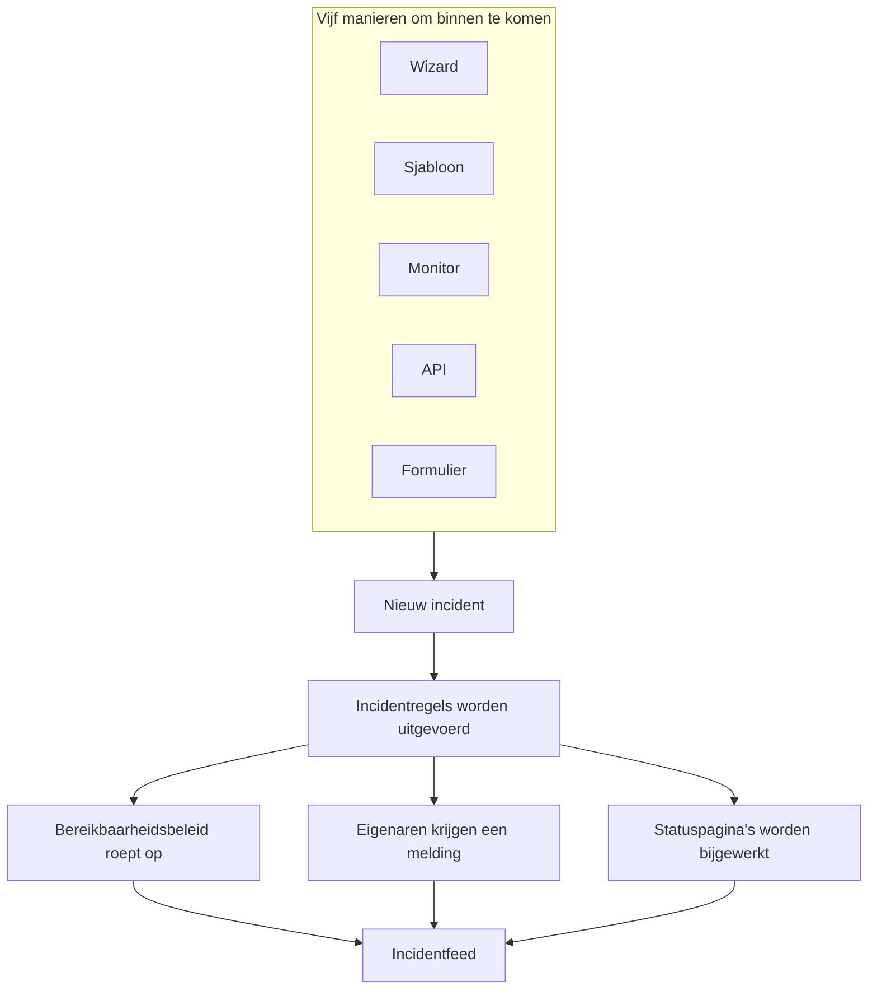
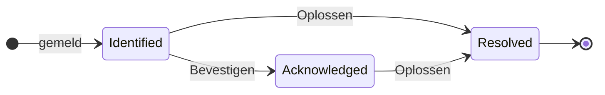

# Incidenten – Overzicht

Een incident is het dossier van waaruit je team werkt als er iets stukgaat: wat er getroffen is, hoe erg het is, hoe ver de respons staat, wie de eigenaar is, en alles wat er onderweg wordt opgeschreven. Eén melden roept de juiste bereikbaarheidsrotatie op, laat de eigenaren het weten en zet — als je dat wilt — de storing op je statuspagina, zodat klanten weten dat je ermee bezig bent.

:::cards
- [Een incident melden](/docs/incidents/declaring-incidents): Met de hand, vanuit een sjabloon, vanuit een monitor, via de API of via een formulier.
- [Incidentstatussen en ernstniveaus](/docs/incidents/states-and-severities): De levenscyclus, en wat bevestigen en oplossen doen.
- [Incidentnotities, eigenaren en feed](/docs/incidents/notes-owners-and-feed): Updates voor klanten en voor je team, en wie ervan hoort.
- [Gekoppelde waarschuwingen](/docs/incidents/linked-alerts): Koppel de waarschuwingen die een storing opleverde aan het incident dat ze verklaart.
- [Incidentinstellingen en automatisering](/docs/incidents/settings): Sjablonen, aangepaste velden, rollen, metingen en regels.
:::

## In één oogopslag

- **Een eigen product** — open **Incidenten** vanuit het menu **Producten** in de bovenbalk; de lijst staat op `/dashboard/{projectId}/incidents`.
- **Drie vooraf aangemaakte statussen** — **Identified**, **Bevestigd** en **Opgelost** worden voor elk nieuw project aangemaakt. Je kunt er zelf statussen bij zetten; de drie vooraf aangemaakte statussen kun je hernoemen en een andere kleur geven, maar nooit verwijderen.
- **Drie vooraf aangemaakte ernstniveaus** — **Critical Incident**, **Major Incident** en **Minor Incident**. Een ernst is een label met een kleur en een volgorde — het heeft geen eigen gedrag.
- **Vijf manieren om binnen te komen** — de wizard **Incident melden**, **Maken op basis van sjabloon**, een criteriaregel van een monitor, `POST /api/incident`, of een [formulier](/docs/forms/index) dat iedereen met de link kan invullen.
- **Genummerd per project** — elk incident krijgt een incidentnummer uit een teller per project, getoond met het voorvoegsel van je project: `INC-42` in een nieuw project, of `#42` zonder voorvoegsel.
- **Twee soorten notities** — privénotities (interne notities) voor je team, openbare notities voor de abonnees van de statuspagina.
- **Waarschuwingen worden aan incidenten gekoppeld** — koppel de waarschuwingen die bij een incident horen, of meld een incident rechtstreeks vanuit waarschuwingen — vanuit een lijst met waarschuwingen of vanuit de pagina van een waarschuwing — en bevestig ze meteen. Zie [Gekoppelde waarschuwingen](/docs/incidents/linked-alerts).
- **De instellingen staan onder Incidenten, niet onder Projectinstellingen** — statussen, ernstniveaus, sjablonen, aangepaste velden en de regelmotoren staan allemaal onder **Incidenten → Instellingen** en **Incidenten → Regels**.

## Hoe het werkt

Je kunt een incident om drie uur 's nachts met de hand melden, of een monitor het laten melden op het moment dat zijn criteria overeenkomen. Hoe dan ook is het incident hetzelfde object, met dezelfde levenscyclus en achteraf hetzelfde papieren spoor.

### 1. Het wordt gemeld

Vijf routes leiden naar hetzelfde object:

- **Met de hand** — klik in de incidentenlijst op **Incident melden**. Dat opent de wizard **Nieuw incident melden**, drie stappen lang: **Incidentdetails**, **Getroffen middelen**, **Bereikbaarheid en rollen**. De eerste stap vraagt om een titel, een ernst en een beschrijving, met wat de meeste incidenten nooit nodig hebben ingeklapt onder **Meer velden**. Alleen de eerste stap vraagt om iets wat je moet beantwoorden: **Volgende** loopt de rest door, en **Incident melden** staat op de samenvatting aan het eind.
  - **Vanuit waarschuwingen** — **Incident melden** op een selectie waarschuwingen, of in de kop van één waarschuwing, opent dezelfde wizard, vooraf ingevuld vanuit de waarschuwingen, koppelt ze aan het nieuwe incident en bevestigt ze, tenzij je het vakje uitvinkt, zodat ze niet verder escaleren — zie [Gekoppelde waarschuwingen](/docs/incidents/linked-alerts).
- **Vanuit een sjabloon** — klik op **Maken op basis van sjabloon** en kies een opgeslagen **Incident Sjabloon**. Sjablonen vullen vooraf de titel, beschrijving, ernst, beginstatus, middelen, het bereikbaarheidsbeleid, de eigenaren en de labels in.
- **Vanuit een monitor** — een criteriaregel van een monitor met de schakelaar "een incident melden" aan maakt het incident automatisch aan op het moment dat de filters overeenkomen. Titels en beschrijvingen ondersteunen daar `{{variable}}`-sjablonen.
- **Via de API** — `POST /api/incident` met een API-sleutel. De server vult `declaredAt`, de aanmaakstatus en het incidentnummer voor je in.
- **Via een formulier** — iemand buiten je team vult een formulier in dat je als link hebt gedeeld, zonder OneUptime-account. Het incident wordt gemeld verborgen voor statuspagina's, vanuit het incidentsjabloon van het formulier als het er een heeft. Zie [Formulieren](/docs/forms/index).

Integraties openen ook incidenten: [Huntress](/docs/integrations/huntress) maakt van elk incidentrapport dat zijn SOC stuurt één incident, dat het bereikbaarheidsbeleid oproept dat je kiest. Zie [Een incident melden](/docs/incidents/declaring-incidents) voor de doorloop veld voor veld.

### 2. De juiste mensen horen het

Bij het aanmaken voert OneUptime de automatisering uit die je hebt ingesteld: privacyregels, eigenaarsregels, labelregels, bereikbaarheidsregels en runbook-regels. Al het bereikbaarheidsbeleid dat aan het incident hangt — met de hand, vanuit een sjabloon, of toegevoegd door een overeenkomende bereikbaarheidsregel — wordt parallel uitgevoerd.

Eigenaren krijgen een melding via de kanalen die ieder van hen heeft aangezet in **Gebruikersinstellingen → Meldingsinstellingen**: e-mail, sms, spraakoproep, push, WhatsApp, Telegram, Slack, Microsoft Teams of webhook. Heeft een incident helemaal geen eigenaren, dan gaat de melding naar de projecteigenaren in plaats van verloren te gaan.

Is het incident zichtbaar op een statuspagina en staan meldingen aan abonnees aan, dan horen de abonnees het ook: de abonnees van elke statuspagina die een van zijn monitoren toont, of alleen die van de pagina's waartoe je het hebt beperkt. Zie [Eén statuspagina per doelgroep](/docs/status-pages/one-status-page-per-audience) om elke doelgroep een eigen statuspagina te geven.

> [!NOTE]
> Meldingen worden door een geplande taak verstuurd die elke minuut draait, dus reken op maximaal ongeveer een minuut vertraging in plaats van een directe verzending.

### 3. Je team werkt eraan

Responders bevestigen het incident, voegen getroffen middelen toe, koppelen de waarschuwingen die erbij horen, voeren runbooks uit, wijzen incidentrollen toe en schrijven op wat ze te weten komen — privénotities voor het team, openbare notities voor klanten, plus de pagina's **Hoofdoorzaak** en **Herstel** zodra het beeld duidelijker wordt. Alles wat ze doen komt in de **Incidentfeed** op de pagina **Overzicht** terecht.

### 4. Het wordt opgelost

Een klik op **Oplossen** zet het incident in de opgeloste status, legt dat vast in de statustijdlijn, stopt de duurklok, geeft de monitoren vrij die het vasthoudt en haalt het incident uit het actieve deel van elke statuspagina waarop het stond. Verder hoeft er niets te veranderen — een statuspagina toont alleen incidenten in een status boven de opgeloste status. Zie [Wat oplossen doet](/docs/incidents/states-and-severities#wat-oplossen-doet).

Daarna kun je een postmortem schrijven en het eventueel op de statuspagina publiceren.

## Kernbegrippen

Een handvol woorden komt op elke andere pagina in deze sectie terug. Zet die eerst op een rij.

| Begrip                 | Wat het betekent                                                                                                                                    |
| ---------------------- | --------------------------------------------------------------------------------------------------------------------------------------------------- |
| **Incident**           | Het dossier zelf — titel, beschrijving, ernst, huidige status, getroffen middelen en alles wat er tijdens de respons op wordt geschreven.            |
| **Incidentstatus**     | Waar het incident in zijn levenscyclus staat. Een rij van het project met een naam, kleur en `order`, plus de vlaggen die er betekenis aan geven.    |
| **Incidenternst**      | Hoe erg het is. Een rij van het project met een naam, kleur en `order`. Puur een indeling — niets in het product behandelt één ernst apart.          |
| **Incidentnummer**     | Een teller per project, getoond als `#42`, of met een voorvoegsel dat je instelt, als `INC-42`.                                                      |
| **Getroffen middelen** | De monitoren, hosts, Kubernetes-clusters, Docker-hosts, services en andere infrastructuur die je aan het incident koppelt.                          |
| **Openbare notitie**   | Een update geschreven voor de lezers en abonnees van de statuspagina. Hij verschijnt op de tijdlijn van de statuspagina.                           |
| **Privénotitie**       | Een interne notitie (het model `IncidentInternalNote`) voor het team dat reageert. Hij komt nooit op een statuspagina terecht.                      |
| **Eigenaar**           | Een gebruiker of team dat verantwoordelijk is voor het incident. Eigenaren krijgen een melding als het wordt aangemaakt, als er notities worden geplaatst en als de status verandert. |
| **Incidentfeed**       | De activiteitentijdlijn waaraan alleen wordt toegevoegd, op het **Overzicht** van het incident, met statuswijzigingen, notities, eigenaarswijzigingen, uitgevoerde regels en meldingen. |
| **Statustijdlijn**     | Het overzicht van in welke status het incident stond, wanneer en hoe lang — met de meldingsstatus voor abonnees bij elke overgang.                   |
| **Gekoppelde waarschuwing** | Een waarschuwing die als onderdeel van de respons aan het incident is gekoppeld. Een waarschuwing kan aan meer dan één incident gekoppeld zijn, en houdt haar eigen status. |

## De drie statussen die OneUptime voor elk project aanmaakt

Bij het aanmaken van een project maakt OneUptime precies drie incidentstatussen aan, in deze volgorde:

| Status           | Volgorde | Kleur              | Wat het betekent                                                          |
| ---------------- | -------- | ------------------ | ------------------------------------------------------------------------- |
| **Identified**   | 1        | Rood (`#fd625e`)   | De status waarin een gloednieuw incident belandt. Dit is de aanmaakstatus. |
| **Bevestigd**    | 2        | Geel (`#ffbf53`)   | Iemand heeft het incident opgepakt en werkt eraan.                        |
| **Opgelost**     | 3        | Groen (`#2ab57d`)  | Het incident is voorbij. Oplossen is wat het van je statuspagina haalt.   |

De namen zijn alleen labels — wat het gedrag echt bepaalt, zijn drie booleans op de statusrij: `isCreatedState`, `isAcknowledgedState` en `isResolvedState`. Per project hoort maar één status elke vlag te dragen.

Dat onderscheid doet er meer toe dan het lijkt:

- `isCreatedState` bepaalt waar een nieuw incident begint. Is er bij het aanmaken geen status expliciet gekozen, dan zoekt OneUptime de aanmaakstatus van het project en gebruikt die.
- `isAcknowledgedState` en `isResolvedState` markeren de bevestigde en de opgeloste status. Waar de status van een incident ten opzichte daarvan staat, stuurt de knoppen **Bevestigen** en **Oplossen** in de kop van het incident, de twee statistiektegels op het **Overzicht** van het incident en de teller **Actieve incidenten** in het zijmenu: een incident in de bevestigde status of een latere status is bevestigd, en een incident in de opgeloste status of een latere status is opgelost.
- **Actieve incidenten** is puur gedefinieerd als "de huidige status staat boven de opgeloste status". Een eigen status die je boven de opgeloste status toevoegt, is dus actief; een status die je erna plaatst, telt als opgelost, net als de opgeloste status zelf.

> [!NOTE]
> De eerste vooraf aangemaakte status heet **Identified**, ook al noemen verschillende beschrijvingen in het product hem nog de aanmaakstatus ("created"). Zoek je "Created" in de statuslijst van je project, dan is dat de rij met de naam **Identified**.

Je kunt eigen statussen toevoegen onder **Incidenten → Instellingen → Status incident**. Een nieuwe status wordt net boven de opgeloste status toegevoegd, en je sleept de rijen om ze anders te ordenen; de kolom **Telt als** laat zien waarvoor een incident in elke status telt — niet bevestigd, bevestigd of opgelost. De drie statussen met een vlag hebben het label **Ingebouwd**: ze houden hun volgorde en kunnen niet worden verwijderd, maar je kunt ze hernoemen, een andere kleur geven en verplaatsen, en daarom leest de interface statusnamen dynamisch.

De volgorde wordt afgedwongen en is niet cosmetisch: een incident kan niet naar een status gaan die eerder in de volgorde staat dan zijn huidige status. Alle details staan in [Incidentstatussen en ernstniveaus](/docs/incidents/states-and-severities).

## De drie ernstniveaus die OneUptime voor elk project aanmaakt

Elk nieuw project krijgt ook drie ernstniveaus:

| Ernst                 | Volgorde | Kleur                    | Wat het betekent                                             |
| --------------------- | -------- | ------------------------ | ------------------------------------------------------------ |
| **Critical Incident** | 1        | Donkerrood (`#b70400`)   | Zeer grote impact op klanten, die een directe respons vraagt. |
| **Major Incident**    | 2        | Rood (`#fd625e`)         | Aanzienlijke impact, die meestal een directe respons vraagt.  |
| **Minor Incident**    | 3        | Geel (`#ffbf53`)         | Kleine impact, meestal binnen werktijd af te handelen.        |

Ernstniveaus hebben `name`, `description`, `color` en `order`, en verder niets. Er zijn geen vlaggen, en geen enkel codepad behandelt "Critical Incident" anders dan een andere rij. Ernst is hoe mensen triëren, en het is beschikbaar als criterium wanneer je bereikbaarheidsregels schrijft — maar een ernst kiezen roept op zichzelf niemand op.

Bewerk of voeg ernstniveaus toe onder **Incidenten → Instellingen → Ernst van incident**. De volledige vooraf ingevulde beschrijvingen staan in [Incidentstatussen en ernstniveaus](/docs/incidents/states-and-severities).

## Waar incidenten in het dashboard staan

Open **Incidenten** vanuit het menu **Producten** in de bovenbalk. Het zijmenu is in secties ingedeeld:

| Sectie         | Wat je daar doet                                                                                                                                                           |
| -------------- | -------------------------------------------------------------------------------------------------------------------------------------------------------------------------- |
| **Overzicht**  | **Alle incidenten** en **Actieve incidenten** — die laatste draagt een rode badge met het aantal incidenten in een status boven de opgeloste status.                         |
| **Episoden**   | Incidentepisodes, een aparte groeperingsfunctie met eigen pagina's.                                                                                                       |
| **AI**         | **Inzichten**, **Logboeken**, **Instellingen**: wat OneUptime AI van je incidenten heeft geleerd en alles wat het ervoor heeft gedaan, en wat het zelf mag doen — met de regels voor welke incidenten het onderzoekt en herstelt. Zie [AI SRE](/docs/ai/ai-sre). |
| **Werkruimte** | De chatwerkruimten die dit project heeft gekoppeld: **Slack**, **Microsoft Teams** of allebei, elk met zijn meldingsregels voor incidenten. Is geen van beide gekoppeld, dan staat hier **Slack of Teams koppelen**, een pagina die beide toont en hoe je ze koppelt. |
| **Integraties** | Tools die zelf incidenten openen: **Huntress**, waarvan de incidentrapporten incidenten worden die de bereikbaarheidsdienst oproepen. Zie [Huntress](/docs/integrations/huntress). |
| **Regels**     | De regelmotoren: **Groeperingsregels**, **Bereikbaarheidsregels**, **Eigenaarsregels**, **Runbook-regels**, **Privacyregels**, **Labelregels**, **SLA-regels**, **Reminder Rules**. |
| **Instellingen** | **Status incident**, **Ernst van incident**, **Incident-sjablonen**, **Notitie-sjablonen**, **Postmortem-sjablonen**, **Aangepaste velden**, **Incidentrollen**, **Metingen**, **Gekoppelde waarschuwingen**, **Nummervoorvoegsel**. |

**Overzicht** en **Episoden** staan open; **AI**, **Werkruimte**, **Integraties**, **Regels**, **Instellingen** en **Ontwikkelaars** zijn standaard ingeklapt, zodat het menu opent op de lijsten die je elke dag gebruikt. Klik op de titel van een sectie om die uit te klappen en de pagina's te vinden waar de rest van deze documentatie naar verwijst; een sectie gaat ook vanzelf open wanneer je op een van haar pagina's bent. De incidentconfiguratie staat niet onder de projectinstellingen; die staat helemaal hier.

De incidentenlijst zelf toont **Incidentnummer**, **Titel**, **Status**, **Ernst**, **Getroffen middelen**, **Verklaard**, **Duur**, **Labels** en **Eigenaren**, met een bulkactie **Status wijzigen** om er meerdere tegelijk af te sluiten.

## Wat elke pagina van een incident toont

Open een incident en zijn eigen zijmenu groepeert de pagina's zo:

| Sectie van het zijmenu | Pagina's                                                                                  |
| ---------------------- | ----------------------------------------------------------------------------------------- |
| **Overzicht**          | **Overzicht**, **Statustijdlijn**, **SLA**                                                |
| **Onderzoek**          | **Beschrijving**, **Hoofdoorzaak**, **Herstel**, **Runbooks**, **Postmortem**, **Gekoppelde waarschuwingen** |
| **Team**               | **Rollen**, **Bereikbaarheidsuitvoeringen**, **Eigenaren**                                |
| **Meldingen**          | **Meldingslogboeken**, **AI-logboeken** — ingeklapt tot je op **Meldingen** klikt         |
| **Notities**           | **Privénotities**, **Openbare notities**                                                  |
| **Ontwikkelaars**      | **Terraform**, **API**, **AI-assistenten** — ingeklapt tot je op **Ontwikkelaars** klikt  |
| **Geavanceerd**        | **Aangepaste velden**, **Instellingen**, **Auditlogboeken**, **Incident verwijderen** — ingeklapt tot je op **Geavanceerd** klikt |

Wat elke pagina bevat:

- **Overzicht** — de respons in één oogopslag. Onder de kop tonen statistiektegels de tijd tot bevestiging, de tijd tot oplossing en de totale **Duur**. De kaart **AI Investigation** opent de pagina — wat OneUptime AI vond, of waarom het niet begon — met de **Incidentfeed** eronder. Ernaast staan de kaart **Video Call**, de kaart **Incidentdetails** (titel, ernst, labels, incidentnummer, gemeld op, gemeld door, bereikbaarheidsbeleid, en de ID van het incident op een kleine regel **ID** onderaan, één klik van je klembord), **Incidentrollen**, een kaart **Getroffen resources** en de aangepaste velden van het incident. Heeft je project [metingen](/docs/incidents/settings#metingen), dan zegt een kaart **Metingen** onder **Incidentdetails** wat elke meting voor dit incident aangeeft: **12 minuten**, **Loopt al 5 minuten**, **Niet bereikt**.
- **Statustijdlijn** — elke status waarin het incident heeft gestaan, met **Begint op**, **Eindigt op**, **Duur** en de meldingsstatus voor abonnees bij elke overgang. **Oorzaak bekijken** en **Logboeken bekijken** leggen uit waarom elke wijziging gebeurde.
- **SLA** — het bijhouden van de SLA voor dit incident.
- **Beschrijving**, **Hoofdoorzaak**, **Herstel** — drie Markdown-pagina's. De beschrijving is degene die op je statuspagina verschijnt.
- **Runbooks** — de runbook-uitvoeringen die aan dit incident hangen.
- **Postmortem** — het verslag en de bijlagen, die je eventueel op de statuspagina kunt publiceren. **Postmortem-notitie bewerken** vraagt om de notitie en de bijlagen, en daarna om **Publiceren op statuspagina**; alleen zolang dat aanstaat, vraagt het om **Abonnees op de hoogte stellen** en **Postmortem gepubliceerd op**, dat op nu wordt gezet als je publiceren aanzet. **Generate with AI** schrijft een concept van de notitie voor je, en **Sjabloon toepassen** — getoond zodra het project een postmortem-sjabloon heeft — laat haar met een sjabloon beginnen. Abonnees horen het één keer, wanneer het postmortem wordt gepubliceerd: de eerste keer dat de statuspagina het toont, waarvoor **Publiceren op statuspagina** aan moet staan en er een notitie geschreven moet zijn. Het opnieuw opslaan, of het bewerken terwijl het gepubliceerd is, werkt de statuspagina bij en laat niemand iets weten; het opnieuw publiceren nadat je het van de statuspagina hebt gehaald, laat het hun opnieuw weten. Een postmortem dat wordt gepubliceerd terwijl het incident verborgen is, wordt verstuurd zodra het incident zichtbaar wordt. Zie [Het postmortem](/docs/status-pages/subscribers#incidenten).
- **Gekoppelde waarschuwingen** — de waarschuwingen die aan dit incident gekoppeld zijn, met de huidige status van elke waarschuwing, en wie haar koppelde en wanneer. Waarschuwingen hebben een bijpassende pagina **Gekoppelde incidenten**. Zie [Gekoppelde waarschuwingen](/docs/incidents/linked-alerts).
- **Rollen**, **Bereikbaarheidsuitvoeringen**, **Eigenaren** — wie eraan werkt, welk beleid is uitgevoerd en wie meldingen krijgt.
- **Meldingslogboeken**, **AI-logboeken**, **Auditlogboeken** — wat er is verstuurd en wat er is veranderd.
- **Privénotities** en **Openbare notities** — wat je team en je klanten is verteld. Zie [Incidentnotities, eigenaren en feed](/docs/incidents/notes-owners-and-feed).
- **Aangepaste velden**, **Instellingen**, **Incident verwijderen** — de pagina **Instellingen** bevat **Zichtbaar op statuspagina** en **Privé-incident**, de kaart **Bereik van statuspagina's** die het incident tot enkele statuspagina's beperkt, en de kaart **Reminders**, waarvan de schakelaar **Herinneringen sturen** wordt opgeslagen zodra je hem omzet en laat zien wanneer de volgende herinnering uitgaat.

## Hoe incidenten in de rest van OneUptime passen

- **Monitoren zien het probleem; incidenten leggen het vast.** Een criteriaregel van een monitor kan automatisch een incident melden en daarbij de titel, ernst, het bereikbaarheidsbeleid, de eigenaren, labels en herstelnotities vooraf invullen. Zie [Incident- en waarschuwingstemplates](/docs/monitor/incident-alert-templating) voor de variabelen die daar beschikbaar zijn.
- **Waarschuwingen zijn de signalen; incidenten zijn de respons.** Koppel de waarschuwingen die een incident verklaart eraan, vanaf beide kanten, en twee projectschakelaars, die in nieuwe projecten aanstaan, bevestigen en lossen die waarschuwingen samen met het incident op. Zie [Gekoppelde waarschuwingen](/docs/incidents/linked-alerts).
- **Bereikbaarheidsbeleid doet het oproepen.** Hang beleid aan in de stap **Bereikbaarheid en rollen** van de meldwizard, aan een sjabloon, of via **Incidenten → Regels → Bereikbaarheidsregels**. Elke overeenkomende regel gaat af — wat wordt uitgevoerd, is de vereniging van alle overeenkomsten plus alles wat er rechtstreeks aan hangt, zonder dubbelingen.
- **Runbooks vertellen mensen wat ze moeten doen.** Runbook-regels hangen automatisch een procedure aan wanneer een overeenkomend incident wordt aangemaakt, en responders kunnen er met de hand een starten vanuit het incident. Zie [Runbooks – Overzicht](/docs/runbooks/index).
- **Statuspagina's informeren klanten.** Een incident verschijnt in de actieve lijst van een statuspagina wanneer de pagina een van zijn monitoren toont, de pagina incidenten heeft ingeschakeld, het incident als zichtbaar op de statuspagina is gemarkeerd en de huidige status boven de opgeloste status staat. Een incident dat tot enkele statuspagina's is beperkt, verschijnt alleen daar. Privé-incidenten zijn altijd verborgen voor elke statuspagina. Zie [Statuspagina's – Overzicht](/docs/status-pages/index) en [Eén statuspagina per doelgroep](/docs/status-pages/one-status-page-per-audience).
- **Workflows automatiseren eromheen.** Met de triggers **On Create Incident**, **On Update Incident** en **On Delete Incident** bouw je automatisering zonder code bovenop de levenscyclus van het incident. Zie [Workflows – Overzicht](/docs/workflows/index).

## Volgende stappen

:::cards
- [Een incident melden](/docs/incidents/declaring-incidents): Loop de wizard veld voor veld door, of meld vanuit een sjabloon, een monitor of de API.
- [Incidentstatussen en ernstniveaus](/docs/incidents/states-and-severities): Voeg eigen statussen toe en zie precies wat elke status doet.
- [Statuspagina's – Overzicht](/docs/status-pages/index): Hoe incidenten je klanten bereiken.
- [Abonnees en aankondigingen](/docs/status-pages/subscribers): Wie een melding krijgt als een incident verandert.
:::
