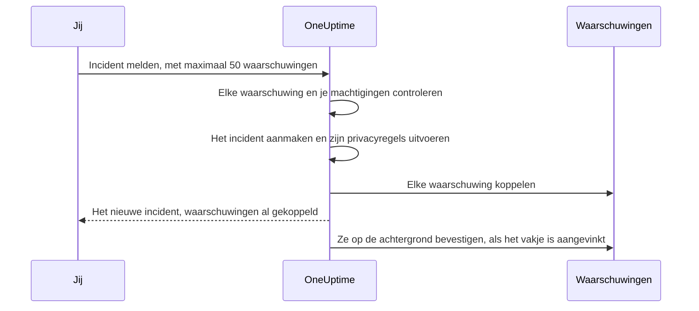

# Gekoppelde waarschuwingen

Een storing levert zelden één waarschuwing op. Als de primaire database omvalt, gaat de monitor voor replicatievertraging af, gaat de monitor voor het foutpercentage van de API af, en begint de SLO voor de latentie van de checkout te branden — drie waarschuwingen, één probleem. Die waarschuwingen aan het incident koppelen zegt precies dat: het incident is waar de respons plaatsvindt, en elke waarschuwing laat zien welk incident haar verklaart.

Een koppeling is alleen een koppeling. De waarschuwing houdt haar eigen status, eigenaren, bereikbaarheidsbeleid, notities en feed; het incident houdt de zijne. Koppelen voegt niets samen en kopieert niets, en bevestigt, lost op of dempt op zichzelf nooit een waarschuwing. (Een nieuw incident melden vanuit waarschuwingen is anders: het nieuwe incident wordt ermee vooraf ingevuld, zoals [hieronder beschreven](#een-incident-melden-vanuit-waarschuwingen), en tenzij je het vakje op het formulier uitvinkt, worden de waarschuwingen bevestigd terwijl je meldt, wat hun escalatie stopt — zie [De waarschuwingen bevestigen terwijl je meldt](#de-waarschuwingen-bevestigen-terwijl-je-meldt).) Twee projectschakelaars, die in nieuwe projecten aanstaan, nemen de gekoppelde waarschuwingen mee terwijl het incident wordt bevestigd en opgelost — zie [verderop](#waarschuwingsstatussen-gelijk-houden-met-het-incident).

:::cards
- [Waarschuwingen aan een incident koppelen](#waarschuwingen-koppelen-vanuit-een-incident): Vanuit het incident, vanuit een waarschuwing, of veel tegelijk.
- [Een incident melden vanuit waarschuwingen](#een-incident-melden-vanuit-waarschuwingen): Een nieuw incident, in één keer vooraf ingevuld en gekoppeld.
- [Waarschuwingsstatussen gelijk houden](#waarschuwingsstatussen-gelijk-houden-met-het-incident): Bevestig en los de waarschuwingen samen met het incident op.
- [Machtigingen](#machtigingen): Wie kan koppelen, en wat koppelen hen laat doen.
:::

> [!TIP]
> Kom je van Opsgenie, dan is dit de OneUptime-versie van waarschuwingen aan een incident koppelen.

## In één oogopslag

- **Veel-op-veel** — een incident kan een willekeurig aantal gekoppelde waarschuwingen hebben, en één waarschuwing kan aan meerdere incidenten gekoppeld zijn.
- **Drie plekken om te koppelen** — de pagina **Gekoppelde waarschuwingen** van het incident, de pagina **Gekoppelde incidenten** van de waarschuwing, en de bulkactie **Koppelen aan incident** in de hoofdlijsten met waarschuwingen, voor maximaal **50** waarschuwingen tegelijk.
- **Een incident melden vanuit waarschuwingen** — **Incident melden** in een lijst met waarschuwingen, in de kop van een waarschuwing of op haar pagina **Gekoppelde incidenten** vult vooraf een nieuw incident in vanuit de waarschuwingen en koppelt ze terwijl het wordt aangemaakt. Een vakje op het formulier, standaard aangevinkt, bevestigt ze ook, wat hun eigen escalatie door de bereikbaarheidsdienst stopt.
- **Aan beide kanten vastgelegd** — elke koppeling en ontkoppeling schrijft een feeditem op het incident en op de waarschuwing, behalve dat een incident dat vanuit waarschuwingen wordt gemeld, één item krijgt dat ze allemaal noemt. Alleen de items van het incident worden in Slack en Microsoft Teams geplaatst, en de titel van een privéwaarschuwing of privé-incident wordt nooit aan de andere kant geschreven.
- **Waarschuwingsstatussen volgen het incident** — twee projectschakelaars, allebei aan in nieuwe projecten, bevestigen en lossen gekoppelde waarschuwingen op wanneer het incident wordt bevestigd en opgelost. Zet een van beide uit onder **Incidenten → Instellingen → Gekoppelde waarschuwingen**.
- **Te automatiseren** — koppelingen zijn een gewone API-resource, `/api/incident-alert`.

## Hoe het werkt

Waarschuwingen zijn signalen: de criteria van een monitor kwamen overeen, een SLO begon zijn budget te verbranden, een beveiligingsregel ging af. Een incident is de gecoördineerde respons op een probleem (zie [Incidenten – Overzicht](/docs/incidents/index)). De meeste problemen leveren meerdere signalen op, en zonder koppelingen is het geheugen van iemand het enige wat ze aan de respons verbindt.

```mermaid title="Drie waarschuwingen, één incident, en de schakelaars die ze verplaatsen"
flowchart TB
    subgraph signals["Waarschuwingen"]
        direction LR
        lag["Replicatievertraging"]
        errors["Foutpercentage van de API"]
        latency["Latentie van de checkout"]
    end
    signals -->|"gekoppeld aan"| incident["Incident"]
    incident -->|"bevestigd"| ack["Gekoppelde waarschuwingen bevestigd"]
    incident -->|"opgelost"| res["Gekoppelde waarschuwingen opgelost"]
```

Met de waarschuwingen gekoppeld:

- Zien responders op het incident in één lijst welke waarschuwingen erbij horen en in welke status elke waarschuwing staat.
- Ziet iemand die een van die waarschuwingen opent, dat ze al wordt afgehandeld, onder welk incident, in plaats van een tweede incident voor dezelfde storing te melden.
- Legt de feed van het incident vast wanneer elke waarschuwing werd gekoppeld en door wie, zodat de tijdlijn laat zien hoe het beeld tot stand kwam.
- Stopt het bevestigen van het incident, met de schakelaars aan, de escalaties van de bereikbaarheidsdienst voor de waarschuwingen, zodat de mensen die aan het incident werken niet opnieuw worden opgeroepen door de symptomen ervan.

## Hoe koppelingen werken

Een koppeling verbindt één waarschuwing met één incident. Koppelingen werken in beide richtingen — dezelfde koppeling verschijnt op de pagina **Gekoppelde waarschuwingen** van het incident en op de pagina **Gekoppelde incidenten** van de waarschuwing.

- **Een waarschuwing kan aan meerdere incidenten gekoppeld zijn.** Een gedeelde afhankelijkheid die faalt, kan een symptoom zijn van twee afzonderlijke incidenten. Elk incident noemt de waarschuwing, en de waarschuwing noemt beide incidenten.
- **Elk paar wordt één keer gekoppeld.** Een waarschuwing koppelen aan een incident waaraan ze al gekoppeld is, wordt geweigerd met "This alert is already linked to this incident." — ook als twee mensen hetzelfde paar op hetzelfde moment koppelen.
- **Koppelingen worden aangemaakt of verwijderd, nooit bewerkt.** Een koppeling heeft geen eigen velden behalve haar incident, haar waarschuwing, wanneer ze werd gemaakt en door wie. Om een waarschuwing naar een ander incident te verplaatsen, koppel je haar aan het nieuwe en ontkoppel je haar van het oude.
- **Koppelingen blijven binnen een project.** De waarschuwing en het incident moeten bij hetzelfde project horen.

## Waarschuwingen koppelen vanuit een incident

:::steps
### Open de pagina Gekoppelde waarschuwingen van het incident

Open het incident en kies **Gekoppelde waarschuwingen** in de sectie **Onderzoek** van het zijmenu. De tabel toont elke waarschuwing die er al aan gekoppeld is.

### Kies de waarschuwing

Klik op **Waarschuwing koppelen** en kies haar in de vervolgkeuzelijst **Waarschuwing**. De lijst toont de recentste waarschuwingen eerst, elk met haar nummer — zoals `ALT-63: Checkout API is offline` — zodat waarschuwingen met dezelfde titel, zoals de herhaalde waarschuwingen van een monitor, uit elkaar te houden zijn. Om een oudere waarschuwing te vinden, typ je: de lijst doorzoekt elke waarschuwing op titel.

### Sla de koppeling op

Klik in het dialoogvenster op **Waarschuwing koppelen**. De waarschuwing verschijnt in de tabel, en beide feeds leggen de koppeling vast. Wordt de koppeling geweigerd, bijvoorbeeld omdat de waarschuwing al gekoppeld is, dan blijft het dialoogvenster open en zegt het waarom.
:::

| Kolom             | Wat hij toont                                    |
| ----------------- | ------------------------------------------------ |
| **Waarschuwing #** | Het waarschuwingsnummer, zoals `#17` of `ALT-17`. |
| **Titel**         | De titel van de waarschuwing, met een link naar de waarschuwing. |
| **Huidige staat** | De eigen status van de waarschuwing, zoals **Bevestigd**. |
| **Gekoppeld op**  | Wanneer de waarschuwing werd gekoppeld.          |
| **Gekoppeld door** | Wie haar koppelde.                              |

Elke rij heeft **Waarschuwing bekijken** om de waarschuwing te openen en **Ontkoppelen** om de koppeling te verwijderen.

## Incidenten koppelen vanuit een waarschuwing

De kant van de waarschuwing spiegelt die van het incident. Open een waarschuwing en kies **Gekoppelde incidenten** in de sectie **Basis** van het zijmenu. De tabel toont elk incident waaraan de waarschuwing gekoppeld is, met het incidentnummer, de titel en de huidige status, en wanneer en door wie het werd gekoppeld.

- **Incident koppelen** koppelt deze waarschuwing aan een bestaand incident. De vervolgkeuzelijst werkt als die aan de kant van het incident: de recentste incidenten eerst, elk met zijn nummer — zoals `INC-42: Checkout is down` — en typen doorzoekt elk incident op titel.
- **Incident bekijken** opent een gekoppeld incident.
- **Ontkoppelen** verwijdert een koppeling.
- **Incident melden** start een nieuw incident vanuit deze waarschuwing. Dezelfde knop staat in de kop van de waarschuwing, naast **Bevestigen** en **Oplossen**. Zie [Een incident melden vanuit waarschuwingen](#een-incident-melden-vanuit-waarschuwingen).

## Veel waarschuwingen tegelijk koppelen

De hoofdlijsten met waarschuwingen hebben hier twee bulkacties voor: **Alle waarschuwingen** en **Actieve waarschuwingen**, de actieve waarschuwingen op de startpagina, en de pagina **Waarschuwingen** van een monitor, service, host, Kubernetes-cluster, SLO of elk ander middel dat er een heeft. De lijst **Lidwaarschuwingen** van een waarschuwingsepisode heeft ze niet — selecteer de waarschuwingen in plaats daarvan in een van de hoofdlijsten. Selecteer de waarschuwingen en kies dan:

- **Koppelen aan incident** — kies het incident in de vervolgkeuzelijst **Incident** en klik op **Waarschuwingen koppelen**. De recentste incidenten staan bovenaan, met hun nummers, en typen doorzoekt elk incident op titel. OneUptime koppelt elke geselecteerde waarschuwing en toont daarbij de voortgang. Een waarschuwing die al aan dat incident gekoppeld is, telt als gedaan in plaats van mislukt, dus de actie twee keer uitvoeren kan geen kwaad.
- **Incident melden** — opent het meldformulier voor een nieuw incident, vooraf ingevuld vanuit de geselecteerde waarschuwingen. Zie de volgende sectie.

Beide acties nemen maximaal **50** waarschuwingen tegelijk. Selecteer je er meer, dan zijn ze uitgeschakeld, met een tooltip die zegt waarom. De grens bestaat omdat elke koppeling naar beide feeds schrijft, en elke koppeling die met **Koppelen aan incident** wordt gemaakt ook in de Slack- en Microsoft Teams-kanalen van het incident wordt geplaatst — een selectie van duizend waarschuwingen zou die overspoelen.

## Een incident melden vanuit waarschuwingen

Blijkt een reeks waarschuwingen een incident te zijn dat nog niemand heeft gemeld, meld het dan vanuit de waarschuwingen. Er zijn drie manieren:

- Selecteer de waarschuwingen in een van de hoofdlijsten met waarschuwingen en kies **Incident melden**.
- Open een waarschuwing en klik in haar kop op **Incident melden**, naast **Bevestigen** en **Oplossen**. De knop blijft daar staan zodra de waarschuwing is bevestigd of opgelost, zodat je achteraf nog een incident voor een waarschuwing kunt melden — om er een postmortem op te doen bijvoorbeeld.
- Open de pagina **Gekoppelde incidenten** van één waarschuwing en klik op **Incident melden**.

Alle drie vragen de machtiging om incidenten aan te maken en er waarschuwingen aan te koppelen. Zonder die machtiging is de knop vergrendeld, en noemt de tooltip de ontbrekende machtiging.

Welke je ook gebruikt, je komt op het gebruikelijke formulier **Nieuw incident melden** terecht, met de waarschuwingen vermeld als de waarschuwingen die worden gekoppeld en deze velden vooraf ingevuld:

| Veld                   | Vooraf ingevuld met                                                                                                                                                                                                                                                                    |
| ---------------------- | -------------------------------------------------------------------------------------------------------------------------------------------------------------------------------------------------------------------------------------------------------------------------------------- |
| **Titel**              | Eén waarschuwing: haar titel. Meerdere: de titel van de ernstigste waarschuwing.                                                                                                                                                                                                       |
| **Beschrijving**       | Eén waarschuwing: haar beschrijving. Meerdere: een lijst met één regel per waarschuwing, met haar nummer en titel.                                                                                                                                                                      |
| **Ernst van incident** | De ernst van de ernstigste waarschuwing, vertaald naar een incidenternst. Een incidenternst met dezelfde naam, ongeacht hoofdletters, wint. Anders neemt OneUptime de incidenternst op dezelfde positie in de volgorde van ernstniveaus, of de laatste als je minder incidenternstniveaus hebt. |
| **Getroffen middelen** | Elke monitor, host, Kubernetes-cluster, Docker-host, Podman-host en service van de geselecteerde waarschuwingen, samengevoegd. De monitoren komen onder **Monitoren**, de rest onder **Andere getroffen resources**. Andere middelen, zoals SLO's of VMware-, Proxmox- en Ceph-clusters, worden niet gekopieerd — voeg ze zelf toe als het incident ze treft. |
| **Labels**             | Elk label van elke geselecteerde waarschuwing.                                                                                                                                                                                                                                         |
| **Privé-incident**     | Aan als een van de waarschuwingen privé is. Het formulier zegt dat, en de eigenaren van de waarschuwingen worden eigenaar van het incident — zie hieronder.                                                                                                                             |

"Ernstigste" volgt de volgorde van je waarschuwingsernstniveaus: het eerste ernstniveau voor waarschuwingen in de lijst is het ernstigste. Met de ernstniveaus waarmee elk project begint, wordt een waarschuwing **High** een **Critical Incident** en een waarschuwing **Low** een **Major Incident**.

Alles is bewerkbaar voordat je verstuurt. **Labels** en **Privé-incident** staan onder **Meer velden** op de eerste stap van het formulier, waarvan de ingeklapte kop elk van beide toont zolang het is ingesteld.

**Een waarschuwing die al een incident heeft, wordt gemarkeerd.** Met **Incident melden** op de pagina van elke waarschuwing kunnen twee responders die door dezelfde storing worden opgeroepen, haar elk melden. Daarom markeert de banner die de waarschuwingen noemt elke waarschuwing die al aan een incident gekoppeld is — "(already linked to Incident INC-42)", met een link naar dat incident — en voegt hij een opmerking toe, geformuleerd naar hoeveel van de waarschuwingen gekoppeld zijn:

- Alle waarschuwingen, en het is er één: "This alert is already linked to an incident. If it is the same problem, update that incident instead of declaring another one."
- Alle waarschuwingen, en het zijn er meerdere: "These alerts are already linked to incidents. If it is the same problem, update that incident instead of declaring another one."
- Slechts een deel ervan: "Some of these alerts are already linked to an incident. If it is the same problem, link the other alerts to that incident from the alerts list instead of declaring another one."

De links naar incidenten openen in een nieuw tabblad, zodat je het bestaande incident kunt bekijken zonder kwijt te raken wat je op het formulier hebt ingevuld. De opmerking is een herinnering, geen blokkade, en alleen incidenten die je mag zien, worden genoemd.

**Bereikbaarheidsbeleid wordt niet gekopieerd.** De waarschuwingen voerden hun eigen bereikbaarheidsbeleid uit toen ze werden aangemaakt, dus het naar het incident kopiëren zou dezelfde mensen een tweede keer oproepen. Het bereikbaarheidsbeleid van het incident is wat je kiest in de stap **Bereikbaarheid en rollen** plus wat je bereikbaarheidsregels voor incidenten toevoegen — precies zoals bij elk ander incident.

**De monitoren van de waarschuwingen worden vooraf ingevuld als getroffen monitoren.** Zoals bij elk incident dat met de hand wordt gemeld, pauzeert de actieve bewaking van de monitoren van het incident tot het incident is opgelost. Haal een monitor weg uit **Monitoren** in de stap **Getroffen middelen** voordat je verstuurt, als hij moet blijven worden gecontroleerd.

**Een privéwaarschuwing maakt een privé-incident.** Is een van de waarschuwingen privé, dan begint **Privé-incident** aangezet, en de banner die de waarschuwingen noemt, zegt dat. Een privé-incident is alleen zichtbaar voor zijn eigenaren, Project Owners en Project Admins, dus OneUptime zorgt ervoor dat de mensen die de waarschuwingen konden zien, het incident kunnen zien: zodra het is gemeld, worden de eigenaren van elke waarschuwing waarvandaan werd gemeld — gebruikers en teams — als eigenaar van het incident toegevoegd, zonder melding. Ze worden toegevoegd net nadat de Slack- en Microsoft Teams-kanalen van het incident zijn aangemaakt, zodat ze voor die kanalen worden uitgenodigd zoals elke andere eigenaar. Jij bent ook eigenaar, zoals bij elk incident dat je meldt. Hetzelfde gebeurt als een privacyregel voor incidenten het nieuwe incident privé maakt. Zet je **Privé-incident** uit voordat je verstuurt en geldt er geen privacyregel, dan is het incident niet privé en worden er geen eigenaren gekopieerd.



Als je verstuurt, controleert de server de waarschuwingen voordat hij iets aanmaakt: maximaal 50, elk een waarschuwing in dit project die je mag zien, en je moet waarschuwingen aan incidenten mogen koppelen. Mislukt een controle, dan wordt het verzoek geweigerd en wordt er geen incident aangemaakt — een verkeerde waarschuwings-id verbruikt dus nooit een incidentnummer. Zodra het incident bestaat — en zodra zijn privacyregels zijn uitgevoerd, zodat de koppelingen weten of het privé is — wordt elke waarschuwing gekoppeld voordat het verzoek terugkeert, zodat de pagina **Gekoppelde waarschuwingen** van het incident ze al toont. Mislukt één koppeling — omdat de waarschuwing een moment eerder werd verwijderd bijvoorbeeld — dan wordt het incident toch gemeld en worden de andere waarschuwingen toch gekoppeld.

De feed van het incident krijgt één item **Waarschuwing gekoppeld** dat de waarschuwingen noemt, geschreven na **Incident aangemaakt**, in plaats van één per waarschuwing — zie [De feed, Slack en Microsoft Teams](#de-feed-slack-en-microsoft-teams).

### De waarschuwingen bevestigen terwijl je meldt

Een incident melden stopt op zichzelf niet dat zijn waarschuwingen oproepen: de escalatie van een waarschuwing door de bereikbaarheidsdienst stopt pas zodra de waarschuwing zelf is bevestigd. Is een van de waarschuwingen nog niet bevestigd, dan heeft de banner op het formulier daarom een selectievakje, standaard aangevinkt — **Acknowledge this alert to stop its escalation** voor één waarschuwing, **Acknowledge these 3 alerts to stop their escalation** voor meerdere. Zijn sommige al bevestigd, dan noemt het alleen de andere en zegt het dat de rest blijft zoals hij is.

Laat het aangevinkt en, zodra het incident is gemeld en de waarschuwingen zijn gekoppeld:

- **Worden de waarschuwingen namens jou bevestigd.** Elke waarschuwing gaat naar je waarschuwingsstatus **Bevestigd** alsof je er zelf op **Bevestigen** had geklikt: de **Statustijdlijn** en de feed van de waarschuwing noemen jou, de eigenaren van de waarschuwing krijgen een melding, en de wijziging wordt in de Slack- en Microsoft Teams-kanalen van de waarschuwing geplaatst zoals elke andere statuswijziging van een waarschuwing. De oorzaak luidt "Acknowledged because Incident INC-42 was declared from this alert." — of, bij een privé-incident, "Acknowledged because a private incident was declared from this alert.", zodat een privé-incident nooit wordt genoemd waar het publiek van de waarschuwing het kan lezen.
- **Stopt hun eigen escalatie door de bereikbaarheidsdienst binnen ongeveer een minuut.** De volgende escalatiestap ziet een bevestigde waarschuwing en stopt. Oproepen die al zijn uitgegaan, worden niet teruggeroepen.
- **Stoppen herinneringen alleen als de herinneringsregel dat zegt.** De herinneringen van een waarschuwing stoppen bij bevestiging alleen als haar herinneringsregel **Stop Reminders When** op **Bevestigd** heeft staan; anders gaan ze door tot de waarschuwing is opgelost.
- **Blijft een waarschuwingsepisode escaleren.** Hoort een waarschuwing bij een episode die via een eigen bereikbaarheidsbeleid oproept, dan blijft de episode escaleren tot de episode zelf is bevestigd.
- **Blijven waarschuwingen die al bevestigd of opgelost zijn, ongemoeid.** Zoals overal worden statussen vergeleken op hun volgorde, dus een waarschuwing in een eigen status na **Bevestigd** telt als bevestigd, en er wordt nooit iets teruggezet.

Vink het vakje uit om te melden zonder te bevestigen. Telkens als waarschuwingen onbevestigd blijven — het vakje is uitgevinkt of vergrendeld — zegt het formulier dat: "Declaring the incident does not acknowledge the alert: it keeps escalating until it is acknowledged." En als je de waarschuwingen bevestigt zonder een bereikbaarheidsbeleid voor het incident te kiezen, wijst de samenvatting van de stap **Bereikbaarheid en rollen** erop: "The alerts it is declared from are acknowledged too, so their own escalation stops. An alert episode they belong to keeps escalating until the episode is acknowledged, and an incident on-call rule, if any, may still page."

**Je hebt een machtiging nodig om de waarschuwingen te bevestigen.** Ze bevestigen terwijl je meldt vraagt **Create Alert State Timeline** en **Edit Alert** (een waarschuwing op haar eigen pagina bevestigen vraagt alleen de eerste: zie [Een status wijzigen](/docs/permissions/index#een-status-wijzigen)): Project Owner, Project Admin, Project Member, Alert Admin en Alert Member hebben ze allebei, terwijl Incident Admin en Incident Member, die incidenten vanuit waarschuwingen kunnen melden, geen van beide hebben. Je label- en eigenaarsbereik op waarschuwingen moet ook elke waarschuwing omvatten die wordt bevestigd — alleen de waarschuwingen die nog niet bevestigd zijn, worden gecontroleerd. Waarschuwingen die al bevestigd of opgelost zijn, vragen geen machtiging en blokkeren het melden nooit. Zonder de machtigingen is het vakje vergrendeld, met een tooltip die de ontbrekende noemt, en kun je het incident nog steeds melden. De server controleert opnieuw voordat hij iets aanmaakt, voor elke waarschuwing die hij gaat bevestigen: mag je een ervan niet bevestigen, dan wordt er geen incident aangemaakt en zegt het formulier waarom — vink het vakje uit en verstuur opnieuw.

**Het project heeft een waarschuwingsstatus Bevestigd nodig.** Elk project begint met een. Heeft het jouwe er geen, dan wordt het vakje niet aangeboden.

De waarschuwingen worden op de achtergrond bevestigd, net nadat ze zijn gekoppeld, een paar tegelijk — maximaal 5 tegelijk — zodat de pagina van het incident een moment eerder kan openen dan zij zijn bevestigd, en melden vanuit veel waarschuwingen de laatste niet achter alle andere laat wachten. Een waarschuwing die niet kan worden bevestigd — omdat ze in de tussentijd werd verwijderd bijvoorbeeld — wordt gelogd en houdt de andere of het incident nooit tegen, en een waarschuwing die iemand anders in de tussentijd bevestigt of oplost, blijft zoals die persoon haar achterliet.

**Met de schakelaars voor gekoppelde waarschuwingen van het project aan, kunnen de schakelaars de waarschuwingen in plaats daarvan verplaatsen.** Wordt het incident rechtstreeks in een bevestigde of opgeloste status gemeld en werkt een van de [schakelaars voor gekoppelde waarschuwingen](#waarschuwingsstatussen-gelijk-houden-met-het-incident) op die status, dan verplaatst de schakelaar de gekoppelde waarschuwingen terwijl ze worden gekoppeld, en laat het vakje die waarschuwingen aan de schakelaar over, zodat elke waarschuwing één schrijver heeft. Ze worden bevestigd of opgelost zoals de schakelaar dat doet — met de oorzaak van de schakelaar, zoals "Acknowledged because linked Incident INC-42 was acknowledged.", die het incident bij zijn nummer noemt, ook als het privé is — ze worden niet aan jou toegeschreven, en hun eigenaren krijgen geen melding. Melden in je eerste incidentstatus, zoals gebruikelijk, of met de schakelaars uit, laat elke waarschuwing aan het vakje over.

### Melden via de API

`POST /api/incident` accepteert de id's van de waarschuwingen die moeten worden gekoppeld in `miscDataProps`, onder `alertIdsToLink`, en of die waarschuwingen moeten worden bevestigd onder `acknowledgeAlertsToLink`:

```bash
curl -X POST https://oneuptime.com/api/incident \
  -H "apikey: $ONEUPTIME_API_KEY" \
  -H "Content-Type: application/json" \
  -d '{
    "data": {
      "title": "Primary database unavailable",
      "incidentSeverityId": "<incident-severity-id>"
    },
    "miscDataProps": {
      "alertIdsToLink": ["<alert-id>", "<another-alert-id>"],
      "acknowledgeAlertsToLink": true
    }
  }'
```

`alertIdsToLink` is een array van 1 tot 50 waarschuwings-id's. Dubbelingen worden genegeerd, en dezelfde controles gelden als in het dashboard, voordat het incident wordt aangemaakt. Via de API wordt niets vooraf ingevuld — stuur de titel, de ernst en de middelen mee die je wilt. De API-sleutel heeft de machtiging nodig om incidenten aan te maken en er waarschuwingen aan te koppelen, en moet de waarschuwingen kunnen lezen. Een API-sleutel is geen gebruiker, dus koppelingen die ermee worden gemaakt, hebben geen **Gekoppeld door**. Voor de rest van de body van het verzoek, zie [Een incident melden](/docs/incidents/declaring-incidents).

`acknowledgeAlertsToLink` is optioneel, en uit tenzij je het meestuurt. Zet het op `true` om de waarschuwingen te bevestigen zodra ze zijn gekoppeld, zoals het vakje op het formulier doet — waarschuwingen die al bevestigd of opgelost zijn, blijven ongemoeid en vragen geen machtiging. Laat het weg, of stuur `false`, om te melden zonder ze te bevestigen. Het wordt samen met de waarschuwings-id's gecontroleerd, voordat het incident wordt aangemaakt, en het verzoek wordt met een 400 geweigerd als:

- het iets anders is dan `true` of `false`;
- het wordt meegestuurd zonder `alertIdsToLink`;
- het project geen waarschuwingsstatus Bevestigd heeft;
- de API-sleutel niet elke waarschuwing mag bevestigen die nog niet bevestigd is — daarvoor zijn **Create Alert State Timeline** en **Edit Alert** nodig, met een labelbereik dat elk van die waarschuwingen omvat.

Een API-sleutel is geen gebruiker, dus waarschuwingen die ermee worden bevestigd, worden aan niemand toegeschreven, net zoals de koppelingen ervan geen **Gekoppeld door** hebben.

## Koppelen en ontkoppelen via de API

Koppelingen zijn een standaard CRUD-resource op `/api/incident-alert`. Om een waarschuwing aan een incident te koppelen, maak je er een aan:

```bash
curl -X POST https://oneuptime.com/api/incident-alert \
  -H "apikey: $ONEUPTIME_API_KEY" \
  -H "Content-Type: application/json" \
  -d '{
    "data": {
      "incidentId": "<incident-id>",
      "alertId": "<alert-id>"
    }
  }'
```

Om de gekoppelde waarschuwingen van een incident op te vragen, zoek je op `incidentId`. Zoek in plaats daarvan op `alertId` om de incidenten te vinden waaraan een waarschuwing gekoppeld is:

```bash
curl -X POST https://oneuptime.com/api/incident-alert/get-list \
  -H "apikey: $ONEUPTIME_API_KEY" \
  -H "Content-Type: application/json" \
  -d '{
    "query": { "incidentId": "<incident-id>" },
    "select": { "_id": true, "alertId": true, "createdAt": true },
    "limit": 50,
    "skip": 0
  }'
```

Om te ontkoppelen, verwijder je de koppeling op haar eigen id — de `_id` van de koppeling, niet die van de waarschuwing of het incident:

```bash
curl -X DELETE https://oneuptime.com/api/incident-alert/<link-id> \
  -H "apikey: $ONEUPTIME_API_KEY"
```

Beide id's zijn verplicht. Een koppelverzoek wordt ook geweigerd als de waarschuwing of het incident bij een ander project hoort of een is die je niet kunt zien. De fout luidt hetzelfde, of de waarschuwing of het incident nu niet bestaat of alleen voor je verborgen is, zodat ze nooit verraadt dat er een privéwaarschuwing of privé-incident bestaat.

Dezelfde resource stuurt de gegenereerde workflowcomponenten aan — **On Create Incident Alert** gaat af als een waarschuwing wordt gekoppeld en **On Delete Incident Alert** als ze wordt ontkoppeld — en de Incident Alert-tools van de MCP-server. De [API-referentie](/reference) heeft de volledige vorm van verzoek en antwoord.

## Ontkoppelen

Ontkoppel vanaf beide kanten: **Ontkoppelen** op een rij van de pagina **Gekoppelde waarschuwingen** van het incident of de pagina **Gekoppelde incidenten** van de waarschuwing, en bevestig dan. Om er meerdere tegelijk te ontkoppelen, selecteer je de rijen en kies je de bulkactie **Ontkoppelen**. Die verwijdert alleen de koppelingen — de waarschuwingen en incidenten zelf worden niet verwijderd.

Ontkoppelen verwijdert de koppeling en verder niets. De waarschuwing en het incident houden hun status, en een waarschuwing die vanwege het incident werd bevestigd of opgelost, blijft dat — waarschuwingsstatussen gaan nooit terug. Beide feeds leggen de ontkoppeling vast.

## Machtigingen

Koppelen heeft vier eigen fijnmazige machtigingen, in de groep **Incident** van de [Machtigingsreferentie](/docs/permissions/reference):

| Machtiging                | Wat ze toestaat                                                                                                        | Rollen die haar bevatten                                                                                 |
| ------------------------- | ---------------------------------------------------------------------------------------------------------------------- | -------------------------------------------------------------------------------------------------------- |
| **Create Incident Alert** | Een waarschuwing aan een incident koppelen, ook bij het melden van een incident vanuit waarschuwingen. Je moet ook beide kunnen lezen. | Project Owner, Project Admin, Project Member, Incident Admin, Incident Member, Alert Admin, Alert Member |
| **Delete Incident Alert** | Ontkoppelen.                                                                                                           | Project Owner, Project Admin, Project Member, Incident Admin, Incident Member, Alert Admin, Alert Member |
| **Read Incident Alert**   | De lijsten **Gekoppelde waarschuwingen** en **Gekoppelde incidenten** zien.                                            | Alle bovenstaande, plus Viewer, Incident Viewer en Alert Viewer                                          |
| **Edit Incident Alert**   | In de praktijk niets — een koppeling heeft geen velden die je kunt wijzigen.                                           | Project Owner, Project Admin, Project Member, Incident Admin, Incident Member, Alert Admin, Alert Member |

Waarschuwingsrollen zijn erbij zodat mensen die met waarschuwingen werken ze kunnen koppelen, en incidentrollen zodat mensen die met incidenten werken dat kunnen. Geen van beide is op zichzelf genoeg, omdat een koppeling alleen wordt aangemaakt als je beide kanten kunt lezen:

- **Een waarschuwingsrol heeft ook leestoegang tot incidenten nodig** — voeg Viewer, Incident Viewer of Read Incident toe.
- **Een incidentrol heeft ook leestoegang tot waarschuwingen nodig** — voeg Viewer, Alert Viewer of Read Alert toe.

Daarbovenop gelden nog drie regels:

- **Je moet beide kanten kunnen zien.** Een koppeling wordt alleen aangemaakt als je zowel de waarschuwing als het incident kunt lezen. Privéwaarschuwingen en privé-incidenten, en labelbeperkingen, gelden zoals gewoonlijk.
- **Een koppeling hoort bij haar incident.** Of je een koppeling kunt zien, volgt je toegang tot haar incident: labelbeperkingen en eigenaarsbereik op incidenten gelden ook voor de koppeling.
- **Koppelen vraagt leestoegang tot een waarschuwing, geen bewerkingstoegang.** Met de schakelaars voor gekoppelde waarschuwingen van het project aan, zoals in nieuwe projecten, is dat genoeg voor een koppeling om de waarschuwing te bevestigen of op te lossen — zie [Wie een gekoppelde waarschuwing verplaatst](#wie-een-gekoppelde-waarschuwing-verplaatst).

Een incident melden vanuit waarschuwingen vraagt ook de machtiging om incidenten aan te maken, en de waarschuwingen bevestigen terwijl je meldt vraagt **Create Alert State Timeline** en **Edit Alert** op elke waarschuwing die nog niet bevestigd is — zie [De waarschuwingen bevestigen terwijl je meldt](#de-waarschuwingen-bevestigen-terwijl-je-meldt). In het dashboard is een actie waarvoor je een machtiging mist vergrendeld, en noemt de tooltip de ontbrekende machtiging. Dat geldt ook voor leestoegang tot de andere kant: **Waarschuwing koppelen** is vergrendeld als je geen waarschuwingen kunt lezen, en **Incident koppelen** en **Koppelen aan incident** als je geen incidenten kunt lezen. Voor hoe rollen, fijnmazige machtigingen, labels en eigenaarsbereik samengaan, zie [Gebruikers, teams en machtigingen](/docs/permissions/index).

## De feed, Slack en Microsoft Teams

Elke koppeling en ontkoppeling wordt naar beide feeds geschreven, toegeschreven aan wie de wijziging maakte:

| Wijziging    | Incidentfeed                                  | Waarschuwingsfeed                                    |
| ------------ | --------------------------------------------- | ---------------------------------------------------- |
| Koppelen     | **Waarschuwing gekoppeld** (`AlertLinked`)    | **Gekoppeld aan incident** (`LinkedToIncident`)      |
| Ontkoppelen  | **Waarschuwing ontkoppeld** (`AlertUnlinked`) | **Ontkoppeld van incident** (`UnlinkedFromIncident`) |

Elk item noemt de andere kant bij haar nummer en linkt ernaartoe, zodat je van de feed van het incident naar de waarschuwing en terug kunt springen. Het geeft ook de titel van de andere kant, tenzij die kant privé is:

- **De titel van een privéwaarschuwing blijft buiten het item van het incident**, en dus buiten Slack en Microsoft Teams. Het item luidt bijvoorbeeld "Linked Alert #12 (private alert) to Incident #5".
- **De titel van een privé-incident blijft buiten het item van de waarschuwing**, dat luidt "Linked to Incident #5 (private incident)".

Dit geldt ook als beide privé zijn, omdat een privéwaarschuwing en een privé-incident verschillende eigenaren kunnen hebben. De gekoppelde waarschuwing of het gekoppelde incident openen valt zoals gewoonlijk onder de eigen privacy daarvan.

**Alleen de items van het incident bereiken Slack en Microsoft Teams.** **Waarschuwing gekoppeld** en **Waarschuwing ontkoppeld** worden geplaatst overal waar de andere feedupdates van het incident naartoe gaan. De items aan de kant van de waarschuwing blijven in het dashboard, zodat een koppeling één bericht oplevert in plaats van twee. Zie [Slack](/docs/workspace-connections/slack) en [Microsoft Teams](/docs/workspace-connections/microsoft-teams) voor het instellen van die kanalen.

**Een incident melden vanuit waarschuwingen schrijft één item, niet één per waarschuwing.** De koppelingen die worden gemaakt terwijl het incident wordt gemeld, schrijven geen eigen items **Waarschuwing gekoppeld**. In plaats daarvan krijgt het incident, zodra zijn item **Incident aangemaakt** uit is — en de eigen Slack- en Microsoft Teams-kanalen van het incident, als je die gebruikt, zijn aangemaakt — één item **Waarschuwing gekoppeld**: "Declared from 3 alerts:", gevolgd door één regel per waarschuwing met haar nummer en titel (een privéwaarschuwing zonder titel). Dat is het ene bericht dat in Slack en Microsoft Teams wordt geplaatst. Elke waarschuwing krijgt nog steeds haar eigen item **Gekoppeld aan incident**.

De dialoogvensters **Filteren op gebeurtenistype** van beide feeds, in het menu **⋯** van elke feed, noemen deze gebeurtenistypen, zodat je koppelactiviteit kunt tonen of verbergen zoals elk ander soort item. Meer over de incidentfeed in [Incidentnotities, eigenaren en feed](/docs/incidents/notes-owners-and-feed).

## Waarschuwingsstatussen gelijk houden met het incident

Twee projectschakelaars laten het incident zijn gekoppelde waarschuwingen meenemen. Beide staan aan in nieuwe projecten. Een project dat werd aangemaakt voordat ze standaard aanstonden, houdt de instelling die het had, en die is uit tenzij iemand ze aanzette. Ze hebben een eigen instellingenpagina, **Incidenten → Instellingen → Gekoppelde waarschuwingen**, waar elk een schakelaar is op de kaart **Gekoppelde waarschuwingen** die wordt opgeslagen zodra je hem omzet. Alleen Project Owners en Project Admins kunnen ze wijzigen; voor alle anderen zijn de schakelaars vergrendeld en zeggen ze welke machtiging ze nodig hebben:

- **Gekoppelde waarschuwingen bevestigen wanneer het incident wordt bevestigd** — wanneer het incident je bevestigde status bereikt, gaat elke gekoppelde waarschuwing die nog niet bevestigd is naar je waarschuwingsstatus **Bevestigd**. Dit is wat de escalaties van de bereikbaarheidsdienst voor die waarschuwingen stopt: de volgende escalatiestap ziet een bevestigde waarschuwing en stopt, binnen ongeveer een minuut. Oproepen die al zijn uitgegaan, worden niet teruggeroepen. Herinneringen voor waarschuwingen stoppen ook als de herinneringsregel van de waarschuwing **Stop Reminders When** op **Bevestigd** heeft staan; anders gaan ze door tot de waarschuwing is opgelost.
- **Gekoppelde waarschuwingen oplossen wanneer het incident wordt opgelost** — wanneer het incident je opgeloste status bereikt, gaat elke gekoppelde waarschuwing die nog niet opgelost is naar je waarschuwingsstatus **Opgelost**, behalve een waarschuwing die nog gekoppeld is aan een ander incident dat niet is opgelost. Die waarschuwing blijft open voor het andere incident — bevestigd, als de bevestigingsschakelaar ook aanstaat — en wordt opgelost wanneer het laatste van haar incidenten wordt opgelost.

Met beide schakelaars uit verandert koppelen niets aan de status van een waarschuwing. Een gekoppelde waarschuwing blijft waar ze is tot iemand haar verplaatst, haar bereikbaarheidsbeleid blijft escaleren, en haar herinneringen blijven komen. De enige uitzondering is een incident melden vanuit waarschuwingen met het vakje op het formulier aangevinkt, wat ze bevestigt terwijl je meldt — zie [De waarschuwingen bevestigen terwijl je meldt](#de-waarschuwingen-bevestigen-terwijl-je-meldt).

### Hoe de schakelaars zich gedragen

- **Volgorde, geen namen.** "Bereikt" betekent dat de huidige status van het incident op of voorbij de bevestigde of opgeloste status in je statusvolgorde staat. Een eigen status tussen Bevestigd en Opgelost, zoals een status **Bewaking**, telt als bevestigd. Waarschuwingen worden op dezelfde manier vergeleken, dus een waarschuwing in een eigen status voorbij **Bevestigd** telt al als bevestigd.
- **Nooit terug.** Alleen waarschuwingen die achter de doelstatus liggen, worden verplaatst. Een waarschuwing die al bevestigd is, blijft ongemoeid door de bevestigingsschakelaar, en een opgeloste waarschuwing wordt nooit aangeraakt.
- **Oplossen met alleen de bevestigingsschakelaar aan** bevestigt de gekoppelde waarschuwingen, omdat opgelost voorbij bevestigd ligt.
- **Koppelen aan een incident dat al bevestigd of opgelost is** past de schakelaars meteen toe op de nieuwe waarschuwing, alsof het incident net van status was veranderd.
- **Een incident heropenen heropent zijn waarschuwingen niet.** Waarschuwingen kunnen niet naar een eerdere status gaan.
- **Alleen de huidige status telt.** Een item uit het verleden toevoegen aan de **Statustijdlijn** van het incident — een met een **Eindigt op** — verplaatst geen enkele waarschuwing.
- **Alleen koppelen verandert nooit de status van een waarschuwing.** Met beide schakelaars uit verplaatst het incident zijn waarschuwingen nooit.

De waarschuwingen veranderen op de achtergrond van status, net na het incident. Elke wijziging gaat via de eigen statustijdlijn van de waarschuwing met een oorzaak zoals "Acknowledged because linked Incident INC-42 was acknowledged.", zodat de **Statustijdlijn** en de feed van de waarschuwing laten zien waarom ze werd verplaatst. De eigenaren van de waarschuwing krijgen er geen melding van een statuswijziging voor, maar de statuswijziging wordt in Slack en Microsoft Teams geplaatst zoals elke andere statuswijziging van een waarschuwing. Als één waarschuwing niet kan worden verplaatst, houdt dat de andere niet tegen.

### Wie een gekoppelde waarschuwing verplaatst

Een schakelaar aanzetten draagt de statussen van de gekoppelde waarschuwingen bewust over aan het incident: het incident is waar de respons wordt geleid, dus wie het incident leidt, leidt ook zijn waarschuwingen. Vanaf dan:

- **Wie de status van een incident kan wijzigen, verplaatst zijn gekoppelde waarschuwingen.** Het incident bevestigen of oplossen bevestigt of lost ze op.
- **Wie een waarschuwing kan koppelen, kan haar verplaatsen.** Een waarschuwing koppelen aan een incident dat al bevestigd of opgelost is, verplaatst de waarschuwing terwijl ze wordt gekoppeld.

Voor geen van beide is een machtiging nodig om de waarschuwingen te bewerken. OneUptime verplaatst ze zelf, en koppelen vraagt alleen leestoegang tot een waarschuwing. Met de bevestigingsschakelaar aan kan dus iedereen die waarschuwingen kan koppelen of incidentstatussen kan wijzigen, elke waarschuwing die hij kan zien bevestigen — en de escalatie ervan door de bereikbaarheidsdienst stoppen; met de oplossingsschakelaar aan kan hij haar oplossen. Daarom kunnen alleen Project Owners en Project Admins de schakelaars wijzigen. Ze staan aan in een nieuw project, dus zet ze uit als waarschuwingsstatussen alleen ooit mogen worden gewijzigd door mensen die waarschuwingen kunnen bewerken.

### Waarschuwingen van monitoren oplossen

Bevestigen is voor de waarschuwing van een monitor altijd veilig: een bevestigde waarschuwing telt nog als open, dus de monitor blijft haar gebruiken in plaats van een nieuwe te openen.

> [!WARNING]
> Oplossen is anders. Faalt de monitor nog als zijn waarschuwing wordt opgelost, dan opent de volgende controle van de monitor een nieuwe waarschuwing — en die nieuwe waarschuwing is niet aan het incident gekoppeld. Worden je incidenten vaak opgelost voordat hun monitoren herstellen, zet dan de oplossingsschakelaar uit en laat alleen de bevestigingsschakelaar aan, of los incidenten pas op als hun monitoren gezond zijn.

## Waarschuwingen en incidenten verwijderen

- **Een waarschuwing verwijderen** haalt haar weg uit elk incident waaraan ze gekoppeld was. De incidenten blijven verder ongewijzigd.
- **Een incident verwijderen** verwijdert zijn koppelingen. De waarschuwingen blijven verder ongewijzigd en houden hun status.
- **Een project verwijderen** verwijdert al zijn koppelingen, samen met al het andere.

Geen van deze schrijft feeditems **Waarschuwing ontkoppeld** of **Ontkoppeld van incident** — alleen een expliciete ontkoppeling doet dat.

## Volgende stappen

:::cards
- [Een incident melden](/docs/incidents/declaring-incidents): Het meldformulier, sjablonen, monitorcriteria en de API.
- [Incidentstatussen en ernstniveaus](/docs/incidents/states-and-severities): De statusvolgorde waarmee de schakelaars vergelijken.
- [Incidentinstellingen en automatisering](/docs/incidents/settings): De instellingenpagina's voor incidenten, waaronder Gekoppelde waarschuwingen.
- [Gebruikers, teams en machtigingen](/docs/permissions/index): Rollen, fijnmazige machtigingen en bereik.
:::
