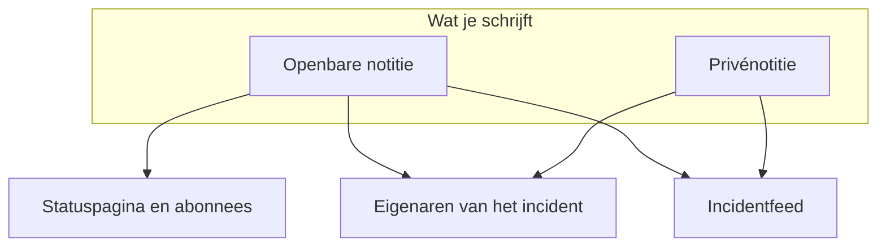

# Incidentnotities, eigenaren en feed

Elk incident verzamelt een geschreven verslag terwijl je eraan werkt: updates voor je klanten, werknotities voor je team, en een activiteitenfeed van alles wat er gebeurde. Deze pagina behandelt het schrijven van openbare en privénotities, wie elke notitie bereikt, de incidentfeed, en de eigenaren die over elke wijziging bericht krijgen.

:::cards
- [Een openbare notitie plaatsen](#een-openbare-notitie-plaatsen): Vertel klanten wat je weet, op de statuspagina en met een melding.
- [Wanneer abonnees een melding krijgen](#wanneer-een-openbare-notitie-abonnees-echt-bereikt): De controles waar een openbare notitie doorheen gaat, en haar badge.
- [De incidentfeed](#de-incidentfeed): De tijdlijn van alles wat er gebeurde.
- [Eigenaren](#eigenaren): Wie verantwoordelijk is, en wat ze te horen krijgen.
:::

## Hoe het werkt

Een deel van wat je schrijft, is voor je klanten — de update die om 02:14 op de statuspagina verschijnt met de mededeling dat je de foute deploy hebt gevonden. De rest is voor je team — de stacktrace die iemand plakte, de grafiek die eindelijk klopte, het besluit om over te schakelen. OneUptime houdt die twee doelgroepen uit elkaar, en legt allebei vast op het incident.



**Openbare notities** worden op je statuspagina gepubliceerd en kunnen abonnees een melding sturen. **Privénotities** (het model `IncidentInternalNote`) blijven binnen het dashboard. Daaronder liggen de **Incidentfeed**, een tijdlijn waaraan alleen wordt toegevoegd en die alles vastlegt wat er met het incident gebeurde, en de lijst **Eigenaren**, die bepaalt wie bericht krijgt.

Alles hangt aan het zijmenu van het incident: **Notities → Openbare notities**, **Notities → Privénotities** en **Team → Eigenaren**. De feed staat op de pagina **Overzicht** van het incident.

## Openbare notities tegenover privénotities

De twee soorten notities lijken in het dashboard op elkaar en gedragen zich heel verschillend.

|                          | Openbare notitie                                                    | Privénotitie                                                    |
| ------------------------ | ------------------------------------------------------------------- | --------------------------------------------------------------- |
| Model                    | `IncidentPublicNote`                                                | `IncidentInternalNote`                                          |
| Getoond op statuspagina's | Ja, als deel van de tijdlijn van het incident                      | Nooit — niets in de statuspagina-app leest ze                   |
| Plaatsingstijd           | `postedAt`, die je zelf kunt instellen                              | Geen: gestempeld en gesorteerd op `createdAt`                   |
| Meldt abonnees           | Als **Notify status page subscribers** aanstaat                     | Nooit: ze heeft helemaal geen velden voor abonnees              |
| Bijlagen bereikbaar voor | Bezoekers van de statuspagina, via een route van de statuspagina    | Alleen de geauthenticeerde dashboard-API                        |
| Meldt eigenaren          | Ja                                                                  | Ja                                                              |

**Wat "privé" werkelijk betekent.** Het betekent "niet gepubliceerd op de statuspagina" — niet "beperkt tot een kleinere groep mensen". De ingebouwde rollen die een incident kunnen lezen, lezen beide soorten notities, dus wie het incident kan lezen, kan meestal ook de privénotities lezen; in een aangepaste rol zijn het aparte machtigingen, **Read Incident Status Page Note** en **Read Incident Internal Note**. Moet je beperken wie een incident überhaupt kan zien, gebruik dan de vlag **Privé-incident** (`isPrivate`) op het incident zelf, die het incident voor elke statuspagina verbergt en het beperkt tot de gebruikers die eigenaar zijn, de leden van de teams die eigenaar zijn, en projectbeheerders en projecteigenaren.

**Eigenaren zien beide.** De taak die eigenaren meldingen stuurt, vraagt openbare en privénotities samen op. Een privénotitie is privé voor je abonnees, niet voor de mensen die reageren.

| Als je wilt…                                           | Kies             |
| ------------------------------------------------------ | ---------------- |
| Klanten vertellen wat je weet en wanneer je meer weet  | **Openbare notitie** |
| Een update terugdateren die je al ergens anders stuurde | **Openbare notitie** |
| Een hypothese, een uitgevoerd commando of een doodlopend spoor vastleggen | **Privénotitie** |
| Een heap dump of een schermafbeelding van een intern dashboard bijvoegen | **Privénotitie** |

## Een openbare notitie plaatsen

:::steps
### Open de openbare notities

Open het incident en kies **Notities → Openbare notities** in het zijmenu. De editor boven de notities zegt wie de notitie gaat lezen voordat je haar plaatst: **Public · Visible on your status page**.

### Schrijf de update

Schrijf de notitie in Markdown, of begin vanuit een van je **Sjablonen** of vanuit **Draft with AI**. Voeg met **Attach** bestanden toe als abonnees ze moeten zien.

### Bepaal wie bericht krijgt

Laat **Notify status page subscribers** aangevinkt om abonnees een melding te sturen, of vink het uit om stil te publiceren. **Will notify** eronder toont welke statuspagina's de notitie bereikt, en **Voorbeeld** toont de e-mail die ze krijgen.

### Plaats haar

Klik op **Post update**, of druk op Ctrl+Enter (⌘+Enter op een Mac). De notitie verschijnt bovenaan de lijst, met een badge die haar melding volgt.
:::

Dezelfde editor opent in een dialoogvenster vanuit **Add Public Note** in het menu **Acties** van de incidentfeed (zie [De incidentfeed](#de-incidentfeed)), dus een notitie wordt vanaf beide plekken op dezelfde manier geschreven.

| Bedieningselement                  | Doel                                                                                                                                          |
| ---------------------------------- | --------------------------------------------------------------------------------------------------------------------------------------------- |
| De notitie                         | De tekst, in Markdown. Verplicht.                                                                                                             |
| **Sjablonen**                      | Zet een van je notitiesjablonen in de notitie, na wat je al hebt getypt. Zie [Notitiesjablonen](#notitiesjablonen).                             |
| **Draft with AI**                  | Schrijft vanuit het incident een concept van de notitie, dat je zelf bewerkt. Zie [Een notitie met AI genereren](#een-notitie-met-ai-genereren). |
| **Attach**                         | Bestanden die met abonnees op de statuspagina worden gedeeld. Optioneel.                                                                      |
| **Posted now**                     | Wanneer de notitie zegt geplaatst te zijn: het moment dat je haar plaatst, tenzij je hier een eerder tijdstip kiest, in je huidige tijdzone.   |
| **Notify status page subscribers** | Selectievakje. Standaard aan, tenzij het incident werd gemeld zonder abonnees op de hoogte te stellen — dan begint het uit. Zet het uit om stil te publiceren. |

**Stille incidenten blijven stil.** Werd een incident gemeld met **Statuspagina-abonnees op de hoogte stellen** uit (of als privé-incident), dan hebben de abonnees er nooit iets over gehoord, dus een openbare notitie hoort niet het eerste te zijn wat ze horen. Op zo'n incident begint het selectievakje uit, met een regel eronder die uitlegt waarom. Je kunt het nog steeds aanvinken om abonnees over die notitie te informeren. Notities die zonder expliciete keuze worden geplaatst, volgen dezelfde regel: notities uit Slack en Microsoft Teams, workflows, en API-verzoeken die `shouldStatusPageSubscribersBeNotifiedOnNoteCreated` weglaten. Een expliciete `true` of `false` blijft altijd behouden. Openbare notities op [gepland-onderhoudsevenementen](/docs/status-pages/subscribers#geplande-onderhoudsgebeurtenissen) en [incidentepisodes](/docs/status-pages/subscribers) volgen een vergelijkbare regel, gebaseerd op of het evenement of de episode zelf bij het aanmaken abonnees een melding stuurde; een episode privé maken heeft daar geen invloed op.

**Zie wie de notitie bereikt.** Zolang **Notify status page subscribers** aangevinkt is, noemt een regel **Will notify** eronder de statuspagina's waar de notitie naartoe gaat, met per kanaal een aantal abonnees "tot", en de pagina's die de monitoren van het incident tonen maar geen bericht krijgen, met de reden. Krijgt niemand bericht, dan toont hij niets, tenzij het incident verborgen is voor statuspagina's of het bereik van statuspagina's van het incident de reden is. Hij volgt het bereik van statuspagina's van het incident, dus een notitie op een incident dat tot twee locatiepagina's is beperkt, zegt dat ze die twee bereikt. Zie [Eén statuspagina per doelgroep](/docs/status-pages/one-status-page-per-audience).

**Zie wat ze krijgen.** Naast hetzelfde selectievakje toont **Voorbeeld** de e-mail die de abonnees van elk van die statuspagina's krijgen voor de notitie die je schrijft, en welk sjabloon die gebruikt en waarom. Het blijft grijs tot de notitie wat tekst heeft. **Test naar mij sturen** stuurt die e-mail naar het e-mailadres van je eigen account, en naar niemand anders. Zie [Abonnees en aankondigingen](/docs/status-pages/subscribers#incidenten).

> [!TIP]
> **De plaatsingstijd is het echte tijdstempel van de notitie.** Statuspagina's sorteren en tonen openbare notities op `postedAt`, niet op wanneer je ze typte — dus als je de statuspagina bijwerkt met een update die je 40 minuten geleden verstuurde, kies dan **Posted now** en stel in wanneer het echt gebeurde. Komt een notitie via de API (`/api/incident-public-note`) zonder tijdstip binnen, dan stempelt OneUptime de huidige tijd.

Elke notitie toont wie haar schreef, haar plaatsingstijd, de weergegeven Markdown met haar bijlagen en, in haar kop, hoe het met haar melding aan abonnees staat. **Search notes…** vindt notities op wat ze zeggen, en de feed kan met de nieuwste of de oudste eerst worden gelezen.

## Een privénotitie plaatsen

**Notities → Privénotities** is bewust eenvoudiger. Het is dezelfde editor, met **Private · Only your team can see this**, met de notitie, **Sjablonen**, **Draft with AI** en **Attach** voor bestanden die bedoeld zijn voor het team dat op het incident reageert. **Privénotitie toevoegen** in het menu **Acties** van de incidentfeed opent hem in een dialoogvenster. Via de API zijn privénotities `/api/incident-internal-note`.

Geen plaatsingstijd, geen selectievakje voor abonnees — de notitie wordt gestempeld wanneer ze wordt aangemaakt.

Beide soorten notities worden geschreven in de Markdown-editor, die lijstitems nest met **Inspringing vergroten** en **Inspringing verkleinen** — of Tab en Shift+Tab — en de lijsten, links en opmaak behoudt van wat je plakt uit Word, Google Docs of een andere OneUptime-pagina. Ctrl+Z maakt een inspringing ongedaan, en in de visuele modus ook de blokken en plakbewerkingen die de editor invoegde, in volgorde met wat je typte. Een codeblok dat je uit een notitie kopieert, wordt weer geplakt als codeblok, en een woord dat je eruit kopieert als inline code. Zie [Een incident melden](/docs/incidents/declaring-incidents#stap-1-incidentdetails).

## Bijlagen bij notities

Beide soorten notities accepteren bestandsbijlagen via de knop **Attach** van de editor, en beide tonen onder de tekst van de notitie een lijst bijlagen met per bestand een link **Download attachment**.

Waar ze uiteenlopen, is wie het bestand kan ophalen:

- **Bijlagen van openbare notities** zijn te downloaden door bezoekers van de statuspagina via een route van de statuspagina, samen met de notitie zelf.
- **Bijlagen van privénotities** zijn alleen bereikbaar via de geauthenticeerde dashboard-API. Er is geen route van de statuspagina voor.

Daardoor zijn bijlagen dezelfde keuze tussen openbaar en privé als de tekst van de notitie. Een afbeelding voor de tijdlijn die klanten zien, hoort bij een openbare notitie; een configuratiedump bij een privénotitie.

Afbeeldingen volgen dezelfde keuze. Een afbeelding die je in een notitie plakt of sleept, of toevoegt met **Afbeelding uploaden**, wordt opgeslagen in het project van het incident en in de notitie getoond, en wie haar kan zien, volgt de notitie:

- **In een privénotitie** — of in een openbare notitie voordat die is geplaatst — wordt een afbeelding alleen getoond aan de leden van het project, aangemeld zoals het project vereist. Iedereen anders die het adres ervan opent, ziet niets, alsof er geen afbeelding was.
- **In een openbare notitie** wordt een afbeelding getoond aan iedereen die de notitie kan zien: op de statuspagina, en in de e-mails die de abonnees krijgen. Een openbare notitie wordt getoond met haar incident, nooit zonder: zolang het incident verborgen is voor statuspagina's of privé is, worden de afbeeldingen van de notities ook alleen aan de leden van het project getoond.

Elke upload begint privé, vanuit het dashboard en vanuit de API. Een afbeelding is alleen voor iedereen te zien zolang iets wat je statuspagina's tonen haar bevat: een openbare notitie zolang haar incident, episode of gepland-onderhoudsevenement op statuspagina's wordt getoond, een aankondiging vanaf het moment dat ze wordt getoond, de beschrijving van het incident zolang het incident **Zichtbaar op statuspagina** is en niet privé, zijn postmortem zodra dat daar ook is gepubliceerd, de beschrijving van een episode of van een gepland-onderhoudsevenement zolang die op statuspagina's wordt getoond (nooit zolang de episode privé is), en de eigen beschrijvingen van het overzicht, de groepen en de middelen van de statuspagina. Houdt dat op — het incident wordt verborgen of privé gemaakt, de afbeelding wordt eruit gehaald, de notitie of het incident wordt verwijderd — dan is de afbeelding weer privé, tenzij iets anders wat je statuspagina's tonen haar nog bevat. De beschrijving en het bedankbericht van een formulier tonen hun afbeeldingen op dezelfde manier aan iedereen, zolang het formulier inzendingen accepteert.

Een notitie lezen via de API, Terraform of een workflow toont alleen de bijlagen die de lezer mag openen: bestanden van het project van de notitie, en openbare bestanden. Een bijlage die een notitie uit een ander project noemt, wordt uit de lijst weggelaten, alsof de notitie haar niet had.

## Een notitie met AI genereren

De editor heeft een knop **Draft with AI**, op beide notitiepagina's en in de dialoogvensters **Add Public Note** en **Privénotitie toevoegen** van de feed. Hij stuurt het incident naar de AI-provider van je project en zet de gegenereerde Markdown in de notitie, waar je die bewerkt voordat je plaatst — er wordt niets automatisch gepubliceerd.

| Dialoogvenster                     | Wat het schrijft                                                     | Sjablonen                                                         |
| ---------------------------------- | -------------------------------------------------------------------- | ----------------------------------------------------------------- |
| **Generate Public Note with AI**   | Een notitie voor klanten, op basis van een analyse van de incidentgegevens. | **Status Update**, **Resolution Notice**, **Maintenance Update** |
| **Generate Private Note with AI**  | Een interne technische notitie.                                      | **Investigation Update**, **Technical Analysis**, **Shift Handoff** |

Achter de knop stuurt het dashboard een verzoek naar `/incident/generate-note-from-ai/{incidentId}` met het gekozen sjabloon en een notitietype `public` of `internal`.

Wat er wordt verstuurd, is de tekst van het incident. Een afbeelding of een bestand dat erin is ingesloten — een schermafbeelding die in de beschrijving is geplakt bijvoorbeeld — wordt vervangen door een korte aanduiding zoals `[image omitted: PNG, 340 KB]`, en elk tekstveld wordt ingekort tot 16.000 tekens, zodat één grote plakbewerking de rest nooit verdringt. Het incident zelf houdt zijn afbeeldingen.

## Notitiesjablonen

Schrijft je team bij elke storing dezelfde drie updates, sla ze dan één keer op. Het menu **Sjablonen** van de editor toont ze, op beide notitiepagina's en in de notitievensters van de feed, en er een kiezen zet het in de notitie.

Sjablonen worden gedeeld tussen openbare en privénotities: één sjablonenlijst dient voor beide, en hetzelfde sjabloon kan in beide soorten notities worden ingevoegd.

Plaatshouders in een sjabloon — `{{incident.title}}`, `{{incident.state}}`, `{{incident.customFields.impact}}` en de andere die onder [Notitiesjablonen](/docs/incidents/settings#notitiesjablonen) staan — worden ingevuld met de huidige waarden van het incident als je het kiest, op de notitiepagina's en in de dialoogvensters **Bevestigen** en **Oplossen**. Wat je al had getypt, wordt nooit gewijzigd, en een plaatshouder zonder waarde blijft zoals hij is geschreven.

> [!IMPORTANT]
> Lees de ingevulde notitie voordat je een openbare plaatst: `{{incident.affectedStatusPages}}` noemt elke statuspagina die het incident bereikt, en de abonnees van al die pagina's lezen het.

Je beheert ze onder **Incidenten → Instellingen → Notitie-sjablonen** — de kaart heet **Openbare of privénotitiesjablonen voor incidenten** en het formulier is één pagina: **Sjabloonnaam** en **Sjabloonbeschrijving**, allebei verplicht, en dan de tekst. Zolang je er nog geen hebt, zegt het menu **Sjablonen** dat en linkt het daarnaartoe.

## Notities plaatsen vanuit Slack of Microsoft Teams

Heb je een werkruimte gekoppeld, dan hoeven responders het kanaal nooit te verlaten. Zowel Slack als Microsoft Teams biedt een actie om een notitie toe te voegen die een dialoogvenster opent met een vervolgkeuzelijst **Note Type** — **Public Note** (geplaatst op de statuspagina) of **Private Note** (alleen zichtbaar voor teamleden) — en een tekstvak **Note**, en die het resultaat rechtstreeks op het incident schrijft.

Drie details die het weten waard zijn:

- **Bescherming tegen dubbelingen** — elke notitie legt vast uit welk Slack-bericht ze kwam (`postedFromSlackMessageId`, in de vorm `channel_id:message_ts`), dus als meerdere mensen op hetzelfde bericht reageren, levert dat één notitie op, geen vijf.
- **Notities komen terug** — beide soorten notities plaatsen zet ook een bericht in het gekoppelde incidentkanaal, omdat het feeditem van de notitie wordt aangemaakt met meldingen naar de werkruimte aan.
- **Geplaatst als de persoon die het vroeg** — een notitie uit het dialoogvenster of uit een reactie wordt geplaatst met de OneUptime-machtigingen van die persoon, dus daarvoor is diens machtiging nodig om dat soort notitie op het incident te plaatsen. Wordt die geweigerd, dan krijgt diegene te horen waarom — in een direct bericht in Slack, en in het gesprek in Microsoft Teams (in de thread van het bericht, bij een reactie) — en er wordt niets geplaatst.

## Wanneer een openbare notitie abonnees echt bereikt

Een openbare notitie aanmaken met **Statuspagina-abonnees op de hoogte stellen** aan garandeert op zichzelf niet dat er een e-mail uitgaat. De notitie moet door een reeks controles komen, en elke mislukking legt een specifieke reden vast in plaats van een fout te geven:

```mermaid title="De controles waar een openbare notitie doorheen gaat voordat abonnees ervan horen"
flowchart TB
    note["Openbare notitie geplaatst"] --> box{"Meldingsvakje aan?"}
    box -->|Nee| skipped["Abonnees niet op de hoogte gesteld"]
    box -->|Ja| incident{"Incident op statuspagina's?"}
    incident -->|Nee| skipped
    incident -->|Ja| pages{"Pagina binnen het bereik?"}
    pages -->|Nee| skipped
    pages -->|Ja| prefs{"Abonnee aangemeld?"}
    prefs -->|Ja| sent["Bericht verstuurd"]
```

1. **Statuspagina-abonnees op de hoogte stellen** moet aanstaan. Staat het uit, dan wordt de notitie als overgeslagen gestempeld op het moment dat ze wordt aangemaakt. Het begint uit op incidenten die werden gemeld zonder abonnees op de hoogte te stellen.
2. De notitie moet horen bij een incident dat nog bestaat.
3. Aan het incident moet minstens één monitor hangen — zonder monitoren is er geen middel op een statuspagina om de notitie naartoe te leiden.
4. De vlag **Zichtbaar op statuspagina** (`isVisibleOnStatusPage`) van het incident moet waar zijn, en het incident mag niet privé zijn (`isPrivate`). Een privé-incident is verborgen voor elke statuspagina, wat de vlag ook zegt — zie [Een incident van de statuspagina houden](/docs/incidents/states-and-severities#een-incident-van-de-statuspagina-houden).
5. Elke statuspagina die het incident bereikt, moet **Incidenten weergeven** (`showIncidentsOnStatusPage`) aan hebben staan. De pagina's die het bereikt, zijn die welke zijn monitoren tonen, ingeperkt tot de pagina's waartoe het incident is beperkt, als die er zijn. Een incident dat tot geen enkele pagina is beperkt, slaat de pagina's over die alleen incidenten tonen die tot hen beperkt zijn. Zie [Eén statuspagina per doelgroep](/docs/status-pages/one-status-page-per-audience).
6. Elke abonnee moet door zijn eigen voorkeuren komen — niet afgemeld, en geabonneerd op dit middel en op het gebeurtenistype `Incident` waar de pagina abonnees laat kiezen.

> [!NOTE]
> **Meldingen zijn niet direct.** De taak die ze verstuurt, draait één keer per minuut, dus reken op maximaal ongeveer een minuut tussen het opslaan van de notitie en het vertrek van de e-mail. Dat is wat **Notifying subscribers soon** op een notitie betekent, en **Sending Soon** bij de eigen meldingen van het incident.

De kop van een openbare notitie volgt de hele reis met een badge. Klik erop voor het statusbericht van de melding, dat zegt wat er gebeurde:

| Badge                          | Wat het betekent                                                                                                                                  |
| ------------------------------ | ------------------------------------------------------------------------------------------------------------------------------------------------- |
| **Subscribers not notified**   | Er is niets verstuurd: de notitie werd geplaatst met **Statuspagina-abonnees op de hoogte stellen** uitgevinkt, of een van de poorten hierboven ging dicht. De reden is vastgelegd. |
| **Notifying subscribers soon** | In de wachtrij, wachtend op de volgende run van de verzendtaak.                                                                                   |
| **Notifying subscribers**      | De taak werkt de lijst met abonnees af.                                                                                                           |
| **Subscribers notified**       | Het bericht van elke abonnee is verstuurd. Het statusbericht noemt per statuspagina hoeveel er via elk kanaal zijn gegaan.                        |
| **Notification failed**        | Niet elke abonnee heeft het bericht gekregen, of de taak stopte met een fout. Het statusbericht zegt welke.                                         |

**Verstuurd betekent verstuurd.** De taak wacht op elk bericht: een e-mail of sms telt als verstuurd zodra de mailserver of de sms-provider hem heeft aangenomen, en een bericht naar Slack, Microsoft Teams of een webhook zodra de andere kant heeft geantwoord. Een bericht dat wordt geweigerd, een fout geeft of binnen 4 minuten geen antwoord krijgt, telt als mislukt, en één mislukking zet de badge op **Notification failed**; de andere abonnees krijgen het bericht nog steeds. Het statusbericht luidt dan bijvoorbeeld `Not every subscriber was sent this notification: 2 of 61 messages failed. Site 03: 41 email sent. Site 07: 16 email, 2 SMS sent; 2 email failed.` "Verstuurd" is zo ver als OneUptime kan kijken: een mailserver kan een e-mail later nog terugsturen.

:::details Grote pagina's en lange verzendingen
De abonnees van een statuspagina worden per 10.000 gelezen tot iedereen is bereikt, en er zijn 20 berichten tegelijk onderweg. Eén melding begint na 20 minuten geen nieuwe berichten meer: wat ze tot dan niet bereikte, wordt vermeld, en ze wordt als **Notification failed** gemarkeerd. Een verzending die halverwege werd onderbroken — de server herstartte of reageerde niet meer — wordt ook als **Notification failed** gemarkeerd, met een bericht dat begint met `Interrupted:`, zodra ze 40 minuten op **Notifying subscribers** staat, zodat ze daar nooit eeuwig blijft hangen. Zie [Abonnees en aankondigingen](/docs/status-pages/subscribers).
:::

### De melding van een notitie opnieuw versturen

Klik op de meldingsbadge van een notitie om te zien wat er gebeurde. Een notitie waarvan de melding mislukte, biedt **Melding opnieuw proberen** aan, en een notitie waarvan de melding is uitgegaan, biedt **Melding opnieuw verzenden** aan. Beide vragen het eerst: de bevestiging noemt de statuspagina's die de notitie nu zou bereiken, met per kanaal een aantal "tot", of zegt dat ze niemand zou bereiken, en zegt wat er gebeurt. Beide zetten de notitie terug in de wachtstand zodat de volgende run haar oppakt, en sturen haar naar elke statuspagina die het incident nu bereikt, ook naar de abonnees die haar al kregen. Heb je de pagina's waartoe het incident is beperkt sinds het plaatsen van de notitie gewijzigd, dan gaat ze naar de pagina's waartoe het nu is beperkt. Een notitie die werd geplaatst met **Statuspagina-abonnees op de hoogte stellen** uitgevinkt, biedt geen van beide aan, omdat het nooit de bedoeling was dat ze werd verstuurd, en geen van beide wordt aangeboden zolang een melding nog in de wachtrij staat of wordt verstuurd. Openbare notities op gepland-onderhoudsevenementen en incidentepisodes houden **Melding opnieuw proberen** alleen na een mislukking.

De melding van een notitie opnieuw versturen vertelt elke abonnee wat de notitie zegt, net als het plaatsen deed, dus daarvoor is de machtiging nodig om openbare notities te plaatsen die abonnees een melding sturen, en ook de machtiging om openbare notities te bewerken. Via de API is het dezelfde update die het dashboard doet, die `subscriberNotificationStatusOnNoteCreated` terugzet op `Pending`; ze wordt geweigerd voor een aanroeper zonder die machtigingen, voor een notitie die werd geplaatst zonder abonnees op de hoogte te stellen, en zolang de melding van de notitie wordt verstuurd.

:::details Hoe de melding 'aangemaakt' van het incident verdergaat
Alleen de melding 'aangemaakt' van het incident gaat verder waar ze stopte: ze houdt bij naar welke statuspagina's ze volledig is verstuurd, en **Opnieuw proberen** op het **Overzicht** van het incident slaat die over. Dat wordt per statuspagina bijgehouden, niet per abonnee, dus een pagina waarbij ze halverwege stopte, krijgt haar opnieuw volledig, ook de abonnees van die pagina die haar al kregen. De bevestiging van **Opnieuw proberen** biedt **Opnieuw naar elke statuspagina verzenden, ook naar de al bereikte pagina's** aan, wat er **Opnieuw naar alle pagina's verzenden** van maakt, en **Opnieuw verzenden** na een succes stuurt haar opnieuw naar elke pagina. Zie [Eén statuspagina per doelgroep](/docs/status-pages/one-status-page-per-audience#adding-status-pages).
:::

### Een openbare notitie bewerken

**Een openbare notitie bewerken gebeurt stil, tenzij je erom vraagt.** Het bewerkingsformulier van de notitie heeft een selectievakje **Abonnees op de hoogte stellen van deze update**, elke keer uitgevinkt. Vink het aan voor een wijziging die abonnees moeten weten, en ze krijgen de bewerkte notitie, gemarkeerd als update; de notitie toont dan een tweede badge voor de update naast de oorspronkelijke, met een eigen **Melding opnieuw proberen** na een mislukking:

| Badge van de update         | Wat het betekent                                    |
| --------------------------- | --------------------------------------------------- |
| **Update in de wachtrij**   | Wacht op de volgende run van de verzendtaak.        |
| **Update wordt verzonden**  | De taak werkt de lijst met abonnees af.             |
| **Update verzonden**        | Elke abonnee heeft de bewerkte notitie gekregen.    |
| **Update mislukt**          | Niet elke abonnee heeft haar gekregen.              |
| **Update niet verzonden**   | Een van de poorten hierboven hield haar tegen.      |

Een verstuurde update wordt niet opnieuw aangeboden: bewerk de notitie met het vakje aangevinkt om de nieuwste tekst te versturen, of verstuur de notitie zelf opnieuw. Is de oorspronkelijke melding nog niet verstuurd, dan gaat er geen aparte update uit — de oorspronkelijke melding neemt de bewerking mee. Wordt ze op dat moment verstuurd, dan wacht de update tot ze klaar is en gaat daarna uit. Het selectievakje en het **Melding opnieuw proberen** van de update vragen dezelfde machtigingen als de melding van de notitie opnieuw versturen; zonder die machtigingen kun je de notitie nog steeds bewerken, zonder iemand iets te laten weten. Zie [Abonnees en aankondigingen](/docs/status-pages/subscribers).

Het eigenlijke bericht dat abonnees krijgen, wordt per statuspagina en per kanaal met een sjabloon opgebouwd — e-mail, sms, Slack en Microsoft Teams hebben elk een eigen sjabloon voor de gebeurtenis **Subscriber Incident Note Created**, met variabelen voor de naam en de URL van de statuspagina, de link naar de details, de getroffen middelen, de ernst en de titel van het incident, de tekst van de notitie, de labels, getroffen statuspagina's en aangepaste velden van het incident, en een afmeldlink per abonnee. De standaardberichten per e-mail, in Slack en in Microsoft Teams tonen ook de aangepaste velden van het incident die zijn gemarkeerd met **Opnemen in meldingen aan abonnees**, met hun huidige waarden. Zie [Abonnees en aankondigingen](/docs/status-pages/subscribers) voor hoe die sjablonen en kanalen worden ingesteld.

## De incidentfeed

De kaart **Incidentfeed** staat onderaan de linkerkolom op de pagina **Overzicht** van het incident. Het is het verhaal van het incident op volgorde: elk item is een pictogram, de avatar en naam van wie het veroorzaakte, een relatief tijdstempel met de exacte lokale tijd bij aanwijzen, en een tekst in Markdown. Standaard staan de nieuwste items bovenaan.

Sommige items dragen extra details — een melding aan eigenaren noemt bijvoorbeeld iedereen die werd gemaild, en een melding aan abonnees noemt elke statuspagina waarnaar ze ging, met per kanaal het aantal verstuurde en mislukte berichten en het onderwerp waarmee de e-mail uitging, gevolgd, als ze er berichten mee verstuurde, door de waarden van aangepaste velden die ze in een bericht zette, onder **Custom fields sent**. Die tonen een knop **More Information** die een paneel **More Information** opent.

De kop van de kaart heeft ook een menu **Acties**, zodat je kunt handelen zonder de tijdlijn te verlaten:

- **Execute Runbook** — start een [runbook](/docs/runbooks/index) voor dit incident.
- **Bereikbaarheidsdienstbeleid uitvoeren** — roep op verzoek een beleid op. Een gearchiveerd beleid roept niemand op: zijn uitvoeringslogboek op het incident zegt dat het niet is uitgevoerd omdat het beleid gearchiveerd is.
- **Add Public Note** — de editor van de pagina **Openbare notities**, in een dialoogvenster: schrijf de notitie, en daarna **Post update**. Sjablonen, **Draft with AI**, bijlagen, **Notify status page subscribers** met wie de notitie bereikt, en **Voorbeeld** zijn er allemaal. De notitie wordt nu geplaatst; om haar terug te dateren, kies je **Posted now**.
- **Privénotitie toevoegen** — de editor van de pagina **Privénotities**, in een dialoogvenster: schrijf de notitie, en daarna **Add note**.

Beide notitieacties zijn vergrendeld, met de naam van de ontbrekende machtiging, voor iemand die geen notities mag schrijven. Nadat een notitie is geplaatst, sluit het dialoogvenster en toont de feed haar.

Al het andere zit achter de knop **⋯** ernaast, dezelfde knop **Meer opties** die de kop van een tabelkaart heeft, zodat de kop zo weinig mogelijk knoppen toont:

- **Nieuwste eerst** / **Oudste eerst** — de volgorde waarin de feed wordt gelezen. Een vinkje markeert de gebruikte volgorde, en je browser onthoudt de keuze voor de feed van elk incident.
- **Filteren op gebeurtenistype** — een dialoogvenster met de gebeurtenistypen van de feed, elk met het pictogram dat de items ervan dragen, en een zoekvak als de lijst lang is. Vink de typen aan die je wilt zien en kies **Filters toepassen**; zonder vinkjes wordt elk gebeurtenistype getoond. Zolang de feed gefilterd is, zegt een vak erboven hoeveel gebeurtenistypen hij toont, met een label voor elk, **Filters bewerken** en **Filters wissen**. Het filter wordt niet opgeslagen: verlaat het incident en de feed toont weer alles.
- **Vernieuwen** — haalt de feed opnieuw op.

> [!NOTE]
> **De feed is alleen-toevoegen, en het is niet je auditlog.** De API staat toe dat feeditems worden aangemaakt en gelezen, maar niet dat ze worden bijgewerkt of verwijderd, zodat niemand stilletjes de geschiedenis van een incident kan herschrijven. Hij is ook niet blijvend: op installaties met facturering worden feedrijen ouder dan drie jaar verwijderd. Voor een duurzaam verslag van wie wat veranderde, gebruik je **Geavanceerd → Auditlogboeken** in het zijmenu van het incident.

## Wat de feed vastlegt

Feeditems worden geschreven door de incidentservice zelf, door beide notitieservices, door de statustijdlijn, door wijzigingen van eigenaren en leden, door het koppelen en ontkoppelen van waarschuwingen, door de regelmotoren, door de uitvoering van de bereikbaarheidsdienst, door de uitvoerders van het AI-onderzoek en het postmortem, en door de cronjobs voor meldingen. De gebeurtenistypen omvatten:

- **Het incident zelf** — `IncidentCreated`, `IncidentUpdated`, `IncidentStateChanged`. Een item `IncidentUpdated` legt vast wat een bewerking veranderde: de titel, de beschrijving, de hoofdoorzaak, de herstelnotities, de labels, de ernst, de monitoren en de status die erop werd gezet, en de statuspagina's die aan het bereik van het incident werden toegevoegd of eruit werden verwijderd. Het heeft een regel voor elke waarde die veranderde en geen voor een waarde die ongewijzigd werd opgeslagen, dus een kaart opslaan zonder dat er iets is veranderd, of een API-client of een workflow die het incident terugschrijft zoals het is, voegt helemaal geen item toe. Tekst die hetzelfde leest, is hetzelfde (regeleinden en de spaties eromheen daargelaten), en labels zijn dezelfde set in elke volgorde; een waarde die werd gewist, leest als verwijderd, en alle labels eraf halen als "All labels removed.". De items **Alert updated** van een waarschuwing werken op dezelfde manier.
- **Notities en verslagen** — `PublicNote`, `PrivateNote`, `RootCause`, `RemediationNotes`, `PostmortemNote`. Een item `PostmortemNote` wordt geschreven wanneer de notitie van het postmortem verandert, niet elke keer dat het postmortem wordt opgeslagen.
- **Personen** — `OwnerUserAdded`, `OwnerTeamAdded`, `OwnerUserRemoved`, `OwnerTeamRemoved`, `IncidentMemberAdded`, `IncidentMemberRemoved`.
- **Gekoppelde waarschuwingen** — `AlertLinked` en `AlertUnlinked`, getoond als **Waarschuwing gekoppeld** en **Waarschuwing ontkoppeld**.
- **Meldingen** — `OwnerNotificationSent`, `SubscriberNotificationSent`, `OnCallPolicy`, `OnCallNotification`.
- **Automation** — `LabelRuleExecuted`, `OwnerRuleExecuted`, `PrivacyRuleExecuted`, `OnCallRuleExecuted`, `AutoRemediation`.
- **Videogesprekken** — `VideoCallStarted` en `VideoCallFailed`: een gesprek dat voor het incident is gestart, met de deelnamelink, of de reden waarom een provider er geen kon starten. Zie [Videogesprekken](/docs/workspace-connections/video-calls).

Elk type krijgt zijn eigen pictogram, zodat je een lange feed kunt doorlopen en de statuswijzigingen uit het geklets kunt pikken. Door AI gegenereerde analyses van de hoofdoorzaak worden apart gemarkeerd en in een beperkte Markdown-modus weergegeven. Het item **Incident aangemaakt**, het item dat een nieuwe titel vastlegt en de items voor het toetreden tot of verlaten van een episode tonen een titel precies zoals hij is getypt: ze escapen `\`, `[`, `]`, `*`, `_`, `~`, backticks en \< erin, zodat een titel geen afbeelding, ruwe HTML, Slack-vermelding zoals \<!here\>, link waarvan de tekst verbergt waar hij heen gaat, of vette, cursieve of codetekst kan worden. Een adres in een titel verschijnt nog steeds als link naar datzelfde adres.

Een waarschuwing koppelen wordt ook op de waarschuwing vastgelegd. Waarschuwingen hebben een eigen feed, waarin dezelfde wijziging verschijnt als **Gekoppeld aan incident** (`LinkedToIncident`) of **Ontkoppeld van incident** (`UnlinkedFromIncident`), met de naam van het incident. Alleen de items **Waarschuwing gekoppeld** en **Waarschuwing ontkoppeld** van het incident worden in Slack en Microsoft Teams geplaatst, zodat elke koppeling één keer wordt aangekondigd. Een incident dat vanuit waarschuwingen wordt gemeld, krijgt één item **Waarschuwing gekoppeld** dat ze allemaal noemt in plaats van één per waarschuwing, en de titel van een privéwaarschuwing of privé-incident wordt weggelaten uit het item aan de andere kant. Zie [Gekoppelde waarschuwingen](/docs/incidents/linked-alerts).

Feeds respecteren de privacy van incidenten: bij privé-incidenten worden feeds op dezelfde manier gefilterd als het incident.

## Eigenaren

Eigenaren zijn de mensen en teams die verantwoordelijk zijn voor een incident. Zij zijn het doel van de meldingen over alles wat ermee gebeurt — en zij zijn de reden dat een incident niet onopgemerkt blijft terwijl iedereen aanneemt dat iemand anders ermee bezig is.

Open **Team → Eigenaren** in het zijmenu van het incident. De kaart **Eigenaren** toont een badge met een teller en beschrijft eigenaren als de mensen en teams die verantwoordelijk zijn voor dit incident en die bericht krijgen over wijzigingen, met een lopende telling zoals "2 people · 1 team". Eigenaren verschijnen als overlappende avatars; als je er een aanwijst, zie je het e-mailadres van de persoon of wordt het item als **Team** gemarkeerd.

- Klik op **Eigenaar toevoegen** om een kiezer te openen met een zoekvak voor mensen of teams.
- Klik op het verwijderelement op een avatar om de bevestiging **Eigenaar verwijderen** te openen, en dan op **Verwijderen**.
- Zijn er nog geen eigenaren, dan zegt de kaart dat en nodigt ze je uit een teamgenoot of een team toe te voegen, zodat die bericht krijgen over wijzigingen.

Gebruikers die eigenaar zijn en teams die eigenaar zijn, zijn aparte records — een team toevoegen maakt elk lid van dat team eigenaar voor meldingen, zonder ze afzonderlijk te noemen. Via de API zijn het `/api/incident-owner-user` en `/api/incident-owner-team`.

Alleen de eigen teams en leden van je project kunnen eigenaar zijn. De kiezer biedt alleen hen aan, en eigenaren die via de API, Terraform of een workflow worden toegevoegd, worden aan hetzelfde gehouden: een team uit een ander project, of iemand die geen lid is van het project, wordt geweigerd.

## Hoe eigenaren worden toegewezen

Er zijn vier routes naar de lijst met eigenaren:

- **Vanuit een incidentsjabloon** — sjablonen hebben een veld **Eigenaren**: de mensen en teams die eigenaar zijn van het incident en bericht krijgen als het wordt aangemaakt of bijgewerkt, gekozen uit dezelfde lijst als **Eigenaar toevoegen**. Een incident aanmaken vanuit het sjabloon vult ze vooraf in, en ze worden toegevoegd zodra de Slack- en Microsoft Teams-kanalen van het incident bestaan, zodat een meldingsregel die de eigenaren van een incident in een nieuw kanaal uitnodigt, hen ook uitnodigt. Het dashboard, en de stap **Create One Incident** van een workflow met een gekozen **Incident Template**, voegen ze toe zonder de melding "je bent toegevoegd"; een [formulier](/docs/forms/on-submit) met een sjabloon laat het hun wel weten, en houdt de melding **Incident aangemaakt** van het incident vast tot ze zijn toegevoegd. Zie [Een incident melden](/docs/incidents/declaring-incidents).
- **Vanuit Incident-eigenaarregels** — overeenkomende regels voegen bij het aanmaken automatisch eigenaren toe.
- **Bij het aanmaken via de API** — gebruikers en teams die als eigenaar met de aanmaakaanroep worden meegegeven, worden op dezelfde manier toegevoegd, zodra de kanalen bestaan, en zonder de melding "je bent toegevoegd".
- **Met de hand** — het element **Eigenaar toevoegen** op de pagina **Eigenaren**, op elk moment tijdens het incident.

Dezelfde persoon twee keer toevoegen kan geen kwaad; eigenaren die al zijn toegewezen, worden niet gedupliceerd.

## Incident-eigenaarregels

**Incident-eigenaarregels** wijzen automatisch gebruikers en teams als eigenaar toe wanneer overeenkomende incidenten worden aangemaakt — de routeringslaag die ervoor zorgt dat een database-incident bij het databaseteam terechtkomt zonder dat iemand erover hoeft na te denken. Je vindt ze onder **Incidenten → Regels → Eigenaarsregels**, en de rest van de incidentautomatisering wordt behandeld in [Incidentinstellingen en automatisering](/docs/incidents/settings).

Het regelformulier heeft twee stappen — **Overeenkomst**, de voorwaarden waaraan een incident moet voldoen, en dan **Eigenaren**, wat de regel toevoegt:

- **Eigenaren** — **Eigenaar toevoegen** opent één lijst met mensen en teams; klik op elk ervan om het toe te voegen, en haal een keuze weg met de **×** op het label ervan. Komt de regel overeen, dan wordt elke gekozen persoon en elk gekozen team als eigenaar toegevoegd, en eigenaren die al zijn toegewezen, worden niet gedupliceerd.
- **Eigenaren overnemen**, ingeklapt onder **Eigenaren** — wijs eigenaren toe vanuit verwante entiteiten in plaats van ze te noemen. **Eigenaren overnemen van monitoren** maakt elke eigenaar van de monitoren van het incident eigenaar van het incident, en **Eigenaren overnemen van hosts**, **Eigenaren overnemen van Kubernetes-clusters**, **Eigenaren overnemen van Docker-hosts**, **Inherit Owners From Podman Hosts** en **Eigenaren overnemen van services** doen hetzelfde voor die middelen.

Een nieuwe regel moet iemand toevoegen: kies minstens één eigenaar, of zet een schakelaar onder **Eigenaren overnemen** aan. Ook de API en Terraform weigeren een nieuwe regel die niemand toevoegt. Zijn **Naam** wordt ingevuld vanuit de eigenaren die je kiest — of, bij een regel die alleen overneemt, vanuit zijn schakelaars (_Inherit owners from monitors_) — tot je zelf een naam typt. Een regel bewerken eist nooit eigenaren, dus een oudere regel die niets toevoegt, kan nog steeds worden hernoemd of uitgezet; de lijst markeert hem met **Voegt niets toe**. Zie [Label- en eigenaarsregels](/docs/configuration/label-and-owner-rules).

**Eigenaren op de hoogte stellen**, onder **Meer velden**, bepaalt of mensen het te weten komen. Laat het aan voor echte routering; zet het uit om eigenaren stil toe te voegen — handig als een regel een administratief gemak is en geen oproep.

Elke uitvoering van een regel wordt in de incidentfeed geschreven, zodat je altijd kunt zien of iemand door een regel of door een mens is toegevoegd.

## Waarover eigenaren een melding krijgen

Vijf taken sturen eigenaren meldingen, elk één keer per minuut:

| Melding                    | Wanneer                                                      | Onderwerp van de e-mail                                        |
| -------------------------- | ------------------------------------------------------------ | -------------------------------------------------------------- |
| **Incident aangemaakt**    | Het incident wordt gemeld.                                   | `[New Incident {number}] - {title}`                            |
| **Er is een notitie geplaatst** | Er wordt een openbare *of* privénotitie geplaatst.      | `[Update Incident {number}] - {title}`                         |
| **De status is gewijzigd** | Het incident gaat naar een andere status.                    | `[{State} Incident {number}] - {title}`                        |
| **Je bent toegevoegd**     | Je wordt als eigenaar toegevoegd.                            | `You have been added as the owner of Incident {number} - {title}` |
| **Nog steeds niet opgelost** | Een herinnering, gestuurd door het tijdstip van de volgende herinnering van het incident. | `[Reminder] Incident {number} is still {state} - {title}` |

Elke melding gaat uit via de kanalen die de persoon heeft aangezet in **Gebruikersinstellingen → Meldingsinstellingen** — e-mail, sms, spraakoproep, push, WhatsApp, Telegram, Slack, Microsoft Teams of webhook — die bepalen wat er daadwerkelijk wordt verstuurd. Elke ontvanger kan elk van deze meldingen afzonderlijk uitzetten — de instellingen per gebruiker gaan over het sturen van de meldingen over een aangemaakt incident, een geplaatste notitie, een gewijzigde status, een toegevoegde eigenaar, een toegewezen lid, en een herinnering dat het nog openstaat. Wie alleen een oproep wil bij statuswijzigingen, kan precies dat krijgen. Zie [Incidentstatussen en ernstniveaus](/docs/incidents/states-and-severities) voor wat een statuswijziging betekent.

**Incidenten zonder eigenaar zijn niet stil.** Heeft een incident helemaal geen eigenaren, dan vallen de meldingstaken terug op de eigenaren van het project, zodat er niets verloren gaat. De melding **Incident aangemaakt** van een incident dat via een formulier is gemeld waarvan het sjabloon eigenaren heeft, wacht in plaats daarvan op die eigenaren. Iedereen die een melding krijgt, wordt ook aan het bijbehorende feeditem toegevoegd, zodat je achteraf precies kunt zien wie bericht kreeg en op welk adres.

## Volgende stappen

:::cards
- [Incidentinstellingen en automatisering](/docs/incidents/settings): Eigenaarsregels, notitiesjablonen en de rest van de automatisering.
- [Abonnees en aankondigingen](/docs/status-pages/subscribers): Waar openbare notities terechtkomen en wie ze ontvangt.
- [Eén statuspagina per doelgroep](/docs/status-pages/one-status-page-per-audience): Welke statuspagina's de notities van een incident bereiken.
- [Incidentstatussen en ernstniveaus](/docs/incidents/states-and-severities): De toestandsmachine die de helft van de feed aandrijft.
:::
