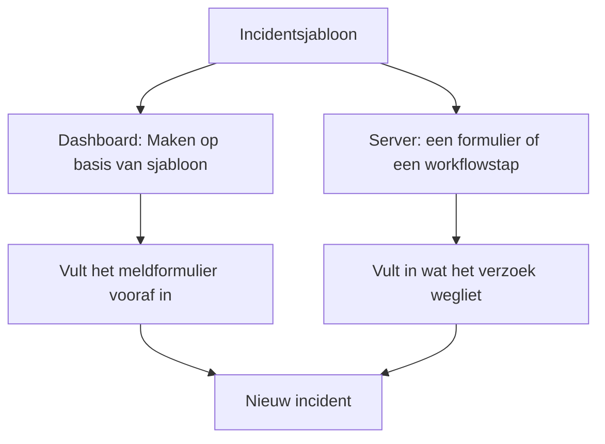
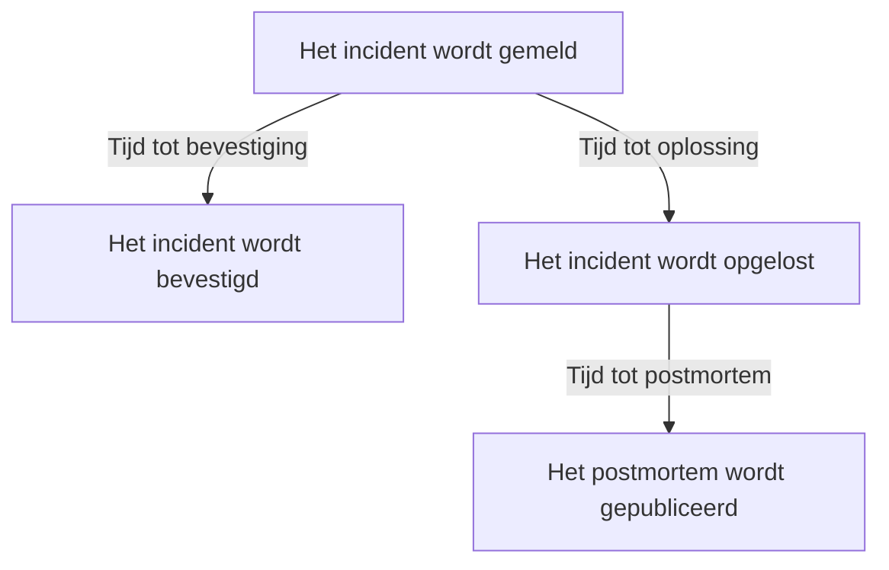

# Incidentinstellingen en automatisering

De incidentconfiguratie staat onder **Incidenten**, niet onder **Projectinstellingen**: de statussen en ernstniveaus, sjablonen, aangepaste velden, rollen, metingen en nummervoorvoegsels, en de regels die op elk nieuw incident werken. Deze pagina is het naslagwerk voor elk van die pagina's, en voor wat er vanzelf draait op het moment dat een incident wordt gemeld.

:::cards
- [Incidentsjablonen](#incidentsjablonen): Meld elke keer hetzelfde soort incident, vooraf ingevuld.
- [Aangepaste velden](#aangepaste-velden): Je eigen velden op elk incident, gevraagd als het wordt gemeld.
- [Metingen](#metingen): De tijd tot bevestigen, oplossen of mitigeren, berekend voor elk incident.
- [Regels](#regels-die-draaien-als-een-incident-wordt-aangemaakt): Eigenaren, labels, oproepen en episodes, automatisch ingesteld.
:::

## Waar de incidentinstellingen staan

Open **Incidenten** vanuit het menu **Producten** in de bovenbalk en klap dan **Instellingen** onderaan het zijmenu uit. **Regels** en **Instellingen** beginnen allebei ingeklapt, dus klap ze uit voordat de pagina's hieronder verschijnen. Alles hier hoort bij het project: sjablonen, rollen, aangepaste velden en regels horen bij één project en gelden voor elk incident dat erin wordt gemeld, op routes die beginnen met `/dashboard/{projectId}/incidents/settings/`.

| Pagina                       | Wat je daar doet                                                                             |
| ---------------------------- | -------------------------------------------------------------------------------------------- |
| **Status incident**          | De statussen waar een incident doorheen gaat toevoegen, hernoemen, een andere kleur geven en anders ordenen. |
| **Ernst van incident**       | Ernstniveaus toevoegen, hernoemen, een andere kleur geven en anders ordenen.                 |
| **Incident-sjablonen**       | Een heel incident vooraf invullen — titel, beschrijving, middelen, bereikbaarheidsbeleid, eigenaren, labels. |
| **Notitie-sjablonen**        | Herbruikbare tekst voor openbare en privénotities.                                           |
| **Postmortem-sjablonen**     | Herbruikbare structuren voor postmortems.                                                    |
| **Aangepaste velden**        | Extra velden definiëren die op elk incident verschijnen.                                     |
| **Incidentrollen**           | De rollen definiëren waaraan je responders toewijst, zoals Incident Commander.               |
| **Metingen**                 | Meten hoe lang dingen duren, zoals de tijd tot bevestiging of tot oplossing, op elk incident. |
| **Gekoppelde waarschuwingen** | Kiezen of de waarschuwingen die aan een incident gekoppeld zijn, samen met het incident worden bevestigd en opgelost. Beide staan aan in nieuwe projecten. |
| **Nummervoorvoegsel**        | De tekst vóór incident- en episodenummers, zoals `INC-` in `INC-42`.                         |

Wat OneUptime AI zelf doet, stel je hier niet in: daarvoor is er een eigen sectie, **Incidenten → AI**, op routes die beginnen met `/dashboard/{projectId}/incidents/ai/`. De pagina **Instellingen** daarvan zet het onderzoeken van nieuwe incidenten aan of uit, het automatisch herstellen ervan (uit tot je het aanzet), met de pull requests voor fixes en voor ontbrekende telemetrie die bij het herstellen horen eronder gegroepeerd, en het schrijven van concepten voor postmortems, en elke instelling wordt opgeslagen zodra je haar omzet; de onderzoeksregels en de regels voor automatisch herstel die beperken welke incidenten worden onderzocht en hersteld, en de optionele limieten waaronder AI werkt, zijn ingeklapt onder **Meer instellingen**, en geen ervan geldt tot je het instelt. **Inzichten** en **Logboeken** staan ernaast: wat AI van je incidenten heeft geleerd, en alles wat het deed. Zie [AI SRE](/docs/ai/ai-sre).

**Status incident** en **Ernst van incident** worden uitgebreid behandeld in [Incidentstatussen en ernstniveaus](/docs/incidents/states-and-severities) — de rest van deze pagina gaat verder vanaf **Incident-sjablonen**. Formulieren waarmee mensen buiten je team incidenten melden, zijn een eigen product: zie [Formulieren](/docs/forms/index). Tools die zelf incidenten openen, zoals [Huntress](/docs/integrations/huntress), stel je in onder **Incidenten → Integraties**.

Klap **Regels** uit en je krijgt nog acht pagina's: **Groeperingsregels**, **Bereikbaarheidsregels**, **Eigenaarsregels**, **Runbook-regels**, **Privacyregels**, **Labelregels**, **SLA-regels** en **Reminder Rules**. Die worden verderop behandeld.

## Incidentsjablonen

Een incidentsjabloon is het opgeslagen geraamte van een incident. In plaats van elke keer dat het betalingscluster hapert dezelfde titel, dezelfde lijst met monitoren en hetzelfde bereikbaarheidsbeleid opnieuw te typen, sla je het één keer op en meld je ermee.

:::steps
1. Ga naar **Incidenten → Instellingen → Incident-sjablonen** (`/dashboard/{projectId}/incidents/settings/templates`). De kaart heet **Incident-sjablonen**.
2. Klik op **Incident Sjabloon aanmaken**. Geef het sjabloon een naam op **Sjablooninformatie** en vul daarna op **Incidentdetails** het incident in dat het meldt: een **Titel**, een **Ernst van incident** en een **Beschrijving**.
3. Druk door de optionele stappen op **Volgende** — de middelen die het treft, de aangepaste velden en het bereikbaarheidsbeleid — en vul in wat elk incident van deze soort gemeen heeft.
4. Klik op de laatste stap op **Incident Sjabloon aanmaken**. Vanaf nu wordt het sjabloon aangeboden door **Maken op basis van sjabloon** in de incidentenlijst.
:::

Het aanmaken leidt je door een wizard van vier stappen, met nog twee stappen als je project aangepaste incidentvelden heeft. Alleen de eerste twee vragen om iets wat je moet beantwoorden: **Volgende** loopt de optionele stappen daarna door, en **Incident Sjabloon aanmaken** staat op de laatste stap.

- **Sjablooninformatie** — **Sjabloonnaam** en **Sjabloonbeschrijving**. Die geven het sjabloon zelf een naam; ze verschijnen nooit op het incident.
- **Incidentdetails** — **Titel**, **Beschrijving** (Markdown) en **Ernst van incident**. Onder **Meer velden**, waarvan de ingeklapte kop de drie noemt en elk toont dat is ingesteld:
  - **Initiële incidentstatus** — de status waarin incidenten die vanuit het sjabloon worden gemeld, beginnen. Hij begint leeg, zoals op het meldformulier, en de opties staan in de volgorde van de statussen. Laat je hem leeg, zoals de voorbeeldtekst zegt, dan beginnen ze in de gebruikelijke beginstatus: de aanmaakstatus van het project, waarin elk nieuw incident begint. Een sjabloon dat met een status is opgeslagen, houdt die.
  - **Eigenaren** — de mensen en teams die eigenaar zijn van incidenten die vanuit het sjabloon worden gemeld. **Eigenaar toevoegen** opent één lijst met beide, dezelfde lijst als de pagina **Eigenaren** van een incident; elke keuze verschijnt als een label dat je kunt verwijderen. Een bestaand sjabloon toont ze op een kaart **Eigenaren**.
  - **Labels** — de labels waarmee incidenten die vanuit het sjabloon worden gemeld, beginnen.
- **Getroffen middelen** — zoals op het meldformulier: **Monitoren**, dan **Monitorstatus wijzigen naar**, dan **Andere getroffen resources** voor de hosts, clusters en services, met **Beperken tot deze statuspagina's** onder **Meer velden**. Een sjabloon vraagt altijd om **Monitorstatus wijzigen naar**, of er nu monitoren zijn gekozen of niet: het geldt ook voor de monitoren die worden gekozen als een incident vanuit het sjabloon wordt gemeld, waar het meldformulier het toont zodra de eerste monitor is gekozen. De kaart **Getroffen resources** van een bestaand sjabloon vraagt op dezelfde manier, en toont de status die het sjabloon kiest, of **Monitoren behouden hun status.** als het er geen kiest. **Beperken tot deze statuspagina's** beperkt incidenten die vanuit het sjabloon worden gemeld tot enkele van de statuspagina's die hun monitoren tonen — een sjabloon `Region East outage` kan de pagina's van de locatie Oost meenemen. Een bestaand sjabloon toont dit op een kaart **Bereik van statuspagina's**, met **Bereik van statuspagina's bewerken**. Zie [Eén statuspagina per doelgroep](/docs/status-pages/one-status-page-per-audience).
- **Aangepaste velden** — alleen als je project aangepaste incidentvelden heeft: de waarden waarmee incidenten die vanuit dit sjabloon worden gemeld, beginnen. Hier wordt elk veld aangeboden, niet alleen de velden waar de stap **Details** naar vraagt, en geen enkel veld is verplicht. Een bestaand sjabloon heeft een kaart **Aangepaste velden** om ze te wijzigen.
- **Aangepaste velden bij aanmaken** — ook alleen als je project aangepaste incidentvelden heeft: naar welke ervan de stap **Details** vraagt als een incident vanuit dit sjabloon wordt gemeld, en welke moeten worden ingevuld. Een bestaand sjabloon heeft een kaart **Aangepaste velden bij aanmaken** om ze te wijzigen. Zie [Aangepaste velden bij aanmaken](#aangepaste-velden-bij-aanmaken).
- **Bereikbaarheid** — **Bereikbaarheidsbeleid**, het beleid dat wordt uitgevoerd als een incident dat vanuit dit sjabloon is aangemaakt, wordt gemeld.

Een paar korte regels:

- De sjablonenlijst toont alleen **Naam** en **Beschrijving**. Rijen kunnen vanuit de lijst niet worden bewerkt of verwijderd — open een sjabloon (`/dashboard/{projectId}/incidents/settings/templates/{modelId}`) om het te wijzigen.
- Iedereen die een sjabloon kan bewerken, kan de details en de getroffen middelen ervan wijzigen, **Initiële incidentstatus** en **Monitorstatus wijzigen naar** inbegrepen: Project Owners, Project Admins en Project Members, Incident Admins en Incident Members, en een rol met **Edit Incident Template**.
- Sjablonen ondersteunen import en export in JSON, zodat je er een van het ene project naar het andere kunt verplaatsen.
- Zonder sjablonen zegt de lijst **Geen incidentsjablonen gevonden** met **Incident Sjabloon aanmaken** er direct onder.
- Ook zonder sjablonen opent **Maken op basis van sjabloon** in de incidentenlijst een dialoogvenster **No Incident Templates** dat zegt waar sjablonen worden gemaakt, en de knop **Create Template** ervan opent **Incidenten → Instellingen → Incident-sjablonen**.

### Hoe een sjabloon wordt toegepast

Er zijn twee routes, en ze voegen op dezelfde manier samen.



- **In het dashboard** — de knop **Maken op basis van sjabloon** in de incidentenlijst opent een kiezer **Selecteer incidentsjabloon**, en de meldpagina leest het sjabloon uit de queryparameter `incidentTemplateId` en vult het formulier daarna vooraf in met het sjabloon plus de teams en gebruikers die er eigenaar van zijn. De stap **Details** volgt de [aangepaste velden bij aanmaken](#aangepaste-velden-bij-aanmaken) van het sjabloon. De eigenaren worden eigenaar van het incident zonder melding, zodra de Slack- en Microsoft Teams-kanalen van het incident bestaan, zodat een meldingsregel die de eigenaren van een incident in een nieuw kanaal uitnodigt, hen ook uitnodigt.
- **Op de server** — een [formulier](/docs/forms/on-submit#the-incident-template) dat een **Incident Sjabloon** heeft, en de stap **Create One Incident** van een workflow met een gekozen **Incident Template**, melden het incident op de server vanuit het sjabloon. De stap leest het sjabloon als Project Admin van het project van de workflow, dus een sjabloon uit een ander project, of een dat is verwijderd, wordt geweigerd, en bij een abonnement zonder incidentsjablonen wordt de stap geweigerd met het abonnement dat ervoor nodig is. De eigenaren van het sjabloon worden eigenaar van het incident, zoals in het dashboard. Zie [Workflow-componenten](/docs/workflows/components).

Een incident dat op de server wordt gemeld, legt het sjabloon vast in `createdIncidentTemplateId`. Alleen OneUptime zet die kolom, voor een formulier of een workflowstap die een sjabloon noemt: een API-sleutel of een aangemelde gebruiker kan dat niet, en een verzoek dat `createdIncidentTemplateId` meestuurt, wordt geweigerd. Om via de API vanuit een sjabloon te melden, lees je het uit `/api/incident-templates` en stuur je de waarden ervan mee in het verzoek.

> [!IMPORTANT]
> Het belangrijke deel is de samenvoegregel: **een sjabloon vult alleen een veld in dat je niet hebt ingesteld**. Titel, beschrijving, incidenternst, initiële incidentstatus, de monitorstatus achter **Monitorstatus wijzigen naar**, monitoren, hosts, Kubernetes-clusters, Docker-hosts, Podman-hosts, services, bereikbaarheidsbeleid, labels en statuspagina's worden alleen uit het sjabloon gekopieerd als de aanroeper of het formulier niets meegaf. Wat je expliciet instelt, wint altijd, ook een status: een incident dat zijn status noemt, begint daarin en neemt nog steeds al het andere uit het sjabloon, zoals in het dashboard. Waarden van aangepaste velden worden veld voor veld samengevoegd: het sjabloon vult de velden in waarmee het incident zonder waarde werd gemeld, en een waarde die jij instelt — `0`, `false` en `null` inbegrepen — wint van die van het sjabloon.

### Aangepaste velden bij aanmaken

De instellingen van het project bepalen waar de stap **Details** om vraagt als een incident wordt gemeld: **Tonen bij aanmaken** vraagt om een veld, en **Verplicht bij aanmaken** maakt het verplicht. Een sjabloon kan beide wijzigen voor de incidenten die ermee worden gemeld. De kaart **Aangepaste velden bij aanmaken** — en de wizardstap met dezelfde naam — toont elk aangepast incidentveld in zijn **Volgorde**, met één instelling per veld:

| Instelling       | Als een incident vanuit dit sjabloon wordt gemeld                                                                                  |
| ---------------- | ---------------------------------------------------------------------------------------------------------------------------------- |
| **Standaard**    | Het veld volgt zijn eigen **Tonen bij aanmaken** en **Verplicht bij aanmaken**. De optie zegt welke, zoals **Standaard (Verplicht)**. |
| **Verplicht**    | De stap **Details** vraagt om het veld, en het moet worden ingevuld. Een ja/nee-veld moet aanstaan.                                |
| **Optioneel**    | De stap vraagt om het veld, en het mag leeg blijven — ook als het project het verplicht stelt.                                     |
| **Verborgen**    | De stap vraagt niet om het veld, ook als het project het toont of verplicht stelt. De eigen waarde van het sjabloon ervoor wordt nog steeds toegepast. |

Op de kaart toont een veld dat het sjabloon op **Verplicht**, **Optioneel** of **Verborgen** zet, onder zijn type ook wat het project ermee doet: **Projectstandaard: Verplicht**, **Projectstandaard: Optioneel** of **Projectstandaard: Niet getoond**. Iedereen die het sjabloon kan zien, ziet dat.

Gebruik het als de incidenten van één sjabloon een antwoord nodig hebben dat andere niet nodig hebben — een klantniveau op een sjabloon `Customer data exposure` bijvoorbeeld — of om een vraag die het project overal stelt, weg te houden uit een sjabloon waar ze niet past.

- **Opgeslagen per sjabloonvariabele.** Elke instelling wordt opgeslagen onder de **Sjabloonvariabele** van het veld, die nooit verandert, dus een veld hernoemen houdt zijn instelling. Een veld dat wordt verwijderd en met dezelfde naam opnieuw wordt aangemaakt, krijgt zijn instelling terug — anders dan de vragen van een formulier, die een veld bij zijn ID noemen, zodat naar een veld dat is verwijderd en opnieuw aangemaakt niet wordt gevraagd tot het opnieuw is toegevoegd.
- **Bewerken en Opslaan lezen ze opnieuw.** **Bewerken** op de kaart leest de velden en de instellingen van het sjabloon opnieuw, met een laadindicator in het dialoogvenster ondertussen, en **Opslaan** leest ze nog eens en schrijft alleen de velden die je erin hebt gewijzigd. Zo blijft een wijziging die een andere beheerder intussen aan andere velden maakte, behouden — ook een instelling die die beheerder gaf aan een veld dat werd aangemaakt terwijl je dialoogvenster openstond — en wordt een wijziging die jij maakte aan een veld dat intussen werd verwijderd, niet geschreven. De kaart toont de velden daarna zoals ze zijn. Kunnen ze niet worden gelezen als je op **Bewerken** drukt, dan zegt het dialoogvenster waarom en biedt het **Opnieuw proberen** aan in plaats van **Opslaan**; druk je op **Opslaan**, dan zegt het waarom, slaat het niets op en houdt het je keuzes.
- **Alleen het dashboard past ze toe.** Net als **Verplicht bij aanmaken** geven de instellingen vorm aan het formulier **Incident melden** en aan niets anders. Incidenten die via de API, door een workflow, een monitor, Slack, Microsoft Teams of AI worden gemeld, zijn er niet aan gebonden, en [formulieren](/docs/forms/building) stellen hun eigen vragen. Zie [Verplicht bij aanmaken wordt alleen door het dashboard gecontroleerd](#verplicht-bij-aanmaken-wordt-alleen-door-het-dashboard-gecontroleerd).
- **Naar een veld dat uit een aangepast monitorveld wordt gekopieerd**, wordt nog steeds niet gevraagd zodra het incident een monitor heeft, wat het sjabloon ook zegt.
- **Iedereen die incidentsjablonen kan bewerken, kan ze wijzigen** — Project Members en Incident Members inbegrepen — ook voor een veld dat een Project Admin voor het hele project **Verplicht bij aanmaken** heeft gemaakt. De instellingen voor het hele project zelf vragen een Project Owner, een Project Admin of de machtiging **Edit Incident Custom Field**.
- **Ze reizen mee met het sjabloon.** De JSON-export van een sjabloon bevat ze, en in het project waarin je het importeert, gelden ze voor de velden met dezelfde **Sjabloonvariabele**.

Via de API zijn het de `customFieldSettings` van het sjabloon: een object met de **Sjabloonvariabele** van elk veld als sleutel, met `Required`, `Optional`, `Hidden` of `Default` voor elk veld.

```json title="customFieldSettings"
{
  "customFieldSettings": {
    "impact": "Required",
    "affected_location": "Optional",
    "additional_information": "Hidden"
  }
}
```

Een veld dat niet in de lijst staat, volgt zijn eigen instellingen, zoals bij `Default`. Een verzoek wordt geweigerd met een fout `400` als een sleutel geen geldige **Sjabloonvariabele** is — kleine letters, cijfers en underscores — of een waarde niet een van de vier is. Een sleutel die bij geen enkel veld hoort, blijft behouden, en wordt genegeerd.

## Notitiesjablonen

Notitiesjablonen geven responders kant-en-klare tekst voor incidentupdates, zodat een update van de statuspagina om drie uur 's nachts niet vanaf nul wordt geschreven door iemand die half slaapt.

:::steps
1. Ga naar **Incidenten → Instellingen → Notitie-sjablonen** (`/dashboard/{projectId}/incidents/settings/note-templates`). De kaart heet **Openbare of privénotitiesjablonen voor incidenten** — één bibliotheek dient voor beide soorten notities.
2. Klik op **Incident Notitie Sjabloon aanmaken** en vul de ene pagina in: **Sjabloonnaam** en **Sjabloonbeschrijving**, allebei verplicht, en dan de **Notitie** zelf, in Markdown, verplicht: de tekst waarmee een notitie begint als het sjabloon wordt gekozen.
3. Sla het op. Het sjabloon wordt aangeboden door **Sjablonen** op beide notitiepagina's, en door **Selecteer notitiesjabloon** in de dialoogvensters **Incident bevestigen** en **Incident oplossen**.
:::

Net als bij incidentsjablonen worden rijen aangemaakt en bekeken in plaats van in de lijst bewerkt; open een sjabloon om het te wijzigen.

**Variabelen.** Een notitiesjabloon kan variabelen bevatten die met de waarden van het incident worden ingevuld als het sjabloon wordt gekozen, zodat de schrijver de afgewerkte tekst ziet — en nog kan wijzigen — voordat hij haar plaatst:

| Variabele                           | Ingevuld met                                                       |
| ----------------------------------- | ------------------------------------------------------------------ |
| `{{incident.title}}`                | De titel van het incident.                                         |
| `{{incident.number}}`               | Het nummer, bijvoorbeeld `INC-42` of `#42`.                        |
| `{{incident.severity}}`             | De ernst.                                                          |
| `{{incident.state}}`                | De huidige status.                                                 |
| `{{incident.startedAt}}`            | Wanneer het werd gemeld, in de tijdzone van de schrijver, met de tijdzone erbij. |
| `{{incident.labels}}`               | De labels, gescheiden door komma's.                                |
| `{{incident.affectedStatusPages}}`  | De statuspagina's waarop het verschijnt en die het een melding stuurt, die de schrijver kan zien. |
| `{{incident.customFields.<key>}}`   | De waarde van een aangepast veld, via de **Sjabloonvariabele** van het veld, die de editor **Notitie** onder **Sjabloonvariabelen** toont bij de naam van het veld. |

Aangepaste velden werden vroeger geschreven als `{{customFields.<key>}}`; sjablonen die dat nog gebruiken, worden op dezelfde manier ingevuld. Een variabele die geen waarde heeft, of die niet in de lijst staat, blijft precies zoals ze is geschreven, zodat de schrijver haar kan invullen. Waarden worden als tekst ingevoegd: de titel van een incident kan in de geplaatste notitie geen afbeelding, HTML of link worden waarvan de tekst verbergt waar hij heen gaat, al verschijnt een adres erin nog steeds als link naar dat adres. Een aangepast veld **Opgemaakte tekst (Markdown)** wordt ingevoegd als de Markdown die het is.

> [!IMPORTANT]
> De variabelen voor aangepaste velden, labels en statuspagina's vullen de eigen gegevens van je team in, elk aangepast veld, of het nu is gemarkeerd met **Opnemen in meldingen aan abonnees** of niet, en één bibliotheek dient ook voor openbare notities, die op de statuspagina's van het incident worden getoond en naar hun abonnees worden gemaild. Lees de ingevulde tekst voordat je een openbare notitie plaatst.

**Een variabele invoegen.** Je hoeft de naam van een variabele nooit te typen. De editor **Notitie** biedt de variabelen op drie manieren aan, en elke manier zet de variabele waar de cursor staat:

- **Sjabloonvariabelen**, ingeklapt onder de editor: open het om elke variabele te zien met waarmee ze wordt ingevuld — de aangepaste incidentvelden van het project bij naam — en klik op een variabele.
- **Variabele invoegen**, aan het eind van de werkbalk van de editor: dezelfde lijst, met een zoekvak.
- `{{` typen in de notitie opent de lijst onder de cursor. Typ verder om haar in te perken, kies met de pijltjestoetsen en druk op Enter of Tab om de variabele in te voegen; Escape sluit de lijst.

Dezelfde lijst, knop en `{{` komen mee met de andere sjablonen die variabelen hebben: de notitieherinneringen van een SLA-regel, de titel en de beschrijving van de episode van een groeperingsregel voor incidenten of waarschuwingen, de incident- en waarschuwingsbeschrijving en de herstelnotities van een monitorregel, de sjablonen van een regel voor de verbruikssnelheid van een SLO en de aangepaste meldingssjablonen voor abonnees van een statuspagina.

Notitiesjablonen verschijnen waar je ze echt nodig hebt: de bevestigingsdialoogvensters **Incident bevestigen** en **Incident oplossen** bieden allebei **Selecteer notitiesjabloon** aan boven het veld **Openbare notitie**, ingeklapt onder **Openbare notitie toevoegen**. Zie [Incidentnotities, eigenaren en feed](/docs/incidents/notes-owners-and-feed) voor hoe openbare en privénotities verschillen.

## Postmortem-sjablonen

Een postmortem-sjabloon is het geraamte van het verslag dat je na een incident maakt — je koppen, je aanwijzingen, je vaste vragen — zodat elke evaluatie in het project dezelfde vorm volgt.

:::steps
1. Ga naar **Incidenten → Instellingen → Postmortem-sjablonen** (`/dashboard/{projectId}/incidents/settings/postmortem-templates`). De kaart heet **Postmortem-sjablonen**.
2. Klik op **Incident Postmortem Sjabloon aanmaken** en vul de ene pagina in: **Sjabloonnaam** en **Sjabloonbeschrijving**, allebei verplicht, en dan **Postmortem-sjabloon**, de tekst zelf, in Markdown, verplicht.
3. Sla het op. De pagina **Postmortem** van elk incident biedt nu **Sjabloon toepassen** aan.
:::

Je past er een toe vanuit het incident, niet vanuit de instellingen. Open een incident, kies **Postmortem** in het zijmenu (`/dashboard/{projectId}/incidents/{incidentId}/postmortem`), en gebruik **Sjabloon toepassen**. Dat opent een dialoogvenster **Postmortemsjabloon toepassen** met een vervolgkeuzelijst **Selecteer sjabloon**; er een kiezen laadt de tekst van het sjabloon in de editor **Postmortem-notitie**, waar je die bewerkt voordat je opslaat. Incidentepisodes hebben dezelfde pagina **Postmortem** en putten uit dezelfde sjablonenbibliotheek. **Sjabloon toepassen** wordt pas getoond zodra het project een postmortem-sjabloon heeft; is er maar één, dan is dat al gekozen. De editor opent op het postmortem van het incident zoals het is, met het sjabloon als notitie, dus of het op de statuspagina staat, wanneer het werd gepubliceerd en de bijlagen blijven zoals ze waren.

## Aangepaste velden

Met aangepaste velden neem je je eigen metadata mee op elk incident — de naam van een interne service, de referentie van een wijzigingsticket, een klantniveau — en stel je elke keer dat een incident wordt gemeld dezelfde vragen, zoals de impact en wanneer het naar verwachting is opgelost.

:::steps
1. Ga naar **Incidenten → Instellingen → Aangepaste velden** (`/dashboard/{projectId}/incidents/settings/custom-fields`). De pagina heet **Aangepaste incidentvelden** en toont de velden in hun **Volgorde**, elk alleen met zijn **Veldnaam** en **Veldtype**.
2. Klik op **Incident Aangepast Veld aanmaken** en vul de **Veldnaam**, de **Veldbeschrijving** en het **Veldtype** in — en, voor een type vervolgkeuzelijst, de opties, direct onder het type.
3. Om bij elke melding van een incident om het veld te vragen, open je **Meer velden** en zet je **Tonen bij aanmaken** aan, en **Verplicht bij aanmaken** als het moet worden beantwoord.
4. Sla het op en sleep de rij daarna aan haar greep naar waar het veld moet staan. **Bewerken** op de rij van een veld opent de rest van de instellingen ervan.
:::

Een veld aanmaken vraagt om de **Veldnaam**, de **Veldbeschrijving** en het **Veldtype** op één pagina — en, voor een type vervolgkeuzelijst, de opties, direct onder het type. De waarden van een nieuw veld worden getypt. Al het andere staat onder **Meer velden**, dat ingeklapt begint, of je nu een veld aanmaakt of bewerkt; ingeklapt noemt de kop wat erin zit en toont hij wat is ingesteld. Om een veld te maken dat zijn waarde uit een aangepast monitorveld kopieert, open je het menu **Meer** (**⋯**) naast **Incident Aangepast Veld aanmaken** en kies je **Gekoppeld aangepast veld aanmaken** — zie [Velden die uit een monitor worden gekopieerd](#velden-die-uit-een-monitor-worden-gekopieerd).

Elke definitie heeft:

- **Veldnaam** — verplicht, minstens twee tekens. De voorbeeldtekst stelt een naam in de vorm van een slug voor, zoals `internal-service`.
- **Veldbeschrijving** — optioneel.
- **Veldtype** — verplicht. Dit bepaalt hoe gegevens worden ingevoerd; de typen staan hieronder. Typen vervolgkeuzelijst hebben ook hun opties nodig.
- **Vervolgkeuzeopties** — de waarden die in de vervolgkeuzelijst verschijnen, elk met een optionele kleur: de kleine knop naast een optie toont haar kleur en opent dezelfde benoemde kleuren als elk ander kleurveld, met **Geen kleur** eerst en **Aangepaste kleur** voor een exacte code. Sleep een optie aan de greep aan het begin van haar rij om te wijzigen waar ze staat. Opties kunnen worden toegevoegd, hernoemd en weggehaald nadat incidenten waarden hebben; zie [De opties van een vervolgkeuzelijst wijzigen](#de-opties-van-een-vervolgkeuzelijst-wijzigen).
- **Volgorde** — waar het veld staat tussen de aangepaste velden van het incident: op de pagina **Aangepaste velden** van het incident, in de stap **Details** en in berichten aan abonnees. Er is geen getal om te typen: sleep een veld aan de greep aan het begin van zijn rij om het omhoog of omlaag te verplaatsen, en een nieuw veld wordt aan het eind toegevoegd. Slepen staat uit zolang een filter of zoekopdracht de lijst inperkt.
- **Tonen bij aanmaken** — onder **Meer velden**. Vraagt om het veld in de stap **Details** als een incident vanuit het dashboard wordt gemeld (zie [Een incident melden](/docs/incidents/declaring-incidents)). Een incidentsjabloon kan elk veld een beginwaarde geven, of het nu bij aanmaken wordt getoond of niet, en kan om een veld vragen of het weglaten voor de incidenten die ermee worden gemeld — zie [Aangepaste velden bij aanmaken](#aangepaste-velden-bij-aanmaken). [Formulieren](/docs/forms/building#custom-fields) volgen dit niet: een formulier vraagt alleen naar de velden die eraan zijn toegevoegd.
- **Verplicht bij aanmaken** — onder **Meer velden**, aangeboden zodra **Tonen bij aanmaken** aanstaat. De stap **Details** laat je het incident pas melden als het veld is ingevuld, en een veld **Booleaans** moet aanstaan. Het dashboard is de enige plek waar dit wordt gecontroleerd; zie [Verplicht bij aanmaken wordt alleen door het dashboard gecontroleerd](#verplicht-bij-aanmaken-wordt-alleen-door-het-dashboard-gecontroleerd).
- **Opnemen in meldingen aan abonnees** — onder **Meer velden**. Stuurt het veld en zijn waarde mee naar de abonnees van de statuspagina met de berichten van het incident: de standaardberichten per e-mail, in Slack en in Microsoft Teams en de webhooks, maar niet per sms. Abonnees staan meestal buiten je team, dus zet dit alleen aan voor velden die veilig gedeeld kunnen worden. Zie [Abonnees en aankondigingen](/docs/status-pages/subscribers#incidenten).
- **Sjabloonvariabele** — de sleutel waarmee een sjabloon het veld bereikt, `{{incident.customFields.<key>}}`, in notitiesjablonen en aangepaste meldingssjablonen voor abonnees. Hij wordt gevormd uit de naam van het veld als het veld wordt aangemaakt — kleine letters, cijfers en underscores, dus `Expected Resolution` wordt `expected_resolution`, met `_2`, `_3` enzovoort erachter als een ander veld de sleutel al heeft — en verandert niet als het veld wordt hernoemd. Niemand stelt hem met de hand in: de API negeert een waarde die ervoor wordt meegestuurd. Sjablonen die zijn geschreven met de oudere `{{customFields.<key>}}` blijven werken. Je hoeft hem nooit op te zoeken: de editors die hem invoegen — de **Notitie** van een notitiesjabloon en de aangepaste meldingssjablonen voor abonnees van een statuspagina voor incidentgebeurtenissen — tonen de variabele van elk veld onder **Sjabloonvariabelen**, bij de naam van het veld. Het formulier **Bewerken** van een veld toont hem ook, alleen-lezen, onderaan **Meer velden**, met een knop die hem kopieert.

**Volgorde**, **Tonen bij aanmaken**, **Verplicht bij aanmaken**, **Opnemen in meldingen aan abonnees** en **Sjabloonvariabele** bestaan alleen bij aangepaste incidentvelden. De aangepaste velden van monitoren, waarschuwingen, gepland-onderhoudsevenementen en de andere middelen hebben ze niet.

Definities staan in een eigen model; de waarden staan op het incident zelf, in de kolom `customFields`. Op een afzonderlijk incident vul je ze in vanuit **Aangepaste velden** in het zijmenu van het incident (`/dashboard/{projectId}/incidents/{incidentId}/custom-fields`), waar de velden in hun **Volgorde** staan. Incidentsjablonen houden waarden voor dezelfde velden bij in hun eigen `customFields`.

**Eén leemte die het weten waard is.** Definities van aangepaste incidentvelden zijn het enige deel van de incidentfamilie zonder workflow-triggers — zie de sectie over workflows hieronder.

### Veldtypen

| Veldtype                                   | Ingevoerd als                                         | Goed voor                                          |
| ------------------------------------------ | ----------------------------------------------------- | -------------------------------------------------- |
| **Tekst**                                  | Eén regel tekst                                       | De referentie van een wijzigingsticket, de naam van een interne service |
| **Nummer**                                 | Een getal                                             | Geschatte duur in minuten, getroffen gebruikers    |
| **Booleaans**                              | Een ja/nee-schakelaar                                 | Een bevestiging, "klantgericht"                    |
| **Vervolgkeuzelijst (enkele keuze)**       | Eén optie uit een lijst                               | Impact, regio                                      |
| **Vervolgkeuzelijst (meerdere keuzes)**    | Meerdere opties uit een lijst                         | Getroffen systemen                                 |
| **Datum**                                  | Een datum                                             | De datum waarop een contract wordt verlengd        |
| **Datum en tijd**                          | Een datum en een tijdstip                             | Verwachte oplossing                                |
| **Lange tekst**                            | Meerdere regels platte tekst                          | Getroffen gebruikers of systemen, aanvullende informatie |
| **Opgemaakte tekst (Markdown)**            | Opgemaakte tekst, in de Markdown-editor met zijn visuele modus | Een workaround met links en lijsten        |

**Lange tekst** en **Opgemaakte tekst (Markdown)** zijn beschikbaar voor de aangepaste velden van elk middel, niet alleen voor incidenten. Een waarde in opgemaakte tekst wordt opgeslagen als de Markdown waarin ze is geschreven. Er is geen type keuzerondjes of groep selectievakjes: gebruik een **Vervolgkeuzelijst (enkele keuze)**, een **Vervolgkeuzelijst (meerdere keuzes)** of een **Booleaans**.

### Verplicht bij aanmaken wordt alleen door het dashboard gecontroleerd

**Verplicht bij aanmaken** houdt het formulier **Incident melden** tegen, en verder niets. Incidenten die een monitor, de API, Slack, Microsoft Teams of AI opent, kunnen geen formulier invullen, dus ze worden aangemaakt met het veld leeg. Zodra een incident bestaat, blijft elk veld optioneel op de pagina **Aangepaste velden** ervan, zodat een responder die midden in een storing één waarde verbetert, nooit om alle andere wordt gevraagd. Zie het als een geheugensteun voor de mensen die incidenten melden, niet als een belofte dat elk incident een waarde heeft.

De [aangepaste velden bij aanmaken](#aangepaste-velden-bij-aanmaken) van een sjabloon zijn hetzelfde: ze geven vorm aan het formulier **Incident melden** en aan niets anders. [Formulieren](/docs/forms/building#required-questions) zijn de uitzondering, omdat de server de vragen **Verplicht** van een formulier controleert als het formulier wordt verstuurd.

### Velden die uit een monitor worden gekopieerd

Een aangepast veld kan zijn waarde halen uit een aangepast veld van de monitoren van het incident, in plaats van dat ze wordt getypt — een regio of een klantniveau dat je monitoren al vastleggen bijvoorbeeld. Om er een te maken, open je het menu **Meer** (**⋯**) naast **Incident Aangepast Veld aanmaken** en kies je **Gekoppeld aangepast veld aanmaken**. Het vraagt om drie dingen:

- **Monitorveld** — het aangepaste monitorveld dat wordt gekopieerd. Elk veld wordt aangeboden, elk met zijn type onder zijn naam. Het nieuwe veld krijgt dat type, en de opties van een vervolgkeuzelijst, zodat de twee altijd overeenkomen.
- **Veldnaam** — begint als de naam van het monitorveld, tot je een andere typt.
- **Veldbeschrijving** — optioneel.

De waarde wordt ingevuld als een incident met een monitor wordt aangemaakt, en bijgewerkt als de waarde van de monitor verandert. Hebben de monitoren van een incident verschillende waarden, dan blijft een veld met één waarde zoals het is en krijgt een veld met meerdere keuzes ze allemaal. Kopiëren wist nooit een waarde: een incident zonder monitor houdt wat erop is getypt, en de waarde van de monitor wissen laat de kopieën ongemoeid. De stap **Details** vraagt niet om een gekopieerd veld zodra het incident een monitor heeft.

Om de waarde van een bestaand veld uit een monitor te kopiëren, te wijzigen welk monitorveld het kopieert, of weer terug te gaan naar typen, open je **Bewerken** op de rij van het veld en gebruik je **Waarde overnemen van** onder **Meer velden**. Aangepaste velden van waarschuwingen en van gepland onderhoud kunnen op dezelfde manier uit hun monitoren kopiëren.

### Waarden van aangepaste velden via de API

Bij `POST /api/incident` en bij updates van een incident is `customFields` een object met de **Veldnaam** van elk veld als sleutel:

```json title="customFields"
{
  "customFields": {
    "Impact": "Major",
    "Estimated Duration": 90,
    "Acknowledgement": true,
    "Expected Resolution": "2026-10-01T14:30:00.000Z"
  }
}
```

Als een gebruiker of een API-sleutel een incident aanmaakt of bijwerkt, moet elke waarde die het verzoek instelt of wijzigt bij haar veld passen, anders wordt het verzoek geweigerd met een fout `400` die het veld en de meegestuurde waarde noemt:

| Veldtype                                                           | Accepteert                                                     |
| ------------------------------------------------------------------ | -------------------------------------------------------------- |
| **Tekst**, **Lange tekst**, **Opgemaakte tekst (Markdown)**        | Tekst. Een getal, `true` of `false` wordt opgeslagen zoals verstuurd. |
| **Nummer**                                                         | Een getal, of tekst die er een is, zoals `"42"`.               |
| **Booleaans**                                                      | `true` of `false`, of de tekst `"true"` of `"false"`.          |
| **Datum**, **Datum en tijd**                                       | Een datum, bij voorkeur als ISO 8601-tekst.                    |
| **Vervolgkeuzelijst (enkele keuze)**                               | Een van zijn opties.                                           |
| **Vervolgkeuzelijst (meerdere keuzes)**                            | Een lijst van zijn opties, of één optie op zichzelf.           |

Bij een **Vervolgkeuzelijst (meerdere keuzes)** noemt de weigering de eerste 10 items die niet bij de opties horen, en daarna hoeveel er nog meer zijn.

Wat niet wordt gecontroleerd, zodat bestaande integraties blijven werken:

- **Waarden die het verzoek laat zoals ze zijn.** De kaart **Aangepaste velden** stuurt alle waarden terug als je er een opslaat, dus een waarde die werd opgeslagen voordat deze controles bestonden, of een optie van een vervolgkeuzelijst die sindsdien is verwijderd, houdt je nooit tegen om de andere op te slaan. Een veld met meerdere keuzes houdt de items die het al had.
- **Sleutels die niet de naam van een aangepast incidentveld zijn**, zoals de `jiraIssueKey` die de [Jira-integratie](/docs/integrations/jira) schrijft.
- **Lege waarden.** `null` of een lege string wist een veld.
- **Waarden die uit een aangepast monitorveld worden gekopieerd**, en schrijfacties die OneUptime zelf doet.
- **Verplicht bij aanmaken.** De API vraagt nooit om een veld.

Een incident dat een formulier of de stap **Create One Incident** van een workflow vanuit een sjabloon meldt (`createdIncidentTemplateId`), begint met de waarden van de aangepaste velden van het sjabloon, veld voor veld samengevoegd onder de waarden die het meestuurt (zie [Hoe een sjabloon wordt toegepast](#hoe-een-sjabloon-wordt-toegepast)). Een API-sleutel kan niet vanuit een sjabloon melden: een verzoek dat `createdIncidentTemplateId` meestuurt, wordt geweigerd.

### Een veld hernoemen

Waarden worden opgeslagen onder de naam van het veld, dus een veld hernoemen moet ze verplaatsen. Als je een nieuwe **Veldnaam** opslaat, verplaatst OneUptime de waarde van het veld naar de nieuwe naam op elk incident en elk incidentsjabloon in het project, en werkt het de opgeslagen weergaven van de incidentenlijst bij die het veld tonen of erop filteren. Het verplaatsen start geen workflow **On Update Incident**, en verandert het tijdstip van de laatste update van geen enkel incident. De **Sjabloonvariabele** van het veld blijft zoals ze was, dus notitiesjablonen, aangepaste meldingssjablonen voor abonnees en webhook-integraties die haar gebruiken, blijven werken.

Twee hernoemingen worden geweigerd: een naar een naam die een ander aangepast incidentveld al heeft (vergeleken zonder op hoofdletters te letten), en een API-verzoek dat meerdere velden tegelijk zou hernoemen. Workflows en API-clients die een waarde lezen of schrijven bij de oude naam van het veld, moeten worden omgezet naar de nieuwe.

Na een hernoeming bevat het veld alleen zijn eigen waarden. Een veld verwijderen laat zijn waarden achter op de incidenten die ze hadden, dus incidenten kunnen onder de nieuwe naam nog waarden hebben van een veld dat werd verwijderd; de hernoeming wist die, in plaats van ze als antwoorden van dit veld te tonen of naar abonnees te sturen. Elk incident en sjabloon verhuist samen: mislukt het verplaatsen, dan verandert geen ervan, houdt het veld zijn oude naam en meldt het opslaan een fout, zodat je het gewoon opnieuw kunt proberen. Een veld dat wordt **aangemaakt** met de naam van een verwijderd veld, is anders: het toont de waarden die dat veld achterliet, en stuurt ze naar abonnees zodra **Opnemen in meldingen aan abonnees** aanstaat.

Een veld verwijderen laat de vragen ernaar in elk [formulier](/docs/forms/building#custom-fields) van het project staan, maar ze worden niet meer gesteld: de formulierbouwer markeert elke vraag zodat je haar kunt verwijderen. Een veld dat met dezelfde naam opnieuw wordt aangemaakt, is een nieuw veld, en er wordt in een formulier niet naar gevraagd tot iemand het daar toevoegt. Incidentsjablonen houden hun instelling **Aangepaste velden bij aanmaken** ervoor.

### De opties van een vervolgkeuzelijst wijzigen

De opties van een veld **Vervolgkeuzelijst (enkele keuze)** of **Vervolgkeuzelijst (meerdere keuzes)** kunnen op elk moment worden gewijzigd: open **Bewerken** op de rij van het veld. Een incident slaat de tekst op van de optie die het kreeg, dus wat een wijziging doet met de incidenten die een optie hebben, hangt af van de wijziging:

| Wat je met een optie doet                | Wat er gebeurt met de incidenten die haar hebben                                                                   |
| ---------------------------------------- | ------------------------------------------------------------------------------------------------------------------ |
| Er een **toevoegen**                     | Niets. Ze wordt vanaf nu aangeboden.                                                                               |
| Haar **hernoemen** (de tekst wijzigen)   | Ze tonen de nieuwe naam. Onder de optie zegt het formulier bij hoeveel incidenten dat gebeurt.                     |
| Haar **weghalen** (de prullenbak ernaast) | Ze houden haar, getoond als _geen optie meer_, tenzij je onder **Geen opties meer** een andere optie voor ze kiest. |
| Haar aan de greep **slepen**             | Niets. Alleen de volgorde waarin de opties staan, verandert.                                                       |

Als het formulier opent, telt het hoeveel incidenten elke waarde hebben. **Geen opties meer** noemt elke optie die je weghaalt en die een incident nog heeft, en elke waarde die incidenten hebben en die nooit een optie was (een die via de API is geschreven bijvoorbeeld), elk met hoeveel incidenten haar hebben. Houd elke waarde zoals ze is of kies de optie die die incidenten in plaats daarvan moeten hebben. **Ongedaan maken** zet een optie terug die je per ongeluk weghaalde.

Als je opslaat, worden een hernoemde optie en een waarde waarvoor je een optie kiest verplaatst: op elk incident en incidentsjabloon in het project, in de opgeslagen weergaven van de incidentenlijst die erop filteren, en in de antwoorden die [formuliersjablonen](/docs/forms/building) voor het veld geven. Net als bij een hernoemd veld start het verplaatsen geen workflow **On Update Incident** en verandert het het tijdstip van de laatste update van geen enkel incident; mislukt het, dan verplaatst er niets en houdt het veld zijn oude opties. Workflows, API-clients en Terraform-configuraties die een optie bij de oude tekst schrijven, hebben de nieuwe tekst nodig.

Een incident waarvan de waarde niet meer door zijn veld wordt aangeboden, toont de waarde, gemarkeerd als _geen optie meer_, op zijn pagina **Aangepaste velden** en in de incidentenlijst. Zijn andere velden bewerken houdt haar; kies een andere optie om haar te wijzigen.

De aangepaste velden van alle andere middelen werken op dezelfde manier: monitoren, waarschuwingen, gepland-onderhoudsevenementen, statuspagina's, bereikbaarheidsbeleid, teams, teamleden en inventarisitems. Een optie van een monitorveld hernoemen, of er een toevoegen, doet hetzelfde bij de incident-, waarschuwings- en gepland-onderhoudsvelden die het kopiëren (zie [Velden die uit een monitor worden gekopieerd](#velden-die-uit-een-monitor-worden-gekopieerd)), zodat die elke waarde blijven aanbieden die ze kopiëren.

Stuur via de API de nieuwe lijst als `dropdownOptions`, en de hernoemingen in `miscDataProps`:

```json
{
  "data": { "dropdownOptions": "Facility Alpha\nFacility B" },
  "miscDataProps": {
    "renamedDropdownOptions": [{ "from": "Facility A", "to": "Facility Alpha" }]
  }
}
```

Elke `to` moet na het opslaan een van de opties van het veld zijn, en elke `from` kan maar één keer worden hernoemd. Zonder `renamedDropdownOptions` verandert de lijst en blijft elke opgeslagen waarde zoals ze is, wat ook gebeurt als je `dropdown_options` in Terraform wijzigt.

### Terraform

De instellingen staan op de resource `oneuptime_incident_custom_field` als `sort_order`, `show_on_create`, `is_required_on_create` en `include_in_subscriber_notifications`. `variable_key` is alleen-lezen: de sleutel die OneUptime vormde toen het veld werd aangemaakt.

Laat `sort_order` weg en een nieuw veld komt aan het eind van de lijst. Geef het het getal dat een ander veld al heeft en het neemt die plek in, terwijl de velden die in de weg staan een plek opschuiven. Een getal dat geen ander veld heeft, blijft zoals je het schreef.

## Metingen

Een meting is de tijd tussen twee momenten in een incident. De **tijd tot bevestiging** is de tijd vanaf het moment dat een incident wordt gemeld tot iemand het bevestigt; de **tijd tot oplossing** loopt van het melden tot het oplossen. Je stelt een meting één keer in, en OneUptime berekent haar voor elk incident, ook voor eerdere incidenten, en zet haar in een grafiek, zodat je kunt zien of je team sneller wordt.

Ga naar **Incidenten → Instellingen → Metingen** (`/dashboard/{projectId}/incidents/settings/measurements`) en kies **Incident Measurement aanmaken**. Elke definitie heeft een **naam**, een **beginpunt** en een **eindpunt**. De blijvende **sleutel** wordt gevormd uit de naam terwijl je die typt — "Time to Detect" krijgt `time-to-detect` — dus er is niets in te vullen. Om zelf een sleutel te kiezen, kies je **Bewerken** ernaast voordat je de meting aanmaakt.



Waarschuwingen en gepland-onderhoudsevenementen hebben dezelfde functie, onder **Waarschuwingen → Instellingen → Metingen** en **Geplande onderhoud → Instellingen → Metingen**. Alles hieronder geldt voor alle drie, elk met zijn eigen momenten.

### Kant-en-klare metingen

Het formulier opent op **Wat wilt u meten?**. Kies een van deze en de naam, de beschrijving en beide momenten ervan worden ingevuld: **Volgende** toont de momenten, en de meting wordt vanaf die laatste stap aangemaakt.

| Waar                      | Meting                                 | Begint wanneer                                    | Eindigt wanneer                        |
| ------------------------- | -------------------------------------- | ------------------------------------------------- | -------------------------------------- |
| Incidenten                | **Tijd tot bevestiging**               | Het incident wordt gemeld                         | Het incident wordt bevestigd           |
| Incidenten                | **Tijd tot oplossing**                 | Het incident wordt gemeld                         | Het incident wordt opgelost            |
| Incidenten                | **Tijd tot postmortem**                | Het incident wordt opgelost                       | Het postmortem wordt gepubliceerd      |
| Waarschuwingen            | **Tijd tot bevestiging**               | De waarschuwing wordt aangemaakt                  | De waarschuwing wordt bevestigd        |
| Waarschuwingen            | **Tijd tot oplossing**                 | De waarschuwing wordt aangemaakt                  | De waarschuwing wordt opgelost         |
| Gepland onderhoud         | **Vertraagde start**                   | Het onderhoud moet volgens planning beginnen      | Het onderhoud begint                   |
| Gepland onderhoud         | **Uitloop**                            | Het onderhoud moet volgens planning eindigen      | Het onderhoud eindigt                  |
| Gepland onderhoud         | **Duur van het onderhoud**             | Het onderhoud begint                              | Het onderhoud eindigt                  |

Kies **Iets anders** om de twee momenten zelf te kiezen. Een naam die je hebt getypt, blijft behouden als je een van deze kiest.

### De twee momenten kiezen

De tweede stap, **Begin en einde**, heeft **Begint wanneer** en **Eindigt wanneer**. Elk toont in gewone woorden de momenten waarop een meting kan beginnen of eindigen. Een nieuwe meting begint als het incident wordt gemeld, dus meestal kies je alleen waar ze eindigt.

| Moment                                            | Wanneer het gebeurt                                                          | In de API opgeslagen als                              |
| ------------------------------------------------- | ---------------------------------------------------------------------------- | ----------------------------------------------------- |
| **Het incident wordt gemeld**                     | Wanneer het incident in OneUptime begon: wanneer het werd aangemaakt, tenzij iemand een eerder tijdstip instelde. | `Declared At` (`Timeline Start` is hetzelfde moment) |
| **Het incident wordt bevestigd**                  | Wanneer het je bevestigde status bereikt, of een status daarna (rechtstreeks oplossen vanaf het begin telt ook). | `State Role Entered`, rol `Acknowledged`   |
| **Het incident wordt opgelost**                   | Wanneer het je opgeloste status bereikt.                                     | `State Role Entered`, rol `Resolved`                  |
| **Het postmortem wordt gepubliceerd**             | Wanneer het postmortem van het incident wordt gepubliceerd.                  | `Postmortem Posted At`                                |
| **Het incident komt in een status die u kiest**   | Een van je incidentstatussen. Het formulier vraagt dan welke.                | `State Entered`, met de status                        |
| **De impact begint**                              | Wanneer klanten voor het eerst werden getroffen — zie hieronder.             | `Impact Started At`                                   |
| **Het incident komt in zijn eerste status**       | Wanneer het de status bereikt waarin nieuwe incidenten beginnen, zoals Identified. | `State Role Entered`, rol `Created`             |
| **Het incident wordt in OneUptime aangemaakt**    | Meestal hetzelfde moment als het melden.                                     | `Created At`                                          |

Waarschuwingen beginnen vanaf **De waarschuwing wordt aangemaakt** en hebben geen postmortem; gepland onderhoud voegt **Het onderhoud moet volgens planning beginnen** en **Het onderhoud moet volgens planning eindigen** toe, het geplande venster, naast **Het onderhoud begint**, **Het onderhoud eindigt** en **Het onderhoud wordt afgerond**.

Het bereiken van **bevestigd** of **opgelost** volgt de status die die rol vervult, dus het blijft werken als je de status hernoemt of vervangt. **Een status die je kiest** zit vast aan die ene status.

### Meer velden

Een paar opties die de meeste metingen nooit wijzigen, zijn ingeklapt onder **Meer velden** aan het eind van de stap **Begin en einde**, ingesteld op de standaarden die de API ook gebruikt. Ingeklapt noemt de kop ze en toont hij de opties die zijn gewijzigd.

- **Als het begin vaker dan eens voorkomt** en **Als het einde vaker dan eens voorkomt** verschijnen bij een moment dat een status bereikt. Een heropend incident kan dezelfde status opnieuw bereiken. **De eerste keer gebruiken** is de standaard en komt overeen met de ingebouwde tijden van incidenten; **De laatste keer gebruiken** volgt een heropend incident tot zijn laatste doorgang.
- **Duur weergeven in** is de eenheid die de grafieken van de meting gebruiken. **Automatisch** is de standaard: het legt seconden vast, die grafieken tonen als seconden, minuten, uren of dagen naarmate de getallen groeien. **Minuten**, **Uren** of **Dagen** houden een grafiek in één eenheid. Elk punt wordt geschreven in de eenheid die je kiest, en die wijzigen schrijft de punten van de meting opnieuw in de nieuwe eenheid.
- **Samenvatting van de grafiek** is hoe **Grafiek bekijken** veel incidenten samenvat: standaard **Gemiddelde**, of **Mediaan**, het 90e, 95e of 99e percentiel, **Langste** of **Kortste**.
- **Tonen op incidentpagina's** zet de meting op de kaart **Metingen** op de pagina van elk incident (zie hieronder). Het staat standaard aan; zet het uit voor een meting die je alleen in een grafiek wilt. Waarschuwingen en gepland onderhoud noemen het **Tonen op waarschuwingspagina's** en **Tonen op pagina's van onderhoudsevenementen**.

Een meting bewerken voegt een schakelaar **Ingeschakeld** toe: zet die uit om te stoppen met het meten van incidenten. De getallen die al zijn vastgelegd, blijven behouden.

### Wat een meting rapporteert

| Status             | Betekenis                                                                                 |
| ------------------ | ----------------------------------------------------------------------------------------- |
| **Recorded**       | Beide momenten zijn gebeurd. De duur staat op het incident en in de grafiek.              |
| **In behandeling** | Een moment is nog niet gebeurd, maar kan nog gebeuren — het incident is nog open.         |
| **Not Applicable** | Een moment kan nooit gebeuren — de status werd overgeslagen, of het tijdstip werd nooit vastgelegd. |
| **Invalid**        | Beide momenten zijn gebeurd, maar het einde ligt vóór het begin. Je vastgelegde tijden spreken elkaar tegen. |

Alleen waarden **Recorded** worden punten in de grafiek. Een overgeslagen moment schrijft niets in plaats van een nul, dus het kan een gemiddelde niet zijn kant op trekken.

**Invalid** is de status om in de gaten te houden. Het is wat een meting zegt als de tijdlijn waaruit ze werd berekend, niet klopt — bijvoorbeeld een einde 17 minuten vóór het begin. Dat valt bewust meer op dan een aannemelijk ogend getal waar niemand vragen bij stelt.

### Op de pagina van elk incident

De pagina van elk incident toont de eigen metingen op een kaart **Metingen**, direct onder **Incidentdetails**, in de volgorde van de lijst op deze instellingenpagina. Elke meting zegt wat ze meet — **Verklaard → Bevestigd** — en wat ze voor dit incident aangeeft:

| Ze toont                              | Wanneer                                                                                                                          |
| ------------------------------------- | -------------------------------------------------------------------------------------------------------------------------------- |
| Een duur, zoals **4 minuten**         | Beide momenten zijn gebeurd (**Recorded**). Ze staat in de eenheid van de meting: **Automatisch** leest als de andere tijden op de pagina, **1 uur en 5 minuten**, en **Uren** leest **1,5 uur**. |
| **Loopt al 12 minuten**               | De klok is gestart en het einde is nog niet gebeurd. Ze telt op zolang de pagina openstaat.                                      |
| **Nog niet begonnen**                 | Het begin is nog niet gebeurd, of is een tijdstip dat nog moet komen, zoals de geplande start van een onderhoudsevenement.       |
| **Niet bereikt**                      | Het incident is opgelost, en het moment waarop de meting wachtte, kwam nooit — een incident dat werd opgelost zonder te zijn bevestigd. |
| **Niet gemeten**                      | Een moment kan nooit gebeuren (**Not Applicable**), met de reden, zoals een overgeslagen status.                                 |
| **Eindigt vóór het begint**           | De vastgelegde tijden spreken elkaar tegen (**Invalid**), met hoe ver ze uit elkaar liggen.                                      |
| **Nog niet berekend**                 | OneUptime heeft haar voor dit incident nog niet berekend, zoals direct nadat de meting werd aangemaakt.                          |

Een meting waarvan je het begin of het einde wijzigt, blijft op elk incident haar oude waarde tonen tot OneUptime haar opnieuw heeft berekend, net als haar grafiek. Direct na een statuswijziging vanuit de kop van het incident toont de kaart de nieuwe waarden zodra OneUptime ze heeft berekend, meestal meteen.

Waarschuwingen en gepland-onderhoudsevenementen hebben dezelfde kaart op hun pagina's. Bij een onderhoudsevenement verschijnt **Niet bereikt** zodra het evenement is afgelopen. De kaart wordt weggelaten als geen enkele ingeschakelde meting **Tonen op incidentpagina's** aan heeft staan, en voor iemand die geen metingen mag lezen.

### Begin van de impact, en waarom het leeg is

**Begin van de impact** is een veld op het incident, en op de waarschuwing. Het is standaard leeg en OneUptime vult het nooit in. Het wordt vastgelegd door een incidentformulier dat vraagt wanneer de impact begon (zie [Formulieren](/docs/forms/index)), of via de API. Zolang het niet is vastgelegd, heeft een meting die begint of eindigt bij **De impact begint** geen getal voor dat incident.

Dat is precies de bedoeling. `Declared At` legt vast wanneer OneUptime het te weten kwam, wat voor een incident dat door een monitor wordt geactiveerd het moment is waarop de criteria werden verwerkt — niet wanneer de impact begon. Als "Time to Detect" standaard als begin hetzelfde tijdstip zou nemen dat het einde gebruikt, zou elk incident nul rapporteren en zou de grafiek zeggen "we detecteren meteen". Een leeg veld en een meting **Not Applicable** zeggen wat waar is: niemand heeft vastgelegd wanneer dit begon.

### Een verkeerd tijdstempel corrigeren

Elke meting wordt vanaf nul opnieuw berekend telkens als de gegevens eronder veranderen — een item van de statustijdlijn dat wordt aangemaakt, bewerkt of verwijderd, of `Impact Started At`, `Declared At` of `Postmortem Posted At` die op het incident worden gecorrigeerd. Er wordt niets stapsgewijs bijgewerkt, dus er is geen verouderde waarde om te herstellen.

Het veld **Begint op** van een item van de statustijdlijn is bewerkbaar. Werd een incident om 09:12 bevestigd maar zegt het item 09:29, corrigeer dan het item, en elke meting die ervan is afgeleid, schuift mee.

### Grafieken, API en Terraform

Kies **Grafiek bekijken** bij een meting om haar grafiek in de metriekverkenner te openen, over de afgelopen maand, samengevat op haar manier. Elke ingeschakelde meting schrijft een metriek met de naam `oneuptime.incident.measurement.<key>`, die je ook aan elk dashboard kunt toevoegen. Waarschuwingen gebruiken `oneuptime.alert.measurement.<key>` en gepland onderhoud gebruikt `oneuptime.scheduled-maintenance.measurement.<key>`. De kolom **Sleutel** van de lijst, standaard verborgen, toont de sleutel van elke meting.

Definities zijn gewone API-resources, dus de Terraform-provider beheert ze als `oneuptime_incident_measurement`, `oneuptime_alert_measurement` en `oneuptime_scheduled_maintenance_measurement`. Berekende waarden zijn alleen-lezen en verschijnen als gegevensbronnen. Weggelaten nemen de opties onder **Meer velden** dezelfde standaarden aan als in het dashboard: `unit` is `seconds` (of `minutes`, `hours`, `days`), `aggregation_type` is `Avg` (of `P50`, `P90`, `P95`, `P99`, `Max`, `Min`), en `start_state_occurrence` en `end_state_occurrence` zijn `First` (of `Last`). `show_on_incident_view` (`show_on_alert_view`, `show_on_scheduled_maintenance_view`) is `true`.

De **sleutel** is blijvend omdat hij deel uitmaakt van de naam van de metriek — hem wijzigen zou de reeks verweesd achterlaten. Hernoem de meting zo vaak je wilt; de sleutel blijft.

Via de API en in Terraform kan de sleutel ook worden weggelaten: hij wordt gevormd uit de naam, met `-2`, `-3` enzovoort erachter als een andere meting van het project hem al heeft. Een sleutel die je wel meestuurt, blijft zoals je hem schreef. Hij moet bestaan uit kleine letters, cijfers en koppeltekens, beginnen met een letter of een cijfer, maximaal 50 tekens lang zijn, en geen andere meting van het project mag hem hebben.

### Overstappen vanaf een ander incidentplatform

Kom je van een tool met declaratieve definities van metingen, dan zijn ze direct over te zetten:

| Hun meting              | Stel het hier in als                                                                                |
| ----------------------- | --------------------------------------------------------------------------------------------------- |
| Time to Detect          | **Iets anders**: **De impact begint** → **Het incident wordt gemeld**                               |
| Time to Acknowledge     | De kant-en-klare **Tijd tot bevestiging**                                                           |
| Time to Mitigate        | **Iets anders**: **Het incident wordt gemeld** → **Het incident komt in een status die u kiest**, een status **Mitigated** die je tussen Bevestigd en Opgelost toevoegt |
| Time to Resolve         | De kant-en-klare **Tijd tot oplossing**                                                             |

Time to Mitigate heeft een status nodig die standaard niet bestaat. Voeg die toe onder **Incidenten → Instellingen → Status incident** — een nieuwe status wordt net boven de opgeloste status toegevoegd, en je kunt hem overal tussen de andere slepen.

> [!NOTE]
> **Eén ding om te weten over de geschiedenis.** Een meting die je vandaag aanmaakt, wordt op de achtergrond ook voor eerdere incidenten berekend: de waarde op elk incident en het punt ervan in de grafiek. Wijzigen waar een meting begint of eindigt, of haar eenheid, berekent haar opnieuw voor elk incident. Wil je de oude getallen houden, maak dan in plaats daarvan een nieuwe meting aan.

## Incidentrollen

Incidentrollen zijn de benoemde taken waaraan je mensen toewijst tijdens een respons. Definieer ze onder **Incidenten → Instellingen → Incidentrollen** (`/dashboard/{projectId}/incidents/settings/roles`). De tabel toont de naam en de beschrijving van elke rol.

Een nieuw project begint met één rol, **Incident Commander**, de persoon die de leiding heeft over de respons. OneUptime vult die voor je in: meld je vanuit het dashboard een incident zonder iemand voor de rol te kiezen, dan word jij de Incident Commander ervan, en een incident dat er nog geen heeft, krijgt de eerste persoon die de status ervan wijzigt, tenzij die al een andere rol erop heeft. Incident Commander kan worden hernoemd, maar niet verwijderd, en wordt altijd door één persoon vervuld. Het **Verwijderen** ervan is vergrendeld, en zegt waarom.

Voeg de andere rollen toe die je team gebruikt, zoals Responder, Communications Lead of Scribe, met **Incident Rol aanmaken**. Het formulier is één pagina: een naam en een beschrijving, en dan **Meer velden**, ingeklapt, met **Meerdere gebruikers toestaan**, het pictogram van de rol en haar kleur. De kleur van een nieuwe rol is al gekozen, een kleur die de rollen in de lijst nog niet gebruiken, en het pictogram is optioneel, dus je opent **Meer velden** alleen om ze te wijzigen. Een rol wordt per incident door één persoon vervuld, tenzij je **Meerdere gebruikers toestaan** aanzet. Projecten die door eerdere versies van OneUptime zijn aangemaakt, begonnen ook met Responder, Communications Lead en Observer. Die houden ze tot je ze verwijdert.

Rollen zijn alleen definities. Je wijst er per incident mensen aan toe — de meldwizard vraagt erom in de stap **Bereikbaarheid en rollen**, met een veld **Incidentrollen toewijzen**, en elk incident heeft een pagina **Rollen** in het zijmenu. De criteria van een monitor en een groeperingsregel voor incidenten kunnen er van tevoren mensen voor kiezen. Elk van deze formulieren vraagt erom met dezelfde kaarten, één per rol: een rol met het label **Primair** is Incident Commander of een andere primaire rol, en een rol voor één persoon laat zijn kiezer weg zodra hij er een heeft. Op de kaart **Rollen** van een incident biedt een rol voor meerdere personen **Add More** aan.

## Nummervoorvoegsels

Elk incident krijgt een nummer uit een teller per project. Zonder voorvoegsel verschijnt het als `#42`; met een voorvoegsel als `INC-42`. Zegt je team hardop "INC-42", laat het product het dan ook zeggen. Nieuwe projecten beginnen met `INC-` voor incidenten en `IE-` voor incidentepisodes.

Ga naar **Incidenten → Instellingen → Nummervoorvoegsel** (`/dashboard/{projectId}/incidents/settings/number-prefix`). De kaart **Nummervoorvoegsel** heeft een rij voor **Incidenten** en een voor **Incidentepisodes**. Elke rij toont het voorvoegsel en een voorbeeld van het nummer dat het vormt: `INC-`, en dan **Voorbeeld:** `INC-42`. Een project zonder voorvoegsel toont **Geen voorvoegsel** en `#42`.

:::steps
1. Klik op **Bijwerken**. Het dialoogvenster **Nummervoorvoegsel bewerken** opent, met twee velden: **Voorvoegsel incidentnummer** (voorbeeldtekst `INC-`) en **Nummervoorvoegsel voor incident-episode** (voorbeeldtekst `IE-`).
2. Typ het voorvoegsel. Onder elk veld toont **Voorvertoning:** het nummer terwijl je typt, zodat je `OPS-42` ziet voordat je `OPS-` opslaat. Laat een veld leeg om terug te gaan naar `#`.
3. Klik op **Wijzigingen opslaan**. Incidenten en episodes die vanaf nu worden aangemaakt, krijgen het nieuwe voorvoegsel.
:::

Een voorvoegsel:

- heeft maximaal 20 tekens;
- gebruikt letters (van elk alfabet), cijfers en `-` `_` `.` `/` `:` `#` — geen spaties, en niets wat Markdown, Slack of HTML als opmaak zou lezen;
- eindigt niet op een cijfer, dat met het nummer zou samenvloeien: `SEV1` zou van incident 42 `SEV142` maken.

Het dialoogvenster zegt wat er mis is voordat je opslaat, en de API weigert dezelfde voorvoegsels. Spaties rond een voorvoegsel worden weggehaald.

**Wat een nieuw voorvoegsel verandert.** Alleen incidenten en episodes die worden aangemaakt nadat je hebt opgeslagen, krijgen het nieuwe voorvoegsel. Elk bestaand incident houdt het nummer dat het kreeg: de waarde met voorvoegsel wordt op het incident opgeslagen als `incidentNumberWithPrefix`, en die gebruiken de incidentenlijst, de kop van het incident, meldingen en de namen van de Slack- en Microsoft Teams-kanalen van het incident. De teller loopt door: was het laatste incident `INC-41` en schakel je over naar `OPS-`, dan is het volgende `OPS-42`.

Project Owners, Project Admins en iedereen met **Edit Project** kunnen de voorvoegsels wijzigen. Alle anderen zien ze met de knop **Bijwerken** vergrendeld.

Waarschuwingen en gepland-onderhoudsevenementen hebben dezelfde pagina: **Waarschuwingen → Instellingen → Nummervoorvoegsel** voor de nummers van waarschuwingen en waarschuwingsepisodes (`ALT-` en `AE-` in nieuwe projecten), en **Geplande onderhoud → Instellingen → Nummervoorvoegsel** voor de nummers van evenementen (`SM-`). Bij alle drie werkt het oude adres van **Meer instellingen** (`…/settings/more`) nog en opent het **Nummervoorvoegsel**.

## Schakelaars voor gekoppelde waarschuwingen

Waarschuwingen aan een incident koppelen verandert op zichzelf nooit hun status. Twee projectschakelaars, op de kaart **Gekoppelde waarschuwingen** van **Incidenten → Instellingen → Gekoppelde waarschuwingen** (`/dashboard/{projectId}/incidents/settings/linked-alerts`), laten het incident zijn gekoppelde waarschuwingen meenemen:

- **Gekoppelde waarschuwingen bevestigen wanneer het incident wordt bevestigd** — het incident bevestigen bevestigt elke gekoppelde waarschuwing die nog niet bevestigd is, wat de escalaties van de bereikbaarheidsdienst voor die waarschuwingen stopt.
- **Gekoppelde waarschuwingen oplossen wanneer het incident wordt opgelost** — het incident oplossen lost elke gekoppelde waarschuwing op die nog niet opgelost is, behalve een waarschuwing die nog gekoppeld is aan een ander incident dat niet is opgelost.

Beide staan aan in nieuwe projecten; een project dat werd aangemaakt voordat ze standaard aanstonden, houdt de instelling die het had. Elk is een schakelaar die wordt opgeslagen zodra je hem omzet. Alleen Project Owners en Project Admins kunnen ze wijzigen; voor alle anderen zijn de schakelaars vergrendeld en zeggen ze welke machtiging ze nodig hebben. Statussen worden vergeleken op hun volgorde, dus eigen statussen tellen mee; waarschuwingen gaan nooit terug, een incident heropenen heropent zijn waarschuwingen niet, en een waarschuwing die wordt gekoppeld aan een incident dat al bevestigd of opgelost is, wordt bij het koppelen gelijkgetrokken. Een schakelaar aanzetten draagt de statussen van de gekoppelde waarschuwingen over aan het incident: wie de status van een incident kan wijzigen, of een waarschuwing kan koppelen aan een incident dat al bevestigd of opgelost is, verplaatst ook de waarschuwingen, zonder machtiging om waarschuwingen te bewerken. [Gekoppelde waarschuwingen](/docs/incidents/linked-alerts) heeft de volledige regels, ook waarom het oplossen van een waarschuwing waarvan de monitor nog faalt, de monitor een nieuwe laat openen.

## Regels die draaien als een incident wordt aangemaakt

**Incidenten → Regels** bevat acht regelmotoren, en **Incidenten → AI → Instellingen** er nog twee, onder **Meer instellingen**: **Regels voor automatisch herstel** en **Onderzoeksregels**. Ze doen allemaal hetzelfde werk — naar een incident kijken op het moment dat het wordt aangemaakt, en handelen als het overeenkomt — maar ze verschillen in wat ze doen en in hoe meerdere overeenkomende regels worden afgehandeld.

```mermaid title="De regels waar een nieuw incident doorheen gaat, op volgorde"
flowchart TB
    created["Incident aangemaakt"] --> privacy["Privacyregels: privé of niet"]
    privacy --> owner["Eigenaarsregels: eigenaren toevoegen"]
    owner --> label["Labelregels: labels toevoegen"]
    label --> oncall["Bereikbaarheidsregels: beleid toevoegen"]
    oncall --> runbook["Runbook-regels: runbooks starten"]
    runbook --> execute["Bereikbaarheidsbeleid wordt uitgevoerd"]
```

Groeperings-, SLA-, herinnerings-, onderzoeks- en herstelregels werken ook op het nieuwe incident, elk op eigen houtje: zie elke regel hieronder.

- **Groeperingsregels** — groeperen verwante incidenten in episodes. Regels worden van boven naar beneden in de lijst geëvalueerd; sleep een regel om zijn plek te wijzigen. Hieronder uitgebreid behandeld.
- **Bereikbaarheidsregels** — voeren bereikbaarheidsbeleid uit voor overeenkomende incidenten. Hieronder uitgebreid behandeld.
- **Eigenaarsregels** — wijzen automatisch eigenaren toe.
- **Runbook-regels** — starten een [runbook](/docs/runbooks/index) als een incident overeenkomt.
- **Regels voor automatisch herstel**, onder **AI** → **Instellingen** — welke nieuwe incidenten worden hersteld zolang **Nieuwe incidenten automatisch herstellen** aanstaat, en hoe: door OneUptime AI of met de runbooks van de regel, met of zonder eerst te vragen. Zonder regel wordt elk nieuw incident hersteld. Staat er een AI-onderzoek voor het incident in de wachtrij, dan draaien ze zodra dat klaar is, met de analyse ervan bij de hand.
- **Onderzoeksregels**, onder **AI** → **Instellingen** — welke nieuwe incidenten OneUptime AI onderzoekt. Zonder regel worden ze allemaal onderzocht. Zie [AI SRE](/docs/ai/ai-sre).
- **Privacyregels** — bepalen of een overeenkomend incident privé is.
- **Labelregels** — zetten automatisch labels.
- **SLA-regels** — houden reactie- en oplostijden bij. Regels worden van boven naar beneden in de lijst geëvalueerd; sleep een regel om zijn plek te wijzigen.
- **Reminder Rules** — herinneren de eigenaren van een incident regelmatig zolang het nog openstaat. Regels worden van boven naar beneden in de lijst geëvalueerd en de eerste overeenkomende regel wint; sleep een regel om zijn plek te wijzigen. De regel van een incident wordt opnieuw gezocht, en het wachten op de volgende herinnering begint opnieuw, als de ernst of de labels veranderen of als de schakelaar **Herinneringen sturen** wordt omgezet. De ernst en de labels opslaan die het al heeft — elke keer opslaan van de kaart **Incidentdetails** stuurt ze mee — laat de volgende herinnering waar ze was. Waarschuwingen werken op dezelfde manier.

> [!IMPORTANT]
> **De betekenis van volgorde is niet overal gelijk.** Groeperingsregels, SLA-regels en Reminder Rules worden op volgorde geëvalueerd, en hun lijsten worden door slepen geordend: een nieuwe regel wordt aan het eind toegevoegd. Bereikbaarheidsregels niet — elke overeenkomende regel gaat af. Ga er niet van uit dat één model voor alle tien geldt.

De pagina's **Bereikbaarheidsregels**, **Eigenaarsregels**, **Labelregels** en **Privacyregels** hebben tabbladen — een tabblad **Incident Rules** en een tabblad **Episode Rules**, elk met een eigen tabel. Stel het tabblad **Incident Rules** in, tenzij je specifiek episodes bedoelt. **Groeperingsregels**, **Runbook-regels**, **Regels voor automatisch herstel**, **Onderzoeksregels**, **SLA-regels** en **Reminder Rules** zijn enkele tabellen.

Eigenaars-, label- en privacyregels werken alleen op incidenten en episodes die worden aangemaakt nadat de regel bestaat. Om er een toe te passen op incidenten die er al zijn, gebruik je **Run Now** op de rij van de regel, op haar eigen pagina, of vanuit de bulkacties van de tabel — zie [Regels uitvoeren op bestaande resources](/docs/configuration/run-rules-now). Bereikbaarheids-, runbook-, herstel-, onderzoeks-, groeperings-, SLA- en herinneringsregels kunnen niet op bestaande incidenten worden uitgevoerd.

**Een nieuwe regel begint aan.** Een regel aanmaken vraagt niet of hij ingeschakeld moet zijn: hij begint ingeschakeld, precies zoals een regel die via de API of Terraform wordt aangemaakt, en elke andere schakelaar op het formulier begint zoals de API hem zou opslaan — **Eigenaren op de hoogte stellen** op een eigenaarsregel staat bijvoorbeeld aan. Om een regel te pauzeren zonder hem te verwijderen, zet je **Ingeschakeld** uit op het bewerkingsformulier; de lijst toont voor elke regel een groen label **Ingeschakeld** of een rood label **Uitgeschakeld**. Groeperingsregels zijn de uitzondering: hun aanmaakformulier toont de schakelaar **Ingeschakeld**, al aan.

**Een regel noemt alleen gegevens van je project.** De monitoren, labels, ernstniveaus, het bereikbaarheidsbeleid, de rollen en teams die een regel kiest, zijn die van je project, en de mensen zijn de leden ervan — de kiezers van het formulier bieden niets anders aan. Regels die via de API, Terraform of een workflow worden opgeslagen, worden aan hetzelfde gehouden: een regel die een record uit een ander project noemt, een record dat niet bestaat, of iemand die geen lid is van het project, wordt geweigerd, en de fout noemt het veld en de id. Een regel bewerken controleert alleen wat de bewerking toevoegt, dus een regel die iemand noemt die het project inmiddels heeft verlaten, kan nog worden opgeslagen. Als een regel draait, voegt hij alleen de eigen teams van je project als eigenaar toe en roept hij alleen het eigen bereikbaarheidsbeleid van je project op.

## Label- en eigenaarsregels voor incidenten

**Incidenten → Regels → Labelregels** zet labels op nieuwe incidenten die overeenkomen, en **Eigenaarsregels** voegt er gebruikers en teams als eigenaar aan toe. **Waarschuwingen → Regels** en **Geplande onderhoud → Regels** hebben dezelfde twee pagina's en werken op dezelfde manier. Een regel aanmaken gaat in twee stappen: **Overeenkomst**, de voorwaarden waaraan een incident moet voldoen, en dan **Labels** (of **Eigenaren**), wat de regel toevoegt. Zijn **Naam** wordt ingevuld vanuit wat je kiest tot je zelf een naam typt, en de optionele **Beschrijving** (en het **Eigenaren op de hoogte stellen** van een eigenaarsregel) wacht onder **Meer velden**.

**Een regel kan overnemen.** Onder **Toe te voegen labels** (of **Eigenaren**) bevat de ingeklapte sectie **Labels overnemen** (of **Eigenaren overnemen**) zes schakelaars die ook de labels (of eigenaren) doorgeven van de monitoren, hosts, Kubernetes-clusters, Docker-hosts, Podman-hosts en services van het incident. Een regel die overneemt, kan **Toe te voegen labels** leeg laten, en krijgt dan de naam van waarvan hij overneemt (_Inherit labels from monitors, hosts_); een nieuwe regel die niets noemt en niets overneemt, kan niet worden opgeslagen — niet vanuit het formulier, en niet via de API of Terraform. Episoderegels, op het tabblad **Episode Rules**, hebben geen schakelaars om over te nemen.

**Oudere regels die niets toevoegen** — opgeslagen voordat OneUptime vroeg wat ze toevoegen — kunnen nog worden hernoemd, uitgezet of verwijderd, en de lijst markeert elk ervan met **Voegt niets toe**. [Label- en eigenaarsregels](/docs/configuration/label-and-owner-rules) behandelt het formulier stap voor stap.

## Groeperingsregels voor incidenten

**Incidenten → Regels → Groeperingsregels** (`/dashboard/{projectId}/incidents/settings/grouping-rules`) brengt verwante incidenten samen in één episode. Valt een database uit en openen 20 monitoren binnen vijf minuten incidenten, dan kan een regel alle 20 in één episode zetten die je team in één keer bevestigt en oplost. **Waarschuwingen → Regels → Groeperingsregels** doet hetzelfde voor waarschuwingen.

**Begin vanuit een sjabloon.** Een project zonder groeperingsregels ziet vier kant-en-klare regels in plaats van de lege lijst; zodra er regels zijn, opent **Maken op basis van sjabloon** op de kaart dezelfde vier. **Regel toevoegen** slaat er met één klik een op — ingeschakeld, aan het eind van de lijst, en geldend voor elk nieuw incident. Bewerk hem daarna zoals elke andere regel.

| Sjabloon                                             | Groepeert                                                  | Tijdvenster |
| ---------------------------------------------------- | ---------------------------------------------------------- | ----------- |
| **Incidenten van dezelfde monitor groeperen**        | Eén episode per monitor                                    | 30 minuten  |
| **Incidenten groeperen die tegelijk gebeuren**       | Eén gedeelde episode, welke monitor ook                    | 10 minuten  |
| **Incidenten groeperen op ernst**                    | Eén episode per ernst                                      | 30 minuten  |
| **Herhalingen van hetzelfde incident groeperen**     | Eén episode per incidenttitel, getallen en hoofdletters genegeerd | 1 uur |

**Of beantwoord twee vragen.** **Aangepaste regel maken**, of de aanmaakknop van de kaart, opent een formulier dat al als werkende regel begint:

- **Groepering** — **Incidenten groeperen op**: **Monitor**, **Alles samen**, **Ernst**, **Titel** of **Aangepast**. Aangepast voegt een stap **Groeperen op** toe met de vijf schakelaars achter de antwoorden (monitor, ernst, incidenttitel, incidentlabels en monitorlabels; labels groeperen op hun exacte set). **Alleen incidenten groeperen die kort na elkaar binnenkomen** staat standaard aan: een incident komt alleen in een episode als het binnen het tijdvenster van het vorige incident van de episode binnenkomt. Staat het uit, dan blijven overeenkomende incidenten in de open episode komen tot die is opgelost. **Naam** volgt het antwoord tot je zelf een naam typt, en **Ingeschakeld** staat aan.
- **Welke incidenten** — voorwaarden die de regel inperken. Laat het leeg om elk nieuw incident te groeperen.

Al het andere wat een regel kan doen, is ingeklapt onder **Meer velden**, aan het eind van de stap **Groepering**, in drie groepen: **Bereikbaarheid en eigenaarschap** (het bereikbaarheidsbeleid dat wordt uitgevoerd als de regel een episode opent, **Episode-eigenaren**, en roltoewijzingen voor de episode), **Episodelevenscyclus** (recent opgeloste episodes heropenen, wachten voordat een episode wordt opgelost, en stille episodes oplossen — elk een schakelaar met zijn minuten) en **Details** (de beschrijving van de regel, de sjablonen voor de titel en de beschrijving van de episode, episodes op statuspagina's tonen, en episodelabels). Ingeklapt noemt de kop wat erin zit, en elke instelling die een regel gebruikt, is een label dat zegt waarop ze staat — "On-Call Duty Policies: 2", "Reopen recently resolved episodes: 30 minutes" — dus een regel bewerken verbergt nooit wat hij doet. Het openen voegt geen stap toe: **Groeperingsregel voor incidenten maken** staat op **Welke incidenten**, de laatste stap. Het formulier voor waarschuwingen heeft geen instellingen voor statuspagina's of episoderollen.

De kolom **Groepering** van de lijst zegt wat elke regel doet — "One episode per monitor", "New incidents join while they arrive within 30 minutes of the last one" — met een opmerking voor elke levenscyclusinstelling die aanstaat, voor het bereikbaarheidsbeleid dat hij uitvoert en voor het tonen van episodes op statuspagina's. **Overeenkomstcriteria** toont op welke incidenten hij van toepassing is, en **Status** of hij aanstaat.

**Episode-eigenaren** is één kiezer voor mensen en teams, geopend met **Eigenaar toevoegen**. Elke persoon of elk team dat je kiest, wordt eigenaar van elke episode die de regel opent: vermeld op de pagina **Eigenaren** van de episode en op de hoogte gesteld zoals elke andere eigenaar. Alleen de teams en leden van je project kunnen worden gekozen, en de API weigert een regel die een team uit een ander project noemt of iemand die geen lid is. Wie het project later verlaat, wordt overgeslagen, en wie een uitnodiging heeft die nog openstaat, wordt eigenaar van de episodes die worden geopend nadat diegene lid is geworden. Eigenaren gelden voor episodes die de regel opent nadat je hebt opgeslagen; episodes die hij eerder opende, houden de eigenaren die ze hebben.

:::details Regels die zijn opgeslagen met een standaard toegewezene
Regels die werden opgeslagen voordat het formulier om eigenaren vroeg, kunnen nog een standaardteam en -gebruiker hebben, waar het formulier vroeger om vroeg als Default Assign To Team en Default Assign To User. Niets in OneUptime toonde die standaard toegewezene, dus die maakte niemand verantwoordelijk. Een zo'n regel bewerken zegt dat op de ingeklapte kop van **Meer velden** — een label **Standaard toegewezene**, en een zin eronder die je vraagt het af te handelen — en het openen van de inklapsectie toont onder **Episode-eigenaren** een regel **Standaard toegewezene** die ze noemt: **Toevoegen als eigenaren** maakt ze eigenaar van de episodes die de regel vanaf dan opent, en **Verwijderen** laat de oude instelling vallen. Beide gelden zodra je opslaat. Tot iemand dat doet, houdt de regel haar: de API geeft haar nog terug als `defaultAssignToUser` en `defaultAssignToTeam`, en elke nieuwe episode draagt haar nog als `assignedToUser` en `assignedToTeam` zolang ze een lid en een van de teams van je project noemt, maar ze maakt niemand eigenaar en stuurt niemand een melding.
:::

## Bereikbaarheidsregels voor incidenten

**Incidenten → Regels → Bereikbaarheidsregels** (`/dashboard/{projectId}/incidents/settings/on-call-rules`) is waar je het oproepen automatisch maakt. De kaart, **Bereikbaarheidsregels incident**, beschrijft regels die automatisch bereikbaarheidsbeleid uitvoeren als overeenkomende incidenten worden aangemaakt. De pagina heeft twee tabbladen: **Incident Rules** en **Episode Rules**.

Het aanmaakformulier heeft drie stappen:

:::steps
1. **Basisinformatie** — **Naam** (de voorbeeldtekst stelt iets voor als het databaseteam oproepen voor elk DB-incident) en **Beschrijving**. De regel begint ingeschakeld; het bewerkingsformulier voegt de schakelaar **Ingeschakeld** toe, en de lijst toont per regel een groen label **Ingeschakeld** of een rood label **Uitgeschakeld**.
2. **Overeenkomstcriteria** — de **Voorwaarden** van de regel. Elke voorwaarde kiest een criterium — **Monitoren**, **Incident Ernsten**, **Incident-labels**, **Monitorlabels**, **Incidenttitel**, **Incidentbeschrijving**, **Monitornaam** of **Monitorbeschrijving** — een operator en een waarde, en leest als een zin: "Als **Incidenttitel** `database` bevat", "En **Monitorlabels** heeft een van _Production_".
3. **Bereikbaarheidsbeleid** — het beleid dat deze regel uitvoert.
:::

### Hoe overeenkomen wordt afgehandeld

De regels die de pagina zelf meebrengt, zijn het waard om je eigen te maken:

- Met twee of meer voorwaarden kies je **Voldoet aan alle** (elke voorwaarde moet waar zijn) of **Voldoet aan één** (één is genoeg). Een regel zonder voorwaarden komt met elk incident overeen.
- Een lijstcriterium — **Monitoren**, **Incident Ernsten**, **Incident-labels**, **Monitorlabels** — gebruikt **Heeft een van**, **Heeft alle** of **Heeft geen van** de waarden die je kiest.
- Een tekstcriterium — de titel en de beschrijving van het incident, de namen en beschrijvingen van zijn monitoren — gebruikt **Bevat**, **Bevat niet**, **Is gelijk aan**, **Is niet gelijk aan**, **Begint met** of **Eindigt met**, zonder op hoofdletters te letten, of **Komt overeen met patroon** / **Komt niet overeen met patroon** voor een reguliere expressie zonder onderscheid tussen hoofdletters en kleine letters of een jokerteken `*`. Een nieuwe tekstvoorwaarde begint op **Bevat**.
- **Alle overeenkomende regels gaan af.** Er is geen prioriteit en geen kortsluiting.
- Het beleid dat daadwerkelijk wordt uitgevoerd, is de vereniging van het beleid van elke overeenkomende regel plus elk beleid dat met de hand of door een sjabloon aan het incident is gehangen, ontdubbeld zodat elk beleid hoogstens één keer draait.

> [!NOTE]
> Ernst is hier een criterium en nergens anders. Een incidenternst heeft geen bereikbaarheidsveld — "Critical Incident" kiezen roept op zichzelf niemand op. Wil je dat de ernst het oproepen stuurt, schrijf dan een bereikbaarheidsregel die erop filtert.

## Bereikbaarheidsbeleid rechtstreeks koppelen

Regels zijn niet de enige route. Elk incident heeft een eigen lijst met bereikbaarheidsbeleid, die verschijnt als het veld **Bereikbaarheidsbeleid** in de stap **Bereikbaarheid en rollen** van de meldwizard en in de stap **Bereikbaarheid** van een incidentsjabloon. De beschrijving van het veld zegt het duidelijk: dit is het bereikbaarheidsbeleid dat moet worden uitgevoerd als dit incident wordt aangemaakt.

Als een incident wordt aangemaakt, voert OneUptime de labelregels uit, dan de bereikbaarheidsregels (die hun overeenkomende beleid in de lijst van het incident samenvoegen), dan de runbook-regels — en als de resulterende lijst niet leeg is, wordt elk beleid erin uitgevoerd. De uitvoeringen lopen parallel en worden onafhankelijk afgehandeld, dus als één beleid mislukt, stopt dat de andere niet. Elke uitvoering wordt gemarkeerd met het incident dat haar startte en met het meldingsgebeurtenistype voor een aangemaakt incident.

Om te zien wat er gebeurde, open je het incident en kies je **Bereikbaarheidsuitvoeringen** in het zijmenu (`/dashboard/{projectId}/incidents/{incidentId}/on-call-policy-execution-logs`).

## Incidenten aansturen vanuit workflows

Workflow-triggers voor incidenten zijn niet met de hand geschreven — OneUptime genereert ze uit de datamodellen, dus elk model uit de incidentfamilie krijgt de componenten **On Create X**, **On Update X** en **On Delete X**, genoemd naar de enkelvoudige naam van het model. De belangrijkste drie zijn **On Create Incident**, **On Update Incident** en **On Delete Incident**. Je vindt ze in het paneel **Add Trigger** op `/dashboard/{projectId}/workflows`, onder **OneUptime resources** → **Incident**; de eerste twee staan ook onder **Popular**.

Dezelfde generatie geeft je triggers voor de configuratie zelf: **On Create Incident State**, **On Update Incident Severity**, **On Create Incident Template**, **On Create Incident Note Template**, **On Create Incident State Timeline**, **On Create Incident Public Note**, **On Create Incident Internal Note**, **On Create Incident On-Call Rule**, **On Create Incident Role**, **On Create Incident Member** en meer. Elk model krijgt ook bijpassende actiecomponenten — **Find One Incident**, **Create One Incident**, **Update One Incident**, **Delete One Incident** en hun tegenhangers voor meerdere rijen — dus een trigger en een actie met vergelijkbare namen staan naast elkaar in dezelfde categorie. **On Create Incident** start een workflow; **Create One Incident** opent een incident.

Een paar details die ertoe doen als je ze aansluit:

- **On Update X** neemt een optioneel argument **Listen on** dat de trigger beperkt tot updates die specifieke velden wijzigen, waarin ze ook veranderen: een schakelaar die wordt uitgezet of een veld dat wordt gewist, telt ook. Een veld dat wordt opgeslagen met de waarde die het al heeft, is geen wijziging, dus een bewerkingsformulier dat het bij elke keer opslaan terugstuurt, wekt de workflow niet. Laat het leeg om bij elke wijziging af te gaan. Komt een update binnen zonder vastlegging van welke velden veranderden, dan wordt het filter overgeslagen en draait de workflow toch.
- **On Create X** en **On Update X** nemen allebei een verplicht argument **Select Fields**; **On Delete X** neemt geen argumenten.
- Alle drie hebben één uitgangspoort **Success**, en elk accepteert een ID-argument zodat je de workflow met de hand op één record kunt uitvoeren.
- Namen komen van de enkelvoudige naam van het model, niet van de tabelnaam — daarom zie je **On Create Incident Team Owner** en **On Create Incident User Owner** in plaats van namen in de vorm van tabellen.
- Er zijn geen triggers voor de definities van aangepaste incidentvelden. Dat model is het enige lid van de incidentfamilie waarvoor workflows zijn uitgeschakeld.

Om de rest van de workflow te bouwen, zie [Een workflow maken](/docs/workflows/authoring) en [Workflow-variabelen](/docs/workflows/variables).

## Wat je hierna leest

:::cards
- [Een incident melden](/docs/incidents/declaring-incidents): Waar sjablonen, aangepaste velden en rollen verschijnen terwijl je meldt.
- [Incidentstatussen en ernstniveaus](/docs/incidents/states-and-severities): De instellingenpagina's voor statussen en ernstniveaus, en wat de vlaggen doen.
- [Gekoppelde waarschuwingen](/docs/incidents/linked-alerts): Wat de schakelaars voor gekoppelde waarschuwingen met de waarschuwingen van een incident doen.
- [Workflows – Overzicht](/docs/workflows/index): Automatiseer bovenop de incidenttriggers.
:::
