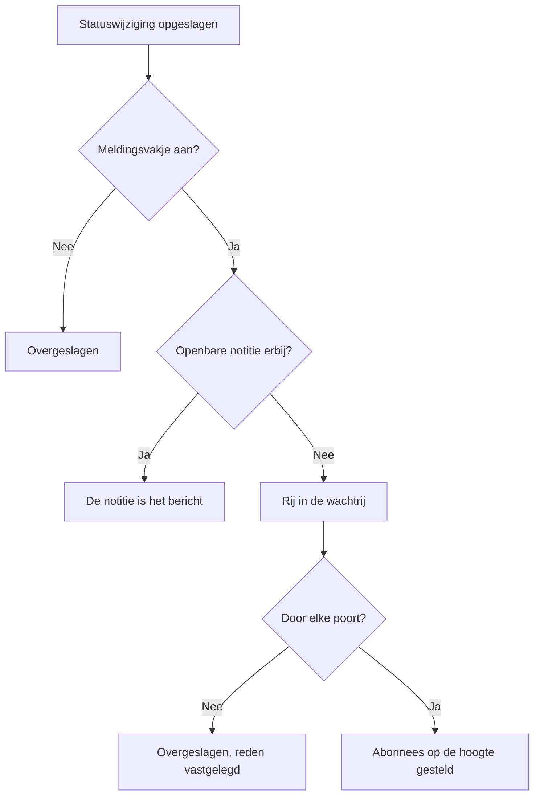

# Incidentstatussen en ernstniveaus

Elk incident draagt twee indelingen: een **status** die zegt waar het in je respons staat, en een **ernst** die zegt hoeveel pijn het doet. Deze pagina legt uit wat elke status doet, hoe je eigen statussen toevoegt en hoe ernstniveaus worden gerangschikt — voor iedereen die incidenten instelt, of wil weten waarom een incident wel of niet oproep, oploste of op een statuspagina verscheen.

:::cards
- [Eigen statussen toevoegen](#eigen-statussen-toevoegen): Geef je respons vorm, en zie waarvoor elke status telt.
- [Wat bevestigen doet](#wat-bevestigen-doet): Het oproepen stopt en de SLA wordt als beantwoord gemarkeerd.
- [Wat oplossen doet](#wat-oplossen-doet): Monitoren worden vrijgegeven en de SLA wordt afgesloten.
- [Abonnees informeren](#statuspagina-abonnees-informeren-over-een-statuswijziging): De poorten waar een statuswijziging doorheen gaat voordat een statuspagina ervan hoort.
:::

## Hoe het werkt

In het dashboard lijken statussen en ernstniveaus op elkaar — allebei verschijnen ze als gekleurde labels in de incidentenlijst en als een gekleurde stip vóór de naam overal waar je er een kiest, en allebei zijn het lijsten van het project die je kunt hernoemen en een andere kleur kunt geven. Ze doen heel verschillend werk.

Statussen sturen gedrag. Drie booleaanse vlaggen op de statusrijen bepalen samen met de volgorde van de statussen welke incidenten als actief tellen, welke knoppen in de kop van het incident verschijnen, wanneer de SLA-klok stopt en wanneer het incident van je statuspagina verdwijnt. Ernstniveaus sturen op zichzelf niets — het zijn labels die de impact beschrijven, en waarop andere regels kunnen filteren.

```mermaid title="Incidenten gaan alleen omlaag in de lijst; waar een status staat, bepaalt waarvoor hij telt"
flowchart TB
    subgraph open["Telt als niet bevestigd"]
        identified["Identified"]
    end
    subgraph working["Telt als bevestigd"]
        acknowledged["Bevestigd"]
        mitigated["Mitigated (eigen)"]
    end
    subgraph done["Telt als opgelost"]
        resolved["Opgelost"]
        closed["Closed (eigen)"]
    end
    identified --> acknowledged
    acknowledged --> mitigated
    mitigated --> resolved
    resolved --> closed
    identified -. "overslaan" .-> resolved
```

Het model `IncidentState` heeft `name`, `description`, `color` en `order`, plus drie booleans: `isCreatedState`, `isAcknowledgedState` en `isResolvedState`. Alles wat het product met statussen doet, gaat uit van die booleans en van `order` — nooit van de naam van de status. Daarom kun je **Opgelost** hernoemen naar "Closed" zonder dat er iets breekt: de vlag reist mee met de rij.

Het model `IncidentSeverity` heeft `name`, `description`, `color` en `order`, en verder niets. Er zijn geen vlaggen. Niets in OneUptime behandelt **Critical Incident** uit zichzelf anders dan **Minor Incident** — ernst doet er alleen toe waar je er iets op richt, zoals het criterium **Incident Ernsten** van een bereikbaarheidsregel.

Een paar korte regels:

- **Kies de ernst om impact over te brengen** — die staat in de incidentenlijst en op het **Overzicht** van het incident, en is een verplicht veld als je een incident meldt.
- **Kies statussen om je proces vorm te geven** — de responsstappen die je echt doorloopt, in de volgorde waarin je ze doorloopt.
- **Leg geen urgentie vast in statussen** — een status met de naam "Critical" roept niemand op. Dat doet de ernst samen met een bereikbaarheidsregel.

> [!TIP]
> Beide lijsten worden aangemaakt als je project wordt aangemaakt, en beide bewerk je onder **Incidenten → Instellingen**. Die sectie van het zijmenu van Incidenten is standaard ingeklapt, dus klap **Instellingen** uit voordat je ernaar gaat zoeken.

## De vooraf aangemaakte statussen

Er worden met het project drie statussen aangemaakt, in deze volgorde. Het aanmaken is idempotent — een status wordt alleen toegevoegd als er nog geen status met die naam bestaat.

| Status           | `order` | Vlag                  | Kleur     | Wat het betekent                                   |
| ---------------- | ------- | --------------------- | --------- | -------------------------------------------------- |
| **Identified**   | `1`     | `isCreatedState`      | `#fd625e` | De status waarin nieuwe incidenten belanden.       |
| **Bevestigd**    | `2`     | `isAcknowledgedState` | `#ffbf53` | Iemand heeft het incident opgepakt.                |
| **Opgelost**     | `3`     | `isResolvedState`     | `#2ab57d` | Het incident is voorbij en telt niet meer als actief. |

> [!NOTE]
> De eerste status heet **Identified**, ook al noemen verschillende beschrijvingen in het product hem nog de status "created". Als een document of tooltip "aanmaakstatus" zegt, bedoelt het de status die `isCreatedState` draagt — in een nieuw project is dat **Identified**.

## Wat elke statusvlag werkelijk doet

| Vlag                  | Doel                                                                                                                                                                                                 |
| --------------------- | ---------------------------------------------------------------------------------------------------------------------------------------------------------------------------------------------------- |
| `isCreatedState`      | De status die een incident krijgt als niemand er een koos. Draagt geen enkele status in het project deze vlag, dan mislukt het aanmaken van een incident met een fout die je vraagt vanuit de instellingen een aanmaakstatus voor incidenten toe te voegen. |
| `isAcknowledgedState` | Markeert de bevestigde status van het project: de status waarnaar **Bevestigen** een incident verplaatst en waarnaar de statistiektegel voor bevestiging is genoemd. Een incident in die status, in een latere status, of opgelost, is bevestigd — **Bevestigen** wordt er niet meer voor aangeboden, de bereikbaarheidsdienst stopt met oproepen ervoor, en zijn SLA wordt als beantwoord gemarkeerd. |
| `isResolvedState`     | Markeert de opgeloste status van het project: de status waarnaar **Oplossen** een incident verplaatst en die de statistiektegel voor oplossing toont. Een incident in die status, of in een latere status, is opgelost — het verdwijnt uit **Actieve incidenten** en uit het actieve deel van een statuspagina, en zijn SLA wordt als opgelost gemarkeerd. |

Per project hoort maar één status elke vlag te dragen — de opzoekingen pakken de eerste in de volgorde. De drie statussen met een vlag dragen op de instellingenpagina het label **Ingebouwd**; beweeg er met de muis over (of ga er met Tab naartoe) om te lezen wat OneUptime met de status doet. Ze kunnen worden hernoemd, een andere kleur krijgen en worden gesleept, maar:

- **Ze houden hun volgorde.** De aanmaakstatus komt vóór de bevestigde status, en de bevestigde vóór de opgeloste. Een sleepbeweging die dat zou breken — **Opgelost** boven **Bevestigd** bijvoorbeeld — wordt geweigerd, de rijen gaan terug en de pagina zegt waarom.
- **Ze kunnen niet worden verwijderd.** Hun **Verwijderen** blijft in het menu van de rij staan, vergrendeld, met de reden. Een bulkverwijdering slaat ze over en noemt ze als niet verwijderd. Ook de API weigert de laatste aanmaak-, bevestigde of opgeloste status van een project te verwijderen.

Omdat de interface statusnamen dynamisch leest, verandert het hernoemen van een status wat je overal ziet — de statistiektegels (**Acknowledged in** en **Resolved in** met de vooraf aangemaakte namen), de bevestiging **Incident markeren als …** van een eigen status en het label in de incidentenlijst volgen allemaal de naam die je de rij gaf.

## Eigen statussen toevoegen

Een status die je toevoegt, is een stap in je respons die de drie vooraf aangemaakte statussen niet noemen: "Investigating", "Mitigated", "Monitoring", "Closed".

:::steps
### Open de statuslijst

Ga naar **Incidenten → Instellingen → Status incident**. De kaart **Incident Statussen** toont je statussen in hun volgorde, één rij per status: een greep om hem aan te slepen, zijn kleur en naam, waarvoor een incident erin **Telt als**, en zijn beschrijving. De zin onder de titel zegt het duidelijk: incidenten gaan in deze lijst alleen omlaag.

### Maak de status aan

Klik op **Status incident aanmaken**, in de kop van de kaart, en vul het formulier in (velden hieronder). De nieuwe status wordt **net boven de opgeloste status** toegevoegd — waar de meeste statussen thuishoren, en nooit eronder, waar hij stilletjes als opgelost zou tellen.

### Sleep hem op zijn plek

Sleep een rij aan zijn greep om hem te verplaatsen. De nieuwe volgorde wordt opgeslagen zodra je loslaat; er is geen volgordenummer om te typen. Met het toetsenbord zet je de focus op de greep, druk je op de spatiebalk, verplaats je met de pijltjestoetsen en druk je opnieuw op de spatiebalk. De kolom **Telt als** werkt zich bij zodra je de rij loslaat.
:::

**Bewerken** opent hetzelfde formulier als aanmaken. De ID van de status staat onder **ID weergeven** in het menu van de rij.

| Veld             | Verplicht | Wat het doet                                                                                                                                                                                                                                                      |
| ---------------- | --------- | ----------------------------------------------------------------------------------------------------------------------------------------------------------------------------------------------------------------------------------------------------------------- |
| **Naam**         | Ja        | Minstens twee tekens. De voorbeeldtekst stelt zoiets voor als "Investigating".                                                                                                                                                                                    |
| **Beschrijving** | Nee       | Vrije tekst die uitlegt wanneer een incident in deze status staat.                                                                                                                                                                                                |
| **Kleur**        | Ja        | Al gekozen als het formulier opent: een kleur die nog geen van de statussen in de lijst gebruikt, zodat een nieuwe status nooit hetzelfde rood krijgt als die erboven. Kies een andere uit de rij benoemde kleuren (Rood, Oranje, Limoen, Groen, Blauwgroen, Blauw, Indigo, Paars, Magenta, Roze), of gebruik **Aangepaste kleur** voor een exacte huisstijlkleur zoals `#fd625e`. |

De kleur kleurt het label van de status en de stip vóór zijn naam in elke statuskiezer: de meld- en sjabloonformulieren, de bulkactie **Status wijzigen**, het statusmenu in de kop, en de voorwaarden van regels en filters. Elk van die kiezers toont de statussen in de volgorde waarin deze pagina ze zet.

De drie vlaggen kun je niet met dit formulier instellen — die horen bij de vooraf aangemaakte rijen. Een status die je toevoegt, is dus een status zonder vlag, wat drie gevolgen heeft om rekening mee te houden:

- **Waar hij staat, bepaalt waarvoor hij telt.** De kolom **Telt als** toont het, en verandert terwijl je sleept: boven de bevestigde status is een incident erin **Niet bevestigd**; vanaf de bevestigde status omlaag telt het als **Bevestigd**, dus het bereikbaarheidsbeleid stopt met escaleren; vanaf de opgeloste status omlaag telt het als **Opgelost**, dus statuspagina's tonen het niet meer als actief.
- **Boven de opgeloste status houdt hij het incident actief.** **Actieve incidenten** bevat de incidenten waarvan de huidige status boven de opgeloste status staat, dus een status die je daar toevoegt, houdt het incident in de actieve lijst en in de teller in de zijbalk. Een status die onder de opgeloste status is gesleept, telt overal als opgelost — in de actieve lijsten, op statuspagina's, bij herinneringen en voor de SLA — en een incident er vanuit **Opgelost** in zetten is geen tweede keer oplossen.
- **Je zet een incident erin via het menu in de kop.** De knoppen in de kop zijn alleen **Bevestigen** en **Oplossen**; een eigen status staat onder **Change state to** in het menu **⋯** ernaast, dat elke status na de huidige toont. De bevestiging heet **Incident markeren als `<state name>`**, met een verzendknop **Markeren als `<state name>`**.

> [!TIP]
> Een gangbare vorm is een mitigatiestap tussen de bevestigde en de opgeloste status — maak "Mitigated" aan en hij komt net boven **Opgelost** terecht, na **Bevestigd**, en telt als bevestigd. Voor een triagestap voordat iemand het incident heeft bevestigd, sleep je hem boven **Bevestigd**.

## De volgorde is een echte beperking, geen weergavevoorkeur

De volgorde wordt afgedwongen wanneer een statuswijziging wordt geschreven, niet alleen wanneer de lijst wordt getekend:

- **Overgangen terug worden geweigerd.** Een incident naar een status verplaatsen die eerder in de volgorde staat dan zijn huidige status, mislukt met een fout die beide statussen noemt.
- **De huidige status opnieuw kiezen wordt geweigerd.** Een incident in de status zetten waarin het al staat, mislukt met "Incident state cannot be same as previous state."
- **Een rij met een eerdere datum kan haar buur niet dupliceren.** Een tijdlijnrij invoegen waarvan de status gelijk is aan die van de rij erna, wordt ook geweigerd.
- **De knoppen in de kop volgen de positie van de statussen met een vlag in de volgorde.** **Bevestigen** en **Oplossen** worden aangeboden op basis van waar de huidige status in de gesorteerde lijst staat. Een eigen status die *na* de opgeloste status staat, toont nooit een knop **Oplossen**, omdat een incident erin al als opgelost telt.

Zet een status die je toevoegt dus waar een incident er echt doorheen zou gaan. Hem verkeerd ordenen ziet er niet alleen vreemd uit — het maakt overgangen onmogelijk. Een status later in de volgorde zetten verandert waarvoor de incidenten die er al in staan tellen, op het moment dat je hem loslaat.

Via de API en Terraform is de volgorde de kolom `order`: lagere getallen komen eerst. Een status die zonder volgorde wordt aangemaakt, komt net boven de opgeloste status; een status die met een getal wordt aangemaakt of bijgewerkt, neemt die plek in, en de statussen die in de weg staan, schuiven een plek op. Getallen die geen andere status heeft, blijven zoals ze zijn geschreven, dus een status die door Terraform wordt beheerd, leest het getal terug dat hij kreeg.

## De vooraf aangemaakte ernstniveaus

Er worden met het project drie ernstniveaus aangemaakt, in deze volgorde, het ernstigste eerst:

| Ernst                 | `order` | Kleur     | Vooraf ingevulde beschrijving                                                                                                                                                             |
| --------------------- | ------- | --------- | ----------------------------------------------------------------------------------------------------------------------------------------------------------------------------------------- |
| **Critical Incident** | `1`     | `#b70400` | Issues causing very high impact to customers. Immediate response is required. Examples include a full outage, or a data breach.                                                          |
| **Major Incident**    | `2`     | `#fd625e` | Issues causing significant impact. Immediate response is usually required. We might have some workarounds that mitigate the impact on customers. Examples include an important sub-system failing. |
| **Minor Incident**    | `3`     | `#ffbf53` | Issues with low impact, which can usually be handled within working hours. Most customers are unlikely to notice any problems. Examples include a slight drop in application performance. |

Ernst is verplicht als je een incident meldt, en is verplicht in elke incidentspecificatie in de criteria van een monitor, dus elk incident — met de hand of automatisch — komt er met een binnen. Zie [Een incident melden](/docs/incidents/declaring-incidents) voor het meldproces en [Incident- en waarschuwingstemplates](/docs/monitor/incident-alert-templating) voor de route via monitoren.

## Ernstniveaus bewerken

Ga naar **Incidenten → Instellingen → Ernst van incident**. Dezelfde vorm als de statuspagina — één rij per ernst, het ernstigste eerst, sleep een rij om de rang te wijzigen, **Ernst van incident aanmaken** voegt er een toe aan het eind (de minst ernstige), met **Naam**, **Beschrijving** en **Kleur** op het formulier, de kleur al gekozen zoals op het statusformulier.

De rang doet ertoe overal waar OneUptime ernstniveaus vergelijkt: een episode neemt de ernst van zijn ernstigste incident aan, en Critical en Warning in een aanbeveling voor een monitor komen overeen met je eerste en tweede ernst.

Twee verschillen met statussen:

- **Er is geen beveiliging tegen verwijderen.** Elke ernst kan worden verwijderd, ook de drie vooraf aangemaakte.
- **Er zijn geen vlaggen om over te nemen, en er is geen "Telt als".** Een nieuwe ernst gedraagt zich precies als de vooraf aangemaakte — het is een label met een kleur en een rang.

Waar ernst meer doet dan beschrijven: onder **Incidenten → Regels → Bereikbaarheidsregels** is het veld **Incident Ernsten** van een regel een criterium. **Critical Incident** daar opnemen is hoe "roep het databaseteam op voor alles wat kritiek is" wordt uitgedrukt — het bereikbaarheidsbeleid zit op de regel, niet op de ernst.

**De ernst van een incident wijzigen** — onder **Bewerken** op de kaart **Incidentdetails** van het incident, via de API of Terraform (`incidentSeverityId`), met een workflow of met de AI-tools — doet dezelfde vier dingen, hoe het ook wordt verstuurd: de incidentfeed krijgt een item **Incident updated** dat de nieuwe ernst noemt, de SLA-deadlines van het incident worden opnieuw berekend, zijn herinneringsregel wordt opnieuw gezocht, en de incidentstatistieken tellen één ernstwijziging. De ernst opslaan die het incident al heeft, doet geen van deze dingen, dus alleen de titel van een incident bewerken laat zijn SLA-deadlines, herinneringen en aantal ernstwijzigingen zoals ze waren. De ernst van een waarschuwing werkt op dezelfde manier voor haar feeditem en haar herinneringen.

## Een incident door zijn statussen bewegen

Er zijn vier manieren waarop een incident van status verandert:

| Manier              | Waar                                                                                        | Wat het vraagt                                                                                                                                                                                               |
| ------------------- | ------------------------------------------------------------------------------------------- | ------------------------------------------------------------------------------------------------------------------------------------------------------------------------------------------------------------ |
| **Knoppen in de kop** | De kop van het incident: **Bevestigen** en **Oplossen**, en **Change state to** in het menu **⋯** | Een korte bevestiging — **Incident bevestigen** of **Incident oplossen** — met **Statuspagina-abonnees op de hoogte stellen** en, ingeklapt onder **Openbare notitie toevoegen**, de optionele **Openbare notitie** met de kiezer **Selecteer notitiesjabloon** (als het project notitiesjablonen heeft). |
| **Statustijdlijn**  | **Statustijdlijn** in het zijmenu van het incident                                          | Een rij die met de hand wordt toegevoegd, met **Incidentstatus**, **Begint op** en **Statuspagina-abonnees op de hoogte stellen**.                                                                          |
| **Bulkwijziging**   | **Status wijzigen** op een selectie in de incidentenlijst                                   | Eén pagina met de status, **Statuspagina-abonnees op de hoogte stellen** en dezelfde ingeklapte **Openbare notitie toevoegen**.                                                                             |
| **Automatisch**     | Een monitorcriterium, of je eigen code                                                      | Een criterium met **Incident automatisch oplossen** aan lost zijn incident op als niet meer aan het criterium wordt voldaan. De API wijzigt de status door een rij aan te maken op `/api/incident-state-timeline`. |

Staat de huidige status vóór de bevestigde status, dan biedt de kop **Bevestigen** en **Oplossen** aan; staat hij tussen de twee, alleen **Oplossen**. Bevestigen stopt ook elke escalatie van de bereikbaarheidsdienst voor het incident.

Elk van deze manieren schrijft een tijdlijnrij. Een statuswijziging doet ook een paar dingen waar je niet om hoeft te vragen: ze plaatst een item in de incidentfeed, wijst een Incident Commander toe als het incident er nog geen heeft, en werkt de SLA-klok bij. Een opgelost incident heropenen start een nieuw SLA-record vanaf het moment van heropenen.

## Wat bevestigen doet

Een incident is bevestigd vanaf het moment dat het in je bevestigde status komt, in een latere status — een status **Mitigated** of **Investigating** die je onder **Bevestigd** hebt gezet — of in een opgeloste status, via welke van de vier manieren hierboven ook. De kolom **Telt als** op de instellingenpagina van de statussen toont welke statussen dat zijn. Zodra het bevestigd is:

- **Bevestigen wordt niet meer aangeboden.** Niet in de kop van het incident, niet in de mobiele app (de knop en de veegbeweging), niet in Slack of Microsoft Teams, en niet via `acknowledge_incident` van de OneUptime MCP-server. Het toch bevestigen — vanaf een oproeppagina, Slack of Teams — wordt geweigerd met "Incident is already acknowledged." (of "Incident is already resolved."), in plaats van het weer omhoog in zijn lijst te zetten.
- **De bereikbaarheidsdienst stopt met oproepen ervoor.** Een responder die zijn oproep bevestigt nadat een collega het incident bevestigde of verder zette, krijgt zijn oproep bevestigd, en het incident blijft waar het is.
- **De SLA wordt als beantwoord gemarkeerd**, bij de eerste zo'n verplaatsing; verder gaan door latere statussen houdt dat tijdstip.
- **De tijd tot bevestiging loopt tot die eerste verplaatsing** — de statistiektegel op het **Overzicht** van het incident, de metriek **Time to Acknowledge**, een meting die eindigt wanneer **Het incident wordt bevestigd**, en de MTTA in de samenvattingen in Slack en Microsoft Teams. Een incident dat rechtstreeks van **Identified** naar **Investigating** ging, werd toen bevestigd; een incident dat meteen werd opgelost, werd bevestigd toen het werd opgelost.
- **Een filter Bevestigd** — op de widget met een incidentenlijst van een dashboard bijvoorbeeld — toont de incidenten in je bevestigde status en in elke latere status, tot aan opgelost.

Waarschuwingen en episodes volgen dezelfde regel, met je waarschuwingsstatussen.

## Wat oplossen doet

Een incident is opgelost wanneer het van een status boven je opgeloste status in de opgeloste status komt, of in een latere status — via welke van de vier manieren hierboven ook. Elke keer oplossen:

- **Geeft de monitoren vrij die het incident vasthoudt.** Een incident dat open wordt gemeld, houdt zijn monitoren vast: het zette ze in zijn status van **Monitorstatus wijzigen naar**, als het er een noemt, en pauzeerde, als het met de hand werd gemeld, hun bewaking. Een bewerking terwijl het open is — monitoren toevoegen, of die status wijzigen — laat het ze ook vasthouden. Oplossen hervat hun bewaking en zet ze terug op operationeel, tenzij er nog een ander open incident op ze staat, en vanaf dan houdt het incident niets meer vast. Een incident dat al opgelost wordt gemeld, geeft dus niets vrij, en een tweede keer oplossen na een heropening ook niet: een status die zijn monitoren in de tussentijd kregen — van hun probes, van onderhoud of met de hand ingesteld — blijft.
- **Markeert de SLA als opgelost** en schrijft, als de postmortem-concepten van OneUptime AI aanstaan, een concept van een postmortem.

Van **Opgelost** verder gaan naar een latere status — **Closed** bijvoorbeeld — is geen tweede keer oplossen: niets hiervan wordt opnieuw uitgevoerd, en er start geen nieuwe SLA. Een incident dat werd gemeld voordat OneUptime dit begon vast te leggen, geeft zijn monitoren bij de volgende keer oplossen vrij, zoals voorheen.

## De statustijdlijn

De pagina **Statustijdlijn** in het zijmenu van het incident is het auditspoor van elke status waarin het incident heeft gestaan. De kaart op die pagina heet **Statustijdlijn**, en is gesorteerd met de nieuwste eerst.

| Kolom                              | Wat hij toont                                                                                                                                                                                                                                                  |
| ---------------------------------- | -------------------------------------------------------------------------------------------------------------------------------------------------------------------------------------------------------------------------------------------------------------- |
| **Incidentstatus**                 | Een gekleurd label met de naam en de kleur van de status.                                                                                                                                                                                                      |
| **Begint op**                      | Wanneer het incident in deze status kwam.                                                                                                                                                                                                                      |
| **Eindigt op**                     | Wanneer het eruit ging. De huidige status toont `Currently Active`.                                                                                                                                                                                            |
| **Duur**                           | De tijd in de status, voor de huidige status geteld tot nu.                                                                                                                                                                                                    |
| **Meldingsstatus abonnee**         | Of de melding aan de statuspagina voor deze wijziging is verstuurd, overgeslagen of nog in behandeling is, met een link **meer details**, en — als het versturen mislukte — een actie **Opnieuw proberen**. **Opnieuw proberen** verstuurt de statuswijziging opnieuw naar elke statuspagina die het incident nu bereikt, ook naar de abonnees die haar al kregen. |

Elke rij heeft twee acties:

- **Oorzaak bekijken** — opent een dialoogvenster **Hoofdoorzaak** dat de Markdown toont die met die statuswijziging is vastgelegd.
- **Logboeken bekijken** — opent een dialoogvenster dat uitlegt waarom de status veranderde, met een weergave **Incidentstatuslogboek**.

In het dashboard kunnen tijdlijnrijen worden toegevoegd en verwijderd, maar niet bewerkt; een incident houdt altijd minstens één rij. Via de API kan de `startsAt` van een rij worden verbeterd, en elke meting die uit de tijdlijn wordt berekend, volgt mee.

> [!WARNING]
> De verkeerde rij verwijderen herschrijft de geschiedenis van het incident, dus gebruik het als hulpmiddel om te corrigeren en niet als opruimgewoonte.

## De lijst Actieve incidenten

**Incidenten → Actieve incidenten** is de lijst die je tijdens een dienst in de gaten houdt. De definitie ervan is precies één voorwaarde: de huidige status van het incident staat boven je opgeloste status — de eerste status in de volgorde met de vlag `isResolvedState`. Er wordt verder niets meegewogen — niet de ernst, niet de leeftijd, niet of iemand het heeft bevestigd.

Het item in het zijmenu draagt een rode badge met een teller die dezelfde query gebruikt, dus de badge en de lijst zijn het altijd eens. Is er niets te zien, dan zegt de pagina dat.

Het praktische gevolg: een eigen status die je boven de opgeloste status toevoegt, houdt incidenten in deze lijst — "Mitigated" is niet "klaar" — en een status die je erna plaatst, haalt ze eruit, net als de opgeloste status. Waarschuwingen en episodes volgen dezelfde regel met hun eigen statussen, en de tellers in het zijmenu, de herinneringen, de statuspagina's en de mobiele app lezen hem allemaal.

## Statuspagina-abonnees informeren over een statuswijziging

Een statuswijziging kan je statuspagina-abonnees een melding sturen, maar gaat door verschillende poorten. Ze begrijpen bespaart veel speurwerk naar "waarom kreeg niemand een melding".



Een melding wordt per tijdlijnrij aangevraagd met **Statuspagina-abonnees op de hoogte stellen** (`shouldStatusPageSubscribersBeNotified`), het selectievakje in het dialoogvenster voor statuswijzigingen en op het handmatige tijdlijnformulier. In het dialoogvenster voor statuswijzigingen begint het uit als het incident werd gemeld zonder abonnees op de hoogte te stellen. Hetzelfde selectievakje bepaalt ook of de openbare notitie in het dialoogvenster iemand iets laat weten. Staat het uit, dan wordt de rij opgeslagen met de status overgeslagen en een uitleg. Staat het aan, dan komt de rij in de wachtrij en pakt een achtergrondtaak hem op — de taak draait elke minuut, dus de bezorging is snel maar niet direct.

**De rij in de wachtrij wordt daarna overgeslagen als een van deze dingen geldt:**

- **De nieuwe status is de aanmaakstatus.** Abonnees kregen al bericht toen het incident werd gemeld, dus de eerste tijdlijnrij verstuurt bewust geen tweede bericht.
- **Aan het incident hangen geen monitoren.** Zonder middelen is er geen statuspagina om het incident aan te koppelen.
- **Het incident is niet zichtbaar op de statuspagina** (`isVisibleOnStatusPage` staat uit).
- **De statuspagina heeft incidenten uitgezet** (`showIncidentsOnStatusPage` staat uit). Dit geldt per statuspagina — andere pagina's die dezelfde monitor tonen, krijgen nog steeds een melding.
- **De statuspagina valt buiten het bereik van het incident.** Een incident dat met **Beperken tot deze statuspagina's** tot enkele statuspagina's is beperkt, laat alleen die pagina's iets weten van de pagina's die zijn monitoren tonen, en een pagina met **Alleen incidenten tonen die tot deze pagina zijn beperkt** aan krijgt nooit een melding over een incident dat niet tot haar beperkt is. Ook dit geldt per statuspagina. Zie [Eén statuspagina per doelgroep](/docs/status-pages/one-status-page-per-audience).

**Nog één ding dat de uitkomst verandert.** Schrijf je een **Openbare notitie** in het dialoogvenster voor statuswijzigingen (onder **Openbare notitie toevoegen**) of in de bulkactie **Status wijzigen** terwijl **Statuspagina-abonnees op de hoogte stellen** aanstaat, dan wordt de tijdlijnrij als al gemeld gemarkeerd in plaats van in de wachtrij gezet, en zegt het statusbericht dat de notitie de melding droeg. De notitie zelf is wat de abonnees bereikt, dus ze krijgen één bericht in plaats van twee. Een notitie met niets dan spaties wordt niet geplaatst, en de rij komt zoals gewoonlijk in de wachtrij. Statuswijzigingen van gepland onderhoud werken op dezelfde manier. Het gebeurtenistype achter het gewone bericht over een statuswijziging is `Subscriber Incident State Changed`.

**De notitie zegt wat het incident nu is.** Omdat de notitie het enige bericht is, noemt ze op elk kanaal de nieuwe status, zoals het bericht over de statuswijziging dat zou hebben gedaan: het onderwerp van de e-mail luidt `[Resolved Incident] <title>` en de details tonen een rij **Status** in de kleur van de status, de sms zegt `Incident <title> on <status page> is Resolved.`, berichten in Slack en Microsoft Teams bevatten een regel `**Status:** Resolved`, en de payload `IncidentNoteCreated` van de webhook bevat `incidentState` in `data`. Een notitie die op zichzelf wordt geplaatst, houdt haar gewone bericht, en dat geldt ook voor de updatemelding van een bewerking.

**Voor het plaatsen van de notitie is een eigen machtiging nodig.** De status wijzigen en een openbare notitie plaatsen zijn aparte machtigingen (**Create Incident State Timeline** en **Create Incident Status Page Note** in een aangepaste rol; de ingebouwde incident- en projectrollen hebben ze allebei). De status wijzigen vraagt geen machtiging om het incident te bewerken: zie [Een status wijzigen](/docs/permissions/index#een-status-wijzigen). Wie de status van een incident mag wijzigen maar geen openbare notities mag plaatsen, krijgt **Openbare notitie toevoegen** niet aangeboden in het dialoogvenster of in de bulkactie **Status wijzigen**. Een statuswijziging die zo iemand met een notitie via de API verstuurt, wordt in haar geheel geweigerd, met een bericht dat zegt dat de status niet is gewijzigd en waarom, zodat een wijziging nooit wordt vastgelegd als gemeld door een notitie die nooit is geplaatst. Laat je de notitie weg, dan gaat de wijziging door. Waarschuwingen, waarschuwingsepisodes en incidentepisodes bieden bij een statuswijziging in plaats daarvan een privénotitie aan (**Privénotitie toevoegen**), en die werkt op dezelfde manier: voor het plaatsen ervan is de eigen machtiging van de notitie nodig (**Create Alert Internal Note**, **Create Alert Episode Internal Note** of **Create Incident Episode Internal Note** in een aangepaste rol; de ingebouwde waarschuwings-, incident- en projectrollen hebben ze), en een statuswijziging die met een privénotitie wordt verstuurd door iemand zonder die machtiging, wordt in haar geheel geweigerd, zodat de status niet wordt gewijzigd.

**Verstuurd betekent dat elke abonnee het bericht is gestuurd.** De taak wacht op elk bericht en telt het als verstuurd of mislukt, per statuspagina en kanaal, en het statusbericht van de rij noemt die aantallen. Eén mislukt bericht, of een verzending waarvoor de tijd op was of die werd onderbroken, maakt de rij **Mislukt**. Zie [Abonnees en aankondigingen](/docs/status-pages/subscribers).

Voor wie deze berichten ontvangt en hoe de sjablonen worden gekozen, zie [Abonnees en aankondigingen](/docs/status-pages/subscribers).

## Een incident van de statuspagina houden

Vier afzonderlijke dingen bepalen of een incident überhaupt op een openbare pagina staat, en alle vier moeten waar zijn:

- **Incidenten weergeven** (`showIncidentsOnStatusPage`) op de statuspagina zelf.
- **Zichtbaar op statuspagina** (`isVisibleOnStatusPage`) op het incident — een schakelaar op de pagina **Instellingen** van het incident. Hij staat standaard aan en staat niet in de meldwizard; een monitorcriterium kan hem instellen met **Incident weergeven op statuspagina**. Een incident dat verborgen wordt gemeld, laat bij het aanmaken geen enkele abonnee iets weten; zet je deze schakelaar later aan, dan biedt het bewerkingsformulier **Abonnees laten weten dat dit incident is aangemaakt** aan. Zie [Een incident melden](/docs/incidents/declaring-incidents).
- **De pagina valt binnen het bereik van het incident.** De pagina toont een van de monitoren van het incident en is, als het incident tot enkele statuspagina's is beperkt, een van die pagina's. Een pagina met **Alleen incidenten tonen die tot deze pagina zijn beperkt** aan toont alleen de incidenten die tot haar beperkt zijn. Zie [Eén statuspagina per doelgroep](/docs/status-pages/one-status-page-per-audience).
- **De huidige status staat boven de opgeloste status.** Dit is wat een incident uit het actieve deel haalt: de query van de statuspagina haalt incidenten op waarvan de huidige status boven je opgeloste status staat, dus de opgeloste status en elke latere status halen het incident eraf. Je archiveert of sluit niets — je lost het op, en het gaat over naar de geschiedenis.

**Privé-incidenten verschijnen nooit.** **Privé-incident** aanzetten verbergt het incident voor elke statuspagina, ongeacht de schakelaars hierboven, en beperkt het tot zijn eigenaren plus projectbeheerders en projecteigenaren. Er bereikt ook niets ervan een abonnee van een statuspagina: niet het aanmaken, niet de statuswijzigingen, niet de openbare notities en niet het postmortem. De afbeeldingen in de beschrijving, het postmortem, de aangepaste velden en de openbare notities zijn niet voor iedereen te zien zolang het privé is.

De twee schakelaars worden gelijk gehouden, zodat de pagina **Instellingen** van het incident altijd toont wat statuspagina's doen:

- Een incident privé maken zet **Zichtbaar op statuspagina** mee uit.
- **Zichtbaar op statuspagina** aanzetten terwijl het incident privé blijft, laat hem uit. Om een privé-incident te publiceren, zet je **Privé-incident** uit en **Zichtbaar op statuspagina** aan — in één keer opslaan, of na elkaar.

Dit geldt hoe het incident ook wordt geschreven: het dashboard, de API, Terraform, een workflow, een monitor, een incidentsjabloon of een privacyregel. Een waarde die als tekst wordt verstuurd, zoals `"true"`, telt hetzelfde als `true`. Eén schrijfactie op veel incidenten die **Zichtbaar op statuspagina** aanzet — de **Update Many** van een workflow bijvoorbeeld — toont de incidenten die niet privé zijn en laat elk privé-incident verborgen. Elk incident wordt beoordeeld zoals het is wanneer de schrijfactie het bereikt, dus een wijziging van de privacy die op hetzelfde moment binnenkomt, wordt nooit ingehaald: een incident wordt nooit privé en zichtbaar tegelijk opgeslagen. Een incident dat privé wordt aangemaakt, wordt verborgen aangemaakt, en laat geen enkele abonnee weten dat het is aangemaakt.

**Episodes volgen dezelfde regel.** Een privé-incidentepisode is verborgen voor elke statuspagina, wat de schakelaar **Zichtbaar op statuspagina** ervan ook zegt, en de abonnees horen er niets van. Op de pagina **Instellingen** van de episode zegt de schakelaar dat, en blijft hij uit zolang de episode privé is. Een privé-incident brengt zijn episode nooit op een statuspagina: een episode komt alleen op een pagina via incidenten die niet privé zijn.

:::details Upgraden vanaf een versie zonder deze regels
Bij incidenten en episodes die van vóór deze regels privé zijn opgeslagen met **Zichtbaar op statuspagina** nog aan, wordt die schakelaar bij het upgraden uitgezet. Er wordt niemand iets gestuurd. De afbeeldingen die zo'n incident of episode voor iedereen zichtbaar had gemaakt, worden weer privé, tenzij iets wat je statuspagina's tonen ze nog bevat. Dat geldt ook voor de afbeeldingen in openbare notities van incidenten, episodes en gepland-onderhoudsevenementen die je statuspagina's niet tonen, die voorheen voor iedereen zichtbaar bleven.
:::

Hoeveel opgeloste geschiedenis de pagina bewaart, is een instelling van de statuspagina, niet van het incident. Zie [Statuspagina – bronnen en groepen](/docs/status-pages/resources-and-groups) voor hoe monitoren op de pagina bepalen welke incidenten er überhaupt verschijnen.

## Volgende stappen

:::cards
- [Een incident melden](/docs/incidents/declaring-incidents): Kies een beginstatus en een ernst als je meldt.
- [Incidentnotities, eigenaren en feed](/docs/incidents/notes-owners-and-feed): Plaats de openbare notitie die met een statuswijziging meegaat.
- [Incidentinstellingen en automatisering](/docs/incidents/settings): Meet de tijd tussen statussen, en filter op ernst in regels.
- [Abonnees en aankondigingen](/docs/status-pages/subscribers): Wie de berichten krijgt die een statuswijziging verstuurt.
:::
