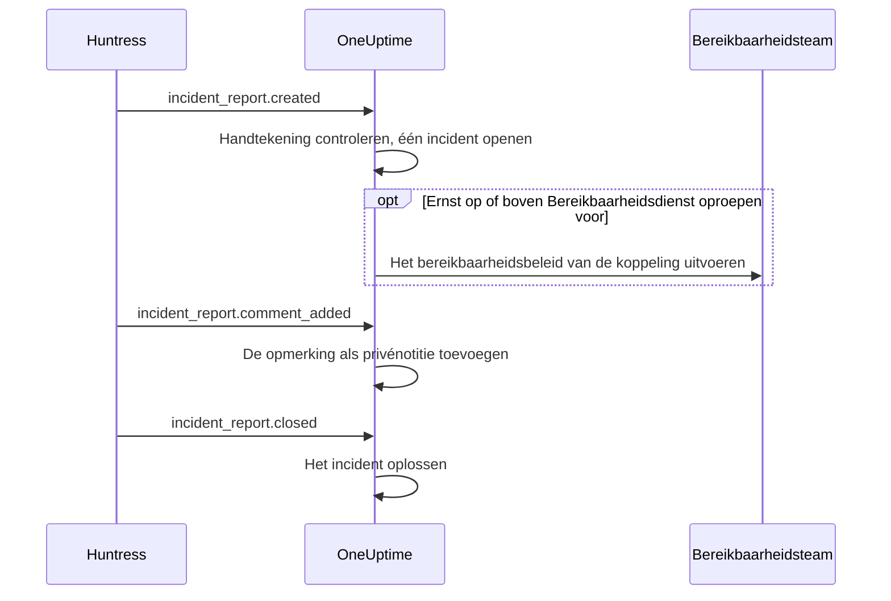

# Huntress-integratie

Roep uw bereikbaarheidsdienst op voor Huntress-incidentmeldingen. Wanneer het Huntress-SOC een incidentmelding over een endpoint of een identiteit stuurt, opent OneUptime er één incident voor, met de ernst die u kiest, roept het het bereikbaarheidsbeleid op dat u kiest, en lost het het incident op wanneer de melding in Huntress wordt gesloten.

Deze integratie is **inkomend**: Huntress stuurt elke gebeurtenis van een incidentmelding naar een webhook-URL die u van OneUptime krijgt, ondertekend met het ondertekeningsgeheim van het endpoint. OneUptime roept Huntress nooit aan en heeft dus geen Huntress-API-sleutel nodig.

:::cards
- [Hoe het werkt](#hoe-het-werkt): Wat OneUptime doet met elke gebeurtenis van een melding.
- [Instellen](#de-integratie-instellen): Koppelen in OneUptime, het endpoint in Huntress toevoegen, het ondertekeningsgeheim opslaan, een test sturen.
- [Instellingen](#instellingen): Oproepen, ernst, organisaties, labels en oplossen.
- [Problemen oplossen](#problemen-oplossen): Wat de fouten van de koppeling betekenen en wat u moet aanpassen.
:::

## Hoe het werkt

Huntress stuurt een gebeurtenis over een incidentmelding wanneer de melding wordt verstuurd, wanneer iemand er een opmerking bij plaatst en wanneer ze wordt gesloten. Elke gebeurtenis bevat de hele melding.

1. **Controleren.** Een verzoek moet ondertekend zijn met het ondertekeningsgeheim van het endpoint, niet meer dan vijf minuten voordat het aankomt. Al het andere wordt geweigerd, en de pagina van de koppeling zegt waarom.
2. **Eén incident openen.** De eerste gebeurtenis van een melding opent een incident met de naam van de melding, zoals `Huntress: Incident on DESKTOP-01 (Acme Corp)`. De beschrijving bevat de samenvatting van de melding, de ernst in Huntress, de organisatie, de getroffen host of identiteit, de indicatoren die Huntress vond en een link naar de melding in Huntress. Latere gebeurtenissen van dezelfde melding, en leveringen die Huntress opnieuw stuurt, vinden dat incident: een melding opent er nooit twee.
3. **Oproepen.** Het incident opent met de incidenternst die de koppeling aan de Huntress-ernst van de melding geeft. Ligt die ernst op of boven **Bereikbaarheidsdienst oproepen voor**, dan wordt het **Bereikbaarheidsbeleid** van de koppeling uitgevoerd.
4. **De melding volgen.** Een opmerking in Huntress wordt een privénotitie bij het incident. Wordt de melding gesloten of afgewezen, dan wordt het incident opgelost.

Zo geopende incidenten verschijnen nooit op een statuspagina. Uw incidentregels (bereikbaarheids-, eigenaar-, label- en privacyregels) gelden voor hen zoals voor elk ander incident.

## Voordat u begint

- In OneUptime de rol **Project Owner** of **Project Admin**. Leden, kijkers en de incidentrollen zien de koppeling en de ontvangen meldingen, maar kunnen haar niet wijzigen.
- In Huntress de rol **Account Admin**: alleen accountbeheerders kunnen webhooks toevoegen.
- Een bereikbaarheidsbeleid om op te roepen. Zonder beleid openen meldingen incidenten en roepen ze niemand op, tenzij een bereikbaarheidsregel voor incidenten erop past.
- Bij een zelf gehoste installatie een OneUptime dat Huntress vanaf internet via HTTPS bereikt: Huntress stuurt webhooks alleen naar `https://`-URL's.

## De integratie instellen

:::steps
### Huntress koppelen in OneUptime

Open **Incidenten → Integraties → Huntress** (`/dashboard/{projectId}/incidents/integrations/huntress`). De sectie **Integraties** in het zijmenu van incidenten is standaard ingeklapt, dus klap haar eerst uit. Klik op **Huntress koppelen**.

Kies het **Bereikbaarheidsbeleid** om op te roepen. **Bereikbaarheidsdienst oproepen voor** vraagt dan welke meldingen het oproepen, en begint bij **Hoge en kritieke meldingen**. Al het andere wacht onder **Meer velden** met een standaardwaarde (zie [Instellingen](#instellingen)). Klik op **Huntress koppelen**. De pagina van de koppeling opent, met een kaart **Huntress koppelen** die u door de volgende drie stappen leidt.

### Een webhook-endpoint toevoegen in Huntress

Klik op de pagina van de koppeling op **Webhook-URL kopiëren**. De URL ziet eruit als `https://oneuptime.com/api/huntress/webhook/<connection-id>`; bij een zelf gehoste installatie begint hij met uw eigen host.

Open in Huntress het menu rechtsboven en kies **Integrations**. Klik op **Add an Integration**, kies **Webhooks** en klik op **Add Endpoint**. Plak de URL, zet **Incident Reports** aan en sla op. Laat **Escalations**, **Platform Actions** en **Account Notices** uit: OneUptime neemt die gebeurtenissen aan en doet er niets mee.

### Het ondertekeningsgeheim van het endpoint opslaan

Open in Huntress het menu van het endpoint (⋯) en kies **View Signing Secret**. Kopieer het volledig: het begint met `whsec_`. Klik op de pagina van de koppeling op **Ondertekeningsgeheim opslaan**, plak het en klik op **Ondertekeningsgeheim opslaan**. Het geheim wordt versleuteld en nooit meer getoond.

Zolang het geheim niet is opgeslagen, weigert OneUptime elk verzoek aan de URL. Huntress stuurt een geweigerde gebeurtenis later opnieuw, dus een gebeurtenis die nu wordt geweigerd, komt toch aan.

### Een test sturen

Open in Huntress het menu van het endpoint (⋯) en kies **Send Test**. Binnen enkele seconden wordt de kaart op de pagina van de koppeling **Verbinding**, met de status **Ontvangt meldingen**.

> [!NOTE]
> Wat de test ook bevat, de koppeling laat zien dat hij is aangekomen. Een test met een incidentmelding opent een incident zoals elke andere melding, en roept de bereikbaarheidsdienst op als hij ernstig genoeg is.
:::

## Instellingen

**Huntress koppelen** vraagt alleen wie wordt opgeroepen, en voor welke meldingen. Al het andere wacht onder **Meer velden**, met een standaardwaarde die bij de meeste teams past. Om een instelling later te wijzigen, klikt u op **Instellingen bewerken** op de kaart **Instellingen** van de koppeling.

| Instelling | Wat ze doet | Standaard |
| --- | --- | --- |
| **Bereikbaarheidsbeleid** | Het beleid dat wordt uitgevoerd wanneer een melding ernstig genoeg is. Laat leeg om incidenten te openen zonder iemand op te roepen. | Geen |
| **Bereikbaarheidsdienst oproepen voor** | Welke meldingen het beleid oproepen: **Alleen kritieke meldingen**, **Hoge en kritieke meldingen** of **Elke melding**. Elke melding opent hoe dan ook een incident. | **Hoge en kritieke meldingen** |
| **Naam** | Hoe de koppeling in OneUptime heet. | `Huntress` |
| **Ernst voor kritieke meldingen**, **Ernst voor hoge meldingen**, **Ernst voor lage meldingen** | De incidenternst waarmee elke Huntress-ernst opent. | Uw drie hoogste incidentniveaus, op volgorde |
| **Alleen deze organisaties** | De Huntress-organisaties waarvan de meldingen incidenten openen, één organisatienaam of -ID per regel. Namen negeren hoofdletters. | Leeg: elke organisatie |
| **Labels** | Labels die aan elk incident worden toegevoegd, naast het label met de naam van de organisatie van de melding. | Geen |
| **Oplossen wanneer Huntress de melding sluit** | Het incident oplossen wanneer de melding in Huntress wordt gesloten of afgewezen. Staat dit uit, dan meldt een privénotitie bij het incident dat. | Aan |

### Ernst

Huntress geeft elke incidentmelding een van drie ernstniveaus. Tenzij u er een incidenternst voor kiest, opent de melding volgens de volgorde van uw incidentniveaus, zoals **Incidenten → Instellingen → Ernst van incident** ze toont:

| Ernst in Huntress | Wat Huntress ermee bedoelt | Incidenternst |
| --- | --- | --- |
| Critical | Aanvallers achter het toetsenbord, gevaarlijke malware of een actieve compromittering, direct in te dammen. | De hoogste |
| High | Bevestigde malware die dringend hersteld moet worden, of een compromittering van een identiteit waarop u moet handelen. | De tweede |
| Low | Mogelijk ongewenste programma's, malwareresten en oudere bevindingen over identiteiten. | De derde |

Een project met minder ernstniveaus gebruikt zijn laagste voor de rest. Een melding zonder ernst wordt als hoog behandeld. Wordt een gekozen ernst verwijderd, dan beslist de volgorde weer.

### Organisaties

Elk incident krijgt een label met de naam van de Huntress-organisatie van de melding, zoals _Acme Corp_. Eén koppeling ontvangt de meldingen van alle organisaties in uw Huntress-account, en **Alleen deze organisaties** beperkt dat.

> [!TIP]
> Om het eigen team van elke klant op te roepen, laat u het **Bereikbaarheidsbeleid** van de koppeling leeg en voegt u per organisatie een bereikbaarheidsregel voor incidenten toe, zoals "Als **Incident-labels** een van _Acme Corp_ heeft", die het beleid van die klant uitvoert. Zie [Bereikbaarheidsregels voor incidenten](/docs/incidents/settings#bereikbaarheidsregels-voor-incidenten).

## Meldingen op de pagina van de koppeling

De lijst **Incidentmeldingen** van de koppeling toont elke melding die Huntress stuurde, de nieuwste eerst: de getroffen host of identiteit, de ernst en status in Huntress, en het **Resultaat**.

| Resultaat | Wat er gebeurde |
| --- | --- |
| **Incident geopend** | De melding opende een incident. **Incident bekijken** opent het; **Bereikbaarheidsdienst opgeroepen** zegt dat de koppeling haar beleid opriep. |
| **Incident opgelost** | Huntress sloot de melding, en het incident ervan werd opgelost. |
| **Overgeslagen: organisatie niet gevolgd** | De organisatie van de melding staat niet in **Alleen deze organisaties**. |
| **Overgeslagen: al gesloten in Huntress** | De melding was al gesloten toen OneUptime er voor het eerst van hoorde. |

Een overgeslagen melding blijft overgeslagen als u de instellingen later wijzigt. Staat **Oplossen wanneer Huntress de melding sluit** uit, dan houdt een gesloten melding het resultaat **Incident geopend**.

## Beveiliging

- **Alleen ondertekende verzoeken.** OneUptime controleert de headers `svix-id`, `svix-timestamp` en `svix-signature` die Huntress stuurt tegen de body van het verzoek, precies zoals die aankwam. Een verzoek dat niet met het opgeslagen geheim is ondertekend, of meer dan vijf minuten eerder of later is ondertekend, wordt geweigerd.
- **Het geheim blijft geheim.** Het wordt versleuteld opgeslagen, nooit door de API teruggegeven en nooit meer getoond. **Ondertekeningsgeheim vervangen** op de pagina van de koppeling slaat een ander op, zoals het geheim van een nieuw endpoint.
- **De URL is een adres, geen wachtwoord.** Hij noemt de koppeling; alleen een verzoek dat met het geheim van het endpoint is ondertekend, wordt verwerkt.
- **Eén endpoint per koppeling.** Elke koppeling heeft haar eigen URL en geheim. Om de meldingen van een tweede Huntress-account te ontvangen, koppelt u opnieuw.

## E-mail gebruiken in plaats daarvan

Huntress verstuurt incidentmeldingen ook per e-mail, en een [monitor voor inkomende e-mail](/docs/monitor/incoming-email-monitor) kan uit die e-mails incidenten openen, bijvoorbeeld wanneer het onderwerp `Critical Incident Report` bevat. Hij behandelt de e-mails echter als de status van één monitor: zolang zijn incident open is, opent de volgende melding er geen, en het incident wordt opgelost door de criteria van de monitor in plaats van wanneer Huntress de melding sluit. De Huntress-koppeling opent één incident per melding en lost elk op met zijn melding, dus kies daarvoor. Zodra de koppeling meldingen ontvangt, stuurt u de e-mails niet meer naar de monitor, anders roept elke melding twee keer op.

## Problemen oplossen

Weigert OneUptime een verzoek, dan toont de pagina van de koppeling de reden onder **Het laatste verzoek is geweigerd**. In Huntress toont **View Delivery Attempts** in het menu van het endpoint (⋯) elke levering met het antwoord van OneUptime.

:::details "A request arrived but was refused, because no signing secret is saved for this connection yet"
Sla het ondertekeningsgeheim van het endpoint op: zie [De integratie instellen](#de-integratie-instellen). Huntress stuurt het geweigerde verzoek opnieuw.
:::

:::details "The request's signature does not match the signing secret"
Het opgeslagen geheim hoort niet bij dit endpoint. Elk endpoint heeft zijn eigen geheim: open in Huntress het menu van het endpoint (⋯), kies **View Signing Secret**, kopieer het volledig en sla het op met **Ondertekeningsgeheim vervangen**.
:::

:::details "The request was signed more than five minutes from now"
De klokken van Huntress en uw OneUptime-server lopen meer dan vijf minuten uiteen, of het verzoek is een herhaling. Controleer bij een zelf gehoste installatie of de klok van de server klopt.
:::

:::details "No Huntress connection has this address."
De koppeling is verwijderd, of de URL van het endpoint in Huntress is niet die van de koppeling. Klik op de pagina van de koppeling op **Webhook-URL kopiëren** en plak de URL opnieuw in het endpoint in Huntress.
:::

:::details "This project has no incident severities, so a Huntress report cannot open an incident"
Voeg er een toe onder **Incidenten → Instellingen → Ernst van incident**. Huntress stuurt de melding opnieuw.
:::

:::details Niemand werd opgeroepen
Een melding onder **Bereikbaarheidsdienst oproepen voor** opent een incident zonder iemand op te roepen. In de lijst **Incidentmeldingen** zegt **Bereikbaarheidsdienst opgeroepen** onder het resultaat van een melding dat de koppeling opriep. De pagina **Bereikbaarheidsuitvoeringen** van het incident toont wat elk beleid deed.
:::

## Volgende stappen

:::cards
- [Bereikbaarheidsregels voor incidenten](/docs/incidents/settings#bereikbaarheidsregels-voor-incidenten): Het eigen team van elke organisatie oproepen, via haar label.
- [Incidentstatussen en ernstniveaus](/docs/incidents/states-and-severities): De ernstniveaus ordenen waarmee Huntress-meldingen openen.
- [Escalatieregels](/docs/on-call/escalation-rules): Bepalen wie wordt opgeroepen en wanneer de oproep verdergaat.
- [Overzicht van integraties](/docs/integrations/index): De andere tools die u kunt koppelen.
:::
