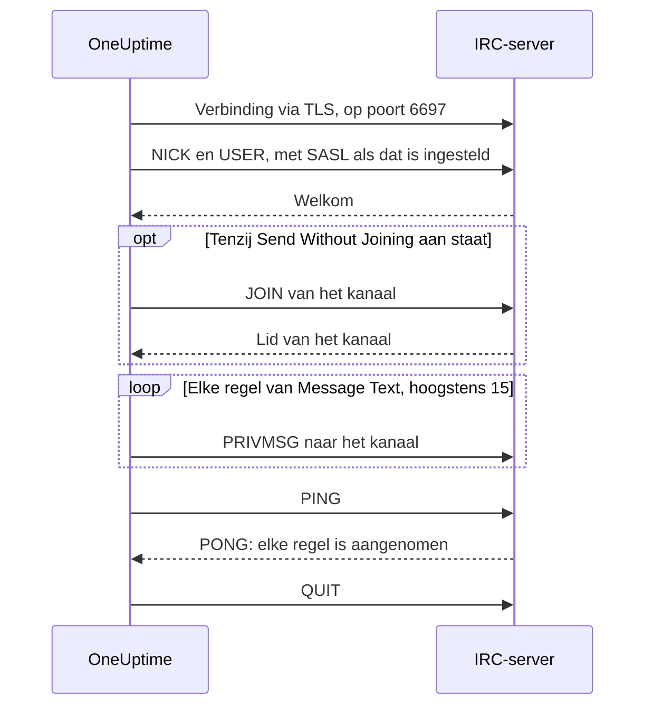

# IRC-integratie

Post incidentupdates in een kanaal op elk IRC-netwerk: Libera.Chat, OFTC of je eigen server.

IRC heeft geen webhooks, dus de workflowstap **Send Message to IRC** van OneUptime maakt zelf verbinding met de server, net als elke IRC-client. Er valt niets te installeren en geen app te registreren. Deze integratie is **outbound**: OneUptime post in het kanaal en leest niet mee met wat daar gezegd wordt.

:::cards
- [Hoe het werkt](#hoe-het-werkt): Wat één run van de stap tegen de server zegt.
- [Instellen](#de-integratie-instellen): Server en kanaal, wachtwoorden en dan de workflow: vanuit het sjabloon of vanaf nul.
- [Tips](#tips): Posten zonder lid te worden, SASL, lange berichten en pieken.
- [Problemen oplossen](#problemen-oplossen): Wat de fouten van de stap betekenen en wat je moet aanpassen.
:::

## Hoe het werkt

Elke run van de stap voert een kort gesprek met de IRC-server, zoals een IRC-client dat zou doen, en hangt daarna op.

1. **Verbinden.** De stap maakt verbinding via TLS op poort `6697` en controleert het certificaat van de server.
2. **Registreren.** Hij registreert zich als `OneUptime`, tenzij je een andere **Nickname** instelt, en meldt zich aan met SASL als **SASL Username** en **SASL Password** zijn ingevuld.
3. **Lid worden.** Hij wordt lid van het kanaal, tenzij **Send Without Joining** aan staat, met de **Channel Key** als het kanaal er een heeft.
4. **Versturen.** Elke regel van **Message Text** gaat de deur uit als een eigen IRC-bericht, een `PRIVMSG`.
5. **Bevestigen.** IRC zegt nooit "afgeleverd", dus de stap stuurt een `PING` en wacht op de `PONG` van de server. Een server antwoordt op volgorde, dus tegen die tijd is elke weigering van het bericht al binnen.
6. **Afsluiten.** Hij verlaat de server.

De stap neemt zijn uitgang **Succes** zodra de server elke regel heeft aangenomen. Hij neemt **Fout**, met de reden in de eigen woorden van de server als die ze gaf, wanneer de server niet bereikbaar is of de verbinding, de nickname, een wachtwoord, het kanaal of het bericht weigert.

## Voordat je begint

- Op OneUptime Cloud het **Growth**-abonnement of een hoger abonnement: workflows en hun variabelen horen daarbij. Zelf gehoste installaties zonder facturering hebben geen abonnementslimieten.
- Een rol die workflows bouwt: **Project Owner**, **Project Admin** of **Workflow Admin**.
- Een account op het IRC-netwerk, als het wil dat je je aanmeldt. Libera.Chat vraagt dat voor verbindingen vanaf sommige cloud- en VPN-adressen.

## De integratie instellen

:::steps
### Een server en een kanaal kiezen

Bepaal waar de berichten heen gaan: de hostnaam van de server, bijvoorbeeld `irc.libera.chat`, en het kanaal, bijvoorbeeld `#your-channel`.

- **IRC Server** neemt de hostnaam en verder niets: geen `ircs://` en geen poort. De stap maakt verbinding via TLS op poort `6697`. Neemt je server TLS aan op een andere poort, zet die dan in **Port**, onder **Meer velden**.
- **Channel** moet een kanaal zijn. Een nickname die je daar typt, wordt geweigerd, zodat de stap nooit per ongeluk iemand een privébericht stuurt.

De server moet er een zijn waarmee OneUptime verbinding mag maken. Loopback-adressen (`localhost`, `127.0.0.1`), link-local-adressen en cloudmetadata-adressen worden altijd geweigerd. Op OneUptime Cloud wordt ook een server op een privénetwerkadres geweigerd. Een zelf gehoste installatie kan een IRC-server in het eigen netwerk bereiken, tenzij `DATA_SOURCE_BLOCK_PRIVATE_ADDRESSES` op `true` staat.

### Wachtwoorden opslaan als geheime variabelen

Sla deze stap over als je server, netwerk en kanaal geen wachtwoord nodig hebben. Sla anders elk wachtwoord op als geheime [globale variabele](/docs/workflows/variables#globale-variabelen). De workflow bevat dan de naam van de variabele in plaats van het wachtwoord, en je wijzigt het wachtwoord op één plek.

| Instelling          | Vul in als                                                                                           | Variabele, bijvoorbeeld |
| ------------------- | ---------------------------------------------------------------------------------------------------- | ----------------------- |
| **Server Password** | De server of je bouncer om een wachtwoord vraagt bij het verbinden.                                  | `IRC_SERVER_PASSWORD`   |
| **SASL Password**   | Het netwerk wil dat je je aanmeldt bij je account. **SASL Username** krijgt de naam van het account. | `IRC_SASL_PASSWORD`     |
| **Channel Key**     | Het kanaal een sleutel heeft (modus `+k`).                                                           | `IRC_CHANNEL_KEY`       |

Om er een op te slaan, open je **Workflows → Globale variabelen** en klik je op **Workflow Variabele aanmaken**. Vul de naam in bij **Naam** en klik op **Volgende**. Plak het wachtwoord in **Inhoud**, zet **Geheim** aan en klik op **Workflow Variabele aanmaken**. Run-logboeken tonen `[REDACTED]` in plaats van de waarde van een geheime variabele.

### De workflow bouwen

Begin met het sjabloon, dat de hele workflow voor je bouwt, of vanaf nul.

:::tabs
@tab Vanuit het sjabloon
1. Open **Workflows** en klik op **Workflow maken**.
2. Typ `IRC` in **Sjablonen zoeken…**, klik op **Tell IRC when an incident opens** en daarna op **Dit sjabloon gebruiken**.
3. Houd de naam **Notify IRC on new incident** of wijzig hem, en klik op **Volgende**.
4. Vul **IRC Server** en **IRC Channel** in en klik op **Workflow maken**.

De workflow opent in de **Bouwer** met drie stappen: **On Create Incident**; **Send Message to IRC**, die het nummer, de titel, de ernst en de status van het incident in twee regels post; en een **Logboek**-stap op zijn uitgang **Fout**, die vastlegt waarom een bericht niet is afgeleverd. De server en het kanaal worden opgeslagen als de variabelen `ircServer` en `ircChannel` van de workflow. Heb je in de vorige stap wachtwoorden opgeslagen, klik dan op **Send Message to IRC**, open **Meer velden** en kies elke variabele met de knop **{ }** van de instelling.
@tab Vanaf nul
1. Open **Workflows**, klik op **Workflow maken**, kies **Vanaf nul beginnen**, geef de workflow een naam en klik op **Workflow maken**.
2. Klik in de **Bouwer** op **Choose what starts this workflow** en kies **On Create Incident** onder **Popular**. Klik op de trigger en kies in **Select Fields** de velden van het incident die je bericht toont, bijvoorbeeld de titel.
3. Klik op **Component toevoegen**, zoek op `irc` en klik op **Send Message to IRC**. Verbind de uitgang **Succes** van de trigger met deze stap.
4. Klik op de nieuwe stap en vul **IRC Server**, **Channel** en **Message Text** in. De knop **{ }** in **Message Text** voegt velden van het incident in, bijvoorbeeld de titel.
5. Heb je in de vorige stap wachtwoorden opgeslagen, open dan **Meer velden**. Klik in **Server Password**, **SASL Password** of **Channel Key** op **{ }** en kies de variabele onder **Global variables**. Zet de naam van je account in **SASL Username**.
:::

### Aanzetten en testen

Zet de schakelaar **Ingeschakeld** bovenaan de **Bouwer** aan. Vanaf dan wordt elk nieuw incident in het kanaal gepost.

Om te testen zonder een incident te openen, klik je op **Workflow uitvoeren** en zet je de ID van een incident dat je al hebt in **Incident-ID**. De pagina van het incident toont de ID. Klik op **Run Workflow Manually** en bevestig met **Run**. Het paneel **Workflow-uitvoering** volgt de run: het logboek van de IRC-stap zegt hoeveel regels hij heeft verstuurd, bijvoorbeeld `Sent 2 lines to #your-channel.`, en het bericht verschijnt in het kanaal. Neemt de stap in plaats daarvan **Fout**, dan zegt het logboek waarom: zie [Problemen oplossen](#problemen-oplossen).
:::

## Tips

- **Posten zonder lid te worden.** De meeste kanalen nemen alleen berichten van hun leden aan (modus `+n`), dus de stap wordt lid voordat hij post en vertrekt direct daarna. Een kanaal met `-n` neemt berichten van buiten aan: zet **Send Without Joining** aan onder **Meer velden**, en het kanaal ziet de stap niet komen en gaan.
- **Aanmelden met SASL.** Vul op netwerken die SASL gebruiken, zoals Libera.Chat, **SASL Username** en **SASL Password** in om je aan te melden bij je account. Libera.Chat eist dat voor verbindingen vanaf sommige cloud- en VPN-adressen. Zie [de SASL-handleiding van Libera.Chat](https://libera.chat/guides/sasl).
- **Let op de grens van 15 regels.** Elke regel van **Message Text** is een eigen IRC-bericht, een lange regel wordt passend opgesplitst en lege regels vallen weg. Een bericht gaat als hoogstens 15 IRC-regels de deur uit: een langer bericht wordt ingekort, en de laatste regel zegt dat. De eerste vier regels gaan meteen weg en de rest één per seconde, het tempo van IRC-clients, dus 15 regels duren ongeveer 11 seconden.
- **Bundel pieken in één bericht.** Elke run is een eigen verbinding, en IRC-netwerken beperken hoe vaak één adres verbinding mag maken. Een piek van runs kan worden geweigerd met een reden als `Reconnecting too fast`, en neemt **Fout** zoals elke andere weigering. Voor een workflow die vele keren per minuut kan afgaan, bundel je wat hij te zeggen heeft in één bericht, of stuur je het via een eigen server.
- **Opmaken met de codes van IRC.** IRC heeft geen Markdown, dus de tekst gaat de deur uit zoals hij is getypt. De opmaakcodes van IRC, zoals vet en kleuren, werken.
- **Een server zonder TLS.** Zet **Disable TLS** alleen aan voor een server die geen TLS aanbiedt: de stap maakt dan verbinding op poort `6667`, en elk wachtwoord wordt onversleuteld verstuurd. Om het certificaat van een server van je eigen certificaatautoriteit te vertrouwen, stelt een zelf gehoste installatie in plaats daarvan `NODE_EXTRA_CA_CERTS` in.
- **Een andere nickname.** Berichten komen van `OneUptime`, tenzij je **Nickname** instelt. Is de nickname bezet, dan voegt de stap een underscore of een getal toe.

## Problemen oplossen

Als de stap **Fout** neemt, zegt het run-logboek waarom, in een zin die begint zoals een van deze.

:::details "The IRC server refused the connection"
De server, of je bouncer, heeft de verbinding geweigerd, en de melding eindigt met de reden. Als de server een wachtwoord wil, zegt de melding dat: vul **Server Password** in, of controleer het.
:::

:::details "SASL sign-in failed"
Het netwerk heeft het account of het wachtwoord afgewezen. Controleer **SASL Username** en **SASL Password**.
:::

:::details "Could not join #your-channel"
Het kanaal heeft de stap geweigerd, om de reden die de melding geeft. Een kanaal met een sleutel heeft die nodig in **Channel Key**.
:::

:::details "Could not send to #your-channel"
De server heeft het bericht geweigerd, om de reden die de melding geeft. Met **Send Without Joining** aan neemt het kanaal misschien alleen berichten van zijn leden aan: zet het uit.
:::

:::details "The TLS certificate of the IRC server … is not trusted"
Het certificaat van de server is er geen dat OneUptime vertrouwt. Een zelf gehoste installatie kan haar eigen certificaatautoriteit vertrouwen met `NODE_EXTRA_CA_CERTS`. Zet **Disable TLS** alleen aan voor een server die geen TLS aanbiedt.
:::

## Volgende stappen

:::cards
- [Componenten → IRC](/docs/workflows/components#irc): Elke instelling van de stap en wat de uitgangen betekenen.
- [Variabelen](/docs/workflows/variables#globale-variabelen): Geheime globale variabelen en hoe stappen ze gebruiken.
- [Runs](/docs/workflows/runs-and-logs): Lees wat elke run van de workflow heeft gedaan.
- [Overzicht van integraties](/docs/integrations/index): Het outbound-patroon en de andere tools die je kunt koppelen.
:::
