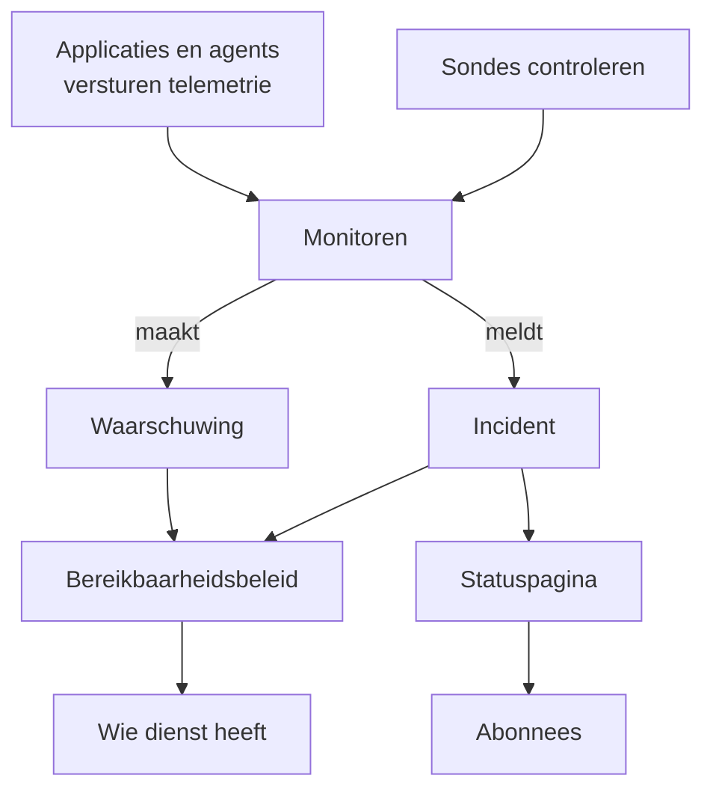

# Kernbegrippen

OneUptime heeft veel producten, maar ze rusten op een handvol ideeën: projecten, monitoren, incidenten en waarschuwingen, bereikbaarheid, statuspagina's en telemetrie. Deze pagina legt elk idee in een paar zinnen uit, laat zien hoe ze samenhangen en verwijst naar de pagina's die ze uitgebreid behandelen. Lees haar één keer, en elke andere pagina van de documentatie leest makkelijker.

:::cards
- [Projecten en mensen](#projecten-en-mensen): Waar alles staat, en wie wat mag.
- [Monitoren en sondes](#monitoren-en-sondes): Hoe OneUptime merkt dat er iets mis is.
- [Incidenten en waarschuwingen](#incidenten-en-waarschuwingen): Het dossier waarmee uw team werkt.
- [Bereikbaarheid](#bereikbaarheid): Wie wordt opgeroepen, hoe, en wie de volgende is.
:::

## Hoe de onderdelen samenhangen

Een probleem gaat in één richting door OneUptime. Sondes en uw eigen telemetrie voeden monitoren. De criteria van een monitor bepalen wanneer er iets mis is en wat er wordt geopend: een incident, een waarschuwing of beide. Bereikbaarheidsbeleid roept mensen erover op, en statuspagina's informeren uw klanten over incidenten.

## Projecten en mensen

Een **project** bevat alles: monitoren, incidenten, bereikbaarheidsbeleid, statuspagina's, telemetrie en instellingen. De meeste bedrijven hebben er één nodig, sommige houden er één per omgeving of bedrijfsonderdeel aan. Niets wat u in het ene project maakt, is zichtbaar in een ander.

Uw **account** staat los van uw projecten. Eén account, met één e-mailadres en wachtwoord, kan bij zoveel projecten horen als u wilt; wissel ertussen met de projectkiezer linksboven. Zie [Uw account](/docs/introduction/your-account).

Mensen horen bij een project via **teams**, en de machtigingen van een team bepalen wat de leden mogen doen. Elk nieuw project begint met drie teams: Owners, met u erin, Admin en Members. Bij OneUptime Cloud heeft elk project een eigen abonnement.

:::cards
- [Gebruikers, teams en machtigingen](/docs/permissions/index): Mensen uitnodigen en bepalen wat ze mogen doen.
:::

## Monitoren en sondes

Een **monitor** controleert één ding dat u draait en beslist of het werkt. De meeste monitoren worden gecontroleerd door **sondes**: machines die de controle volgens een schema uitvoeren, zoals een pagina opvragen, een API aanroepen, een host pingen of een database bevragen. OneUptime Cloud draait sondes in meerdere regio's, een zelf-gehoste installatie draait haar eigen, en u kunt aangepaste sondes in uw netwerk toevoegen. Andere monitoren lezen juist wat u verstuurt: de telemetrie van uw applicaties, of de gegevens die een agent vanaf uw servers, Kubernetes-clusters en overige infrastructuur doorgeeft.

De **criteria** van een monitor bepalen wat elk resultaat betekent. Ze worden op volgorde bekeken, en de eerste die past kan de status van de monitor wijzigen, een incident melden, een waarschuwing aanmaken, of alle drie. Elk nieuw project heeft drie monitorstatussen: **Operationeel**, **Verminderd** en **Offline**.

:::cards
- [Een monitor maken](/docs/monitor/create-monitor): Een type kiezen, zeggen wat er gecontroleerd wordt en hoe vaak.
- [Aangepaste probes](/docs/probe/custom-probe): Controleren wat alleen uw eigen netwerk bereikt.
:::

## Incidenten en waarschuwingen

Beide leggen een probleem vast, en beide kunnen degene oproepen die dienst heeft. Het verschil zit in wie het probleem raakt.

| | Incident | Waarschuwing |
| --- | --- | --- |
| **Wat het is** | Een probleem dat uw gebruikers raakt, zoals een storing of een vertraging | Een probleem waar uw team naar moet kijken voordat gebruikers er last van hebben |
| **Op statuspagina's** | Kan verschijnen, en informeert abonnees | Nooit |
| **Beginstatussen** | **Identified**, **Bevestigd**, **Opgelost** | **Identified**, **Bevestigd**, **Opgelost** |
| **Begin-ernstniveaus** | Critical Incident, Major Incident, Minor Incident | **High**, **Low** |

Bevestigen zegt dat iemand ermee bezig is, en houdt het bereikbaarheidsbeleid tegen om het volgende niveau op te roepen. Oplossen sluit het af. U kunt eigen statussen en ernstniveaus toevoegen, en waarschuwingen koppelen aan het incident waar ze bij bleken te horen.

Een **episode** groepeert gerelateerde incidenten, of gerelateerde waarschuwingen, zodat uw team ze als één geheel afhandelt. Groeperingsregels bepalen wat bij elkaar hoort.

:::cards
- [Incidenten – Overzicht](/docs/incidents/index): Hoe incidenten worden gemeld, afgehandeld en opgelost.
- [Gekoppelde waarschuwingen](/docs/incidents/linked-alerts): De waarschuwingen van een storing aan het incident koppelen.
:::

## Bereikbaarheid

Een **bereikbaarheidsbeleid** bepaalt wie wordt opgeroepen over een incident of waarschuwing, en wie de volgende is als niemand reageert. De **escalatieregels** zijn de niveaus: elk niveau roept zijn mensen op en wacht tot iemand bevestigt, voordat het volgende niveau wordt opgeroepen. Een niveau kan mensen, teams of een **bereikbaarheidsschema** oproepen, een rooster dat op elk moment weet wie dienst heeft.

Hoe iemand bereikt wordt, bepaalt die persoon zelf. In de **Gebruikersinstellingen** legt ieder vast hoe OneUptime hem kan bereiken, zoals e-mail, sms, oproepen, pushmeldingen, Slack of Microsoft Teams, en welke daarvan bij een oproep worden gebruikt.

:::cards
- [Escalatieregels](/docs/on-call/escalation-rules): Mensen niveau voor niveau oproepen tot iemand reageert.
- [Bereikbaarheidsschema's](/docs/on-call/schedules): Roosters, lagen en overdrachten.
:::

## Statuspagina's en onderhoud

Een **statuspagina** laat uw klanten zien of uw services werken. U kiest welke monitoren ze toont, onder namen die uw klanten begrijpen. Zolang een incident op een van die monitoren actief is, toont de pagina het, en krijgen haar **abonnees** bericht per e-mail, sms, Slack, Microsoft Teams of webhook. Een statuspagina kan openbaar zijn, of privé voor de mensen die u toelaat.

**Gepland onderhoud** kondigt gepland werk vooraf aan. Een gebeurtenis doorloopt **Gepland**, **Lopend**, **Beëindigd** en **Voltooid**, en de statuspagina's waarop u haar toont informeren bezoekers en abonnees erover.

:::cards
- [Statuspagina's – Overzicht](/docs/status-pages/index): Een statuspagina aanmaken en bepalen wat ze toont.
- [Abonnees en aankondigingen](/docs/status-pages/subscribers): Wie bericht krijgt, en wanneer.
:::

## Telemetrie

**Telemetrie** is wat uw systemen naar OneUptime sturen: logs, metrics, traces, exceptions en profielen. Applicaties versturen haar met OpenTelemetry, en de agents van OneUptime versturen haar vanaf hosts, Kubernetes-clusters, Docker-hosts en overige infrastructuur. Elke afzender gebruikt een **ingestiesleutel**, aangemaakt onder **Projectinstellingen → Telemetrie & APM → Ingestiesleutels**. U doorzoekt telemetrie, zet haar op dashboards en bewaakt haar met telemetriemonitoren, die net als elke andere monitor incidenten en waarschuwingen openen.

:::cards
- [OpenTelemetry](/docs/telemetry/open-telemetry): Logs, metrics en traces vanuit uw applicaties versturen.
- [Logs-monitor](/docs/monitor/logs-monitor): Horen wanneer een patroon in uw logs opduikt.
:::

## Automatisering en AI

- **Workflows** voeren acties uit wanneer er iets gebeurt, zoals een bericht in Slack plaatsen wanneer een incident wordt gemeld.
- **Runbooks** zetten een responsprocedure om in stappen die uw team met de hand of automatisch kan uitvoeren.
- **OneUptime AI** onderzoekt nieuwe incidenten en waarschuwingen en zet wat het heeft gevonden op hun tijdlijn, en **Ask AI** beantwoordt vragen over uw project. Een nieuw project begint met AI aan; de schakelaar **AI inschakelen** onder **Projectinstellingen → AI → AI Features** zet het allemaal uit.

:::cards
- [Workflows – Overzicht](/docs/workflows/index): Acties automatiseren met triggers en componenten.
- [AI SRE](/docs/ai/ai-sre): Hoe OneUptime AI incidenten en waarschuwingen onderzoekt.
:::

## Labels en eigenaren

**Labels** zijn tags die u op monitoren, incidenten, statuspagina's en de meeste andere resources zet, om ze te filteren en te groeperen. De machtigingen van een team kunnen beperkt worden tot resources met bepaalde labels. **Eigenaren** zijn de mensen en teams die verantwoordelijk zijn voor één resource: zij krijgen bericht wanneer er iets mee gebeurt. Label- en eigenaarsregels voegen voor u labels en eigenaren toe aan nieuwe resources.

:::cards
- [Label- en eigenaarsregels](/docs/configuration/label-and-owner-rules): Nieuwe resources automatisch labelen en eigenaren geven.
:::

## Volgende stappen

:::cards
- [Snelstart](/docs/introduction/quickstart): Deze ideeën in vijftien minuten in de praktijk brengen.
- [Startpagina en sneltoetsen](/docs/introduction/home): Elk product in het dashboard vinden.
- [Een monitor maken](/docs/monitor/create-monitor): Uw eerste monitor, veld voor veld.
- [Incidenten – Overzicht](/docs/incidents/index): Wat er gebeurt nadat een monitor een incident meldt.
:::
