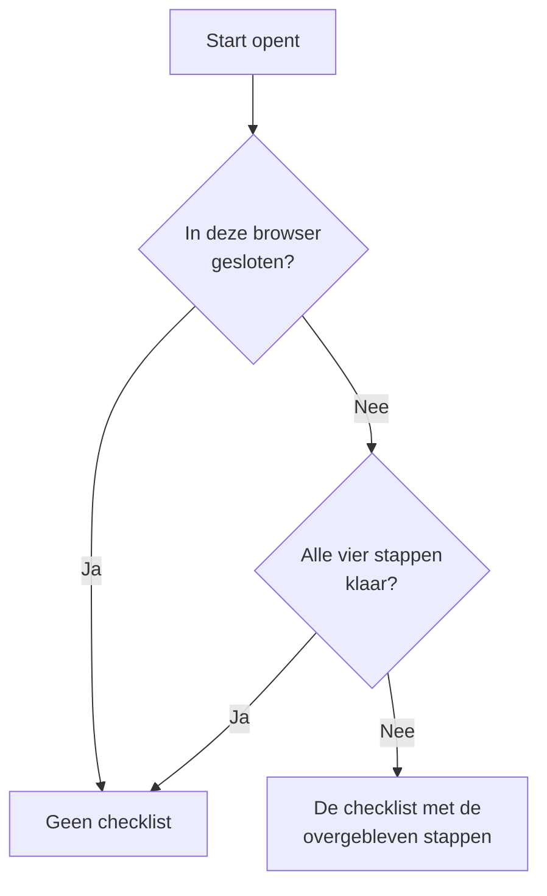

# Startpagina en sneltoetsen

Start is de eerste pagina die u in een project ziet. Ze laat in één oogopslag zien of er nu iets is dat u nodig heeft, en begeleidt een nieuw project door de eerste inrichting. Deze pagina legt uit wat Start toont, hoe u elk product, elke pagina of actie in het dashboard vindt, en de sneltoetsen die u tochten door menu's besparen.

:::cards
- [Wat Start toont](#wat-start-toont): De welkomstchecklist, de vijf tegels en de actieve incidenten.
- [Uw weg vinden](#uw-weg-vinden): Het menu Producten en de balken boven aan elke pagina.
- [Zoeken](#zoeken-naar-een-pagina-een-instelling-of-een-actie): Elke pagina, instelling of actie vinden door de naam te typen.
- [Sneltoetsen](#sneltoetsen): Met twee toetsen naar Start, Monitoren of Incidenten.
:::

## Wat Start toont

Open **Start** in de balk bovenaan, of druk vanaf elke plek op `g` en dan `h`. Van boven naar beneden toont Start:

1. **Welkom bij OneUptime 👋**, een checklist voor een nieuw project, tot die klaar is.
2. Vijf tegels die tellen wat aandacht nodig heeft.
3. **Actieve incidenten**, elk incident dat nog niet is opgelost.

### De welkomstchecklist

De checklist leidt u langs de vier dingen die een project nodig heeft voordat het nuttig is. Elke stap opent de pagina waar u hem uitvoert, en vinkt zichzelf af zodra het project heeft wat erom wordt gevraagd.

| Stap | Klaar wanneer | Opent |
| --- | --- | --- |
| **Maak je eerste monitor** | Het project een monitor heeft. | Het formulier **Monitor maken**, of de lijst **Monitoren** voor iemand die geen monitoren mag aanmaken. |
| **Publiceer een statuspagina** | Het project een statuspagina heeft. | **Statuspagina's** |
| **Nodig je team uit** | Iemand anders dan u in het project zit, of is uitgenodigd. | **Gebruikers** |
| **Stel een bereikbaarheidsbeleid in** | Het project een bereikbaarheidsbeleid heeft. | **Bereikbaarheidsdienst** |

Onder de stappen toont **Hoe OneUptime werkt** de vier kernproducten in de volgorde waarin een probleem ze doorloopt: **Monitoren**, **Incidenten & waarschuwingen**, **Bereikbaarheidsdienst** en **Statuspagina's**. Klik op een ervan om het te openen.

De checklist verdwijnt zodra alle vier stappen klaar zijn. Om hem eerder te verbergen, klikt u op **Sluiten**. Dat wordt onthouden in deze browser, voor dit project; alles wat de stappen openen, staat nog steeds in het menu **Producten**.

### De tegels

Elke tegel telt iets, zegt of dat uw aandacht nodig heeft, en opent de lijst achter het getal.

| Tegel | Wat ze telt | Als het getal nul is |
| --- | --- | --- |
| **Actieve incidenten** | Incidenten die niet zijn opgelost | **Alles in orde** |
| **Actieve waarschuwingen** | Waarschuwingen die niet zijn opgelost | **Alles in orde** |
| **Niet-operationele monitoren** | Monitoren waarvan de status geen operationele status is. Gearchiveerde monitoren tellen niet mee. | **Alle operationeel** |
| **Lopend onderhoud** | Geplande onderhoudsgebeurtenissen die nu lopen | **Geen lopend** |
| **SLO's in gevaar** | Ingeschakelde SLO's die in gevaar zijn of hun foutbudget hebben opgebruikt | **Budgetten gezond** |

Een getal boven nul toont **Vraagt aandacht**, of **Bezig** en **Budget raakt op** op de tegels voor onderhoud en SLO's. Een project zonder monitoren ziet **Nog geen monitoren** op de monitortegel, en een project zonder SLO's ziet **Nog geen SLO's**: een leeg project is niet hetzelfde als een gezond project. Die twee tegels openen dan de lijsten **Monitoren** en **SLOs**, waar u er een aanmaakt.

### Het zijmenu van Start

Het zijmenu naast Start bevat dezelfde lijsten, elk met een teller:

| Sectie | Pagina's |
| --- | --- |
| **Incidenten** | **Actieve incidenten** en **Actieve episodes** |
| **Waarschuwingen** | **Actieve waarschuwingen** en **Actieve episodes** |
| **Monitoren** | **Niet operationeel** |
| **Geplande gebeurtenissen** | **Lopend** |

Een episode groepeert gerelateerde incidenten of waarschuwingen, zodat u ze als één geheel afhandelt. Zie [Kernbegrippen](/docs/introduction/core-concepts#incidenten-en-waarschuwingen).

## Uw weg vinden

Alles in OneUptime staat onder **Producten** in de bovenste balk. Het menu toont zijn groepen als de rijen van één lijst, en opent altijd met de eerste ervan, de essenties, uitgeklapt: Monitoren, Incidenten, Waarschuwingen, Bereikbaarheidsdienst, Statuspagina's, Geplande onderhoud en SLOs. Elke andere groep (Observability, AI, Code, Bronnen, Infrastructuur, Dashboards & automatisering en Instellingen) is ingeklapt tot een rij van dezelfde lijst. Elke rij noemt de producten van de groep en zegt hoeveel het er zijn. Klik op een rij om hem uit of in te klappen, of ga er met de pijltjestoetsen naartoe en druk op **Enter**.

- **Zoeken vindt alles.** Typ in het zoekvak van het menu om elk product te vinden op naam, op wat het doet, of op een bekend woord zoals `k8s` of `RUM`. Zoeken kijkt ook in de ingeklapte groepen.
- **U begint waar u bent.** De groep van de pagina waarop u bent, klapt vanzelf uit, en de producten die u onlangs hebt geopend, staan bovenaan.
- **Uw keuzes blijven.** Het menu onthoudt in uw browser welke van de andere groepen u hebt uit- of ingeklapt. De essenties zijn elke keer dat u het menu opent weer uitgeklapt, ook als u ze had ingeklapt.
- **Op een telefoon** toont de menuknop de producten op dezelfde manier: de essenties uitgeklapt bovenaan, en elke andere groep als één rij die met een tik opent.

### De balken bovenaan

Twee balken lopen bovenaan over elke pagina.

| Waar | Wat er staat |
| --- | --- |
| Linksboven | De projectkiezer: naar een ander van uw projecten wisselen, of een nieuw aanmaken. |
| Rechtsboven | **Zoeken** en **Ask AI**, de meldingenbel met wat u nu nodig heeft (actieve incidenten en waarschuwingen, het bereikbaarheidsbeleid waarin u dienst hebt, openstaande uitnodigingen), **Hulp**, en uw foto, die het menu van uw [account](/docs/introduction/your-account) opent. |
| Daaronder | **Start** en **Producten** links, **Gebruikersinstellingen** rechts: hoe OneUptime u in dit project bereikt. |

**Hulp** opent deze documentatie (**Documentatie**) en de lijst **Keyboard shortcuts**, en biedt ondersteuning per e-mail en op Slack. Op een smal scherm, zoals een telefoon, verdwijnen **Zoeken**, **Ask AI** en **Hulp** om ruimte te besparen; de bel en uw foto blijven.

## Zoeken naar een pagina, een instelling of een actie

Druk op **Cmd+K** (Mac) of **Ctrl+K** (Windows en Linux), of klik op het zoekpictogram in de bovenste balk, en begin te typen. Zoeken vindt:

- **Elke pagina in de menu's**, onder de naam die het menu haar geeft: API-sleutels, Gevarenzone, Bereikbaarheidsschema's, Ernst van incident, uw eigen Meldingsmethoden. Elk resultaat zegt waar het staat, zoals *Projectinstellingen › Geavanceerd*, zodat pagina's met dezelfde naam (Aangepaste velden bij Incidenten, Waarschuwingen en Monitoren) makkelijk uit elkaar te houden zijn.
- **Acties**, naar wat u wilt doen: Incident melden, Monitor maken of Delete Project, dat de Gevarenzone opent. Een actie die iets verandert, wordt alleen aangeboden aan wie die mag uitvoeren.
- **Uw monitoren, incidenten, waarschuwingen, statuspagina's en bereikbaarheidsbeleid**, op naam.

Zoeken leest wat u typt zoals u het bedoelt:

- Hoofdletters, accenten, spaties en koppeltekens maken niet uit: *on-call*, *on call* en *oncall* vinden dezelfde pagina's, en woorden mogen in elke volgorde staan.
- Het kent voor veel pagina's andere woorden, in het Engels: *pager* of *escalation* voor Bereikbaarheidsbeleid, *rota* voor Bereikbaarheidsschema's, *2fa* voor tweestapsverificatie, *delete project* voor de Gevarenzone.
- Voeg de naam van het product toe om een zoekopdracht te verfijnen: *incident custom fields* vindt de pagina Aangepaste velden van Incidenten.
- Een kleine tikfout, zoals *incidnet*, vindt nog steeds wat u bedoelde als niets exact overeenkomt.

Met een leeg zoekvak toont Zoeken de pagina's die u onlangs hebt geopend, de acties en de producten.

## Sneltoetsen

Druk overal in het dashboard op `?` om alle sneltoetsen te zien, of open **Hulp** en kies **Keyboard shortcuts**. Op een Mac is `Mod` de Command-toets; op Windows en Linux is het Ctrl.

| Toetsen | Wat ze doen |
| --- | --- |
| `Mod` + `K` | Het opdrachtpalet openen: zoeken naar elke pagina, instelling of actie. |
| `Mod` + `I` | De AI een vraag stellen over waar u naar kijkt. |
| `/` | De lijst op deze pagina doorzoeken. |
| `?` | De sneltoetsen tonen. |
| `Esc` | Een dialoogvenster of paneel sluiten. |

### Naar een product gaan

Druk op `g` en dan op een letter om direct naar een product te gaan. Druk de letter binnen anderhalve seconde na `g`.

| Toetsen | Gaat naar |
| --- | --- |
| `g` dan `h` | Start |
| `g` dan `m` | Monitoren |
| `g` dan `i` | Incidenten |
| `g` dan `a` | Waarschuwingen |
| `g` dan `o` | Bereikbaarheidsdienst |
| `g` dan `s` | Statuspagina's |
| `g` dan `e` | Geplande onderhoud |
| `g` dan `d` | Dashboards |
| `g` dan `l` | Logboeken |
| `g` dan `t` | Traces |

De sneltoetsen zitten u niet in de weg. `?`, `/` en `g` doen niets terwijl u in een veld typt, en zolang een dialoogvenster open is, navigeert niets weg, dus een verdwaalde toets kan u geen half ingevuld formulier kosten. Elk ander product is met `Mod` + `K` één zoekopdracht verwijderd.

## Volgende stappen

:::cards
- [Snelstart](/docs/introduction/quickstart): De welkomstchecklist stap voor stap doorlopen.
- [Uw account](/docs/introduction/your-account): Uw profiel, de beveiliging van uw aanmelding, taal en thema.
- [AI vragen](/docs/ai/ask-ai): Wat Ask AI voor u kan beantwoorden en doen.
- [Kernbegrippen](/docs/introduction/core-concepts): Wat monitoren, incidenten, waarschuwingen en bereikbaarheid zijn.
:::
