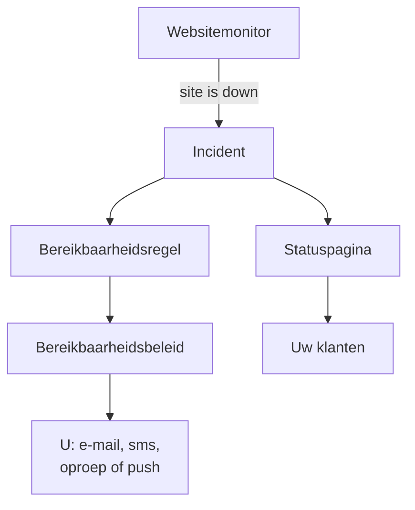

# Snelstart

Deze handleiding brengt u in ongeveer vijftien minuten van een nieuw account naar een werkende inrichting: een monitor die uw website elke vijf minuten controleert, een bereikbaarheidsbeleid dat u oproept wanneer de site uitvalt, en een statuspagina die uw klanten informeert. Ze volgt de checklist **Welkom bij OneUptime 👋** op de startpagina van uw project.

## Voordat u begint

- **Een account.** Registreer u bij OneUptime Cloud op [oneuptime.com](https://oneuptime.com/accounts/register) en open de link in de e-mail die u ontvangt. Op uw eigen installatie opent u die in uw browser en registreert u zich: het eerste account wordt de hoofdbeheerder. Hoe u er een installeert, leest u in [Docker Compose](/docs/installation/docker-compose).
- **Een website om te bewaken.** Elk adres dat via HTTP of HTTPS antwoordt, zoals de homepage van uw bedrijf.

## Een project aanmaken

In OneUptime staat alles in een project: uw monitoren, incidenten, bereikbaarheidsbeleid, statuspagina's en de mensen die eraan werken.

:::steps
### Een nieuw project beginnen

De eerste keer dat u inlogt, toont OneUptime **Geen projecten**. Klik op **Nieuw project aanmaken**. Heeft iemand u al voor een project uitgenodigd, accepteer de uitnodiging dan op dezelfde pagina.

### Een naam geven

Voer een **Projectnaam** in, bijvoorbeeld de naam van uw bedrijf. Bij OneUptime Cloud kiest u in de volgende stap een abonnement.

### Het project aanmaken

Klik op **Project maken**. De startpagina van uw project opent, met bovenaan de checklist **Welkom bij OneUptime 👋**.
:::

## Uw website bewaken

:::steps
### Monitor maken openen

Klik in de checklist op **Maak je eerste monitor**. U kunt ook **Monitoren** openen vanuit het menu **Producten** en op **Monitor maken** klikken.

### Website kiezen

Kies onder **Monitortype** het type **Website**. Voer een **Naam** in, bijvoorbeeld `Website`, en klik op **Volgende**.

### Het adres invoeren

Voer het volledige adres van uw site in bij **Website-URL**, bijvoorbeeld `https://example.com`. OneUptime voegt de criteria voor u toe: de monitor wordt **Offline** en meldt een incident wanneer de site niet antwoordt, of met een fout antwoordt. Klik op **Volgende**.

### De monitor aanmaken

Laat de gekozen **Sondes** en het **Bewakingsinterval** **Elke 5 minuten** staan, en klik op **Monitor maken**. De pagina van de monitor opent, en de sondes beginnen uw site te controleren.
:::

Om de controle te proberen voordat u opslaat, klikt u in de tweede stap op **Monitor testen**. Alle andere monitortypen staan beschreven in [Een monitor maken](/docs/monitor/create-monitor).

## Opgeroepen worden bij uitval

Zoals het nu is, wordt een incident zonder eigenaren per e-mail naar de eigenaren van het project gestuurd, en daar hoort u bij. Om opgeroepen te worden tot iemand reageert, maakt u een bereikbaarheidsbeleid aan en laat u elk incident het activeren.

:::steps
### Een bereikbaarheidsbeleid aanmaken

Klik in de checklist op **Stel een bereikbaarheidsbeleid in**, of open **Bereikbaarheidsdienst** vanuit het menu **Producten**. Klik op **Bereikbaarheidsbeleid aanmaken** en voer een **Naam** in. Klik onder **Wie wordt als eerste opgeroepen?** op **Ontvanger toevoegen** en kies uzelf. Klik op **Bereikbaarheidsbeleid aanmaken**.

### Het bij elk incident activeren

Open **Incidenten** vanuit het menu **Producten**, klap **Regels** open in het zijmenu en kies **Bereikbaarheidsregels**. Klik op **Incident On-Call Rule aanmaken**, voer een **Naam** in en klik op **Volgende**. Laat **Overeenkomstcriteria** leeg, zodat de regel bij elk incident past, en klik op **Volgende**. Kies uw beleid onder **Bereikbaarheidsbeleid** en klik op **Incident On-Call Rule aanmaken**.

### Kiezen hoe u bereikt wordt

Uw inlog-e-mail is al een manier om u te bereiken. Om ook sms'jes of oproepen te krijgen, opent u **Gebruikersinstellingen** in de balk onder de bovenste balk, gaat u naar **Meldingsmethoden** en voegt u op het tabblad **Direct Contact** uw nummer toe onder **Telefoonnummers voor SMS-meldingen** of **Telefoonnummers voor oproepmeldingen**. Klik op **Verifiëren** en voer de code in die OneUptime u stuurt. Een geverifieerd nummer wordt direct gebruikt voor oproepen vanuit bereikbaarheidsdiensten.
:::

> [!NOTE]
> Sms en telefoonoproepen staan uit in een nieuw project. Een projecteigenaar, een Billing Admin of iemand met Manage Billing zet ze aan in de kaart **Meldingskanalen**, onder **Projectinstellingen → Meldingen → Meldingsinstellingen**.

Voor meer niveaus, roosters en hoe lang elk niveau wacht, zie [Escalatieregels](/docs/on-call/escalation-rules) en [Bereikbaarheidsschema's](/docs/on-call/schedules).

## Een statuspagina publiceren

:::steps
### De statuspagina aanmaken

Klik in de checklist op **Publiceer een statuspagina**, of open **Statuspagina's** vanuit het menu **Producten**. Klik op **Statuspagina maken**, voer een **Naam** in, bijvoorbeeld `Acme Status`, en klik op **Statuspagina maken**.

### Uw monitor toevoegen

Open de nieuwe statuspagina. Kies in het zijmenu, onder **Middelen**, het item **Monitoren**; in projecten met monitorgroepen ingeschakeld heet het **Middelen**. Klik op **Monitor toevoegen**, kies uw websitemonitor en klik op **Monitor toevoegen**. De rij toont bezoekers de naam van de monitor; wijzig die desgewenst onder **Weergavenaam**.

### De pagina openen

Kies **Overzicht** in het zijmenu. De kaart **Status Page Preview URL** linkt naar uw statuspagina: open die, en uw website staat erop als operationeel.
:::

Een nieuwe statuspagina is openbaar: iedereen met het adres kan haar openen. Hoe u haar uw eigen domein, logo en kleuren geeft, leest u in [Statuspagina – branding en domeinen](/docs/status-pages/branding-and-domains).

## Uw team uitnodigen

Klik in de checklist op **Nodig je team uit**, of open **Gebruikers** vanuit het menu **Producten**, onder **Instellingen**. Klik op **Gebruiker uitnodigen**, voer het **E-mail**-adres in en kies een **Team**: het ledenteam is vooraf gekozen. Klik op **Uitnodigen**. OneUptime stuurt de uitnodiging per e-mail, en het team bepaalt wat de persoon mag doen. Zie [Gebruikers, teams en machtigingen](/docs/permissions/index).

## Uitproberen

Meld een testincident om de hele keten te zien werken.

:::steps
### Een testincident melden

Open **Incidenten** en klik op **Incident melden**. Voer een **Titel** in, bijvoorbeeld `Test incident`, kies een **Ernst van incident** en klik op **Volgende**. Kies onder **Monitoren** uw websitemonitor, zodat het incident op uw statuspagina verschijnt. Klik op **Volgende** tot u bij de samenvatting bent, en dan op **Incident melden**.

### Zien wat er gebeurt

Binnen een minuut of twee roept uw bereikbaarheidsbeleid u op, en verschijnt het incident op uw statuspagina.

### Het oplossen

Klik op de pagina van het incident op **Oplossen**. De oproepen stoppen, en het incident verdwijnt van uw statuspagina.
:::

> [!WARNING]
> Iedereen die uw statuspagina opent, ziet het testincident tot u het oplost. Voer de test uit voordat u het adres van de pagina deelt.

## Problemen oplossen

:::details Ik ben niet opgeroepen
Open het incident en kies **Bereikbaarheidsuitvoeringen** in het zijmenu: daar ziet u of uw beleid is uitgevoerd en wie het heeft opgeroepen. Is het niet uitgevoerd, controleer dan of uw bereikbaarheidsregel is ingeschakeld en het beleid noemt. Is het wel uitgevoerd, controleer dan of uw methoden onder **Gebruikersinstellingen → Meldingsmethoden** geverifieerd zijn.
:::

:::details Het incident staat niet op mijn statuspagina
Een statuspagina toont een incident wanneer een van de monitoren van het incident op de pagina staat. Controleer of het incident uw monitor bij zijn getroffen resources noemt, en of de monitor op de statuspagina staat.
:::

:::details De monitor zegt offline, maar mijn site werkt
Open de monitor en bekijk wat de sondes hebben ontvangen. Zie het gedeelte over problemen oplossen in [Website-monitor](/docs/monitor/website-monitor).
:::

## Volgende stappen

:::cards
- [Kernbegrippen](/docs/introduction/core-concepts): De ideeën achter wat u net hebt ingericht.
- [Bereikbaarheidsschema's](/docs/on-call/schedules): De bereikbaarheid met uw team delen.
- [Statuspagina – branding en domeinen](/docs/status-pages/branding-and-domains): De statuspagina uw eigen maken.
- [OpenTelemetry](/docs/telemetry/open-telemetry): Logs, metrics en traces vanuit uw applicaties versturen.
:::
