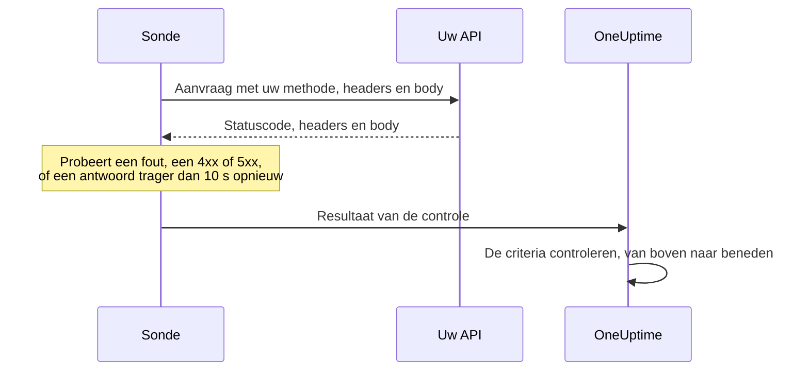

# API-monitor

Een API-monitor roept volgens een schema een HTTP-endpoint aan, met de methode, de headers en de body die u kiest, en controleert wat er terugkomt: de statuscode, de reactietijd, de headers en de body. Gebruik hem voor REST-, JSON- en GraphQL-endpoints, gezondheidscontroles en elke aanroep waarvan uw gebruikers afhankelijk zijn.

:::cards
- [De monitor maken](#een-api-monitor-maken): Zes stappen in het dashboard.
- [Configuratieopties](#configuratieopties): Methode, headers, body, omleidingen, certificaten, time-outs en nieuwe pogingen.
- [Bewakingscriteria](#bewakingscriteria): Wat standaard als bereikbaar of uitgevallen telt.
- [Problemen oplossen](#problemen-oplossen): Wanneer een controle mislukt die zou moeten slagen.
:::

## Hoe het werkt

Bij elke controle stuurt een sonde de aanvraag, volgt omleidingen en legt de statuscode, de reactietijd, de headers en de body vast. Een aanvraag die mislukt, een time-out bereikt, antwoordt met een status `4xx` of `5xx`, of langer duurt dan 10 seconden, wordt opnieuw geprobeerd, tot het aantal nieuwe pogingen dat u toestaat. Daarna haalt OneUptime het resultaat door de criteria van de monitor.



Een sonde die haar eigen netwerkverbinding kwijt is, meldt geen resultaat, en kan uw API dus niet als offline markeren.

## Voordat u begint

- **Een rol die monitoren mag maken**: Project Owner, Project Admin, Project Member, Monitor Admin of Monitor Member, of een aangepaste rol met de machtiging Create Monitor.
- **Een sonde die de API kan bereiken.** De standaardsondes van uw project worden voor elke nieuwe monitor gekozen. Staat er een firewall voor de API, sta dan de [IP-adressen van de sondes van OneUptime Cloud](/docs/configuration/ip-addresses) toe. Een API in een privénetwerk heeft een [aangepaste sonde](/docs/probe/custom-probe) in dat netwerk nodig, die privéadressen mag bereiken: zie [Toegang tot privénetwerk](/docs/self-hosted/private-network-access).
- **Inloggegevens als monitorgeheimen.** Heeft de API een sleutel of token nodig, bewaar die dan eerst als [monitorgeheim](/docs/monitor/monitor-secrets), zodat de monitor er alleen een verwijzing naar bevat.

## Een API-monitor maken

:::steps
### Een nieuwe monitor beginnen

Ga naar **Monitoren** en klik op **Monitor maken**. Kies onder **Monitortype** het type **API**.

### Hem een naam geven

Vul een **Naam** in, zoals `Orders API`, en klik dan op **Volgende**.

### De aanvraag invullen

Vul onder **API-URL** de volledige URL van het endpoint in, zoals `https://api.example.com/health`. Kies het **API-verzoektype** (**GET**, tenzij u het wijzigt). Om headers of een body toe te voegen, opent u **Meer velden** en vult u **Aanvraagheaders** en **Aanvraagtekst (in JSON)** in.

### Hem testen

Klik op **Monitor testen**, kies een sonde onder **Selecteer sonde** en klik op **Test uitvoeren**. **Testresultaat van monitor** toont wat de API antwoordde.

### De criteria nakijken

**Monitorcriteria** begint met de [standaardcriteria](#standaardcriteria): offline wanneer de API niet of met een fout antwoordt, online bij elke status `2xx` of `3xx`. Om ook te controleren wat de API teruggeeft, voegt u een filter toe en klikt u dan op **Volgende**.

### Sondes kiezen en maken

Houd of wijzig de **Sondes** en het **Bewakingsinterval** (het begint bij **Elke 5 minuten**) en klik dan op **Monitor maken**. De pagina van de monitor opent.
:::

## Configuratieopties

### API-URL

Het endpoint dat wordt aangeroepen, als volledige URL met schema, zoals `https://api.example.com/v1/health`. U kunt een [monitorgeheim](/docs/monitor/monitor-secrets) in de URL zetten als `{{monitorSecrets.NAME}}`.

### Dynamische URL-plaatshouders

Wanneer er een CDN of caching-proxy voor de API staat, kan een sonde uit de cache worden beantwoord in plaats van door uw server. Om langs de cache te komen, voegt u een plaatshouder aan de URL toe; de sonde vervangt die bij elke controle door een nieuwe waarde.

| Plaatshouder | Vervangen door | Voorbeeldwaarde |
| --- | --- | --- |
| `{{timestamp}}` | De huidige Unix-tijd, in seconden | `1719500000` |
| `{{random}}` | Een willekeurige, unieke tekenreeks van 32 hexadecimale tekens | `3f2b8c1d9e7a4b6c8d0e1f2a3b4c5d6e` |

Een URL met een plaatshouder:

```text
https://api.example.com/health?cb={{timestamp}}
```

Wat de sonde opvraagt bij twee controles met vijf minuten ertussen:

```text
https://api.example.com/health?cb=1719500000
https://api.example.com/health?cb=1719500300
```

Gebruik `{{random}}` op dezelfde manier: `https://api.example.com/health?nocache={{random}}`.

### API-verzoektype

De HTTP-methode die wordt verzonden. **GET** is de standaard; de andere zijn **POST**, **PUT**, **PATCH**, **DELETE** en **HEAD**. Wordt een aanvraag **HEAD** beantwoord met een status `4xx` of `5xx`, dan herhaalt de sonde die als `GET`.

### Meer velden

Deze instellingen zijn ingeklapt onder **Meer velden**. De ingeklapte kop noemt ze en toont welke u hebt gewijzigd.

| Veld | Standaard | Wat het doet |
| --- | --- | --- |
| **Aanvraagheaders** | Geen | Headers die worden verzonden, als paren van naam en waarde. Klik voor elke header op **Request Header toevoegen**. |
| **Aanvraagtekst (in JSON)** | Geen | Een JSON-object dat als body wordt verzonden, meestal met **POST**, **PUT** of **PATCH**. Het moet geldige JSON zijn. |
| **Omleidingen niet volgen** | Uit | Het eerste antwoord beoordelen in plaats van omleidingen te volgen. Zie [hieronder](#omleidingen-niet-volgen). |
| **Zelfondertekende certificaten toestaan** | Uit | De validatie van het TLS-certificaat overslaan voor de eigen hostnaam van de monitor. |
| **Clientcertificaat gebruiken (mTLS)** | Uit | Een clientcertificaat en een privésleutel aanbieden. Zie [Clientcertificaat (mTLS)](#clientcertificaat-mtls). |
| **Aanvraagtime-out (seconden)** | `60` | Hoe lang er op elke poging wordt gewacht. Het maximum is 60 seconden. |
| **Nieuwe pogingen bij mislukking** | Standaard van de sonde, meestal `3` | Hoe vaak een mislukte poging opnieuw wordt geprobeerd. Het maximum is 3. Zie [Nieuwe pogingen en time-outs](#nieuwe-pogingen-en-time-outs). |

Aanvraagheaders en de aanvraagbody kunnen [monitorgeheimen](/docs/monitor/monitor-secrets) gebruiken, bijvoorbeeld een header `Authorization` met de waarde `Bearer {{monitorSecrets.ApiKey}}`.

#### Omleidingen niet volgen

Standaard volgt de sonde omleidingen (`301`, `302`, `303`, `307` en `308`), tot 10 ervan, en beoordeelt het antwoord waarop ze uitkomt. Zet **Omleidingen niet volgen** aan om in plaats daarvan het omleidingsantwoord zelf te beoordelen. De [standaardcriteria](#standaardcriteria) tellen een omleidingsantwoord als online.

Wanneer ze een omleiding volgt:

- Een `303`, of een `301` of `302` als antwoord op een `POST`, maakt van de aanvraag een `GET` zonder body, zoals browsers doen.
- Uw aanvraagheaders gaan alleen naar de eigen oorsprong van de URL (hetzelfde schema, dezelfde host en dezelfde poort). Een omleiding naar een andere oorsprong wordt zonder verzonden.
- Een omleiding naar een andere oorsprong laat de controle mislukken als de aanvraag nog een body heeft, of een andere methode dan `GET` of `HEAD`.
- **Zelfondertekende certificaten toestaan** volgt omleidingen die op de eigen hostnaam van de monitor blijven. Een omleiding naar een andere hostnaam wordt zoals gewoonlijk gecontroleerd.

#### Clientcertificaat (mTLS)

Vereist de API wederzijdse TLS, zet dan **Clientcertificaat gebruiken (mTLS)** aan en vul in:

| Veld | Wat u invult |
| --- | --- |
| **Clientcertificaat (PEM)** | Het PEM-gecodeerde clientcertificaat dat wordt aangeboden. |
| **Privésleutel van client (PEM)** | De bijbehorende PEM-gecodeerde privésleutel. |
| **Wachtwoordzin voor privésleutel van client** | Optioneel. De wachtwoordzin, alleen als de privésleutel versleuteld is. |

Dit komt overeen met de opties `--cert` en `--key` van curl:

```bash
curl --cert client.crt --key client.key https://api.example.com/health
```

Om de sleutel buiten de instellingen van de monitor te houden, bewaart u het certificaat en de sleutel als [monitorgeheimen](/docs/monitor/monitor-secrets) en vult u `{{monitorSecrets.NAME}}` in deze velden in. Geheimen worden op de server ingevuld, en hun waarden verschijnen nooit in het dashboard.

Het clientcertificaat wordt alleen aangeboden zolang de aanvraag op de oorsprong van de URL blijft. Na een omleiding naar een andere oorsprong gaat de sonde zonder verder.

#### Nieuwe pogingen en time-outs

**Nieuwe pogingen bij mislukking** telt de nieuwe pogingen _na_ de eerste poging, dus `0` voert de controle één keer uit en `2` tot drie keer. Leeg gelaten gebruikt het de standaard van de sonde: 3, tenzij `PROBE_MONITOR_RETRY_LIMIT` van de sonde iets anders zegt. De sonde wacht één seconde tussen pogingen, en elke poging krijgt de volledige **Aanvraagtime-out (seconden)**.

Deze fouten worden opnieuw geprobeerd: verbindingsfouten, time-outs, antwoorden `4xx` en `5xx`, en antwoorden die trager zijn dan 10 seconden. Deze niet, omdat opnieuw proberen er niets aan verandert: een ongeldige of geblokkeerde URL, meer dan 10 omleidingen en een antwoord groter dan 512 KiB.

## Bewakingscriteria

Criteria bepalen wanneer de API als online, verminderd of offline telt, en of dat een incident meldt of een waarschuwing maakt. Elk criterium controleert een of meer filters:

| Filter | Voorwaarden | Wat het controleert |
| --- | --- | --- |
| **Is Online** | **Waar**, **Onwaar** | Of de API überhaupt antwoordde, ongeacht de statuscode. |
| **Reactiestatuscode** | **Equal To**, **Not Equal To**, **Greater Than**, **Less Than**, **Greater Than Or Equal To**, **Less Than Or Equal To** | De HTTP-statuscode. |
| **Reactietijd (in ms)** | **Greater Than**, **Less Than**, **Greater Than Or Equal To**, **Less Than Or Equal To** | Hoe lang de aanvraag duurde, omleidingen inbegrepen. |
| **Antwoordlichaam** | **Bevat**, **Not Contains** | Tekst in de body van het antwoord. De vergelijking is hoofdlettergevoelig. |
| **Response Header** | **Bevat**, **Not Contains** | Of het antwoord een header met deze naam heeft. Vul de naam in kleine letters in, zoals `x-request-id`. |
| **Response Header Value** | **Bevat**, **Not Contains** | Of een header precies deze waarde heeft, vergeleken in kleine letters, zoals `application/json`. |
| **JavaScript Expression** | **Evaluates To True** | Een expressie over het antwoord. Zie [JavaScript-expressies](/docs/monitor/javascript-expression). |
| **Is Request Timeout** | **Waar**, **Onwaar** | Of de aanvraag bij elke poging een time-out bereikte. |

Een JSON-antwoord wordt in zijn compacte vorm gecontroleerd, zonder spaties tussen sleutels en waarden. Om `"status": "ok"` te vinden met **Antwoordlichaam**, vult u `"status":"ok"` in.

**Criteria toevoegen** voegt een criterium toe dat al naar zijn filter is genoemd, bijvoorbeeld _Response Time (in ms) is above 3000_. De naam verandert mee met de filters totdat u zelf een naam typt. Een beschrijving is optioneel: om er een toe te voegen, opent u de **Instellingen** van het criterium.

Bij twee of meer filters bepaalt **Overeenkomstvoorwaarde** of **Alle** moeten overeenkomen of dat **Elke** afzonderlijke filter volstaat. De **Acties** van een criterium bepalen wat het doet: de monitorstatus wijzigen, een waarschuwing maken, een incident melden, of meerdere daarvan.

### Standaardcriteria

Een nieuwe API-monitor begint met twee criteria, zodat hij werkt zonder dat u iets wijzigt:

- **Offline** — de API antwoordt niet, of antwoordt met een statuscode van `400` of hoger (of lager dan `200`). De monitor wordt als **Offline** gemarkeerd en er wordt een incident gemaakt. Het incident lost zichzelf op wanneer de API terug is.
- **Bereikbaar** — de API antwoordt met een willekeurige statuscode `2xx` of `3xx`, zoals `200`, `201`, `202` of `204`. De monitor wordt als **Operationeel** gemarkeerd.

In de lijst met criteria zijn ze naar de monitor genoemd: _Check if (name) is offline_ en _Check if (name) is online_.

Een endpoint dat `201 Created` of `204 No Content` antwoordt, telt dus als bereikbaar. Betekent voor u maar één statuscode gezond, wijzig dan beide criteria op de pagina **Configuratie → Criteria** van de monitor: bijvoorbeeld **Reactiestatuscode** / **Equal To** / `200` in het online-criterium en **Not Equal To** / `200` in het offline-criterium, in plaats van de twee statuscodefilters die elk heeft. Om ook te controleren wat de API teruggeeft, voegt u een filter **Antwoordlichaam** of **JavaScript Expression** toe aan het offline-criterium.

Criteria worden van boven naar beneden gecontroleerd, en het eerste dat overeenkomt bepaalt wat er gebeurt.

Komt er geen overeen, dan valt de monitor terug op zijn standaardstatus: **Operationeel**, tenzij u onder **Meer velden** onder de criteria een andere kiest. De ingeklapte kop van **Meer velden** toont welke status dat is.

Monitoren die zijn gemaakt voordat OneUptime deze standaarden wijzigde, houden de criteria waarmee ze zijn gemaakt, die alleen `200` als online tellen. Monitoren die via de API of Terraform zijn gemaakt, gebruiken de criteria die u meestuurt.

### Over een periode evalueren

**Evalueer deze criteria over een bepaalde periode** is een selectievakje onder een filter, aangeboden voor **Is Online**, **Reactiestatuscode** en **Reactietijd (in ms)**. Zet het aan om een venster van eerdere controles te beoordelen in plaats van alleen de laatste: kies een aggregatie onder **Evalueren** en een venster, van 2 tot 60 minuten, onder **Voor de laatste (in minuten)**.

| Aggregatie | Komt overeen wanneer |
| --- | --- |
| **Gemiddelde**, **Som**, **Maximum Value**, **Minimum Value** | Dat getal, over het venster, aan de voorwaarde voldoet. Alleen numerieke filters. |
| **All Values** | Elke controle in het venster aan de voorwaarde voldoet. |
| **Any Value** | Minstens één controle in het venster aan de voorwaarde voldoet. |

**All Values** komt pas overeen wanneer het venster echt met gegevens gevuld is. Een monitor die net is gemaakt, of een waarvan de controles niet meer werden vastgelegd, heeft niet genoeg geschiedenis om iets over de laatste N minuten te zeggen, dus het criterium wacht in plaats van overeen te komen op de ene meting die het heeft. **Any Value** is de instelling voor "laat het me weten zodra één controle de grens overschrijdt" en slaat nog steeds meteen aan.

**Als geen gegevens** bepaalt wat er gebeurt zolang het venster het criterium niet kan onderbouwen:

| Optie | Wat er gebeurt | Gebruik het voor |
| --- | --- | --- |
| **Ignore** (standaard) | Het criterium komt niet overeen. | Gewone drempelwaarschuwingen. |
| **Trigger** | De ontbrekende gegevens tellen als het probleem. | Controles waarbij stilte zelf een storing is. |
| **Treat As Zero** | Het venster wordt vergeleken als één nul. | Tellers waarbij geen gebeurtenissen echt nul betekent. |

### Voorbeeldcriteria

| Doel | Filter | Voorwaarde | Waarde |
| --- | --- | --- | --- |
| De API als verminderd markeren wanneer hij traag is | **Reactietijd (in ms)** | **Greater Than** | `1000` |
| Offline wanneer de gezondheidscontrole een probleem meldt | **Antwoordlichaam** | **Not Contains** | `"status":"ok"` |
| Hetzelfde, gelezen uit de geparste JSON | **JavaScript Expression** | **Evaluates To True** | `"{{responseBody.status}}" !== "ok"` |
| Alleen `201` accepteren van een `POST` | **Reactiestatuscode** | **Equal To** | `201` |

## Problemen oplossen

:::details De API beantwoordt mijn aanvragen, maar de monitor is offline
De sonde kreeg een ander antwoord dan u. De hoofdoorzaak van het incident, en **Monitoringlogboeken** bij de monitor, tonen wat de sonde zag. Controleer of de sonde stuurt wat de API verwacht: de methode, de header `Authorization`, de body. Ook een firewall of een rate limiter voor de API kan de sondes blokkeren: sta de [IP-adressen van de sondes van OneUptime Cloud](/docs/configuration/ip-addresses) toe.
:::

:::details De monitor verstuurt `{{monitorSecrets.NAME}}` letterlijk
De monitor mag het geheim niet gebruiken, of de naam komt niet overeen. Zie [Monitor-geheimen](/docs/monitor/monitor-secrets) voor wie een geheim mag gebruiken.
:::

:::details De controle mislukt met "unsafe cross-origin redirect"
De API leidde een aanvraag met een body, of met een andere methode dan `GET` of `HEAD`, om naar een andere oorsprong, en de sonde stuurt zulke aanvragen niet door. Richt de monitor op de URL waarnaar de API omleidt, of zet **Omleidingen niet volgen** aan en controleer de omleiding zelf.
:::

:::details De controle mislukt met "Remote response exceeded the allowed size."
De sonde leest hoogstens 512 KiB van een antwoord, en dit antwoord is groter. Roep een endpoint aan dat minder teruggeeft, bijvoorbeeld met een kleinere paginagrootte.
:::

## Volgende stappen

:::cards
- [JavaScript-expressies](/docs/monitor/javascript-expression): Velden diep in een JSON-antwoord controleren.
- [Monitor-geheimen](/docs/monitor/monitor-secrets): API-sleutels en tokens buiten de monitorinstellingen houden.
- [Website-monitor](/docs/monitor/website-monitor): Een webpagina controleren in plaats van een endpoint.
- [Incident- en waarschuwingstemplates](/docs/monitor/incident-alert-templating): Details uit het antwoord in de titels van incidenten en waarschuwingen zetten.
:::
