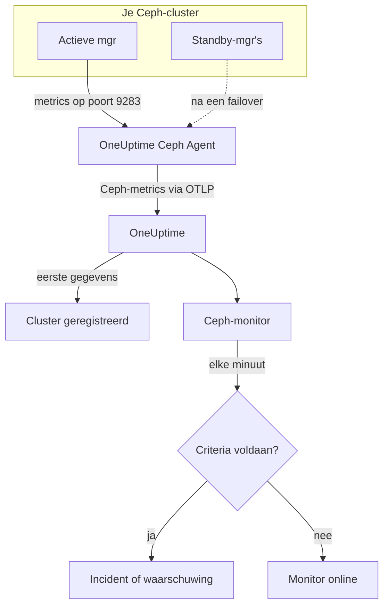

# Ceph-monitor

Een Ceph-monitor bewaakt één Ceph-cluster — de gezondheid, de health checks, het monitorquorum, de OSD's, pools en placement groups — en laat het je weten zodra de gezondheid achteruitgaat, een OSD uitvalt of de capaciteit krap wordt. Hij leest de `ceph_*`-metrics die de `prometheus`-module van de Ceph-mgr exporteert en die de OneUptime Ceph Agent verzamelt, dus er wordt niets van buitenaf afgetast.

:::cards
- [De monitor maken](#een-ceph-monitor-maken): Zes stappen in het dashboard.
- [Sjablonen](#kant-en-klare-waarschuwingssjablonen): 23 kant-en-klare waarschuwingen voor gezondheid, OSD's, placement groups en capaciteit.
- [Health checks](#reeksen-van-health-checks): Waarschuwen op elke Ceph-health check op naam.
- [Metrics](#verzamelde-metrics): Elke `ceph_*`-reeks waarop de monitor kan waarschuwen.
:::

## Hoe het werkt

De `prometheus`-module van de Ceph-mgr biedt de metrics van het cluster aan op poort 9283. De OneUptime Ceph Agent bevraagt elke 30 seconden elke mgr-daemon — de actieve antwoordt, de standby's geven niets terug tot ze het overnemen —, houdt de eigen labels van Ceph aan (`ceph_daemon`, `pool_id`) en stuurt de metrics via OTLP naar OneUptime, voorzien van de naam van het cluster, `ceph.cluster.name`. De eerste gegevens registreren het cluster.

Een Ceph-monitor hoort bij één cluster. Elke minuut voert hij zijn query uit op de metrics van dat cluster en vergelijkt hij het resultaat met zijn criteria.



## Voordat je begint

- **Schakel de `prometheus`-module van de mgr in** op het cluster:

  ```bash
  ceph mgr module enable prometheus
  ```

- **Installeer de Ceph Agent** op een machine die elke mgr-daemon op poort 9283 kan bereiken, en zet ze allemaal in `CEPH_MGR_ENDPOINTS`. De [handleiding van de Ceph Agent](/docs/telemetry/ceph) beschrijft de installatie.
- **Controleer of het cluster geregistreerd is.** Het verschijnt onder **Producten → Infrastructuur → Ceph → Alle clusters**, genoemd naar `CEPH_CLUSTER_NAME` van de agent, ongeveer een minuut na de eerste bevraging.
- **Voor waarschuwingen op health checks** heb je Ceph Quincy of nieuwer nodig. Oudere versies exporteren `ceph_health_detail` niet.

## Een Ceph-monitor maken

:::steps
### Een nieuwe monitor starten

Ga naar **Monitoren** en klik op **Monitor maken**.

### Ceph kiezen

Klik onder **Monitortype** op **Meer monitortypen** en kies **Ceph** onder **Infrastructuur**, of typ `ceph` in het zoekvak. Vul een **Naam** in — die wordt gebruikt in de titels van incidenten en waarschuwingen — en klik op **Volgende**.

### Het cluster kiezen

Kies onder **Ceph Monitor Configuration** het cluster in **Ceph Cluster**. Elk cluster dat gegevens heeft gestuurd, staat in de lijst.

### Kiezen wat je bewaakt

Kies een van de drie tabbladen:

- **Quick Setup** — klik op een [sjabloon](#kant-en-klare-waarschuwingssjablonen). Dat stelt de metrics, filters, aggregatie, het tijdsbereik en de drempels in, en vervangt de criteria hieronder door die van het sjabloon. Het **Tijdsbereik** kun je nog wijzigen.
- **Custom Metric** — kies één metric in **Ceph Metric** en stel daarna **Aggregatie** en **Tijdsbereik** in. **OSD** en **Pool ID** beperken hem tot één daemon of pool.
- **Geavanceerd** — bouw zelf query's en formules onder **Selecteer metrieken**, bijvoorbeeld een verhouding van gebruikte capaciteit uit `ceph_cluster_total_used_bytes / ceph_cluster_total_bytes`. Gebruik **Group by** `ceph_daemon` of `pool_id` om elke daemon of pool afzonderlijk te beoordelen.

### De criteria controleren

Open elk criterium onder **Monitorcriteria** en controleer **Metriek**, **Aggregatie**, **Voorwaarde** en **Threshold**. Een sjabloon vult ze in. Met **Custom Metric** of **Geavanceerd** begint de monitor met de [standaardcriteria](#standaardcriteria), die alleen merken dat een metric naar nul zakt, dus stel je eigen drempel in.

### De monitor aanmaken

Klik op **Monitor maken**. OneUptime opent de pagina van de monitor en evalueert hem elke minuut. Incidenten en waarschuwingen die hij maakt, staan ook op de pagina's **Incidenten** en **Waarschuwingen** van het cluster.
:::

> [!TIP]
> Om meerdere sjablonen tegelijk in te stellen, open je het cluster via **Producten → Infrastructuur → Ceph** en ga je naar **Recommendations**. Kies de sjablonen die je wilt en wie er wordt opgeroepen, en OneUptime maakt per sjabloon één monitor.

## Monitorinstellingen

| Veld | Tabblad | Wat het doet |
| --- | --- | --- |
| **Ceph Cluster** | Alle | Verplicht. Beperkt elke query tot `resource.ceph.cluster.name`. |
| **OSD** | Custom Metric, Geavanceerd | Optioneel. Exacte overeenkomst op het label `ceph_daemon`, bijvoorbeeld `osd.3`. |
| **Pool ID** | Custom Metric, Geavanceerd | Optioneel. Exacte overeenkomst op het label `pool_id`, bijvoorbeeld `2`. |
| **Ceph Metric** | Custom Metric | Eén metric uit de [catalogus](#verzamelde-metrics). |
| **Aggregatie** | Custom Metric | Hoe meetwaarden worden gecombineerd: **Gemiddelde**, **Maximum**, **Minimum**, **Som** of **Aantal**. Begint bij de gebruikelijke aggregatie van de metric. |
| **Tijdsbereik** | Alle | Het voortschuivende venster dat de query leest, van **Past 1 Minute** tot **Past 365 Days**. Een nieuwe monitor begint bij **Past 1 Minute**; sjablonen stellen hun eigen waarde in. |
| **Selecteer metrieken** | Geavanceerd | De querybouwer: **Metriek**, **Aggregate by**, **Filter by attributes**, **Group by**, plus **Metriek toevoegen** en **Formule toevoegen** om query's te combineren. |

Gegevensreeksen van pools dragen alleen het label `pool_id`: de naam van de pool bestaat alleen in `ceph_pool_metadata`. Filter en groepeer poolreeksen op `pool_id`, en zoek de naam op in `ceph_pool_metadata` als je die nodig hebt.

### Reeksen van health checks

`ceph_health_detail` exporteert **één reeks per actieve health check**, met de labels `name` (bijvoorbeeld `OSD_NEARFULL` of `RECENT_CRASH`) en `severity`. Een reeks bestaat alleen zolang de check afgaat, dus geen reeks betekent gezond. Om op een willekeurige Ceph-health check te waarschuwen, filter je op de `name`, ga je af op **Maximum** boven `0` en herstel je bij `0` met **Als geen gegevens** op **Treat As Zero** — precies zo zijn de sjablonen voor health checks gebouwd. `ceph_daemon_health_metrics` werkt op dezelfde manier per daemon, met een label `type` (bijvoorbeeld `SLOW_OPS`) en `ceph_daemon`.

## Kant-en-klare waarschuwingssjablonen

**Quick Setup** biedt 23 sjablonen voor clustergezondheid, OSD's, placement groups en capaciteit. Elk bouwt een complete monitor — query's, labelfilters, een groepering, een criterium dat afgaat en een dat herstelt. De drempels zijn startpunten die je kunt aanpassen.

Sjablonen lezen de laatste 5 minuten, tenzij de tabel iets anders zegt. Een criterium gaat alleen af als de voorwaarde geldt voor elke minuut van zijn venster, en een drempelcriterium herstelt pas 10% voorbij zijn drempel, zodat een waarde die rond de grens schommelt niet heen en weer springt. **Ernst** is het label dat de keuzelijst toont; het incident en de waarschuwing die een sjabloon maakt, beginnen op de zwaarste incident- en waarschuwingsernst van je project.

### Sjablonen voor clustergezondheid

| Sjabloon | Ernst | Bewaakt | Gaat af bij | Herstelt bij |
| --- | --- | --- | --- | --- |
| Cluster Health Error | Kritiek | `ceph_health_status`, Max, laatste minuut | 2 of meer: `HEALTH_ERR` | Onder 1,8: `HEALTH_WARN` of beter |
| Cluster Health Warning | Warning | `ceph_health_status`, Max | 1 of meer: `HEALTH_WARN` of slechter | Onder 0,9: `HEALTH_OK` |
| Monitor Quorum Degraded | Kritiek | `ceph_mon_quorum_status`, Min per `ceph_daemon`, laatste minuut | Een monitor zakt onder 1, buiten het quorum. Eén incident per monitor | Weer op 1 |
| Slow Operations | Warning | `ceph_healthcheck_slow_ops`, Max | Boven 0: de `SLOW_OPS`-check van het cluster is actief | Op 0 |
| Daemon Slow Operations | Warning | `ceph_daemon_health_metrics` voor `type = SLOW_OPS`, Max per `ceph_daemon` | Boven 0. Eén incident per OSD of monitor | De reeks verdwijnt |
| Daemon Crash | Kritiek | `ceph_health_detail` voor `name = RECENT_CRASH`, Max | De check is actief: er zijn niet-gearchiveerde crashes van daemons. De mgr heeft geen `ceph_crash_*`-metric, dus dit is het enige crashsignaal | De crashes zijn gearchiveerd |
| Monitor Clock Skew | Warning | `ceph_health_detail` voor `name = MON_CLOCK_SKEW`, Max | De check is actief: de klokken van de monitors wijken verder af dan toegestaan (standaard 0,05 s) | De check verdwijnt |
| Monitor Disk Critically Low | Kritiek | `ceph_health_detail` voor `name = MON_DISK_CRIT`, Max | De check is actief: de databaseschijf van een monitor heeft minder dan 5% vrij (standaard) | De check verdwijnt |
| Monitor Disk Space Low | Warning | `ceph_health_detail` voor `name = MON_DISK_LOW`, Max | De check is actief: minder dan 30% vrij (standaard) | De check verdwijnt |

### OSD-sjablonen

| Sjabloon | Ernst | Bewaakt | Gaat af bij | Herstelt bij |
| --- | --- | --- | --- | --- |
| OSD Down | Kritiek | `ceph_osd_up`, Min per `ceph_daemon` | Een OSD zakt onder 1. Eén incident per OSD | Weer op 1 |
| OSD Out | Warning | `ceph_osd_in`, Min per `ceph_daemon` | Een OSD zakt onder 1: uit de gegevensverdeling gehaald | Weer op 1 |
| OSD High Latency | Warning | `ceph_osd_apply_latency_ms`, Avg per `ceph_daemon` | Boven 100 ms. Eén incident per OSD | Op of onder 90 ms |
| OSD Slow Heartbeats | Warning | `ceph_health_detail` voor `name = OSD_SLOW_PING_TIME_FRONT` en `name = OSD_SLOW_PING_TIME_BACK`, Max | Een van de checks is actief: heartbeats op het publieke of het clusternetwerk zijn traag. De mgr exporteert geen meetwaarde voor pingtijd | Beide checks verdwijnen |

### Sjablonen voor placement groups

| Sjabloon | Ernst | Bewaakt | Gaat af bij | Herstelt bij |
| --- | --- | --- | --- | --- |
| Inactive Placement Groups | Kritiek | `ceph_pg_total` − `ceph_pg_active`, Max per `pool_id` | Boven 0: PG's kunnen geen I/O verwerken, dus clientverzoeken aan die PG's blijven hangen. Eén incident per pool | Op 0 |
| Degraded Placement Groups | Warning | `ceph_pg_degraded`, Max per `pool_id` | Boven 0: objecten hebben minder replica's dan ingesteld | Op 0 |
| Undersized Placement Groups | Warning | `ceph_pg_undersized`, Max per `pool_id` | Boven 0: PG's staan op minder OSD's dan hun aantal replica's | Op 0 |
| Damaged Placement Groups | Kritiek | `ceph_health_detail` voor `name = PG_DAMAGED` en `name = OSD_SCRUB_ERRORS`, Max | Een van de checks is actief: scrubbing heeft schade of leesfouten gevonden | Beide checks verdwijnen |

### Capaciteitssjablonen

| Sjabloon | Ernst | Bewaakt | Gaat af bij | Herstelt bij |
| --- | --- | --- | --- | --- |
| Cluster Near Full | Warning | `ceph_cluster_total_used_bytes` ÷ `ceph_cluster_total_bytes` × 100 | Boven 85%, de standaard nearfull-ratio van Ceph | Op of onder 76,5% |
| Cluster Full | Kritiek | Dezelfde ratio | Boven 95%, de standaard full-ratio van Ceph, waarbij schrijven in het hele cluster stopt | Op of onder 85,5% |
| Pool Near Full | Warning | `ceph_pool_stored` ÷ (`ceph_pool_stored` + `ceph_pool_max_avail`) × 100, per `pool_id` | Boven 85% van wat de pool kan bevatten. Eén incident per pool | Op of onder 76,5% |
| OSD Nearfull | Warning | `ceph_health_detail` voor `name = OSD_NEARFULL`, Max | De check is actief: een OSD is over de nearfull-drempel gegaan (standaard 85%). Losse OSD's lopen vol lang voordat het clustergemiddelde dat doet | De check verdwijnt |
| OSD Backfillfull | Warning | `ceph_health_detail` voor `name = OSD_BACKFILLFULL`, Max | De check is actief: backfill naar het OSD wordt geweigerd (standaard 90%), waardoor herstel stokt | De check verdwijnt |
| OSD Full | Kritiek | `ceph_health_detail` voor `name = OSD_FULL`, Max, laatste minuut | De check is actief: een OSD heeft de full-drempel bereikt (standaard 95%) en schrijven wordt geweigerd | De check verdwijnt |

- **Sjablonen voor uitval en quorum gebruiken het minimum**, zodat één uitgevallen OSD of één monitor buiten het quorum ze laat afgaan in plaats van verborgen te blijven achter de gezonde meerderheid.
- **Tel- en health-check-sjablonen gebruiken het maximum**, zodat één slechte bevraging genoeg is.
- **PG- en poolreeksen zijn er per pool**: er is geen meetwaarde voor het hele cluster, dus die sjablonen groeperen op `pool_id` en openen één incident per pool.
- **Capaciteitsratio's** nemen aan beide kanten de **Som**. Beide komen uit dezelfde bevraging van de mgr, dus het resultaat is een echt percentage. **Inactive Placement Groups** gebruikt in plaats daarvan **Maximum** per pool, omdat een som bij een aftrekking de bevragingen zou optellen.
- **Health-check-sjablonen** herstellen wanneer de check verdwijnt: hun herstelcriteria tellen een ontbrekende reeks als 0.

Sommige waarschuwingen hebben geen sjabloon. Een onevenwichtige PG-verdeling vraagt om statistiek over meerdere reeksen die criteria niet kunnen berekenen. Een capaciteitsprognose vraagt om een groeicurve, die het dashboard van het cluster in plaats daarvan tekent. Voorspelde schijfuitval en achterstallige scrubbing hebben geen mgr-metric, en NVMe-oF, RBD-mirroring en cephadm hebben andere exporters nodig.

## Verzamelde metrics

De agent bevraagt elke 30 seconden elke mgr-daemon en houdt de eigen labels van Ceph aan, dus reeksen per daemon dragen `ceph_daemon` (`osd.3`, `mon.a`) en reeksen per pool dragen `pool_id`.

### Metrics voor clustergezondheid

| Metric | Eenheid | Beschrijving |
| --- | --- | --- |
| `ceph_health_status` | — | Algemene gezondheid: 0 = `HEALTH_OK`, 1 = `HEALTH_WARN`, 2 = `HEALTH_ERR`. |
| `ceph_health_detail` | aantal | Eén reeks per **actieve** health check, met de labels `name` en `severity`. Alleen vanaf Quincy. |
| `ceph_healthcheck_slow_ops` | aantal | Trage OSD- en monitorbewerkingen die de check `SLOW_OPS` meldt. |
| `ceph_daemon_health_metrics` | aantal | Gezondheidsmetrics per daemon, met `type` (bijvoorbeeld `SLOW_OPS`) en `ceph_daemon`. |
| `ceph_mon_quorum_status` | aantal | 1 als de monitor in het quorum zit, per `ceph_daemon` (bijvoorbeeld `mon.a`). |
| `ceph_mon_metadata` | aantal | Metadata van de monitor, altijd 1. Tel ze op om monitors te tellen. |
| `ceph_cluster_total_bytes` | bytes | Totale ruwe capaciteit. |
| `ceph_cluster_total_used_bytes` | bytes | Gebruikte ruwe capaciteit. |

### OSD-metrics

| Metric | Eenheid | Beschrijving |
| --- | --- | --- |
| `ceph_osd_up` | aantal | 1 als het OSD draait, per `ceph_daemon` (bijvoorbeeld `osd.3`). |
| `ceph_osd_in` | aantal | 1 als het OSD deel uitmaakt van de gegevensverdeling. |
| `ceph_osd_apply_latency_ms` | ms | Tijd om een bewerking op de onderliggende opslag toe te passen. |
| `ceph_osd_commit_latency_ms` | ms | Tijd om een bewerking in het journal of de WAL vast te leggen. |
| `ceph_osd_stat_bytes` | bytes | Ruwe capaciteit van het apparaat van het OSD. |
| `ceph_osd_stat_bytes_used` | bytes | Gebruikte ruwe bytes op het OSD. Vergelijk met het totaal om ongelijk gevulde of bijna volle OSD's te vinden. |
| `ceph_osd_numpg` | aantal | Placement groups op het OSD. |
| `ceph_osd_metadata` | aantal | Metadata van het OSD (hostnaam, apparaatklasse, versie), altijd 1. Tel ze op om OSD's te tellen. |

### Poolmetrics

| Metric | Eenheid | Beschrijving |
| --- | --- | --- |
| `ceph_pool_stored` | bytes | Gebruikersgegevens die in de pool zijn opgeslagen. |
| `ceph_pool_max_avail` | bytes | Bytes die nog naar de pool kunnen worden geschreven, gezien het replicatie- of erasure-codingprofiel. |
| `ceph_pool_objects` | aantal | Objecten in de pool. |
| `ceph_pool_rd` | ops | Leesbewerkingen op de pool. Een teller over de hele levensduur. |
| `ceph_pool_wr` | ops | Schrijfbewerkingen op de pool. Een teller over de hele levensduur. |
| `ceph_pool_rd_bytes` | bytes | Uit de pool gelezen bytes. Een teller over de hele levensduur. |
| `ceph_pool_wr_bytes` | bytes | Naar de pool geschreven bytes. Een teller over de hele levensduur. |
| `ceph_pool_metadata` | aantal | Metadata van de pool, altijd 1 — de enige reeks die `pool_id` aan een naam koppelt. |

### Metrics voor placement groups

Elke `ceph_pg_*`-reeks is per pool, met het label `pool_id`; tel op over de pools voor een totaal van het hele cluster.

| Metric | Eenheid | Beschrijving |
| --- | --- | --- |
| `ceph_pg_total` | aantal | Placement groups in de pool. |
| `ceph_pg_active` | aantal | PG's in de toestand `active`, die I/O kunnen verwerken. |
| `ceph_pg_clean` | aantal | PG's in de toestand `clean`, volledig gerepliceerd. |
| `ceph_pg_degraded` | aantal | PG's in de toestand `degraded`. |
| `ceph_pg_undersized` | aantal | PG's in de toestand `undersized`. |
| `ceph_num_objects_degraded` | aantal | Objecten met minder replica's dan ingesteld. |
| `ceph_num_objects_misplaced` | aantal | Objecten die niet staan waar CRUSH ze wil hebben. De gegevens zijn veilig; alleen de plaatsing klopt niet. |

## Bewakingscriteria

Een criterium vergelijkt een van de query's of formules van de monitor met een drempel. De criteria van een Ceph-monitor hebben geen **Filtertype**: elke regel controleert de waarde van de metric, met deze velden.

| Veld | Wat het doet |
| --- | --- |
| **Metriek** | De query of formule die wordt gecontroleerd, via de variabelenaam. |
| **Aggregatie** | Hoe de waarden in het venster één antwoord worden: **Gemiddelde**, **Som**, **Maximum Value**, **Minimum Value**, **All Values** (elke waarde moet voldoen) of **Any Value** (één is genoeg). |
| **Voorwaarde** | **Greater Than**, **Less Than**, **Greater Than Or Equal To**, **Less Than Or Equal To** of **Equal To** — of een anomalievoorwaarde: **Anomalously High**, **Anomalously Low** of **Anomalous**. |
| **Threshold** | De waarde om mee te vergelijken. Ernaast staat een eenhedenlijst als de metric een eenheid heeft. Niet zichtbaar bij anomalievoorwaarden. |
| **Gevoeligheid** | Alleen bij anomalievoorwaarden. **Low** (4σ), **Medium** (3σ, standaard) of **High** (2σ). |
| **Baseline-venster** | Alleen bij anomalievoorwaarden. 14 dagen (standaard), 28, 60 of 90 dagen geschiedenis. |
| **Als geen gegevens** | Onder **Meer velden**. Wat er gebeurt als het venster geen meetwaarden heeft: **Ignore** (standaard), **Treat As Zero** of **Trigger**. |

Anomalievoorwaarden vergelijken elke waarde met hetzelfde uur van de week in de baseline. Ze blijven in de toestand "Learning" en melden niets totdat het baseline-venster genoeg geschiedenis bevat.

Elk criterium legt ook vast wat er gebeurt als het overeenkomt: de monitorstatus wijzigen, een waarschuwing maken of een incident melden. Criteria worden van boven naar beneden gecontroleerd, en het eerste dat overeenkomt, beslist.

### Standaardcriteria

Een monitor die je niet vanuit een sjabloon bouwt, begint met twee criteria:

| Volgorde | Criterium | Komt overeen als | Dan |
| --- | --- | --- | --- |
| 1 | Check if _monitornaam_ is offline | Een waarde van de eerste query is `0` | Zet de monitor op **Offline** en meldt het incident "_monitornaam_ is offline", dat zichzelf oplost wanneer de monitor herstelt. |
| 2 | Check if _monitornaam_ is online | Een waarde ligt boven `0` | Zet de monitor op **Operationeel**. |

Deze standaarden passen bij weinig Ceph-metrics: `ceph_health_status` is 0 als het cluster gezond is. Kies een sjabloon of stel je eigen criteria in.

> [!IMPORTANT]
> Stilte komt met geen van beide criteria overeen: een cluster dat geen gegevens meer stuurt, laat de monitor zoals hij was. Om te horen wanneer er geen gegevens meer komen, zet je **Als geen gegevens** in een criterium op **Trigger**.

## Problemen oplossen

:::details Het cluster staat niet in de lijst Ceph Cluster
Clusters registreren zichzelf op basis van de gegevens van de agent. Controleer of de agent draait en gegevens verstuurt (zie de [handleiding van de Ceph Agent](/docs/telemetry/ceph)) en of `CEPH_CLUSTER_NAME` is ingesteld.
:::

:::details Na een failover van de mgr komen er geen metrics meer
De agent moet **elke** mgr-daemon bevragen, niet alleen de actieve: standby's geven niets terug tot ze het overnemen. Zet elke mgr in `CEPH_MGR_ENDPOINTS`.
:::

:::details ceph_health_status is 1, maar er gaat niets af
Controleer of het criterium **Greater Than Or Equal To** `1` gebruikt en niet **Greater Than**, en of het **Tijdsbereik** van de monitor minstens één bevraging van 30 seconden beslaat.
:::

:::details Health-check-sjablonen gaan nooit af
De sjablonen die `ceph_health_detail` bewaken — Daemon Crash, Monitor Clock Skew, OSD Nearfull, OSD Backfillfull, OSD Full, de twee sjablonen voor monitorschijven, Damaged Placement Groups en OSD Slow Heartbeats — hebben de `prometheus`-module van de mgr uit Quincy of nieuwer nodig. Controleer terwijl een check actief is of de reeks bestaat:

```bash
curl http://ACTIVE_MGR:9283/metrics | grep ceph_health_detail
```

Reeksen van health checks, ook `ceph_daemon_health_metrics`, bestaan alleen zolang een check afgaat, dus dat je er geen vindt terwijl het cluster gezond is, is te verwachten.
:::

:::details Tellers zoals ceph_pool_wr_bytes stijgen alleen maar
I/O-reeksen van pools zijn tellers over de hele levensduur, en criteria vergelijken ruwe waarden: er is geen rate-operator, en **Convert to per-second rate** in de querybouwer verandert alleen de grafiek. Toon ze als rate, of waarschuw op hun groei met een formule, zoals een **Maximum**-query min een **Minimum**-query van dezelfde teller.
:::

## Volgende stappen

:::cards
- [Ceph Agent](/docs/telemetry/ceph): De agent installeren en upgraden die deze monitor leest.
- [Proxmox-monitor](/docs/monitor/proxmox-monitor): Het Proxmox VE-cluster bewaken dat de opslag gebruikt.
- [Storage-array-monitor](/docs/monitor/storage-array-monitor): Dezelfde soort monitor voor Pure Storage-arrays.
- [Incidenten](/docs/incidents/index): Wat er gebeurt nadat een criterium een incident heeft gemeld.
:::
